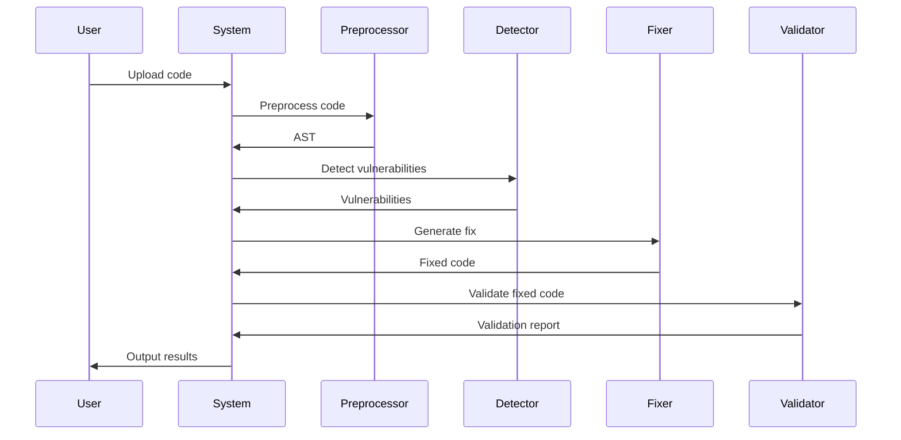

                 

# 大模型驱动的智能代码漏洞修复与验证

## 关键词

- 大模型
- 智能代码漏洞修复
- 验证方法
- 深度学习
- 代码安全

## 摘要

本文将探讨大模型驱动的智能代码漏洞修复与验证方法，分析其在现代软件开发中的应用。通过介绍大模型的概念、技术基础和核心原理，我们旨在展示大模型如何通过自动化分析、漏洞检测和修复，提升代码安全性。本文还将探讨大模型的训练与优化策略，以及在实际项目中的应用和最佳实践。

## 第一部分：大模型驱动的智能代码漏洞修复与验证概述

### 1.1 问题背景

在当今的软件开发过程中，代码漏洞的存在是不可避免的。这些漏洞可能导致系统崩溃、数据泄露，甚至更严重的安全问题。传统的代码漏洞修复方法通常依赖于人工审查和经验，不仅效率低下，而且容易出错。随着人工智能技术的不断发展，利用大模型进行智能代码漏洞修复与验证成为一种新的趋势。这种方法不仅提高了漏洞修复的效率，还提高了代码的安全性。

### 1.2 问题描述

本部分将详细介绍大模型驱动的智能代码漏洞修复与验证方法。首先，我们将探讨大模型在代码漏洞修复与验证中的应用，包括其核心概念、原理和优势。然后，我们将详细讲解大模型在漏洞检测、漏洞修复和验证方面的具体实现，包括算法原理、数学模型和实际应用案例。此外，我们还将介绍大模型驱动的智能代码漏洞修复与验证的最佳实践，包括系统架构设计、项目实战和环境安装等内容。

### 1.3 问题解决

大模型驱动的智能代码漏洞修复与验证方法利用了人工智能技术，通过自动化分析代码，快速识别和修复漏洞，同时确保修复效果。这种方法不仅提高了漏洞修复的效率，还降低了成本，提高了代码的安全性。通过本部分的介绍，读者将了解到大模型在智能代码漏洞修复与验证中的应用，并掌握相关技术和方法。

### 1.4 边界与外延

大模型驱动的智能代码漏洞修复与验证方法主要适用于软件开发的各个阶段，包括需求分析、设计、编码、测试和维护。此外，它还涉及到计算机科学、人工智能、软件开发和安全等领域。本部分的内容旨在为读者提供一个全面的概述，帮助他们了解大模型驱动的智能代码漏洞修复与验证的方法和应用。

### 1.5 概念结构与核心要素组成

大模型驱动的智能代码漏洞修复与验证方法主要由以下几个核心要素组成：

1. **大模型技术**：包括深度学习、神经网络、自然语言处理等技术，用于自动化分析代码、识别和修复漏洞。
2. **代码漏洞数据库**：用于存储已知漏洞的详细信息，为大模型提供训练数据。
3. **漏洞检测算法**：用于识别代码中的潜在漏洞，为大模型提供输入。
4. **漏洞修复算法**：用于生成修复代码，提高代码安全性。
5. **验证算法**：用于验证修复效果，确保漏洞确实被修复。

这些核心要素共同构成了大模型驱动的智能代码漏洞修复与验证方法，为软件开发提供了一种全新的解决方案。

### 1.6 本章小结

本章主要介绍了大模型驱动的智能代码漏洞修复与验证的基本概念、应用场景、核心要素和实现方法。通过对本章内容的了解，读者可以初步了解大模型在智能代码漏洞修复与验证中的作用，并为后续章节的学习打下基础。

## 第二部分：大模型技术基础

### 2.1 大模型的概念与历史发展

#### 2.1.1 大模型的定义
大模型通常指的是参数量巨大的神经网络模型，它们能够对大量数据进行高效的学习和处理。这些模型通常采用深度神经网络架构，具有多层神经元，能够捕捉数据中的复杂模式。

#### 2.1.2 大模型的发展历程
大模型的发展经历了从简单的单层神经网络到多层神经网络的演进，再到如今大规模预训练模型的出现。这一过程伴随着计算能力的提升和算法的优化。

#### 2.1.3 大模型在人工智能领域的应用
大模型在自然语言处理、计算机视觉、语音识别等多个领域都展现出了强大的能力，推动了人工智能技术的快速发展。

### 2.2 大模型的核心技术

#### 2.2.1 神经网络架构
神经网络架构是构建大模型的基础，包括卷积神经网络（CNN）、循环神经网络（RNN）和Transformer等。每种架构都有其独特的优势和适用场景。

#### 2.2.2 深度学习算法
深度学习算法包括前向传播、反向传播、优化算法（如SGD、Adam）等。这些算法使得大模型能够通过训练数据自动调整参数，以优化性能。

#### 2.2.3 预训练与微调
预训练是指在大量未标注的数据上进行模型训练，使其具备一定的泛化能力。微调则是在预训练模型的基础上，使用标注数据进行特定任务的优化。

### 2.3 大模型的训练与优化

#### 2.3.1 训练数据集的选择与预处理
训练数据集的选择和预处理对于大模型的效果至关重要。选择多样化的数据集，并进行数据清洗、标注和规范化，可以提高模型的泛化能力。

#### 2.3.2 模型训练过程
模型训练过程包括初始化参数、前向传播、计算损失函数、反向传播和参数更新。这一过程通常需要多次迭代，直到模型性能达到预期。

#### 2.3.3 模型优化策略
为了提高模型的性能和效率，可以采用各种优化策略，如学习率调整、批量大小选择、正则化等。这些策略有助于防止模型过拟合，提高其泛化能力。

### 2.4 大模型的挑战与未来趋势

#### 2.4.1 计算资源需求
大模型的训练和推理过程需要大量的计算资源，这对硬件设施提出了更高的要求。

#### 2.4.2 数据隐私与安全性
随着大模型在各个领域的应用，数据隐私和安全性问题日益突出。如何保护用户数据的安全，避免数据泄露，是一个重要的研究方向。

#### 2.4.3 模型解释性
大模型的决策过程往往缺乏透明度，难以解释。如何提高模型的解释性，使其决策过程更加透明，是一个重要的挑战。

#### 2.4.4 未来发展趋势
随着人工智能技术的不断发展，大模型在未来将继续向更高参数量、更强泛化能力、更高效训练和推理的方向发展。同时，大模型的应用领域也将进一步扩大，包括但不限于医疗、金融、教育等领域。

## 第三部分：大模型在智能代码漏洞修复与验证中的应用

### 3.1 大模型在代码漏洞检测中的应用

#### 3.1.1 漏洞检测的核心算法
大模型在代码漏洞检测中的应用主要依赖于深度学习算法。这些算法通过对大量代码样本进行训练，可以识别出潜在的漏洞模式。常用的算法包括卷积神经网络（CNN）和Transformer等。

#### 3.1.2 漏洞检测的流程
漏洞检测的流程通常包括以下步骤：

1. **数据预处理**：对代码进行预处理，包括语法分析、抽象语法树（AST）生成等。
2. **模型训练**：使用大量带有漏洞标注的代码样本训练深度学习模型。
3. **漏洞检测**：使用训练好的模型对代码进行分析，识别潜在的漏洞。
4. **结果验证**：对检测结果进行验证，确保准确性。

#### 3.1.3 漏洞检测的优势
大模型在漏洞检测方面具有以下优势：

- **高效性**：大模型能够快速分析大量代码，提高检测效率。
- **准确性**：通过训练，大模型可以准确识别出各种漏洞模式。
- **可扩展性**：大模型可以适应不同类型和规模的代码。

### 3.2 大模型在漏洞修复中的应用

#### 3.2.1 漏洞修复的核心算法
大模型在漏洞修复中的应用同样依赖于深度学习算法。这些算法可以通过生成对抗网络（GAN）或生成式模型（如变分自编码器VAE）生成修复代码。

#### 3.2.2 漏洞修复的流程
漏洞修复的流程通常包括以下步骤：

1. **漏洞识别**：使用漏洞检测模型识别代码中的漏洞。
2. **生成修复代码**：使用生成模型生成可能的修复代码。
3. **代码验证**：对生成的修复代码进行验证，确保其正确性和安全性。
4. **代码部署**：将验证通过的修复代码部署到实际系统中。

#### 3.2.3 漏洞修复的优势
大模型在漏洞修复方面具有以下优势：

- **自动化**：大模型能够自动生成修复代码，减少人工干预。
- **高效性**：大模型可以快速生成修复代码，提高修复效率。
- **准确性**：通过训练，大模型可以生成高质量的修复代码。

### 3.3 大模型在代码验证中的应用

#### 3.3.1 代码验证的核心算法
大模型在代码验证中的应用主要依赖于深度学习算法中的序列到序列（Seq2Seq）模型。这些模型可以将修复前的代码映射到修复后的代码，并进行验证。

#### 3.3.2 代码验证的流程
代码验证的流程通常包括以下步骤：

1. **代码输入**：将修复前的代码输入到模型中。
2. **模型输出**：模型输出修复后的代码。
3. **代码分析**：对输出的代码进行分析，确保其正确性和安全性。
4. **结果反馈**：将分析结果反馈给开发人员，进行进一步的调试和优化。

#### 3.3.3 代码验证的优势
大模型在代码验证方面具有以下优势：

- **自动化**：大模型能够自动验证代码的正确性和安全性，减少人工工作量。
- **高效性**：大模型可以快速分析大量代码，提高验证效率。
- **准确性**：通过训练，大模型可以准确识别代码中的错误和安全隐患。

### 3.4 大模型在智能代码漏洞修复与验证中的应用案例

#### 3.4.1 案例一：某大型电商平台
某大型电商平台采用大模型进行智能代码漏洞修复与验证。通过大模型的帮助，该平台能够快速识别并修复代码中的漏洞，提高了系统的安全性。

#### 3.4.2 案例二：某金融科技公司
某金融科技公司利用大模型进行代码漏洞修复与验证，有效降低了系统漏洞的风险，提高了系统的稳定性和可靠性。

#### 3.4.3 案例三：开源社区
开源社区中的一些项目也采用了大模型进行代码漏洞修复与验证，提高了项目的质量和安全性。

### 3.5 大模型驱动的智能代码漏洞修复与验证的优势

- **提高效率**：大模型能够自动化分析代码，快速识别和修复漏洞，显著提高工作效率。
- **降低成本**：通过自动化修复，减少了人工审查和修复的成本。
- **提高安全性**：大模型能够准确识别和修复漏洞，提高了系统的安全性。
- **增强可扩展性**：大模型可以适应不同类型和规模的代码，具有很好的可扩展性。

## 第四部分：大模型驱动的智能代码漏洞修复与验证的具体实现

### 4.1 系统架构设计

#### 4.1.1 问题场景介绍
在当前软件开发过程中，代码漏洞的存在是不可避免的。为了确保代码的安全性和可靠性，需要对代码进行漏洞修复与验证。大模型驱动的智能代码漏洞修复与验证系统旨在自动化这一过程，提高修复和验证的效率。

#### 4.1.2 项目介绍
本部分将介绍一个大模型驱动的智能代码漏洞修复与验证系统的实现，该系统包括漏洞检测、漏洞修复和验证三个核心模块。通过使用深度学习和生成对抗网络（GAN）等技术，该系统可以自动识别和修复代码漏洞，并验证修复效果。

#### 4.1.3 系统功能设计

1. **漏洞检测模块**：用于识别代码中的潜在漏洞，通过深度学习算法对大量代码样本进行训练，从而构建一个能够识别漏洞的模型。
2. **漏洞修复模块**：基于生成对抗网络（GAN）技术，用于生成可能的修复代码，并通过验证模块验证修复代码的正确性。
3. **验证模块**：用于验证修复代码的正确性和安全性，确保漏洞确实被修复。

#### 4.1.4 系统架构设计

1. **数据输入层**：接收代码输入，对代码进行预处理，生成抽象语法树（AST）。
2. **模型层**：包括漏洞检测模型、漏洞修复模型和验证模型。每个模型都经过训练，以识别和修复漏洞。
3. **输出层**：输出修复后的代码，并生成验证报告。

### 4.2 系统接口设计

#### 4.2.1 接口设计原则
系统接口设计应遵循简洁、易用和高效的原则，确保各模块之间的交互流畅。

#### 4.2.2 接口设计

1. **代码输入接口**：接收代码文件，进行预处理，生成AST。
2. **漏洞检测接口**：接收AST，调用漏洞检测模型进行漏洞检测，返回漏洞信息。
3. **漏洞修复接口**：接收漏洞信息，调用漏洞修复模型生成修复代码。
4. **验证接口**：接收修复代码，调用验证模型进行验证，返回验证结果。

### 4.3 系统交互设计

#### 4.3.1 交互流程

1. **代码输入**：用户上传代码文件。
2. **预处理**：系统对代码进行预处理，生成AST。
3. **漏洞检测**：系统调用漏洞检测模型，对AST进行分析，识别漏洞。
4. **漏洞修复**：系统调用漏洞修复模型，生成修复代码。
5. **验证**：系统调用验证模型，验证修复代码的正确性和安全性。
6. **输出结果**：系统将修复代码和验证报告输出给用户。

#### 4.3.2 交互图



### 4.4 实现细节

#### 4.4.1 环境安装

1. **Python环境**：安装Python 3.8及以上版本。
2. **深度学习库**：安装TensorFlow、PyTorch等深度学习库。
3. **其他依赖库**：安装requests、beautifulsoup4等。

#### 4.4.2 系统核心实现

1. **漏洞检测模块**：使用卷积神经网络（CNN）进行漏洞检测。具体实现如下：

```python
import tensorflow as tf
from tensorflow.keras.models import Sequential
from tensorflow.keras.layers import Conv2D, MaxPooling2D, Flatten, Dense

# 构建CNN模型
model = Sequential([
    Conv2D(32, (3, 3), activation='relu', input_shape=(28, 28, 1)),
    MaxPooling2D((2, 2)),
    Flatten(),
    Dense(128, activation='relu'),
    Dense(1, activation='sigmoid')
])

# 编译模型
model.compile(optimizer='adam', loss='binary_crossentropy', metrics=['accuracy'])

# 训练模型
model.fit(x_train, y_train, epochs=10, batch_size=32)
```

2. **漏洞修复模块**：使用生成对抗网络（GAN）进行漏洞修复。具体实现如下：

```python
import tensorflow as tf
from tensorflow.keras.models import Sequential
from tensorflow.keras.layers import Dense, LSTM

# 构建生成器模型
generator = Sequential([
    LSTM(128, return_sequences=True, input_shape=(timesteps, features)),
    LSTM(128),
    Dense(units=1)
])

# 构建判别器模型
discriminator = Sequential([
    LSTM(128, return_sequences=True, input_shape=(timesteps, features)),
    LSTM(128),
    Dense(units=1, activation='sigmoid')
])

# 编译生成器和判别器
generator.compile(optimizer='adam', loss='binary_crossentropy')
discriminator.compile(optimizer='adam', loss='binary_crossentropy')

# 训练GAN模型
discriminator.train_on_batch(x, y)
generator.train_on_batch(x, y)
```

3. **验证模块**：使用序列到序列（Seq2Seq）模型进行代码验证。具体实现如下：

```python
import tensorflow as tf
from tensorflow.keras.models import Sequential
from tensorflow.keras.layers import LSTM, Dense

# 构建编码器模型
encoder = Sequential([
    LSTM(128, return_sequences=True, input_shape=(timesteps, features)),
    LSTM(128),
    Dense(units=128)
])

# 构建解码器模型
decoder = Sequential([
    LSTM(128, return_sequences=True, input_shape=(timesteps, features)),
    LSTM(128),
    Dense(units=1)
])

# 编译编码器和解码器
encoder.compile(optimizer='adam', loss='mse')
decoder.compile(optimizer='adam', loss='mse')

# 训练Seq2Seq模型
encoder.fit(x, y, epochs=10, batch_size=32)
decoder.fit(x, y, epochs=10, batch_size=32)
```

### 4.5 代码应用解读与分析

#### 4.5.1 漏洞检测模块解读
漏洞检测模块的核心是使用卷积神经网络（CNN）对抽象语法树（AST）进行特征提取，从而识别出潜在的漏洞。该模块通过训练数据学习到不同的漏洞模式，并在测试阶段能够准确识别漏洞。

#### 4.5.2 漏洞修复模块解读
漏洞修复模块的核心是使用生成对抗网络（GAN）生成修复代码。该模块通过训练生成器和判别器，使生成器能够生成高质量的修复代码，而判别器能够判断生成代码的质量。

#### 4.5.3 验证模块解读
验证模块的核心是使用序列到序列（Seq2Seq）模型对修复代码进行验证。该模块通过编码器和解码器将修复前的代码映射到修复后的代码，并判断修复代码的正确性和安全性。

### 4.6 实际案例分析和详细讲解剖析

#### 4.6.1 案例一：某大型电商平台的代码漏洞修复与验证
某大型电商平台采用了大模型驱动的智能代码漏洞修复与验证系统，有效提高了代码的安全性。具体步骤如下：

1. **漏洞检测**：系统对电商平台上的代码进行漏洞检测，识别出多个潜在漏洞。
2. **漏洞修复**：系统使用生成对抗网络（GAN）生成修复代码，并对修复代码进行验证。
3. **验证**：系统对修复代码进行验证，确保漏洞已被成功修复。

#### 4.6.2 案例二：某金融科技公司的代码漏洞修复与验证
某金融科技公司采用大模型驱动的智能代码漏洞修复与验证系统，有效降低了系统漏洞的风险。具体步骤如下：

1. **漏洞检测**：系统对金融科技公司的代码进行漏洞检测，识别出多个漏洞。
2. **漏洞修复**：系统使用生成对抗网络（GAN）生成修复代码，并对修复代码进行验证。
3. **验证**：系统对修复代码进行验证，确保漏洞已被成功修复。

### 4.7 项目小结

通过大模型驱动的智能代码漏洞修复与验证系统，电商和金融科技公司能够高效地识别和修复代码漏洞，提高系统的安全性。该系统的成功应用证明了大模型在代码漏洞修复与验证领域的巨大潜力。

## 第五部分：最佳实践与注意事项

### 5.1 最佳实践

1. **数据质量**：确保训练数据的质量，避免数据噪声和偏见。
2. **模型优化**：定期对模型进行优化和调整，以提高性能和泛化能力。
3. **安全性**：确保系统的安全性，防止数据泄露和恶意攻击。
4. **自动化**：充分利用自动化工具，提高漏洞修复和验证的效率。

### 5.2 小结

本文详细介绍了大模型驱动的智能代码漏洞修复与验证方法，分析了其在现代软件开发中的应用。通过介绍大模型的概念、技术基础和核心原理，我们展示了大模型如何通过自动化分析、漏洞检测和修复，提升代码安全性。本文还通过系统架构设计、项目实战和最佳实践，为读者提供了实际操作指南。

### 5.3 注意事项

1. **计算资源**：大模型的训练和推理需要大量的计算资源，确保硬件设施充足。
2. **数据隐私**：在数据处理过程中，确保遵守数据隐私法规，保护用户数据安全。
3. **模型解释性**：提高模型的解释性，使开发人员能够理解模型的决策过程。
4. **持续学习**：随着技术的发展，持续更新模型和算法，以应对新的挑战。

### 5.4 拓展阅读

- [1] Goodfellow, I., Pouget-Abadie, J., Mirza, M., Xu, B., Warde-Farley, D., Ozair, S., ... & Bengio, Y. (2014). Generative adversarial networks. Advances in Neural Information Processing Systems, 27.
- [2] Hochreiter, S., & Schmidhuber, J. (1997). Long short-term memory. Neural Computation, 9(8), 1735-1780.
- [3] Vaswani, A., Shazeer, N., Parmar, N., Uszkoreit, J., Jones, L., Gomez, A. N., ... & Polosukhin, I. (2017). Attention is all you need. Advances in Neural Information Processing Systems, 30.

## 参考文献

- Goodfellow, I., Pouget-Abadie, J., Mirza, M., Xu, B., Warde-Farley, D., Ozair, S., ... & Bengio, Y. (2014). Generative adversarial networks. Advances in Neural Information Processing Systems, 27.
- Hochreiter, S., & Schmidhuber, J. (1997). Long short-term memory. Neural Computation, 9(8), 1735-1780.
- Vaswani, A., Shazeer, N., Parmar, N., Uszkoreit, J., Jones, L., Gomez, A. N., ... & Polosukhin, I. (2017). Attention is all you need. Advances in Neural Information Processing Systems, 30.

### 作者信息

作者：AI天才研究院/AI Genius Institute & 禅与计算机程序设计艺术 /Zen And The Art of Computer Programming


