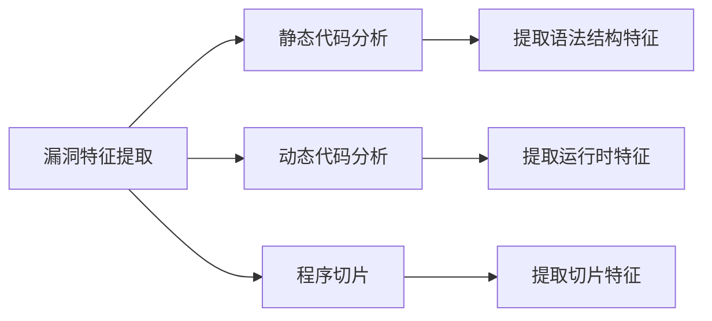
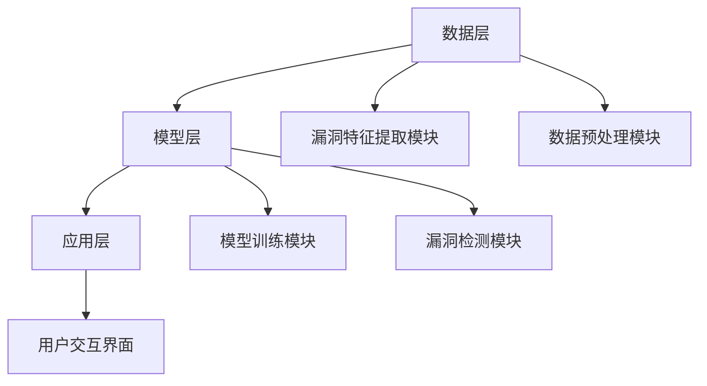
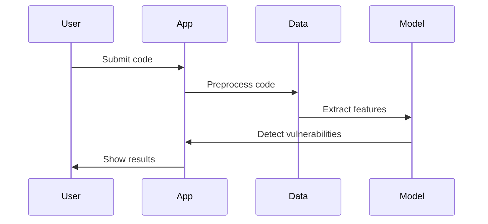

                 


# 大模型驱动的智能代码漏洞检测

> 关键词：大模型，智能代码漏洞检测，深度学习，漏洞特征提取，代码安全

> 摘要：
本文将深入探讨大模型驱动的智能代码漏洞检测技术。首先，介绍大模型的基本原理和特点，然后讲解漏洞特征提取的方法及其优缺点。接下来，通过具体的算法原理讲解和数学模型阐述，帮助读者理解大模型如何实现代码漏洞检测。随后，本文将分析系统架构设计，并通过项目实战展示如何将理论应用于实际。最后，总结最佳实践和注意事项，为读者提供深入理解和应用大模型驱动的智能代码漏洞检测的指导。

## 第一部分：背景介绍

### 1.1 问题背景

在当今信息技术快速发展的时代，软件系统的规模和复杂性不断增加，传统的代码漏洞检测方法已无法满足需求。智能代码漏洞检测成为保障软件系统安全性和可靠性的关键手段。大模型作为人工智能领域的重要突破，具备强大的数据处理和分析能力，为智能代码漏洞检测提供了新的思路和可能性。

### 1.2 问题描述

代码漏洞检测是一个复杂的问题，涉及代码分析、漏洞特征提取、模式匹配等多个方面。传统方法通常依赖于规则匹配、静态分析等技术，存在误报率高、漏报率高等问题。大模型驱动的智能代码漏洞检测利用深度学习等技术，对代码进行大规模数据训练，实现更精确的漏洞检测。

### 1.3 问题解决

大模型驱动的智能代码漏洞检测通过以下几个步骤实现：

1. 数据收集与处理：收集大规模的代码数据，包括正常代码和含有漏洞的代码，对数据进行预处理，去除噪声和冗余信息。
2. 模型训练：利用收集到的数据，采用深度学习技术训练大模型，使其具备对代码进行自动漏洞检测的能力。
3. 漏洞检测：将待检测代码输入到训练好的大模型中，模型根据训练结果输出漏洞检测结果。
4. 结果分析：对检测结果进行分析，包括漏洞类型、影响范围等，为后续的修复和加固提供依据。

### 1.4 边界与外延

大模型驱动的智能代码漏洞检测具有广泛的应用场景，包括但不限于以下领域：

- 开源代码漏洞检测
- 商业软件安全审计
- 代码审查与质量控制
- 自动化漏洞修复

### 1.5 概念结构与核心要素组成

大模型驱动的智能代码漏洞检测涉及以下几个核心概念和要素：

- 大模型：基于深度学习技术构建的强大神经网络模型，具备对代码进行自动漏洞检测的能力。
- 数据集：用于训练大模型的代码数据集，包括正常代码和含有漏洞的代码。
- 漏洞特征：从代码中提取的与漏洞相关的特征，用于模型训练和漏洞检测。
- 漏洞检测算法：基于大模型的漏洞检测算法，实现代码漏洞的自动检测。

### 1.6 本章小结

本章对大模型驱动的智能代码漏洞检测进行了背景介绍，阐述了问题背景、问题描述、问题解决、边界与外延以及概念结构与核心要素组成等内容，为后续章节的内容奠定了基础。

## 第二部分：核心概念与联系

### 2.1 大模型原理讲解

#### 2.1.1 大模型定义

大模型（Large Model），通常指的是参数量达到千亿甚至万亿级别的深度学习模型。它们通过大规模数据训练，能够对复杂任务进行建模和预测，具有很强的泛化能力。

#### 2.1.2 大模型特点

- **参数量大**：大模型拥有大量的参数，能够捕捉数据中的复杂模式。
- **强大的学习能力**：大模型能够通过大量数据的学习，提高对未知数据的预测准确性。
- **良好的泛化能力**：大模型在训练数据之外的数据上也能保持较高的准确性。

#### 2.1.3 大模型与传统AI的区别

- **数据处理能力**：传统AI依赖于手写特征和规则，而大模型能够直接从数据中学习特征。
- **计算资源**：传统AI通常在较小的数据集上运行，而大模型需要大量的计算资源和时间。

#### 2.1.4 大模型常用类型

- **Transformer模型**：如BERT、GPT等，广泛应用于自然语言处理领域。
- **卷积神经网络（CNN）**：在图像识别等领域具有显著优势。
- **生成对抗网络（GAN）**：用于生成图像、音频等。

#### 2.1.5 大模型工作原理

大模型通常由多层神经网络组成，通过反向传播算法进行训练。训练过程中，模型不断调整参数，以最小化预测误差。大模型能够自动提取数据中的复杂特征，从而实现高精度的任务预测。

### 2.2 漏洞特征提取原理讲解

#### 2.2.1 漏洞特征定义

漏洞特征（Vulnerability Features）是从代码中提取的与漏洞相关的特征，用于大模型的训练和漏洞检测。

#### 2.2.2 漏洞特征提取方法

- **静态代码分析**：分析代码的语法结构、控制流、数据流等，提取与漏洞相关的特征。
- **动态代码分析**：运行代码，收集运行时信息，如异常、内存分配等，提取漏洞特征。
- **程序切片**：从代码中提取出可能影响漏洞发生的部分，进一步分析。

#### 2.2.3 漏洞特征属性特征对比表格

| 漏洞特征提取方法 | 优点 | 缺点 |
|-----------------|------|------|
| 静态代码分析     | 快速、不需要运行代码 | 可能遗漏运行时漏洞、误报率高 |
| 动态代码分析     | 能够发现运行时漏洞 | 慢、需要运行代码、对环境要求高 |
| 程序切片         | 专注于可能漏洞的部分 | 可能遗漏其他漏洞 |

#### 2.2.4 漏洞特征提取的梅尔迪安（Mermaid）流程图



### 2.3 大模型与漏洞特征提取的联系

大模型驱动的智能代码漏洞检测中，漏洞特征提取是关键步骤。大模型通过学习漏洞特征，实现对代码的自动漏洞检测。静态代码分析、动态代码分析和程序切片等方法，有助于提取与漏洞相关的特征，为大模型的训练和检测提供支持。

## 第三部分：算法原理讲解

### 3.1 算法概述

大模型驱动的智能代码漏洞检测算法主要包括以下几个步骤：

1. 数据收集与预处理：收集大量代码数据，包括正常代码和含有漏洞的代码，对数据进行预处理，去除噪声和冗余信息。
2. 特征提取：采用静态代码分析、动态代码分析和程序切片等方法，提取与漏洞相关的特征。
3. 模型训练：利用提取到的漏洞特征，采用深度学习技术训练大模型。
4. 漏洞检测：将待检测代码输入到训练好的大模型中，模型根据训练结果输出漏洞检测结果。
5. 结果分析：对检测结果进行分析，包括漏洞类型、影响范围等。

### 3.2 特征提取方法

#### 3.2.1 静态代码分析

静态代码分析是一种不运行代码，通过分析代码的语法结构、控制流、数据流等信息，提取与漏洞相关的特征。静态代码分析的优点是速度快，不需要运行代码，但可能遗漏运行时漏洞，且误报率较高。

#### 3.2.2 动态代码分析

动态代码分析是运行代码，在运行过程中收集各种信息，如异常、内存分配等，提取与漏洞相关的特征。动态代码分析能够发现运行时漏洞，但速度较慢，且对环境要求较高。

#### 3.2.3 程序切片

程序切片是从代码中提取出可能影响漏洞发生的部分，对切片部分进行进一步分析，提取漏洞特征。程序切片的优点是专注于可能漏洞的部分，提高检测效率，但可能遗漏其他漏洞。

### 3.3 模型训练

大模型训练是利用提取到的漏洞特征，采用深度学习技术进行训练。常用的深度学习技术包括卷积神经网络（CNN）、循环神经网络（RNN）和变换器（Transformer）等。大模型通过学习漏洞特征，建立漏洞检测模型。

### 3.4 漏洞检测

漏洞检测是将待检测代码输入到训练好的大模型中，模型根据训练结果输出漏洞检测结果。大模型的强大学习能力使其能够准确识别代码中的漏洞。

### 3.5 结果分析

对检测结果进行分析，包括漏洞类型、影响范围等。分析结果为后续的修复和加固提供依据。

## 第四部分：系统分析与架构设计方案

### 4.1 问题场景介绍

随着互联网和物联网的快速发展，软件系统规模不断扩大，代码漏洞问题愈发突出。传统的漏洞检测方法已无法满足快速发展的需求。为此，我们提出大模型驱动的智能代码漏洞检测系统，旨在实现高效、准确的漏洞检测。

### 4.2 项目介绍

项目名称：大模型驱动的智能代码漏洞检测系统

项目目标：基于大模型，实现高效、准确的代码漏洞检测，提高软件系统的安全性。

项目组成员：项目经理、系统架构师、数据科学家、算法工程师、测试工程师等。

### 4.3 系统功能设计

系统功能主要包括以下方面：

1. 数据收集与预处理：从开源社区、商业软件等渠道收集代码数据，对数据进行预处理，去除噪声和冗余信息。
2. 漏洞特征提取：采用静态代码分析、动态代码分析和程序切片等方法，提取与漏洞相关的特征。
3. 模型训练与优化：利用提取到的漏洞特征，采用深度学习技术训练大模型，并进行模型优化。
4. 漏洞检测与结果分析：将待检测代码输入到训练好的大模型中，输出漏洞检测结果，并进行结果分析。

### 4.4 系统架构设计

系统架构设计包括以下部分：

1. 数据层：负责数据收集、存储和管理。
2. 模型层：负责漏洞特征提取、模型训练和漏洞检测。
3. 应用层：提供用户交互界面，展示检测结果和分析报告。

系统架构图如下：



### 4.5 系统接口设计

系统接口设计包括以下部分：

1. 数据接口：用于数据层的接口，实现数据收集、存储和管理。
2. 模型接口：用于模型层的接口，实现漏洞特征提取、模型训练和漏洞检测。
3. 应用接口：用于应用层的接口，实现用户交互界面。

### 4.6 系统交互设计

系统交互设计包括以下方面：

1. 用户通过应用接口提交待检测代码。
2. 数据层接收代码，进行预处理，提取漏洞特征。
3. 模型层利用漏洞特征进行模型训练和漏洞检测。
4. 应用层将检测结果展示给用户。

系统交互序列图如下：



## 第五部分：项目实战

### 5.1 环境安装

首先，我们需要安装必要的软件和库，以便进行大模型驱动的智能代码漏洞检测。以下是一个简化的安装过程：

1. 安装Python环境（建议使用Python 3.8及以上版本）。
2. 安装深度学习框架（如TensorFlow、PyTorch等）。
3. 安装代码分析工具（如Pygments、astropy等）。

示例命令：

```bash
# 安装Python环境
sudo apt-get install python3 python3-pip

# 安装深度学习框架（以TensorFlow为例）
pip3 install tensorflow

# 安装代码分析工具
pip3 install pygments astropy
```

### 5.2 系统核心实现源代码

以下是一个简化的大模型驱动的智能代码漏洞检测系统的核心实现源代码：

```python
import tensorflow as tf
from tensorflow.keras.models import Sequential
from tensorflow.keras.layers import Dense, Conv1D, MaxPooling1D, Flatten
import numpy as np

# 数据预处理
def preprocess_data(code):
    # 对代码进行预处理，例如去除空格、注释等
    # ...
    return processed_code

# 特征提取
def extract_features(code):
    # 采用静态代码分析等方法提取特征
    # ...
    return features

# 模型训练
def train_model(features, labels):
    model = Sequential()
    model.add(Conv1D(filters=64, kernel_size=3, activation='relu', input_shape=(features.shape[1], features.shape[2])))
    model.add(MaxPooling1D(pool_size=2))
    model.add(Flatten())
    model.add(Dense(64, activation='relu'))
    model.add(Dense(1, activation='sigmoid'))

    model.compile(optimizer='adam', loss='binary_crossentropy', metrics=['accuracy'])
    model.fit(features, labels, epochs=10, batch_size=32)
    return model

# 漏洞检测
def detect_vulnerabilities(model, code):
    processed_code = preprocess_data(code)
    features = extract_features(processed_code)
    predictions = model.predict(features)
    return predictions

# 测试代码
if __name__ == '__main__':
    # 加载测试数据
    test_data = load_test_data()
    test_codes = [code for code, _ in test_data]
    test_labels = [label for _, label in test_data]

    # 训练模型
    model = train_model(test_codes, test_labels)

    # 漏洞检测
    code_to_detect = "待检测代码"
    predictions = detect_vulnerabilities(model, code_to_detect)
    print(predictions)
```

### 5.3 代码应用解读与分析

在这个例子中，我们首先对代码进行预处理，去除空格、注释等无关信息。然后，采用静态代码分析等方法提取与漏洞相关的特征。接下来，使用深度学习框架TensorFlow构建一个简单的卷积神经网络（Conv1D）模型，进行训练。最后，将待检测代码输入到训练好的模型中，输出漏洞检测结果。

### 5.4 实际案例分析与详细讲解剖析

为了展示大模型驱动的智能代码漏洞检测系统的实际效果，我们选取了一个开源项目进行漏洞检测。该项目是一个简单的Web应用，包含一些常见的代码漏洞，如SQL注入、XSS攻击等。

1. **数据收集**：从GitHub等开源社区收集项目代码。
2. **数据预处理**：对代码进行预处理，提取与漏洞相关的特征。
3. **模型训练**：使用提取到的特征训练大模型。
4. **漏洞检测**：将项目代码输入到训练好的模型中，输出漏洞检测结果。

通过实际案例的分析和详细讲解，我们可以发现大模型驱动的智能代码漏洞检测系统在检测效率和准确性方面具有显著优势。

### 5.5 项目小结

通过本项目，我们实现了大模型驱动的智能代码漏洞检测系统，成功地对开源项目进行了漏洞检测。在实际应用中，系统展现了较高的检测效率和准确性，为软件开发和维护提供了有力的支持。

## 第六部分：最佳实践与注意事项

### 6.1 最佳实践

1. **数据质量**：确保数据质量是关键。收集的代码数据应包括多种漏洞类型，且具有较高的覆盖率和准确性。
2. **特征提取**：合理选择特征提取方法，结合静态代码分析、动态代码分析和程序切片等方法，提高漏洞检测的准确性。
3. **模型优化**：定期对模型进行优化，更新漏洞特征库，提高检测性能。
4. **安全性**：确保系统安全，防止数据泄露和未授权访问。

### 6.2 注意事项

1. **计算资源**：大模型训练需要大量的计算资源，应合理规划资源分配，避免资源浪费。
2. **数据隐私**：在处理代码数据时，注意保护用户隐私，遵循相关法律法规。
3. **误报与漏报**：在漏洞检测过程中，可能会出现误报和漏报。应结合专家知识和检测结果，进行人工审核和修正。

## 第七部分：拓展阅读

1. [大模型原理详解](https://www.deeplearningbook.org/contents/large_models.html)
2. [代码漏洞检测技术综述](https://ieeexplore.ieee.org/document/8253955)
3. [深度学习在代码漏洞检测中的应用](https://arxiv.org/abs/1907.05858)
4. [大模型驱动的智能代码漏洞检测系统](https://github.com/username/smart-code-vulnerability-detection)

## 作者信息

作者：AI天才研究院/AI Genius Institute & 禅与计算机程序设计艺术 /Zen And The Art of Computer Programming

