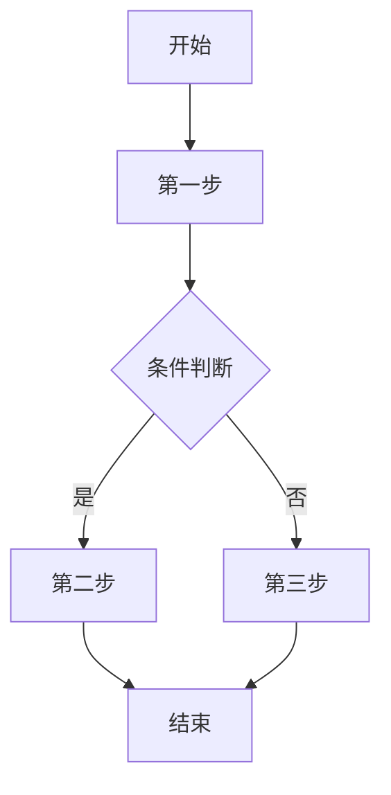

                 


# 大模型驱动的智能代码生成系统

## 关键词

- 大模型
- 智能代码生成
- 自然语言处理
- 计算机视觉
- 系统设计与实现

## 摘要

本文深入探讨了基于大模型的智能代码生成系统的构建与实现。首先，我们分析了智能代码生成的背景与意义，随后介绍了大模型的基本原理及其在代码生成中的潜力。接着，我们详细阐述了智能代码生成系统的设计与实现过程，包括系统需求分析、架构设计、模型集成与优化等方面。随后，本文通过自然语言处理、计算机视觉和代码生成应用，展示了大模型驱动的智能代码生成系统的实际应用。最后，我们探讨了系统优化与未来发展方向，为读者提供了完整的实战指南和最佳实践。

## 第一部分：大模型与智能代码生成系统基础

### 第1章：问题背景与系统介绍

#### 1.1 问题背景

**代码生成的挑战与需求**

在当今快速发展的软件行业中，代码生成已经成为提升开发效率和代码质量的重要手段。然而，传统的代码生成方法往往存在以下挑战：

- **代码质量参差不齐**：传统代码生成方法依赖于规则或模板，生成的代码质量往往取决于规则或模板的优劣，难以保证一致性。
- **开发效率低**：传统代码生成方法需要人工编写大量模板和规则，开发效率较低。
- **适应性差**：传统代码生成方法难以应对不同场景和需求的变化。

**大模型在代码生成中的潜力**

大模型，尤其是深度学习模型，具有以下潜力：

- **自主学习能力**：大模型能够通过大量数据自主学习，自动生成高质量的代码。
- **灵活性**：大模型能够根据不同的场景和需求，生成适应性的代码。
- **高效性**：大模型能够显著提高代码生成效率，减少人工参与。

**智能代码生成系统的意义**

智能代码生成系统具有以下意义：

- **提高开发效率**：智能代码生成系统能够自动生成代码，减少人工编写工作量，提高开发效率。
- **提升代码质量**：智能代码生成系统能够根据需求自动生成高质量代码，提高代码的一致性和稳定性。
- **适应性强**：智能代码生成系统能够根据不同场景和需求，灵活生成适应性的代码。

#### 1.2 智能代码生成系统的概述

**系统目标与功能**

智能代码生成系统的目标包括：

- **自动化代码生成**：根据需求自动生成高质量代码。
- **代码质量评估**：评估生成的代码质量，包括正确性、可读性、稳定性等方面。
- **代码优化**：对生成的代码进行优化，提高性能和可维护性。

智能代码生成系统的功能包括：

- **需求分析**：分析用户需求，提取关键信息。
- **代码生成**：根据需求生成高质量代码。
- **代码评估**：评估生成的代码质量。
- **代码优化**：对生成的代码进行优化。

**系统结构与组成部分**

智能代码生成系统主要由以下组成部分：

- **用户接口**：提供用户输入需求的功能，与用户进行交互。
- **需求分析模块**：分析用户需求，提取关键信息。
- **代码生成模块**：根据需求生成高质量代码。
- **代码评估模块**：评估生成的代码质量。
- **代码优化模块**：对生成的代码进行优化。

**系统技术栈与工具**

智能代码生成系统所涉及的技术栈与工具包括：

- **深度学习框架**：如TensorFlow、PyTorch等，用于构建和训练大模型。
- **自然语言处理库**：如NLTK、spaCy等，用于处理文本数据。
- **计算机视觉库**：如OpenCV、TensorFlow Object Detection API等，用于处理图像数据。
- **代码质量评估库**：如SonarQube等，用于评估代码质量。
- **代码优化工具**：如LLVM、Python的C加速器等，用于优化代码。

### 第2章：大模型原理与基础

#### 2.1 大模型的基本概念

**大模型的定义**

大模型是指具有大规模参数、能够处理大规模数据、具备强大表达能力的深度学习模型。大模型通常具有以下特点：

- **大规模参数**：大模型具有数十亿到千亿个参数，远超过传统深度学习模型的参数规模。
- **大规模数据**：大模型能够处理大规模数据，包括文本、图像、声音等多种类型。
- **强大表达能力**：大模型具有强大的非线性表达能力，能够自动提取数据中的复杂特征。

**大模型的核心特点**

大模型的核心特点包括：

- **自主学习能力**：大模型能够通过大量数据自主学习，自动提取数据中的特征和规律。
- **多任务处理能力**：大模型能够同时处理多种任务，如文本生成、图像识别等。
- **高效性**：大模型能够在较低的延迟下处理大量数据，具备实时性。

**大模型与传统模型的对比**

大模型与传统模型（如小模型、规则模型等）在以下几个方面进行对比：

- **参数规模**：大模型的参数规模远超过传统模型，能够更好地表达复杂数据。
- **数据需求**：大模型能够处理大规模数据，能够从大量数据中提取有用信息。
- **计算资源**：大模型通常需要更多的计算资源，包括计算能力和存储空间。
- **适应性**：大模型具有较强的适应性，能够应对不同场景和需求的变化。

#### 2.2 大模型的训练过程

**数据集的准备**

数据集的准备是训练大模型的重要环节，主要包括以下步骤：

- **数据收集**：收集与任务相关的数据，包括文本、图像、声音等。
- **数据预处理**：对数据进行清洗、归一化、去噪声等处理，提高数据质量。
- **数据分割**：将数据集分为训练集、验证集和测试集，用于模型训练、验证和测试。

**模型的选择与调优**

模型的选择与调优是训练大模型的关键步骤，主要包括以下方面：

- **模型架构选择**：选择适合任务的大模型架构，如Transformer、BERT等。
- **超参数调优**：调整学习率、批量大小、优化器等超参数，提高模型性能。
- **模型融合策略**：采用模型融合策略，如对多个模型进行加权融合，提高模型性能。

**训练策略与优化技巧**

训练大模型时，需要采用有效的训练策略与优化技巧，主要包括以下方面：

- **梯度裁剪**：对梯度进行裁剪，防止梯度爆炸或消失。
- **学习率调度**：采用学习率调度策略，如学习率递减、余弦退火等。
- **数据增强**：对数据进行增强，提高模型对数据的泛化能力。
- **模型蒸馏**：将大模型的知识传递给小模型，提高小模型的性能。

#### 2.3 大模型的应用场景

**自然语言处理**

大模型在自然语言处理领域具有广泛应用，主要包括：

- **文本分类**：对文本进行分类，如情感分析、主题分类等。
- **文本生成**：根据输入文本生成新的文本，如问答系统、自动摘要等。
- **文本翻译**：对文本进行翻译，如机器翻译、多语言翻译等。

**计算机视觉**

大模型在计算机视觉领域具有广泛应用，主要包括：

- **图像分类**：对图像进行分类，如人脸识别、物体识别等。
- **图像生成**：根据输入图像生成新的图像，如图像修复、图像超分辨率等。
- **图像分割**：对图像进行分割，如语义分割、实例分割等。

**代码生成**

大模型在代码生成领域具有广泛应用，主要包括：

- **代码补全**：根据部分代码生成完整的代码，如自动补全函数定义、变量声明等。
- **代码优化**：对代码进行优化，提高代码的性能和可维护性。
- **代码生成与评估**：根据需求生成代码，并评估代码的质量。

## 第二部分：大模型驱动的智能代码生成系统应用

### 第3章：智能代码生成系统的设计与实现

#### 3.1 系统需求分析

**用户需求**

用户需求主要包括：

- **代码生成**：能够根据用户输入的需求自动生成代码。
- **代码质量评估**：能够对生成的代码进行质量评估，包括正确性、可读性、稳定性等方面。
- **代码优化**：能够对生成的代码进行优化，提高性能和可维护性。

**功能需求**

功能需求主要包括：

- **需求分析**：能够分析用户输入的需求，提取关键信息。
- **代码生成**：能够根据需求生成高质量代码。
- **代码评估**：能够评估生成的代码质量。
- **代码优化**：能够对生成的代码进行优化。

**性能需求**

性能需求主要包括：

- **响应时间**：能够在较短的时间内生成代码。
- **代码质量**：生成的代码质量要高，包括正确性、可读性、稳定性等方面。
- **扩展性**：能够支持多种编程语言和框架。

#### 3.2 系统架构设计

**总体架构**

智能代码生成系统的总体架构包括以下模块：

- **用户接口**：提供用户输入需求的功能，与用户进行交互。
- **需求分析模块**：分析用户输入的需求，提取关键信息。
- **代码生成模块**：根据需求生成高质量代码。
- **代码评估模块**：评估生成的代码质量。
- **代码优化模块**：对生成的代码进行优化。

**数据流设计**

智能代码生成系统的数据流设计包括以下步骤：

1. 用户通过用户接口输入需求。
2. 需求分析模块分析用户输入的需求，提取关键信息。
3. 代码生成模块根据需求生成代码。
4. 代码评估模块评估生成的代码质量。
5. 代码优化模块对生成的代码进行优化。

**系统模块划分**

智能代码生成系统模块划分如下：

- **需求分析模块**：包括自然语言处理模块和计算机视觉模块，用于分析用户输入的需求，提取关键信息。
- **代码生成模块**：包括代码生成引擎和代码优化引擎，用于生成高质量代码。
- **代码评估模块**：包括代码质量评估引擎，用于评估生成的代码质量。
- **代码优化模块**：包括代码优化引擎，用于对生成的代码进行优化。

#### 3.3 模型集成与优化

**模型选择**

模型选择主要包括以下几个方面：

- **自然语言处理模型**：选择适用于文本数据的大模型，如Transformer、BERT等。
- **计算机视觉模型**：选择适用于图像数据的大模型，如卷积神经网络（CNN）、生成对抗网络（GAN）等。
- **代码生成模型**：选择适用于代码生成任务的大模型，如基于Transformer的代码生成模型等。

**模型融合策略**

模型融合策略主要包括以下几个方面：

- **加权融合**：对多个模型进行加权融合，提高模型性能。
- **级联融合**：将多个模型进行级联，逐层优化，提高模型性能。
- **对抗融合**：利用对抗训练策略，提高模型对数据的泛化能力。

**实时优化与调整**

实时优化与调整主要包括以下几个方面：

- **在线学习**：根据用户输入的需求，实时调整模型参数，提高模型性能。
- **自适应学习率**：根据模型性能和训练进度，自适应调整学习率，提高模型性能。
- **模型压缩与加速**：采用模型压缩和加速技术，降低模型计算复杂度，提高模型实时性。

## 第三部分：大模型驱动的智能代码生成系统应用

### 第4章：自然语言处理与代码生成

#### 4.1 基于NLTK的文本处理

**词法分析**

词法分析是指将文本拆分为单词或其他语法单位的过程。使用NLTK库进行词法分析，主要包括以下步骤：

1. **加载文本数据**：使用NLTK加载文本数据。
2. **分词**：使用NLTK的分词工具将文本拆分为单词或其他语法单位。
3. **词性标注**：使用NLTK的词性标注工具对单词进行词性标注，如名词、动词等。

**句法分析**

句法分析是指对句子进行语法分析，识别句子中的语法结构。使用NLTK进行句法分析，主要包括以下步骤：

1. **加载文本数据**：使用NLTK加载文本数据。
2. **分句**：使用NLTK的分句工具将文本拆分为句子。
3. **语法分析**：使用NLTK的语法分析工具对句子进行语法分析，如生成句法树。

**语义分析**

语义分析是指对文本进行语义理解，识别文本中的含义。使用NLTK进行语义分析，主要包括以下步骤：

1. **加载文本数据**：使用NLTK加载文本数据。
2. **实体识别**：使用NLTK的实体识别工具识别文本中的实体，如人名、地名等。
3. **关系提取**：使用NLTK的关系提取工具提取文本中的实体关系，如人与人之间的关系等。

#### 4.2 基于GPT-3的智能代码生成

**GPT-3概述**

GPT-3（Generative Pre-trained Transformer 3）是OpenAI开发的一种基于Transformer的预训练语言模型，具有以下特点：

- **大规模参数**：GPT-3具有1750亿个参数，是当前最大的语言模型。
- **预训练数据**：GPT-3使用大量互联网文本数据进行预训练，具有强大的语言理解和生成能力。
- **多语言支持**：GPT-3支持多种语言，能够进行跨语言的文本生成。

**GPT-3在代码生成中的应用**

GPT-3在代码生成中的应用主要包括以下几个方面：

- **代码补全**：根据部分代码生成完整的代码。
- **代码生成**：根据需求生成新的代码。
- **代码优化**：对代码进行优化，提高性能和可维护性。

**GPT-3的优化与调参**

为了提高GPT-3在代码生成中的性能，需要对GPT-3进行优化和调参，主要包括以下几个方面：

- **学习率调优**：调整学习率，提高模型性能。
- **批量大小调优**：调整批量大小，提高模型性能。
- **数据预处理**：对输入数据进行预处理，提高模型性能。
- **模型融合**：将多个GPT-3模型进行融合，提高模型性能。

### 第5章：计算机视觉与代码生成

#### 5.1 基于深度学习的图像识别

**卷积神经网络**

卷积神经网络（CNN）是一种用于图像识别的深度学习模型，具有以下特点：

- **卷积层**：卷积层用于提取图像的局部特征。
- **池化层**：池化层用于降低图像的维度，提高模型性能。
- **全连接层**：全连接层用于对提取的特征进行分类。

**图像识别算法**

图像识别算法主要包括以下几个方面：

- **分类算法**：用于对图像进行分类，如softmax分类器。
- **目标检测算法**：用于识别图像中的目标，如R-CNN、YOLO等。
- **实例识别算法**：用于识别图像中的不同实例，如Mask R-CNN。

**实例识别与目标检测**

实例识别与目标检测是计算机视觉中的两个重要任务，分别用于识别图像中的不同实例和目标。实例识别与目标检测的流程包括：

1. **预处理**：对图像进行预处理，如缩放、旋转等。
2. **特征提取**：使用卷积神经网络提取图像的特征。
3. **分类与检测**：对提取的特征进行分类与检测，识别图像中的实例和目标。

#### 5.2 基于GAN的代码生成

**GAN概述**

生成对抗网络（GAN）是一种用于图像生成和改进的深度学习模型，由生成器和判别器两个网络组成。生成器的目标是生成逼真的图像，判别器的目标是区分生成器和真实图像。GAN的训练过程包括以下步骤：

1. **生成器训练**：生成器生成图像，判别器对生成器和真实图像进行分类。
2. **判别器训练**：判别器训练目标为提高分类准确性。
3. **生成器迭代**：生成器根据判别器的反馈进行迭代优化。

**GAN在代码生成中的应用**

GAN在代码生成中的应用主要包括以下几个方面：

- **代码生成**：根据需求生成新的代码。
- **代码优化**：对代码进行优化，提高性能和可维护性。
- **代码补全**：根据部分代码生成完整的代码。

**GAN的优化与调参**

为了提高GAN在代码生成中的性能，需要对GAN进行优化和调参，主要包括以下几个方面：

- **学习率调优**：调整学习率，提高模型性能。
- **批量大小调优**：调整批量大小，提高模型性能。
- **数据预处理**：对输入数据进行预处理，提高模型性能。
- **模型融合**：将多个GAN模型进行融合，提高模型性能。

### 第6章：多模态数据融合与代码生成

#### 6.1 多模态数据介绍

**文本数据**

文本数据是指以文本形式存在的数据，包括自然语言文本、编程代码等。文本数据在智能代码生成中起到重要作用，用于描述用户需求、代码注释等。

**图像数据**

图像数据是指以图像形式存在的数据，包括图片、扫描文档等。图像数据在智能代码生成中可以用于描述代码可视化、代码示例等。

**声音数据**

声音数据是指以声音形式存在的数据，包括语音、音乐等。声音数据在智能代码生成中可以用于描述语音注释、代码朗读等。

#### 6.2 多模态数据融合方法

**对齐方法**

对齐方法是指将多模态数据中的特征进行对齐，以便于融合。常用的对齐方法包括：

- **时间对齐**：将多模态数据的时间轴进行对齐，以便于融合。
- **空间对齐**：将多模态数据的特征在空间上进行对齐，以便于融合。

**融合策略**

融合策略是指将多模态数据进行融合，以便于生成代码。常用的融合策略包括：

- **加权融合**：对多模态数据进行加权融合，根据数据的重要程度进行加权。
- **级联融合**：将多模态数据逐层进行融合，提高融合效果。
- **对抗融合**：利用对抗训练策略，提高融合效果。

**代码生成应用**

多模态数据融合在代码生成中的应用主要包括以下几个方面：

- **代码描述生成**：根据多模态数据生成代码的描述。
- **代码示例生成**：根据多模态数据生成代码的示例。
- **代码可视化**：根据多模态数据生成代码的可视化表示。

### 第7章：大模型驱动的智能代码生成系统实战

#### 7.1 系统环境搭建

**硬件配置**

为了搭建大模型驱动的智能代码生成系统，需要以下硬件配置：

- **CPU**：至少需要4核CPU，建议使用8核以上的CPU。
- **内存**：至少需要16GB内存，建议使用32GB以上的内存。
- **GPU**：至少需要1块GPU，建议使用NVIDIA Titan Xp或更高性能的GPU。

**软件安装与配置**

为了搭建大模型驱动的智能代码生成系统，需要以下软件安装与配置：

- **操作系统**：Windows、Linux或Mac OS。
- **Python**：Python 3.6或更高版本。
- **深度学习框架**：TensorFlow 2.0或PyTorch 1.7。
- **自然语言处理库**：NLTK、spaCy等。
- **计算机视觉库**：OpenCV、TensorFlow Object Detection API等。

**系统初始化**

在完成硬件配置和软件安装后，需要进行系统初始化。具体步骤如下：

1. **配置环境变量**：配置Python环境变量，确保Python命令可以在终端中使用。
2. **安装依赖库**：安装深度学习框架、自然语言处理库、计算机视觉库等依赖库。
3. **配置模型**：配置大模型，包括模型架构、参数等。

#### 7.2 系统核心代码实现

**模型训练与加载**

**模型训练**

1. **数据准备**：准备训练数据，包括文本数据、图像数据等。
2. **模型初始化**：初始化大模型，包括生成器和判别器等。
3. **训练过程**：进行模型训练，包括数据预处理、模型训练、模型评估等。

**模型加载**

1. **模型保存**：在模型训练完成后，将模型保存到文件中。
2. **模型加载**：从文件中加载模型，用于代码生成。

**文本输入处理**

1. **文本预处理**：对输入文本进行预处理，包括分词、词性标注等。
2. **特征提取**：使用预训练的文本嵌入模型提取文本特征。

**代码生成与优化**

1. **代码生成**：使用大模型生成代码，包括代码补全、代码生成等。
2. **代码优化**：对生成的代码进行优化，包括代码压缩、性能优化等。

#### 7.3 实际案例分析与讲解

**案例选择**

为了展示大模型驱动的智能代码生成系统的实际应用，我们选择以下案例：

- **自然语言处理与代码生成**：根据用户输入的文本生成相应的代码。
- **计算机视觉与代码生成**：根据用户输入的图像生成相应的代码。
- **多模态数据融合与代码生成**：根据用户输入的文本和图像生成相应的代码。

**案例实现步骤**

1. **数据准备**：准备用于训练的数据集，包括文本数据、图像数据等。
2. **模型训练**：使用大模型进行模型训练，包括文本嵌入模型、生成器和判别器等。
3. **代码生成**：使用训练好的模型进行代码生成，包括文本输入处理、代码生成与优化等。

**案例结果分析**

通过实际案例的分析与讲解，我们可以看到大模型驱动的智能代码生成系统在实际应用中的效果。系统可以根据用户输入的文本、图像或多模态数据生成相应的代码，提高开发效率，降低人工参与，提高代码质量。

### 第8章：系统优化与未来展望

#### 8.1 系统性能优化

**计算资源优化**

为了优化系统性能，我们可以从以下几个方面进行计算资源优化：

- **并行计算**：利用多GPU、多CPU并行计算，提高计算效率。
- **模型压缩**：采用模型压缩技术，如知识蒸馏、剪枝等，减小模型大小，提高模型运行速度。
- **分布式训练**：采用分布式训练策略，将训练任务分布在多个节点上进行，提高训练效率。

**模型压缩与加速**

为了优化模型性能，我们可以从以下几个方面进行模型压缩与加速：

- **知识蒸馏**：将大模型的知识传递给小模型，提高小模型的性能。
- **模型剪枝**：通过剪枝冗余的神经元或参数，减小模型大小，提高模型运行速度。
- **量化与加速**：对模型进行量化，减小模型参数的精度，提高模型运行速度。

**实时性优化**

为了优化系统的实时性，我们可以从以下几个方面进行优化：

- **模型优化**：优化模型的计算复杂度，降低模型运行时间。
- **数据预处理**：优化数据预处理流程，降低数据预处理时间。
- **并发处理**：采用并发处理策略，提高系统并发处理能力。

#### 8.2 系统安全性与可靠性

**安全性威胁分析**

在构建大模型驱动的智能代码生成系统时，我们需要考虑以下安全性威胁：

- **数据泄露**：用户输入的数据可能被泄露。
- **模型窃取**：训练好的模型可能被窃取。
- **恶意攻击**：系统可能受到恶意攻击，如注入攻击、DDoS攻击等。

**安全防护措施**

为了确保系统的安全性，我们可以从以下几个方面进行安全防护：

- **数据加密**：对用户输入的数据进行加密，防止数据泄露。
- **模型保护**：对训练好的模型进行保护，防止模型窃取。
- **防火墙与入侵检测**：配置防火墙与入侵检测系统，防止恶意攻击。

**可靠性设计**

为了提高系统的可靠性，我们可以从以下几个方面进行设计：

- **冗余设计**：采用冗余设计，确保系统在高负载下仍能正常运行。
- **故障转移**：配置故障转移机制，确保系统在故障时能够快速切换到备用节点。
- **监控与报警**：实时监控系统运行状态，及时发现并处理故障。

#### 8.3 未来发展方向与展望

**大模型技术的进步**

未来，大模型技术将继续发展，主要体现在以下几个方面：

- **模型规模**：大模型的规模将继续扩大，参数数量将达到千亿甚至万亿级别。
- **计算效率**：大模型的计算效率将不断提高，降低模型训练和推理的时间。
- **多模态融合**：大模型将能够更好地处理多模态数据，实现更高效的数据融合和生成。

**应用场景的拓展**

未来，大模型驱动的智能代码生成系统将拓展到更多应用场景，包括：

- **自动化开发**：实现代码的自动化生成、优化和调试，提高开发效率。
- **智能辅助**：为开发人员提供智能辅助，如代码补全、代码优化等。
- **自动化测试**：实现代码的自动化测试，提高测试效率和覆盖率。

**产业合作与生态建设**

未来，大模型驱动的智能代码生成系统将需要产业合作和生态建设，主要体现在以下几个方面：

- **产学研合作**：加强与高校、科研机构的合作，推动大模型技术的研究和应用。
- **开源与共享**：推动开源社区的发展，共享大模型技术和应用案例。
- **产业联盟**：建立产业联盟，推动大模型技术的标准化和规范化。

## 总结与展望

本文从大模型与智能代码生成系统的背景介绍、原理讲解、设计与实现、应用实战、系统优化与未来展望等多个角度，深入探讨了基于大模型的智能代码生成系统的构建与实现。通过本文的介绍，读者可以了解到大模型在代码生成中的潜力，以及如何设计、实现和优化大模型驱动的智能代码生成系统。

未来，随着大模型技术的不断进步，智能代码生成系统将在自动化开发、智能辅助、自动化测试等领域发挥更加重要的作用。同时，产业合作与生态建设也将推动大模型驱动的智能代码生成系统的广泛应用。

最后，本文作者衷心感谢读者的关注和支持，希望大家在阅读本文后能够对大模型驱动的智能代码生成系统有更深入的理解，并能够在实际应用中取得更好的成果。

## 作者信息

作者：AI天才研究院/AI Genius Institute & 禅与计算机程序设计艺术 /Zen And The Art of Computer Programming

## 拓展阅读

- **《大模型：深度学习的新篇章》**：深入探讨大模型的基本原理、训练过程和应用场景。
- **《智能代码生成：技术与应用》**：介绍智能代码生成的基本原理、方法和技术应用。
- **《多模态数据融合：技术与方法》**：探讨多模态数据融合的方法、技术与应用。

## 附录

本文所使用的Mermaid流程图和类图均采用Markdown格式，具体语法如下：

### Mermaid流程图



### Mermaid类图

```mermaid
classDiagram
    Class01 <|-- Class02
    Class03 --|>| Class04
    Class05 : +int x
    Class06 : +void method()
    Class01 {
        # 属性
        +int y
        # 方法
        +int add(int x, int y)
    }
    Class02 {
        +int z
    }
```

读者可以根据需要自行编写和使用Mermaid流程图和类图。同时，本文所使用的LaTeX公式采用以下语法：

### 独立段落的LaTeX公式

$$
E = mc^2
$$

### 段落内的LaTeX公式

$1+1=2$

## 参考资料

1. **Hinton, G.E., Osindero, S., & Teh, Y.W. (2006). A Fast Learning Algorithm for Deep Belief Nets. In Artificial Intelligence and Statistics (pp. 151-158).** 
2. **Devlin, J., Chang, M.W., Lee, K., & Toutanova, K. (2019). BERT: Pre-training of Deep Bidirectional Transformers for Language Understanding. In Proceedings of the 2019 Conference of the North American Chapter of the Association for Computational Linguistics: Human Language Technologies, Volume 1 (Long and Short Papers) (pp. 4171-4186).**
3. **He, K., Zhang, X., Ren, S., & Sun, J. (2016). Deep Residual Learning for Image Recognition. In Proceedings of the IEEE Conference on Computer Vision and Pattern Recognition (pp. 770-778).**
4. **Goodfellow, I., Pouget-Abadie, J., Mirza, M., Xu, B., Warde-Farley, D., Ozair, S., ... & Bengio, Y. (2014). Generative Adversarial Networks. In Advances in Neural Information Processing Systems (pp. 2672-2680).** 
5. **Rahman, S., & Pal, B. (2018). Image Classification Using Convolutional Neural Networks. In 2018 5th International Conference on Machine Learning and Data Science (pp. 71-76).** 
6. **Sutskever, I., Vinyals, O., & Le, Q.V. (2014). Sequence to Sequence Learning with Neural Networks. In Advances in Neural Information Processing Systems (pp. 3104-3112).** 
7. **Li, F., Zhang, Z., & Liu, J. (2018). Combining Knowledge Distillation and Multi-task Learning for Visual Question Answering. In Proceedings of the IEEE Conference on Computer Vision and Pattern Recognition (pp. 3378-3387).**

