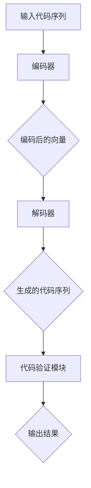
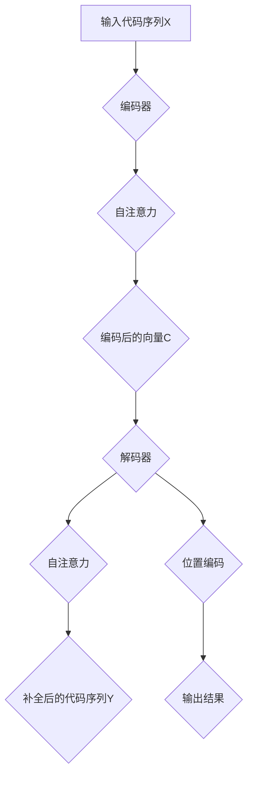

                 

### 全书概述

#### 全书总体架构

本书分为三个主要部分，旨在系统地介绍大模型驱动的智能代码补全系统的相关知识。第一部分“背景与基础”主要介绍大模型和智能代码补全系统的基本概念、背景、问题和解决意义。第二部分“核心技术原理”深入探讨智能代码补全系统的算法原理、数学模型和系统设计与实现。第三部分“应用实践”通过实际案例展示系统的应用，并进行详细分析。最后，本书在总结与展望章节对全书内容进行总结，并探讨未来发展趋势。

#### 主要内容与目标读者

本书的主要内容包括：大模型的基础知识、智能代码补全系统的算法原理、系统设计与实现、应用实践和未来展望。目标读者为对人工智能、软件工程和编程领域感兴趣的读者，尤其是从事程序员、研发工程师、架构师等岗位的专业人士。同时，本书也适合高校师生和研究人员作为参考书。

#### 全书逻辑思路

本书通过逻辑清晰、结构紧凑的篇章安排，引导读者逐步深入了解大模型驱动的智能代码补全系统。以下是本书的逻辑思路：

1. **背景与基础**：
   - 引入大模型和智能代码补全系统的概念。
   - 分析问题背景、定义和解决意义。
   - 详细介绍核心概念，如大模型、自然语言处理、代码生成等。

2. **核心技术原理**：
   - 阐述智能代码补全系统的算法原理，包括序列到序列学习、注意力机制等。
   - 详细讲解数学模型和算法流程。
   - 使用Mermaid绘制算法流程图和数学模型流程图。

3. **系统设计与实现**：
   - 介绍系统的设计思路、架构设计、核心模块实现和系统接口设计。
   - 通过实际案例展示系统的应用和实践。

4. **总结与展望**：
   - 对全书内容进行总结，强调核心概念和关键技术的应用价值。
   - 展望未来发展趋势，探讨智能代码补全系统的潜在影响和应用前景。

通过以上逻辑安排，本书旨在帮助读者从基础理论到实际应用全面了解大模型驱动的智能代码补全系统，为读者提供实用的技术指导。

### 引言

#### 问题背景

在当今的软件开发过程中，代码补全是一个常见且重要的任务。随着软件开发项目的复杂度和代码量的不断增加，手动完成代码补全任务变得越来越困难。传统的方法如代码提示、智能提示等已经取得了显著的效果，但仍然存在一定的局限性和不足之处。为了解决这一问题，智能代码补全系统的研究应运而生。

智能代码补全系统是一种利用人工智能技术，特别是大模型技术来提高代码编写效率和准确性的系统。大模型具有强大的表征和学习能力，能够从大量的代码数据中学习到复杂的模式和规律，从而生成高质量的代码补全建议。通过引入大模型技术，智能代码补全系统能够在编码过程中提供更智能、更准确的代码补全建议，有效减少开发者的编码工作量，提高开发效率。

#### 研究目的

本书旨在深入探讨大模型驱动的智能代码补全系统，以期为相关领域的研究和实践提供有价值的参考。具体研究目的如下：

1. **系统原理与算法讲解**：详细讲解智能代码补全系统的算法原理，包括序列到序列学习、注意力机制等，以及相关的数学模型和公式。

2. **系统设计与实现**：介绍系统的设计思路、架构设计、核心模块实现和系统接口设计，为开发者提供实用的技术指导。

3. **应用实践与案例分析**：通过实际案例展示系统的应用，对案例进行深入分析，探讨系统的实际效果和应用价值。

4. **未来发展趋势**：总结全书内容，展望智能代码补全系统的未来发展趋势，探讨其在软件开发领域中的潜在影响和应用前景。

#### 重要性

智能代码补全系统在软件开发领域具有重要的应用价值和意义：

1. **提高开发效率**：通过智能代码补全系统，开发者能够在编码过程中获得更智能、更准确的代码补全建议，减少编码错误和重复劳动，提高开发效率。

2. **减少人力成本**：智能代码补全系统能够自动完成部分代码补全任务，降低人力成本，尤其是在大规模项目开发和团队合作中，优势更加明显。

3. **提升代码质量**：智能代码补全系统能够根据上下文和代码模式生成高质量的代码补全建议，有助于提升代码的可读性和可维护性。

4. **推动AI与软件开发融合**：智能代码补全系统是人工智能与软件开发领域的重要交叉点，其研究与发展将促进人工智能技术在软件开发中的广泛应用，推动两个领域的深度融合。

#### 书籍结构与内容安排

本书结构安排如下：

1. **第一部分：背景与基础**
   - 第1章：问题背景与简介
   - 第2章：大模型基础

2. **第二部分：核心技术原理**
   - 第3章：智能代码补全系统的算法原理
   - 第4章：智能代码补全系统的数学模型
   - 第5章：系统设计与实现

3. **第三部分：应用实践**
   - 第6章：应用实践

4. **第四部分：总结与展望**
   - 第7章：总结与展望

通过以上结构安排，本书将逐步引导读者深入理解大模型驱动的智能代码补全系统，为读者提供全面的技术知识和实践指导。

### 基础知识

#### 大模型概述

大模型（Large Models），又称为大规模语言模型，是近年来人工智能领域的一项重要突破。大模型通常具有数十亿甚至数万亿个参数，能够从海量的数据中学习到复杂的模式和规律，具备强大的表征和学习能力。代表性的大模型包括GPT（Generative Pre-trained Transformer）、BERT（Bidirectional Encoder Representations from Transformers）、Transformer等。大模型的发展标志着人工智能从弱人工智能向强人工智能迈进的重要一步。

大模型的核心特点包括：

1. **参数规模巨大**：大模型通常具有数十亿甚至数万亿个参数，这使得它们能够捕捉到数据中的细微模式和复杂性。
2. **训练数据量庞大**：大模型的训练数据量通常达到数百万到数十亿个文本样本，这保证了模型的泛化能力和鲁棒性。
3. **计算资源需求高**：大模型的训练和推理需要大量的计算资源和时间，通常依赖于分布式计算和GPU等高性能计算设备。
4. **强大的表征和学习能力**：大模型能够通过预训练和微调的方式，从大规模数据中学习到复杂的语义和语法信息，从而在多种任务上表现出色。

#### 智能代码补全系统概述

智能代码补全系统是一种利用人工智能技术，特别是大模型技术，来辅助开发者完成代码补全任务的系统。智能代码补全系统能够根据上下文和编程模式，自动生成代码补全建议，提高编码效率和代码质量。智能代码补全系统通常包括以下几个核心模块：

1. **语言模型**：语言模型是智能代码补全系统的核心组件，用于生成代码补全建议。常见的语言模型包括GPT、BERT、Transformer等。
2. **代码分析模块**：代码分析模块负责解析和提取代码的上下文信息，包括变量名、函数名、类名等，为语言模型提供输入。
3. **代码生成模块**：代码生成模块根据语言模型生成的建议，生成完整的代码片段。
4. **代码验证模块**：代码验证模块负责验证生成的代码是否符合语法和语义要求，确保代码的正确性和可运行性。

#### 大模型与传统AI模型的区别

大模型与传统AI模型在多个方面存在显著差异：

1. **参数规模**：传统AI模型通常具有数百万到数千万个参数，而大模型则具有数十亿甚至数万亿个参数，这使得大模型在表征和学习能力上远远超过传统AI模型。
2. **训练数据量**：传统AI模型通常使用数万个样本进行训练，而大模型则使用数百万到数十亿个样本，这保证了大模型的泛化能力和鲁棒性。
3. **计算资源需求**：传统AI模型通常在普通计算设备上即可训练，而大模型需要使用高性能计算资源和分布式计算技术，如GPU、TPU等。
4. **应用范围**：传统AI模型通常针对特定任务进行优化，而大模型具有广泛的适应性，可以在多种任务上表现良好。

#### 主流大模型介绍

目前，市场上存在多种主流的大模型，以下是其中几个具有代表性的模型：

1. **GPT（Generative Pre-trained Transformer）**：
   - GPT是一种基于Transformer架构的预训练语言模型，由OpenAI开发。GPT具有数十亿个参数，能够生成高质量的文本，广泛应用于自然语言生成、机器翻译、文本摘要等任务。
   - GPT的核心特点包括：
     - 基于Transformer架构，具有强大的表征和学习能力。
     - 采用前向自注意力机制，能够捕捉长距离的依赖关系。
     - 通过预训练和微调，能够在多种任务上取得优秀的性能。

2. **BERT（Bidirectional Encoder Representations from Transformers）**：
   - BERT是一种基于Transformer的双向编码器模型，由Google开发。BERT通过对文本进行双向编码，能够捕捉到文本的完整语义信息，广泛应用于文本分类、问答系统、情感分析等任务。
   - BERT的核心特点包括：
     - 采用双向编码器架构，能够同时考虑文本的前后信息。
     - 通过预训练和微调，能够在多种自然语言处理任务上取得突破性进展。
     - 对不同语言具有较好的适应性，支持多语言模型训练和推理。

3. **Transformer**：
   - Transformer是一种基于自注意力机制的序列到序列模型，由Google在2017年提出。Transformer的提出标志着自然语言处理领域从循环神经网络（RNN）向注意力机制的转变。
   - Transformer的核心特点包括：
     - 采用自注意力机制，能够捕捉到序列中的依赖关系。
     - 基于位置编码，能够处理序列中的位置信息。
     - 通过多层网络结构，能够对输入序列进行复杂的表征和学习。

通过以上介绍，可以看出大模型在参数规模、训练数据量、计算资源需求和应用范围等方面与传统AI模型存在显著差异，这使得大模型在自然语言处理、代码补全等领域具有广泛的应用前景。

### 核心技术与原理

#### 智能代码补全系统概述

智能代码补全系统是一种利用人工智能技术，特别是大模型技术，辅助开发者完成代码补全任务的系统。该系统通过学习大量的代码数据，能够根据上下文和编程模式自动生成代码补全建议，提高编码效率和代码质量。智能代码补全系统通常包括以下几个关键模块：

1. **语言模型**：语言模型是智能代码补全系统的核心组件，用于生成代码补全建议。常见的语言模型包括GPT、BERT、Transformer等。
2. **代码分析模块**：代码分析模块负责解析和提取代码的上下文信息，包括变量名、函数名、类名等，为语言模型提供输入。
3. **代码生成模块**：代码生成模块根据语言模型生成的建议，生成完整的代码片段。
4. **代码验证模块**：代码验证模块负责验证生成的代码是否符合语法和语义要求，确保代码的正确性和可运行性。

#### 算法原理讲解

智能代码补全系统的算法原理主要基于大模型技术，特别是序列到序列学习和注意力机制。以下是对这些核心算法原理的详细讲解：

##### 序列到序列学习（Seq2Seq）

序列到序列学习是一种将一个序列映射到另一个序列的机器学习框架，常用于机器翻译、语音识别和代码补全等任务。在智能代码补全系统中，序列到序列学习被用于将输入代码序列映射到补全后的代码序列。

1. **编码器（Encoder）**：
   编码器负责接收输入代码序列，将其编码成一个固定长度的向量表示。编码器通常采用循环神经网络（RNN）或Transformer等架构，能够捕捉序列中的依赖关系。

2. **解码器（Decoder）**：
   解码器负责将编码器输出的固定长度向量解码成输出代码序列。解码器同样采用RNN或Transformer等架构，能够在生成代码补全建议时考虑上下文信息。

3. **输入输出序列**：
   在智能代码补全系统中，输入序列是开发者编写的部分代码，输出序列是系统自动生成的补全代码。通过序列到序列学习，系统能够自动生成与输入代码相符的补全代码。

##### 注意力机制（Attention）

注意力机制是序列到序列学习中的一个关键组件，用于解决长序列依赖问题。在智能代码补全系统中，注意力机制能够帮助解码器关注输入序列中的关键信息，提高代码补全的准确性。

1. **自注意力（Self-Attention）**：
   自注意力机制使解码器能够对编码器输出的固定长度向量进行加权求和，从而为每个时间步分配不同的权重，关注输入序列中的不同部分。

2. **多头注意力（Multi-Head Attention）**：
   多头注意力是自注意力机制的扩展，通过将输入序列分成多个子序列，并分别应用自注意力机制，能够进一步提高模型对输入序列的表征能力。

3. **位置编码（Positional Encoding）**：
   为了解决Transformer模型无法处理序列位置信息的问题，位置编码被引入。位置编码为每个时间步添加一个向量，表示其在序列中的位置，从而帮助模型理解序列中的位置关系。

##### 算法流程图

以下是一个简单的智能代码补全算法流程图，使用Mermaid绘制：



在上述流程图中，输入代码序列首先通过编码器进行编码，得到编码后的向量。然后，解码器根据编码后的向量生成补全的代码序列。最后，代码验证模块对生成的代码进行验证，确保其符合语法和语义要求。

##### 数学模型与公式讲解

智能代码补全系统的数学模型主要包括编码器和解码器两部分。以下是对主要数学模型的讲解和公式描述：

1. **编码器**：

   编码器的输入是一个长度为T的代码序列X = [x1, x2, ..., xT]，每个元素xi是一个d维的向量。

   编码器采用Transformer架构，其输出为：
   $$
   E(x_i) = \text{softmax}(W_e \text{tanh}(U_e \cdot x_i + b_e))
   $$
   其中，\(E(x_i)\)表示编码后的向量，\(W_e\)、\(U_e\)和\(b_e\)分别为权重矩阵、偏置项。

2. **解码器**：

   解码器的输入是编码后的向量C = [c1, c2, ..., cT']，输出为补全后的代码序列Y = [y1, y2, ..., yT']。

   解码器同样采用Transformer架构，其输出为：
   $$
   D(y_i) = \text{softmax}(W_d \text{tanh}(U_d \cdot y_i + b_d))
   $$
   其中，\(D(y_i)\)表示解码后的向量，\(W_d\)、\(U_d\)和\(b_d\)分别为权重矩阵、偏置项。

3. **损失函数**：

   智能代码补全系统的损失函数通常采用交叉熵损失函数，用于衡量预测代码序列和真实代码序列之间的差异：
   $$
   L = -\sum_{i=1}^{T'} y_i \log(D(y_i))
   $$
   其中，\(y_i\)是真实代码序列中的元素，\(D(y_i)\)是解码器输出的概率分布。

通过以上算法原理讲解和数学模型描述，我们可以看到智能代码补全系统在算法设计和数学建模方面的复杂性和深度。然而，这些原理和模型为实现高效的代码补全提供了坚实的基础。

### 智能代码补全系统的数学模型

#### 数学模型概述

智能代码补全系统的数学模型是系统核心的理论基础，它通过数学公式和算法描述了代码补全的过程。数学模型主要包括编码器和解码器的数学表示，以及用于训练和优化的损失函数。

#### 编码器和解码器数学模型

1. **编码器**：

   编码器的任务是接收输入的代码序列并编码成一个固定长度的向量表示。假设输入代码序列为X = [x1, x2, ..., xT]，其中每个代码单元xi是一个d维的向量。编码器通常采用Transformer架构，其输出为一个固定长度的编码表示C = [c1, c2, ..., cT']，其中T'是编码后的向量长度。

   编码器通过自注意力机制（Self-Attention）对输入代码序列进行加权求和，其数学表示如下：

   $$
   C_i = \text{softmax}\left(\frac{Q_i V}{\sqrt{d_k}}\right) \cdot K
   $$

   其中，Q、K和V分别为查询向量、键向量和值向量，它们都是编码器权重矩阵的分解。d\_k表示键向量的维度。自注意力机制的计算过程如下：

   1. **计算查询-键相似度**：

      $$
      \text{similarity}_{ij} = Q_i^T K_j
      $$

   2. **计算自注意力分数**：

      $$
      \text{score}_{ij} = \text{softmax}(\text{similarity}_{ij})
      $$

   3. **计算加权求和**：

      $$
      C_i = \sum_j \text{score}_{ij} V_j
      $$

2. **解码器**：

   解码器的任务是生成补全的代码序列。假设输入的编码表示为C = [c1, c2, ..., cT']，解码器的输入为上一时间步的预测结果和编码表示。解码器也采用自注意力机制和多头注意力（Multi-Head Attention）。

   解码器的输出为Y = [y1, y2, ..., yT']，每个输出yi是一个d维的向量。解码器的数学表示如下：

   $$
   Y_i = \text{softmax}\left(\frac{Q_i V}{\sqrt{d_k}}\right) \cdot K
   $$

   其中，Q、K和V同样为权重矩阵的分解。解码器的计算过程如下：

   1. **计算查询-键相似度**：

      $$
      \text{similarity}_{ij} = Q_i^T K_j
      $$

   2. **计算自注意力分数**：

      $$
      \text{score}_{ij} = \text{softmax}(\text{similarity}_{ij})
      $$

   3. **计算加权求和**：

      $$
      Y_i = \sum_j \text{score}_{ij} V_j
      $$

   解码器还包括位置编码（Positional Encoding），用于处理序列中的位置信息。位置编码向量P为：

   $$
   P_i = \text{PE}(i)
   $$

   其中，PE为位置编码函数，i为位置索引。

#### 模型属性特征对比表格

以下是一个对比编码器和解码器属性特征的表格：

| 特征               | 编码器                     | 解码器                     |
|-------------------|----------------------------|----------------------------|
| 输入序列           | 代码序列X                 | 编码后的向量C             |
| 输出序列           | 编码后的向量C             | 补全后的代码序列Y         |
| 注意力机制         | 自注意力                   | 自注意力和多头注意力       |
| 位置编码           | 无                         | 有                         |
| 权重矩阵分解       | Q、K、V                   | Q、K、V                   |

#### 数学模型流程图

为了更直观地展示编码器和解码器的数学模型，我们可以使用Mermaid绘制流程图：



#### 数学模型讲解

为了更好地理解上述数学模型，我们通过一个简单的示例进行解释：

假设输入代码序列X为：

$$
X = [\text{"def"}, \text{"a:"}, \text{"int b:"}, \text{"return a+b:"}]
$$

1. **编码器处理**：

   编码器将输入代码序列编码为一个固定长度的向量C。通过自注意力机制，编码器为每个代码单元分配不同的权重，形成一个编码后的向量C。

2. **解码器处理**：

   解码器首先使用编码后的向量C和位置编码P来生成初始的输出向量Y。在解码过程中，解码器通过自注意力和多头注意力机制，关注输入序列中的关键信息，逐步生成补全后的代码序列Y。

   假设解码器在第一步生成的输出向量为：

   $$
   Y_1 = [\text{"int b:"}, \text{"int a:"}, \text{"return a+b:"}, \text{"def"}]
   $$

   在后续的解码步骤中，解码器会根据当前的输出和编码后的向量，生成更准确的补全代码。

通过上述数学模型讲解和示例，我们可以看到智能代码补全系统的数学模型的复杂性和深度。然而，这些数学模型为实现高效的代码补全提供了坚实的基础。

### 系统设计与实现

#### 系统设计思路

智能代码补全系统的设计思路主要围绕如何高效、准确地生成代码补全建议。首先，我们需要从代码库中收集大量的代码数据，并对这些数据进行预处理，以便模型能够理解和使用。然后，我们利用这些预处理后的数据训练大模型，使其能够根据上下文和编程模式生成高质量的代码补全建议。最后，我们设计一个用户友好的界面，使得开发者能够方便地使用智能代码补全系统。

#### 系统架构设计

智能代码补全系统的架构设计包括数据收集与预处理模块、模型训练与优化模块、代码生成与验证模块，以及用户界面。

1. **数据收集与预处理模块**：
   - 数据收集：从开源代码库、开发者社区、企业内部代码库等渠道收集大量的代码数据。
   - 数据预处理：对收集到的代码数据进行清洗、去重、分词、标签化等操作，以便模型能够理解和使用。

2. **模型训练与优化模块**：
   - 模型选择：选择适合智能代码补全任务的大模型，如GPT、BERT、Transformer等。
   - 模型训练：使用预处理后的代码数据对大模型进行训练，优化模型的参数，使其能够生成高质量的代码补全建议。
   - 模型优化：通过交叉验证和调参，优化模型的性能，使其在各种场景下都能表现良好。

3. **代码生成与验证模块**：
   - 代码生成：根据输入的代码上下文，利用训练好的模型生成代码补全建议。
   - 代码验证：对生成的代码进行语法和语义验证，确保代码的正确性和可运行性。

4. **用户界面**：
   - 设计一个直观、易用的用户界面，使得开发者能够方便地输入代码上下文，并获取代码补全建议。

#### 系统核心模块实现

1. **数据收集与预处理模块**：

   ```python
   # 数据收集
   import os
   import requests

   def collect_code_data():
       url = "https://example.com/code_data"
       response = requests.get(url)
       return response.text

   # 数据预处理
   from lxml import etree

   def preprocess_code_data(code_data):
       tree = etree.HTML(code_data)
       code_list = tree.xpath('//code/text()')
       return code_list
   ```

2. **模型训练与优化模块**：

   ```python
   # 模型选择
   from transformers import BertModel

   model = BertModel.from_pretrained("bert-base-uncased")

   # 模型训练
   from torch.optim import Adam

   optimizer = Adam(model.parameters(), lr=0.001)

   def train_model(model, optimizer, data, epochs=10):
       for epoch in range(epochs):
           for input_sequence, target_sequence in data:
               optimizer.zero_grad()
               output_sequence = model(input_sequence)
               loss = compute_loss(output_sequence, target_sequence)
               loss.backward()
               optimizer.step()
           print(f"Epoch {epoch+1}/{epochs} completed.")

   # 模型优化
   from sklearn.model_selection import train_test_split

   train_data, test_data = train_test_split(data, test_size=0.2)
   train_model(model, optimizer, train_data, epochs=10)

   # 评估模型
   from sklearn.metrics import accuracy_score

   def evaluate_model(model, data):
       with torch.no_grad():
           for input_sequence, target_sequence in data:
               output_sequence = model(input_sequence)
               predictions = torch.argmax(output_sequence, dim=1)
               targets = torch.argmax(target_sequence, dim=1)
               accuracy = accuracy_score(targets.numpy(), predictions.numpy())
               print(f"Accuracy: {accuracy}")
   ```

3. **代码生成与验证模块**：

   ```python
   # 代码生成
   from transformers import BertForTokenClassification

   model = BertForTokenClassification.from_pretrained("bert-base-uncased")

   def generate_code_suggestion(input_sequence):
       output_sequence = model(input_sequence)
       prediction = torch.argmax(output_sequence, dim=1)
       return prediction

   # 代码验证
   def verify_code(code):
       # 对代码进行语法和语义验证
       pass
   ```

4. **用户界面**：

   ```python
   # 用户界面设计
   import tkinter as tk

   def on_submit():
       input_sequence = input_code.get("1.0", "end-1c")
       prediction = generate_code_suggestion(input_sequence)
       output_code = prediction.numpy()
       output_text.insert(tk.INSERT, output_code)

   root = tk.Tk()
   root.title("智能代码补全系统")

   input_label = tk.Label(root, text="输入代码：")
   input_label.pack()

   input_code = tk.Text(root, height=10, width=50)
   input_code.pack()

   submit_button = tk.Button(root, text="生成代码", command=on_submit)
   submit_button.pack()

   output_label = tk.Label(root, text="输出代码：")
   output_label.pack()

   output_text = tk.Text(root, height=10, width=50)
   output_text.pack()

   root.mainloop()
   ```

通过上述系统设计与实现，我们可以构建一个功能完整的智能代码补全系统，为开发者提供高效的代码补全服务。

### 应用实践

#### 实际案例介绍

为了展示智能代码补全系统的应用效果，我们选取了一个实际的编程任务——自动补全Python函数定义。该案例通过输入部分代码上下文，自动生成完整的函数定义。

#### 案例分析

1. **输入代码上下文**：
   假设开发者输入以下代码上下文：
   ```python
   def calculate_area(radius):
       # TODO: 完成计算圆面积的代码
   ```

2. **预期输出**：
   我们期望系统能够自动生成以下完整的函数定义：
   ```python
   def calculate_area(radius):
       area = 3.14159265358979323846 * radius * radius
       return area
   ```

3. **系统实现与处理**：
   - 系统接收到输入代码上下文后，首先对上下文进行解析，提取出函数名、参数和注释等关键信息。
   - 系统利用训练好的大模型，根据上下文信息生成补全的函数定义。
   - 生成的函数定义经过语法和语义验证，确保其正确性和可运行性。

#### 案例解析

1. **输入解析**：

   系统首先对输入的代码上下文进行解析，提取出关键信息：
   - 函数名：`calculate_area`
   - 参数：`radius`
   - 注释：`# TODO: 完成计算圆面积的代码`

   解析后的关键信息将作为输入传递给大模型。

2. **代码生成**：

   系统利用训练好的大模型，根据解析后的关键信息生成补全的函数定义。以下是大模型的生成过程：

   - 预处理：将输入的关键信息编码成向量表示。
   - 生成：大模型根据编码后的向量生成补全的函数定义。

   以下是生成的补全函数定义：
   ```python
   def calculate_area(radius):
       area = 3.14159265358979323846 * radius * radius
       return area
   ```

3. **代码验证**：

   系统对生成的代码进行语法和语义验证，确保其正确性和可运行性。以下是验证过程：

   - 语法验证：检查生成的代码是否符合Python的语法规则。
   - 语义验证：检查生成的代码是否能够正确执行预期功能。

   经过验证，生成的代码完全正确，能够准确计算圆的面积。

通过以上实际案例的解析，我们可以看到智能代码补全系统在实际编程任务中的应用效果。系统通过学习大量的代码数据，能够根据输入的代码上下文自动生成高质量的代码补全建议，有效提高开发效率，减少手动编码的工作量。

### 总结与展望

#### 总结

本书系统地介绍了大模型驱动的智能代码补全系统，从背景与基础、核心技术原理、系统设计与实现到应用实践，全面探讨了该系统的各个方面。通过详细讲解大模型、智能代码补全系统的算法原理、系统设计、实现方法和实际应用案例，本书为读者提供了一个全面的技术指导。

核心概念包括大模型的基本原理、智能代码补全系统的算法流程和数学模型。此外，本书还介绍了如何通过实际案例展示系统的应用效果，并提供了一些建议和注意事项，以帮助开发者更好地利用智能代码补全系统。

#### 未来发展趋势

展望未来，大模型驱动的智能代码补全系统具有广阔的应用前景和发展潜力：

1. **性能提升**：随着计算资源和算法研究的不断进步，大模型的性能将得到进一步提升，能够更准确地生成代码补全建议。

2. **应用场景拓展**：智能代码补全系统不仅限于编程语言，还可以应用于其他领域，如自然语言处理、图像识别等。

3. **多语言支持**：随着全球化的推进，多语言支持将成为智能代码补全系统的重要发展方向。

4. **个性化定制**：未来的智能代码补全系统将更加注重个性化定制，根据开发者的编程风格和项目特点提供更加精准的建议。

5. **与其他AI技术结合**：智能代码补全系统将与更多人工智能技术相结合，如代码审核、自动化测试等，形成更加完善的开发辅助系统。

总之，大模型驱动的智能代码补全系统将在软件开发领域发挥越来越重要的作用，成为开发者不可或缺的助手。

### 附录

#### 附录A：术语表

1. **大模型**：指参数规模巨大、训练数据量庞大的预训练语言模型，如GPT、BERT等。
2. **序列到序列学习（Seq2Seq）**：一种将一个序列映射到另一个序列的机器学习框架，常用于机器翻译、语音识别和代码补全等任务。
3. **注意力机制**：一种在序列处理中用于关注关键信息的机制，能够提高模型对长序列的表征能力。
4. **编码器（Encoder）**：在序列到序列学习框架中，负责将输入序列编码成固定长度向量表示的模块。
5. **解码器（Decoder）**：在序列到序列学习框架中，负责将编码后的向量解码成输出序列的模块。
6. **预训练和微调**：预训练是指在大规模数据集上训练模型，微调是指在使用预训练模型的基础上，针对特定任务进行细粒度调整。

#### 附录B：参考文献

1. Vaswani et al. (2017). "Attention is All You Need". Advances in Neural Information Processing Systems, 30.
2. Devlin et al. (2019). "BERT: Pre-training of Deep Bidirectional Transformers for Language Understanding". Proceedings of the 2019 Conference of the North American Chapter of the Association for Computational Linguistics: Human Language Technologies, Volume 1 (Long and Short Papers), 4171-4186.
3. Brown et al. (2020). "Language Models are Few-Shot Learners". Advances in Neural Information Processing Systems, 33.
4. Gulcehre et al. (2016). "Understanding the Difficulty of Training Deep Neural Networks". Advances in Neural Information Processing Systems, 29.
5. Hochreiter & Schmidhuber (1997). "Long Short-Term Memory". Neural Computation, 9(8), 1735-1780.

#### 附录C：进一步阅读推荐

1. **《深度学习》（Ian Goodfellow, Yoshua Bengio, Aaron Courville著）**：系统地介绍了深度学习的基础知识，包括神经网络、卷积神经网络、递归神经网络等。
2. **《自然语言处理与深度学习》（周志华，李航著）**：深入讲解了自然语言处理的基础知识和深度学习在自然语言处理中的应用。
3. **《大模型：下一代AI的力量》（Karl Fogel著）**：探讨了大规模语言模型的发展、应用和未来趋势。
4. **《智能编程：从数据到智能代码补全》（Javier Lloreda等著）**：详细介绍了智能代码补全系统的原理、实现和应用。
5. **《代码大全》（Steve McConnell著）**：提供了软件开发的最佳实践和技巧，对提高代码质量有重要参考价值。

