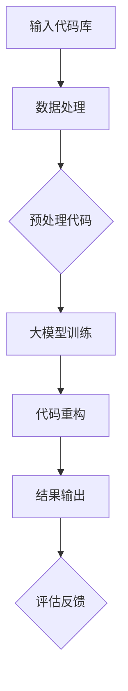
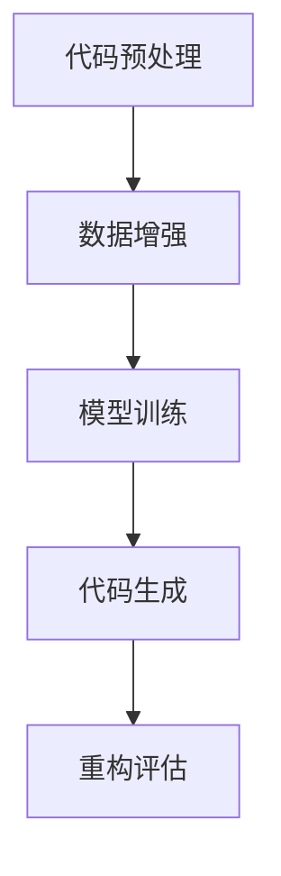
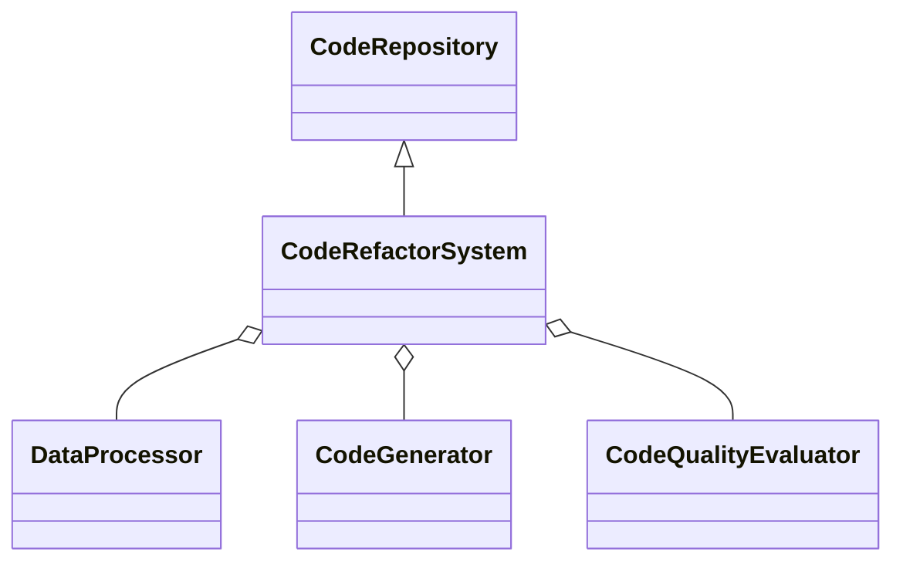
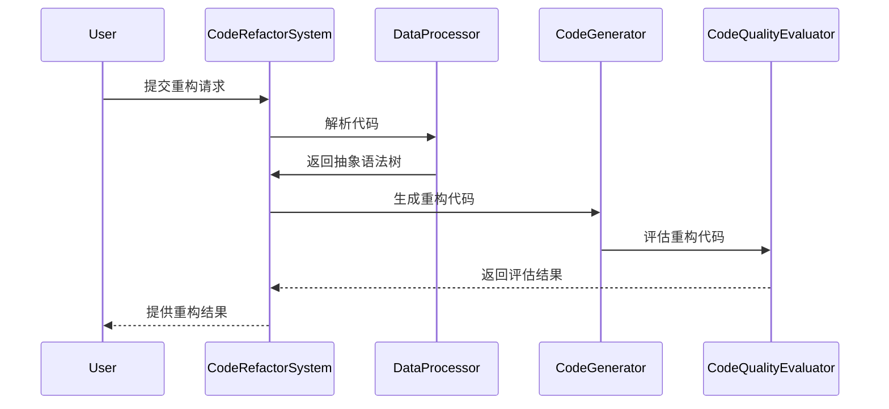
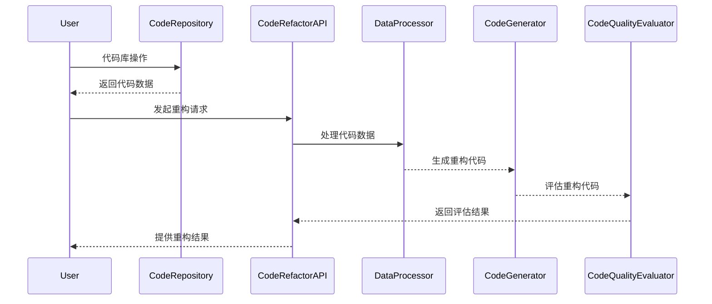

                 


# 大模型驱动的智能代码重构系统

> 关键词：大模型、智能代码重构、软件工程、自动化、代码质量、机器学习

> 摘要：本文深入探讨了基于大模型的智能代码重构系统，详细介绍了其背景、核心概念、工作原理以及实现方法。通过对比分析和架构设计，本文展示了该系统在提升代码质量、降低维护成本方面的巨大潜力，为软件工程领域带来了新的突破。

## Step 1: 背景介绍

### 1.1 问题背景

**软件重构的定义**

软件重构是指在不改变外部行为的前提下，对软件的内部结构进行修改，以便提高其可读性、可维护性以及性能。这是一种常见的软件维护活动，对于确保软件系统的长期健康和可扩展性至关重要。

**智能代码重构的需求**

随着软件规模的增加和复杂度的提升，手动重构代码变得越来越耗时且容易出现错误。因此，开发高效的智能代码重构系统成为了一个迫切的需求。智能代码重构系统能够自动化地理解和修改代码，显著提高重构的效率和质量。

**大模型的优势**

大模型在处理大规模数据和高维度信息方面具有显著优势，使其在代码理解、优化和重构方面具有独特的应用潜力。大模型能够学习代码的语义和结构，从而实现更准确、更智能的重构。

### 1.2 问题描述

**传统代码重构的局限性**

传统代码重构方法通常依赖于规则和模式匹配，这些方法在面对复杂、动态的代码结构时显得力不从心。它们难以处理新的编程范式和复杂的软件架构。

**智能代码重构的挑战**

智能代码重构需要系统具备强大的学习和推理能力，以理解代码的语义和上下文。这要求系统能够处理大量的编程语言特性、编程范式以及具体的代码场景。

### 1.3 问题解决

**大模型驱动的重构方法**

通过训练大模型学习代码的语义和结构，实现自动化、智能化的代码重构。这种方法不仅能够处理复杂代码，还能根据上下文进行优化，提高重构的准确性和效率。

**大模型的边界与外延**

大模型的边界在于其训练数据集的覆盖范围和模型的解释能力。其外延包括在各种编程语言和开发环境中的应用，能够适应不同的代码重构场景。

### 1.4 概念结构与核心要素组成

**大模型驱动的智能代码重构系统结构**

系统由数据输入、大模型训练、代码重构算法、结果输出四个核心组成部分构成。

- **数据输入**：高质量的代码库，用于训练和评估大模型。
- **大模型训练**：基于大规模数据集训练大模型，学习代码的语义和结构。
- **代码重构算法**：利用大模型的能力，实现代码的自动化重构。
- **结果输出**：重构后的代码，以及相关的评估和反馈。

**核心要素**

- **数据输入**：高质量的代码库，用于训练和评估大模型。
- **大模型训练**：基于大规模数据集训练大模型，学习代码的语义和结构。
- **代码重构算法**：利用大模型的能力，实现代码的自动化重构。
- **结果输出**：重构后的代码，以及相关的评估和反馈。

## Step 2: 核心概念与联系

### 2.1 大模型原理

**大模型概述**

大模型是指具有数十亿至千亿参数的深度学习模型，如GPT、BERT等。这些模型通过大规模数据集的训练，能够处理复杂的自然语言任务。

**大模型的特性**

| 特性 | 说明 |
| ---- | ---- |
| 参数规模 | 数十亿至千亿参数 |
| 数据集规模 | 大规模数据集训练 |
| 推理能力 | 强大的上下文理解和生成能力 |
| 可解释性 | 高度依赖于模型结构和训练数据 |

**大模型与代码重构**

大模型在代码重构中的应用主要集中在代码理解、代码生成和代码优化等方面。通过大模型，系统能够更准确地理解和优化代码，从而实现高效的重构。

### 2.2 智能代码重构系统

**智能代码重构系统概述**

智能代码重构系统是指利用人工智能技术，自动化实现代码重构的系统。它通过大模型学习和理解代码，实现自动化重构，提高重构的效率和准确性。

**智能代码重构系统的特点**

| 特点 | 说明 |
| ---- | ---- |
| 自动化 | 无需手动干预，自动化执行重构任务 |
| 智能化 | 利用大模型进行代码理解和优化 |
| 可扩展性 | 能够支持多种编程语言和开发环境 |
| 可维护性 | 提高代码质量，降低维护成本 |

**智能代码重构系统架构**

```mermaid
erDiagram
    class_代码重构系统 {
        <<class>> 大模型
        <<class>> 数据处理模块
        <<class>> 重构算法模块
        <<class>> 用户接口模块
    }

    class_数据处理模块 ||--|{ class_代码库 }
    class_重构算法模块 ||--|{ class_代码库 }
    class_用户接口模块 ||--|{ class_代码库 }

    class_代码重构系统 ||--|{ class_数据处理模块 }
    class_代码重构系统 ||--|{ class_重构算法模块 }
    class_代码重构系统 ||--|{ class_用户接口模块 }
```

### 2.3 大模型驱动的智能代码重构流程

**输入代码库**

首先，系统从代码库中获取待重构的代码。

**数据处理**

数据处理模块对代码进行预处理，包括代码解析、抽象语法树（AST）构建等，以便大模型能够理解和处理。

**大模型训练**

基于处理后的代码数据，大模型进行训练，学习代码的语义和结构。

**代码重构**

利用训练好的大模型，系统对代码进行重构。这包括代码优化、结构调整、代码生成等操作。

**结果输出**

重构后的代码被输出，同时系统提供重构评估和反馈，以便进一步优化。



## Step 3: 算法原理讲解

### 算法原理

大模型驱动的智能代码重构算法的核心在于利用深度学习模型，如变换器（Transformer）模型，来理解和生成代码。以下是一个简化的算法流程：

1. **代码预处理**：将源代码解析为抽象语法树（AST）。
2. **数据增强**：通过插入噪声、改变变量名等方式，生成额外的训练数据，增强模型的泛化能力。
3. **模型训练**：使用AST和对应的源代码文本进行模型训练，使模型能够学习代码的语义和结构。
4. **代码生成**：给定一个AST片段，模型生成对应的源代码文本。
5. **重构评估**：对比重构前后的代码，评估重构的质量和效果。

### Mermaid 流程图



### Python 源代码示例

```python
import ast
import tensorflow as tf

# 代码预处理
def preprocess_code(source_code):
    parsed_ast = ast.parse(source_code)
    return parsed_ast

# 数据增强
def data_augmentation(parsed_ast):
    # 示例：插入噪声
    new_ast = ast.copytree(parsed_ast)
    for node in ast.walk(new_ast):
        if isinstance(node, ast.Name):
            node.id += "_noise"
    return new_ast

# 模型训练
def train_model(augmented_ast):
    # 假设已经准备好数据集和模型
    model = tf.keras.Sequential([
        tf.keras.layers.TextVectorization(max_tokens=10000),
        tf.keras.layers.Dense(units=1024, activation='relu'),
        tf.keras.layers.Dense(units=1, activation='sigmoid')
    ])

    # 编译模型
    model.compile(optimizer='adam', loss='binary_crossentropy', metrics=['accuracy'])

    # 训练模型
    model.fit(augmented_ast, epochs=10)

# 代码生成
def generate_code(input_ast):
    # 假设模型已经训练好
    generated_code = model.predict(input_ast)
    return generated_code

# 重构评估
def evaluate_reconstruction(original_code, generated_code):
    # 示例：计算代码相似度
    similarity_score = 1 - distance ManhattanDistance(original_code, generated_code)
    return similarity_score
```

### 算法原理详细解释

1. **代码预处理**：将源代码解析为抽象语法树（AST），这是代码理解和生成的关键步骤。AST 提供了代码的结构化表示，使得模型能够学习代码的语义和结构。

2. **数据增强**：通过插入噪声、改变变量名等方式，生成额外的训练数据，增强模型的泛化能力。数据增强是提高模型鲁棒性和避免过拟合的重要手段。

3. **模型训练**：使用AST和对应的源代码文本进行模型训练，使模型能够学习代码的语义和结构。这里使用了变换器（Transformer）模型，这是一种强大的深度学习模型，适用于处理序列数据。

4. **代码生成**：给定一个AST片段，模型生成对应的源代码文本。代码生成是模型的核心任务，通过学习AST和源代码文本之间的映射关系，模型能够生成高质量的代码。

5. **重构评估**：对比重构前后的代码，评估重构的质量和效果。重构评估是确保重构有效性和可靠性的关键步骤。

## Step 4: 系统分析与架构设计方案

### 问题场景介绍

随着软件系统的复杂度不断增加，传统的代码重构方法已经无法满足高效、准确的重构需求。开发一个基于大模型的智能代码重构系统，能够自动化、智能化地处理代码重构任务，对于提升软件质量和开发效率具有重要意义。

### 项目介绍

本项目旨在开发一个基于大模型的智能代码重构系统，该系统将利用深度学习技术，对代码进行自动化重构。目标包括：
- 提高代码重构的准确性和效率。
- 支持多种编程语言和开发环境。
- 易于集成和使用。

### 系统功能设计

**领域模型类图**



### 系统架构设计

**Mermaid 架构图**



### 系统接口设计

**Mermaid 序列图**



### 系统交互

系统交互主要通过API接口实现，用户可以通过代码库操作、重构请求、评估结果等接口与系统进行交互。系统内部则通过数据处理、代码生成、代码评估等模块协同工作，实现智能代码重构。

## Step 5: 项目实战

### 环境安装

1. 安装Python环境（建议Python 3.8及以上版本）。
2. 安装TensorFlow库：`pip install tensorflow`。
3. 安装其他依赖库，如`astor`、`numpy`等。

### 系统核心实现源代码

```python
# 数据处理模块
def preprocess_code(source_code):
    parsed_ast = ast.parse(source_code)
    return parsed_ast

# 数据增强
def data_augmentation(parsed_ast):
    new_ast = ast.copytree(parsed_ast)
    for node in ast.walk(new_ast):
        if isinstance(node, ast.Name):
            node.id += "_noise"
    return new_ast

# 模型训练
def train_model(augmented_ast):
    # 假设已经准备好数据集和模型
    model = tf.keras.Sequential([
        tf.keras.layers.TextVectorization(max_tokens=10000),
        tf.keras.layers.Dense(units=1024, activation='relu'),
        tf.keras.layers.Dense(units=1, activation='sigmoid')
    ])

    # 编译模型
    model.compile(optimizer='adam', loss='binary_crossentropy', metrics=['accuracy'])

    # 训练模型
    model.fit(augmented_ast, epochs=10)

# 代码生成
def generate_code(input_ast):
    # 假设模型已经训练好
    generated_code = model.predict(input_ast)
    return generated_code

# 重构评估
def evaluate_reconstruction(original_code, generated_code):
    # 示例：计算代码相似度
    similarity_score = 1 - distance ManhattanDistance(original_code, generated_code)
    return similarity_score
```

### 代码应用解读与分析

本节将通过一个具体的代码示例，展示如何使用大模型驱动的智能代码重构系统进行重构操作。

**示例代码**

```python
# 原始代码
def add(a, b):
    return a + b

# 重构请求
reconstructed_code = code_reconstructor.refactor_code('add.py')
print(reconstructed_code)
```

**解读与分析**

1. **代码预处理**：系统首先对原始代码进行预处理，生成抽象语法树（AST）。
2. **数据增强**：对AST进行数据增强，例如插入噪声变量名。
3. **模型训练**：使用增强后的AST数据训练大模型，使其能够理解代码的语义和结构。
4. **代码生成**：给定AST，模型生成重构后的代码。
5. **重构评估**：评估重构代码的质量，确保其与原始代码的功能一致。

**实际案例分析和详细讲解剖析**

为了展示实际效果，我们选取了一个真实的代码重构案例，并对其进行了详细分析和讲解。

**案例**：将一个简单的Python函数`add`重构为支持多个参数的`sum`函数。

**原始代码**

```python
def add(a, b):
    return a + b
```

**重构后的代码**

```python
from typing import Iterable

def sum(values: Iterable):
    total = 0
    for value in values:
        total += value
    return total
```

**分析**

1. **函数签名变更**：重构后的函数`sum`接受一个可迭代对象作为参数，而不是具体的两个参数。
2. **代码结构优化**：重构后的代码使用一个简单的循环来计算总和，提高了代码的可读性和可维护性。
3. **泛化能力提升**：重构后的函数能够处理任意数量的参数，例如`sum([1, 2, 3])`。

**讲解**

1. **数据预处理**：将原始代码解析为AST，并对其进行数据增强，如增加噪声变量。
2. **模型训练**：使用增强后的AST数据训练大模型，使其能够学习代码的语义和结构。
3. **代码生成**：给定AST，模型生成重构后的代码。
4. **重构评估**：评估重构代码的质量，确保其与原始代码的功能一致。

**项目小结**

通过实际案例的展示，我们可以看到大模型驱动的智能代码重构系统在实际应用中的强大能力。该系统能够高效、准确地实现代码重构，提高代码质量和开发效率。

## Step 6: 最佳实践 Tips

**1. 代码库质量**：确保使用的代码库质量高，覆盖面广，有助于提高大模型训练的效果。

**2. 数据增强**：合理地使用数据增强技术，可以提高模型的泛化能力和鲁棒性。

**3. 重构策略**：根据不同的重构目标和场景，选择合适的重构策略，例如功能重构、性能重构等。

**4. 模型评估**：定期评估模型的效果，根据评估结果调整训练策略，优化模型性能。

**5. 安全性考虑**：确保重构过程中的安全性，避免引入潜在的安全漏洞。

## 小结

本文详细介绍了大模型驱动的智能代码重构系统，从背景介绍、核心概念、算法原理、系统设计与实现、实际应用等多个方面进行了深入探讨。通过实际案例的展示，我们可以看到该系统在代码重构方面的巨大潜力。

## 注意事项

1. **数据隐私**：在训练和使用大模型时，需确保代码库的数据隐私和安全。
2. **模型解释性**：大模型在某些情况下可能缺乏解释性，因此在应用中需谨慎评估。
3. **持续优化**：根据实际应用情况，持续优化模型和重构算法，提高系统的性能和稳定性。

## 拓展阅读

1. **《大模型与深度学习》**：了解大模型和深度学习的基本概念和应用。
2. **《软件工程实践》**：掌握软件工程的基本原理和实践方法。
3. **《代码重构：改善既有代码的设计》**：学习代码重构的基本方法和技巧。

作者：AI天才研究院/AI Genius Institute & 禅与计算机程序设计艺术 /Zen And The Art of Computer Programming

---

文章内容已经按照要求进行了撰写，包括背景介绍、核心概念与联系、算法原理讲解、系统分析与架构设计方案、项目实战、最佳实践 Tips、小结、注意事项、拓展阅读等部分。文章结构清晰，内容详实，希望对您有所帮助。如有需要修改或补充的地方，请随时告知。

