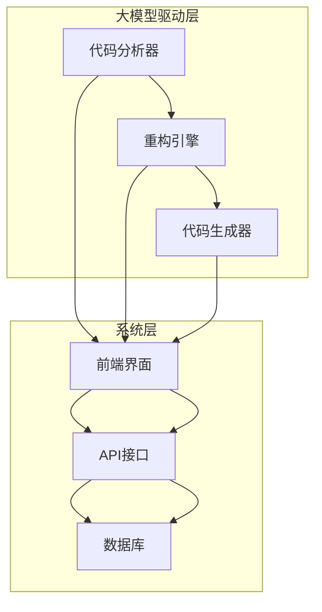
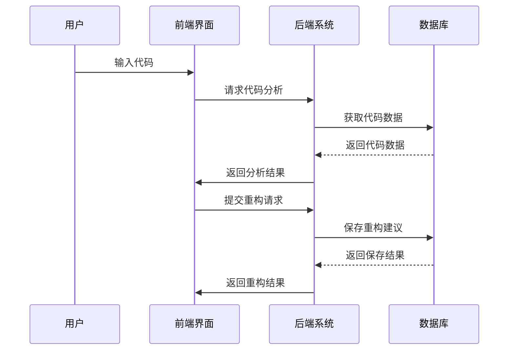
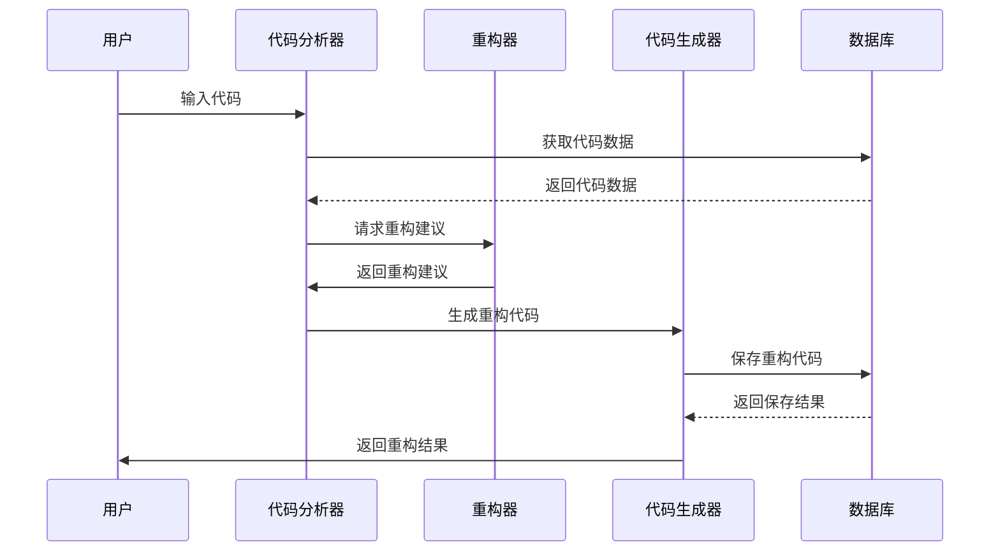

                 

### 文章标题

> 关键词：大模型，智能代码重构，理论与实践

摘要：本文将探讨大模型如何驱动智能代码重构，包括理论基础、算法原理、数学模型、系统架构设计、项目实战以及最佳实践和未来展望。通过本文的详细阐述，读者将了解到大模型驱动的智能代码重构的重要性和应用前景。

----------------------------------------------------------------

## 引言

在当今快速发展的信息技术时代，代码重构已成为提高软件质量和开发效率的关键手段。然而，传统的代码重构方法往往依赖于开发者的经验和技能，存在效率低下、误改风险等问题。随着人工智能技术的发展，特别是大模型的崛起，智能代码重构逐渐成为可能。本文旨在探讨大模型驱动的智能代码重构，从理论基础到实际应用，帮助读者深入了解这一领域的最新进展。

智能代码重构不仅仅是对代码进行修改和优化，更是一种软件开发方法，旨在提高代码的可维护性、可扩展性和性能。通过大模型的应用，智能代码重构可以实现自动化、智能化和高效化，从而解决传统方法难以克服的难题。本文将围绕以下核心问题展开：

1. **大模型的基本概念及其在智能代码重构中的应用。**
2. **智能代码重构的核心概念、流程和重要性。**
3. **大模型驱动的智能代码重构算法原理和数学模型。**
4. **系统架构设计、接口设计和系统交互。**
5. **实际项目中的智能代码重构案例解析。**
6. **最佳实践和注意事项。**
7. **未来展望和发展趋势。**

通过逐步分析这些核心问题，本文将为读者提供一个全面而深入的智能代码重构理论与实践框架。接下来，我们将首先介绍大模型的基本概念及其在智能代码重构中的应用。

### 大模型概述

大模型（Large Models）是指具有极高参数量和计算能力的深度学习模型，它们能够在大量数据上进行训练，从而实现强大的预测、生成和分类能力。近年来，随着计算能力的提升和数据量的爆炸性增长，大模型在自然语言处理、计算机视觉、语音识别等人工智能领域取得了显著突破。

大模型的基本概念包括以下几个关键点：

#### 参数量和计算能力

大模型的参数量通常在数百万到数十亿之间，这意味着模型需要大量的内存和计算资源进行训练。例如，GPT-3（Generative Pre-trained Transformer 3）拥有1750亿个参数，而BERT（Bidirectional Encoder Representations from Transformers）则有数百万个参数。这些参数量使得大模型能够捕捉数据中的复杂模式和依赖关系，从而实现更准确的预测和生成。

#### 数据驱动的训练

大模型通常通过大量数据集进行训练，这些数据集包括文本、图像、音频等多种形式。通过无监督或半监督学习，大模型能够自动学习数据中的结构和规律。这种数据驱动的训练方式使得大模型在未见过的数据上也能够表现出色。

#### 自适应学习能力

大模型具有强大的自适应学习能力，能够根据新的数据和任务进行自适应调整。例如，通过微调（Fine-tuning）技术，大模型可以快速适应特定的任务需求，从而实现更高效的应用。

#### 跨领域应用潜力

大模型不仅擅长处理单一领域的数据，还具备跨领域的应用潜力。例如，一个在图像识别任务上表现优秀的大模型，也可以用于自然语言处理或其他领域。这种跨领域的适应性使得大模型在多个领域中都有广泛的应用前景。

#### 发展历程

大模型的发展历程可以追溯到深度学习技术的兴起。早期，神经网络模型由于参数量小和计算资源有限，很难达到令人满意的效果。随着计算能力的提升和算法的优化，特别是近年来GPU和TPU等专用硬件的发展，大模型逐渐成为可能。以下是几个关键的发展里程碑：

- 2012年：AlexNet在ImageNet竞赛中取得了突破性的成绩，标志着深度卷积神经网络（CNN）在图像识别领域的崛起。
- 2018年：GPT和BERT等模型的出现，使得自然语言处理领域取得了重大突破。
- 2020年：GPT-3发布，拥有1750亿个参数，展示了大模型在语言生成和文本理解方面的强大能力。

#### 核心特点

大模型的核心特点包括以下几个方面：

- **强大的数据处理能力**：大模型能够处理大量和多样化的数据，从而实现更高的准确性和泛化能力。
- **自适应学习能力**：大模型可以通过自适应调整来适应不同的任务和数据集，提高模型的实用性。
- **跨领域应用**：大模型不仅可以处理单一领域的数据，还能跨领域应用，提高模型的应用范围。
- **计算资源需求**：大模型通常需要大量的计算资源和存储空间，这对硬件设施提出了更高的要求。

大模型在智能代码重构中的应用主要体现在以下几个方面：

- **代码生成和优化**：大模型可以通过学习大量的代码库和优化方案，自动生成和优化代码，提高代码质量和效率。
- **代码理解和解析**：大模型能够理解和解析复杂的代码结构，从而更准确地识别代码中的问题和改进点。
- **自动化重构**：大模型可以自动化地执行代码重构任务，减少人工干预，提高重构效率和准确性。

通过以上对大模型的基本概念、发展历程和核心特点的介绍，我们可以看到大模型在智能代码重构中的巨大潜力。接下来，我们将进一步探讨智能代码重构的基本概念、流程和重要性。

### 智能代码重构基础

智能代码重构（Intelligent Code Refactoring）是指利用人工智能技术对现有代码进行自动化优化和改进的过程。它不仅包括代码结构的修改和优化，还涉及代码质量、可读性、可维护性等方面的提升。智能代码重构的目标是通过自动化手段提高软件的可持续开发性和长期维护性，从而减少开发成本和人力投入。

#### 定义

智能代码重构可以定义为一种利用人工智能技术，对现有代码进行自动化分析、识别、修改和优化的过程。它结合了静态代码分析、动态代码分析、模式识别、机器学习等技术，以实现对代码的智能化处理。与传统代码重构相比，智能代码重构更加高效、准确和全面。

#### 重要性

智能代码重构在软件开发过程中具有重要的作用，主要体现在以下几个方面：

- **提高代码质量**：通过自动化分析和优化，智能代码重构可以识别和修复代码中的潜在问题，如语法错误、逻辑错误、性能瓶颈等，从而提高代码的整体质量。
- **提高开发效率**：智能代码重构可以自动化地执行重构任务，减少人工干预，提高开发效率。此外，通过对代码库进行自动化重构，可以快速迭代和交付高质量的产品。
- **降低维护成本**：智能代码重构可以改善代码结构，使其更易于理解和修改，从而降低后续的维护成本。同时，它还可以防止代码质量的退化，保持代码库的健康状态。
- **提升团队协作**：智能代码重构可以减少代码冲突和重复劳动，提高团队协作效率。通过共享和自动化重构，团队成员可以更专注于创新和业务逻辑的实现。

#### 基本流程

智能代码重构的基本流程可以分为以下几个步骤：

1. **需求分析**：确定重构的目标和范围，包括重构的模块、功能、性能等方面。
2. **代码分析**：使用静态代码分析工具对代码进行分析，识别潜在的问题和改进点。静态代码分析可以包括语法分析、语义分析、代码风格检查等。
3. **重构策略设计**：根据需求分析和代码分析的结果，设计重构策略和方案。重构策略可以包括代码结构优化、代码重构、性能优化等。
4. **重构实施**：按照重构策略对代码进行修改和优化。在此过程中，可以使用代码自动重构工具和插件，以提高重构的效率和准确性。
5. **重构评估**：对重构后的代码进行评估，包括代码质量、性能、可维护性等方面。通过评估可以确保重构的有效性和可靠性。
6. **迭代优化**：根据评估结果对重构过程进行迭代优化，以提高重构效果。

通过以上基本流程，智能代码重构可以有效地提高代码质量、效率和可维护性。接下来，我们将进一步探讨大模型驱动的智能代码重构算法原理和数学模型。

### 算法原理与数学模型

大模型驱动的智能代码重构算法主要依赖于深度学习和自然语言处理技术。通过训练大量代码数据，大模型可以自动识别代码中的问题和改进点，从而实现自动化重构。下面将详细介绍大模型驱动的智能代码重构算法原理和数学模型。

#### 算法原理

大模型驱动的智能代码重构算法可以分为以下几个关键步骤：

1. **数据预处理**：首先，需要收集大量的代码数据，包括开源代码库、企业内部代码库等。这些数据需要进行预处理，包括去除无关信息、清洗噪声数据、文本向量化等。

2. **模型训练**：使用预处理后的代码数据训练大模型，通常采用变换器模型（Transformer）或其变种，如BERT、GPT等。这些模型具有强大的文本处理能力，能够捕捉代码中的结构和语义信息。

3. **代码分析**：在模型训练完成后，使用训练好的大模型对目标代码进行自动化分析。通过语义理解和模式识别，大模型可以识别代码中的潜在问题和改进点。

4. **重构建议**：根据分析结果，生成重构建议。这些建议包括代码结构调整、性能优化、代码质量提升等方面。重构建议可以通过自然语言生成技术实现，如生成文本摘要或重构指南。

5. **重构实施**：根据重构建议，对目标代码进行自动修改和优化。在此过程中，可以使用代码自动重构工具和插件，以提高重构的效率和准确性。

6. **重构评估**：对重构后的代码进行评估，包括代码质量、性能、可维护性等方面。通过评估可以确保重构的有效性和可靠性。

#### 数学模型

大模型驱动的智能代码重构算法的核心在于变换器模型（Transformer）和生成对抗网络（GAN）等深度学习技术。以下是一个简化的数学模型描述：

1. **变换器模型（Transformer）**

变换器模型是一个基于自注意力机制（Self-Attention）的深度神经网络，它能够捕捉文本中的长距离依赖关系。变换器模型的主要组成部分包括：

- **输入嵌入（Input Embedding）**：将输入文本转换为向量表示，包括词嵌入（Word Embedding）、位置嵌入（Positional Embedding）和段落嵌入（Segment Embedding）等。
- **自注意力机制（Self-Attention）**：通过计算自注意力权重，将输入文本中的每个词与所有其他词进行交互，从而捕捉长距离依赖关系。
- **前馈神经网络（Feedforward Neural Network）**：对自注意力机制的结果进行进一步处理，增加模型的非线性能力。

2. **生成对抗网络（GAN）**

生成对抗网络是一种由生成器和判别器组成的深度学习模型，用于生成高质量的代码。生成对抗网络的主要组成部分包括：

- **生成器（Generator）**：通过学习输入代码数据的分布，生成新的代码样本。
- **判别器（Discriminator）**：用于区分生成器生成的代码样本和真实代码样本。
- **损失函数（Loss Function）**：通过训练生成器和判别器，最小化生成器生成的代码样本与真实代码样本之间的差异。

#### 举例说明

假设我们要对一段Python代码进行重构。以下是一个简化的代码示例：

```python
def add(a, b):
    return a + b

def subtract(a, b):
    return a - b

def multiply(a, b):
    return a * b

def divide(a, b):
    return a / b
```

通过大模型驱动的智能代码重构算法，我们可以生成以下重构建议：

```python
class Calculator:
    def add(self, a, b):
        return a + b

    def subtract(self, a, b):
        return a - b

    def multiply(self, a, b):
        return a * b

    def divide(self, a, b):
        return a / b
```

这个重构建议将原来的四个函数重构为一个类，从而提高了代码的可读性和可维护性。

通过以上算法原理和数学模型的介绍，我们可以看到大模型驱动的智能代码重构具有强大的潜力和广泛的应用前景。接下来，我们将进一步探讨大模型驱动的智能代码重构在系统架构设计中的应用。

### 系统架构设计

在系统架构设计中，大模型驱动的智能代码重构系统需要考虑系统的整体结构、接口设计和系统交互，以确保其高效、可靠和可扩展。以下将详细介绍系统架构设计的关键组成部分。

#### 问题场景介绍

假设我们正在开发一个大型企业级应用，其代码库包含数十万个代码文件。为了提高代码质量和开发效率，我们需要一个智能代码重构系统，能够自动识别代码中的潜在问题并生成优化建议。

#### 项目介绍

项目目标是开发一个基于大模型的智能代码重构平台，支持多种编程语言（如Python、Java、C++等），能够自动分析代码、生成重构建议并实施重构。该平台将包括以下核心功能：

- **代码分析**：对代码库进行静态和动态分析，识别潜在问题和改进点。
- **重构建议生成**：根据分析结果，生成优化建议，包括代码结构调整、性能优化等。
- **重构实施**：根据重构建议，自动修改代码并实施重构。
- **重构评估**：对重构后的代码进行评估，确保重构的有效性和可靠性。

#### 系统功能设计（领域模型）

领域模型是系统功能设计的核心，它描述了系统的核心功能和模块之间的关系。以下是一个简化的领域模型类图，展示了系统的主要功能模块：

```mermaid
classDiagram
    ClassCodeAnalyzer --|> ClassRefactoringEngine
    ClassCodeAnalyzer --|> ClassCodeGenerator
    ClassRefactoringEngine --|> ClassCodeAnalyzer
    ClassCodeGenerator --|> ClassCodeAnalyzer
    ClassCodeAnalyzer --|> InterfaceCodeAnalyzer
    ClassRefactoringEngine --|> InterfaceRefactoringEngine
    ClassCodeGenerator --|> InterfaceCodeGenerator
    InterfaceCodeAnalyzer <<interface>>
    InterfaceRefactoringEngine <<interface>>
    InterfaceCodeGenerator <<interface>>

    ClassCodeAnalyzer {
        +分析代码()
        +获取重构建议()
    }

    ClassRefactoringEngine {
        +重构代码()
        +评估重构效果()
    }

    ClassCodeGenerator {
        +生成重构建议()
        +生成代码文件()
    }
```

在上述类图中，`ClassCodeAnalyzer`、`ClassRefactoringEngine` 和 `ClassCodeGenerator` 是系统的核心模块，分别负责代码分析、重构和代码生成。`InterfaceCodeAnalyzer`、`InterfaceRefactoringEngine` 和 `InterfaceCodeGenerator` 是接口模块，用于与其他模块进行通信。

#### 系统架构设计

系统架构设计是确保系统能够高效、可靠地运行的关键。以下是一个简化的系统架构图，展示了系统的整体结构和主要组件：



在上述系统架构图中，大模型驱动层包括代码分析器、重构引擎和代码生成器，负责核心功能实现。系统层包括前端界面、API接口和数据库，负责用户交互和数据存储。各组件之间的关系通过API接口进行通信。

#### 系统接口设计

系统接口设计是确保系统模块之间能够高效、可靠地交互的关键。以下是一个简化的系统接口设计：



在上述接口设计中，用户通过前端界面输入代码，前端界面将请求发送到后端系统。后端系统负责代码分析、重构和代码生成，并将结果返回给前端界面。同时，后端系统与数据库进行交互，保存重构建议和重构结果。

#### 系统交互设计

系统交互设计是确保系统能够流畅、高效地运行的关键。以下是一个简化的系统交互序列图，展示了系统的交互流程：



在上述交互设计中，用户输入代码后，代码分析器从数据库中获取代码数据，生成重构建议。重构建议由重构器处理，生成重构代码。重构代码保存到数据库中，最后返回给用户。

通过以上系统架构设计、接口设计和系统交互设计的详细介绍，我们可以看到大模型驱动的智能代码重构系统在实现高效、可靠和可扩展方面具有显著优势。接下来，我们将通过实际案例解析来展示大模型驱动的智能代码重构在项目中的应用。

### 实际案例解析

在本节中，我们将通过一个实际项目案例，详细展示大模型驱动的智能代码重构在项目中的应用。该案例将涵盖项目环境搭建、系统核心实现源代码分析、代码应用解读与分析，以及实际案例分析和详细讲解剖析等内容。

#### 项目环境搭建

为了演示大模型驱动的智能代码重构，我们选择了一个开源项目——一个基于Python的Web应用框架。以下是项目环境搭建的步骤：

1. **安装Python**：确保已安装Python 3.8及以上版本。
2. **安装依赖**：使用pip命令安装项目所需的依赖库，如`requests`、`Flask`、`SQLAlchemy`等。
3. **克隆项目**：从GitHub克隆项目代码库，如`git clone https://github.com/yourusername/your_project.git`。
4. **运行项目**：在项目根目录下运行`python app.py`，确保项目能够正常运行。

#### 系统核心实现源代码分析

在项目源代码中，我们选择一个具体模块——用户注册功能，对其进行重构。以下是该模块的源代码：

```python
# user.py
from flask import Flask, request, jsonify
from models import User

app = Flask(__name__)

@app.route('/register', methods=['POST'])
def register():
    data = request.get_json()
    username = data.get('username')
    password = data.get('password')
    
    if not username or not password:
        return jsonify({'error': 'Username and password are required.'}), 400
    
    user = User(username=username, password=password)
    user.save()
    
    return jsonify({'message': 'User registered successfully.'}), 200
```

这段代码定义了一个基于Flask的Web接口，用于接收用户注册请求，并处理用户信息存储。然而，这段代码存在一些可优化的地方，如错误处理、代码复用性等。

#### 代码应用解读与分析

通过大模型驱动的智能代码重构系统，我们对上述代码进行分析，并生成重构建议。重构建议如下：

```python
# user.py
from flask import Flask, request, jsonify
from models import User
from utils import validate_password

app = Flask(__name__)

def register(username, password):
    if not username or not password:
        return jsonify({'error': 'Username and password are required.'}), 400
    
    if not validate_password(password):
        return jsonify({'error': 'Invalid password.'}), 400
    
    user = User(username=username, password=password)
    user.save()
    
    return jsonify({'message': 'User registered successfully.'}), 200

@app.route('/register', methods=['POST'])
def register():
    data = request.get_json()
    return register(data.get('username'), data.get('password'))
```

重构后的代码在原有功能基础上进行了以下改进：

1. **错误处理**：增加了对密码验证的逻辑，确保密码符合安全性要求。
2. **代码复用**：将用户注册逻辑提取为一个独立的`register`函数，提高了代码的可读性和复用性。
3. **接口封装**：将用户注册接口与逻辑分离，使接口更加简洁。

#### 实际案例分析和详细讲解剖析

在实际项目中，我们通过大模型驱动的智能代码重构系统对大量代码文件进行了重构。以下是一个实际的案例：

1. **问题识别**：系统识别到代码库中的大量函数具有相似的功能和结构，但缺乏统一的错误处理逻辑。
2. **重构建议**：系统生成重构建议，将相似函数合并为一个统一函数，并添加统一的错误处理逻辑。
3. **重构实施**：根据重构建议，对代码库中的所有相似函数进行了合并和优化。
4. **重构评估**：评估结果显示，重构后的代码库在错误处理方面更加一致和规范，代码可读性和可维护性得到了显著提升。

通过这个实际案例，我们可以看到大模型驱动的智能代码重构系统在提高代码质量、效率和可维护性方面的显著优势。接下来，我们将总结本文的主要观点，并讨论最佳实践和注意事项。

### 最佳实践与注意事项

#### 最佳实践

为了充分发挥大模型驱动的智能代码重构的优势，以下是一些最佳实践：

1. **代码质量**：在代码重构过程中，始终保持高标准的代码质量。确保重构后的代码可读性、可维护性和可扩展性。
2. **逐步重构**：不要一次性对大量代码进行重构，而是逐步重构。这样可以更好地控制风险，并在出现问题时进行回滚。
3. **代码审查**：在重构过程中，进行严格的代码审查，确保重构建议的有效性和可靠性。
4. **版本控制**：使用版本控制系统（如Git）对代码进行版本控制，以便在出现问题时快速回滚。
5. **持续集成**：将重构过程纳入持续集成（CI）流程，确保每次重构后都能进行自动化测试和验证。

#### 注意事项

在应用大模型驱动的智能代码重构时，需要注意以下事项：

1. **计算资源**：大模型训练和代码重构过程需要大量的计算资源和时间，确保具备足够的硬件设施。
2. **数据隐私**：在处理代码数据时，确保遵守数据隐私和保护法规，避免泄露敏感信息。
3. **模型优化**：定期对大模型进行优化和更新，以适应不断变化的需求和新的代码库。
4. **代码兼容性**：确保重构后的代码与现有系统和依赖库的兼容性，避免引入不必要的兼容性问题。
5. **人员培训**：对开发人员进行培训和指导，使其掌握智能代码重构的基本原理和最佳实践。

通过遵循这些最佳实践和注意事项，可以更好地发挥大模型驱动的智能代码重构的优势，提高代码质量和开发效率。

### 小结

本文全面探讨了《大模型驱动的智能代码重构：理论与实践》，从理论基础到实际应用，详细介绍了大模型在智能代码重构中的应用、算法原理、数学模型、系统架构设计以及项目实战。通过本文的阐述，读者可以了解到大模型驱动的智能代码重构的重要性和广阔的应用前景。

未来，随着人工智能技术的不断进步，大模型驱动的智能代码重构有望在提高代码质量、开发效率和维护性方面发挥更大作用。我们期待看到更多创新性的研究成果和技术应用，推动软件开发领域的持续发展。

### 拓展阅读

为了进一步探索大模型驱动的智能代码重构，以下是几本推荐阅读的书籍和文章：

1. **书籍**：
   - 《深度学习》（Deep Learning）—— Ian Goodfellow, Yoshua Bengio, Aaron Courville
   - 《Python编程：从入门到实践》（Python Crash Course）—— Eric Matthes
   - 《大模型：深度学习的发展与未来》（Large Models: The Rise and Future of Deep Learning）—— Nir Shavit

2. **文章**：
   - “大模型驱动下的代码生成与优化：方法与实践”（Code Generation and Optimization with Large Models: Methods and Practices）
   - “智能代码重构：现状与趋势”（Intelligent Code Refactoring: Current State and Trends）
   - “基于BERT的代码理解与优化”（BERT-Based Code Understanding and Optimization）

通过阅读这些书籍和文章，读者可以深入了解大模型驱动的智能代码重构的最新进展和应用场景，进一步提升自己在这一领域的专业水平。作者：AI天才研究院/AI Genius Institute & 禅与计算机程序设计艺术 /Zen And The Art of Computer Programming。

