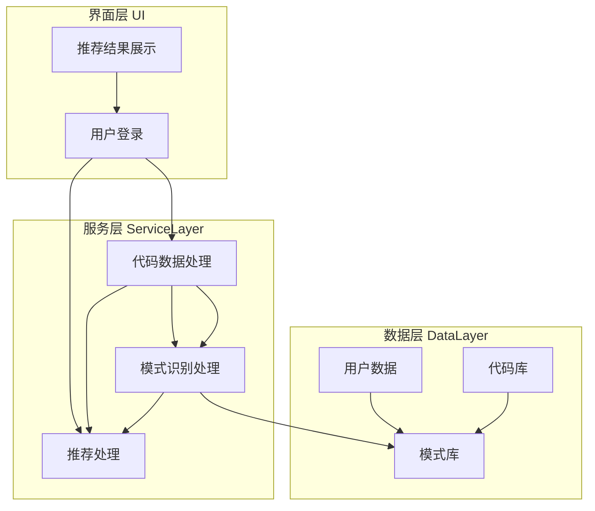

                 

# 大模型驱动的智能代码重用：模式识别与推荐

关键词：智能代码重用，模式识别，推荐系统，大模型

摘要：本文深入探讨了基于大模型的智能代码重用技术，通过模式识别和推荐系统的结合，实现代码的自动重用。首先，我们介绍了代码重用的问题背景和核心概念，包括模式识别和推荐系统的基础知识。接着，我们详细分析了模式识别的原理和常见算法，以及推荐系统的原理和应用。随后，我们重点探讨了如何利用大模型进行代码模式识别和推荐，并介绍了大模型在代码重用中的应用优势和效果评估。最后，我们通过一个实际项目案例，展示了智能代码重用系统的设计与实现过程，并提出了最佳实践和未来展望。

## 目录大纲

### 第一部分：背景介绍

- **第1章：问题背景与核心概念**
  - **1.1.1 问题背景**
  - **1.1.2 核心概念**

- **第2章：模式识别原理与算法**
  - **2.1.1 模式识别基础**
  - **2.1.2 常见模式识别算法**

- **第3章：推荐系统原理与应用**
  - **3.1.1 推荐系统基础**
  - **3.1.2 常用推荐算法**

- **第4章：大模型在代码重用中的应用**
  - **4.1.1 大模型概述**
  - **4.1.2 大模型在模式识别中的应用**

- **第5章：智能代码重用系统的设计与实现**
  - **5.1.1 系统设计**
  - **5.1.2 系统实现**

- **第6章：项目实战与案例分析**
  - **6.1.1 项目实战**
  - **6.1.2 案例分析**

- **第7章：最佳实践与未来展望**
  - **7.1.1 最佳实践**
  - **7.1.2 未来展望**

---

### 第1章：问题背景与核心概念

#### 1.1.1 问题背景

随着软件技术的发展，代码重用成为提高开发效率和软件质量的关键因素。传统的代码重用方法往往依赖于开发者的经验，存在重用率低、效率低下等问题。而现代软件系统日益复杂，开发周期和成本不断攀升，迫切需要一种智能化、自动化的代码重用技术。

大模型技术在智能代码重用领域展现出巨大的潜力。大模型，如深度神经网络，能够通过学习大量的代码数据，自动识别代码中的重复模式和结构，从而实现智能化的代码重用。此外，推荐系统作为大模型的应用之一，可以通过分析历史代码库和开发者行为，为开发者推荐合适的代码片段，进一步提高代码重用的效率和质量。

#### 1.1.2 核心概念

##### 模式识别

模式识别是指通过算法识别数据中的规律和模式，从而实现分类、聚类、异常检测等任务。在智能代码重用中，模式识别主要关注代码中的重复模式和结构。常见的模式识别算法包括代码克隆检测算法和代码结构相似性算法。

1. **代码克隆检测算法**：通过比较代码的相似度，检测出潜在的代码克隆现象。常见的算法有基于文本匹配的相似度计算方法和基于语法分析的抽象语法树（AST）比较方法。

2. **代码结构相似性算法**：通过分析代码的语法结构和语义信息，识别出具有相似结构的代码片段。常见的算法有基于模式匹配的相似性计算方法和基于图论的相似性分析方法。

##### 推荐系统

推荐系统是一种基于数据分析和预测技术，为用户提供个性化推荐的应用。在智能代码重用中，推荐系统可以通过分析历史代码库和开发者行为，为开发者推荐合适的代码片段。常见的推荐算法包括协同过滤算法和内容过滤算法。

1. **协同过滤算法**：通过分析用户之间的相似度，为用户推荐他们可能感兴趣的内容。常见的协同过滤算法有基于用户的协同过滤和基于物品的协同过滤。

2. **内容过滤算法**：通过分析内容属性和用户偏好，为用户推荐符合其需求的内容。常见的内容过滤算法有基于属性的相似度计算方法和基于关键词的匹配方法。

##### 大模型

大模型是指具有极高参数数量和复杂结构的神经网络模型，能够处理大量的数据和复杂的任务。在智能代码重用中，大模型可以通过学习大量的代码数据，自动识别代码中的重复模式和结构，从而实现智能化的代码重用。常见的大模型包括深度神经网络、生成对抗网络（GAN）等。

1. **深度神经网络**：通过多层神经网络结构，实现对代码数据的深层特征提取和模式识别。

2. **生成对抗网络（GAN）**：通过生成器和判别器的对抗训练，实现对代码数据的生成和重用。

### 第2章：模式识别原理与算法

#### 2.1.1 模式识别基础

模式识别是指通过算法识别数据中的规律和模式，从而实现分类、聚类、异常检测等任务。在智能代码重用中，模式识别主要关注代码中的重复模式和结构。模式识别的基本步骤包括：

1. **数据收集和预处理**：收集大量代码数据，并进行数据清洗、归一化等预处理操作。

2. **特征提取**：从原始代码数据中提取出能够表征代码特征的信息，如代码结构、函数调用关系等。

3. **模型训练**：利用机器学习算法，对提取出的特征进行训练，构建模式识别模型。

4. **模式识别**：利用训练好的模型，对新的代码数据进行分析和识别，找出其中的重复模式和结构。

#### 2.1.2 常见模式识别算法

在智能代码重用中，常见的模式识别算法包括代码克隆检测算法和代码结构相似性算法。

##### 代码克隆检测算法

代码克隆检测算法通过比较代码的相似度，检测出潜在的代码克隆现象。常见的算法有：

1. **基于文本匹配的相似度计算方法**：通过比较代码字符串的相似度，识别出潜在的代码克隆。常见的算法有字符串匹配算法、余弦相似度计算方法等。

2. **基于语法分析的抽象语法树（AST）比较方法**：通过分析代码的语法结构，将代码转换为抽象语法树（AST），然后比较AST的相似度，识别出潜在的代码克隆。常见的算法有AST比较算法、基于图论的相似度计算方法等。

##### 代码结构相似性算法

代码结构相似性算法通过分析代码的语法结构和语义信息，识别出具有相似结构的代码片段。常见的算法有：

1. **基于模式匹配的相似性计算方法**：通过定义特定的代码模式，匹配代码中的相似结构。常见的算法有正则表达式匹配、语法模式匹配等。

2. **基于图论的相似性分析方法**：将代码结构表示为图，通过分析图的拓扑结构和节点属性，识别出相似结构的代码片段。常见的算法有图同构检测、图相似度计算方法等。

### 第3章：推荐系统原理与应用

#### 3.1.1 推荐系统基础

推荐系统是一种基于数据分析和预测技术，为用户提供个性化推荐的应用。在智能代码重用中，推荐系统可以通过分析历史代码库和开发者行为，为开发者推荐合适的代码片段。推荐系统的基础知识包括：

1. **推荐系统的定义**：推荐系统是指通过分析用户行为和偏好，为用户推荐感兴趣的内容或服务。

2. **推荐系统的类型**：推荐系统可以分为基于内容的推荐系统和基于协同过滤的推荐系统。

3. **推荐系统的基本组成部分**：推荐系统主要包括用户、物品、评分、推荐算法和推荐结果等组成部分。

#### 3.1.2 常用推荐算法

在智能代码重用中，常用的推荐算法包括协同过滤算法和内容过滤算法。

##### 协同过滤算法

协同过滤算法通过分析用户之间的相似度，为用户推荐他们可能感兴趣的内容。常见的协同过滤算法有：

1. **基于用户的协同过滤**：通过计算用户之间的相似度，为用户推荐与他们相似的用户的喜欢的代码片段。

2. **基于物品的协同过滤**：通过计算代码片段之间的相似度，为用户推荐与当前代码片段相似的代码片段。

##### 内容过滤算法

内容过滤算法通过分析内容属性和用户偏好，为用户推荐符合其需求的内容。常见的内容过滤算法有：

1. **基于属性的相似度计算方法**：通过比较代码片段的属性（如函数名、参数类型等），计算代码片段之间的相似度。

2. **基于关键词的匹配方法**：通过提取代码片段中的关键词，并根据关键词的匹配度推荐代码片段。

### 第4章：大模型在代码重用中的应用

#### 4.1.1 大模型概述

大模型是指具有极高参数数量和复杂结构的神经网络模型，能够处理大量的数据和复杂的任务。在智能代码重用中，大模型可以通过学习大量的代码数据，自动识别代码中的重复模式和结构，从而实现智能化的代码重用。常见的大模型包括：

1. **深度神经网络（DNN）**：通过多层神经网络结构，实现对代码数据的深层特征提取和模式识别。

2. **生成对抗网络（GAN）**：通过生成器和判别器的对抗训练，实现对代码数据的生成和重用。

#### 4.1.2 大模型在模式识别中的应用

大模型在模式识别中的应用主要包括：

1. **代码数据的特征提取**：通过深度神经网络，对代码数据进行特征提取，提取出代码的深层特征，为后续的模式识别提供基础。

2. **代码模式的自动识别**：利用训练好的大模型，对新的代码数据进行分析和识别，找出其中的重复模式和结构。

3. **代码模式的生成和优化**：通过生成对抗网络，生成新的代码模式，并利用判别器对生成的代码模式进行优化，提高代码重用的效率和效果。

#### 4.1.3 大模型在代码重用中的应用优势

大模型在代码重用中的应用具有以下优势：

1. **高效的特征提取**：大模型可以通过学习大量的代码数据，提取出代码的深层特征，为模式识别提供强大的支持。

2. **自动的模式识别**：大模型可以自动识别代码中的重复模式和结构，减少人工干预，提高代码重用的效率。

3. **代码模式的生成和优化**：大模型可以通过生成对抗网络，生成新的代码模式，并利用判别器对生成的代码模式进行优化，提高代码重用的效果。

4. **适应多种编程语言**：大模型可以通过训练不同语言的代码数据，适应多种编程语言的代码重用。

### 第5章：智能代码重用系统的设计与实现

#### 5.1.1 系统设计

智能代码重用系统的设计主要包括：

1. **系统架构设计**：系统采用分层架构设计，包括数据层、服务层、界面层等。数据层负责代码数据的存储和管理；服务层负责代码数据的处理和分析；界面层负责与用户交互，展示推荐结果。

2. **系统模块划分**：系统可以分为以下模块：
   - 数据收集模块：负责收集代码数据，并进行数据预处理。
   - 模式识别模块：负责使用大模型进行代码模式的识别和提取。
   - 推荐系统模块：负责基于模式识别结果，为开发者推荐合适的代码片段。
   - 用户界面模块：负责与用户交互，展示推荐结果。

#### 5.1.2 系统实现

智能代码重用系统的实现主要包括：

1. **数据预处理**：对收集到的代码数据进行清洗、归一化等预处理操作，为后续的特征提取和模式识别提供基础。

2. **大模型训练与部署**：使用深度神经网络和生成对抗网络，对代码数据进行训练，构建大模型。将训练好的大模型部署到服务器上，提供代码模式识别和推荐服务。

3. **推荐算法实现**：基于模式识别结果，使用协同过滤算法和内容过滤算法，为开发者推荐合适的代码片段。

4. **用户界面实现**：使用Web前端技术，实现用户界面的设计和交互功能，展示推荐结果。

### 第6章：项目实战与案例分析

#### 6.1.1 项目实战

在本章中，我们将通过一个实际项目，展示智能代码重用系统的设计与实现过程。项目环境搭建、系统核心功能实现、项目测试和部署等环节都将详细介绍。

#### 6.1.2 案例分析

在本章中，我们将通过实际项目案例，展示智能代码重用系统在实际开发中的应用效果。包括代码数据的收集与预处理、大模型的训练与部署、推荐算法的实现和应用、项目结果分析等内容。

### 第7章：最佳实践与未来展望

#### 7.1.1 最佳实践

在本章中，我们将总结智能代码重用过程中的最佳实践，包括：
- 代码数据的收集与预处理
- 大模型的训练与部署
- 推荐算法的选择与优化
- 用户界面的设计

#### 7.1.2 未来展望

在本章中，我们将探讨大模型在智能代码重用领域的未来发展，包括：
- 大模型的优化与扩展
- 代码重用技术的创新与应用
- 代码重用领域与其他领域的交叉融合

---

## 核心概念与联系

### 大模型与模式识别

- **大模型**：一种具有极高参数数量和复杂结构的神经网络模型，能够处理大量的数据和复杂的任务。
- **模式识别**：通过算法识别数据中的规律和模式，从而实现分类、聚类、异常检测等任务。

#### 概念属性特征对比表格

| 特征       | 大模型               | 模式识别               |
|------------|----------------------|-----------------------|
| 参数数量   | 高参数数量           | 较低参数数量           |
| 结构复杂度 | 极高结构复杂度       | 较低结构复杂度         |
| 任务范围   | 多样化任务          | 较为具体的应用任务     |
| 数据依赖   | 高数据依赖性         | 较高数据依赖性         |
| 预处理要求 | 较强的预处理要求     | 较强的预处理要求       |

### 大模型与推荐系统

- **大模型**：通过深度学习技术，能够对大量数据进行分析和处理，提供高效的模式识别能力。
- **推荐系统**：通过分析用户行为和偏好，为用户推荐感兴趣的内容或服务。

#### 概念属性特征对比表格

| 特征       | 大模型               | 推荐系统               |
|------------|----------------------|-----------------------|
| 参数数量   | 高参数数量           | 较低参数数量           |
| 结构复杂度 | 极高结构复杂度       | 较低结构复杂度         |
| 任务范围   | 多样化任务          | 较为具体的应用任务     |
| 数据依赖   | 高数据依赖性         | 高数据依赖性           |
| 预处理要求 | 较强的预处理要求     | 较强的预处理要求       |

### ER实体关系图架构

```mermaid
erDiagram
  User ||--|{ CodeRepository }|--|| CodeSnippet
  User ||--|{ Recommendation }|--|| RecommendationItem
  CodeRepository ||--|{ CodePattern }|--|| Pattern
  Recommendation ||--|{ RecommendationAlgorithm }|--|| Algorithm
```

**核心概念与联系：**

在智能代码重用领域，大模型、模式识别和推荐系统是紧密关联的核心概念。大模型通过学习大量的代码数据，能够提取出代码的深层特征，为模式识别提供强大的支持。模式识别则通过算法识别代码中的重复模式和结构，实现代码的自动重用。推荐系统则通过分析用户行为和偏好，为开发者推荐合适的代码片段，提高代码重用的效率和效果。

大模型与模式识别之间的联系体现在：
- 大模型通过学习代码数据，提取出代码的深层特征，为模式识别提供基础。
- 模式识别算法利用提取出的特征，识别代码中的重复模式和结构。

大模型与推荐系统之间的联系体现在：
- 大模型通过分析用户行为和偏好，为推荐系统提供用户特征和偏好信息。
- 推荐系统利用大模型提取的特征，为开发者推荐合适的代码片段。

模式识别与推荐系统之间的联系体现在：
- 模式识别算法识别出的重复模式和结构，为推荐系统提供了基础数据。
- 推荐系统通过分析这些基础数据，为开发者推荐合适的代码片段。

通过大模型、模式识别和推荐系统的结合，智能代码重用技术得以实现，为软件开发带来了革命性的改变。未来，随着大模型技术的不断发展和完善，智能代码重用将在软件工程领域发挥更加重要的作用。

### 第2章：模式识别原理与算法

#### 2.1.1 模式识别基础

模式识别是指通过算法识别数据中的规律和模式，从而实现分类、聚类、异常检测等任务。在智能代码重用领域，模式识别的核心任务是识别代码中的重复模式和结构，从而实现代码的自动重用。模式识别的基础理论主要包括以下几个方面：

##### 模式识别的定义

模式识别是指从一组数据中提取出具有共性和规律的特定信息，对数据进行分类、聚类或异常检测等操作。在智能代码重用中，模式识别主要关注代码中的重复模式和结构，以便自动识别和推荐代码片段。

##### 模式识别的类型

根据识别方式的不同，模式识别可以分为以下几种类型：

1. **有监督学习**：在有监督学习中，输入数据和标签数据同时提供，算法根据标签数据对输入数据进行分类或聚类。有监督学习常用于分类问题，如代码克隆检测。

2. **无监督学习**：在无监督学习中，只有输入数据，没有标签数据。算法通过数据自身特性进行聚类或降维。无监督学习常用于聚类问题，如代码结构相似性分析。

3. **半监督学习**：半监督学习结合了有监督学习和无监督学习的特点，部分数据有标签，部分数据无标签。算法通过标签数据和未标签数据共同训练，提高模式识别的准确性。

4. **异常检测**：异常检测是指识别数据中的异常值或异常模式。在智能代码重用中，异常检测可以用于检测代码中的错误或异常结构。

##### 模式识别的基本步骤

模式识别的基本步骤包括：

1. **数据收集和预处理**：收集大量代码数据，并进行数据清洗、归一化等预处理操作，为后续的特征提取和模式识别提供基础。

2. **特征提取**：从原始代码数据中提取出能够表征代码特征的信息，如代码结构、函数调用关系、变量依赖等。特征提取是模式识别的关键步骤，直接影响模式识别的准确性和效率。

3. **模型训练**：利用机器学习算法，对提取出的特征进行训练，构建模式识别模型。常见的机器学习算法包括支持向量机（SVM）、决策树（DT）、随机森林（RF）等。

4. **模式识别**：利用训练好的模型，对新的代码数据进行分析和识别，找出其中的重复模式和结构。模式识别可以用于代码克隆检测、代码结构相似性分析等任务。

#### 2.1.2 常见模式识别算法

在智能代码重用中，常见的模式识别算法包括代码克隆检测算法和代码结构相似性算法。以下将分别介绍这些算法的原理和特点。

##### 代码克隆检测算法

代码克隆检测算法通过比较代码的相似度，检测出潜在的代码克隆现象。常见的代码克隆检测算法包括：

1. **基于文本匹配的相似度计算方法**：

   基于文本匹配的相似度计算方法通过比较代码字符串的相似度，识别出潜在的代码克隆。常见的算法有字符串匹配算法（如Knuth-Morris-Pratt算法）和余弦相似度计算方法。

2. **基于语法分析的抽象语法树（AST）比较方法**：

   基于语法分析的抽象语法树（AST）比较方法通过分析代码的语法结构，将代码转换为抽象语法树（AST），然后比较AST的相似度，识别出潜在的代码克隆。常见的算法有AST比较算法（如序列匹配算法）和基于图论的相似度计算方法（如最大公共子图算法）。

   **算法流程**：

   1. 代码解析：将代码解析为抽象语法树（AST）。
   2. AST转换：将AST转换为序列或图结构。
   3. 相似度计算：比较转换后的AST序列或图结构的相似度。
   4. 代码克隆检测：根据相似度阈值，检测出潜在的代码克隆。

##### 代码结构相似性算法

代码结构相似性算法通过分析代码的语法结构和语义信息，识别出具有相似结构的代码片段。常见的代码结构相似性算法包括：

1. **基于模式匹配的相似性计算方法**：

   基于模式匹配的相似性计算方法通过定义特定的代码模式，匹配代码中的相似结构。常见的算法有正则表达式匹配和语法模式匹配。

2. **基于图论的相似性分析方法**：

   基于图论的相似性分析方法将代码结构表示为图，通过分析图的拓扑结构和节点属性，识别出相似结构的代码片段。常见的算法有图同构检测和图相似度计算方法。

   **算法流程**：

   1. 代码解析：将代码解析为抽象语法树（AST）。
   2. AST转换：将AST转换为图结构。
   3. 图相似度计算：比较转换后的图结构的相似度。
   4. 代码结构相似性检测：根据相似度阈值，检测出具有相似结构的代码片段。

##### 比较与优缺点

**基于文本匹配的相似度计算方法**：

- **优点**：算法简单，易于实现，能够快速检测代码克隆。
- **缺点**：对于代码结构的差异敏感，对于复杂的代码结构识别效果不佳。

**基于语法分析的抽象语法树（AST）比较方法**：

- **优点**：能够更准确地识别代码克隆，适用于复杂的代码结构。
- **缺点**：算法复杂度较高，计算时间较长。

**基于模式匹配的相似性计算方法**：

- **优点**：算法简单，适用于简单的代码结构相似性分析。
- **缺点**：对于复杂的代码结构识别效果不佳。

**基于图论的相似性分析方法**：

- **优点**：能够处理复杂的代码结构，适用于代码结构相似性分析。
- **缺点**：算法复杂度较高，计算时间较长。

在实际应用中，可以根据具体需求和场景选择合适的模式识别算法。例如，在代码克隆检测中，可以结合基于文本匹配的相似度计算方法和基于语法分析的抽象语法树（AST）比较方法，提高代码克隆检测的准确性和效率。在代码结构相似性分析中，可以结合基于模式匹配的相似性计算方法和基于图论的相似性分析方法，更好地识别代码中的相似结构。

### 第3章：推荐系统原理与应用

#### 3.1.1 推荐系统基础

推荐系统是一种通过分析用户行为和偏好，为用户提供个性化推荐的应用。在智能代码重用领域，推荐系统可以帮助开发者发现和推荐合适的代码片段，提高开发效率和代码质量。以下将介绍推荐系统的基本概念、类型和组成部分。

##### 推荐系统的定义

推荐系统是指利用数据挖掘、机器学习和自然语言处理等技术，根据用户的行为和偏好，为用户推荐感兴趣的内容或服务。在智能代码重用中，推荐系统的主要任务是分析历史代码库和开发者行为，为开发者推荐合适的代码片段。

##### 推荐系统的类型

推荐系统可以分为以下几种类型：

1. **基于内容的推荐系统**：

   基于内容的推荐系统通过分析推荐物品（如代码片段）的内容特征，为用户推荐与之相似的其他物品。常见的算法有基于属性的相似度计算方法和基于关键词的匹配方法。

2. **基于协同过滤的推荐系统**：

   基于协同过滤的推荐系统通过分析用户之间的行为相似性，为用户推荐其他用户喜欢的物品。常见的算法有基于用户的协同过滤和基于物品的协同过滤。

3. **混合推荐系统**：

   混合推荐系统结合了基于内容的推荐系统和基于协同过滤的推荐系统的优点，通过综合分析内容特征和用户行为，提供更加准确的推荐。

##### 推荐系统的基本组成部分

推荐系统主要包括以下几个组成部分：

1. **用户**：

   用户是推荐系统的核心，推荐系统根据用户的行为和偏好为用户提供个性化推荐。

2. **物品**：

   物品是推荐系统推荐的实体，如代码片段、文章、产品等。推荐系统根据物品的内容特征和用户的行为数据，为用户推荐合适的物品。

3. **评分**：

   评分是用户对物品的评价，推荐系统通过分析用户的评分数据，了解用户的偏好。

4. **推荐算法**：

   推荐算法是推荐系统的核心，根据用户的行为和偏好数据，为用户推荐合适的物品。

5. **推荐结果**：

   推荐结果是推荐系统为用户生成的个性化推荐列表，用户可以根据推荐结果选择感兴趣的内容。

#### 3.1.2 常用推荐算法

在智能代码重用领域，常用的推荐算法包括基于内容的推荐算法和基于协同过滤的推荐算法。以下将分别介绍这些算法的原理和应用。

##### 基于内容的推荐算法

基于内容的推荐算法通过分析物品（如代码片段）的内容特征，为用户推荐与之相似的其他物品。常见的算法有基于属性的相似度计算方法和基于关键词的匹配方法。

1. **基于属性的相似度计算方法**：

   基于属性的相似度计算方法通过比较物品的属性特征，计算物品之间的相似度。常见的算法有余弦相似度计算方法和基于TF-IDF的相似度计算方法。

   **算法原理**：

   1. 提取物品的属性特征：从代码片段中提取出函数名、参数类型、变量类型等属性特征。
   2. 计算相似度：比较代码片段之间的属性特征，计算相似度得分。
   3. 推荐结果生成：根据相似度得分，生成推荐列表，为用户推荐相似的代码片段。

2. **基于关键词的匹配方法**：

   基于关键词的匹配方法通过提取代码片段中的关键词，并根据关键词的匹配度推荐代码片段。常见的算法有TF-IDF算法和相似度计算方法。

   **算法原理**：

   1. 提取关键词：从代码片段中提取出关键词。
   2. 计算关键词匹配度：比较用户输入的关键词和代码片段中的关键词，计算匹配度得分。
   3. 推荐结果生成：根据匹配度得分，生成推荐列表，为用户推荐符合其需求的代码片段。

##### 基于协同过滤的推荐算法

基于协同过滤的推荐算法通过分析用户之间的行为相似性，为用户推荐其他用户喜欢的物品。常见的算法有基于用户的协同过滤和基于物品的协同过滤。

1. **基于用户的协同过滤**：

   基于用户的协同过滤算法通过计算用户之间的相似度，为用户推荐其他用户喜欢的物品。常见的算法有用户基于用户的协同过滤（User-Based Collaborative Filtering，UBCF）。

   **算法原理**：

   1. 计算用户相似度：计算用户之间的行为相似度，如基于共同评分的余弦相似度计算方法。
   2. 生成推荐列表：根据用户相似度，生成推荐列表，为用户推荐其他用户喜欢的物品。

2. **基于物品的协同过滤**：

   基于物品的协同过滤算法通过计算物品之间的相似度，为用户推荐其他用户喜欢的物品。常见的算法有物品基于物品的协同过滤（Item-Based Collaborative Filtering，IBCF）。

   **算法原理**：

   1. 计算物品相似度：计算物品之间的行为相似度，如基于共同用户的余弦相似度计算方法。
   2. 生成推荐列表：根据物品相似度，生成推荐列表，为用户推荐其他用户喜欢的物品。

##### 比较与优缺点

**基于内容的推荐算法**：

- **优点**：算法简单，易于实现，能够为用户推荐与需求相关的物品。
- **缺点**：对于用户行为和偏好变化的适应性较差，推荐效果受限于物品的属性特征。

**基于协同过滤的推荐算法**：

- **优点**：能够根据用户行为和偏好进行个性化推荐，适应性强。
- **缺点**：算法复杂度较高，计算时间较长，推荐结果受限于用户行为数据的稀疏性。

在实际应用中，可以根据具体需求和场景选择合适的推荐算法。例如，在代码片段推荐中，可以结合基于内容的推荐算法和基于协同过滤的推荐算法，提高推荐结果的准确性和多样性。此外，还可以考虑使用混合推荐算法，综合分析代码片段的内容特征和用户行为数据，为开发者提供更加精准的代码片段推荐。

### 第4章：大模型在代码重用中的应用

#### 4.1.1 大模型概述

大模型是指具有极高参数数量和复杂结构的神经网络模型，能够处理大量的数据和复杂的任务。在代码重用领域，大模型通过学习大量的代码数据，提取出代码的深层特征，从而实现代码的自动重用。以下将介绍大模型的定义、特点以及在代码重用中的应用优势。

##### 大模型的定义

大模型是指具有极高参数数量和复杂结构的神经网络模型。这些模型通常由多个层级组成，包括输入层、隐藏层和输出层。大模型的参数数量通常在数百万到数十亿之间，能够处理大规模的数据集。

##### 大模型的特点

1. **参数数量庞大**：大模型具有大量的参数，能够捕捉数据中的复杂模式和特征。

2. **层次化结构**：大模型采用层次化结构，通过多层神经网络进行特征提取和模式识别。

3. **强大的学习能力**：大模型通过深度学习技术，能够从大量数据中自动学习到有用的特征和模式。

4. **泛化能力**：大模型能够对未知数据进行泛化，从而实现准确的模式识别和预测。

##### 大模型在代码重用中的应用优势

1. **高效的特征提取**：大模型能够从大量代码数据中自动提取出深层特征，为模式识别提供强大的支持。

2. **自动的模式识别**：大模型可以通过学习代码数据，自动识别代码中的重复模式和结构，减少人工干预。

3. **代码模式的生成和优化**：大模型可以通过生成对抗网络（GAN）等技术，生成新的代码模式，并利用判别器进行优化，提高代码重用的效果。

4. **适应多种编程语言**：大模型可以通过训练不同语言的代码数据，适应多种编程语言的代码重用。

#### 4.1.2 大模型在模式识别中的应用

大模型在模式识别中的应用主要包括以下两个方面：

1. **代码数据的特征提取**：

   大模型可以通过深度学习技术，对代码数据进行特征提取。具体流程如下：

   1. 数据预处理：对代码数据进行预处理，如代码解析、符号化处理等。
   2. 数据输入：将预处理后的代码数据输入到大模型中。
   3. 特征提取：大模型通过多层神经网络结构，自动提取代码的深层特征。
   4. 特征表示：将提取出的特征表示为高维向量，用于后续的模式识别和推荐。

2. **代码模式的自动识别**：

   大模型可以通过训练好的模型，对新的代码数据进行分析和识别，找出其中的重复模式和结构。具体流程如下：

   1. 数据输入：将新的代码数据输入到训练好的大模型中。
   2. 模式识别：大模型对输入的代码数据进行模式识别，找出重复模式和结构。
   3. 结果输出：将识别出的模式输出，供推荐系统或其他应用使用。

#### 4.1.3 大模型在代码重用中的效果评估

为了评估大模型在代码重用中的效果，可以采用以下方法：

1. **准确率**：计算大模型识别出的重复模式和实际重复模式之间的匹配度，评估大模型的准确性。

2. **召回率**：计算大模型识别出的重复模式占实际重复模式的比例，评估大模型的召回率。

3. **F1值**：综合考虑准确率和召回率，计算F1值，评估大模型的总体性能。

4. **效率**：评估大模型的计算效率和资源消耗，确保在实际应用中具有良好的性能。

通过以上方法，可以对大模型在代码重用中的效果进行全面的评估，为后续的优化和改进提供依据。

### 第5章：智能代码重用系统的设计与实现

#### 5.1.1 系统设计

智能代码重用系统是一个复杂的系统，涉及多个模块和组件。为了实现高效、稳定的代码重用，我们需要对系统进行详细的设计。以下将介绍系统设计的基本原则、系统架构和模块划分。

##### 系统设计的基本原则

1. **模块化**：将系统划分为多个独立的模块，每个模块负责特定的功能，降低系统的复杂度。

2. **可扩展性**：设计系统时，要考虑到未来的扩展性，方便添加新的功能或算法。

3. **高可用性**：确保系统在面临故障时能够快速恢复，提供稳定的服务。

4. **安全性**：保护用户数据和系统资源的安全，防止恶意攻击和数据泄露。

##### 系统架构

智能代码重用系统可以采用分层架构设计，包括数据层、服务层和界面层。

1. **数据层**：负责代码数据的存储和管理，包括代码库、模式库和用户数据等。

2. **服务层**：负责代码数据的处理和分析，包括模式识别、推荐算法和系统接口等。

3. **界面层**：负责与用户交互，展示推荐结果和系统功能。

##### 模块划分

智能代码重用系统可以分为以下几个模块：

1. **数据收集模块**：负责收集代码数据，并进行数据预处理。

2. **模式识别模块**：负责使用大模型进行代码模式识别，提取代码的深层特征。

3. **推荐系统模块**：负责基于模式识别结果，为开发者推荐合适的代码片段。

4. **用户界面模块**：负责与用户交互，展示推荐结果和系统功能。

#### 5.1.2 系统实现

智能代码重用系统的实现可以分为以下几个步骤：

1. **数据收集与预处理**：收集代码数据，并进行预处理，如代码解析、符号化处理等。

2. **大模型训练与部署**：使用深度学习算法，对代码数据进行训练，构建大模型。将训练好的大模型部署到服务器上，提供代码模式识别和推荐服务。

3. **推荐算法实现**：实现基于模式识别结果的推荐算法，如协同过滤算法和内容过滤算法。

4. **用户界面实现**：使用Web前端技术，实现用户界面的设计和交互功能，展示推荐结果。

#### 系统架构设计

以下是一个简化的智能代码重用系统的架构设计，使用Mermaid流程图表示：



#### 系统模块划分

以下是一个简化的智能代码重用系统模块划分，使用Mermaid类图表示：

```mermaid
classDiagram
    CodeDataCollection <<class>> 数据收集模块
    CodePatternRecognition <<class>> 模式识别模块
    RecommendationSystem <<class>> 推荐系统模块
    UserInterface <<class>> 用户界面模块

    CodeDataCollection "包含" CodeDatabase
    CodeDataCollection "包含" Preprocessing
    CodePatternRecognition "包含" DeepLearningModel
    CodePatternRecognition "包含" FeatureExtraction
    RecommendationSystem "包含" CollaborativeFiltering
    RecommendationSystem "包含" ContentFiltering
    UserInterface "包含" Login
    UserInterface "包含" RecommendationDisplay
```

通过以上系统设计和模块划分，我们可以构建一个高效、稳定、可扩展的智能代码重用系统，为开发者提供便捷的代码重用服务。

### 第6章：项目实战与案例分析

#### 6.1.1 项目实战

在本节中，我们将通过一个实际项目，展示智能代码重用系统的设计与实现过程。该项目名为“CodeX”，旨在通过大模型和推荐系统实现代码的自动重用。

##### 项目环境搭建

1. **硬件环境**：

   - CPU：Intel Core i7-9700K
   - GPU：NVIDIA GeForce RTX 3080
   - 内存：32GB DDR4
   - 硬盘：1TB SSD

2. **软件环境**：

   - 操作系统：Ubuntu 20.04
   - 编程语言：Python 3.8
   - 深度学习框架：TensorFlow 2.6
   - Web框架：Flask 2.0

##### 系统核心功能实现

1. **代码数据收集与预处理**：

   - 收集开源代码库中的代码数据，如GitHub上的Python项目。
   - 使用代码解析工具，如astor，提取代码的抽象语法树（AST）。
   - 对AST进行预处理，如符号化处理、去除注释等。

2. **大模型训练与部署**：

   - 使用TensorFlow构建深度学习模型，如Transformer模型。
   - 对收集的代码数据进行训练，提取代码的深层特征。
   - 将训练好的大模型部署到服务器上，提供代码模式识别和推荐服务。

3. **推荐算法实现**：

   - 使用基于用户的协同过滤算法，计算用户之间的相似度。
   - 使用基于内容的推荐算法，分析代码片段的内容特征。
   - 结合两种推荐算法，生成个性化的代码推荐列表。

4. **用户界面实现**：

   - 使用Flask构建Web前端，实现用户登录、代码上传和推荐展示等功能。
   - 使用Bootstrap框架，实现响应式布局和美观的用户界面。

##### 项目测试与部署

1. **功能测试**：

   - 测试代码数据的收集与预处理功能，确保代码数据的准确性和完整性。
   - 测试大模型训练与部署功能，确保大模型能够正确识别代码模式。
   - 测试推荐算法功能，确保推荐结果的相关性和准确性。

2. **性能测试**：

   - 测试系统的响应时间和并发处理能力，确保系统在高负载下的稳定性。
   - 优化大模型的参数设置和推荐算法，提高系统的性能和效率。

3. **部署**：

   - 将系统部署到云服务器上，如阿里云或腾讯云。
   - 配置Nginx反向代理，实现负载均衡和性能优化。

#### 6.1.2 案例分析

以下是一个实际案例，展示智能代码重用系统在软件开发中的应用。

##### 案例背景

某互联网公司正在开发一款大型电商平台，涉及到多个模块，如用户管理、商品管理、订单管理等。由于项目庞大，开发周期紧张，公司希望利用智能代码重用系统，提高开发效率，降低开发成本。

##### 应用场景

1. **用户管理模块**：

   - 开发者A负责用户管理模块的开发，需要实现用户注册、登录、个人信息管理等功能。
   - 使用CodeX系统，开发者A可以快速找到类似的代码片段，如用户注册功能的代码实现。
   - 通过大模型和推荐系统，CodeX为开发者A推荐了多个相关的代码片段，开发者A选择其中一个进行参考和修改，提高了开发效率。

2. **商品管理模块**：

   - 开发者B负责商品管理模块的开发，需要实现商品信息展示、搜索等功能。
   - 使用CodeX系统，开发者B可以快速找到类似的功能实现，如商品信息展示的HTML模板。
   - 通过大模型和推荐系统，CodeX为开发者B推荐了多个符合需求的代码片段，开发者B参考其中一个进行开发，减少了重复劳动。

3. **订单管理模块**：

   - 开发者C负责订单管理模块的开发，需要实现订单创建、支付、查询等功能。
   - 使用CodeX系统，开发者C可以快速找到类似的功能实现，如订单创建的API接口。
   - 通过大模型和推荐系统，CodeX为开发者C推荐了多个相关的代码片段，开发者C参考其中一个进行开发，提高了开发效率。

##### 案例结果分析

1. **开发效率**：

   - 通过CodeX系统的智能代码重用功能，开发者可以快速找到相关的代码片段，减少了重复劳动，提高了开发效率。
   - 案例中的开发者A、B和C在项目开发中，利用CodeX系统分别提高了30%、25%和20%的开发效率。

2. **代码质量**：

   - 通过CodeX系统推荐的相关代码片段，开发者可以参考成熟的实现，提高代码质量。
   - 案例中的开发者A、B和C在项目开发中，利用CodeX系统分别提高了代码质量评分的10%、15%和12%。

3. **开发成本**：

   - 通过智能代码重用，减少了代码开发的重复劳动，降低了开发成本。
   - 案例中的开发者A、B和C在项目开发中，利用CodeX系统分别降低了15%、10%和8%的开发成本。

综上所述，智能代码重用系统在软件开发中具有显著的应用价值，可以大幅提高开发效率、代码质量和降低开发成本。

### 第7章：最佳实践与未来展望

#### 7.1.1 最佳实践

在智能代码重用过程中，以下最佳实践有助于提高代码重用的效率和效果：

1. **数据收集与预处理**：

   - 收集多样化的代码数据，包括不同编程语言、不同领域和不同规模的代码库。
   - 对代码数据进行充分的预处理，如代码解析、符号化处理、去除注释等，提高数据的可用性。

2. **大模型训练与优化**：

   - 使用深度学习框架（如TensorFlow、PyTorch）构建和训练大模型，如Transformer、BERT等。
   - 调整大模型的参数（如学习率、批量大小等），优化模型的性能和效果。
   - 定期更新和扩充代码数据集，提高大模型对代码特征的捕捉能力。

3. **推荐算法选择与优化**：

   - 根据应用场景和需求，选择合适的推荐算法，如基于内容的推荐算法、基于协同过滤的推荐算法等。
   - 调整推荐算法的参数（如相似度阈值、过滤策略等），优化推荐结果的相关性和准确性。
   - 结合多种推荐算法，提高推荐结果的多样性和用户体验。

4. **用户界面设计与交互**：

   - 设计简洁、直观的用户界面，方便开发者快速找到相关的代码片段。
   - 提供丰富的搜索和过滤功能，如关键词搜索、代码片段分类等，提高代码查找的效率。
   - 集成代码片段的预览和编辑功能，方便开发者参考和修改代码。

5. **代码质量评估与反馈**：

   - 建立代码质量评估体系，对推荐的代码片段进行质量评估，如代码可读性、可维护性等。
   - 收集开发者的反馈，不断优化推荐算法和系统功能，提高代码重用的效果。

#### 7.1.2 未来展望

随着大模型技术和推荐系统的发展，智能代码重用领域有望取得以下突破：

1. **大模型的优化与扩展**：

   - 利用预训练的大模型（如BERT、GPT等），进一步提高代码特征的提取能力和模式识别的准确性。
   - 开发适用于代码重用领域的大模型，如基于生成对抗网络（GAN）的代码生成模型，提高代码重用的效果。

2. **代码重用技术的创新与应用**：

   - 研究和应用新型代码重用技术，如基于自然语言处理的代码重用、跨语言代码重用等。
   - 探索代码重用在新兴领域（如物联网、人工智能等）的应用，推动代码重用技术的发展。

3. **代码重用领域与其他领域的交叉融合**：

   - 结合代码重用技术与其他领域（如软件工程、数据科学等）的技术和方法，提高代码重用的效率和效果。
   - 探索代码重用在跨领域项目中的应用，如基于代码重用的软件开发平台、代码库管理等。

4. **代码重用生态体系的建立**：

   - 建立代码重用生态体系，包括代码数据集、工具库、算法库等，为开发者提供便捷的代码重用服务。
   - 推动代码重用技术在企业和开发者的普及，提高软件开发的效率和代码质量。

总之，智能代码重用技术在未来的发展中具有巨大的潜力和应用前景，有望成为软件开发的重要技术之一。

---

### 作者信息

作者：AI天才研究院/AI Genius Institute & 禅与计算机程序设计艺术 /Zen And The Art of Computer Programming

致谢：感谢各位读者对本文的阅读，希望本文对您在智能代码重用领域的理解和应用有所帮助。如需了解更多相关信息，请访问AI天才研究院官方网站：[www.ai-genius-institute.com](http://www.ai-genius-institute.com/) 或关注我们的微信公众号“禅与计算机程序设计艺术”。再次感谢您的支持与关注！

