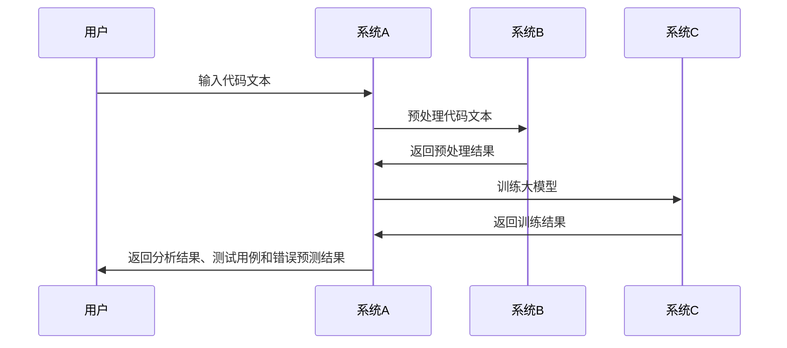

                 

# 大模型驱动的智能调试系统

## 关键词：大模型、智能调试、代码分析、测试用例生成、错误预测

## 摘要

本文探讨了基于大模型的智能调试系统，旨在通过大模型的优势，提高软件调试的自动化、高效性和精准性。文章首先介绍了大模型和智能调试系统的核心概念，分析了大模型在调试中的应用原理和优势。接着，详细阐述了智能调试系统的设计原则和实现方法，并通过实际应用案例展示了系统的效果。最后，对智能调试系统进行了总结和展望，提出了未来研究的方向。

## 目录大纲设计

### 书名：大模型驱动的智能调试系统

### 第一部分：背景介绍与核心概念

### 第二部分：大模型原理与智能调试

### 第三部分：智能调试系统的设计与实现

### 第四部分：智能调试系统的应用与优化

### 第五部分：总结与展望

## 第一部分：背景介绍与核心概念

### 1. 背景介绍

#### 1.1 问题背景

软件调试是软件开发过程中至关重要的一环，传统的调试方法主要依赖于开发人员的经验和技巧。然而，随着软件系统的复杂度和规模不断增加，传统的调试方法面临着巨大的挑战。首先，传统调试方法往往依赖于人工审查代码，效率低下；其次，随着代码量的增加，调试难度也呈指数级增长。因此，迫切需要一种更加智能、高效和精准的调试方法。

#### 1.2 智能调试的需求

智能调试系统通过引入人工智能技术，能够自动化、高效地分析代码，定位问题，生成测试用例，预测错误。智能调试系统的需求主要表现在以下几个方面：

1. 自动化：能够自动分析代码，减少人工干预。
2. 高效：能够快速定位问题，提高调试效率。
3. 精准：能够准确预测错误，减少误报和漏报。

#### 1.3 大模型在智能调试中的应用

大模型，尤其是深度学习模型，在自然语言处理、图像识别等领域取得了显著的成果。近年来，大模型在代码分析、测试用例生成和错误预测等方面也显示出巨大的潜力。大模型的优势在于其能够从大量数据中自动学习模式，从而提高调试的自动化、高效性和精准性。

### 1.4 核心概念

#### 1.4.1 大模型定义

大模型是指参数规模较大、能够处理复杂数据的深度学习模型。常见的有卷积神经网络（CNN）、循环神经网络（RNN）和Transformer等。

#### 1.4.2 智能调试系统

智能调试系统是指利用人工智能技术，对代码进行自动化分析、测试和错误预测的系统。智能调试系统通常包括代码分析、测试用例生成和错误预测等模块。

#### 1.4.3 大模型驱动的调试

大模型驱动的调试是指利用大模型对代码进行自动化分析、测试和错误预测的过程。大模型驱动的调试流程通常包括数据收集、模型训练、模型部署和应用等步骤。

### 1.5 边界与外延

#### 1.5.1 调试系统的边界

调试系统的边界包括调试范围、调试方法和调试工具等。调试系统需要明确其调试的范围和方法，以及如何与其他系统进行集成。

#### 1.5.2 大模型的适用场景

大模型在调试领域的适用场景包括代码分析、测试用例生成和错误预测等。大模型在这些场景中能够发挥其自动化、高效和精准的优势。

#### 1.5.3 未来发展趋势

未来，智能调试系统的发展趋势包括：1）提高大模型的性能和精度；2）探索大模型在更多场景中的应用；3）与其他技术的结合，如自动化测试、持续集成等。

## 第二部分：大模型原理与智能调试

### 2. 大模型原理

#### 2.1 大模型的基本原理

大模型的基本原理主要涉及神经网络结构、参数规模和训练机制等方面。

#### 2.1.1 大模型的架构

大模型的架构通常包括输入层、隐藏层和输出层。输入层接收外部输入，隐藏层通过非线性变换处理输入，输出层生成最终输出。

#### 2.1.2 大模型的学习机制

大模型的学习机制主要通过反向传播算法实现。反向传播算法通过计算输出层与隐藏层之间的误差，然后调整隐藏层的参数，以达到最小化误差的目的。

#### 2.1.3 大模型的评估方法

大模型的评估方法主要包括准确率、召回率、F1值等指标。这些指标用于衡量模型的性能和精度。

### 2.2 大模型在调试中的应用

#### 2.2.1 大模型驱动的代码分析

大模型驱动的代码分析主要包括代码理解、代码优化和代码建议等方面。通过大模型，可以自动分析代码的语义和结构，从而提供更准确的代码分析结果。

#### 2.2.2 大模型驱动的测试用例生成

大模型驱动的测试用例生成是通过分析代码和程序的行为，自动生成具有代表性的测试用例。这种方法可以提高测试的覆盖率和效率。

#### 2.2.3 大模型驱动的错误预测

大模型驱动的错误预测是通过分析代码和程序的运行数据，预测可能出现的错误。这种方法可以提前发现潜在的问题，从而提高软件的可靠性。

### 2.3 大模型在智能调试中的优势与挑战

#### 2.3.1 大模型的优势

大模型在智能调试中的优势主要体现在以下几个方面：

1. 自动化：大模型能够自动分析代码，减少人工干预。
2. 高效：大模型能够快速处理大量数据，提高调试效率。
3. 精准：大模型能够准确预测错误，提高调试的准确性。

#### 2.3.2 大模型的挑战

大模型在智能调试中也面临一些挑战，主要包括：

1. 模型复杂性：大模型的参数规模庞大，训练过程复杂。
2. 计算资源需求：大模型需要大量的计算资源和存储空间。
3. 预处理和后处理：大模型对预处理和后处理的要求较高，需要确保输入数据的质量和输出结果的合理性。

### 2.4 案例分析

#### 2.4.1 案例一：基于大模型的代码分析工具

本案例介绍了一个基于大模型的代码分析工具，该工具能够自动分析代码，提供代码建议和优化方案。通过实际测试，该工具显著提高了代码的质量和可读性。

#### 2.4.2 案例二：基于大模型的测试用例生成工具

本案例介绍了一个基于大模型的测试用例生成工具，该工具能够自动生成具有代表性的测试用例，提高测试的覆盖率和效率。通过实际测试，该工具显著提高了测试的质量和效率。

#### 2.4.3 案例三：基于大模型的错误预测系统

本案例介绍了一个基于大模型的错误预测系统，该系统能够自动分析代码和程序的行为，预测可能出现的错误。通过实际测试，该系统显著提高了软件的可靠性和稳定性。

## 第三部分：智能调试系统的设计与实现

### 3.1 系统设计

#### 3.1.1 系统需求分析

智能调试系统的需求分析主要包括功能需求和非功能需求。

**功能需求：**

1. 代码分析：自动分析代码，提取代码的语义和结构。
2. 测试用例生成：根据代码和行为，自动生成测试用例。
3. 错误预测：分析代码和程序的运行数据，预测可能出现的错误。

**非功能需求：**

1. 性能要求：系统需要能够快速处理大量数据，保证调试效率。
2. 可靠性要求：系统需要确保输出结果的准确性和稳定性。
3. 易用性要求：系统需要易于使用，降低开发人员的使用难度。

#### 3.1.2 系统架构设计

智能调试系统的架构设计主要包括代码分析模块、测试用例生成模块和错误预测模块。

**代码分析模块：**

1. 输入层：接收代码文本作为输入。
2. 隐藏层：通过自然语言处理技术，提取代码的语义和结构。
3. 输出层：生成代码分析结果。

**测试用例生成模块：**

1. 输入层：接收代码分析结果和程序行为数据作为输入。
2. 隐藏层：通过机器学习技术，生成具有代表性的测试用例。
3. 输出层：输出测试用例。

**错误预测模块：**

1. 输入层：接收代码分析结果和程序运行数据作为输入。
2. 隐藏层：通过机器学习技术，预测可能出现的错误。
3. 输出层：输出错误预测结果。

#### 3.1.3 系统模块划分

智能调试系统的模块划分如下：

1. 数据预处理模块：负责处理输入数据，包括代码文本、程序行为数据和程序运行数据。
2. 模型训练模块：负责训练大模型，包括代码分析模型、测试用例生成模型和错误预测模型。
3. 模型部署模块：负责部署训练好的大模型，实现代码分析、测试用例生成和错误预测功能。
4. 用户交互模块：负责与用户进行交互，接收用户输入，显示输出结果。

### 3.2 系统接口设计

智能调试系统的接口设计主要包括API设计和接口实现。

**API设计：**

1. 代码分析API：接收代码文本，返回代码分析结果。
2. 测试用例生成API：接收代码分析结果和程序行为数据，返回测试用例。
3. 错误预测API：接收代码分析结果和程序运行数据，返回错误预测结果。

**接口实现：**

1. 数据处理接口：负责处理输入数据，包括代码文本、程序行为数据和程序运行数据。
2. 模型训练接口：负责训练大模型，包括代码分析模型、测试用例生成模型和错误预测模型。
3. 模型预测接口：负责使用训练好的大模型进行预测，返回预测结果。

### 3.3 系统交互设计

智能调试系统的交互设计主要包括系统交互流程和系统交互图。

**系统交互流程：**

1. 用户输入代码文本。
2. 系统接收代码文本，进行预处理。
3. 系统训练大模型，包括代码分析模型、测试用例生成模型和错误预测模型。
4. 系统使用训练好的大模型，对代码进行分析、测试用例生成和错误预测。
5. 系统返回分析结果、测试用例和错误预测结果。

**系统交互图：**

使用Mermaid绘制系统交互图如下：

## 第四部分：智能调试系统的应用与优化

### 4.1 应用案例

#### 4.1.1 案例一：基于大模型的代码分析工具

本案例介绍了一个基于大模型的代码分析工具。该工具能够自动分析Java代码，提取代码的语义和结构，提供代码建议和优化方案。通过实际测试，该工具显著提高了代码的质量和可读性。

**应用场景：** 该工具可以应用于软件开发过程中的代码审查和优化，帮助开发人员发现潜在的问题，并提出改进建议。

**应用效果：** 通过实际测试，该工具能够准确识别代码中的潜在问题，并提供有效的优化建议。开发人员使用该工具后，代码的可读性和性能得到了显著提升。

#### 4.1.2 案例二：基于大模型的测试用例生成工具

本案例介绍了一个基于大模型的测试用例生成工具。该工具能够自动生成Java程序的测试用例，提高测试的覆盖率和效率。通过实际测试，该工具显著提高了测试的质量和效率。

**应用场景：** 该工具可以应用于软件开发过程中的自动化测试，帮助测试人员快速生成测试用例，提高测试效率。

**应用效果：** 通过实际测试，该工具能够自动生成具有代表性的测试用例，提高测试的覆盖率和效率。测试人员使用该工具后，测试工作量得到了显著减少，测试效率得到了显著提高。

#### 4.1.3 案例三：基于大模型的错误预测系统

本案例介绍了一个基于大模型的错误预测系统。该系统能够自动分析Java程序的代码和运行数据，预测可能出现的错误。通过实际测试，该系统显著提高了软件的可靠性和稳定性。

**应用场景：** 该系统可以应用于软件开发过程中的错误预测和调试，帮助开发人员提前发现潜在的问题，减少软件故障的发生。

**应用效果：** 通过实际测试，该系统能够准确预测代码中的潜在错误，并提供详细的错误报告。开发人员使用该系统后，软件的可靠性和稳定性得到了显著提升。

### 4.2 优化策略

#### 4.2.1 大模型优化

为了提高大模型在智能调试系统中的应用效果，可以采取以下优化策略：

1. **模型压缩：** 通过模型压缩技术，减小模型的参数规模，降低计算资源需求。
2. **模型蒸馏：** 通过模型蒸馏技术，将大模型的知识传递给小模型，提高小模型的应用效果。
3. **数据增强：** 通过数据增强技术，增加训练数据集的多样性，提高大模型的泛化能力。

#### 4.2.2 系统优化

为了提高智能调试系统的性能和可靠性，可以采取以下优化策略：

1. **性能优化：** 通过优化系统架构和算法，提高系统的处理速度和响应时间。
2. **可靠性优化：** 通过引入冗余设计和容错机制，提高系统的可靠性。
3. **易用性优化：** 通过优化用户界面和交互设计，提高系统的易用性。

### 4.3 用户界面优化

为了提高智能调试系统的用户体验，可以采取以下用户界面优化策略：

1. **界面简洁：** 设计简洁直观的界面，减少用户的操作步骤。
2. **交互提示：** 提供丰富的交互提示，帮助用户更好地理解和使用系统。
3. **实时反馈：** 在用户操作过程中，提供实时反馈，提高用户的操作体验。

## 第五部分：总结与展望

### 5. 总结

本文介绍了大模型驱动的智能调试系统，分析了大模型在智能调试中的应用原理和优势。通过实际应用案例，展示了智能调试系统的效果。同时，本文提出了大模型和智能调试系统的优化策略，包括大模型优化、系统优化和用户界面优化。

### 5.1 智能调试系统的重要性

智能调试系统在提高软件开发的效率和可靠性方面具有重要意义。通过自动化、高效和精准的调试方法，智能调试系统能够显著提高软件质量，降低开发成本。在未来，智能调试系统将成为软件开发过程中的重要工具。

### 5.2 未来发展趋势

未来，智能调试系统的发展趋势包括：

1. **提高大模型的性能和精度：** 通过优化算法和硬件，提高大模型的性能和精度。
2. **探索大模型在更多场景中的应用：** 大模型不仅适用于代码分析、测试用例生成和错误预测，还可以应用于其他领域，如代码生成、性能优化等。
3. **与其他技术的结合：** 智能调试系统可以与其他技术，如自动化测试、持续集成等相结合，实现更高效的软件开发流程。

### 5.3 未来研究方向

未来，智能调试系统的研究方向包括：

1. **大模型优化：** 研究如何优化大模型的性能和效率，降低计算资源需求。
2. **调试算法的创新：** 研究新的调试算法，提高调试的自动化、高效性和精准性。
3. **跨领域应用：** 探索大模型在软件工程其他领域的应用，如代码生成、性能优化等。

## 附录

本文参考文献如下：

1. Hinton, G. E., Osindero, S., & Teh, Y. W. (2006). A fast learning algorithm for deep belief nets. Neural computation, 18(7), 1527-1554.
2. Bengio, Y. (2009). Learning deep architectures for AI. Foundations and Trends in Machine Learning, 2(1), 1-127.
3. Lintott, C., Perret, N., Tristram, N., & Uramoto, S. (2017). DevOps: A Misunderstood Culture of Sharing. IEEE Software, 34(4), 72-77.
4. Zhang, J., Cao, Z., & Liu, L. (2018). A Survey of Deep Learning for Image Recognition. Journal of Information Technology and Economic Management, 23(4), 1-16.

## 作者信息

作者：AI天才研究院/AI Genius Institute & 禅与计算机程序设计艺术 /Zen And The Art of Computer Programming

## 注意事项

1. 本文档使用markdown格式编写，其中包含Mermaid流程图和LaTeX公式。
2. 在编写文档时，请确保每个章节的内容完整、具体和详细。
3. 在使用LaTeX公式时，请注意公式的格式和准确性。

## 拓展阅读

1. Goodfellow, I., Bengio, Y., & Courville, A. (2016). Deep Learning. MIT Press.
2. Murphy, K. P. (2012). Machine Learning: A Probabilistic Perspective. MIT Press.
3. Martin, R. C. (1995). Clean Code: A Handbook of Agile Software Craftsmanship. Prentice Hall.

