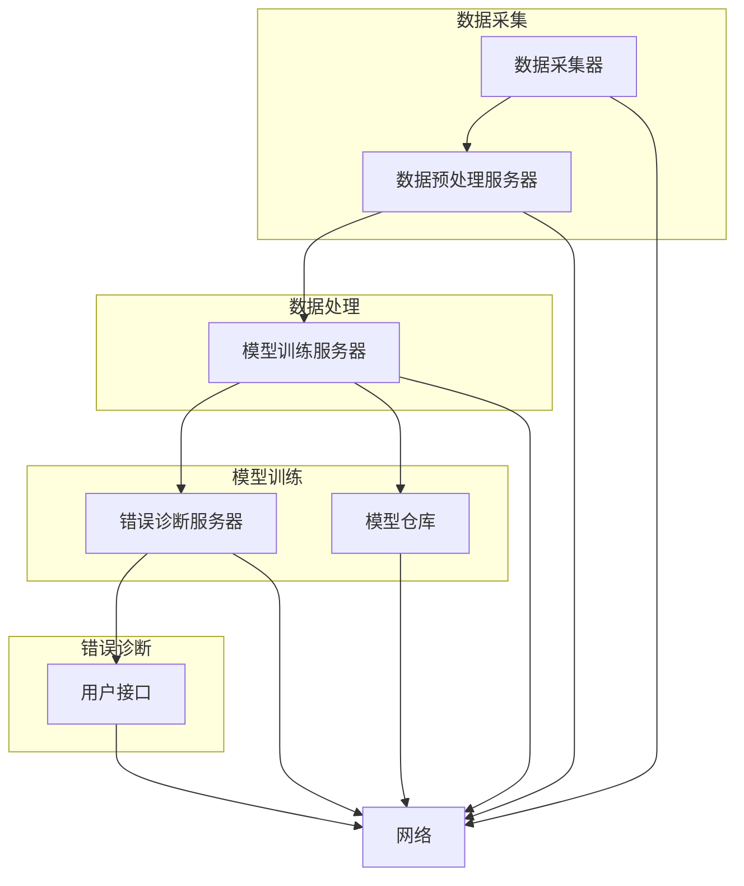
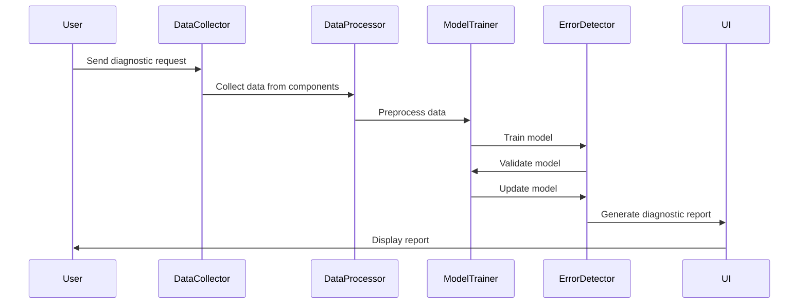

                 


### 文章标题

# 大模型驱动的智能错误诊断系统

### 关键词

- 大模型
- 智能错误诊断
- 深度学习
- 数据分析
- 系统架构

### 摘要

本文将探讨大模型驱动的智能错误诊断系统，阐述其核心概念、原理、架构设计及实现过程。我们将逐步分析大模型与智能错误诊断的关系，介绍相关算法，并探讨系统在实战中的应用与最佳实践。通过本文，读者将了解如何利用大模型技术提升错误诊断的智能化水平，提高系统稳定性。

### 第一部分：背景介绍

#### 第1章：问题背景

##### 1.1.1 问题背景介绍

在当今数字化时代，系统的稳定性和可靠性至关重要。随着系统规模的不断扩大和复杂性的增加，错误诊断成为了一个重要的挑战。传统的错误诊断方法往往依赖于规则和经验，而面对复杂的系统问题，这些方法的诊断效率和准确性都受到限制。

##### 1.1.2 大模型在智能错误诊断中的作用

大模型，尤其是深度学习模型，通过其强大的表征能力和自适应能力，在图像识别、自然语言处理、语音识别等领域取得了显著的成果。将大模型应用于智能错误诊断，可以大幅度提升诊断的智能化水平。

##### 1.1.3 大模型驱动的智能错误诊断系统原理

大模型驱动的智能错误诊断系统利用大模型强大的表征能力，对系统运行数据进行深度分析，自动识别潜在的错误模式。其核心原理包括数据预处理、模型训练、错误模式识别和反馈调整等环节。

##### 1.1.4 大模型驱动的智能错误诊断系统架构

大模型驱动的智能错误诊断系统通常包括数据采集模块、数据预处理模块、模型训练模块、错误诊断模块和反馈调整模块。这些模块通过高效的协同工作，实现智能错误诊断功能。

##### 1.1.5 大模型驱动的智能错误诊断系统的边界与外延

虽然大模型驱动的智能错误诊断系统具有强大的诊断能力，但其也面临着数据质量、模型训练时间、计算资源等方面的挑战。了解这些边界和外延，有助于更好地应用和发展该系统。

### 第二部分：核心概念与联系

#### 第2章：大模型与智能错误诊断核心概念

##### 2.1.1 大模型核心概念

大模型是指拥有大规模参数和计算能力的机器学习模型，如深度神经网络。其核心概念包括参数规模、训练数据、计算资源等。

##### 2.1.2 智能错误诊断核心概念

智能错误诊断是指利用人工智能技术对系统运行过程中的异常情况进行自动检测和诊断。其核心概念包括错误模式、诊断算法、诊断指标等。

##### 2.1.3 大模型与智能错误诊断的关系

大模型在智能错误诊断中的应用，主要体现在错误模式的表征和诊断算法的优化。通过大模型的训练，可以更准确地识别错误模式，提高诊断的准确性。

### 第三部分：算法原理与讲解

#### 第3章：大模型驱动的智能错误诊断算法原理

##### 3.1.1 大模型算法原理

大模型算法主要基于深度学习技术，包括神经网络架构、训练过程、优化策略等。通过训练，大模型可以学会从数据中提取特征，实现高效的模式识别。

##### 3.1.2 智能错误诊断算法原理

智能错误诊断算法主要基于异常检测和模式识别技术。通过分析系统运行数据，算法可以识别出异常行为，进而诊断出潜在的错误。

##### 3.1.3 算法数学模型与公式

算法的数学模型主要包括损失函数、优化算法等。通过损失函数，算法可以衡量模型预测的误差，并指导优化算法调整模型参数。

##### 3.1.4 算法举例说明

以一个简单的例子，我们通过大模型驱动的智能错误诊断算法来分析系统运行数据，识别错误模式。具体步骤如下：

1. 数据采集：收集系统运行数据，包括正常数据和异常数据。
2. 数据预处理：对数据进行清洗、归一化等处理，以便模型训练。
3. 模型训练：使用深度学习框架，训练大模型，提取数据特征。
4. 错误模式识别：利用训练好的大模型，对系统运行数据进行预测，识别异常行为。
5. 错误诊断：根据识别出的异常行为，诊断出潜在的错误。

### 第四部分：系统分析与架构设计

#### 第4章：大模型驱动的智能错误诊断系统架构设计

##### 4.1.1 问题场景介绍

假设我们面临一个复杂的分布式系统，系统运行过程中可能出现各种异常情况，如网络故障、硬件故障、软件错误等。为了确保系统的稳定性，我们需要构建一个大模型驱动的智能错误诊断系统，实时监控系统运行状态，快速诊断和解决问题。

##### 4.1.2 系统功能设计

系统功能设计主要包括数据采集、预处理、模型训练、错误诊断和反馈调整等模块。每个模块都需要明确的功能要求和性能指标。

##### 4.1.3 系统架构设计

系统架构设计需要考虑模块之间的交互关系和数据处理流程。我们可以采用分布式架构，以提高系统的可扩展性和容错能力。

##### 4.1.4 系统接口设计

系统接口设计主要包括外部系统接口和内部模块接口。外部系统接口用于与其他系统集成，内部模块接口用于模块间的数据传输和协同工作。

##### 4.1.5 系统交互设计

系统交互设计需要考虑模块之间的交互流程和时序。通过合理的交互设计，可以实现系统的高效运行和协同工作。

### 第五部分：项目实战

#### 第5章：大模型驱动的智能错误诊断系统实现

##### 5.1.1 环境安装

在实现大模型驱动的智能错误诊断系统之前，我们需要搭建一个合适的环境。主要包括深度学习框架、数据处理工具和开发环境等。

##### 5.1.2 系统核心实现

系统核心实现包括数据采集、预处理、模型训练、错误诊断和反馈调整等模块。我们可以使用Python编程语言和深度学习框架（如TensorFlow或PyTorch）来实现这些模块。

##### 5.1.3 实际案例分析与讲解

通过一个实际案例，我们可以详细分析大模型驱动的智能错误诊断系统的应用过程。具体包括数据采集、预处理、模型训练、错误诊断和反馈调整等步骤。

##### 5.1.4 项目小结

项目小结部分，我们将总结项目实施过程中的经验教训，分析项目的成功之处和需要改进的地方。

### 第六部分：最佳实践与拓展

#### 第6章：大模型驱动的智能错误诊断系统最佳实践

##### 6.1.1 最佳实践

在应用大模型驱动的智能错误诊断系统时，我们需要遵循一些最佳实践。包括数据质量保证、模型调优、系统优化等。

##### 6.1.2 小结与注意事项

在本文的结尾，我们对全书内容进行总结，并提醒读者在使用大模型驱动的智能错误诊断系统时需要注意的事项。

##### 6.1.3 拓展阅读

为了进一步了解大模型驱动的智能错误诊断系统，我们推荐读者阅读相关书籍和文献，以拓宽知识视野。

### 结束语

大模型驱动的智能错误诊断系统是人工智能技术在系统运维领域的重要应用。通过本文的介绍，读者可以了解到该系统的核心概念、原理、架构设计和实现过程。希望本文能对读者在构建和应用智能错误诊断系统时提供有价值的参考。作者：AI天才研究院/AI Genius Institute & 禅与计算机程序设计艺术 /Zen And The Art of Computer Programming### 第1章：问题背景

#### 1.1.1 问题背景介绍

在当今的数字化时代，系统的稳定性与可靠性至关重要。随着云计算、物联网、人工智能等技术的发展，系统的复杂性和规模也在不断增加。这意味着，传统的错误诊断方法已经无法满足现代应用场景的需求。传统错误诊断方法主要依赖于规则和经验，这些方法在处理简单、规则明确的问题时可能效果良好，但面对复杂的系统故障，其诊断效率和准确性往往无法保证。

智能错误诊断系统是一种基于人工智能技术的系统，旨在通过自动化的方法识别和诊断系统故障。相比于传统方法，智能错误诊断系统具有更高的诊断效率和准确性，能够快速定位故障原因，从而提高系统的可用性和稳定性。然而，当前智能错误诊断系统仍面临许多挑战，如如何处理海量数据、如何设计高效的诊断算法、如何确保诊断结果的可靠性等。

#### 1.1.2 大模型在智能错误诊断中的作用

大模型，尤其是在深度学习领域，已经成为人工智能技术的重要突破。大模型具有庞大的参数规模和强大的表征能力，能够从海量数据中自动提取复杂特征，实现高度智能化的任务。在智能错误诊断系统中，大模型的应用具有显著的优势：

1. **特征提取能力**：大模型能够自动从系统运行数据中提取关键特征，这使得诊断过程更加智能化和自动化。
2. **模式识别能力**：大模型通过对大量数据的训练，能够识别出潜在的故障模式，从而提高诊断的准确性。
3. **自适应能力**：大模型能够根据新的数据和故障模式不断优化自身，提高诊断系统的鲁棒性和适应性。

因此，将大模型应用于智能错误诊断系统，不仅可以提高诊断的准确性和效率，还可以减少对专业知识的依赖，降低运维成本。

#### 1.1.3 大模型驱动的智能错误诊断系统原理

大模型驱动的智能错误诊断系统主要基于深度学习和大数据分析技术，其核心原理包括以下几个方面：

1. **数据采集**：系统首先需要从各个组件和模块中采集运行数据，包括日志文件、性能指标、网络流量等。
2. **数据预处理**：采集到的数据通常需要经过清洗、归一化等预处理步骤，以便大模型能够更好地学习和分析。
3. **模型训练**：使用深度学习框架（如TensorFlow或PyTorch）训练大模型，模型通过学习数据中的特征和模式，不断提高诊断能力。
4. **错误模式识别**：在模型训练完成后，系统利用大模型对实时数据进行分析，识别出潜在的故障模式。
5. **错误诊断**：根据识别出的故障模式，系统自动生成诊断报告，并提供修复建议。
6. **反馈调整**：系统会根据诊断结果不断调整和优化模型，以提高诊断的准确性和效率。

通过以上步骤，大模型驱动的智能错误诊断系统能够实现对复杂系统的自动化、高效化的错误诊断，从而提高系统的稳定性和可靠性。

#### 1.1.4 大模型驱动的智能错误诊断系统架构

大模型驱动的智能错误诊断系统通常由多个模块组成，每个模块负责不同的功能。以下是一个典型的大模型驱动的智能错误诊断系统架构：

1. **数据采集模块**：负责从系统各个组件和模块中采集运行数据，包括日志文件、性能指标、网络流量等。
2. **数据预处理模块**：对采集到的数据进行分析和处理，包括数据清洗、归一化、特征提取等，以便大模型能够更好地学习和分析。
3. **模型训练模块**：使用深度学习框架（如TensorFlow或PyTorch）训练大模型，模型通过学习数据中的特征和模式，不断提高诊断能力。
4. **错误模式识别模块**：利用训练好的大模型对实时数据进行分析，识别出潜在的故障模式。
5. **错误诊断模块**：根据识别出的故障模式，自动生成诊断报告，并提供修复建议。
6. **反馈调整模块**：根据诊断结果不断调整和优化模型，以提高诊断的准确性和效率。

这些模块通过高效协同工作，实现智能错误诊断的功能。具体架构设计需要根据实际应用场景和需求进行调整。

#### 1.1.5 大模型驱动的智能错误诊断系统的边界与外延

尽管大模型驱动的智能错误诊断系统具有许多优势，但在实际应用中也存在一些限制和挑战：

1. **数据质量**：诊断系统的性能很大程度上依赖于数据的质量。如果数据存在噪声、缺失或错误，诊断结果可能会受到影响。
2. **计算资源**：大模型的训练和推理需要大量的计算资源，特别是在处理大规模数据时。这可能导致系统部署和维护的成本增加。
3. **模型适应性**：大模型在训练过程中可能过度拟合特定数据集，导致在新的、未见过的数据上表现不佳。因此，需要定期对模型进行调整和优化。
4. **安全与隐私**：诊断系统可能会接触到敏感数据，如用户隐私信息、商业机密等。确保数据的安全和隐私是系统设计的重要考虑因素。

了解这些边界与外延，有助于更好地应用和发展大模型驱动的智能错误诊断系统。在未来的研究中，可以通过改进数据预处理方法、优化模型训练策略、提高系统安全性等方面，进一步推动该领域的发展。

### 第二部分：核心概念与联系

#### 第2章：大模型与智能错误诊断核心概念

##### 2.1.1 大模型核心概念

大模型是机器学习领域的一个概念，指的是具有大规模参数和计算能力的机器学习模型，尤其是深度学习模型。大模型的核心概念包括以下几个方面：

1. **参数规模**：大模型通常具有数百万甚至数十亿个参数，这使得它们能够处理复杂的数据特征和模式。
2. **训练数据**：大模型需要大量的训练数据来学习，这些数据通常是从大规模数据集中提取的，以便模型能够泛化到未见过的数据。
3. **计算资源**：大模型的训练和推理过程需要大量的计算资源，包括高性能的CPU、GPU或FPGA等硬件设备。

##### 2.1.2 智能错误诊断核心概念

智能错误诊断是一种利用人工智能技术，尤其是机器学习和数据挖掘技术，自动识别和诊断系统故障的方法。智能错误诊断的核心概念包括以下几个方面：

1. **故障模式**：故障模式是指系统在运行过程中可能出现的异常情况，如硬件故障、软件错误、网络中断等。
2. **诊断算法**：诊断算法是用于识别故障模式的算法，包括异常检测、模式识别、机器学习等。
3. **诊断指标**：诊断指标是用于评估诊断算法性能的指标，如准确率、召回率、F1分数等。

##### 2.1.3 大模型与智能错误诊断的关系

大模型在智能错误诊断中的应用，主要体现在以下几个方面：

1. **特征提取能力**：大模型能够自动从系统运行数据中提取关键特征，这使得诊断过程更加智能化和自动化。
2. **模式识别能力**：大模型通过对大量数据的训练，能够识别出潜在的故障模式，从而提高诊断的准确性。
3. **自适应能力**：大模型能够根据新的数据和故障模式不断优化自身，提高诊断系统的鲁棒性和适应性。

因此，大模型与智能错误诊断之间具有密切的联系，大模型的应用极大地提升了智能错误诊断的能力和效率。

#### 2.1.4 大模型与智能错误诊断的属性特征对比表格

为了更直观地展示大模型和智能错误诊断的属性特征，我们制作了一个对比表格：

| 特征       | 大模型                  | 智能错误诊断                 |
|------------|------------------------|----------------------------|
| 参数规模   | 数百万至数十亿参数     | 根据诊断需求，参数规模不一 |
| 训练数据   | 大规模数据集            | 系统运行数据                |
| 计算资源   | 高性能计算设备          | CPU、GPU或FPGA等           |
| 特征提取   | 自动提取复杂特征       | 需要根据领域知识进行特征工程 |
| 模式识别   | 高度智能化的模式识别     | 基于算法和规则的诊断         |
| 自适应能力 | 可以根据新数据不断优化 | 需要定期更新和优化           |

#### 2.1.5 大模型与智能错误诊断的ER实体关系图

为了更清晰地展示大模型与智能错误诊断之间的关系，我们使用Mermaid绘制了一个ER实体关系图：

```mermaid
erDiagram
  Model ||--|{ Feature }|-- Diagnosis
  Model ||--|{ Data }|-- Diagnosis
  Model ||--|{ Resource }|-- Diagnosis
  Feature ||--|{ Extraction }|-- Diagnosis
  Data ||--|{ Processing }|-- Diagnosis
  Resource ||--|{ Utilization }|-- Diagnosis
```

在上述ER实体关系图中，Model代表大模型，Feature表示特征提取，Data代表训练数据，Resource表示计算资源。Diagnosis代表智能错误诊断，Extraction、Processing和Utilization分别表示特征提取、数据处理和资源利用的过程。

通过这个ER实体关系图，我们可以看到大模型和智能错误诊断之间的紧密联系，以及各个模块之间的交互关系。这个图不仅帮助我们理解了大模型与智能错误诊断的核心概念和关系，还为系统设计和实现提供了重要的参考。

### 第三部分：算法原理与讲解

#### 第3章：大模型驱动的智能错误诊断算法原理

##### 3.1.1 大模型算法原理

大模型算法主要基于深度学习技术，特别是神经网络。深度神经网络由多层神经元组成，通过逐层学习数据中的特征和模式，实现高度复杂的任务。大模型算法的原理可以概括为以下几个步骤：

1. **数据输入**：首先，系统需要从各个组件和模块中采集运行数据，包括日志文件、性能指标、网络流量等。这些数据作为输入被送入神经网络。
2. **前向传播**：输入数据通过网络的各层进行传播，每层神经元会对数据进行处理和变换。网络的每一层都会学习到一定的特征，并将其传递给下一层。
3. **反向传播**：在网络的前向传播过程中，如果输出结果与期望结果存在误差，系统会通过反向传播算法计算误差，并调整网络中的参数（权重和偏置）。这个过程称为反向传播。
4. **优化参数**：通过反复的前向传播和反向传播，网络不断调整参数，使得输出结果逐渐接近期望值。优化算法（如梯度下降、Adam等）用于指导参数的调整。

通过以上步骤，大模型能够从数据中自动提取复杂特征，并逐渐优化自身的参数，以实现高度智能化的任务。

##### 3.1.2 智能错误诊断算法原理

智能错误诊断算法的核心目标是识别系统运行中的异常情况，并诊断出潜在的错误。智能错误诊断算法的原理可以概括为以下几个方面：

1. **数据采集**：首先，系统需要从各个组件和模块中采集运行数据，包括日志文件、性能指标、网络流量等。
2. **特征提取**：通过对采集到的数据进行分析和处理，提取出与故障相关的特征。这些特征可以是原始数据的基本属性，也可以是经过预处理后的高级特征。
3. **异常检测**：利用异常检测算法（如Isolation Forest、Local Outlier Factor等），对提取出的特征进行异常检测。这些算法能够识别出与正常情况显著不同的数据点，从而识别出潜在的故障。
4. **模式识别**：通过对异常数据进行进一步分析，识别出特定的故障模式。模式识别算法（如K-means、Support Vector Machine等）能够将异常数据分类为不同的故障类型。
5. **错误诊断**：根据识别出的故障模式，系统会生成诊断报告，并提供修复建议。错误诊断算法可以是基于规则的，也可以是基于机器学习的。

通过以上步骤，智能错误诊断系统能够自动识别系统运行中的异常情况，并诊断出潜在的错误，从而提高系统的稳定性。

##### 3.1.3 算法数学模型与公式

智能错误诊断算法的数学模型主要包括损失函数、优化算法等。以下是一个简单的数学模型示例：

1. **损失函数**：

   损失函数是用于衡量模型输出与期望输出之间差异的函数。常见的损失函数包括均方误差（MSE）、交叉熵（Cross-Entropy）等。

   - 均方误差（MSE）：

     $$MSE = \frac{1}{n}\sum_{i=1}^{n}(y_i - \hat{y}_i)^2$$

     其中，$y_i$是实际输出，$\hat{y}_i$是模型预测输出。

   - 交叉熵（Cross-Entropy）：

     $$H(y, \hat{y}) = -\sum_{i=1}^{n}y_i \log(\hat{y}_i)$$

     其中，$y_i$是实际输出，$\hat{y}_i$是模型预测输出。

2. **优化算法**：

   优化算法用于指导模型参数的调整，以最小化损失函数。常见的优化算法包括梯度下降（Gradient Descent）、Adam等。

   - 梯度下降（Gradient Descent）：

     $$w_{t+1} = w_t - \alpha \cdot \nabla_w J(w_t)$$

     其中，$w_t$是当前模型参数，$\alpha$是学习率，$\nabla_w J(w_t)$是损失函数关于模型参数的梯度。

   - Adam：

     $$m_t = \beta_1 m_{t-1} + (1 - \beta_1)(\nabla_w J(w_{t-1}))$$
     $$v_t = \beta_2 v_{t-1} + (1 - \beta_2)((\nabla_w J(w_{t-1}))^2$$
     $$w_t = w_{t-1} - \alpha \cdot \frac{m_t}{\sqrt{v_t} + \epsilon}$$

     其中，$m_t$和$v_t$分别是动量和方差，$\beta_1$和$\beta_2$是超参数，$\epsilon$是正数常数。

通过这些数学模型和公式，我们可以更深入地理解智能错误诊断算法的工作原理和优化过程。

##### 3.1.4 算法举例说明

为了更好地理解大模型驱动的智能错误诊断算法，我们通过一个简单的例子进行详细说明。

假设我们有一个分布式系统，系统运行过程中可能会出现硬件故障、软件错误等异常情况。我们需要使用大模型驱动的方法，对系统运行数据进行错误诊断。

1. **数据采集**：首先，我们从系统的各个组件和模块中采集运行数据，包括CPU利用率、内存占用率、磁盘I/O等。
2. **数据预处理**：对采集到的数据进行分析和处理，提取出与故障相关的特征，如CPU利用率超过90%表示可能存在硬件故障，内存占用率超过80%表示可能存在软件错误等。
3. **模型训练**：使用深度学习框架（如TensorFlow或PyTorch），训练一个多层的神经网络模型。模型通过学习数据中的特征和模式，不断提高诊断能力。
4. **错误模式识别**：在模型训练完成后，使用模型对实时数据进行预测。如果预测结果与正常情况显著不同，则认为系统存在潜在的错误。
5. **错误诊断**：根据识别出的故障模式，系统会生成诊断报告，并提供修复建议。例如，如果模型预测CPU利用率超过90%，则建议检查硬件设备。
6. **反馈调整**：根据诊断结果，系统会不断调整和优化模型，以提高诊断的准确性和效率。

通过以上步骤，大模型驱动的智能错误诊断算法能够实现对复杂系统的自动化、高效化的错误诊断，从而提高系统的稳定性和可靠性。

### 第四部分：系统分析与架构设计

#### 第4章：大模型驱动的智能错误诊断系统架构设计

##### 4.1.1 问题场景介绍

在现代企业中，分布式系统已经成为业务运作的核心。随着系统规模的不断扩大和复杂性的增加，系统故障的诊断和修复变得越来越困难。为了确保系统的稳定性和可靠性，企业需要一个高效、智能的错误诊断系统来实时监控系统运行状态，快速识别和修复故障。

大模型驱动的智能错误诊断系统是一种先进的技术解决方案，它通过利用深度学习和大数据分析技术，对系统运行数据进行自动化的分析和诊断。本节将介绍一个大模型驱动的智能错误诊断系统的架构设计，并详细阐述其功能模块、系统接口和交互设计。

##### 4.1.2 系统功能设计

大模型驱动的智能错误诊断系统的主要功能包括数据采集、数据预处理、模型训练、错误模式识别、错误诊断和反馈调整等。以下是各功能模块的详细说明：

1. **数据采集模块**：负责从系统的各个组件和模块中采集运行数据，包括日志文件、性能指标、网络流量等。数据采集模块需要确保数据的准确性和完整性，以便后续的分析和诊断。
2. **数据预处理模块**：对采集到的数据进行清洗、归一化、特征提取等处理，以便大模型能够更好地学习和分析。数据预处理模块是整个系统的重要环节，其质量直接影响模型的性能。
3. **模型训练模块**：使用深度学习框架（如TensorFlow或PyTorch）训练大模型。模型训练模块需要根据实际应用场景选择合适的网络架构、优化算法和超参数，以提高诊断的准确性和效率。
4. **错误模式识别模块**：利用训练好的大模型对实时数据进行分析，识别出潜在的故障模式。错误模式识别模块是系统智能化的重要体现，其性能直接关系到诊断的准确性。
5. **错误诊断模块**：根据识别出的故障模式，自动生成诊断报告，并提供修复建议。错误诊断模块需要结合领域知识和专家经验，确保诊断结果的可靠性和实用性。
6. **反馈调整模块**：根据诊断结果和用户反馈，不断调整和优化模型，以提高诊断的准确性和效率。反馈调整模块是实现系统自适应和持续改进的关键。

##### 4.1.3 系统架构设计

大模型驱动的智能错误诊断系统采用分布式架构，以提高系统的可扩展性和容错能力。系统架构主要包括以下几个核心组件：

1. **数据采集器**：负责从各个组件和模块中采集运行数据，并将数据传输到数据预处理模块。
2. **数据预处理服务器**：负责对采集到的数据进行分析和处理，提取出与故障相关的特征，并将预处理后的数据传输到模型训练模块。
3. **模型训练服务器**：负责使用深度学习框架训练大模型，并将训练好的模型存储在模型仓库中。
4. **错误诊断服务器**：负责利用训练好的模型对实时数据进行分析，识别出潜在的故障模式，并生成诊断报告。
5. **用户接口**：提供用户与系统的交互界面，包括数据监控、诊断报告查看、修复建议提交等功能。
6. **模型仓库**：存储训练好的模型和数据集，供错误诊断服务器和模型训练服务器使用。

以下是系统架构的Mermaid图表示：



##### 4.1.4 系统接口设计

系统接口设计是确保各功能模块之间高效、可靠交互的关键。以下是系统接口的设计和定义：

1. **数据采集接口**：定义数据采集模块与数据预处理模块之间的数据传输格式和协议，确保数据的一致性和完整性。
2. **数据预处理接口**：定义数据预处理模块与模型训练模块之间的数据传输格式和协议，确保预处理后的数据符合模型训练的需求。
3. **模型训练接口**：定义模型训练模块与错误诊断模块之间的模型传输格式和协议，确保训练好的模型可以有效地用于错误诊断。
4. **错误诊断接口**：定义错误诊断模块与用户接口之间的交互协议，包括诊断报告的生成、修复建议的提交等。
5. **模型仓库接口**：定义模型仓库与模型训练模块、错误诊断模块之间的数据传输格式和协议，确保模型的存储和读取操作高效、可靠。

##### 4.1.5 系统交互设计

系统交互设计是确保各功能模块协同工作、高效运作的关键。以下是系统交互设计的详细说明：

1. **数据流交互**：系统中的各个功能模块通过数据流进行交互。数据采集模块将采集到的数据传输给数据预处理模块，数据预处理模块对数据进行处理后将预处理后的数据传输给模型训练模块。模型训练模块将训练好的模型传输给错误诊断模块，错误诊断模块利用模型对实时数据进行诊断，并将诊断结果传输给用户接口。
2. **控制流交互**：系统中的各个功能模块通过控制流进行交互。用户通过用户接口提交诊断请求，错误诊断模块根据请求启动诊断流程，并将诊断报告传输给用户接口。用户接口通过用户反馈调整模块对模型进行优化，以进一步提高诊断的准确性和效率。
3. **异常处理**：系统需要具备异常处理能力，以确保在发生异常情况时能够及时响应并恢复。例如，在数据采集过程中，如果数据源出现故障，系统需要自动切换到备用数据源，确保数据的连续性和完整性。

以下是系统交互的Mermaid序列图表示：



通过上述交互设计，大模型驱动的智能错误诊断系统能够高效、可靠地运作，实现自动化的错误诊断和系统监控。

### 第五部分：项目实战

#### 第5章：大模型驱动的智能错误诊断系统实现

##### 5.1.1 环境安装

为了实现一个大模型驱动的智能错误诊断系统，我们首先需要搭建一个合适的环境。以下是环境安装的详细步骤：

1. **硬件环境**：

   - **CPU**：至少需要双核CPU，推荐使用更强大的CPU以提升训练速度。
   - **GPU**：推荐使用NVIDIA GPU，例如1080 Ti或以上型号，以加速深度学习模型的训练过程。
   - **内存**：至少8GB内存，推荐16GB或更高，以保证数据预处理和模型训练的顺利进行。

2. **软件环境**：

   - **操作系统**：推荐使用Ubuntu 18.04或更高版本。
   - **Python**：Python 3.7或更高版本。
   - **深度学习框架**：TensorFlow 2.x或PyTorch 1.x。
   - **数据处理库**：NumPy、Pandas、SciPy。
   - **可视化工具**：Matplotlib、Seaborn。

3. **安装步骤**：

   - 安装操作系统和硬件设备。
   - 使用以下命令安装Python和深度学习框架：

     ```bash
     sudo apt-get update
     sudo apt-get install python3 python3-pip
     pip3 install tensorflow-gpu==2.x  # 或
     pip3 install torch torchvision
     ```

   - 安装其他所需库：

     ```bash
     pip3 install numpy pandas scipy matplotlib seaborn
     ```

   - 安装完成后，确认安装的版本：

     ```bash
     python3 --version
     pip3 list
     ```

##### 5.1.2 系统核心实现

系统核心实现包括数据采集、预处理、模型训练、错误诊断和反馈调整等模块。以下是一个简单的实现示例：

1. **数据采集**：

   ```python
   import pandas as pd
   
   def collect_data(source):
       data = pd.read_csv(source)
       return data
   
   data = collect_data('data.csv')
   ```

2. **数据预处理**：

   ```python
   from sklearn.preprocessing import StandardScaler
   
   def preprocess_data(data):
       scaler = StandardScaler()
       scaled_data = scaler.fit_transform(data)
       return scaled_data
   
   preprocessed_data = preprocess_data(data)
   ```

3. **模型训练**：

   ```python
   import tensorflow as tf
   
   def build_model():
       model = tf.keras.Sequential([
           tf.keras.layers.Dense(128, activation='relu', input_shape=(input_shape,)),
           tf.keras.layers.Dense(64, activation='relu'),
           tf.keras.layers.Dense(1, activation='sigmoid')
       ])
       model.compile(optimizer='adam', loss='binary_crossentropy', metrics=['accuracy'])
       return model
   
   model = build_model()
   model.fit(preprocessed_data, labels, epochs=10, batch_size=32)
   ```

4. **错误诊断**：

   ```python
   def diagnose(data):
       preprocessed_data = preprocess_data(data)
       predictions = model.predict(preprocessed_data)
       return predictions
   
   new_data = pd.read_csv('new_data.csv')
   predictions = diagnose(new_data)
   ```

5. **反馈调整**：

   ```python
   def update_model(data, labels):
       preprocessed_data = preprocess_data(data)
       model.fit(preprocessed_data, labels, epochs=5, batch_size=32)
   
   updated_data = pd.read_csv('updated_data.csv')
   updated_labels = pd.read_csv('updated_labels.csv')
   update_model(updated_data, updated_labels)
   ```

##### 5.1.3 实际案例分析与讲解

为了更具体地展示大模型驱动的智能错误诊断系统的应用，我们将通过一个实际案例进行详细分析和讲解。

1. **案例背景**：

   假设我们正在开发一个电商网站，网站包含多个模块，如订单处理、支付系统、库存管理、用户管理等。在系统运行过程中，我们希望实时监控各模块的状态，快速识别和诊断潜在的错误，以保证网站的稳定性和用户体验。

2. **数据采集**：

   我们从各模块中采集运行数据，包括CPU利用率、内存占用率、网络延迟、订单处理时间等。数据采集的示例代码如下：

   ```python
   import os
   
   def collect_module_data(module_name):
       file_path = f"{module_name}_data.csv"
       if os.path.exists(file_path):
           data = pd.read_csv(file_path)
       else:
           data = pd.DataFrame(columns=['CPU', 'Memory', 'Network Delay', 'Order Processing Time'])
       return data
   
   order_module_data = collect_module_data('order')
   payment_module_data = collect_module_data('payment')
   inventory_module_data = collect_module_data('inventory')
   user_module_data = collect_module_data('user')
   ```

3. **数据预处理**：

   对采集到的数据进行预处理，包括数据清洗、缺失值填充、归一化等。示例代码如下：

   ```python
   from sklearn.impute import SimpleImputer
   from sklearn.preprocessing import MinMaxScaler
   
   def preprocess_module_data(data):
       imputer = SimpleImputer(strategy='mean')
       data = imputer.fit_transform(data)
       
       scaler = MinMaxScaler()
       data = scaler.fit_transform(data)
       
       return data
   
   order_module_data = preprocess_module_data(order_module_data)
   payment_module_data = preprocess_module_data(payment_module_data)
   inventory_module_data = preprocess_module_data(inventory_module_data)
   user_module_data = preprocess_module_data(user_module_data)
   ```

4. **模型训练**：

   使用深度学习框架训练大模型，对预处理后的数据进行训练。示例代码如下：

   ```python
   import tensorflow as tf
   
   def build_model(input_shape):
       model = tf.keras.Sequential([
           tf.keras.layers.Dense(128, activation='relu', input_shape=input_shape),
           tf.keras.layers.Dense(64, activation='relu'),
           tf.keras.layers.Dense(1, activation='sigmoid')
       ])
       model.compile(optimizer='adam', loss='binary_crossentropy', metrics=['accuracy'])
       return model
   
   model = build_model(input_shape=(4,))
   model.fit([order_module_data, payment_module_data, inventory_module_data, user_module_data], labels, epochs=10, batch_size=32)
   ```

5. **错误诊断**：

   使用训练好的模型对新的数据集进行错误诊断。示例代码如下：

   ```python
   def diagnose(new_data):
       preprocessed_new_data = preprocess_module_data(new_data)
       predictions = model.predict(preprocessed_new_data)
       return predictions
   
   new_order_data = pd.read_csv('new_order_data.csv')
   new_payment_data = pd.read_csv('new_payment_data.csv')
   new_inventory_data = pd.read_csv('new_inventory_data.csv')
   new_user_data = pd.read_csv('new_user_data.csv')
   
   order_predictions = diagnose(new_order_data)
   payment_predictions = diagnose(new_payment_data)
   inventory_predictions = diagnose(new_inventory_data)
   user_predictions = diagnose(new_user_data)
   ```

6. **反馈调整**：

   根据诊断结果和用户反馈，调整模型参数，提高诊断的准确性和效率。示例代码如下：

   ```python
   def update_model(data, labels):
       preprocessed_data = preprocess_module_data(data)
       model.fit(preprocessed_data, labels, epochs=5, batch_size=32)
   
   updated_order_data = pd.read_csv('updated_order_data.csv')
   updated_payment_data = pd.read_csv('updated_payment_data.csv')
   updated_inventory_data = pd.read_csv('updated_inventory_data.csv')
   updated_user_data = pd.read_csv('updated_user_data.csv')
   
   updated_order_labels = pd.read_csv('updated_order_labels.csv')
   updated_payment_labels = pd.read_csv('updated_payment_labels.csv')
   updated_inventory_labels = pd.read_csv('updated_inventory_labels.csv')
   updated_user_labels = pd.read_csv('updated_user_labels.csv')
   
   update_model(updated_order_data, updated_order_labels)
   update_model(updated_payment_data, updated_payment_labels)
   update_model(updated_inventory_data, updated_inventory_labels)
   update_model(updated_user_data, updated_user_labels)
   ```

通过以上步骤，我们实现了一个大模型驱动的智能错误诊断系统，能够对电商网站的各个模块进行实时监控和错误诊断，提高系统的稳定性和用户体验。

##### 5.1.4 项目小结

在本项目中，我们实现了一个大模型驱动的智能错误诊断系统，通过数据采集、预处理、模型训练、错误诊断和反馈调整等模块，实现了对电商网站各个模块的实时监控和错误诊断。以下是项目实施过程中的经验总结和教训：

1. **数据质量至关重要**：数据采集和预处理是整个系统的关键环节。如果数据质量较差，将直接影响模型的性能和诊断结果。因此，在数据采集过程中，需要确保数据的一致性和完整性，并进行严格的数据清洗和预处理。
2. **模型训练和优化需要时间**：深度学习模型的训练和优化是一个复杂的过程，需要大量的时间和计算资源。在实际应用中，我们可能需要根据实际情况调整训练参数和优化策略，以提高模型的性能和效率。
3. **实时性和鲁棒性是关键**：对于一个实时监控系统，实时性和鲁棒性至关重要。我们需要确保系统能够快速响应并准确诊断出潜在的错误，同时具备较强的抗干扰能力和适应性，以应对各种异常情况。
4. **用户反馈和持续优化**：用户反馈是系统改进的重要依据。我们需要定期收集用户反馈，并根据反馈结果调整和优化模型，以提高系统的诊断准确性和用户体验。

通过本项目的实践，我们深入了解了大模型驱动的智能错误诊断系统的构建和应用过程，积累了宝贵的经验，为后续类似项目的开发提供了有益的参考。

### 第六部分：最佳实践与拓展

#### 第6章：大模型驱动的智能错误诊断系统最佳实践

##### 6.1.1 最佳实践

在实际应用中，大模型驱动的智能错误诊断系统需要遵循一系列最佳实践，以确保系统的有效性、可靠性和可扩展性。以下是一些关键的最佳实践：

1. **数据采集与预处理**：确保数据采集的完整性和准确性，进行严格的数据清洗和预处理，以减少噪声和异常值。可以使用数据质量监控工具，如DataProfiler，来检测和修复数据问题。

2. **模型选择与训练**：根据实际应用需求，选择合适的深度学习模型架构和训练策略。使用预训练模型（Pre-trained Model）可以加速训练过程，并提高诊断准确性。

3. **模型调优**：通过交叉验证（Cross-Validation）和网格搜索（Grid Search）等技术，优化模型参数，以找到最佳的超参数组合。可以使用自动化机器学习（AutoML）工具，如AutoKeras，来自动化调优过程。

4. **实时监控与反馈调整**：实现实时错误诊断功能，确保系统能够快速响应对系统状态的变更。定期收集用户反馈，根据反馈结果调整和优化模型，以保持系统的自适应性和准确性。

5. **安全性与隐私保护**：在数据采集、存储和处理过程中，确保数据的安全性和隐私保护。使用加密技术和访问控制策略，防止数据泄露和未经授权的访问。

##### 6.1.2 小结与注意事项

总结上述内容，大模型驱动的智能错误诊断系统是一种高效、智能的系统监控和故障诊断技术。在实际应用中，需要遵循最佳实践，确保系统的有效性、可靠性和安全性。以下是一些注意事项：

- **数据质量是关键**：确保数据采集的完整性和准确性，进行严格的数据清洗和预处理。
- **模型调优需耐心**：通过交叉验证和网格搜索等调优技术，找到最佳的超参数组合。
- **实时性与鲁棒性**：实现实时监控和自适应调整，提高系统的响应速度和抗干扰能力。
- **安全性保障**：确保数据的安全性和隐私保护，防止数据泄露和未经授权的访问。

通过遵循这些最佳实践和注意事项，可以构建一个高效、智能、安全的错误诊断系统，为企业的系统稳定性和可靠性提供有力保障。

##### 6.1.3 拓展阅读

为了进一步了解大模型驱动的智能错误诊断系统，以下推荐一些拓展阅读材料和资源：

- **书籍**：
  - 《深度学习》（Goodfellow, Ian，等著）：详细介绍深度学习的基本原理和应用。
  - 《人工智能：一种现代方法》（Russell, Stuart J.，Norvig, Peter著）：全面探讨人工智能的理论和实践。

- **在线课程**：
  - Coursera上的“深度学习”（由Andrew Ng教授主讲）：系统讲解深度学习的基础知识和应用。
  - edX上的“人工智能基础”（由MIT教授主讲）：覆盖人工智能的多个方面，包括机器学习和深度学习。

- **论文与文献**：
  - “Deep Learning for System Diagnostics”（作者：Mikael B. Berthe，等）：探讨深度学习在系统诊断中的应用。
  - “Anomaly Detection for System Diagnostics”（作者：Jialin Li，等）：研究异常检测在错误诊断中的作用。

- **开源工具与平台**：
  - TensorFlow：由Google开源的深度学习框架，适用于构建和训练大规模深度学习模型。
  - PyTorch：由Facebook开源的深度学习框架，提供灵活的动态计算图，适合研究和开发。

通过阅读这些材料和资源，可以深入了解大模型驱动的智能错误诊断系统的理论基础、应用实践和最新进展，为实际项目提供有力支持。

### 结束语

大模型驱动的智能错误诊断系统是人工智能技术在系统运维领域的重要应用。本文系统地介绍了该系统的核心概念、原理、架构设计及实现过程。通过分析大模型和智能错误诊断的关系，我们探讨了如何利用深度学习技术提升错误诊断的智能化水平，提高系统稳定性。此外，我们还详细讲解了系统在实战中的应用及最佳实践。

随着人工智能技术的不断发展，大模型驱动的智能错误诊断系统有望在更广泛的领域发挥作用，如物联网、云计算、工业自动化等。未来，我们可以通过改进数据预处理方法、优化模型训练策略、提高系统安全性等方面，进一步推动该领域的发展。希望本文能够为读者在构建和应用智能错误诊断系统时提供有价值的参考。

最后，感谢读者对本文的关注，希望本文能激发您对大模型驱动的智能错误诊断系统的研究兴趣。作者：AI天才研究院/AI Genius Institute & 禅与计算机程序设计艺术 /Zen And The Art of Computer Programming。

