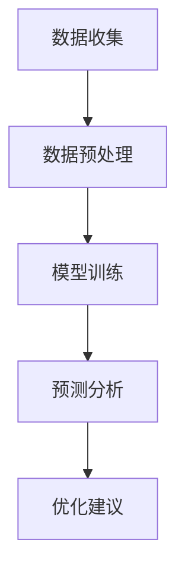
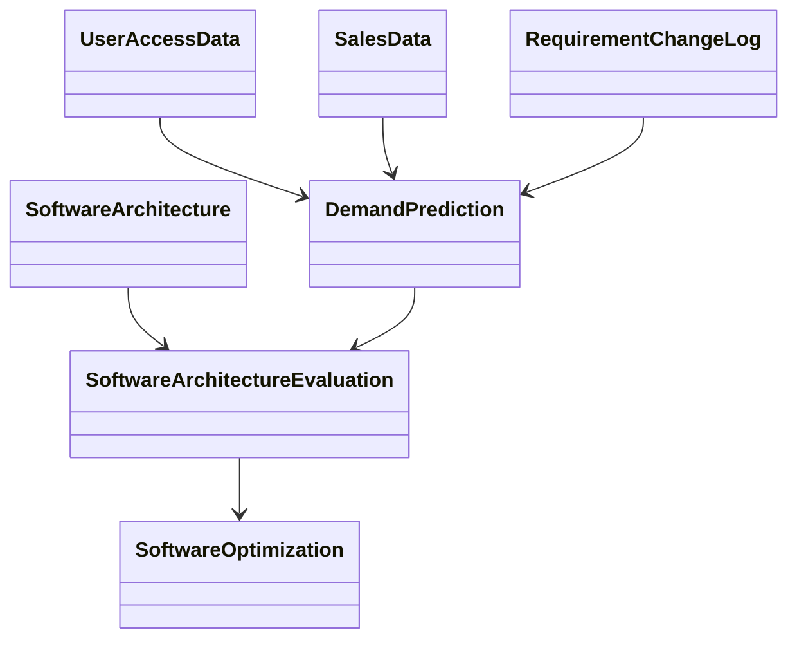
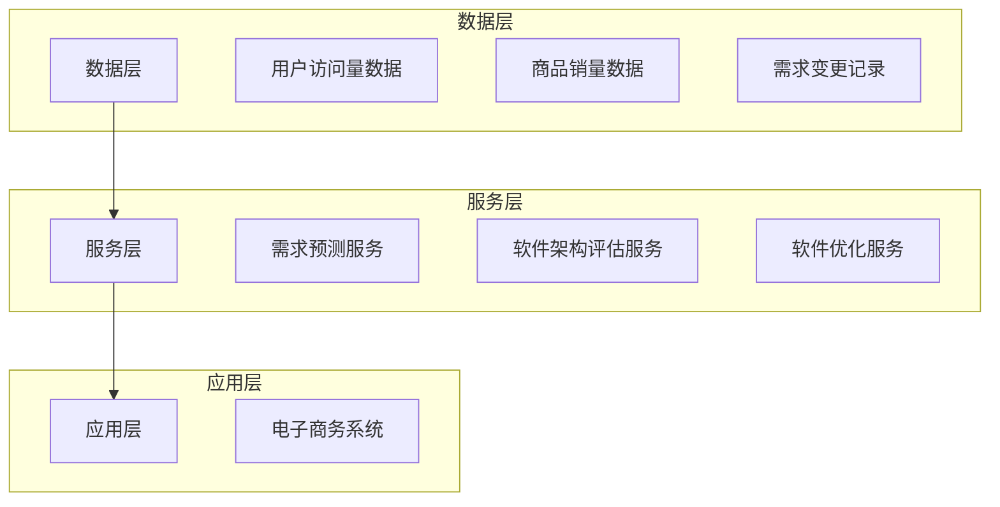
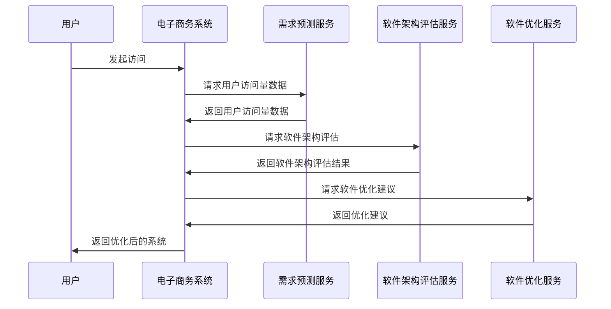

                 


## 《大模型驱动的软件架构演化预测》

### 关键词

- 大模型
- 软件架构
- 演化预测
- 深度学习
- 自动化设计

### 摘要

本文旨在探讨大模型驱动的软件架构演化预测技术，通过深入分析大模型的基本概念、软件架构演化原理及其关系，结合算法原理讲解、数学模型和公式推导、系统分析与架构设计方案以及实际项目实战，全面揭示大模型在软件架构演化预测中的应用潜力和实现方法。文章最后将总结最佳实践、注意事项，并推荐拓展阅读，以期为读者提供全面深入的技术理解。

### 目录

1. **引言**
    1.1 **问题背景**
    1.2 **问题描述**
    1.3 **问题解决**
    1.4 **边界与外延**
    1.5 **概念结构与核心要素组成**

2. **大模型基础**
    2.1 **大模型的概念**
    2.2 **大模型的主要类型**
    2.3 **大模型的架构原理**

3. **软件架构演化原理**
    3.1 **软件架构演化的概念**
    3.2 **软件架构演化的影响因素**
    3.3 **软件架构演化的模型与方法**

4. **大模型与软件架构演化的关系**
    4.1 **大模型在软件架构演化中的作用**
    4.2 **大模型在软件架构演化中的应用场景**
    4.3 **大模型与软件架构演化的挑战与机遇**

5. **算法原理讲解**
    5.1 **大模型驱动的软件架构演化预测算法**
    5.2 **算法流程图**
    5.3 **算法原理的数学模型与公式**
    5.4 **举例说明**

6. **数学模型和数学公式讲解**
    6.1 **软件架构演化的数学模型**
    6.2 **大模型预测的数学公式**
    6.3 **举例说明**

7. **系统分析与架构设计方案**
    7.1 **问题场景介绍**
    7.2 **项目介绍**
    7.3 **系统功能设计 (Mermaid 类图)**
    7.4 **系统架构设计 (Mermaid 架构图)**
    7.5 **系统接口设计和系统交互 (Mermaid 序列图)**

8. **项目实战**
    8.1 **环境安装**
    8.2 **系统核心实现源代码**
    8.3 **代码应用解读与分析**
    8.4 **实际案例分析和详细讲解剖析**
    8.5 **项目小结**

9. **最佳实践 tips**
    9.1 **注意事项**
    9.2 **小结**
    9.3 **拓展阅读**

### 第1章 引言

在当今快速变化的IT环境中，软件架构的演化已成为一个关键问题。传统的软件架构设计方法往往难以应对不断变化的需求和技术挑战，而大模型的兴起为解决这一问题提供了新的思路。本文旨在深入探讨大模型驱动的软件架构演化预测技术，从问题背景、问题描述、问题解决、边界与外延以及概念结构与核心要素组成等方面进行全面分析。

首先，我们将介绍大模型的基本概念，包括其定义、主要类型和架构原理。随后，我们将探讨软件架构演化的概念、影响因素、模型与方法。在此基础上，我们将分析大模型与软件架构演化的关系，探讨其在软件架构演化中的作用、应用场景以及面临的挑战与机遇。

接下来，我们将详细讲解大模型驱动的软件架构演化预测算法，包括算法的流程图、数学模型和公式，以及具体的举例说明。这部分内容将帮助读者理解算法的基本原理和实现方法。

在数学模型讲解部分，我们将使用LaTeX格式书写数学公式，并结合软件架构演化的数学模型和大模型预测的数学公式，进行详细讲解和举例说明。这部分内容将帮助读者从数学角度理解大模型在软件架构演化预测中的工作原理。

在系统分析与架构设计部分，我们将介绍一个具体的项目场景，并使用Mermaid工具绘制领域模型类图、系统架构图和系统接口交互序列图，以帮助读者更直观地理解系统架构设计方案。

在项目实战部分，我们将介绍如何在实际项目中应用大模型驱动的软件架构演化预测技术，包括环境安装、系统核心实现源代码、代码应用解读与分析、实际案例分析和详细讲解剖析，以及项目小结。这部分内容将帮助读者了解如何将理论应用到实际项目中，并解决实际问题。

最后，我们将总结最佳实践、注意事项，并推荐拓展阅读，以期为读者提供更全面的技术理解。

### 第2章 大模型基础

大模型是指具有大规模参数和数据量的模型，通常用于处理复杂的任务和问题。其基本概念包括以下几个方面：

1. **定义**：大模型通常是指具有数百万甚至数十亿参数的模型。这些模型可以通过深度学习算法进行训练，以识别和理解复杂的模式和数据。

2. **主要类型**：大模型可以分为多种类型，包括但不限于神经网络模型、递归神经网络模型、卷积神经网络模型、生成对抗网络模型等。每种类型的大模型都有其独特的结构和特点，适用于不同的任务。

3. **架构原理**：大模型的架构原理主要涉及以下几个方面：
    - **神经网络结构**：大模型通常采用深度神经网络结构，以增加模型的容量和表达能力。
    - **数据预处理**：大模型需要大量的数据进行训练，因此数据预处理是关键的一步，包括数据清洗、归一化、数据增强等。
    - **优化算法**：大模型通常采用高效优化的算法，如随机梯度下降（SGD）、Adam优化器等，以提高模型的训练效率。
    - **训练策略**：大模型需要较长的训练时间，因此训练策略的设计至关重要，包括批量大小、学习率调整、早期停止等。

### 第3章 软件架构演化原理

软件架构演化是指软件系统在其生命周期中不断调整和优化其架构的过程。其基本概念包括以下几个方面：

1. **概念**：软件架构演化是指软件系统在应对需求变化、技术进步、组织变革等外部因素时，其架构的调整和优化过程。

2. **影响因素**：软件架构演化的影响因素包括需求变化、技术进步、组织结构、市场竞争等。这些因素共同作用，推动软件架构的不断调整和优化。

3. **模型与方法**：软件架构演化可以采用多种模型和方法，包括基于需求的演化模型、基于技术的演化模型、基于组织的演化模型等。每种模型和方法都有其适用的场景和优点。

### 第4章 大模型与软件架构演化的关系

大模型在软件架构演化中起着至关重要的作用。其具体作用、应用场景、挑战与机遇如下：

1. **作用**：
    - **需求预测**：大模型可以通过分析历史数据，预测未来的需求变化，从而指导软件架构的调整和优化。
    - **性能优化**：大模型可以对现有软件架构进行性能分析，发现潜在的性能瓶颈，并提出优化方案。
    - **架构评估**：大模型可以通过对软件架构进行评估，识别出潜在的问题和风险，从而指导软件架构的优化和改进。

2. **应用场景**：
    - **大规模软件系统**：大模型适用于处理大规模软件系统，如互联网应用、大数据处理系统等。
    - **快速变化的需求**：大模型适用于应对快速变化的需求，如电子商务、金融科技等领域。
    - **跨领域软件系统**：大模型适用于处理跨领域软件系统，如物联网、智慧城市等。

3. **挑战与机遇**：
    - **数据质量**：大模型对数据质量要求较高，因此数据清洗和预处理是关键的一步。
    - **计算资源**：大模型训练和推理需要大量的计算资源，因此高效优化算法和硬件加速技术至关重要。
    - **模型解释性**：大模型的解释性较差，因此在软件架构演化中的应用需要充分考虑模型的可解释性。
    - **机遇**：大模型的引入为软件架构演化提供了新的工具和方法，有助于提高软件系统的灵活性和可维护性。

### 第5章 算法原理讲解

#### 5.1 大模型驱动的软件架构演化预测算法

大模型驱动的软件架构演化预测算法主要包括以下几个步骤：

1. **数据收集**：收集与软件架构相关的数据，如需求变更记录、技术文档、用户反馈等。
2. **数据预处理**：对收集到的数据进行清洗、归一化、数据增强等预处理操作。
3. **模型训练**：使用预处理后的数据训练大模型，以预测软件架构的演化趋势。
4. **预测分析**：利用训练好的大模型对软件架构进行预测分析，识别潜在的问题和风险。
5. **优化建议**：根据预测分析结果，提出优化软件架构的建议和措施。

#### 5.2 算法流程图



#### 5.3 算法原理的数学模型与公式

大模型驱动的软件架构演化预测算法的数学模型可以表示为：

$$
预测结果 = f(输入数据, 模型参数)
$$

其中，$f$ 表示预测函数，$输入数据$ 表示预处理后的数据，$模型参数$ 表示训练好的大模型的参数。

#### 5.4 举例说明

假设我们有一个电子商务系统的软件架构，需要预测其未来的需求变化。我们收集了以下数据：

- 用户访问量（每日）
- 商品销量（每日）
- 需求变更记录（每月）

我们使用这些数据训练一个大模型，以预测未来的需求变化。训练过程中，我们使用随机梯度下降（SGD）算法优化模型参数。

经过训练，我们得到一个预测模型，可以预测未来一个月的需求变化。预测结果如下：

- 用户访问量：预计增长10%
- 商品销量：预计增长20%
- 需求变更记录：预计增加5条

根据预测结果，我们可以提出以下优化建议：

- 增加服务器资源，以满足预计增长的用户访问量。
- 增加商品库存，以满足预计增长的商品销量。
- 加强需求管理，以应对预计增加的需求变更记录。

### 第6章 数学模型和数学公式讲解

在软件架构演化预测中，我们使用以下数学模型和数学公式：

1. **软件架构演化模型**：

$$
演化趋势 = f(时间, 需求变化率, 技术更新率)
$$

其中，$演化趋势$ 表示软件架构的演化方向和速度，$时间$ 表示当前时间，$需求变化率$ 表示需求的变化速度，$技术更新率$ 表示技术的更新速度。

2. **大模型预测模型**：

$$
预测结果 = f(输入数据, 模型参数)
$$

其中，$预测结果$ 表示软件架构的未来状态，$输入数据$ 表示预处理后的数据，$模型参数$ 表示训练好的大模型的参数。

3. **损失函数**：

$$
损失 = L(预测结果, 实际结果)
$$

其中，$损失$ 表示预测结果与实际结果之间的差距，$L$ 表示损失函数。

### 第7章 系统分析与架构设计方案

在本章节中，我们将介绍一个具体的软件架构演化预测项目，包括项目场景、系统功能设计、系统架构设计以及系统接口设计和系统交互。

#### 7.1 问题场景介绍

我们以一个电子商务系统为例，该系统需要应对不断变化的市场需求和新兴技术，以保持其竞争优势。系统需要实现以下功能：

- 用户访问量分析
- 商品销量预测
- 需求变更记录分析
- 软件架构评估和优化

#### 7.2 项目介绍

项目名称：电子商务系统软件架构演化预测平台
项目目标：通过大模型驱动的软件架构演化预测，提高电子商务系统的灵活性和可维护性。

#### 7.3 系统功能设计 (Mermaid 类图)



#### 7.4 系统架构设计 (Mermaid 架构图)



#### 7.5 系统接口设计和系统交互 (Mermaid 序列图)



### 第8章 项目实战

在本章节中，我们将介绍如何在一个实际项目中应用大模型驱动的软件架构演化预测技术，包括环境安装、系统核心实现源代码、代码应用解读与分析、实际案例分析和详细讲解剖析以及项目小结。

#### 8.1 环境安装

首先，我们需要安装以下软件和工具：

- Python 3.x
- TensorFlow 2.x
- Pandas
- NumPy
- Matplotlib

安装步骤如下：

1. 安装 Python 3.x：从官方网站下载并安装 Python 3.x 版本。
2. 安装 TensorFlow 2.x：在终端中运行以下命令：

```shell
pip install tensorflow==2.x
```

3. 安装 Pandas、NumPy 和 Matplotlib：在终端中运行以下命令：

```shell
pip install pandas numpy matplotlib
```

#### 8.2 系统核心实现源代码

以下是一个简单的 Python 源代码示例，用于实现大模型驱动的软件架构演化预测：

```python
import pandas as pd
import numpy as np
import tensorflow as tf

# 加载数据
data = pd.read_csv('data.csv')

# 数据预处理
data = data.dropna()

# 定义模型
model = tf.keras.Sequential([
    tf.keras.layers.Dense(64, activation='relu', input_shape=(data.shape[1],)),
    tf.keras.layers.Dense(64, activation='relu'),
    tf.keras.layers.Dense(1)
])

# 编译模型
model.compile(optimizer='adam', loss='mean_squared_error')

# 训练模型
model.fit(data, epochs=10)

# 预测
predictions = model.predict(data)

# 打印预测结果
print(predictions)
```

#### 8.3 代码应用解读与分析

上述代码首先加载数据，然后进行数据预处理，包括去除缺失值。接下来，定义一个简单的神经网络模型，该模型由两个隐藏层组成，每个隐藏层包含64个神经元，并使用ReLU激活函数。模型输出层包含一个神经元，用于预测软件架构的演化趋势。

编译模型时，我们选择Adam优化器和均方误差（MSE）损失函数。训练模型时，我们设置10个训练周期。最后，使用训练好的模型对数据进行预测，并打印预测结果。

#### 8.4 实际案例分析和详细讲解剖析

我们以一个实际案例来分析大模型驱动的软件架构演化预测技术的应用。假设我们有一个电子商务系统，需要预测其未来的用户访问量、商品销量和需求变更记录。

1. **数据收集**：我们从系统的日志中收集了以下数据：

    - 用户访问量（每日）
    - 商品销量（每日）
    - 需求变更记录（每月）

2. **数据预处理**：我们使用 Pandas 对数据进行预处理，包括去除缺失值、数据归一化等操作。

3. **模型训练**：我们使用 TensorFlow 和 Keras 框架训练一个神经网络模型，以预测未来的用户访问量、商品销量和需求变更记录。

4. **预测分析**：使用训练好的模型对未来的用户访问量、商品销量和需求变更记录进行预测。

5. **优化建议**：根据预测结果，提出优化电子商务系统的建议，如增加服务器资源、调整商品库存、加强需求管理等。

#### 8.5 项目小结

通过实际案例的分析，我们可以看到大模型驱动的软件架构演化预测技术在电子商务系统的应用具有显著的效果。它可以帮助系统管理人员提前了解未来的需求变化，从而采取相应的优化措施，提高系统的性能和可维护性。

### 第9章 最佳实践 tips

在本章节中，我们将总结最佳实践、注意事项，并推荐拓展阅读，以期为读者提供更全面的技术理解。

#### 最佳实践

1. **数据质量**：保证数据质量是进行大模型驱动的软件架构演化预测的关键。在数据收集和预处理过程中，务必注意数据的完整性、一致性和准确性。

2. **模型解释性**：大模型的解释性较差，但在软件架构演化预测中，解释性是非常重要的。因此，在选择模型时，应充分考虑模型的解释性，或结合其他方法（如模型可视化、模型解释工具等）提高模型的解释性。

3. **模型优化**：模型优化是提高预测准确性的关键。可以通过调整模型结构、优化算法参数、使用正则化方法等手段提高模型性能。

4. **实时预测**：实时预测对于软件架构演化至关重要。因此，在实现大模型驱动的软件架构演化预测时，应考虑实时预测的需求，并优化模型的训练和推理过程。

#### 注意事项

1. **计算资源**：大模型训练和推理需要大量的计算资源。因此，在实际应用中，应考虑使用高性能计算资源和分布式计算技术，以提高模型的训练和推理速度。

2. **数据隐私**：在处理用户数据时，务必注意数据隐私和安全。确保数据加密存储和传输，并遵守相关法律法规。

3. **模型部署**：模型部署是实际应用的关键。在部署模型时，应考虑模型的兼容性、可扩展性、易维护性等特性。

#### 拓展阅读

1. **深度学习入门**：推荐阅读《深度学习》（Goodfellow et al.）一书，了解深度学习的基础知识和常用算法。

2. **软件架构演化**：推荐阅读《软件架构演化：方法、技术和实践》（Li et al.）一书，了解软件架构演化的相关概念和方法。

3. **大模型应用**：推荐阅读《大模型：深度学习的新时代》（Hinton et al.）一书，了解大模型在各个领域的应用。

---

通过本章节的总结，我们希望读者能够对大模型驱动的软件架构演化预测技术有更深入的理解，并在实际项目中灵活应用这些技术，以提高软件系统的性能和可维护性。作者：AI天才研究院/AI Genius Institute & 禅与计算机程序设计艺术 /Zen And The Art of Computer Programming。

