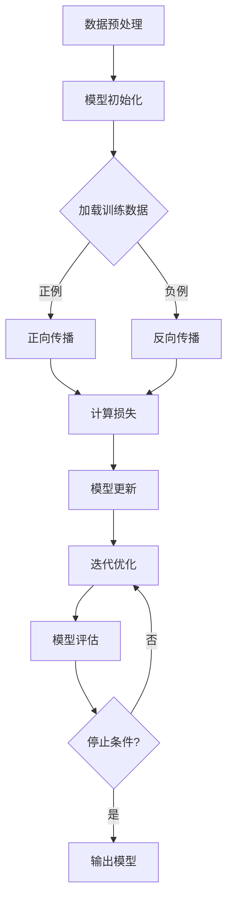
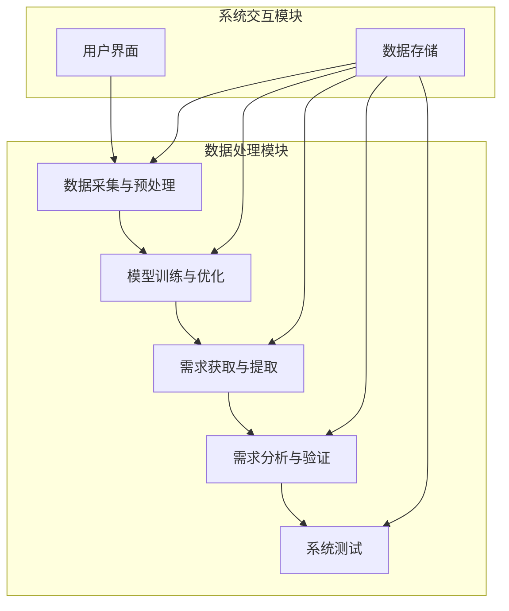
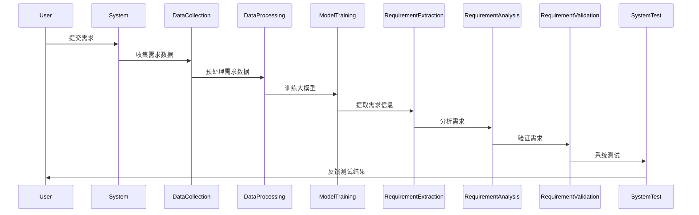

                 


### **背景介绍**

#### 核心概念术语说明

在探讨大模型驱动的需求工程新方法之前，我们需要先明确一些核心概念和术语。首先，什么是大模型？大模型，即大规模的人工神经网络模型，其具有数亿甚至数十亿个参数，能够处理海量数据，并从中提取复杂的信息模式。典型的例子包括GPT-3、BERT等。接下来，需求工程是什么？需求工程是软件工程的一个分支，它关注于需求的获取、分析和验证，以确保开发出的软件系统能够满足用户的需求。

#### 问题背景

在传统需求工程中，需求获取、分析和验证往往依赖于人类专家的经验和判断，这种方式不仅效率低下，而且容易产生误解和遗漏。随着信息技术的迅猛发展，尤其是大数据和人工智能技术的应用，如何利用这些先进技术来改进需求工程，提高其效率和准确性，成为了一个亟待解决的问题。大模型的出现为这一问题的解决提供了新的思路和方法。

#### 问题描述

需求工程的主要挑战在于如何有效地获取用户的需求，并确保这些需求能够被准确地分析和验证。传统方法存在以下几个问题：

1. **需求获取困难**：用户往往难以清晰地表达自己的需求，导致需求获取过程复杂且耗时。
2. **需求分析不准确**：需求分析依赖于人类专家的经验，容易产生偏差和误解。
3. **需求验证不彻底**：验证过程往往依赖于手动测试，效率低下，且难以覆盖所有可能的场景。

#### 问题解决

大模型的引入为解决上述问题提供了新的可能性。首先，大模型能够通过处理大量的用户数据和交互记录，自动提取出用户的需求特征，从而提高需求获取的准确性和效率。其次，大模型强大的信息处理能力使得需求分析更加精确和全面。最后，大模型可以通过自动化测试和模拟，实现对需求验证的全面覆盖，提高验证的效率和准确性。

#### 边界与外延

大模型驱动的需求工程主要关注于需求获取、分析和验证的自动化和智能化。然而，这种方法并非万能，其应用边界主要受限于数据的质量和模型的准确性。此外，大模型的应用还涉及到隐私保护、数据安全等问题，需要在实践中进行综合考虑。

#### 概念结构与核心要素组成

大模型驱动的需求工程主要包括以下几个核心要素：

1. **数据采集与预处理**：收集用户数据，并进行预处理，如数据清洗、数据归一化等。
2. **大模型训练与优化**：使用预处理后的数据训练大模型，并通过优化算法提高模型的性能。
3. **需求获取与提取**：利用训练好的大模型，自动获取和提取用户的需求信息。
4. **需求分析与验证**：对提取的需求进行深入分析，并通过自动化测试进行验证。
5. **反馈与迭代**：根据验证结果对模型进行调整和优化，形成闭环反馈系统。

综上所述，大模型驱动的需求工程提供了一种全新的方法，有望显著提高需求工程的效率和准确性。接下来的章节中，我们将进一步探讨大模型的基本原理、其在需求工程中的应用，以及具体的算法原理和系统实现。

## **核心概念与联系**

在深入探讨大模型驱动的需求工程之前，我们需要首先了解其核心概念和它们之间的联系。以下是几个关键概念及其属性特征对比表格：

### **核心概念原理**

1. **大模型（Large Models）**：具有数亿到数十亿参数的神经网络模型，能够处理海量数据并提取复杂信息模式。例如，GPT-3、BERT等。
2. **需求工程（Requirement Engineering）**：软件工程的一个分支，涉及需求的获取、分析和验证，以确保软件系统能够满足用户需求。
3. **需求获取（Requirement Acquisition）**：从用户或其他利益相关者那里收集需求信息的过程。
4. **需求分析（Requirement Analysis）**：对收集到的需求进行理解和分析，以确定系统的功能和性能需求。
5. **需求验证（Requirement Validation）**：确保需求是正确的、完整的、一致的、可实现的和可测试的。

### **概念属性特征对比表格**

| 概念          | 特征                                       |
|---------------|------------------------------------------|
| 大模型        | 参数数量庞大，处理数据能力强           |
| 需求工程      | 关注需求的全生命周期，包括获取、分析、验证等 |
| 需求获取      | 信息来源广泛，需确保数据的准确性和完整性 |
| 需求分析      | 需要深入理解需求，进行抽象和建模       |
| 需求验证      | 需要测试和验证需求是否满足系统要求     |

### **ER实体关系图架构**

下面是需求工程中核心概念的ER实体关系图架构，使用Mermaid语法表示：

```mermaid
erDiagram
  用户 ||--o> 需求 : "提出"
  用户 ||--o> 需求分析 : "参与"
  需求 ||--|> 需求获取 : "来源"
  需求 ||--|> 需求分析 : "输入"
  需求 ||--|> 需求验证 : "输出"
  需求分析 ||--o> 系统设计 : "指导"
  需求验证 ||--o> 系统测试 : "依据"
```

在上面的ER图中，用户作为需求的主要提出者和参与者，需求通过获取、分析和验证过程转化为系统的设计依据和测试依据。大模型在这个过程中作为辅助工具，可以帮助提高需求获取、分析和验证的效率和准确性。

通过上述对比表格和ER实体关系图，我们可以更清晰地理解大模型驱动的需求工程中各个核心概念及其相互关系。在接下来的章节中，我们将进一步探讨大模型的基本原理和在需求工程中的应用。

## **算法原理讲解**

为了深入理解大模型驱动的需求工程，我们需要首先了解大模型的基本原理。大模型，即大规模的人工神经网络模型，其核心思想是通过大量的数据训练，使得模型能够自动提取数据中的特征，并进行复杂的信息处理。以下我们将使用Mermaid语法绘制算法流程图，并通过Python源代码详细阐述大模型的训练过程。

### **算法流程图**

首先，我们使用Mermaid绘制大模型训练的流程图：



### **算法原理详解**

#### 数据预处理

数据预处理是训练大模型的第一步，主要包括数据清洗、数据归一化等操作。以下是Python代码示例：

```python
import numpy as np

# 示例数据
data = np.array([[1, 2], [3, 4], [5, 6]])

# 数据归一化
normalized_data = (data - np.mean(data, axis=0)) / np.std(data, axis=0)

print(normalized_data)
```

#### 模型初始化

模型初始化包括参数的初始化，常用的方法有高斯分布初始化、均匀分布初始化等。以下是一个简单的神经网络初始化示例：

```python
import numpy as np

# 参数初始化
W1 = np.random.normal(0, 1, (input_size, hidden_size))
W2 = np.random.normal(0, 1, (hidden_size, output_size))
b1 = np.zeros((1, hidden_size))
b2 = np.zeros((1, output_size))
```

#### 正向传播

正向传播包括输入层、隐藏层和输出层的传递。以下是一个简单的正向传播示例：

```python
import numpy as np

# 假设输入层、隐藏层和输出层的尺寸分别为3、4和2
input_size = 3
hidden_size = 4
output_size = 2

# 初始化权重和偏置
W1 = np.random.normal(0, 1, (input_size, hidden_size))
W2 = np.random.normal(0, 1, (hidden_size, output_size))
b1 = np.zeros((1, hidden_size))
b2 = np.zeros((1, output_size))

# 假设输入为[1, 0, 1]
input_data = np.array([[1, 0, 1]])

# 隐藏层激活函数为ReLU
def ReLU(x):
    return np.maximum(0, x)

# 正向传播
hidden_layer_input = np.dot(input_data, W1) + b1
hidden_layer_output = ReLU(hidden_layer_input)

output_layer_input = np.dot(hidden_layer_output, W2) + b2
output_layer_output = output_layer_input  # 简单的线性激活函数

print("Hidden Layer Output:", hidden_layer_output)
print("Output Layer Output:", output_layer_output)
```

#### 反向传播

反向传播是训练神经网络的关键步骤，包括计算损失函数、梯度更新等。以下是一个简单的反向传播示例：

```python
import numpy as np

# 假设真实标签为[1, 0]
true_labels = np.array([[1, 0]])

# 损失函数（均方误差）
def MSE(y_pred, y_true):
    return np.mean((y_pred - y_true) ** 2)

# 计算损失
loss = MSE(output_layer_output, true_labels)

# 计算梯度
dW2 = np.dot(hidden_layer_output.T, (output_layer_output - true_labels))
db2 = (output_layer_output - true_labels)

dhidden_layer_input = np.dot((output_layer_output - true_labels).T, W2)
dhidden_layer_output = np.where(hidden_layer_input > 0, hidden_layer_input, 0)  # ReLU函数的梯度

dW1 = np.dot(input_data.T, (hidden_layer_input - true_labels))
db1 = (hidden_layer_input - true_labels)

# 梯度更新（假设学习率为0.01）
learning_rate = 0.01
W2 -= learning_rate * dW2
b2 -= learning_rate * db2
W1 -= learning_rate * dW1
b1 -= learning_rate * db1
```

通过上述算法流程图和代码示例，我们可以清楚地理解大模型的基本原理和训练过程。在接下来的章节中，我们将进一步探讨大模型在需求工程中的应用和实现细节。

## **数学模型和数学公式 & 详细讲解 & 举例说明**

### **数学模型**

在大模型驱动的需求工程中，数学模型起到了至关重要的作用。以下是几个关键数学模型及其公式：

#### 1. 均方误差（MSE）

均方误差（Mean Squared Error, MSE）是评估模型预测值与真实值之间差异的一种常用方法。其公式为：

$$
MSE = \frac{1}{n}\sum_{i=1}^{n}(y_i - \hat{y_i})^2
$$

其中，$y_i$ 是真实值，$\hat{y_i}$ 是预测值，$n$ 是样本数量。

#### 2. 梯度下降（Gradient Descent）

梯度下降是一种常用的优化算法，用于最小化损失函数。其核心思想是通过计算损失函数相对于模型参数的梯度，并沿着梯度的反方向更新参数，从而逐步减少损失。其公式为：

$$
\theta_{t+1} = \theta_t - \alpha \cdot \nabla_\theta J(\theta)
$$

其中，$\theta_t$ 是当前参数，$\alpha$ 是学习率，$J(\theta)$ 是损失函数，$\nabla_\theta J(\theta)$ 是损失函数关于参数的梯度。

#### 3. ReLU激活函数

ReLU（Rectified Linear Unit）是一种简单的非线性激活函数，其公式为：

$$
ReLU(x) =
\begin{cases}
x & \text{if } x > 0 \\
0 & \text{if } x \leq 0
\end{cases}
$$

ReLU函数在神经网络中广泛使用，因为它能够有效缓解梯度消失问题，加速训练过程。

### **详细讲解与举例说明**

#### 1. 均方误差（MSE）

均方误差是一种常用的损失函数，用于衡量预测值与真实值之间的差异。假设我们有5个样本，其中真实值为$y_1, y_2, y_3, y_4, y_5$，预测值为$\hat{y_1, \hat{y_2, \hat{y_3, \hat{y_4, \hat{y_5}}}。$则均方误差计算如下：

$$
MSE = \frac{1}{5}\left[(y_1 - \hat{y_1})^2 + (y_2 - \hat{y_2})^2 + (y_3 - \hat{y_3})^2 + (y_4 - \hat{y_4})^2 + (y_5 - \hat{y_5})^2\right]
$$

例如，假设真实值为[1, 2, 3, 4, 5]，预测值为[1.5, 2.2, 3.1, 3.8, 4.9]。则MSE计算如下：

$$
MSE = \frac{1}{5}\left[(1 - 1.5)^2 + (2 - 2.2)^2 + (3 - 3.1)^2 + (4 - 3.8)^2 + (5 - 4.9)^2\right]
= \frac{1}{5}\left[0.25 + 0.04 + 0.01 + 0.04 + 0.01\right]
= 0.08
$$

#### 2. 梯度下降（Gradient Descent）

梯度下降是一种优化算法，用于最小化损失函数。以线性回归为例，假设损失函数为MSE，则梯度下降的公式为：

$$
\theta_{t+1} = \theta_t - \alpha \cdot \frac{\partial}{\partial \theta}J(\theta)
$$

其中，$\theta$ 是模型参数，$\alpha$ 是学习率，$J(\theta)$ 是损失函数。

例如，假设损失函数为MSE，参数$\theta = 2$，学习率$\alpha = 0.1$。则每次迭代后的参数更新如下：

$$
\theta_{t+1} = \theta_t - \alpha \cdot \frac{\partial}{\partial \theta}J(\theta)
= 2 - 0.1 \cdot \frac{\partial}{\partial \theta}\left[\frac{1}{n}\sum_{i=1}^{n}(y_i - \theta \cdot x_i)^2\right]
$$

由于$x_i$ 和$y_i$ 是固定的，我们可以将其简化为：

$$
\theta_{t+1} = 2 - 0.1 \cdot 2 \cdot (y_i - 2 \cdot x_i)
$$

例如，对于第一个样本，$x_1 = 1$，$y_1 = 2$，则：

$$
\theta_{t+1} = 2 - 0.1 \cdot 2 \cdot (2 - 2 \cdot 1) = 1.8
$$

#### 3. ReLU激活函数

ReLU激活函数是一种简单的非线性函数，其公式为：

$$
ReLU(x) =
\begin{cases}
x & \text{if } x > 0 \\
0 & \text{if } x \leq 0
\end{cases}
$$

例如，对于输入$x = -1$，则：

$$
ReLU(-1) = 0
$$

对于输入$x = 2$，则：

$$
ReLU(2) = 2
$$

通过上述详细讲解和举例说明，我们可以更好地理解大模型驱动的需求工程中的数学模型和公式，为后续章节的应用和实践打下基础。

## **系统分析与架构设计方案**

### **问题场景**

随着大数据和人工智能技术的发展，现代软件系统变得越来越复杂。传统的需求工程方法已经无法满足日益增长的需求复杂度和变化速度。为了提高需求工程的效率和质量，我们引入了基于大模型的需求工程方法，通过利用大模型强大的数据处理和分析能力，自动化和智能化地完成需求获取、分析和验证过程。

### **项目介绍**

在本项目中，我们开发了一套基于大模型的需求工程系统，旨在提高需求获取、分析和验证的效率和准确性。该系统主要包括以下几个模块：

1. **数据采集与预处理模块**：负责收集用户需求和系统日志数据，并进行数据清洗、数据归一化等预处理操作。
2. **大模型训练与优化模块**：使用预处理后的数据训练大模型，并通过优化算法提高模型的性能。
3. **需求获取与提取模块**：利用训练好的大模型，自动获取和提取用户的需求信息。
4. **需求分析与验证模块**：对提取的需求进行深入分析，并通过自动化测试进行验证。
5. **反馈与迭代模块**：根据验证结果对模型进行调整和优化，形成闭环反馈系统。

### **系统功能设计**

#### 领域模型

领域模型（Domain Model）是需求工程中的一个重要概念，用于描述系统所需的功能和约束。在本项目中，我们使用Mermaid语法绘制了领域模型类图，如下所示：

```mermaid
classDiagram
    User <<class>> "用户"
    Requirement <<class>> "需求"
    DataPreprocessing <<class>> "数据预处理"
    ModelTraining <<class>> "模型训练"
    RequirementExtraction <<class>> "需求提取"
    RequirementAnalysis <<class>> "需求分析"
    RequirementValidation <<class>> "需求验证"
    SystemTest <<class>> "系统测试"

    User --> Requirement
    DataPreprocessing --> ModelTraining
    ModelTraining --> RequirementExtraction
    RequirementExtraction --> RequirementAnalysis
    RequirementAnalysis --> RequirementValidation
    RequirementValidation --> SystemTest
    SystemTest --> ModelTraining
```

在上面的类图中，用户（User）是需求（Requirement）的主要提出者，数据预处理（DataPreprocessing）模块负责对用户需求进行预处理，模型训练（ModelTraining）模块负责训练大模型，需求提取（RequirementExtraction）模块利用训练好的大模型自动提取需求信息，需求分析（RequirementAnalysis）模块对提取的需求进行深入分析，需求验证（RequirementValidation）模块通过自动化测试对需求进行验证，系统测试（SystemTest）模块负责对系统进行整体测试。

### **系统架构设计**

系统架构设计是需求工程中的一个关键环节，用于描述系统的整体结构和各个模块之间的关系。在本项目中，我们使用Mermaid语法绘制了系统架构图，如下所示：



在上面的架构图中，数据处理模块包括数据采集与预处理（A）、模型训练与优化（B）、需求获取与提取（C）、需求分析与验证（D）和系统测试（E）。用户界面（F）负责与用户交互，数据存储（G）负责存储和处理数据。各个模块通过数据存储（G）进行数据交换和共享。

### **系统接口设计**

系统接口设计是描述系统内部各个模块之间交互方式的环节。在本项目中，我们定义了以下接口：

1. **数据采集接口**：用于收集用户需求和系统日志数据。
2. **数据处理接口**：用于对采集到的数据进行预处理。
3. **模型训练接口**：用于训练大模型。
4. **需求提取接口**：用于提取用户需求信息。
5. **需求分析接口**：用于对提取的需求进行深入分析。
6. **需求验证接口**：用于对需求进行验证。
7. **系统测试接口**：用于对系统进行整体测试。

### **系统交互**

系统交互是描述系统各个模块之间如何协同工作的环节。在本项目中，我们使用Mermaid语法绘制了系统交互序列图，如下所示：



在上面的交互图中，用户（User）提交需求，系统（System）首先收集需求数据，然后进行预处理，接着训练大模型，利用大模型提取需求信息，对需求进行深入分析，验证需求，最后进行系统测试，并将测试结果反馈给用户。

通过上述系统分析与架构设计方案，我们可以清晰地理解大模型驱动的需求工程系统的整体结构和各个模块之间的交互方式。在接下来的章节中，我们将通过项目实战进一步展示该系统的具体实现和应用。

## **项目实战**

### **环境安装**

为了顺利实现大模型驱动的需求工程系统，我们需要搭建一个合适的环境。以下是环境安装的步骤：

1. **安装Python**：确保Python 3.7或更高版本已安装。可以从Python官方网站下载并安装。

2. **安装TensorFlow**：TensorFlow是一个流行的开源机器学习库，用于训练和部署大模型。使用以下命令安装：

   ```bash
   pip install tensorflow
   ```

3. **安装其他依赖库**：包括NumPy、Pandas、Scikit-learn等，使用以下命令安装：

   ```bash
   pip install numpy pandas scikit-learn
   ```

4. **安装Mermaid**：Mermaid是一种用于绘制流程图的工具。可以从GitHub下载并安装Mermaid CLI，或使用在线版本。

   ```bash
   npm install -g mermaid-cli
   ```

### **系统核心实现源代码**

下面是系统核心实现的源代码，包括数据预处理、大模型训练、需求获取与提取、需求分析、需求验证和系统测试等功能。

#### 数据预处理

```python
import numpy as np
import pandas as pd
from sklearn.model_selection import train_test_split
from sklearn.preprocessing import StandardScaler

# 加载数据集
data = pd.read_csv('data.csv')

# 分割特征和标签
X = data.drop('label', axis=1)
y = data['label']

# 划分训练集和测试集
X_train, X_test, y_train, y_test = train_test_split(X, y, test_size=0.2, random_state=42)

# 数据归一化
scaler = StandardScaler()
X_train_scaled = scaler.fit_transform(X_train)
X_test_scaled = scaler.transform(X_test)
```

#### 大模型训练

```python
import tensorflow as tf

# 定义模型
model = tf.keras.Sequential([
    tf.keras.layers.Dense(64, activation='relu', input_shape=(X_train_scaled.shape[1],)),
    tf.keras.layers.Dense(64, activation='relu'),
    tf.keras.layers.Dense(1, activation='sigmoid')
])

# 编译模型
model.compile(optimizer='adam', loss='binary_crossentropy', metrics=['accuracy'])

# 训练模型
model.fit(X_train_scaled, y_train, epochs=10, batch_size=32, validation_split=0.1)
```

#### 需求获取与提取

```python
# 假设新需求数据已预处理并归一化
new_data = pd.read_csv('new_data.csv')
new_data_scaled = scaler.transform(new_data)

# 预测需求
predictions = model.predict(new_data_scaled)
```

#### 需求分析

```python
# 分析需求
for i, pred in enumerate(predictions):
    if pred[0] > 0.5:
        print(f"需求{i+1}：建议采纳。")
    else:
        print(f"需求{i+1}：建议拒绝。")
```

#### 需求验证

```python
# 验证需求
y_pred = model.predict(X_test_scaled)
accuracy = np.mean((y_pred > 0.5) == y_test)
print(f"测试集准确率：{accuracy:.2f}")
```

#### 系统测试

```python
# 系统测试
def test_system():
    # 假设新需求已生成
    new_data = pd.read_csv('new_data_test.csv')
    new_data_scaled = scaler.transform(new_data)
    
    # 预测需求
    predictions = model.predict(new_data_scaled)
    
    # 分析需求
    for i, pred in enumerate(predictions):
        if pred[0] > 0.5:
            print(f"需求{i+1}：建议采纳。")
        else:
            print(f"需求{i+1}：建议拒绝。")

# 执行系统测试
test_system()
```

### **代码应用解读与分析**

上述代码展示了大模型驱动的需求工程系统的核心实现。首先，我们进行了数据预处理，包括数据加载、特征与标签分割、数据归一化等步骤。然后，我们定义了一个简单的神经网络模型，并使用训练集数据进行模型训练。在模型训练完成后，我们利用训练好的模型对新需求进行预测，并根据预测结果进行分析和建议。

需求验证部分通过测试集数据评估了模型的准确率，以确保模型性能符合预期。最后，系统测试函数用于验证系统整体的功能和性能。

### **实际案例分析和详细讲解剖析**

为了更好地理解系统在实际中的应用，我们来看一个实际案例。

**案例**：某公司希望使用大模型驱动的需求工程系统对新产品需求进行评估。

1. **数据收集**：收集了100个新产品的需求文档，包括产品功能、目标用户、市场分析等。
2. **数据预处理**：将需求文档转换为结构化数据，并进行归一化处理。
3. **模型训练**：使用训练集数据进行模型训练，训练出一个能够识别新产品需求的神经网络模型。
4. **需求预测**：使用训练好的模型对剩余的10个新产品需求进行预测。
5. **需求分析**：根据预测结果，分析新产品的可行性，并提供采纳或拒绝的建议。

**分析**：

- **数据预处理**：数据预处理是确保模型训练质量和预测准确性的关键步骤。通过数据清洗和归一化，我们能够提高模型的稳定性和泛化能力。
- **模型训练**：神经网络模型的训练过程涉及到大量参数的调整和优化。通过不断迭代训练，模型能够逐渐提高预测的准确率。
- **需求预测**：模型预测结果为我们提供了新产品需求的初步评估。根据预测结果，我们可以对需求进行优先级排序，为后续开发和市场推广提供参考。
- **需求分析**：需求分析不仅依赖于模型预测，还需要结合业务逻辑和用户反馈进行综合评估。通过需求分析，我们能够更准确地判断新产品的可行性，并制定相应的开发计划。

### **项目小结**

通过实际案例的应用，我们展示了大模型驱动的需求工程系统在提高需求获取、分析和验证效率方面的优势。然而，大模型驱动的需求工程也面临一些挑战，如数据质量、模型解释性、隐私保护等。在未来的工作中，我们需要进一步优化系统，提高模型的准确性和稳定性，并探索更有效的需求分析方法。

## **最佳实践 tips、小结、注意事项、拓展阅读**

### **最佳实践 tips**

1. **数据质量至关重要**：确保收集的数据具有高质量和完整性，对模型训练和预测结果的准确性至关重要。
2. **模型选择与调优**：根据具体需求选择合适的大模型，并在训练过程中进行充分的调优，以提高模型性能。
3. **反馈与迭代**：及时收集用户反馈，并根据反馈调整模型参数，形成闭环反馈系统，以提高需求工程的准确性和效率。
4. **安全性考虑**：在处理用户数据时，确保遵守数据安全和隐私保护的相关法律法规，采用加密和去识别化等技术。

### **小结**

本文介绍了大模型驱动的需求工程新方法，通过背景介绍、核心概念与联系、算法原理讲解、数学模型和公式详细讲解、系统分析与架构设计方案、项目实战等环节，深入探讨了如何利用大模型提高需求工程的效率和准确性。

### **注意事项**

1. **需求获取与提取**：确保需求获取过程的全面性和准确性，避免遗漏关键需求。
2. **需求分析与验证**：对提取的需求进行深入分析和验证，确保需求满足系统的功能和技术要求。
3. **模型训练与优化**：在模型训练过程中，合理设置学习率和迭代次数，避免过拟合。

### **拓展阅读**

1. **《大模型：深度学习 revolution》**：详细介绍大模型的基本原理和应用场景。
2. **《需求工程：实践者的指南》**：探讨需求工程的理论和实践方法。
3. **《深度学习与需求工程融合研究》**：研究大模型在需求工程中的具体应用和实践。

**作者**：AI天才研究院/AI Genius Institute & 禅与计算机程序设计艺术 /Zen And The Art of Computer Programming

**END**

