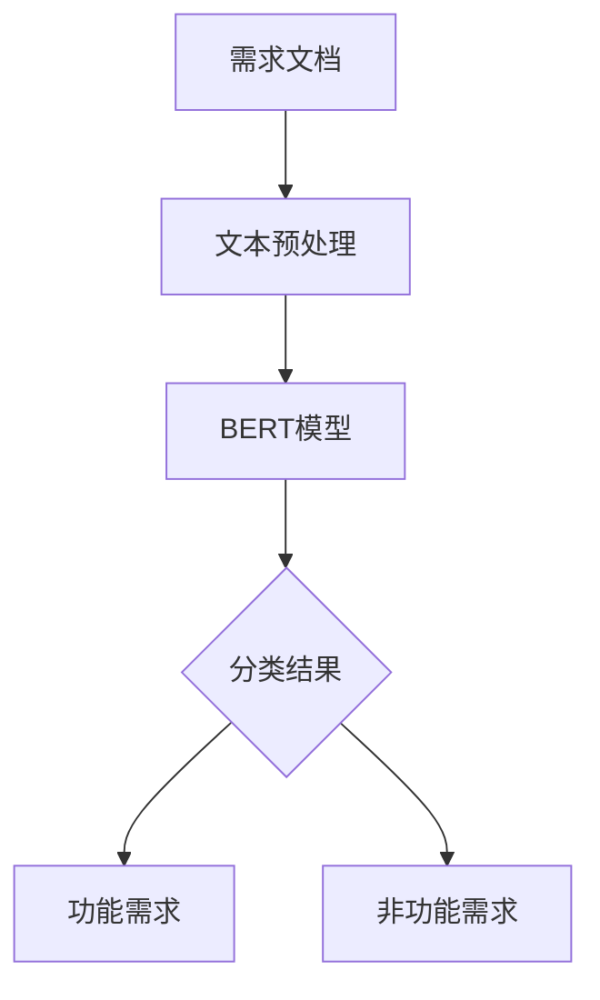
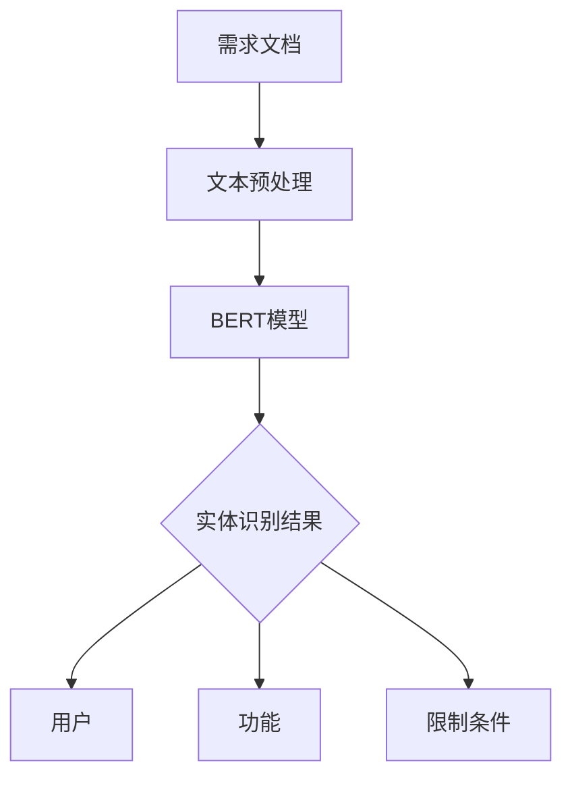
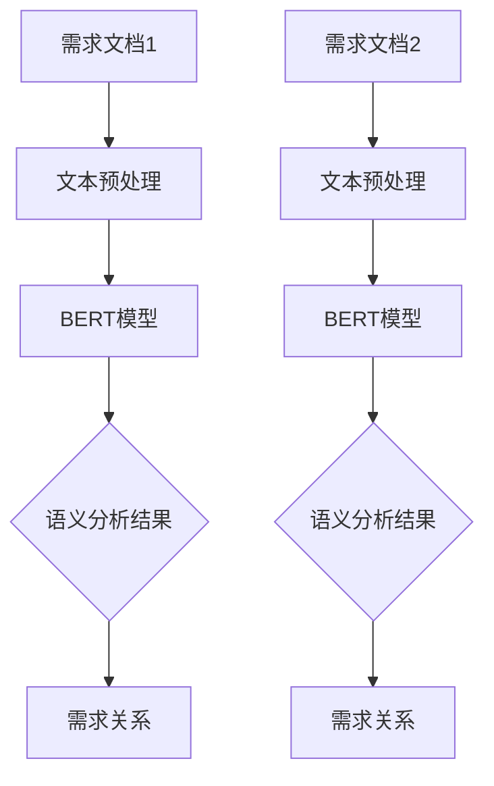
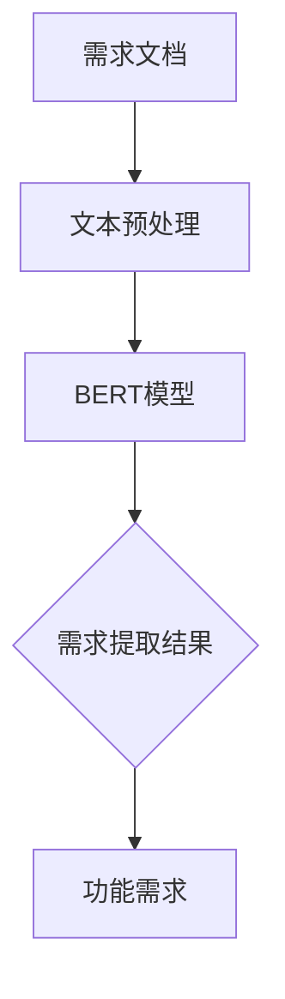
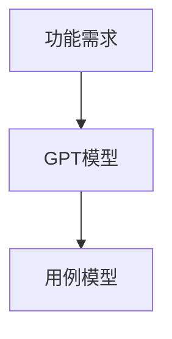
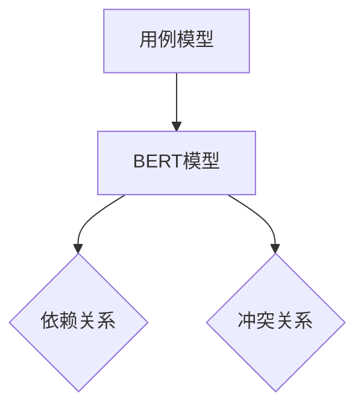
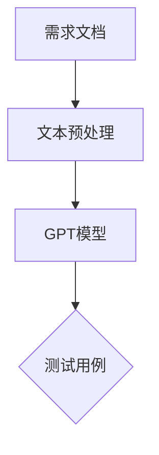
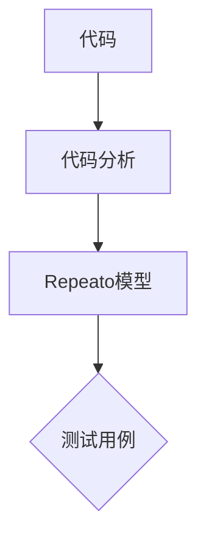
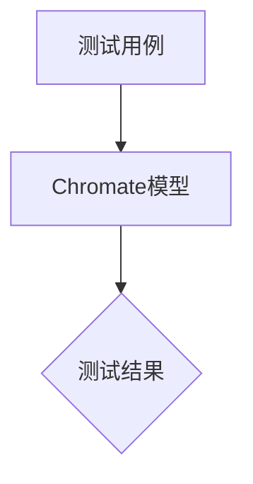
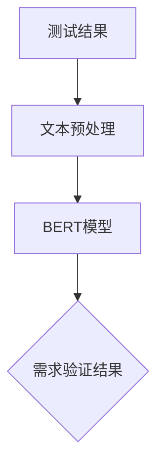

                 

# 大模型驱动的需求追踪自动化技术

## 关键词

- **大模型**：人工智能的核心技术之一，具有强大的数据处理和自适应能力。
- **需求追踪**：软件工程中的关键环节，用于确保开发活动与客户需求保持一致。
- **自动化技术**：通过计算机程序实现重复性任务的自动化，提高效率和准确性。
- **软件工程**：涉及软件设计、开发、测试和维护等各个环节，确保软件质量。
- **需求理解**、**需求分析**、**需求验证**：软件需求工程中的三个主要阶段。

> 摘要：本文将探讨大模型在需求追踪自动化中的应用，通过介绍大模型的基础理论、需求追踪自动化的挑战与解决方案，以及大模型驱动的需求追踪实现，旨在为软件开发者提供一种新的需求追踪方法，以提升软件开发的效率和质量。

## 目录大纲设计：《大模型驱动的需求追踪自动化技术》

### 第一部分：背景与概念

#### 第1章：引言

- **1.1 问题背景**：需求追踪在软件开发中的重要性，现有需求追踪方法的局限性，大模型在需求追踪中的应用潜力。
- **1.2 定义与边界**：需求追踪、大模型、需求追踪自动化的定义及其相互关系。
- **1.3 核心概念**：大模型的原理与特点，需求追踪的关键挑战，自动化需求追踪的优势。
- **1.4 概念关系图**：大模型与需求追踪的ER关系图。
- **1.5 小结**：总结本章内容，为后续章节打下基础。

### 第二部分：大模型基础

#### 第2章：大模型基础理论

- **2.1 大模型概述**：大模型的发展历程，分类，基本组成。
- **2.2 大模型原理**：神经网络基础，机器学习算法，大模型的训练与优化。
- **2.3 大模型特点**：数据处理能力，适应性，强大的表达能力。
- **2.4 大模型应用场景**：语言处理，图像识别，音频处理，需求追踪。
- **2.5 小结**：总结大模型的基础理论，为需求追踪自动化奠定基础。

### 第三部分：需求追踪自动化技术

#### 第3章：需求追踪自动化概述

- **3.1 需求追踪自动化概述**：需求追踪的过程，自动化需求追踪的优势，分类。
- **3.2 大模型在需求追踪中的应用**：大模型在需求理解，需求分析，需求验证中的应用。
- **3.3 自动化需求追踪的挑战与解决方案**：数据质量问题，需求变化管理，大模型的部署与维护。
- **3.4 小结**：总结需求追踪自动化的关键要素，为大模型驱动需求追踪提供指导。

### 第四部分：大模型驱动的需求追踪实现

#### 第4章：大模型驱动的需求理解

- **4.1 需求理解概述**：需求理解的定义，步骤。
- **4.2 大模型在需求理解中的应用**：大模型在自然语言处理，语义理解中的应用。
- **4.3 实现案例**：文本分类，实体识别的案例。
- **4.4 小结**：总结大模型在需求理解中的应用，提高需求追踪的准确性。

#### 第5章：大模型驱动的需求分析

- **5.1 需求分析概述**：需求分析的定义，步骤。
- **5.2 大模型在需求分析中的应用**：大模型在需求提取，需求建模中的应用。
- **5.3 实现案例**：需求提取，需求建模的案例。
- **5.4 小结**：总结大模型在需求分析中的应用，提升需求追踪的深度。

#### 第6章：大模型驱动的需求验证

- **6.1 需求验证概述**：需求验证的定义，步骤。
- **6.2 大模型在需求验证中的应用**：大模型在测试用例生成，测试执行中的应用。
- **6.3 实现案例**：测试用例生成，测试执行的案例。
- **6.4 小结**：总结大模型在需求验证中的应用，确保需求追踪的可靠性。

#### 第7章：大模型驱动的需求追踪系统集成

- **7.1 系统集成概述**：需求追踪系统的组成，大模型驱动的需求追踪系统架构。
- **7.2 系统集成方法**：大模型与需求追踪系统的接口设计，实现。
- **7.3 实现案例**：需求追踪系统集成，大模型驱动的需求追踪系统部署。
- **7.4 小结**：总结大模型驱动的需求追踪系统集成，为实际应用提供指导。

### 第五部分：最佳实践与展望

- **总结与展望**：大模型驱动的需求追踪技术的现状与未来发展方向。
- **最佳实践**：在实际应用中的成功经验与注意事项。
- **未来展望**：大模型在需求追踪自动化中的潜在应用与创新方向。

## 第一部分：背景与概念

### 第1章：引言

在软件工程中，需求追踪是一个至关重要的环节。它不仅确保了开发活动与客户需求的紧密一致，还保证了软件系统的可维护性和可扩展性。然而，传统的需求追踪方法往往面临着诸多挑战，如手动跟踪需求的低效性、需求的变更管理困难以及需求文档与实际开发活动之间的偏差等问题。为了解决这些问题，自动化需求追踪技术逐渐成为研究的热点。

#### 1.1 问题背景

**需求追踪在软件开发中的重要性**

需求追踪是软件工程中的核心活动之一。它不仅涉及对需求文档的维护和更新，还包括对需求实现情况、需求变更记录以及需求与实际开发活动的匹配程度的跟踪。一个有效的需求追踪系统能够帮助开发团队更好地理解客户需求，确保软件交付的质量和及时性。

**现有需求追踪方法的局限性**

尽管传统的需求追踪方法在某些方面取得了成功，但它们仍然存在一些局限性。首先，手动跟踪需求需要大量的人力和时间投入，容易导致人为错误和效率低下。其次，需求的变更管理在传统方法中往往是一个复杂且繁琐的过程，难以及时响应客户需求的变化。此外，需求文档与实际开发活动之间的脱节也常常导致项目延期和预算超支。

**大模型在需求追踪中的应用潜力**

大模型的引入为需求追踪带来了新的可能性。大模型，特别是基于深度学习的模型，具有强大的数据处理和自适应能力，能够从大量的需求数据中提取有用的信息，并对需求变化进行预测和响应。通过大模型驱动的需求追踪，可以实现自动化需求理解、分析和验证，从而提高整个软件开发过程的效率和质量。

#### 1.2 定义与边界

**需求追踪的定义**

需求追踪是一种管理方法，用于确保软件项目的需求从概念阶段到最终交付的整个生命周期中都能够得到有效管理和实现。它包括对需求文档的创建、维护、更新、跟踪和验证，以确保所有需求都被适当地理解和实现。

**大模型的定义**

大模型是指具有海量参数和强大数据处理能力的机器学习模型，如深度神经网络、生成对抗网络等。这些模型通常通过大规模数据进行训练，能够自动学习和发现数据中的复杂模式和规律。

**需求追踪自动化的定义**

需求追踪自动化是指通过计算机程序和算法实现需求追踪过程中的一部分或全部任务，从而提高效率、减少人为错误并降低成本。

**概念关系图**

下面是一个描述需求追踪、大模型和需求追踪自动化之间关系的基本ER（实体关系）图：

```mermaid
erDiagram
    DemandTracking ||--|{ Requirement } : has
    Requirement ||--|{ AutomatedDemandTracking } : tracked by
    AutomatedDemandTracking ||--|{ LargeModel } : powered by
```

#### 1.3 核心概念

**大模型的原理与特点**

大模型通常基于深度学习技术，通过多层神经网络结构来实现对数据的处理和模式识别。其主要特点包括：

1. **强大的数据处理能力**：大模型能够处理海量数据，并从中提取有价值的信息。
2. **适应性**：大模型能够根据新的数据和需求变化进行自我调整和优化。
3. **强大的表达能力**：大模型能够表达复杂的函数关系，从而在需求追踪中实现高度自动化的任务。

**需求追踪的关键挑战**

1. **数据质量问题**：需求数据的质量直接影响到需求追踪的准确性。数据缺失、不一致、不准确等问题都会影响需求追踪的效果。
2. **需求变化管理**：随着项目的进展，客户需求可能会发生变化。如何有效地管理这些需求变化，确保需求追踪的连续性和一致性，是一个重要的挑战。
3. **大模型的部署与维护**：大模型的部署需要大量的计算资源和维护成本。如何优化大模型的部署和维护，确保其在实际应用中的稳定性和高效性，也是一个关键问题。

**自动化需求追踪的优势**

1. **提高效率**：通过自动化需求追踪，可以大幅减少人工工作量，提高整个软件开发过程的效率。
2. **减少错误**：自动化需求追踪可以降低人为错误的可能性，从而提高软件交付的质量。
3. **成本节约**：自动化需求追踪可以减少对人力资源的依赖，从而节约成本。

#### 1.4 概念关系图

为了更好地理解上述核心概念之间的关系，我们可以通过一个ER图来展示：

```mermaid
erDiagram
    LargeModel ||--|{ DataProcessing } : for
    DataProcessing ||--|{ RequirementUnderstanding } : in
    RequirementUnderstanding ||--|{ RequirementAnalysis } : in
    RequirementAnalysis ||--|{ RequirementValidation } : in
    RequirementValidation ||--|{ AutomatedDemandTracking } : for
```

#### 1.5 小结

本章介绍了大模型驱动的需求追踪自动化的背景和核心概念。需求追踪在软件开发中的重要性不容忽视，而现有方法存在的局限性促使我们探索新的解决方案。大模型以其强大的数据处理能力和自适应能力，为需求追踪自动化提供了新的可能性。通过本章的介绍，我们为后续章节的内容奠定了基础。

### 第2章：大模型基础理论

#### 2.1 大模型概述

**大模型的发展历程**

大模型的概念起源于20世纪80年代的神经网络研究。随着计算能力的提升和大数据技术的发展，大模型逐渐成为人工智能研究的前沿领域。2012年，AlexNet的提出标志着深度学习在图像识别领域的突破，开启了大模型时代。此后，大模型在自然语言处理、语音识别、推荐系统等领域取得了显著的成果。

**大模型的分类**

大模型可以根据其应用领域和结构特点进行分类。常见的分类方法包括：

1. **按应用领域分类**：如计算机视觉、自然语言处理、语音识别、推荐系统等。
2. **按结构特点分类**：如深度神经网络、循环神经网络（RNN）、卷积神经网络（CNN）、生成对抗网络（GAN）等。

**大模型的基本组成**

大模型通常由以下几个基本组成部分构成：

1. **数据输入层**：接收外部数据，如文本、图像、音频等。
2. **隐藏层**：通过多层神经网络结构对输入数据进行处理和变换。
3. **输出层**：生成预测结果或决策。
4. **优化算法**：如梯度下降、随机梯度下降、Adam等，用于调整模型参数。
5. **正则化技术**：如Dropout、L1正则化、L2正则化等，用于防止过拟合。

#### 2.2 大模型原理

**神经网络基础**

神经网络是构建大模型的基础。它由大量的神经元（节点）组成，通过权重连接形成网络结构。神经元的激活函数通常为非线性函数，如Sigmoid、ReLU、Tanh等。神经网络通过前向传播和反向传播实现数据的输入和输出。

**机器学习算法**

大模型通常基于机器学习算法进行训练和优化。常见的机器学习算法包括：

1. **监督学习**：通过已标记的数据训练模型，如线性回归、逻辑回归、支持向量机等。
2. **无监督学习**：通过未标记的数据训练模型，如聚类、降维、自编码器等。
3. **半监督学习**：结合标记数据和未标记数据训练模型，如图嵌入、上下文感知等。

**大模型的训练与优化**

大模型的训练过程是一个迭代优化过程，旨在通过调整模型参数最小化损失函数。常见的训练策略包括：

1. **批量训练**：每次训练使用整个数据集，计算梯度进行参数更新。
2. **小批量训练**：每次训练使用部分数据集，减少计算量并提高训练速度。
3. **随机梯度下降（SGD）**：每次训练仅使用一个样本或少量样本，更新模型参数。
4. **Adam优化器**：结合SGD和动量方法的优化器，提高训练效率。

#### 2.3 大模型特点

**数据处理能力**

大模型具有强大的数据处理能力，能够处理海量数据和复杂的数据类型。无论是文本、图像、音频，还是多模态数据，大模型都能有效地进行特征提取和模式识别。

**适应性**

大模型具有高度的自适应能力，能够根据新的数据和需求变化进行调整和优化。通过不断训练和更新，大模型能够适应不断变化的环境和任务需求。

**强大的表达能力**

大模型通过多层神经网络结构，具有强大的函数表达能力。它能够捕捉数据中的复杂关系和规律，从而实现高精度的预测和决策。

#### 2.4 大模型应用场景

**语言处理**

大模型在自然语言处理（NLP）领域取得了显著的成果。如BERT、GPT等模型，它们能够理解自然语言的结构和语义，实现文本分类、情感分析、机器翻译等任务。

**图像识别**

大模型在计算机视觉领域具有强大的图像识别能力。通过卷积神经网络（CNN）等模型，大模型能够准确识别图像中的物体、场景和动作。

**音频处理**

大模型在音频处理领域也表现出强大的能力。如WaveNet等模型，能够生成自然流畅的语音，实现语音识别、语音合成等任务。

**需求追踪**

大模型在需求追踪中的应用前景广阔。通过大模型，可以实现自动化需求理解、分析和验证，提高整个软件开发过程的效率和质量。

#### 2.5 小结

本章介绍了大模型的基础理论，包括其发展历程、分类、基本组成以及数据处理能力、适应性和强大表达能力等。大模型作为人工智能的核心技术，具有广泛的应用场景和巨大的潜力。在下一章中，我们将进一步探讨大模型在需求追踪自动化中的应用。

### 第三部分：需求追踪自动化技术

#### 第3章：需求追踪自动化概述

**3.1 需求追踪自动化概述**

需求追踪自动化是指在软件开发过程中，通过使用计算机程序和算法来自动完成需求追踪的相关任务，以提高效率、减少人为错误和降低成本。需求追踪自动化涵盖了需求理解、需求分析、需求验证等关键环节。

**需求追踪的过程**

需求追踪是一个贯穿整个软件开发生命周期的重要过程。其主要步骤包括：

1. **需求收集**：与客户和利益相关者沟通，收集和记录需求。
2. **需求分析**：对收集到的需求进行整理、分类和分析，确保其清晰、具体且可执行。
3. **需求管理**：对需求进行版本控制、变更管理和优先级排序。
4. **需求验证**：确保需求得到正确实现，通过测试和评估来验证需求的完整性、一致性和正确性。

**自动化需求追踪的优势**

1. **提高效率**：自动化需求追踪可以大幅减少人工工作量，提高整个软件开发过程的效率。
2. **减少错误**：自动化需求追踪可以降低人为错误的可能性，从而提高软件交付的质量。
3. **成本节约**：自动化需求追踪可以减少对人力资源的依赖，从而节约成本。

**自动化需求追踪的分类**

自动化需求追踪可以分为以下几类：

1. **基于规则的方法**：通过预定义的规则来自动化需求追踪任务，如需求分类、优先级排序等。
2. **基于机器学习的方法**：利用机器学习算法来自动学习和预测需求的变化模式，如需求变化预测、测试用例生成等。
3. **基于自然语言处理的方法**：利用自然语言处理技术来自动理解和处理需求文档，如文本分类、语义分析等。

#### 3.2 大模型在需求追踪中的应用

**大模型在需求理解中的应用**

需求理解是需求追踪的第一步，主要任务是理解客户和利益相关者提出的需求，并将其转化为可执行的软件需求。大模型在需求理解中具有显著的优势：

1. **文本分类**：通过大模型，可以自动将需求文档分类，如需求类型、优先级等。
2. **实体识别**：大模型可以识别需求文档中的关键实体，如用户、功能、限制条件等。
3. **语义分析**：大模型能够理解需求文档中的语义和逻辑关系，从而更好地理解和分析需求。

**大模型在需求分析中的应用**

需求分析是对需求进行详细梳理和结构化，以确定软件系统的功能和非功能需求。大模型在需求分析中的应用主要体现在：

1. **需求提取**：大模型可以从需求文档中自动提取关键需求信息，如功能需求、非功能需求等。
2. **需求建模**：大模型可以自动构建需求模型，如用例模型、功能模型等，以便于后续的开发和测试。
3. **需求关系分析**：大模型可以分析需求之间的相互关系，如依赖关系、冲突关系等。

**大模型在需求验证中的应用**

需求验证是确保需求得到正确实现和满足的过程。大模型在需求验证中的应用主要体现在：

1. **测试用例生成**：大模型可以自动生成测试用例，以提高测试覆盖率和测试效率。
2. **测试执行**：大模型可以自动化执行测试用例，并分析测试结果，从而快速发现需求和实现之间的不一致。
3. **回归测试**：大模型可以自动化进行回归测试，确保需求变更不会影响现有功能的正确性。

**自动化需求追踪的挑战与解决方案**

尽管大模型在需求追踪自动化中具有显著的优势，但仍然面临一些挑战：

1. **数据质量问题**：需求数据的质量直接影响大模型的效果。为了解决数据质量问题，可以采取数据清洗、数据增强等技术手段。
2. **需求变化管理**：需求变化是软件开发过程中常见的现象。为了应对需求变化，可以采用需求变更管理策略，如版本控制、优先级调整等。
3. **大模型的部署与维护**：大模型的部署和维护需要一定的计算资源和专业知识。为了降低部署和维护成本，可以采用云计算、容器化等技术。

#### 3.3 自动化需求追踪的挑战与解决方案

**数据质量问题**

需求数据的质量对需求追踪的准确性至关重要。常见的数据质量问题包括数据缺失、不一致、不准确等。以下是一些解决数据质量问题的方法：

1. **数据清洗**：通过数据清洗工具和算法，去除数据中的噪声和错误，提高数据的准确性。
2. **数据增强**：通过数据增强技术，如数据扩充、数据合成等，增加数据的多样性和质量。
3. **数据集成**：将来自不同来源的数据进行整合，消除数据之间的不一致性。

**需求变化管理**

需求变化是软件开发过程中不可避免的。为了有效管理需求变化，可以采用以下策略：

1. **版本控制**：对需求文档进行版本控制，确保不同版本的需求能够得到有效管理和追踪。
2. **变更管理**：建立变更管理流程，明确变更的审批、实施和验证过程。
3. **优先级排序**：根据需求的紧急程度和重要性，对需求进行优先级排序，确保关键需求得到及时响应。

**大模型的部署与维护**

大模型的部署和维护是一个复杂的过程。以下是一些解决大模型部署和维护问题的方法：

1. **云计算**：利用云计算平台，如AWS、Azure等，提供弹性的计算资源，降低部署和维护成本。
2. **容器化**：使用容器技术，如Docker，将大模型及其依赖环境打包成容器，实现快速部署和版本管理。
3. **自动化运维**：通过自动化运维工具，如Ansible、Terraform等，实现大模型的自动化部署、监控和管理。

#### 3.4 小结

本章介绍了需求追踪自动化的概念、过程和分类，并探讨了大模型在需求追踪自动化中的应用。通过大模型，可以实现自动化需求理解、分析和验证，从而提高软件开发过程的效率和质量。然而，大模型在需求追踪自动化中仍然面临一些挑战，如数据质量问题、需求变化管理和大模型部署与维护等。为了解决这些问题，可以采用数据清洗、数据增强、版本控制、变更管理、云计算、容器化等技术和策略。

### 第四部分：大模型驱动的需求追踪实现

#### 第4章：大模型驱动的需求理解

需求理解是需求追踪的重要环节，其主要任务是理解客户和利益相关者提出的需求，并将其转化为可执行的软件需求。大模型在需求理解中具有显著的优势，能够通过自动化和智能化的方式提高需求理解的效果。

#### 4.1 需求理解概述

**需求理解的定义**

需求理解是指通过分析、推理和综合等方法，对客户和利益相关者提出的需求进行理解和解释的过程。需求理解的目的是确保开发团队能够准确理解客户的需求，并将其转化为可执行的软件需求。

**需求理解的步骤**

需求理解通常包括以下几个步骤：

1. **需求收集**：通过与客户和利益相关者进行沟通，收集和记录需求。
2. **需求分析**：对收集到的需求进行整理、分类和分析，确保其清晰、具体且可执行。
3. **需求验证**：对需求进行验证，确保其符合业务逻辑、技术实现可能性和客户期望。

#### 4.2 大模型在需求理解中的应用

**大模型在需求理解中的应用**

大模型在需求理解中具有以下应用：

1. **文本分类**：通过大模型，可以将需求文档分类，如功能需求、非功能需求等。这有助于提高需求管理的效率，便于后续的需求分析和验证。
2. **实体识别**：大模型可以识别需求文档中的关键实体，如用户、功能、限制条件等。这有助于理解需求的背景和上下文，从而更准确地分析和验证需求。
3. **语义分析**：大模型能够理解需求文档中的语义和逻辑关系，从而更好地理解和分析需求。这有助于发现需求之间的潜在关系和冲突，提高需求的质量。

**具体应用示例**

以下是一个具体的示例，展示了大模型在需求理解中的应用：

**案例一：文本分类**

假设有一个包含不同类型需求的需求文档，我们需要将其分类为功能需求和非功能需求。我们可以使用一个大模型，如BERT，来对需求文档进行文本分类。



在这个示例中，需求文档经过文本预处理后输入到BERT模型中，模型输出分类结果，将其分类为功能需求或非功能需求。通过这种方式，我们可以自动化地处理大量需求文档，提高需求理解的效率。

**案例二：实体识别**

假设有一个需求文档，我们需要识别其中的关键实体，如用户、功能、限制条件等。我们可以使用一个大模型，如BERT，来对需求文档进行实体识别。



在这个示例中，需求文档经过文本预处理后输入到BERT模型中，模型输出实体识别结果，识别出需求文档中的关键实体。通过这种方式，我们可以自动化地理解和分析需求文档，提高需求追踪的准确性。

**案例三：语义分析**

假设有两个需求文档，我们需要分析它们之间的语义关系，如是否冲突、是否相互依赖等。我们可以使用一个大模型，如BERT，来对需求文档进行语义分析。



在这个示例中，两个需求文档分别经过文本预处理后输入到BERT模型中，模型输出语义分析结果，分析出需求文档之间的语义关系。通过这种方式，我们可以自动化地识别需求之间的潜在关系和冲突，提高需求管理的质量。

#### 4.3 实现案例

**案例一：文本分类**

在这个案例中，我们将使用BERT模型对需求文档进行文本分类。具体实现步骤如下：

1. **数据准备**：收集包含不同类型需求的需求文档，并将其标记为功能需求或非功能需求。
2. **文本预处理**：对需求文档进行预处理，包括分词、去停用词、词干提取等。
3. **模型训练**：使用预训练的BERT模型，对预处理后的需求文档进行训练，以学习如何分类需求文档。
4. **模型评估**：使用测试集对训练好的模型进行评估，以验证其分类效果。
5. **模型部署**：将训练好的模型部署到生产环境中，用于自动化处理需求文档。

**案例二：实体识别**

在这个案例中，我们将使用BERT模型对需求文档进行实体识别。具体实现步骤如下：

1. **数据准备**：收集包含不同类型需求的需求文档，并将其标记为关键实体。
2. **文本预处理**：对需求文档进行预处理，包括分词、去停用词、词干提取等。
3. **模型训练**：使用预训练的BERT模型，对预处理后的需求文档进行训练，以学习如何识别需求文档中的关键实体。
4. **模型评估**：使用测试集对训练好的模型进行评估，以验证其识别效果。
5. **模型部署**：将训练好的模型部署到生产环境中，用于自动化识别需求文档中的关键实体。

**案例三：语义分析**

在这个案例中，我们将使用BERT模型对需求文档进行语义分析，以识别需求文档之间的语义关系。具体实现步骤如下：

1. **数据准备**：收集包含不同类型需求的需求文档，并将其标记为相互依赖或冲突。
2. **文本预处理**：对需求文档进行预处理，包括分词、去停用词、词干提取等。
3. **模型训练**：使用预训练的BERT模型，对预处理后的需求文档进行训练，以学习如何分析需求文档之间的语义关系。
4. **模型评估**：使用测试集对训练好的模型进行评估，以验证其分析效果。
5. **模型部署**：将训练好的模型部署到生产环境中，用于自动化分析需求文档之间的语义关系。

#### 4.4 小结

本章介绍了大模型在需求理解中的应用，包括文本分类、实体识别和语义分析。通过大模型的自动化和智能化处理，需求理解过程变得更加高效和准确。具体实现案例展示了如何使用大模型来自动化处理需求文档，从而提高需求追踪的质量和效率。

### 第5章：大模型驱动的需求分析

#### 5.1 需求分析概述

需求分析是软件需求工程中的一个关键环节，其主要任务是通过对用户需求进行详细的整理和分析，确定软件系统的功能、性能、接口等需求，并为后续的设计和开发提供基础。需求分析不仅影响软件项目的成功与否，还直接关系到软件系统的质量、成本和交付时间。

**需求分析的定义**

需求分析是指对用户需求进行理解和整理，以确定软件系统的功能、性能、接口和其他特征的过程。它包括以下几个主要步骤：

1. **需求收集**：通过与用户和其他利益相关者进行沟通，收集和记录需求。
2. **需求整理**：对收集到的需求进行分类、整理和归纳，确保需求的清晰性和一致性。
3. **需求验证**：对整理后的需求进行验证，确保其正确性和完整性。

**需求分析的步骤**

需求分析通常包括以下几个步骤：

1. **需求收集**：通过与用户和其他利益相关者进行沟通，了解他们的需求和期望。这个过程可以通过访谈、问卷调查、用户观察等方式进行。
2. **需求整理**：对收集到的需求进行分类、整理和归纳，确保每个需求都是明确、具体和可执行的。
3. **需求模型建立**：使用需求模型（如用例模型、功能模型等）对需求进行结构化表示，以便于后续的分析和设计。
4. **需求验证**：通过评审、验证和确认等活动，确保需求的正确性和完整性。
5. **需求管理**：对需求进行版本控制、变更管理和优先级排序，确保需求得到有效管理。

#### 5.2 大模型在需求分析中的应用

**大模型在需求分析中的应用**

大模型在需求分析中具有广泛的应用，能够提高需求分析的效率和准确性。以下是几种典型应用：

1. **需求提取**：大模型可以从大量文本数据中自动提取出有价值的需求信息，如功能需求、非功能需求等。
2. **需求建模**：大模型可以自动生成需求模型，如用例模型、功能模型等，帮助开发团队更好地理解需求。
3. **需求关系分析**：大模型可以分析需求之间的关系，如依赖关系、冲突关系等，帮助开发团队更好地管理和控制需求。

**具体应用示例**

以下是一个具体的示例，展示了大模型在需求分析中的应用：

**案例一：需求提取**

假设有一个包含大量文本需求的需求文档，我们需要从中提取出功能需求。我们可以使用一个大模型，如BERT，来对需求文档进行需求提取。



在这个示例中，需求文档经过文本预处理后输入到BERT模型中，模型输出需求提取结果，识别出需求文档中的功能需求。通过这种方式，我们可以自动化地处理大量需求文档，提高需求分析的效率。

**案例二：需求建模**

假设我们已经提取出了功能需求，我们需要将其转化为用例模型。我们可以使用一个大模型，如GPT，来自动生成用例模型。



在这个示例中，功能需求输入到GPT模型中，模型自动生成用例模型，将需求转化为结构化的需求模型。通过这种方式，我们可以自动化地生成需求模型，提高需求分析的效果。

**案例三：需求关系分析**

假设我们已经有了用例模型，我们需要分析用例之间的依赖关系和冲突关系。我们可以使用一个大模型，如BERT，来对用例模型进行关系分析。



在这个示例中，用例模型输入到BERT模型中，模型输出用例之间的依赖关系和冲突关系。通过这种方式，我们可以自动化地分析需求之间的关系，提高需求管理的质量。

#### 5.3 实现案例

**案例一：需求提取**

在这个案例中，我们将使用BERT模型对需求文档进行需求提取。具体实现步骤如下：

1. **数据准备**：收集包含不同类型需求的需求文档。
2. **文本预处理**：对需求文档进行预处理，包括分词、去停用词、词干提取等。
3. **模型训练**：使用预训练的BERT模型，对预处理后的需求文档进行训练，以学习如何提取需求信息。
4. **模型评估**：使用测试集对训练好的模型进行评估，以验证其提取效果。
5. **模型部署**：将训练好的模型部署到生产环境中，用于自动化提取需求信息。

**案例二：需求建模**

在这个案例中，我们将使用GPT模型对提取出的功能需求进行需求建模。具体实现步骤如下：

1. **数据准备**：收集提取出的功能需求。
2. **模型训练**：使用预训练的GPT模型，对功能需求进行训练，以学习如何生成用例模型。
3. **模型评估**：使用测试集对训练好的模型进行评估，以验证其生成效果。
4. **模型部署**：将训练好的模型部署到生产环境中，用于自动化生成用例模型。

**案例三：需求关系分析**

在这个案例中，我们将使用BERT模型对用例模型进行需求关系分析。具体实现步骤如下：

1. **数据准备**：收集用例模型。
2. **模型训练**：使用预训练的BERT模型，对用例模型进行训练，以学习如何分析需求关系。
3. **模型评估**：使用测试集对训练好的模型进行评估，以验证其分析效果。
4. **模型部署**：将训练好的模型部署到生产环境中，用于自动化分析需求关系。

#### 5.4 小结

本章介绍了大模型在需求分析中的应用，包括需求提取、需求建模和需求关系分析。通过大模型的自动化和智能化处理，需求分析过程变得更加高效和准确。具体实现案例展示了如何使用大模型来自动化处理需求文档，从而提高需求分析的质量和效率。

### 第6章：大模型驱动的需求验证

#### 6.1 需求验证概述

需求验证是确保软件需求得到正确理解和实现的最后一道防线。其目的是通过一系列的测试和评估活动，验证需求是否满足既定的质量标准。需求验证通常包括以下几个关键环节：

**需求验证的定义**

需求验证是指通过检查、测试和评估等方法，确保需求被正确理解和实现，从而满足用户和利益相关者的期望。

**需求验证的步骤**

需求验证通常包括以下步骤：

1. **测试用例设计**：根据需求规格说明书，设计出能够覆盖所有需求场景的测试用例。
2. **测试执行**：执行测试用例，检查需求是否按照预期工作。
3. **结果分析**：分析测试执行的结果，确定需求是否得到满足。
4. **缺陷报告**：记录测试过程中发现的缺陷，并进行跟踪和修复。

**需求验证的重要性**

需求验证在软件开发过程中具有重要意义，它能够：

1. **确保需求质量**：通过验证需求是否满足预期，确保软件系统的质量。
2. **减少风险**：通过提前发现和解决需求中的问题，降低项目风险。
3. **提高客户满意度**：确保软件系统能够满足客户的期望，提高客户满意度。

#### 6.2 大模型在需求验证中的应用

大模型在需求验证中的应用主要在于自动化测试用例生成和测试执行，从而提高验证的效率和质量。

**大模型在测试用例生成中的应用**

大模型可以通过学习历史测试数据和需求文档，自动生成测试用例。这种方法能够大幅减少人工编写测试用例的工作量，并且提高测试用例的覆盖率和有效性。

**具体应用示例**

**案例一：基于需求文档的测试用例生成**

假设有一个需求文档，我们需要根据该文档生成测试用例。我们可以使用一个大模型，如GPT，来生成测试用例。



在这个示例中，需求文档经过文本预处理后输入到GPT模型中，模型输出测试用例。通过这种方式，我们可以自动化地生成测试用例，提高测试效率。

**案例二：基于代码的测试用例生成**

假设我们已经有了部分代码实现，我们需要根据代码生成测试用例。我们可以使用一个大模型，如Repeato，来生成测试用例。



在这个示例中，代码经过分析后输入到Repeato模型中，模型输出测试用例。通过这种方式，我们可以自动化地生成测试用例，提高测试覆盖率。

**大模型在测试执行中的应用**

大模型不仅可以生成测试用例，还可以在测试执行过程中发挥重要作用，如自动化执行测试用例、分析测试结果等。

**具体应用示例**

**案例一：自动化测试执行**

假设我们已经有了测试用例，我们需要自动化执行这些测试用例。我们可以使用一个大模型，如Chromate，来自动化测试执行。



在这个示例中，测试用例输入到Chromate模型中，模型自动化执行测试，并输出测试结果。通过这种方式，我们可以自动化地执行测试，提高测试效率。

**案例二：测试结果分析**

假设我们已经执行了测试用例，我们需要分析测试结果以确定需求是否得到满足。我们可以使用一个大模型，如BERT，来分析测试结果。



在这个示例中，测试结果经过文本预处理后输入到BERT模型中，模型输出需求验证结果。通过这种方式，我们可以自动化地分析测试结果，提高需求验证的准确性。

#### 6.3 实现案例

**案例一：基于需求文档的测试用例生成**

在这个案例中，我们将使用GPT模型来生成基于需求文档的测试用例。具体实现步骤如下：

1. **数据准备**：收集包含不同类型需求的需求文档。
2. **文本预处理**：对需求文档进行预处理，包括分词、去停用词、词干提取等。
3. **模型训练**：使用预训练的GPT模型，对预处理后的需求文档进行训练，以学习如何生成测试用例。
4. **模型评估**：使用测试集对训练好的模型进行评估，以验证其生成效果。
5. **模型部署**：将训练好的模型部署到生产环境中，用于自动化生成测试用例。

**案例二：基于代码的测试用例生成**

在这个案例中，我们将使用Repeato模型来生成基于代码的测试用例。具体实现步骤如下：

1. **数据准备**：收集已实现的代码。
2. **代码分析**：对代码进行分析，提取关键功能和模块。
3. **模型训练**：使用预训练的Repeato模型，对代码进行分析，以学习如何生成测试用例。
4. **模型评估**：使用测试集对训练好的模型进行评估，以验证其生成效果。
5. **模型部署**：将训练好的模型部署到生产环境中，用于自动化生成测试用例。

**案例三：自动化测试执行**

在这个案例中，我们将使用Chromate模型来自动化测试执行。具体实现步骤如下：

1. **数据准备**：收集测试用例。
2. **模型训练**：使用预训练的Chromate模型，对测试用例进行自动化执行。
3. **模型评估**：使用测试集对训练好的模型进行评估，以验证其执行效果。
4. **模型部署**：将训练好的模型部署到生产环境中，用于自动化测试执行。

**案例四：测试结果分析**

在这个案例中，我们将使用BERT模型来分析测试结果。具体实现步骤如下：

1. **数据准备**：收集测试结果。
2. **文本预处理**：对测试结果进行预处理，包括分词、去停用词、词干提取等。
3. **模型训练**：使用预训练的BERT模型，对预处理后的测试结果进行训练，以学习如何分析需求验证结果。
4. **模型评估**：使用测试集对训练好的模型进行评估，以验证其分析效果。
5. **模型部署**：将训练好的模型部署到生产环境中，用于自动化分析测试结果。

#### 6.4 小结

本章介绍了大模型在需求验证中的应用，包括测试用例生成、测试执行和测试结果分析。通过大模型的自动化和智能化处理，需求验证过程变得更加高效和准确。具体实现案例展示了如何使用大模型来自动化和智能化地处理需求验证任务，从而提高需求验证的质量和效率。

### 第7章：大模型驱动的需求追踪系统集成

#### 7.1 系统集成概述

在软件工程中，需求追踪系统的集成是一个复杂且关键的过程。大模型驱动的需求追踪系统集成旨在将大模型技术与传统需求追踪系统无缝结合，以实现自动化和智能化的需求管理。本章节将详细介绍需求追踪系统的组成、大模型驱动的需求追踪系统架构、系统集成方法和实现案例。

**需求追踪系统的组成**

需求追踪系统通常包括以下几个关键组件：

1. **需求管理模块**：负责收集、记录、存储和管理需求。
2. **需求分析模块**：对需求进行分类、整理、分析和建模。
3. **需求验证模块**：通过测试和评估活动确保需求得到正确实现。
4. **用户界面**：提供用户交互界面，方便用户操作和管理需求。
5. **集成接口**：与其他系统集成，如项目管理工具、代码库、测试工具等。

**大模型驱动的需求追踪系统架构**

大模型驱动的需求追踪系统架构通常包括以下几个核心部分：

1. **数据输入层**：接收来自需求管理模块的需求数据。
2. **数据处理层**：利用大模型对需求数据进行处理和分析，如文本分类、实体识别、语义分析等。
3. **结果输出层**：将处理结果反馈给需求分析模块和需求验证模块，实现自动化需求理解、分析和验证。
4. **集成接口**：与需求追踪系统其他模块和其他系统集成，确保数据的流通和系统的协同工作。

#### 7.2 系统集成方法

**大模型与需求追踪系统的接口设计**

接口设计是系统集成的重要环节，它确保大模型能够与需求追踪系统无缝集成。以下是一些关键接口设计要点：

1. **数据接口**：设计统一的数据格式和数据传输协议，确保大模型能够读取和处理需求数据。
2. **功能接口**：设计大模型与需求分析模块、需求验证模块的交互接口，确保大模型的功能能够被有效调用和利用。
3. **消息接口**：设计消息传递机制，如API调用、Webhook等，确保大模型与需求追踪系统之间的实时通信和数据同步。

**大模型驱动的需求追踪系统实现**

实现大模型驱动的需求追踪系统涉及以下几个关键步骤：

1. **需求定义**：明确需求追踪系统的功能需求和技术要求。
2. **大模型选择**：根据需求追踪任务的特点选择合适的大模型，如BERT、GPT、Repeato等。
3. **模型训练**：使用历史需求和测试数据对大模型进行训练和优化，提高其准确性和鲁棒性。
4. **系统集成**：将训练好的大模型集成到需求追踪系统中，确保系统能够自动化处理需求。
5. **系统测试**：对集成后的系统进行功能测试和性能测试，确保系统稳定可靠。

**实现案例**

**案例一：需求追踪系统集成**

在这个案例中，我们将一个基于BERT的文本分类模型集成到一个现有的需求追踪系统中。具体实现步骤如下：

1. **数据准备**：收集并整理需求文档数据。
2. **文本预处理**：对需求文档进行分词、去停用词、词干提取等预处理操作。
3. **模型训练**：使用预处理后的数据对BERT模型进行训练。
4. **接口设计**：设计数据接口和功能接口，确保BERT模型能够与需求追踪系统的需求管理模块交互。
5. **系统集成**：将训练好的BERT模型集成到需求追踪系统中，实现自动化需求分类。
6. **系统测试**：对集成后的系统进行功能测试，确保其能够正确处理需求文档。

**案例二：大模型驱动的需求追踪系统部署**

在这个案例中，我们将一个基于GPT的需求分析系统部署到生产环境中。具体实现步骤如下：

1. **需求定义**：明确需求分析系统的功能需求和技术要求。
2. **大模型选择**：选择GPT模型作为需求分析的核心。
3. **模型训练**：使用历史需求和测试数据对GPT模型进行训练。
4. **部署环境准备**：准备生产环境，包括计算资源、存储和网络配置。
5. **系统集成**：将训练好的GPT模型集成到需求追踪系统中，确保系统能够自动化处理需求。
6. **部署和监控**：将集成后的系统部署到生产环境中，并进行实时监控和性能调优。

#### 7.3 实现案例

**案例一：需求追踪系统集成**

在这个案例中，我们假设有一个现有的需求追踪系统，我们希望集成一个基于BERT的文本分类模型。以下是具体的实现步骤：

1. **数据准备**：收集包含不同类型需求的需求文档，并将其标记为功能需求或非功能需求。
2. **文本预处理**：对需求文档进行预处理，包括分词、去停用词、词干提取等。
3. **模型训练**：使用预处理后的数据对BERT模型进行训练，以学习如何分类需求文档。
4. **接口设计**：设计数据接口和功能接口，确保BERT模型能够与需求追踪系统的需求管理模块交互。
5. **系统集成**：将训练好的BERT模型集成到需求追踪系统中，实现自动化需求分类功能。
6. **系统测试**：对集成后的系统进行功能测试，确保其能够正确处理需求文档。

**案例二：大模型驱动的需求追踪系统部署**

在这个案例中，我们假设已经开发完成一个大模型驱动的需求追踪系统，现在需要将其部署到生产环境中。以下是具体的实现步骤：

1. **需求定义**：明确需求追踪系统的功能需求和技术要求，如文本分类、实体识别、语义分析等。
2. **大模型选择**：根据需求分析任务的特点选择合适的大模型，如BERT、GPT、Repeato等。
3. **模型训练**：使用历史需求和测试数据对大模型进行训练，以优化其性能。
4. **部署环境准备**：准备生产环境，包括计算资源、存储和网络配置。
5. **系统集成**：将训练好的大模型集成到需求追踪系统中，确保系统能够自动化处理需求。
6. **部署和监控**：将集成后的系统部署到生产环境中，并进行实时监控和性能调优，确保系统的稳定运行。

#### 7.4 小结

本章详细介绍了大模型驱动的需求追踪系统集成的方法和实现案例。通过设计合理的数据接口和功能接口，以及有效的系统集成和测试，大模型能够与需求追踪系统无缝结合，实现自动化和智能化的需求管理。具体实现案例展示了如何在实际项目中应用大模型技术，从而提高需求追踪的效率和准确性。

### 第五部分：最佳实践与展望

#### 总结与展望

本文系统地介绍了大模型驱动的需求追踪自动化技术，探讨了其在需求理解、需求分析、需求验证等环节中的应用。通过大模型，我们可以实现自动化需求理解、分析和验证，从而提高软件开发过程的效率和质量。以下是本文的主要结论：

1. **大模型的强大能力**：大模型具有强大的数据处理和自适应能力，能够处理海量数据，并从数据中提取有用信息。
2. **需求追踪自动化的重要性**：自动化需求追踪可以大幅提高开发效率，减少人为错误，降低成本。
3. **大模型在需求追踪中的应用**：通过文本分类、实体识别、语义分析等技术，大模型能够提高需求理解、分析和验证的准确性。
4. **面临的挑战与解决方案**：尽管大模型在需求追踪自动化中具有巨大潜力，但仍面临数据质量、需求变化管理和部署与维护等挑战。通过数据清洗、需求变更管理、云计算和容器化等技术，可以解决这些问题。

#### 最佳实践

在实际应用大模型驱动的需求追踪自动化技术时，以下是一些最佳实践：

1. **数据准备和预处理**：确保数据质量是关键。对需求文档进行充分的数据清洗、数据增强和标准化处理。
2. **模型选择与训练**：根据需求追踪任务的特点选择合适的大模型，并进行充分的训练和优化。
3. **系统集成与接口设计**：设计良好的数据接口和功能接口，确保大模型能够与需求追踪系统无缝集成。
4. **测试与验证**：对集成后的系统进行全面的测试和验证，确保其稳定性和性能。
5. **持续优化**：通过不断收集反馈数据和性能数据，对大模型进行持续优化和更新。

#### 未来展望

大模型驱动的需求追踪自动化技术在未来仍有很大的发展空间：

1. **模型多样化**：随着技术的进步，更多的模型（如多模态模型、迁移学习模型等）将被应用到需求追踪中。
2. **自动化程度提升**：通过集成更多自动化工具和技术，需求追踪的自动化程度将进一步提升。
3. **多语言支持**：随着全球化的推进，多语言需求追踪将变得更加重要，大模型将需要支持更多的语言。
4. **可解释性增强**：提高大模型的可解释性，使其决策过程更加透明，从而增强用户对自动化需求的信任。
5. **智能化需求预测**：通过大模型，实现更智能的需求预测和规划，从而更好地应对需求变化和市场动态。

总之，大模型驱动的需求追踪自动化技术为软件开发带来了新的机遇和挑战。通过不断探索和实践，我们有望实现更加高效、准确和智能的软件开发过程。

