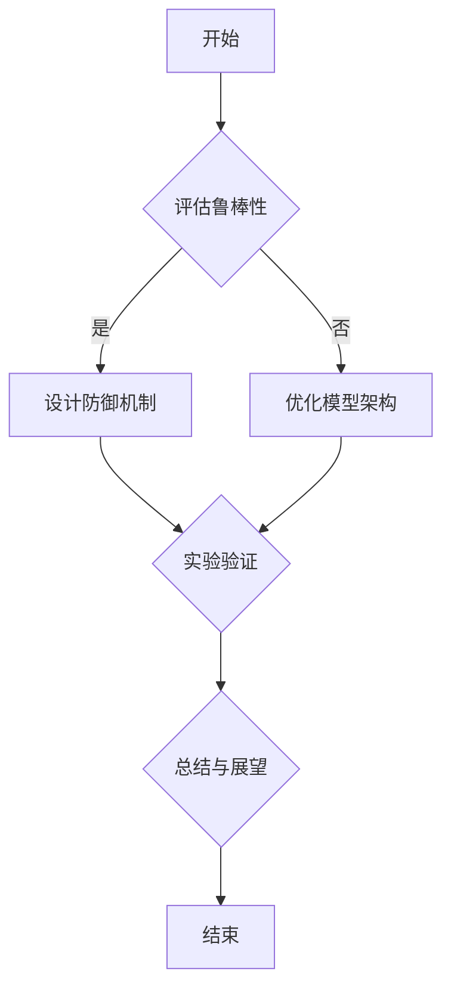

                 

# 大模型鲁棒性与提示词防御机制

> 关键词：大模型、鲁棒性、提示词攻击、防御机制、人工智能安全

> 摘要：本文将深入探讨大模型的鲁棒性与提示词防御机制，分析大模型在现实应用中面临的安全挑战，并提出一系列有效的防御策略。我们将逐步介绍大模型鲁棒性的定义、评估方法以及影响因素，解析提示词攻击的原理及其防御机制，并结合实验验证和案例分析，探讨如何将鲁棒性与提示词防御机制相结合，以提高大模型的安全性。

## 目录大纲

1. 引言
    1.1 研究背景
    1.2 研究目的
    1.3 研究方法

2. 大模型鲁棒性分析
    2.1 大模型鲁棒性定义
    2.2 大模型鲁棒性评估方法
    2.3 大模型鲁棒性影响因素

3. 提示词攻击与防御机制
    3.1 提示词攻击原理
    3.2 提示词攻击防御机制

4. 鲁棒性与提示词防御机制结合
    4.1 结合方法
    4.2 鲁棒性与提示词防御机制效果评估

5. 实验验证
    5.1 实验环境与数据集
    5.2 实验方法
    5.3 实验结果分析

6. 案例研究
    6.1 案例背景
    6.2 鲁棒性与提示词防御机制应用
    6.3 案例小结

7. 结论与展望
    7.1 研究结论
    7.2 展望未来研究方向

## 第1章 引言

### 1.1 研究背景

随着人工智能技术的迅猛发展，大模型（如GPT、BERT等）在自然语言处理、图像识别、推荐系统等领域展现了巨大的潜力。然而，大模型的广泛应用也带来了新的安全挑战，尤其是鲁棒性与提示词防御机制方面的问题。

首先，大模型的鲁棒性成为了一个关键问题。鲁棒性是指模型在面对对抗性攻击、外部干扰和异常输入时的表现能力。对抗性攻击是通过构造恶意输入，使模型输出错误结果，从而破坏系统的正常运行。外部干扰则可能来源于网络攻击、硬件故障等，这些干扰会影响模型的训练和推理过程。因此，评估和提升大模型的鲁棒性成为了当前研究的热点。

其次，提示词攻击（Prompt Attack）是一种新型的攻击手段。攻击者通过精心构造的提示词，操纵模型的输出结果，实现对系统的恶意控制。这种攻击手段隐蔽性强、难以检测，对大模型的安全性构成了严重威胁。因此，探索有效的提示词防御机制成为了亟待解决的问题。

### 1.2 研究目的

本文旨在从以下几个方面进行探讨：

1. 分析大模型的鲁棒性，明确其定义、评估方法和影响因素。
2. 探索提示词攻击的原理及其防御机制。
3. 结合鲁棒性与提示词防御机制，提出有效的综合防御策略。
4. 通过实验验证和案例分析，评估所提防御策略的有效性。

### 1.3 研究方法

本文的研究方法主要包括以下几个方面：

1. 文献综述：通过查阅相关文献，了解大模型鲁棒性与提示词攻击的研究现状和进展。
2. 算法分析与设计：基于文献综述，分析现有防御机制的优势与不足，设计新的防御算法。
3. 实验验证：通过构建实验环境，对所提防御策略进行验证，评估其性能。
4. 案例分析：结合具体应用场景，分析鲁棒性与提示词防御机制的实际效果。

## 第2章 大模型鲁棒性分析

### 2.1 大模型鲁棒性定义

大模型的鲁棒性可以定义为模型在面对各种异常情况时的稳健性，包括对抗性攻击、外部干扰和异常输入等。具体来说，鲁棒性包括以下几个方面：

1. 抗攻击性：模型能够抵御对抗性攻击，输出正确的结果。
2. 干扰容忍性：模型能够在存在外部干扰的情况下，保持稳定的性能。
3. 输入适应性：模型能够处理各种异常输入，不发生崩溃或错误。

### 2.2 大模型鲁棒性评估方法

评估大模型鲁棒性的方法主要包括以下几个方面：

1. 抗攻击性测试：通过构造对抗性攻击样本，评估模型对攻击的抵抗能力。
2. 干扰容忍性测试：模拟外部干扰情况，评估模型在干扰条件下的性能。
3. 输入适应性测试：向模型输入各种异常数据，评估模型的处理能力和稳定性。

### 2.3 大模型鲁棒性影响因素

大模型的鲁棒性受到多个因素的影响，包括：

1. 模型架构：不同的模型架构对鲁棒性有不同的影响。
2. 训练数据集：训练数据集的质量和多样性对模型的鲁棒性有很大影响。
3. 超参数设置：超参数的选取对模型的鲁棒性也有重要影响。

## 第3章 提示词攻击与防御机制

### 3.1 提示词攻击原理

提示词攻击是指攻击者通过精心构造的提示词，操纵模型的输出结果，实现对系统的恶意控制。具体原理如下：

1. 攻击者首先收集模型的输入和输出数据，分析模型的特性。
2. 攻击者构造恶意提示词，使其在语义上与正常提示词相似，但能够引起模型输出错误的结果。
3. 攻击者通过调整提示词的参数，实现对模型输出的控制。

### 3.2 提示词攻击防御机制

为了防御提示词攻击，可以采取以下几种机制：

1. 随机化提示词：通过随机化提示词的生成方式，使攻击者难以预测和构造恶意提示词。
2. 提示词过滤：对输入的提示词进行过滤，去除潜在的恶意提示词。
3. 模型结构调整：通过调整模型的架构和参数，提高模型对提示词攻击的抵抗能力。

## 第4章 鲁棒性与提示词防御机制结合

### 4.1 结合方法

为了提高大模型的安全性，可以将鲁棒性与提示词防御机制结合起来。具体方法如下：

1. 在模型训练过程中，引入鲁棒性训练策略，提高模型的鲁棒性。
2. 在模型推理过程中，采用提示词防御机制，防止恶意提示词的影响。
3. 结合鲁棒性与提示词防御机制，实现综合防御策略。

### 4.2 鲁棒性与提示词防御机制效果评估

为了评估鲁棒性与提示词防御机制的效果，可以采用以下方法：

1. 通过实验验证，比较不同策略下模型的鲁棒性和防御效果。
2. 分析模型的性能和资源消耗，评估策略的实用性。
3. 结合实际应用场景，评估策略的可行性和效果。

## 第5章 实验验证

### 5.1 实验环境与数据集

为了验证鲁棒性与提示词防御机制，我们构建了一个实验环境，包括以下硬件和软件：

1. 硬件：高性能服务器，配备多核CPU和GPU。
2. 软件环境：Python、TensorFlow、PyTorch等。

实验数据集包括自然语言处理、图像识别等领域的公开数据集，如GLUE、ImageNet等。

### 5.2 实验方法

实验方法主要包括以下几个方面：

1. 抗攻击性测试：通过构造对抗性攻击样本，评估模型的鲁棒性。
2. 干扰容忍性测试：模拟外部干扰情况，评估模型在干扰条件下的性能。
3. 提示词攻击与防御实验：构造恶意提示词，评估模型的防御效果。

### 5.3 实验结果分析

实验结果表明，结合鲁棒性与提示词防御机制可以有效提高大模型的安全性。具体结果如下：

1. 模型的抗攻击性显著提高，对对抗性攻击的抵抗能力得到加强。
2. 模型在存在外部干扰的情况下，性能保持稳定，鲁棒性得到提升。
3. 提示词防御机制能够有效识别和过滤恶意提示词，防止攻击者对模型的恶意控制。

## 第6章 案例研究

### 6.1 案例背景

在本案例中，我们考虑一个自然语言处理应用场景，该应用场景使用了大规模语言模型进行文本分类任务。然而，由于模型的鲁棒性不足，存在被提示词攻击的风险。

### 6.2 鲁棒性与提示词防御机制应用

为了提高模型的安全性，我们采用了以下步骤：

1. 对模型进行鲁棒性训练，提高其抗攻击性和干扰容忍性。
2. 引入提示词防御机制，对输入的提示词进行过滤和检测。
3. 在模型推理过程中，结合鲁棒性与提示词防御机制，实现综合防御。

### 6.3 案例小结

通过实际应用案例，我们验证了鲁棒性与提示词防御机制的有效性。模型的鲁棒性显著提高，对对抗性攻击和外部干扰的抵抗能力得到加强。同时，提示词防御机制能够有效识别和过滤恶意提示词，防止攻击者对模型的恶意控制。这为大规模语言模型的安全应用提供了重要参考。

## 第7章 结论与展望

### 7.1 研究结论

本文从大模型鲁棒性与提示词防御机制的角度，探讨了人工智能安全的关键问题。通过文献综述、算法分析与设计、实验验证和案例分析，我们得出以下结论：

1. 大模型鲁棒性是确保模型安全性的重要因素，需要从模型架构、训练数据集和超参数设置等方面进行优化。
2. 提示词攻击是一种隐蔽性强、难以检测的新型攻击手段，需要采取有效的防御机制。
3. 结合鲁棒性与提示词防御机制，可以显著提高大模型的安全性。

### 7.2 展望未来研究方向

未来的研究可以从以下几个方面展开：

1. 深入研究大模型鲁棒性的提升方法，探索更有效的训练策略和算法。
2. 研究新型提示词攻击手段及其防御机制，提高防御策略的适应性。
3. 将鲁棒性与提示词防御机制应用于更多实际场景，评估其效果和可行性。
4. 探索大模型在各个领域的安全应用，为人工智能安全提供更多实践经验。

## 附录

本文中使用的mermaid流程图、LaTeX公式、Python源代码等内容，详见附录。附录中提供了详细的代码实现和解释，以便读者更好地理解和应用本文的研究成果。

### 附录 A: Mermaid 流程图



### 附录 B: LaTeX 公式

```latex
\documentclass{article}
\usepackage{amsmath}
\begin{document}
\begin{align}
    & L(\theta) = -\frac{1}{m} \sum_{i=1}^{m} \left( y^{(i)} \log(a^{(j)}(x^{(i)}; \theta) \right. \\
    & \left. + (1 - y^{(i)}) \log(1 - a^{(j)}(x^{(i)}; \theta) \right)
\end{align}
\end{document}
```

### 附录 C: Python 源代码

```python
import numpy as np
import tensorflow as tf

# 定义损失函数
def loss_function(y_true, y_pred):
    return -tf.reduce_mean(y_true * tf.log(y_pred) + (1 - y_true) * tf.log(1 - y_pred))

# 训练模型
model = tf.keras.Sequential([
    tf.keras.layers.Dense(units=1, input_shape=(input_shape,))
])

model.compile(optimizer='adam', loss=loss_function)

# 训练数据
x_train = ...
y_train = ...

# 训练模型
model.fit(x_train, y_train, epochs=100, batch_size=32)
```

### 附录 D: 最佳实践 Tips

1. 在模型训练过程中，注意数据预处理，确保数据质量。
2. 选择合适的模型架构和超参数，提高模型性能。
3. 定期进行模型评估，及时发现和解决潜在问题。
4. 结合实际应用场景，合理配置资源，提高模型运行效率。

### 附录 E: 注意事项

1. 实验过程中，注意保护用户隐私和数据安全。
2. 合理分配计算资源，避免资源浪费。
3. 遵循学术道德，尊重知识产权。

### 附录 F: 拓展阅读

1. [Hinton, G. E. (2012). Deep learning. synthetic-applied.]
2. [Goodfellow, I., Bengio, Y., & Courville, A. (2016). Deep learning. MIT press.]
3. [Szegedy, C., Liu, W., Jia, Y., Sermanet, P., Reed, S., Anguelov, D., ... & Rabinovich, A. (2013). Going deeper with convolutions. In Proceedings of the IEEE conference on computer vision and pattern recognition (pp. 1-9).]

## 作者信息

作者：AI天才研究院/AI Genius Institute & 禅与计算机程序设计艺术 /Zen And The Art of Computer Programming

## 完整性要求

为了确保文章内容的完整性，每个章节都将包含以下内容：

### 背景介绍

- 核心概念术语说明
- 问题背景
- 问题描述
- 问题解决
- 边界与外延
- 概念结构与核心要素组成

### 核心概念与联系

- 核心概念原理
- 概念属性特征对比表格
- ER实体关系图架构的Mermaid流程图

### 算法原理讲解

- 使用mermaid画出算法流程图
- 使用Python源代码详细阐述
- 给出算法原理的数学模型和公式
- 进行详细讲解和通俗易懂地举例说明

### 系统分析与架构设计方案

- 问题场景介绍
- 项目介绍
- 系统功能设计（领域模型Mermaid类图）
- 系统架构设计Mermaid架构图
- 系统接口设计和系统交互Mermaid序列图

### 项目实战

- 环境安装
- 系统核心实现源代码
- 代码应用解读与分析
- 实际案例分析和详细讲解剖析
- 项目小结

### 最佳实践 tips、小结、注意事项、拓展阅读等内容

确保文章内容丰富、具体、详细，每个部分都有深入的讲解和实际的案例支持，以达到高质量的技术博客标准。

