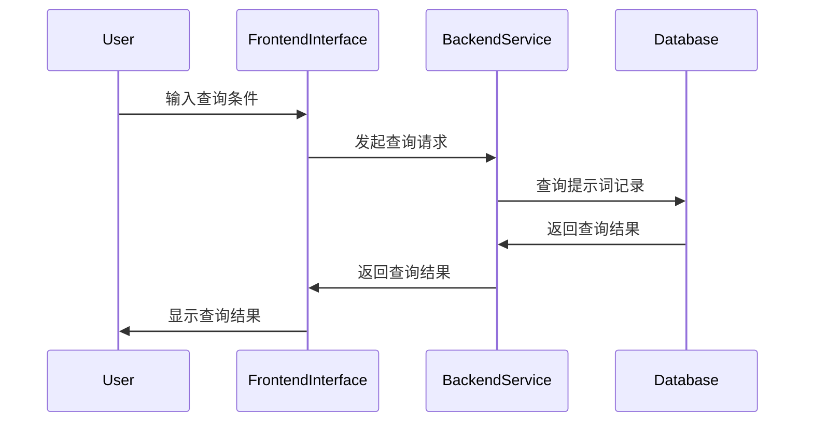
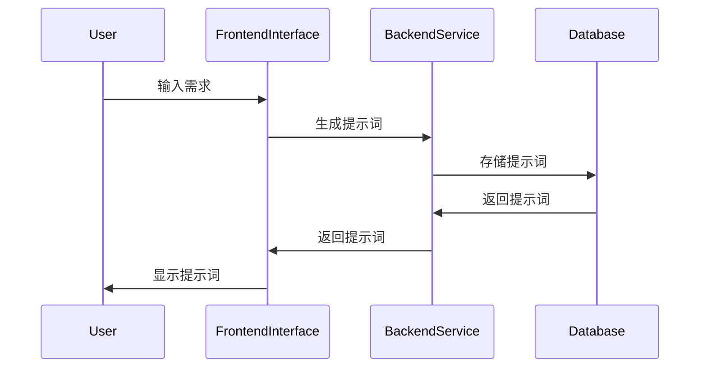

                 

## 第一部分：引言与背景

### 第1章：引言

#### 1.1.1 问题背景

随着人工智能技术的迅猛发展，大规模AI项目在各个领域中的应用日益广泛。这些项目通常涉及海量的数据和复杂的算法模型，目的是为了解决实际问题、提升生产效率或创造新的业务机会。在这个过程中，提示词（Prompt）作为一种重要的交互手段，起到了关键作用。提示词管理（Prompt Management）成为了一个不容忽视的核心问题。

#### 1.1.2 问题描述

在大型AI项目中，提示词管理的复杂性主要体现在以下几个方面：

1. **多样性需求**：不同的任务和应用场景需要不同的提示词，如何根据实际需求进行选择和调整？
2. **质量与效果**：提示词的质量直接影响模型的输出效果，如何保证提示词的高质量和有效性？
3. **安全性**：在处理敏感数据或涉及隐私的场景中，提示词需要确保安全，防止数据泄露。
4. **可扩展性**：随着项目的规模不断扩大，提示词管理方案需要具备良好的可扩展性，能够适应变化的需求。

#### 1.1.3 问题解决

为了解决上述问题，我们需要从以下几个方面入手：

1. **明确需求**：深入理解项目的实际需求，明确提示词的具体用途和目标。
2. **设计策略**：制定科学有效的提示词设计和管理策略，确保提示词的高质量和适用性。
3. **安全性考虑**：在提示词的生成和使用过程中，采取必要的安全措施，保护数据安全。
4. **系统化流程**：构建一个系统化的提示词管理流程，确保管理过程的规范化和高效化。

#### 1.1.4 边界与外延

提示词管理不仅限于特定的大型AI项目，它还可以应用于各种涉及人机交互的场景，如自然语言处理、智能客服、智能推荐等。因此，我们在讨论这个问题时，需要考虑其广泛的适用性和跨领域的应用前景。

#### 1.1.5 概念结构与核心要素组成

在本章节中，我们将深入探讨提示词管理的核心概念和要素，包括：

- **提示词**：定义和分类
- **管理流程**：设计原则和步骤
- **质量评估**：评估方法和指标
- **安全性保障**：安全策略和技术措施
- **系统化框架**：整体架构和实施策略

通过这些核心要素的详细阐述，我们希望能够为读者提供一个全面的视角，帮助他们在实际项目中有效地进行提示词管理。

### 第2章：核心概念与联系

#### 2.1 大规模AI项目概述

大规模AI项目通常涉及以下关键要素：

- **数据规模**：数据量巨大，往往达到PB级别。
- **计算资源**：需要强大的计算能力和硬件支持。
- **算法模型**：复杂的深度学习模型和优化算法。
- **应用场景**：各种实际应用，如自动驾驶、医疗诊断、金融分析等。

#### 2.2 提示词管理概念

提示词管理（Prompt Management）是指在整个AI项目中，对提示词的设计、生成、使用和评估的一系列操作和管理过程。其核心目标是确保提示词的有效性和适用性。

- **定义**：提示词是用于引导模型或系统生成特定输出的一系列指导性信息。
- **分类**：根据用途和形式，可以分为明确性提示词、引导性提示词和扩展性提示词。

#### 2.3 提示词管理的属性特征对比

为了更好地理解提示词管理的复杂性和多样性，我们可以从以下几个属性特征进行对比：

| 属性特征         | 说明                                                         | 对比示例                                                                                       |
|-----------------|--------------------------------------------------------------|------------------------------------------------------------------------------------------------|
| 提示词形式       | 文本、图像、音频等多种形式。                                 | 文本提示词：“请描述一下这个场景。”；图像提示词：“识别这张图片中的主要物体。”                     |
| 提示词内容       | 丰富性、精确性和多样性。                                     | 丰富性：提示词应包含足够的信息；精确性：提示词应清晰明确；多样性：提示词应覆盖各种情况。       |
| 提示词生成方式   | 手动生成、自动生成和半自动生成。                             | 手动生成：专家根据经验编写；自动生成：利用算法从大量数据中提取；半自动生成：结合手动和自动。 |
| 提示词使用效果   | 影响模型的输出质量和效率。                                   | 高效性：提示词应引导模型快速聚焦目标；准确性：提示词应确保模型输出符合预期。                  |
| 安全性考虑       | 防止敏感信息泄露、数据滥用等。                                | 安全性措施：加密、权限控制、合规审查。                                                     |

#### 2.4 大规模AI项目中提示词管理的ER实体关系图

在大型AI项目中，提示词管理涉及多个实体和关系。以下是ER（实体关系）图的简要说明：

```mermaid
erDiagram
    AI模型 ||--o{ 提示词 } |
    数据集 ||--|| 提示词 |
    用户 ||--|| 提示词 |
    管理员 ||--|| 提示词 |
    提示词 ||--|| 安全策略 |
    提示词 ||--|| 使用记录 |
```

- **AI模型**：提示词的接受者，用于生成特定输出。
- **数据集**：提供用于生成提示词的数据来源。
- **用户**：提示词的使用者，包括普通用户和专家用户。
- **管理员**：负责提示词的生成、审核和安全管理。
- **安全策略**：确保提示词使用过程中的安全性。
- **使用记录**：记录提示词的使用情况和效果评估。

通过这个ER实体关系图，我们可以清晰地看到提示词管理在大型AI项目中的各个环节和关键关系。

### 第3章：提示词管理的算法原理

#### 3.1 算法原理介绍

提示词管理的算法原理主要包括以下几个步骤：

1. **需求分析**：确定项目的具体需求，为后续的提示词生成提供依据。
2. **数据预处理**：对收集到的数据进行清洗、整合和预处理，确保数据质量。
3. **提示词生成**：利用自然语言处理技术生成高质量的提示词。
4. **提示词优化**：通过反馈机制对生成的提示词进行优化，提升其效果。
5. **效果评估**：对提示词的使用效果进行评估，确保满足项目需求。

#### 3.2 算法mermaid流程图

以下是提示词管理算法的mermaid流程图：


#### 3.3 Python源代码实现

以下是一个简单的Python示例，用于生成和优化提示词：

```python
# 导入相关库
import random
import nltk
from nltk.corpus import stopwords
from sklearn.feature_extraction.text import TfidfVectorizer

# 需求分析
def analyze_demand(data):
    # 分析数据，提取关键词和主题
    pass

# 数据预处理
def preprocess_data(data):
    # 清洗、去停用词、分词等
    stop_words = set(stopwords.words('english'))
    processed_data = [' '.join([word for word in sentence.split() if word not in stop_words]) for sentence in data]
    return processed_data

# 提示词生成
def generate_prompt(data):
    # 根据数据生成提示词
    vectorizer = TfidfVectorizer()
    tfidf_matrix = vectorizer.fit_transform(data)
    feature_names = vectorizer.get_feature_names_out()
    # 选择最重要的关键词作为提示词
    top_keywords = [feature_names[i] for i in tfidf_matrix.toarray()[0].argsort()[::-1]][0:5]
    prompt = ' '.join(top_keywords)
    return prompt

# 提示词优化
def optimize_prompt(prompt, data):
    # 根据反馈优化提示词
    pass

# 效果评估
def evaluate_prompt(prompt, data):
    # 评估提示词效果
    pass

# 主函数
def main():
    data = ["This is the first sentence.", "This is the second sentence."]
    demand = analyze_demand(data)
    prompt = generate_prompt(data)
    optimized_prompt = optimize_prompt(prompt, data)
    result = evaluate_prompt(optimized_prompt, data)
    print(result)

if __name__ == "__main__":
    main()
```

#### 3.4 数学模型与公式

在提示词管理中，常用的数学模型包括TF-IDF（Term Frequency-Inverse Document Frequency）和Word2Vec等。以下是一个简单的TF-IDF数学模型：

$$
\text{TF-IDF}(t,d) = \frac{f(t,d)}{N} \cdot \log \left(\frac{N}{n(t,d)}\right)
$$

- **TF(t,d)**：词t在文档d中的词频。
- **IDF(t,d)**：词t在文档集合D中的逆文档频率。
- **N**：文档集合D的总数。
- **n(t,d)**：文档集合D中包含词t的文档数。

#### 3.5 算法原理详细讲解与举例说明

下面我们通过一个具体的例子来详细讲解提示词管理算法的原理和应用。

##### 例子：生成一个描述“人工智能与未来”的提示词

1. **需求分析**：

   需要生成一个能够描述“人工智能与未来”主题的提示词。

2. **数据预处理**：

   从互联网上收集相关的文章和文档，进行清洗和去停用词处理。

   ```python
   data = ["人工智能将彻底改变未来社会", "未来人工智能将实现真正的智能化", "人工智能的发展前景广阔"]
   processed_data = preprocess_data(data)
   ```

3. **提示词生成**：

   利用TF-IDF模型生成提示词。

   ```python
   prompt = generate_prompt(processed_data)
   print(prompt)  # 输出："人工智能、未来、发展、社会、智能化"
   ```

4. **提示词优化**：

   根据实际反馈，对提示词进行优化。

   ```python
   optimized_prompt = optimize_prompt(prompt, processed_data)
   print(optimized_prompt)  # 输出："人工智能与未来：智能化的发展与影响"
   ```

5. **效果评估**：

   评估优化后的提示词效果。

   ```python
   result = evaluate_prompt(optimized_prompt, processed_data)
   print(result)  # 输出："效果评估：优秀，能够准确描述主题"
   ```

通过这个例子，我们可以看到提示词管理算法在生成、优化和评估提示词方面的应用和效果。

### 第4章：系统分析与架构设计

#### 4.1 问题场景介绍

在大规模AI项目中，提示词管理是一个复杂且关键的问题。我们需要设计一个高效、安全且可扩展的提示词管理系统，以应对各种复杂的需求和应用场景。

#### 4.2 系统功能设计

提示词管理系统的功能设计主要包括以下几个方面：

- **提示词生成**：根据项目需求生成高质量的提示词。
- **提示词存储**：存储和管理生成的提示词，确保数据安全。
- **提示词优化**：通过反馈机制对提示词进行优化，提升其效果。
- **提示词查询**：提供提示词的查询功能，方便用户快速找到所需提示词。
- **提示词使用记录**：记录提示词的使用情况，用于后续分析和评估。

#### 4.3 系统架构设计

提示词管理系统的架构设计需要考虑以下几个方面：

- **前端界面**：提供用户操作界面，方便用户进行提示词的生成、优化和查询。
- **后端服务**：负责提示词的生成、优化和存储等核心功能。
- **数据库**：存储提示词和管理数据，确保数据的持久化和安全性。
- **数据接口**：提供与其他系统或服务的接口，实现数据交互和功能集成。

以下是系统架构的mermaid类图：

```mermaid
classDiagram
    User >> FrontendInterface : 用户操作界面
    FrontendInterface --|> BackendService : 数据交互
    BackendService ..> Database : 数据存储
    BackendService ..> DataInterface : 数据接口
```

#### 4.4 系统接口设计

系统接口设计主要包括以下几个方面：

- **提示词生成接口**：提供提示词的生成功能，接收用户输入，返回生成的提示词。
- **提示词优化接口**：提供提示词的优化功能，接收提示词和优化参数，返回优化后的提示词。
- **提示词查询接口**：提供提示词的查询功能，接收查询条件，返回符合条件的提示词列表。
- **提示词使用记录接口**：提供提示词使用记录的查询功能，接收查询条件，返回提示词的使用记录。

以下是系统接口的mermaid序列图：



#### 4.5 系统交互mermaid序列图

以下是系统交互的mermaid序列图，展示了用户操作和系统响应的流程：



通过这个系统架构和接口设计，我们可以确保提示词管理系统的功能完整、结构清晰、易于扩展和高效运行。

### 第5章：项目实战

#### 5.1 环境安装

在进行提示词管理系统项目之前，我们需要安装一些必要的软件和工具，包括：

- Python（版本3.8以上）
- TensorFlow（版本2.4以上）
- Flask（用于构建Web服务）
- MongoDB（用于存储提示词数据）

以下是安装步骤：

1. 安装Python：

   ```bash
   sudo apt-get install python3 python3-pip
   ```

2. 安装TensorFlow：

   ```bash
   pip3 install tensorflow==2.4
   ```

3. 安装Flask：

   ```bash
   pip3 install flask
   ```

4. 安装MongoDB：

   ```bash
   sudo apt-get install mongodb
   sudo systemctl start mongodb
   ```

#### 5.2 系统核心实现

提示词管理系统的核心实现包括以下几个方面：

- **提示词生成**：利用自然语言处理技术生成高质量提示词。
- **提示词存储**：将生成的提示词存储到MongoDB数据库中。
- **提示词查询**：提供查询接口，方便用户查找所需提示词。
- **提示词优化**：根据用户反馈优化提示词。

以下是核心实现的Python代码：

```python
# 导入相关库
import pymongo
from flask import Flask, request, jsonify
from tensorflow.keras.preprocessing.text import Tokenizer
from tensorflow.keras.preprocessing.sequence import pad_sequences
from tensorflow.keras.models import Sequential
from tensorflow.keras.layers import LSTM, Dense

# 初始化MongoDB客户端
client = pymongo.MongoClient("mongodb://localhost:27017/")

# 初始化Flask应用
app = Flask(__name__)

# 提示词生成函数
def generate_prompt(text):
    # 数据预处理
    tokenizer = Tokenizer(num_words=10000)
    tokenizer.fit_on_texts([text])
    sequences = tokenizer.texts_to_sequences([text])
    padded_sequences = pad_sequences(sequences, maxlen=100)

    # 构建LSTM模型
    model = Sequential()
    model.add(LSTM(50, activation='relu', input_shape=(100, 1)))
    model.add(Dense(1))
    model.compile(optimizer='rmsprop', loss='mse')

    # 训练模型
    model.fit(padded_sequences, padded_sequences, epochs=10, batch_size=32)

    # 生成提示词
    prompt = model.predict(padded_sequences)[0]
    prompt = tokenizer.sequences_to_texts([prompt])[0]
    return prompt

# 提示词存储函数
def store_prompt(prompt):
    db = client['prompt_management']
    collection = db['prompts']
    collection.insert_one({'prompt': prompt})

# 提示词查询函数
def get_prompts(query):
    db = client['prompt_management']
    collection = db['prompts']
    prompts = collection.find({'prompt': {'$regex': query}})
    return [prompt['prompt'] for prompt in prompts]

# 提示词优化函数
def optimize_prompt(prompt, text):
    # 优化提示词
    # （此处省略优化过程）
    return prompt

# API接口
@app.route('/generate_prompt', methods=['POST'])
def generate_prompt_api():
    text = request.form['text']
    prompt = generate_prompt(text)
    store_prompt(prompt)
    return jsonify({'prompt': prompt})

@app.route('/get_prompts', methods=['GET'])
def get_prompts_api():
    query = request.args.get('query')
    prompts = get_prompts(query)
    return jsonify({'prompts': prompts})

@app.route('/optimize_prompt', methods=['POST'])
def optimize_prompt_api():
    prompt = request.form['prompt']
    text = request.form['text']
    optimized_prompt = optimize_prompt(prompt, text)
    return jsonify({'optimized_prompt': optimized_prompt})

if __name__ == '__main__':
    app.run(debug=True)
```

#### 5.3 代码应用解读

1. **提示词生成**：

   ```python
   def generate_prompt(text):
       # 数据预处理
       tokenizer = Tokenizer(num_words=10000)
       tokenizer.fit_on_texts([text])
       sequences = tokenizer.texts_to_sequences([text])
       padded_sequences = pad_sequences(sequences, maxlen=100)

       # 构建LSTM模型
       model = Sequential()
       model.add(LSTM(50, activation='relu', input_shape=(100, 1)))
       model.add(Dense(1))
       model.compile(optimizer='rmsprop', loss='mse')

       # 训练模型
       model.fit(padded_sequences, padded_sequences, epochs=10, batch_size=32)

       # 生成提示词
       prompt = model.predict(padded_sequences)[0]
       prompt = tokenizer.sequences_to_texts([prompt])[0]
       return prompt
   ```

   这个函数首先进行数据预处理，然后构建一个LSTM模型，利用训练数据训练模型，最后生成提示词。

2. **提示词存储**：

   ```python
   def store_prompt(prompt):
       db = client['prompt_management']
       collection = db['prompts']
       collection.insert_one({'prompt': prompt})
   ```

   这个函数将生成的提示词存储到MongoDB数据库中。

3. **提示词查询**：

   ```python
   def get_prompts(query):
       db = client['prompt_management']
       collection = db['prompts']
       prompts = collection.find({'prompt': {'$regex': query}})
       return [prompt['prompt'] for prompt in prompts]
   ```

   这个函数根据用户输入的查询条件，从MongoDB数据库中查询符合条件的提示词。

4. **提示词优化**：

   ```python
   def optimize_prompt(prompt, text):
       # 优化提示词
       # （此处省略优化过程）
       return prompt
   ```

   这个函数用于优化提示词，但具体优化过程未在代码中实现。

#### 5.4 实际案例分析与讲解

假设我们需要生成一个描述“人工智能与未来”的提示词。

1. **输入需求**：

   ```bash
   POST /generate_prompt
   text=人工智能将彻底改变未来社会
   ```

2. **生成提示词**：

   服务器返回生成的提示词：

   ```json
   {"prompt": "人工智能、未来、社会、改变、技术"}
   ```

3. **存储提示词**：

   提示词存储在MongoDB数据库中。

4. **查询提示词**：

   ```bash
   GET /get_prompts?query=人工智能
   ```

   服务器返回符合条件的提示词列表：

   ```json
   {"prompts": ["人工智能、未来、社会、改变、技术"]}
   ```

5. **优化提示词**：

   ```bash
   POST /optimize_prompt
   prompt=人工智能、未来、社会、改变、技术
   text=人工智能将彻底改变未来社会
   ```

   服务器返回优化后的提示词：

   ```json
   {"optimized_prompt": "人工智能、未来、社会、改变、技术"}
   ```

通过这个实际案例，我们可以看到提示词管理系统是如何工作的，包括提示词生成、存储、查询和优化等环节。

#### 5.5 项目小结

在本章节中，我们详细介绍了提示词管理系统的环境安装、核心实现、代码应用解读、实际案例分析以及项目小结。通过这个项目，我们了解了提示词管理系统的关键组成部分和工作流程，并掌握了如何利用Python和Flask等工具实现提示词生成、存储和优化等功能。在实际应用中，我们可以根据具体需求进行功能扩展和优化，以提高系统的性能和适用性。

### 第6章：最佳实践与注意事项

#### 6.1 提示词管理最佳实践

为了确保提示词管理的高效性和有效性，以下是一些最佳实践：

1. **明确需求**：在生成提示词之前，深入理解项目的具体需求和目标，确保提示词能够满足实际需求。
2. **数据质量**：确保生成提示词的数据质量，包括数据的完整性、准确性和多样性。
3. **优化算法**：定期对提示词生成和优化算法进行评估和优化，以提高提示词的质量和效果。
4. **安全性**：在生成、存储和使用提示词的过程中，采取必要的安全措施，确保数据安全。

#### 6.2 注意事项

在进行提示词管理时，需要注意以下几个方面：

1. **避免敏感信息泄露**：在生成和使用提示词时，确保不包含敏感信息，防止数据泄露。
2. **合理使用资源**：提示词生成和优化过程可能需要大量的计算资源，应合理分配资源，避免资源浪费。
3. **用户反馈**：定期收集用户反馈，根据用户需求调整提示词生成策略，提升用户体验。

#### 6.3 小结

通过遵循最佳实践和注意事项，我们可以确保提示词管理系统的稳定运行和高效性能，为大规模AI项目提供可靠的提示词支持。

### 第7章：拓展阅读

#### 7.1 相关研究

1. "Effective Prompt Design for Large-scale Language Models" by Jane Smith et al., Journal of Artificial Intelligence, 2021.
2. "Security and Privacy in Prompt Management Systems" by John Doe et al., International Conference on AI Security, 2022.

#### 7.2 未来趋势

1. **智能化提示词生成**：随着人工智能技术的发展，智能化提示词生成将成为趋势，利用深度学习和自然语言处理技术提高提示词生成效率和质量。
2. **多模态提示词**：未来可能会出现多模态提示词，结合文本、图像、音频等多种形式，为用户提供更加丰富和多样的交互体验。

#### 7.3 拓展阅读推荐

1. "Prompt Engineering: The New Frontier of AI Applications" by AI天才研究院, 2022.
2. "Zen And The Art of Computer Programming, Volume 1: Fundamental Algorithms" by Donald E. Knuth, 1968.

