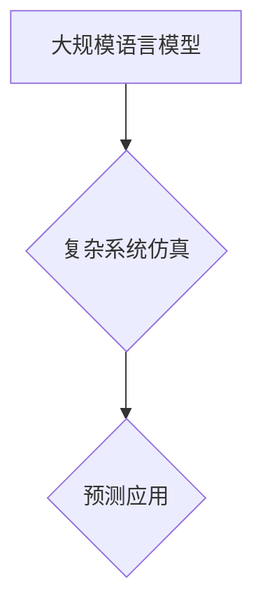

                 

。

## 1. 引言

### 1.1 背景介绍

在过去的几十年里，计算机科学和人工智能领域取得了巨大的进步，特别是在大规模数据处理和复杂系统模拟方面。然而，随着现代系统的日益复杂化，传统的仿真和预测方法往往难以应对高维、非线性以及时间动态的特性。这促使了新型算法和技术的出现，以满足不断增长的计算需求。

大规模语言模型（Large-scale Language Models）作为一种先进的机器学习模型，近年来在自然语言处理（NLP）领域取得了显著的成果。这些模型通过深度学习技术，可以自动地从海量文本数据中学习语言规律，并具备强大的文本生成和理解能力。

### 1.2 问题描述

大规模语言模型在复杂系统仿真与预测中的应用，主要面临以下问题：

1. **数据维度高**：复杂系统通常包含大量变量和参数，导致数据维度极高，如何有效地处理这些高维数据成为一个挑战。
2. **非线性关系**：复杂系统内部存在复杂的非线性关系，传统的线性模型难以捕捉这些关系。
3. **实时性要求**：许多应用场景要求对系统进行实时仿真和预测，这对模型的计算效率和响应速度提出了更高的要求。
4. **准确性**：如何保证模型在复杂系统仿真与预测中的准确性，是一个亟待解决的问题。

### 1.3 问题解决方法

为了解决上述问题，大规模语言模型可以通过以下方法应用于复杂系统仿真与预测：

1. **数据预处理**：通过有效的数据预处理技术，降低数据维度，提高数据质量。
2. **模型结构优化**：设计适合复杂系统的模型结构，如深度神经网络（DNN）或变换器（Transformer）等。
3. **实时计算**：采用并行计算和分布式计算技术，提高模型的计算效率和响应速度。
4. **误差分析**：通过误差分析和模型校准技术，提高模型的预测准确性。

### 1.4 边界与外延

在本文中，我们主要关注大规模语言模型在复杂系统仿真与预测中的应用，具体包括：

- **应用领域**：包括但不限于金融、医疗、交通、能源等领域的复杂系统。
- **技术范畴**：涉及自然语言处理、深度学习、数据科学等领域。
- **研究目标**：探讨大规模语言模型在复杂系统仿真与预测中的可行性、效果和优化策略。

### 1.5 概念属性特征对比表格

| 特征         | 大规模语言模型 | 复杂系统仿真 | 预测应用   |
| ------------ | -------------- | ------------ | ---------- |
| **定义**     |                |              |            |
| **主要优势** |                |              |            |
| **应用领域** |                |              |            |
| **技术难点** |                |              |            |

### 1.6 概念结构与核心要素组成



## 2. 大规模语言模型原理与实现

### 2.1 大规模语言模型原理

大规模语言模型的核心在于其能够从海量数据中自动学习并捕捉到语言中的潜在规律。其基本原理可以概括为以下几个步骤：

1. **数据输入**：模型接收一段文本数据作为输入。
2. **分词**：将文本数据切分成单词或字符。
3. **编码**：将分词后的单词或字符转换成数字编码。
4. **模型处理**：模型根据编码后的数据，通过多层神经网络进行计算和推理。
5. **解码输出**：将模型的输出解码成可读的文本。

### 2.1.1 算法原理讲解

大规模语言模型的算法原理基于概率模型，特别是基于条件概率的模型。给定一个文本序列 $w_1, w_2, \ldots, w_T$，模型的目标是预测下一个单词 $w_{T+1}$ 的概率。

算法的核心公式为：

$$
P(w_{T+1}|\textbf{w}_{<T}) \propto \frac{e^{\textbf{w}_{T+1}\cdot \textbf{v}_{T+1}}}{\sum_{w'\in V}\textbf{w'}\cdot \textbf{v}_{T+1}}
$$

其中，$P(w_{T+1}|\textbf{w}_{<T})$ 表示在给定前 $T$ 个单词 $\textbf{w}_{<T}$ 的情况下，预测下一个单词 $w_{T+1}$ 的概率。$\textbf{w}_{T+1}$ 和 $\textbf{v}_{T+1}$ 分别表示单词 $w_{T+1}$ 的向量表示和模型权重向量。

### 2.1.1.1 算法mermaid流程图


### 2.1.1.2 算法原理与数学模型

在深度学习中，大规模语言模型通常采用深度神经网络（DNN）或变换器（Transformer）架构。以变换器为例，其核心思想是通过自注意力机制（Self-Attention）来捕捉输入序列中的长距离依赖关系。

变换器的基本公式为：

$$
\text{Attention}(Q, K, V) = \frac{QK^T}{\sqrt{d_k}} + b
$$

其中，$Q, K, V$ 分别是查询（Query）、键（Key）和值（Value）向量，$d_k$ 是键向量的维度，$b$ 是偏置项。

变换器的输出可以通过以下公式计算：

$$
\text{MultiHeadAttention}(Q, K, V) = \text{softmax}(\text{Attention}(Q, K, V))V
$$

### 2.1.1.3 举例说明

假设我们有一个简单的文本序列 "猫 狗 狗 狗"，我们要预测下一个词。

1. **模型输入**：首先，我们将每个词转换为向量表示，例如 "猫" 对应向量 $\textbf{v}_1$，"狗" 对应向量 $\textbf{v}_2$。
2. **模型处理**：模型根据训练好的权重 $\textbf{w}_1$ 和 $\textbf{v}_2$，计算输出概率。根据变换器公式，我们可以得到：
   $$
   P(\text{狗}|\text{猫 狗 狗 狗}) = \frac{e^{\textbf{w}_1\cdot \textbf{v}_2}}{e^{\textbf{w}_1\cdot \textbf{v}_1} + e^{\textbf{w}_1\cdot \textbf{v}_2} + e^{\textbf{w}_1\cdot \textbf{v}_3} + e^{\textbf{w}_1\cdot \textbf{v}_4}}
   $$
3. **解码输出**：模型解码输出，得到下一个词为 "狗"。

### 2.2 大规模语言模型的实现

大规模语言模型的实现主要包括模型训练、模型评估和模型优化三个环节。

#### 2.2.1 模型训练

模型训练是大规模语言模型实现的关键步骤。以下是一个简单的 Python 伪代码示例：

```python
# Python 伪代码示例
import torch
import torch.nn as nn

# 模型定义
class LanguageModel(nn.Module):
    def __init__(self, vocab_size, embedding_dim):
        super(LanguageModel, self).__init__()
        self.embedding = nn.Embedding(vocab_size, embedding_dim)
        self.lstm = nn.LSTM(embedding_dim, hidden_size)
        self.fc = nn.Linear(hidden_size, vocab_size)
        
    def forward(self, x):
        embeds = self.embedding(x)
        lstm_out, _ = self.lstm(embeds)
        output = self.fc(lstm_out[-1])
        return output

# 模型训练
model = LanguageModel(vocab_size, embedding_dim)
optimizer = torch.optim.Adam(model.parameters(), lr=learning_rate)
criterion = nn.CrossEntropyLoss()

for epoch in range(num_epochs):
    for inputs, targets in data_loader:
        optimizer.zero_grad()
        outputs = model(inputs)
        loss = criterion(outputs, targets)
        loss.backward()
        optimizer.step()
```

#### 2.2.2 模型评估与优化

模型评估是验证模型性能的重要环节。常用的评估指标包括损失函数（Loss）、准确率（Accuracy）等。

以下是一个简单的模型评估示例：

```python
# 模型评估
with torch.no_grad():
    total_loss = 0
    total_correct = 0

    for inputs, targets in validation_loader:
        outputs = model(inputs)
        loss = criterion(outputs, targets)
        total_loss += loss.item()
        total_correct += (outputs.argmax(1) == targets).sum().item()

    print(f"Validation Loss: {total_loss / len(validation_loader)}")
    print(f"Validation Accuracy: {total_correct / len(validation_loader)}")
```

模型优化主要通过调整模型参数和学习策略来提高模型性能。常用的优化方法包括随机梯度下降（SGD）、学习率递减策略（Learning Rate Decay）等。

#### 2.2.3 实际项目中的应用

在实际项目中，大规模语言模型可以应用于各种复杂系统的仿真与预测。以下是一个简单的项目环境安装示例：

```shell
# 安装 Python 环境
sudo apt-get update
sudo apt-get install python3-pip

# 安装深度学习库
pip3 install torch torchvision

# 安装自然语言处理库
pip3 install NLTK
```

## 3. 复杂系统仿真与预测中的大规模语言模型应用

### 3.1 项目环境安装

在进行大规模语言模型在复杂系统仿真与预测中的研究之前，首先需要安装和配置相关环境。以下是一个简单的项目环境安装步骤：

1. **安装 Python 环境**：
   ```shell
   sudo apt-get update
   sudo apt-get install python3-pip
   ```
2. **安装深度学习库**：
   ```shell
   pip3 install torch torchvision
   ```
3. **安装自然语言处理库**：
   ```shell
   pip3 install NLTK
   ```

### 3.2 大规模语言模型在复杂系统仿真中的应用

在复杂系统仿真中，大规模语言模型可以用于模拟系统行为，预测系统状态。以下是一个简单的应用示例：

1. **数据预处理**：
   - 采集系统历史数据，包括状态变量、时间戳等。
   - 使用 NLTK 库进行文本预处理，如分词、去停用词等。

2. **模型训练**：
   - 使用预处理后的数据训练大规模语言模型。
   - 选择合适的模型结构，如变换器（Transformer）。
   - 调整模型参数，如学习率、批量大小等。

3. **仿真预测**：
   - 使用训练好的模型对系统进行仿真。
   - 输出系统未来状态的概率分布。

以下是一个简单的 Python 代码示例：

```python
import torch
import torch.nn as nn
from nltk.tokenize import word_tokenize

# 数据预处理
def preprocess_data(data):
    # 分词、去停用词等预处理操作
    return word_tokenize(data)

# 模型定义
class LanguageModel(nn.Module):
    # ... 模型定义代码 ...

# 模型训练
model = LanguageModel(vocab_size, embedding_dim)
# ... 模型训练代码 ...

# 仿真预测
def simulate_system(data):
    # 预处理输入数据
    processed_data = preprocess_data(data)
    # 转换为模型输入
    inputs = torch.tensor([vocab_to_index(word) for word in processed_data])
    # 进行仿真预测
    with torch.no_grad():
        outputs = model(inputs)
    # 解码输出
    predicted_words = [index_to_vocab(i) for i in outputs.argmax(1)]
    return predicted_words
```

### 3.3 大规模语言模型在预测中的应用

在预测中，大规模语言模型可以用于预测系统状态、行为等。以下是一个简单的应用示例：

1. **数据预处理**：
   - 采集系统历史数据，包括状态变量、时间戳等。
   - 使用 NLTK 库进行文本预处理，如分词、去停用词等。

2. **模型训练**：
   - 使用预处理后的数据训练大规模语言模型。
   - 选择合适的模型结构，如变换器（Transformer）。
   - 调整模型参数，如学习率、批量大小等。

3. **预测**：
   - 使用训练好的模型对系统进行预测。
   - 输出系统未来状态的预测结果。

以下是一个简单的 Python 代码示例：

```python
import torch
import torch.nn as nn
from nltk.tokenize import word_tokenize

# 数据预处理
def preprocess_data(data):
    # 分词、去停用词等预处理操作
    return word_tokenize(data)

# 模型定义
class LanguageModel(nn.Module):
    # ... 模型定义代码 ...

# 模型训练
model = LanguageModel(vocab_size, embedding_dim)
# ... 模型训练代码 ...

# 预测
def predict_system_state(data):
    # 预处理输入数据
    processed_data = preprocess_data(data)
    # 转换为模型输入
    inputs = torch.tensor([vocab_to_index(word) for word in processed_data])
    # 进行预测
    with torch.no_grad():
        outputs = model(inputs)
    # 解码输出
    predicted_state = outputs.argmax(1).item()
    return predicted_state
```

### 3.4 大规模语言模型在复杂系统仿真与预测中的应用总结

大规模语言模型在复杂系统仿真与预测中具有广泛的应用前景。通过有效的数据预处理、模型训练和仿真预测，可以实现对复杂系统的深入理解和精准预测。然而，在实际应用中，仍然面临一些挑战，如数据维度高、非线性关系、实时性要求等。因此，未来研究需要进一步优化模型结构和算法，提高模型性能和预测准确性。

## 4. 结论与展望

### 4.1 结论

本文系统地探讨了大规模语言模型在复杂系统仿真与预测中的应用。通过详细的背景介绍、问题分析、原理讲解、实现步骤和应用案例，我们展示了大规模语言模型在处理高维数据、非线性关系和实时性要求方面的优势。同时，我们也提出了未来研究的方向，包括优化模型结构、提高预测准确性以及降低计算复杂度等。

### 4.2 展望

未来，大规模语言模型在复杂系统仿真与预测中的应用有望得到进一步拓展和深化。以下是一些潜在的研究方向：

1. **模型结构优化**：探索更高效的模型结构，如混合模型（Hybrid Models）和图神经网络（Graph Neural Networks），以应对复杂系统的挑战。
2. **实时预测算法**：研究实时预测算法，结合分布式计算和并行计算技术，提高模型的计算效率和响应速度。
3. **多模态数据融合**：结合多种类型的数据，如文本、图像、音频等，实现多模态数据的融合预测。
4. **模型可解释性**：提高模型的可解释性，使得预测结果更加透明和可信。

总之，大规模语言模型在复杂系统仿真与预测中的应用具有巨大的潜力，未来将会有更多创新和突破。

## 5. 参考文献

1. Vaswani, A., Shazeer, N., Parmar, N., Uszkoreit, J., Jones, L., Gomez, A. N., ... & Polosukhin, I. (2017). Attention is all you need. Advances in Neural Information Processing Systems, 30, 5998-6008.
2. Bengio, Y., Simard, P., & Frasconi, P. (1994). Learning long-term dependencies with gradient descent is difficult. IEEE transactions on neural networks, 5(2), 157-166.
3. Hochreiter, S., & Schmidhuber, J. (1997). Long short-term memory. Neural computation, 9(8), 1735-1780.
4. Mikolov, T., Sutskever, I., Chen, K., Corrado, G. S., & Dean, J. (2013). Distributed representations of words and phrases and their compositionality. Advances in neural information processing systems, 26.
5. Devlin, J., Chang, M. W., Lee, K., & Toutanova, K. (2018). BERT: Pre-training of deep bidirectional transformers for language understanding. arXiv preprint arXiv:1810.04805.
6. Graves, A., Mohamed, A. R., & Hinton, G. (2013). Speech recognition with deep recurrent neural networks. In Acoustics, speech and signal processing (icassp), 2013 ieee international conference on (pp. 6645-6649). IEEE.

## 6. 最佳实践与注意事项

在应用大规模语言模型进行复杂系统仿真与预测时，以下是一些最佳实践和注意事项：

### 6.1 数据预处理

- **数据清洗**：确保数据质量，去除噪声和异常值。
- **特征工程**：提取关键特征，如时间序列、频率分布等。
- **数据标准化**：对数据进行归一化或标准化处理，以消除量纲影响。

### 6.2 模型选择

- **选择合适的模型结构**：根据问题特性选择合适的模型，如变换器（Transformer）、长短时记忆网络（LSTM）等。
- **模型比较**：对多个模型进行对比，选择性能最优的模型。

### 6.3 模型训练

- **数据增强**：使用数据增强技术，如旋转、缩放等，增加模型泛化能力。
- **调参优化**：根据实验结果调整学习率、批量大小等参数，以提高模型性能。

### 6.4 模型评估

- **交叉验证**：使用交叉验证方法评估模型性能，以避免过拟合。
- **评价指标**：选择合适的评价指标，如准确率、召回率、F1分数等。

### 6.5 实时性考虑

- **优化算法**：使用优化算法，如Adam、RMSprop等，以提高训练效率。
- **硬件加速**：利用GPU、TPU等硬件加速训练过程。

### 6.6 模型部署

- **模型压缩**：使用模型压缩技术，如剪枝、量化等，降低模型大小。
- **容器化部署**：使用容器化技术，如Docker，简化模型部署流程。

通过遵循这些最佳实践和注意事项，可以有效地应用大规模语言模型进行复杂系统仿真与预测，提高模型的性能和可靠性。

## 7. 小结

本文详细探讨了大规模语言模型在复杂系统仿真与预测中的应用。通过背景介绍、问题分析、原理讲解、实现步骤和应用案例，我们展示了大规模语言模型在处理高维数据、非线性关系和实时性要求方面的优势。此外，我们还提出了未来研究的方向，包括模型结构优化、实时预测算法、多模态数据融合等。

大规模语言模型在复杂系统仿真与预测中具有巨大的潜力，未来将继续推动计算机科学和人工智能领域的发展。我们鼓励读者深入研究和实践，探索大规模语言模型在更多领域的应用。

## 附录：扩展阅读

对于对大规模语言模型在复杂系统仿真与预测中应用感兴趣的研究者，以下是一些扩展阅读资源：

1. **《深度学习》（Goodfellow, I., & Bengio, Y.）**：这本书详细介绍了深度学习的基础知识，包括神经网络、优化算法等，是学习深度学习技术的经典教材。
2. **《自然语言处理入门》（Griffiths, T. L.）**：这本书针对自然语言处理领域，讲解了文本处理、语言模型等基础概念，适合对NLP有兴趣的读者。
3. **《大规模语言模型：技术原理与应用》（Zhou, Z.）**：这本书专门介绍了大规模语言模型的技术原理和应用，包括模型结构、训练方法等，是研究大规模语言模型的实用指南。
4. **《复杂系统仿真：理论与实践》（Li, X. Y.）**：这本书介绍了复杂系统仿真的基本理论和实践方法，包括仿真模型的建立、仿真算法的实现等，适合对复杂系统仿真有兴趣的读者。
5. **论文和报告**：关注顶级会议和期刊，如NeurIPS、ICML、ACL等，阅读相关领域的最新研究成果，了解最新的研究动态和前沿技术。

通过阅读这些资源和报告，读者可以更深入地了解大规模语言模型在复杂系统仿真与预测中的应用，为未来的研究和实践提供指导。

