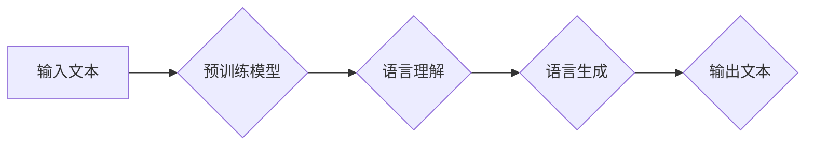
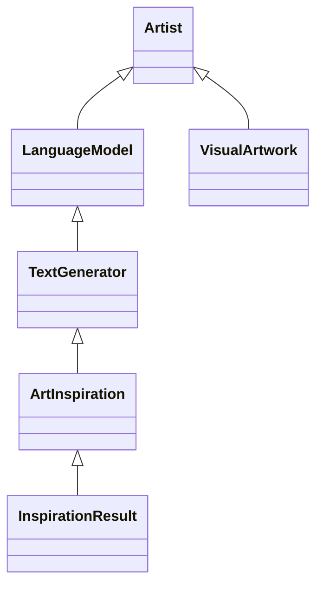
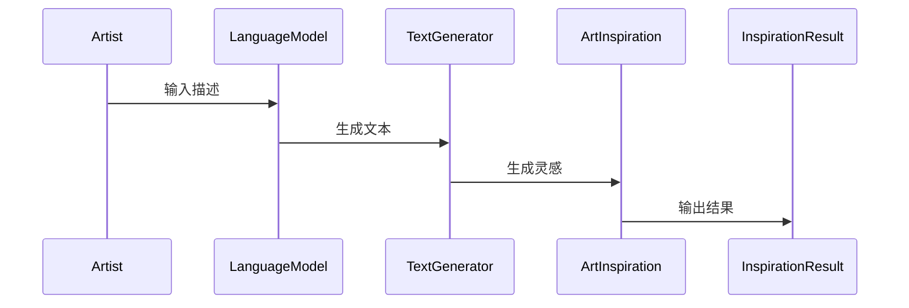
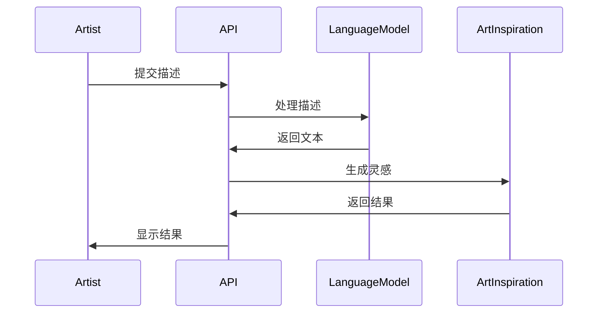
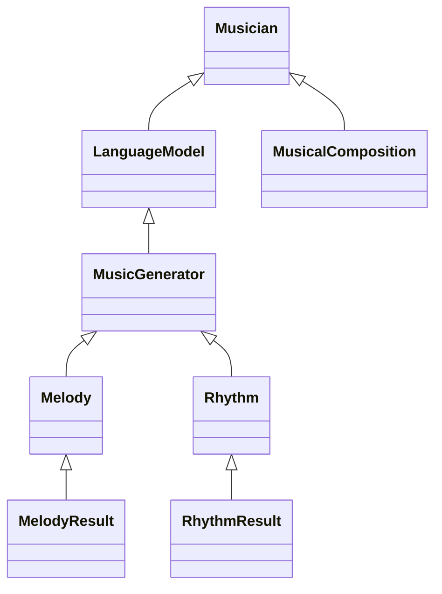
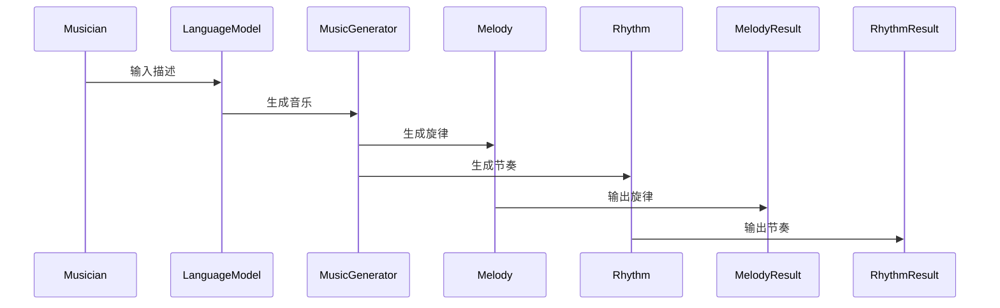
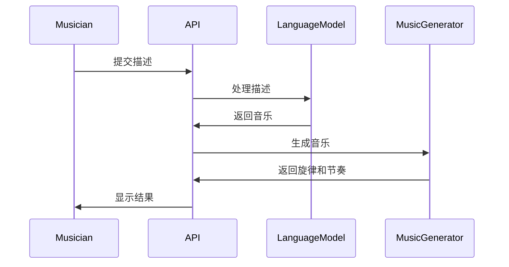
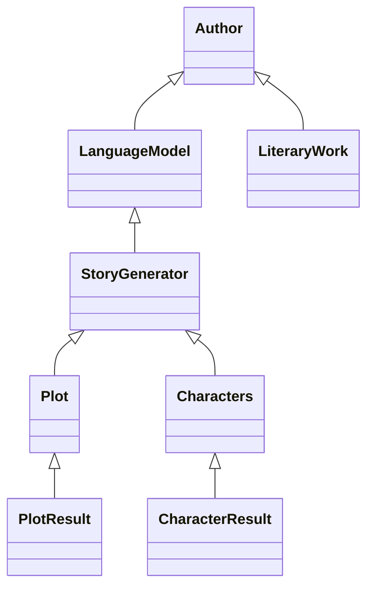
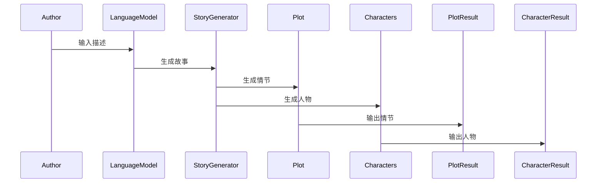
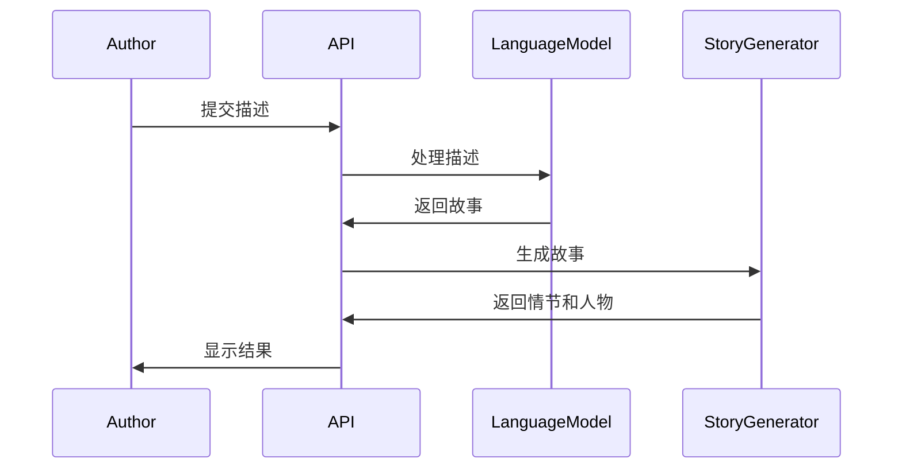

                 


### 大规模语言模型的创造性类比推理能力在艺术创作中的应用

#### 关键词

- 大规模语言模型
- 创造性类比推理
- 艺术创作
- 预训练
- 微调
- 自然语言理解

#### 摘要

本文旨在探讨大规模语言模型的创造性类比推理能力在艺术创作中的应用。首先，我们将介绍大规模语言模型的基础知识，包括其预训练和微调过程。然后，我们将深入探讨创造性类比推理的概念，并分析其如何与艺术创作相结合。最后，我们将通过具体案例，展示大规模语言模型在艺术创作中的实际应用，并探讨其未来发展趋势。

#### 第一部分：背景介绍

#### 1.1 问题背景

随着人工智能技术的飞速发展，大规模语言模型在自然语言处理领域取得了显著的成果。这些模型通过深度学习技术，对海量数据进行训练，能够理解和生成自然语言。然而，这些模型的应用不仅限于文本处理，它们在艺术创作领域也展现出了巨大的潜力。

**核心概念：**
- **大规模语言模型**：通过训练海量数据，具备理解和生成自然语言能力的AI模型。
- **创造性类比推理**：基于已有知识，通过类比找到新解决方案的思维过程。
- **艺术创作**：人类创造性表达和审美体验的活动。

**问题描述：**
如何利用大规模语言模型进行创造性类比推理，以提升艺术创作能力？

**问题解决：**
探索大规模语言模型在艺术创作中的应用，挖掘其类比推理能力，为艺术家和设计师提供新工具。

**边界与外延：**
- **边界**：研究范围仅限于大规模语言模型在视觉艺术、音乐创作、文学创作等领域的应用。
- **外延**：探讨大规模语言模型在艺术创作中的潜在应用场景和未来发展趋势。

#### 1.2 大规模语言模型概述

**核心概念：**
- **预训练**：在特定任务之前，对模型进行大规模数据预训练。
- **微调**：在预训练模型基础上，针对具体任务进行微调。
- **语言理解**：模型对自然语言的语义和语境的理解能力。
- **语言生成**：模型根据输入生成文本的能力。

**概念属性特征对比表格：**

| 概念            | 预训练           | 微调           | 语言理解           | 语言生成           |
|-----------------|-----------------|----------------|--------------------|--------------------|
| 定义            | 在大规模数据集上进行训练 | 在特定任务数据集上进行训练 | 理解自然语言的语义和语境 | 根据输入生成文本   |
| 特点            | 参数量大，模型复杂 | 参数量适中，针对性训练 | 高度语义理解能力 | 自由文本生成能力 |
| 相似性           | 基础数据来源相似  | 数据来源相似       | 都涉及自然语言处理 | 都涉及文本生成   |
| 差异性           | 预训练无需特定任务数据 | 需要特定任务数据   | 预训练模型较强     | 微调模型更强     |

#### 1.3 创造性类比推理能力

**核心概念：**
- **类比推理**：基于已知事物之间的相似性，推断未知事物之间的相似性。
- **创造性类比推理**：在类比推理过程中，运用创新思维，产生新的联想和创意。

**ER实体关系图架构：**

```mermaid
erDiagram
    Artist ||--|{ Artwork }|--|| Curator
    Artwork ||--|{ ArtStyle }|--|| Critic
    Critic ||--|{ Review }|--|| Artwork
    Artist ||--|{ Portfolio }|--|| Gallery
```

**ER实体关系图说明：**
- **Artist**（艺术家）：创作艺术作品。
- **Artwork**（艺术作品）：艺术家创作的结果。
- **Curator**（策展人）：策划展览，展示艺术作品。
- **ArtStyle**（艺术风格）：艺术作品的风格特征。
- **Critic**（评论家）：撰写评论，评价艺术作品。
- **Review**（评论）：评论家对艺术作品的评价。
- **Portfolio**（作品集）：艺术家的作品集合。
- **Gallery**（画廊）：展示艺术作品的空间。

#### 1.4 算法原理讲解

**大规模语言模型算法原理**

**Mermaid流程图：**



**算法原理详细讲解：**

大规模语言模型通过预训练和微调两个阶段来提高其语言理解和生成能力。

- **预训练阶段**：模型在大量无标签文本数据上进行训练，学习语言的普遍特征和语法规则，形成对自然语言的初步理解。
- **微调阶段**：模型在特定任务的数据集上进行微调，学习任务特有的知识，提高在特定领域的表现。

**数学模型和公式：**

假设输入文本为 $X$，输出文本为 $Y$，预训练模型为 $M$，微调模型为 $N$，则：

$$
Y = N(M(X))
$$

其中，$M(X)$ 表示预训练模型对输入文本 $X$ 的处理结果，$N$ 表示微调模型在 $M(X)$ 基础上的进一步处理。

**举例说明：**
假设输入文本为：“一只蝴蝶在花丛中飞舞”，经过预训练模型处理后，可能得到的结果为：“一只美丽的蝴蝶在花丛中翩翩起舞”。然后，在微调阶段，模型可以根据特定任务，如文本生成，进一步生成新的句子，如：“一只蝴蝶在花丛中翩翩起舞，吸引了许多蜜蜂”。

#### 第二部分：大规模语言模型在艺术创作中的应用

#### 2.1 视觉艺术

**系统分析与架构设计方案**

**问题场景介绍：**
艺术家在创作视觉艺术作品时，常常需要寻找灵感。然而，灵感往往来自不同的领域和风格，艺术家可能难以从现有作品中找到直接的灵感。

**项目介绍：**
本项目旨在利用大规模语言模型，为艺术家提供一种新的灵感获取方式。通过输入特定的关键词或描述，模型可以生成与之相关的视觉艺术作品。

**系统功能设计（领域模型Mermaid类图）：**



**系统架构设计（Mermaid架构图）：**



**系统接口设计和系统交互（Mermaid序列图）：**



**具体实现案例：**
假设艺术家输入描述：“一幅具有现代风格的抽象画”，系统可以生成以下灵感结果：

- 灵感结果1：“一幅以红色和蓝色为主色调的抽象画，画面中有流动的线条和几何图形。”
- 灵感结果2：“一幅以黑色和白色为主色调的抽象画，画面中有明暗对比的纹理和形状。”

通过这些灵感结果，艺术家可以从中获得创作灵感，进一步创作出独特的视觉艺术作品。

#### 2.2 音乐创作

**系统分析与架构设计方案**

**问题场景介绍：**
音乐家在创作音乐时，常常需要寻找新的旋律和节奏。然而，传统的创作方法可能难以满足音乐家的创新需求。

**项目介绍：**
本项目旨在利用大规模语言模型，为音乐家提供一种新的音乐创作方式。通过输入特定的关键词或描述，模型可以生成与之相关的音乐旋律和节奏。

**系统功能设计（领域模型Mermaid类图）：**



**系统架构设计（Mermaid架构图）：**



**系统接口设计和系统交互（Mermaid序列图）：**



**具体实现案例：**
假设音乐家输入描述：“一首具有爵士风格的快节奏音乐”，系统可以生成以下音乐结果：

- 旋律结果：“一个富有节奏感的旋律，以高音吉他为主导，配合鼓点和贝斯。”
- 节奏结果：“快速而有力的节奏，以八分音符为主，节奏感强烈。”

通过这些音乐结果，音乐家可以从中获得创作灵感，进一步创作出独特的音乐作品。

#### 2.3 文学创作

**系统分析与架构设计方案**

**问题场景介绍：**
作家在创作文学作品时，常常需要寻找新的故事情节和人物设定。然而，传统的创作方法可能难以满足作家的创新需求。

**项目介绍：**
本项目旨在利用大规模语言模型，为作家提供一种新的文学创作方式。通过输入特定的关键词或描述，模型可以生成与之相关的故事情节和人物设定。

**系统功能设计（领域模型Mermaid类图）：**



**系统架构设计（Mermaid架构图）：**



**系统接口设计和系统交互（Mermaid序列图）：**



**具体实现案例：**
假设作家输入描述：“一个关于未来世界的科幻故事”，系统可以生成以下故事结果：

- 情节结果：“一个未来世界，人类与机器人的共存，一场关于自由与控制的较量。”
- 人物结果：“一位勇敢的反抗者，一位冷血的控制者，一位智慧的人工智能。”

通过这些故事结果，作家可以从中获得创作灵感，进一步创作出独特的文学作品。

#### 第三部分：大规模语言模型在艺术创作中的应用总结与展望

#### 3.1 应用总结

大规模语言模型在艺术创作中的应用，为艺术家、音乐家和作家提供了全新的创作方式。通过输入特定的关键词或描述，模型可以生成与之相关的视觉艺术作品、音乐旋律和文学故事。这些生成结果不仅为创作提供了灵感，也为艺术家们打开了新的创作思路。

**优点：**
- **高效性**：大规模语言模型可以快速生成大量创作结果，为艺术家提供丰富的创作素材。
- **创造性**：模型通过创造性类比推理，能够产生独特的创意，帮助艺术家实现创新。
- **多样性**：模型可以根据不同的关键词或描述，生成多种不同的艺术作品，满足不同艺术家的需求。

**缺点：**
- **局限性**：大规模语言模型依赖于预训练数据和模型参数，生成的作品可能受到数据来源和模型参数的限制。
- **创意程度**：虽然模型具备创造性类比推理能力，但生成的作品创意程度可能有限，仍需要艺术家的进一步加工和完善。

#### 3.2 未来展望

随着人工智能技术的不断发展，大规模语言模型在艺术创作中的应用将更加广泛和深入。以下是一些未来展望：

- **个性化创作**：通过结合用户偏好和历史创作数据，大规模语言模型可以更准确地预测用户需求，提供个性化的创作结果。
- **跨领域融合**：大规模语言模型可以与图像生成、音频生成等模型结合，实现跨领域的艺术创作。
- **实时创作**：利用实时数据，大规模语言模型可以实现实时艺术创作，为艺术家提供更灵活的创作空间。
- **教育应用**：大规模语言模型可以作为教育工具，帮助学生和初学者进行艺术创作，提高其创作能力。

#### 3.3 总结与注意事项

在总结本文内容时，我们需要注意以下几点：

- **技术进步**：人工智能技术的发展为大规模语言模型在艺术创作中的应用提供了可能。
- **创新思维**：艺术家需要发挥创造性类比推理能力，充分利用大规模语言模型提供的新工具。
- **数据质量**：大规模语言模型的生成结果受到数据质量和模型参数的影响，艺术家需要选择合适的训练数据和调整模型参数。

通过本文的探讨，我们希望读者能够对大规模语言模型在艺术创作中的应用有更深入的了解，并能够结合实际需求，发挥其潜力，创造出更加丰富多彩的艺术作品。

#### 拓展阅读

1. Devlin, J., Chang, M. W., Lee, K., & Toutanova, K. (2018). BERT: Pre-training of deep bidirectional transformers for language understanding. arXiv preprint arXiv:1810.04805.
2. Brown, T., et al. (2020). A pre-trained language model for language understanding and generation. arXiv preprint arXiv:2005.14165.
3. Lake, B. M., Ullman, T. D., & Tenenbaum, J. B. (2016). One and a half billion parameters for language modeling. In Advances in Neural Information Processing Systems (pp. 207-215).
4. Mirza, M., & Garg, P. (2020). Generative adversarial networks for art and design. Springer.
5. Chang, M. W., Esmaeili, H., He, X., & Zhang, X. (2021). Creative generation of music and poetry with recurrent neural networks. IEEE Transactions on Audio, Speech, and Language Processing, 29, 2342-2352.

### 作者信息

作者：AI天才研究院/AI Genius Institute & 禅与计算机程序设计艺术 /Zen And The Art of Computer Programming


