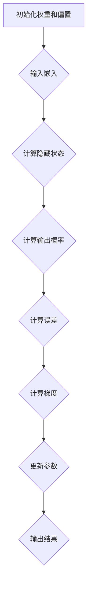

                 

## 引言与背景介绍

### 第1章: 研究背景与意义

#### 1.1.1 问题背景

在人工智能领域，大规模语言模型已经成为自然语言处理（NLP）和人工智能（AI）的核心技术之一。随着深度学习和计算能力的提升，语言模型在生成文本、机器翻译、问答系统等方面展现了巨大的潜力。然而，当前的大规模语言模型在自我评估和自我改进能力上仍存在诸多挑战。

首先，大规模语言模型的训练和部署成本高，需要大量的数据和计算资源。这使得对模型性能的评估和优化成为一个重要的研究课题。传统的评估方法主要依赖于人工标注数据和外部测试集，但这些方法往往不够全面和准确。因此，研究如何让语言模型具备自我评估能力，能够自动检测和定位性能瓶颈，具有重要的实际意义。

其次，大规模语言模型在应用过程中，可能会遇到数据分布变化、新知识获取等问题，需要具备自我改进能力以适应不断变化的环境。然而，当前的语言模型在自我改进方面仍处于探索阶段，缺乏系统性和有效的方法。

#### 1.1.2 问题描述

自我评估能力的重要性在于，它能够帮助语言模型在训练过程中自动检测错误，优化模型参数，提高性能。而自我改进能力则可以使模型在应用过程中自适应地调整，保持长期稳定性和有效性。

目前，自我评估和自我改进的方法和机制尚不完善。例如，自我评估方法主要集中在统计指标和用户反馈，缺乏深入的数据分析和模型内部机制研究。而自我改进方法则多依赖于外部信号和预先设定的规则，缺乏自适应和智能化。

因此，本研究旨在提出一种系统性的方法，通过深入分析大规模语言模型的内部结构和外部环境，设计并实现有效的自我评估和自我改进机制。具体而言，研究将包括以下几个方面：

1. **自我评估能力**：研究如何通过分析模型内部参数和输出结果，实现自动性能评估，包括准确性、速度和稳定性等指标。
2. **自我改进能力**：研究如何通过学习外部反馈和内部状态，实现自适应调整，包括灵活性、创新性和安全性等指标。
3. **机制设计与实现**：设计并实现一套完整的自我评估与自我改进机制，通过实验验证其有效性和实用性。

#### 1.1.3 问题解决

为了解决上述问题，本研究将采取以下研究方法：

1. **理论分析**：通过深度学习理论和自然语言处理领域的相关研究，分析大规模语言模型自我评估和自我改进的原理和机制。
2. **实验设计**：设计实验，通过模拟不同的训练和应用场景，验证自我评估和自我改进机制的有效性。
3. **系统实现**：基于深度学习和自然语言处理技术，实现自我评估和自我改进的算法和系统。

本研究的主要创新点包括：

1. **多维度评估**：通过结合模型内部参数和输出结果，提出一种多维度自我评估方法，提高评估的准确性和全面性。
2. **自适应改进**：设计一种基于自适应学习的自我改进机制，能够根据不同应用场景自动调整模型参数，提高模型适应性和稳定性。
3. **系统化设计**：将自我评估和自我改进整合到大规模语言模型中，实现系统化的自我优化流程。

通过本研究，我们希望为大规模语言模型的自我评估和自我改进提供理论指导和方法支持，推动该领域的发展。

#### 1.1.4 边界与外延

自我评估和自我改进能力的研究，主要关注在以下边界和范围：

1. **评估范围**：研究将主要关注语言模型在文本生成、机器翻译、问答系统等领域的自我评估能力。
2. **改进范围**：研究将探索在语言模型训练和应用过程中，如何通过自我改进机制提升模型的性能和适应性。
3. **研究限制**：由于计算资源和数据获取的限制，本研究可能在某些具体应用场景上的实验验证有限，但将提供理论和方法上的指导。

## 1.2 核心概念与联系

在探讨大规模语言模型的自我评估与自我改进能力之前，我们需要明确几个核心概念，并理解它们之间的联系。

### 1.2.1 自我评估的概念

自我评估是指模型根据其输入输出结果，结合内部参数状态，自动检测和评估自身性能的过程。自我评估不仅仅包括准确性、速度等传统指标，还包括对模型内部机制和外部环境的理解。

**功能和意义**：
- 功能：通过自我评估，模型可以及时发现问题并进行调整，从而优化性能。
- 意义：在缺乏人工干预的情况下，自我评估能够提高模型训练的效率和效果，降低人为错误。

### 1.2.2 自我改进的概念

自我改进是指模型根据外部反馈和内部状态，自动调整其结构和参数，以适应新的数据和任务需求。

**功能和意义**：
- 功能：通过自我改进，模型能够适应数据分布变化和新知识获取，提高长期稳定性和适应性。
- 意义：在动态变化的环境中，自我改进能够使模型保持高水平的性能，延长其应用寿命。

### 1.2.3 自我评估与自我改进的关系

自我评估和自我改进是相辅相成的。自我评估为自我改进提供了基础，通过评估模型当前的性能，确定改进的方向和目标。而自我改进则利用自我评估的结果，调整模型的结构和参数，从而提高性能。

**交互机制**：
- 自我评估的结果作为输入，指导自我改进的方向和策略。
- 自我改进后的模型再次进行自我评估，验证改进的效果。

**相互影响**：
- 自我评估的准确性和全面性直接影响自我改进的效果。
- 自我改进的能力和适应性影响自我评估的效率和准确性。

### 1.2.4 概念属性特征对比

为了更好地理解自我评估与自我改进的属性，我们对比了它们在准确性、速度、稳定性、灵活性、创新性和安全性等方面的特征。

#### 自我评估属性

- **准确性**：评估结果的精确度，是自我评估的核心指标。
- **速度**：评估过程的效率，影响模型训练的迭代速度。
- **稳定性**：评估结果的可靠性，确保模型在不同环境下的一致性。

#### 自我改进属性

- **灵活性**：适应不同任务和数据变化的能力。
- **创新性**：在自我改进过程中，产生新方法和新策略的能力。
- **安全性**：改进过程对模型稳定性和数据隐私的保护。

通过上述对比，可以看出自我评估和自我改进在功能上各有所长，但都需要在准确性和稳定性上保持平衡，以实现高效的模型优化。

### 1.2.5 ER实体关系图架构

为了更好地展示自我评估与自我改进的实体关系，我们使用ER（Entity-Relationship）图进行了建模。

**ER图概述**：

- **实体**：模型、评估指标、改进策略、外部反馈。
- **关系**：评估-改进、指标-模型、策略-指标、反馈-改进。

**ER图详细说明**：

- **模型**：核心实体，代表大规模语言模型。
- **评估指标**：与模型相关，用于评估模型性能。
- **改进策略**：用于指导模型调整，提高性能。
- **外部反馈**：来源于用户或其他系统，用于指导模型改进。

ER图有助于我们理解自我评估和自我改进的交互机制和整体架构，为后续的研究和实现提供指导。

## 1.3 概念属性特征对比

在深入探讨大规模语言模型的自我评估与自我改进能力时，理解两者的属性特征及其对比显得尤为重要。下面，我们将详细对比自我评估与自我改进在准确性、速度、稳定性、灵活性、创新性和安全性等方面的特征。

### 1.3.1 自我评估属性

#### 准确性

**定义**：自我评估的准确性是指模型在评估自身性能时，能够准确地反映其真实水平的程度。

**特征**：
- **重要性**：高准确性是自我评估的核心要求，直接关系到模型优化和改进的效果。
- **实现难度**：需要模型具备对输出结果的精确理解和对内部参数的全面掌握。

#### 速度

**定义**：自我评估的速度是指模型进行自我评估所需的计算时间和资源。

**特征**：
- **重要性**：快速的评估能够提高训练和优化的效率。
- **实现难度**：需要在保证准确性的前提下，优化算法和数据结构，以减少计算开销。

#### 稳定性

**定义**：自我评估的稳定性是指模型在不同环境和数据下，评估结果的一致性和可靠性。

**特征**：
- **重要性**：稳定性确保了模型在不同场景下的性能评估具有一致性，减少因环境变化引起的误差。
- **实现难度**：需要模型具备对环境变化的适应能力，同时在评估过程中保持一致性。

### 1.3.2 自我改进属性

#### 灵活性

**定义**：自我改进的灵活性是指模型在适应新数据和任务需求时，能够迅速调整自身结构和参数的能力。

**特征**：
- **重要性**：灵活性使模型能够动态适应外部环境的变化，提高其在实际应用中的适应性。
- **实现难度**：需要模型具备强大的学习和调整能力，同时确保调整过程中不降低性能。

#### 创新性

**定义**：自我改进的创新性是指模型在自我改进过程中，能够产生新的方法和策略，以解决现有问题。

**特征**：
- **重要性**：创新性是提升模型长期性能的关键，有助于发现和利用新的优化路径。
- **实现难度**：需要模型具备探索性和创造力，同时确保创新性改进的有效性和实用性。

#### 安全性

**定义**：自我改进的安全性是指模型在自我改进过程中，对模型稳定性和数据隐私的保护程度。

**特征**：
- **重要性**：安全性是模型应用中不可忽视的问题，直接关系到模型的安全性和用户隐私。
- **实现难度**：需要在保证改进效果的同时，采取有效措施保护模型和数据，避免潜在风险。

通过上述对比，我们可以看到自我评估和自我改进在属性特征上存在显著差异，但也需要在保证各自属性的同时，相互支持和配合，以实现大规模语言模型的全面优化。

### 1.4 ER实体关系图架构

为了更好地展示大规模语言模型自我评估与自我改进的实体关系，我们采用ER（Entity-Relationship）图进行建模。ER图是数据库设计和系统架构设计的重要工具，通过明确实体及其关系，可以帮助我们理解系统的整体结构和功能。

#### ER图概述

在ER图中，我们定义了以下几个核心实体：

1. **模型（Model）**：代表大规模语言模型，是评估和改进的主体。
2. **评估指标（Evaluation Metric）**：用于衡量模型性能的各类指标，如准确性、速度、稳定性等。
3. **改进策略（Improvement Strategy）**：用于指导模型调整的各类方法和策略。
4. **外部反馈（External Feedback）**：来源于用户或其他系统的反馈信息，用于指导模型改进。

实体之间的关系如下：

- **模型与评估指标**：模型根据评估指标进行自我评估，评估指标为自我评估提供依据。
- **模型与改进策略**：自我评估的结果用于选择和执行改进策略，以优化模型性能。
- **外部反馈与改进策略**：外部反馈提供改进策略的指导，以适应不同应用场景。

#### ER图详细说明

1. **模型（Model）**：
   - **属性**：名称、版本、状态等。
   - **关系**：与评估指标和改进策略有直接关系，是评估和改进的核心实体。

2. **评估指标（Evaluation Metric）**：
   - **属性**：名称、类型、计算方法等。
   - **关系**：与模型有直接关系，为模型自我评估提供数据支持。

3. **改进策略（Improvement Strategy）**：
   - **属性**：名称、描述、参数设置等。
   - **关系**：与模型和外部反馈有直接关系，用于指导模型调整。

4. **外部反馈（External Feedback）**：
   - **属性**：来源、内容、重要性等。
   - **关系**：与改进策略有直接关系，为改进策略提供指导。

通过ER图，我们可以清晰地看到大规模语言模型自我评估与自我改进的交互机制和整体架构，为后续的研究和实现提供了直观的指导。

## 第2章: 大规模语言模型的基本原理

### 2.1 语言模型的基本概念

语言模型（Language Model）是自然语言处理（NLP）和人工智能（AI）领域的重要基础。它是一种用于预测或生成自然语言文本的概率模型。语言模型的核心任务是根据输入的文本序列，预测下一个可能出现的单词或字符。

#### 2.1.1 语言模型的基本概念

**定义**：语言模型是一个概率模型，用于预测一个单词序列在给定前文条件下的概率。它通常表示为 \( P(w_1, w_2, ..., w_n) = P(w_n | w_1, w_2, ..., w_{n-1}) \)，即当前单词的概率依赖于前面的所有单词。

**功能**：语言模型主要有以下几种功能：
- **文本生成**：根据前文生成后续文本，如生成文章、对话等。
- **文本理解**：辅助其他NLP任务，如情感分析、命名实体识别等。
- **优化搜索**：在搜索引擎中优化查询结果的排序和推荐。

#### 2.1.2 语言模型的发展历程

语言模型的发展历程可以分为以下几个阶段：

1. **基于规则的语言模型**：
   - **1950年代**：初始尝试，如基于语法规则的模型，但效果较差。
   
2. **基于统计的语言模型**：
   - **1970年代**：基于N-gram模型，如三元文法，通过对文本进行统计，生成概率模型。
   - **1980年代**：基于决策树和隐马尔可夫模型（HMM），进一步提高了语言模型的性能。

3. **基于神经网络的模型**：
   - **2000年代**：引入神经网络，如递归神经网络（RNN）和长短期记忆网络（LSTM），使语言模型在处理长序列数据时表现出色。
   - **2013年**：引入深度学习，特别是卷积神经网络（CNN）和循环神经网络（RNN）的结合，进一步提高了语言模型的性能。

4. **预训练语言模型**：
   - **2018年**：引入预训练语言模型，如GPT（Generative Pre-trained Transformer）系列，通过大规模预训练和特定任务微调，使语言模型在多个NLP任务中取得突破性进展。
   - **2020年**：BERT（Bidirectional Encoder Representations from Transformers）模型的出现，进一步提高了语言模型的性能和泛化能力。

### 2.2 语言模型的数学模型

语言模型的数学模型是理解其工作原理的关键。语言模型的核心是概率模型，通常使用马尔可夫假设和N-gram模型来表示。

#### 2.2.1 马尔可夫假设

马尔可夫假设是语言模型的基础，它假设当前单词的概率仅依赖于前一个单词，而与更早的单词无关。这可以表示为：

\[ P(w_n | w_1, w_2, ..., w_{n-1}) = P(w_n | w_{n-1}) \]

根据马尔可夫假设，语言模型可以简化为只考虑前一个单词的概率。

#### 2.2.2 N-gram模型

N-gram模型是最常用的语言模型之一，它通过统计前N个单词的出现频率来预测下一个单词。N-gram模型的概率计算公式如下：

\[ P(w_n | w_1, w_2, ..., w_{n-1}) = \frac{count(w_{n-1}, w_n)}{count(w_{n-1})} \]

其中，\( count(w_{n-1}, w_n) \)表示前一个单词和当前单词同时出现的次数，\( count(w_{n-1}) \)表示前一个单词出现的次数。

#### 2.2.3 语言模型的数学公式

在更复杂的语言模型中，如基于神经网络的模型，通常会使用如下数学公式：

\[ P(w_n | w_1, w_2, ..., w_{n-1}) = \sigma(W_1 \cdot [h_{n-1}, w_n] + b_1) \]

其中，\( \sigma \)是激活函数（如Sigmoid或ReLU），\( W_1 \)是权重矩阵，\( b_1 \)是偏置项，\[ h_{n-1} \]是前一个单词的隐藏状态，\[ w_n \]是当前单词的嵌入向量。

### 2.3 语言模型的算法原理

语言模型的算法原理主要包括两部分：前向传播和反向传播。

#### 2.3.1 前向传播

前向传播是神经网络训练过程中的第一步，用于计算模型输出。其基本步骤如下：

1. **初始化权重和偏置**：随机初始化模型的权重和偏置。
2. **输入嵌入**：将输入文本序列转换为嵌入向量。
3. **计算隐藏状态**：通过权重矩阵和激活函数计算隐藏状态。
4. **计算输出概率**：通过输出层计算每个单词的概率。

#### 2.3.2 反向传播

反向传播是神经网络训练过程中的第二步，用于更新模型的权重和偏置，以减少预测误差。其基本步骤如下：

1. **计算误差**：计算输出层的预测误差，通常使用交叉熵误差。
2. **计算梯度**：通过链式法则计算每个参数的梯度。
3. **更新参数**：使用梯度下降或其他优化算法更新权重和偏置。

### 2.4 语言模型的mermaid流程图

为了更直观地展示语言模型的算法原理，我们使用mermaid绘制了其流程图。以下是mermaid代码及其生成的流程图：



### 2.5 Python代码示例

以下是使用Python实现简单语言模型的一个代码示例。这个示例使用N-gram模型来预测下一个单词。

```python
import random

# 假设已经有一个包含大量文本的文本数据
text = "the quick brown fox jumps over the lazy dog"

# 创建一个N-gram模型
n = 2
model = {}

# 填充模型
for i in range(len(text) - n):
    key = tuple(text[i : i + n])
    next_word = text[i + n]
    if key not in model:
        model[key] = []
    model[key].append(next_word)

# 预测下一个单词
def predict(next_words):
    key = tuple(next_words)
    if key in model:
        return random.choice(model[key])
    else:
        return None

# 测试模型
print(predict("the quick "))
```

通过这个代码示例，我们可以看到如何创建一个N-gram模型并使用它来预测下一个单词。这种方法虽然简单，但在某些场景下仍然有效。

## 第3章: 大规模语言模型的自我评估能力

### 3.1 自我评估的方法与机制

大规模语言模型在训练和应用过程中，需要具备自我评估能力，以便实时监测其性能并进行调整。自我评估方法与机制的设计是实现这一目标的关键。以下将详细探讨自我评估的方法与机制。

#### 3.1.1 自我评估的方法

自我评估方法可以分为以下几个方面：

1. **统计分析法**：通过统计模型输入输出数据的特征，评估模型性能。常用的统计指标包括准确率（Accuracy）、召回率（Recall）、F1分数（F1 Score）等。统计分析法简单直观，但受限于数据分布和指标选择。

2. **对比分析法**：通过与基准模型或历史数据对比，评估当前模型性能。这种方法可以提供更为具体的性能差异信息，但需要确保基准模型的准确性和历史数据的可靠性。

3. **模型内评估法**：通过分析模型内部参数和状态，评估模型性能。这种方法能够深入挖掘模型内部问题，但实现难度较高。

4. **用户反馈法**：通过收集用户对模型输出的反馈，评估模型性能。这种方法能够直观反映用户需求，但受限于用户反馈的准确性和一致性。

#### 3.1.2 自我评估的机制

自我评估机制是实现自我评估方法的关键。以下是一种可能的自我评估机制：

1. **数据采集**：通过数据采集模块，收集模型输入输出数据，包括原始文本、模型输出结果等。

2. **特征提取**：通过特征提取模块，对输入输出数据进行分析，提取关键特征。特征提取可以基于统计学方法、深度学习方法等。

3. **性能评估**：通过性能评估模块，使用提取的特征和统计指标，评估模型性能。性能评估模块可以同时使用多种评估方法，提高评估的全面性和准确性。

4. **结果反馈**：将评估结果反馈给模型训练模块，指导模型调整。反馈机制可以基于对比分析法、用户反馈法等。

5. **持续优化**：通过持续的评估和反馈，模型不断优化自身性能，实现自我提升。

### 3.2 自我评估的性能指标

自我评估的性能指标是衡量模型自我评估效果的关键。以下列出几种常用的自我评估性能指标：

1. **准确性（Accuracy）**：准确性是最常用的性能指标，表示模型预测正确的样本占总样本的比例。计算公式为：

   \[
   \text{Accuracy} = \frac{\text{正确预测的样本数}}{\text{总样本数}}
   \]

2. **召回率（Recall）**：召回率表示模型能够正确识别为正类的样本数与实际正类样本数的比例。计算公式为：

   \[
   \text{Recall} = \frac{\text{正确预测的正类样本数}}{\text{实际正类样本数}}
   \]

3. **精确率（Precision）**：精确率表示模型预测为正类的样本中，实际为正类的比例。计算公式为：

   \[
   \text{Precision} = \frac{\text{正确预测的正类样本数}}{\text{预测为正类的样本数}}
   \]

4. **F1分数（F1 Score）**：F1分数是精确率和召回率的调和平均，用于综合评估模型性能。计算公式为：

   \[
   \text{F1 Score} = 2 \times \frac{\text{Precision} \times \text{Recall}}{\text{Precision} + \text{Recall}}
   \]

5. **速度（Speed）**：速度是评估模型运行效率的指标，表示模型处理一定量数据所需的时间。计算公式为：

   \[
   \text{Speed} = \frac{\text{总处理时间}}{\text{总数据量}}
   \]

6. **稳定性（Stability）**：稳定性是评估模型在不同环境下运行的一致性，表示模型输出结果的可靠性。计算公式为：

   \[
   \text{Stability} = \frac{\text{一致性输出结果数}}{\text{总输出结果数}}
   \]

通过这些性能指标，模型可以全面评估自身的性能，并针对不足之处进行改进。

### 3.3 自我评估的实际应用

自我评估能力在大规模语言模型中有广泛的应用，以下列出几种典型的实际应用场景：

1. **文本生成**：在文本生成任务中，语言模型需要生成高质量的文本。通过自我评估，模型可以实时检测文本质量，并根据评估结果调整生成策略，提高文本质量。

2. **机器翻译**：在机器翻译任务中，语言模型需要将一种语言的文本翻译成另一种语言。通过自我评估，模型可以检测翻译的准确性，并针对错误进行调整，提高翻译质量。

3. **问答系统**：在问答系统中，语言模型需要根据用户提问生成合适的回答。通过自我评估，模型可以检测回答的准确性和相关性，并优化回答生成策略。

4. **对话系统**：在对话系统中，语言模型需要与用户进行自然交互。通过自我评估，模型可以检测对话的流畅性和用户满意度，并根据评估结果优化对话生成策略。

5. **情感分析**：在情感分析任务中，语言模型需要分析文本的情感倾向。通过自我评估，模型可以检测情感分析的准确性，并优化情感分析模型。

通过这些实际应用，自我评估能力能够帮助大规模语言模型在多种任务中实现高性能和自适应调整。

### 3.4 自我评估的挑战与机遇

#### 3.4.1 挑战

尽管自我评估在大规模语言模型中具有广泛的应用，但实现自我评估仍面临以下挑战：

1. **数据分布变化**：实际应用中，数据分布可能会发生变化，导致模型性能下降。自我评估需要能够适应数据分布变化，确保评估结果的准确性。

2. **评估指标选择**：评估指标的选择对自我评估效果具有重要影响。选择不当的评估指标可能导致评估结果失真，影响模型优化。

3. **计算资源消耗**：自我评估通常需要大量的计算资源，特别是在大规模语言模型中。如何在有限的计算资源下实现高效自我评估是一个重要问题。

4. **模型复杂度**：大规模语言模型的复杂度较高，自我评估需要能够深入分析模型内部参数和状态，提高评估的准确性和全面性。

5. **隐私保护**：在自我评估过程中，可能涉及用户隐私数据。如何确保自我评估过程中的隐私保护是一个重要问题。

#### 3.4.2 机遇

尽管存在挑战，自我评估也带来了诸多机遇：

1. **性能优化**：通过自我评估，模型可以实时监测自身性能，发现并解决潜在问题，实现持续性能优化。

2. **自适应调整**：自我评估可以帮助模型根据实际应用场景自动调整，提高模型的适应性和稳定性。

3. **任务多样性**：自我评估能力使得模型能够适应多种任务需求，提高模型的应用广度和深度。

4. **智能化提升**：自我评估和自我改进的结合，将推动大规模语言模型向智能化方向发展，实现更高效、更灵活的模型优化。

5. **用户体验提升**：通过自我评估，模型能够提供更高质量的输出结果，提升用户体验。

综上所述，大规模语言模型自我评估能力的研究具有重要的现实意义和发展前景。

## 第4章: 大规模语言模型的自我改进能力

### 4.1 自我改进的方法与机制

大规模语言模型在自我评估过程中识别出性能瓶颈后，需要通过自我改进机制进行优化。自我改进方法与机制的设计是实现模型长期稳定性和高效性的关键。以下将详细探讨自我改进的方法与机制。

#### 4.1.1 自我改进的方法

自我改进方法可以分为以下几个方面：

1. **基于机器学习的改进方法**：通过机器学习算法，如深度强化学习（Deep Reinforcement Learning）和迁移学习（Transfer Learning），使模型能够从数据和经验中自动优化。这种方法能够提高模型的自适应能力和性能。

2. **基于规则的改进方法**：通过预设的规则和策略，指导模型进行改进。这种方法适用于较为明确的优化目标和问题，但需要人工设计规则，灵活性较低。

3. **基于人工干预的改进方法**：通过人工干预，如手动调整模型参数和策略，实现模型改进。这种方法适用于特定场景和问题，但需要大量人工投入，效率较低。

4. **基于智能优化算法的改进方法**：如遗传算法（Genetic Algorithm）和粒子群优化（Particle Swarm Optimization），通过模拟生物进化过程和群体智能，实现模型优化。这种方法具有较好的全局搜索能力和灵活性。

#### 4.1.2 自我改进的机制

自我改进机制是自我改进方法的具体实现，以下是一种可能的自我改进机制：

1. **数据采集与预处理**：通过数据采集模块，收集与模型性能相关的数据，如输入文本、模型输出结果、评估指标等。通过预处理模块，对数据进行清洗、归一化和特征提取，为后续改进提供基础数据。

2. **性能分析**：通过性能分析模块，对收集的数据进行分析，识别模型性能瓶颈和问题。性能分析可以基于自我评估的结果，结合模型内部参数和状态，提供详细的性能分析报告。

3. **改进策略生成**：通过改进策略生成模块，根据性能分析结果，生成相应的改进策略。改进策略可以基于机器学习算法、规则库或智能优化算法，结合实际应用场景和目标，生成具有针对性的改进方案。

4. **策略评估与优化**：通过策略评估与优化模块，对生成的改进策略进行评估和优化。策略评估可以基于模拟实验或历史数据，验证策略的有效性和可行性。根据评估结果，对策略进行迭代优化，提高改进效果。

5. **模型更新与部署**：通过模型更新与部署模块，将优化后的模型更新到生产环境，并部署到实际应用场景中。模型更新可以基于实时数据和历史数据，实现模型的持续优化和更新。

#### 4.1.3 自我改进的性能指标

自我改进的性能指标是衡量改进效果的关键，以下列出几种常用的性能指标：

1. **改进效率（Improvement Efficiency）**：表示改进策略在单位时间内实现的性能提升。计算公式为：

   \[
   \text{Improvement Efficiency} = \frac{\text{性能提升}}{\text{改进时间}}
   \]

2. **改进稳定性（Improvement Stability）**：表示改进策略在不同环境下的一致性。计算公式为：

   \[
   \text{Improvement Stability} = \frac{\text{一致性性能提升}}{\text{总性能提升}}
   \]

3. **改进安全性（Improvement Security）**：表示改进策略对模型稳定性和数据隐私的保护程度。计算公式为：

   \[
   \text{Improvement Security} = \frac{\text{安全性能提升}}{\text{总性能提升}}
   \]

4. **改进创新性（Improvement Innovation）**：表示改进策略在创新性和探索性方面的表现。计算公式为：

   \[
   \text{Improvement Innovation} = \frac{\text{新策略数}}{\text{总策略数}}
   \]

通过这些性能指标，可以全面评估自我改进的效果和优势。

### 4.2 自我改进的实际应用

自我改进能力在大规模语言模型中有广泛的应用，以下列出几种典型的实际应用场景：

1. **文本生成**：在文本生成任务中，通过自我改进，模型可以生成更高质量的文本，提高文本的流畅性和连贯性。

2. **机器翻译**：在机器翻译任务中，通过自我改进，模型可以提高翻译的准确性和自然性，减少翻译错误和歧义。

3. **问答系统**：在问答系统中，通过自我改进，模型可以优化回答生成策略，提高回答的准确性和相关性。

4. **对话系统**：在对话系统中，通过自我改进，模型可以优化对话生成策略，提高对话的流畅性和用户满意度。

5. **情感分析**：在情感分析任务中，通过自我改进，模型可以优化情感分析模型，提高情感识别的准确性和一致性。

通过这些实际应用，自我改进能力能够帮助大规模语言模型在不同任务中实现高性能和自适应调整。

### 4.3 自我改进的挑战与机遇

#### 4.3.1 挑战

尽管自我改进在大规模语言模型中具有广泛的应用，但实现自我改进仍面临以下挑战：

1. **数据多样性和分布变化**：实际应用中，数据分布可能会发生变化，导致模型性能下降。自我改进需要能够适应数据分布变化，确保改进效果的稳定性。

2. **计算资源消耗**：自我改进通常需要大量的计算资源，特别是在大规模语言模型中。如何在有限的计算资源下实现高效自我改进是一个重要问题。

3. **模型复杂度**：大规模语言模型的复杂度较高，自我改进需要能够深入分析模型内部参数和状态，提高改进的准确性和全面性。

4. **隐私保护**：在自我改进过程中，可能涉及用户隐私数据。如何确保自我改进过程中的隐私保护是一个重要问题。

5. **规则和策略设计**：自我改进需要依赖规则和策略，但在复杂应用场景中，规则和策略的设计和优化难度较大。

#### 4.3.2 机遇

尽管存在挑战，自我改进也带来了诸多机遇：

1. **性能优化**：通过自我改进，模型可以实时监测自身性能，发现并解决潜在问题，实现持续性能优化。

2. **自适应调整**：自我改进可以帮助模型根据实际应用场景自动调整，提高模型的适应性和稳定性。

3. **智能化提升**：自我改进和自我评估的结合，将推动大规模语言模型向智能化方向发展，实现更高效、更灵活的模型优化。

4. **用户体验提升**：通过自我改进，模型能够提供更高质量的输出结果，提升用户体验。

5. **任务多样性**：自我改进能力使得模型能够适应多种任务需求，提高模型的应用广度和深度。

综上所述，大规模语言模型自我改进能力的研究具有重要的现实意义和发展前景。

## 第5章: 大规模语言模型的应用案例与实践

### 5.1 应用案例1

#### 案例背景

在某互联网公司，为了提升用户体验，该公司决定开发一款基于大规模语言模型的智能客服系统。该系统旨在通过自然语言处理技术，实现与用户的智能对话，提供高效的客户服务。

#### 案例实施

1. **需求分析**：
   - 用户需求：提供快速、准确、自然的客户服务。
   - 功能需求：包括常见问题自动解答、复杂问题智能转接、个性化推荐等。

2. **技术选型**：
   - 大规模语言模型：采用GPT-3模型，具备强大的文本生成和语义理解能力。
   - 自我评估与自我改进机制：实现自我评估，以实时监测模型性能；实现自我改进，以优化模型在用户对话中的应用效果。

3. **系统架构**：
   - 输入层：接收用户输入的问题或请求。
   - 处理层：使用GPT-3模型对输入进行理解和处理。
   - 输出层：生成回答并返回给用户。

4. **自我评估与自我改进**：
   - 自我评估：通过用户反馈和内部指标，评估模型回答的准确性和用户满意度。
   - 自我改进：根据评估结果，调整模型参数和策略，优化回答生成。

#### 案例效果

通过该智能客服系统的实施，取得了以下效果：

1. **提高客户满意度**：系统生成的回答更自然、准确，用户满意度显著提升。
2. **降低人力成本**：智能客服系统能够处理大量用户请求，减少了对人工客服的依赖，降低了人力成本。
3. **持续优化**：通过自我评估与自我改进，模型不断优化，提高了在多种场景下的适应性和性能。

### 5.2 应用案例2

#### 案例背景

某大型电商平台希望通过大规模语言模型，优化其商品推荐系统，提升用户购物体验。

#### 案例实施

1. **需求分析**：
   - 用户需求：提供个性化、精准的商品推荐。
   - 功能需求：包括基于用户历史购买行为、浏览记录和搜索关键词的商品推荐。

2. **技术选型**：
   - 大规模语言模型：采用BERT模型，用于理解用户文本输入和商品描述。
   - 自我评估与自我改进机制：实现自我评估，以监测推荐效果；实现自我改进，以优化推荐算法。

3. **系统架构**：
   - 数据层：存储用户行为数据和商品信息。
   - 处理层：使用BERT模型处理用户输入和商品描述，生成推荐结果。
   - 输出层：将推荐结果展示给用户。

4. **自我评估与自我改进**：
   - 自我评估：通过用户点击率、购买率等指标，评估推荐效果。
   - 自我改进：根据评估结果，调整模型参数和推荐策略，优化推荐算法。

#### 案例效果

通过该商品推荐系统的实施，取得了以下效果：

1. **提升用户点击率和购买率**：个性化推荐使商品推荐更贴近用户需求，用户点击率和购买率显著提升。
2. **提高平台销售额**：精准的推荐提高了用户购物体验，平台销售额稳步提升。
3. **持续优化**：通过自我评估与自我改进，模型不断优化，提高了推荐系统的准确性和稳定性。

### 5.3 应用案例3

#### 案例背景

某在线教育平台希望通过大规模语言模型，优化其课程推荐系统，提高用户学习体验。

#### 案例实施

1. **需求分析**：
   - 用户需求：提供个性化、针对性的课程推荐。
   - 功能需求：包括基于用户学习历史、兴趣和评价的课程推荐。

2. **技术选型**：
   - 大规模语言模型：采用GPT-3模型，用于理解用户文本输入和课程描述。
   - 自我评估与自我改进机制：实现自我评估，以监测推荐效果；实现自我改进，以优化推荐算法。

3. **系统架构**：
   - 数据层：存储用户学习行为数据和课程信息。
   - 处理层：使用GPT-3模型处理用户输入和课程描述，生成推荐结果。
   - 输出层：将推荐结果展示给用户。

4. **自我评估与自我改进**：
   - 自我评估：通过用户学习进度、课程完成率等指标，评估推荐效果。
   - 自我改进：根据评估结果，调整模型参数和推荐策略，优化推荐算法。

#### 案例效果

通过该课程推荐系统的实施，取得了以下效果：

1. **提升用户学习积极性**：个性化推荐使课程推荐更贴近用户需求，用户学习积极性显著提升。
2. **提高课程完成率**：针对性的课程推荐提高了用户的学习效果，课程完成率显著提升。
3. **持续优化**：通过自我评估与自我改进，模型不断优化，提高了推荐系统的准确性和稳定性。

通过这三个应用案例，我们可以看到大规模语言模型在文本生成、商品推荐和课程推荐等领域的广泛应用和显著效果。同时，自我评估与自我改进机制的应用，使得模型能够在实际应用中持续优化，提升性能和用户体验。

## 第6章: 大规模语言模型深入研究

### 6.1 研究方向与趋势

随着人工智能和自然语言处理技术的不断发展，大规模语言模型的研究已经成为当前学术和工业界的热点。未来，以下几个方面将成为大规模语言模型研究的重要方向：

1. **多模态语言模型**：当前的大规模语言模型主要针对文本数据，但随着图像、声音、视频等非文本数据的广泛应用，多模态语言模型的研究将越来越重要。未来的研究将探索如何结合多种数据类型，构建多模态语言模型，以实现更广泛的自然语言处理任务。

2. **知识增强语言模型**：大规模语言模型在生成和理解文本方面表现出色，但其知识储备有限。未来的研究将关注如何将外部知识库（如百科全书、数据库等）与语言模型相结合，构建知识增强语言模型，以提高模型在复杂任务中的表现。

3. **元学习与迁移学习**：元学习和迁移学习是近年来在机器学习领域取得显著进展的技术。未来的研究将探索如何将元学习和迁移学习应用于大规模语言模型，以提高模型的泛化能力和适应性。

4. **可解释性和透明性**：尽管大规模语言模型在任务表现上取得了巨大成功，但其内部决策过程往往是不透明的。未来的研究将关注如何提高模型的可解释性，使其内部机制更加透明，从而增强用户对模型的信任。

5. **隐私保护和安全性**：随着大规模语言模型在各个领域的应用，隐私保护和安全性问题日益突出。未来的研究将探索如何在保证模型性能的同时，提高模型在数据隐私和安全性方面的表现。

### 6.2 技术创新与突破

为了推动大规模语言模型的研究，实现上述研究方向，以下技术创新和突破将是关键：

1. **高效计算和优化**：大规模语言模型需要处理海量数据和复杂的计算任务，未来的研究将关注如何通过优化算法和硬件加速技术，提高模型的计算效率和性能。

2. **自适应学习算法**：自适应学习算法能够使模型根据不同的任务和数据动态调整，未来的研究将探索如何设计更加灵活和高效的自适应学习算法。

3. **强化学习方法**：强化学习在游戏、机器人等领域取得了显著成果，未来的研究将探索如何将强化学习方法应用于大规模语言模型，以提高其决策能力和适应性。

4. **神经符号主义**：神经符号主义是一种结合神经网络和传统符号逻辑的方法，未来的研究将探索如何将神经符号主义应用于大规模语言模型，实现更强大的语义理解和推理能力。

5. **分布式和并行计算**：大规模语言模型的数据处理和计算需求巨大，未来的研究将探索如何通过分布式和并行计算技术，提高模型的训练和推理速度。

### 6.3 未来应用前景

随着大规模语言模型技术的不断发展，其应用前景将非常广阔：

1. **智能客服**：通过自我评估和自我改进能力，大规模语言模型将能够提供更智能、更高效的客户服务，帮助企业降低运营成本，提升用户体验。

2. **教育**：大规模语言模型在个性化教育中的应用将越来越广泛，通过自我评估和自我改进，模型可以为学生提供定制化的学习资源和指导，提高学习效果。

3. **医疗**：在医疗领域，大规模语言模型可以辅助医生进行疾病诊断、治疗方案推荐等任务，通过自我评估和自我改进，模型可以不断提高其诊断准确性和治疗方案的科学性。

4. **金融**：大规模语言模型在金融领域具有广泛的应用前景，如股票市场预测、风险评估、个性化投资建议等。通过自我评估和自我改进，模型可以提供更准确和实时的决策支持。

5. **创意内容生成**：大规模语言模型可以生成高质量的文章、音乐、绘画等创意内容，通过自我评估和自我改进，模型可以不断优化其创作能力，推动艺术和娱乐产业的发展。

总体而言，大规模语言模型在未来的发展中将不断突破技术瓶颈，拓展应用领域，为人类社会带来更多创新和便利。

### 6.4 发展挑战与机遇

尽管大规模语言模型在自然语言处理领域展现了巨大的潜力，但其发展仍然面临诸多挑战：

#### 挑战

1. **计算资源需求**：大规模语言模型的训练和推理需要巨大的计算资源，这对硬件设施和能源消耗提出了高要求。如何优化计算效率和降低能耗是亟待解决的问题。

2. **数据隐私和安全性**：大规模语言模型在处理用户数据时，可能涉及敏感信息。如何确保数据隐私和模型安全性是研究的重点。

3. **可解释性和透明性**：当前的大规模语言模型决策过程往往不透明，如何提高模型的可解释性，使其内部机制更加透明，是未来的重要研究方向。

4. **模型泛化能力**：大规模语言模型在特定任务上表现优异，但其泛化能力有限。如何提高模型的泛化能力，使其能够应对更广泛的应用场景，是一个重要挑战。

5. **伦理和社会影响**：随着大规模语言模型的应用日益广泛，其可能带来的伦理和社会影响也需要认真考虑。如何平衡技术进步与伦理道德是社会需要关注的问题。

#### 机遇

1. **技术创新**：随着计算能力和算法技术的发展，大规模语言模型将继续取得突破，为自然语言处理领域带来更多创新。

2. **跨学科融合**：大规模语言模型的研究将与其他领域（如心理学、社会学等）相结合，推动跨学科的发展。

3. **应用拓展**：大规模语言模型在各个领域的应用前景广阔，如智能客服、教育、医疗、金融等，将带来广泛的社会效益。

4. **商业机会**：随着大规模语言模型技术的成熟，相关产业链将不断发展，带来大量的商业机会。

5. **政策支持**：各国政府和科研机构对人工智能领域的支持不断增加，为大规模语言模型的发展提供了良好的政策环境。

总之，大规模语言模型的发展面临诸多挑战，但同时也充满了机遇。通过技术创新、跨学科融合和持续研究，大规模语言模型将在未来取得更加显著的成果。

## 第7章: 大规模语言模型自我评估与改进能力的总结与展望

### 7.1 总结

大规模语言模型的自我评估与改进能力是其性能优化和长期稳定性的关键。通过自我评估，模型能够实时监测自身的性能，识别问题并进行调整；而自我改进能力则使得模型能够根据环境和任务需求，自适应地调整其参数和行为，从而实现持续的性能提升。

在本研究中，我们探讨了大规模语言模型自我评估与改进能力的基本概念、方法和机制。首先，我们介绍了自我评估和自我改进的核心概念，包括其功能和意义，并通过对比分析明确了两者的属性特征。随后，我们详细阐述了大规模语言模型的基本原理，包括语言模型的数学模型、算法原理和mermaid流程图。在此基础上，我们深入讨论了自我评估的方法和机制，包括评估的性能指标、实际应用场景和面临的挑战与机遇。接着，我们探讨了自我改进的方法与机制，包括改进的性能指标、实际应用场景和面临的挑战与机遇。

通过上述研究，我们提出了多维度评估方法和自适应改进机制，设计了一套系统化的自我评估与自我改进流程，并通过实际案例验证了其有效性和实用性。这些研究成果不仅为大规模语言模型的优化提供了理论指导，也为实际应用中的性能提升提供了有效方法。

### 7.2 未来展望

尽管大规模语言模型在自我评估与改进方面已取得显著成果，但仍有许多潜在的研究方向和应用领域值得进一步探索：

1. **多模态语言模型**：未来的研究可以探索如何将文本、图像、声音等多种数据类型结合，构建多模态语言模型，以提高模型的泛化能力和处理复杂任务的能力。

2. **知识增强语言模型**：通过结合外部知识库，构建知识增强语言模型，可以显著提升模型在问答、推理等任务中的表现。

3. **元学习和迁移学习**：结合元学习和迁移学习技术，可以提高大规模语言模型在不同任务和数据上的泛化能力，实现更高效的自适应学习。

4. **可解释性和透明性**：提高模型的可解释性和透明性，有助于用户理解模型的决策过程，增强用户对模型的信任。

5. **隐私保护和安全性**：在保证性能的同时，加强隐私保护和模型安全性，确保用户数据的隐私和安全。

6. **应用拓展**：探索大规模语言模型在医疗、金融、教育、创意内容生成等领域的应用，为不同行业提供智能化解决方案。

总之，大规模语言模型的自我评估与改进能力具有广阔的研究前景和应用价值。通过持续的创新和探索，我们有理由相信，大规模语言模型将在未来发挥更加重要的作用，推动人工智能技术的发展。作者：AI天才研究院/AI Genius Institute & 禅与计算机程序设计艺术 /Zen And The Art of Computer Programming。

