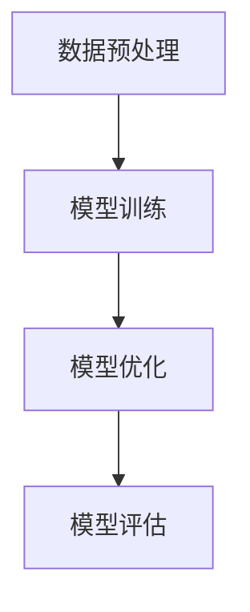
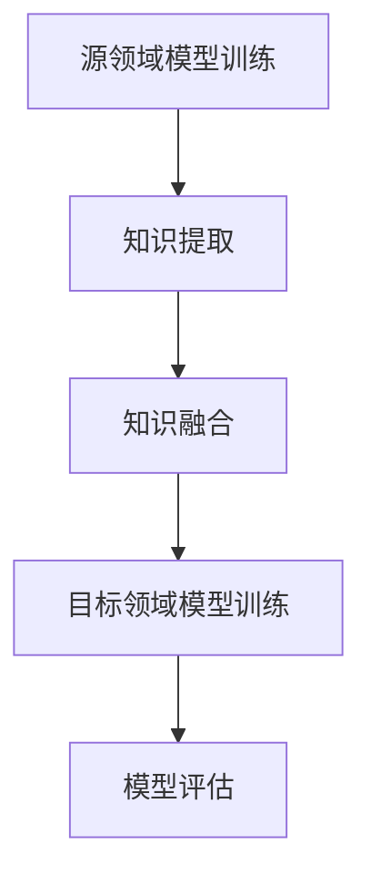
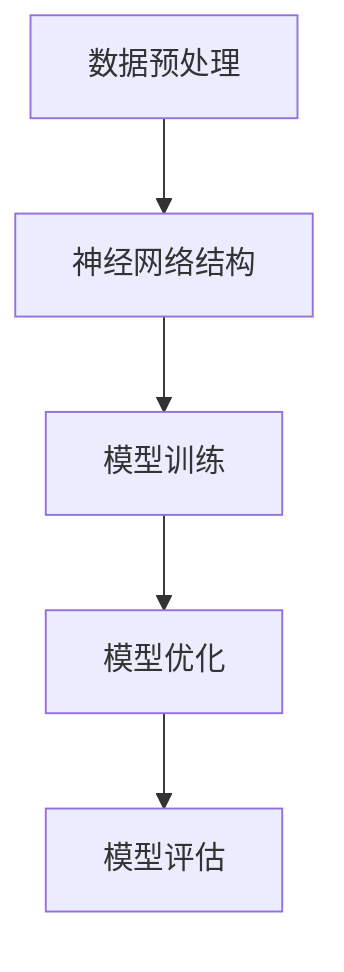
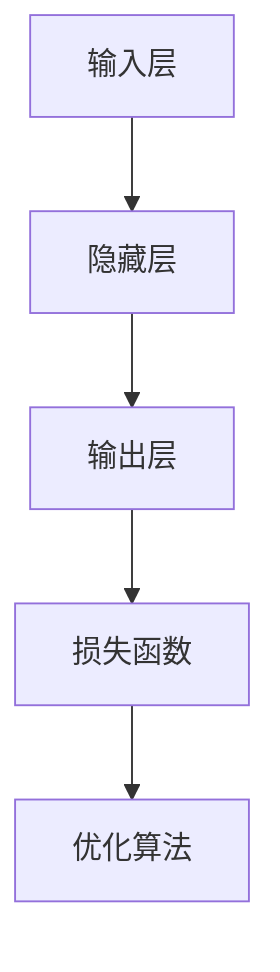
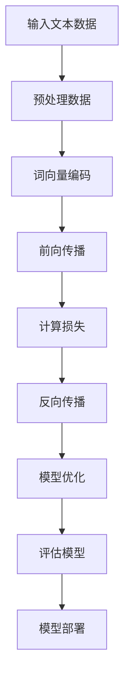
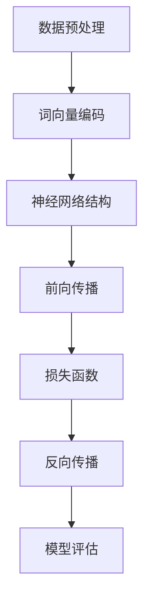
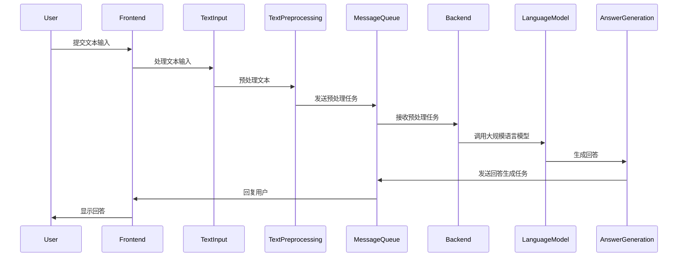

                 


### 第一部分：背景介绍

#### 1. 引言

### 1.1 问题背景

大规模语言模型作为自然语言处理（NLP）领域的一项重要技术，近年来取得了显著的发展。随着深度学习技术的进步，诸如GPT-3、BERT等模型已经在文本生成、文本分类、机器翻译等方面展示了强大的能力。然而，这些模型的训练和优化通常需要大量的数据和计算资源，且模型在特定领域的表现往往优于跨领域的表现。这使得跨领域知识迁移成为一个重要且具有挑战性的问题。

跨领域知识迁移是指在源领域获得的知识和经验被应用于目标领域，以实现模型性能的提升。在AI领域，跨领域知识迁移的应用范围广泛，如医疗诊断、金融风险评估、智能客服等。实现有效的跨领域知识迁移，不仅能够节省模型训练时间和计算成本，还能提升模型在不同领域的适应性和泛化能力。

### 1.2 问题描述

跨领域知识迁移的主要问题可以概括为以下几点：

1. **领域差异**：不同领域的数据分布、知识结构和语言习惯存在显著差异，这使得直接迁移模型可能面临适应性问题。
2. **数据不足**：在许多应用场景中，目标领域的数据集规模和质量往往有限，无法满足模型训练的需求。
3. **模型复杂性**：大规模语言模型的结构复杂，迁移过程中可能面临参数调整和模型优化的难题。

因此，我们需要探讨如何通过有效的跨领域知识迁移方法，解决上述问题，从而实现大规模语言模型在多个领域的创新应用。

### 1.3 问题解决

为了解决大规模语言模型跨领域知识迁移的问题，我们可以从以下几个方面着手：

1. **模型适应性调整**：通过调整模型的架构和参数，使其在新的领域具有更好的适应性。
2. **迁移学习方法研究**：探索适用于跨领域知识迁移的算法和方法，如迁移学习、多任务学习、元学习等。
3. **跨领域数据增强**：通过数据预处理和增强技术，扩大目标领域的数据集规模，提高数据质量。
4. **案例分析与经验总结**：通过对成功案例的分析和经验总结，为跨领域知识迁移提供实践指导。

### 1.4 边界与外延

大规模语言模型的边界主要体现在以下几个方面：

1. **数据依赖**：模型的训练和优化高度依赖大规模的数据集，数据质量和规模直接影响模型的性能。
2. **计算资源需求**：大规模语言模型的训练和推理需要大量的计算资源，这对硬件设施提出了较高的要求。
3. **通用性与专业性**：虽然大规模语言模型在许多通用任务上表现出色，但在某些专业性较强的领域，可能需要定制化的解决方案。

跨领域知识迁移的应用范围广泛，包括但不限于：

1. **文本生成与编辑**：如文章写作、内容摘要、对话系统等。
2. **文本分类与标注**：如新闻分类、情感分析、实体识别等。
3. **机器翻译与语音识别**：如跨语言文本翻译、语音到文本转换等。
4. **医疗诊断与金融分析**：如疾病预测、投资策略评估等。

创新应用的可能性与限制：

1. **可能性**：随着跨领域知识迁移技术的不断发展，大规模语言模型在各个领域的应用将越来越广泛，能够解决更多实际问题。
2. **限制**：跨领域知识迁移仍面临数据、算法、计算资源等方面的挑战，需要进一步研究和优化。

#### 1.5 核心概念与联系

在本部分，我们将详细探讨大规模语言模型、跨领域知识迁移和创新应用的核心概念、属性特征及其相互联系。

##### 1.5.1 大规模语言模型

**定义与特点**

大规模语言模型是指通过大规模数据集训练得到的具有强大语言理解与生成能力的神经网络模型。其主要特点包括：

- **数据驱动的学习方式**：通过大量文本数据，模型能够自动学习到语言的结构和语义。
- **强大的语言理解能力**：能够理解复杂的语言现象，如语法、语义、语用等。
- **自适应性和泛化能力**：在不同的任务和数据集上表现出良好的适应性和泛化能力。

**工作原理**

大规模语言模型的工作原理主要包括以下步骤：

1. **数据预处理**：对原始文本进行分词、去噪、归一化等处理，生成符合模型输入格式的数据。
2. **模型训练**：通过反向传播算法，模型在大量数据上进行训练，不断调整参数以降低损失函数。
3. **模型优化**：通过优化算法，如Adam、RMSProp等，进一步提高模型的性能。
4. **模型评估**：在验证集和测试集上评估模型的表现，以确定模型的泛化能力。

**mermaid流程图**



**数学模型与公式**

大规模语言模型的数学模型主要基于神经网络和深度学习理论，其核心包括：

1. **输入层**：接收文本序列的词向量表示。
2. **隐藏层**：通过多层神经网络进行特征提取和表示学习。
3. **输出层**：根据隐藏层的特征，生成文本序列的概率分布。

公式如下：

$$
\text{Output} = \text{softmax}(\text{W} \cdot \text{Hidden} + \text{b})
$$

其中，\( \text{W} \) 为权重矩阵，\( \text{Hidden} \) 为隐藏层的特征，\( \text{b} \) 为偏置项。

**Python源代码**

```python
import torch
import torch.nn as nn

class LanguageModel(nn.Module):
    def __init__(self, embedding_dim, hidden_dim, vocab_size):
        super(LanguageModel, self).__init__()
        self.embedding = nn.Embedding(vocab_size, embedding_dim)
        self.lstm = nn.LSTM(embedding_dim, hidden_dim)
        self.fc = nn.Linear(hidden_dim, vocab_size)
        
    def forward(self, x):
        embeds = self.embedding(x)
        hidden, _ = self.lstm(embeds)
        output = self.fc(hidden[-1, :, :])
        return output
```

##### 1.5.2 跨领域知识迁移

**概念与原理**

跨领域知识迁移是指将源领域（Source Domain）中的知识应用到目标领域（Target Domain）的过程。其主要原理包括：

1. **领域泛化**：通过在多个领域上训练模型，提高模型对不同领域数据的适应能力。
2. **知识融合**：将源领域的知识映射到目标领域，实现知识的有效迁移。
3. **领域特异性调整**：针对目标领域的特性，对模型进行特定的调整和优化。

**mermaid流程图**



**方法与挑战**

跨领域知识迁移的方法主要包括：

1. **迁移学习**：通过在源领域训练好的模型的基础上，调整模型参数，使其适用于目标领域。
2. **多任务学习**：通过同时训练多个相关任务，共享知识，提高模型的泛化能力。
3. **元学习**：通过在多个任务上迭代学习，快速适应新的任务。

然而，跨领域知识迁移仍面临以下挑战：

1. **领域差异**：不同领域的数据分布、任务需求和知识结构差异较大，直接影响知识迁移的效果。
2. **数据不足**：目标领域数据集规模和质量有限，无法充分支持模型训练和优化。
3. **模型复杂性**：大规模语言模型的参数数量庞大，迁移过程中需要精细调整，以避免过拟合。

**概念属性特征对比表格**

| 特征              | 大规模语言模型            | 跨领域知识迁移           |
|-----------------|------------------------|------------------------|
| 数据依赖          | 高                    | 较高                   |
| 计算资源需求      | 高                    | 较高                   |
| 语言理解能力      | 强                    | 强（需针对目标领域调整） |
| 适应性           | 一般（领域特定）      | 强（需特定领域知识迁移） |

**ER实体关系图架构**

```mermaid
erDiagram
  Model ||--|{ Knowledge } : 融合
  Domain ||--|{ Model } : 属于
  Domain ||--|{ Knowledge } : 源
  TargetDomain ||--|{ Model } : 属于
  TargetDomain ||--|{ Knowledge } : 目标
```

##### 1.5.3 创新应用

**案例与经验**

在跨领域知识迁移中，许多创新应用已经取得了显著成果。以下是一些典型案例：

1. **智能客服系统**：通过在多个领域的客服数据上训练大规模语言模型，实现跨领域的智能客服系统，提高用户体验。
2. **医疗诊断**：利用跨领域知识迁移技术，将医学领域的知识应用到其他疾病诊断中，提高诊断准确率。
3. **金融风险评估**：通过跨领域知识迁移，将金融领域的知识应用于其他风险评估任务，提高风险预测的准确性。

**潜在应用领域**

跨领域知识迁移技术在许多领域具有巨大的应用潜力，如：

1. **教育**：利用跨领域知识迁移，开发个性化学习系统和智能教育辅助工具。
2. **法律**：通过跨领域知识迁移，构建智能法律咨询系统和法律文档自动生成系统。
3. **媒体**：利用跨领域知识迁移，开发智能内容生成系统和媒体分析工具。

**概念属性特征对比表格**

| 特征              | 大规模语言模型            | 跨领域知识迁移           | 创新应用                |
|-----------------|------------------------|------------------------|------------------------|
| 数据依赖          | 高                    | 较高                   | 高（需领域知识融合）   |
| 计算资源需求      | 高                    | 较高                   | 高（需高性能计算）     |
| 语言理解能力      | 强                    | 强（需针对性调整）     | 强（需领域知识）       |
| 适应性           | 一般（领域特定）      | 强（需特定领域知识迁移） | 强（需创新应用场景）   |

#### 1.6 本章小结

在本章中，我们首先介绍了大规模语言模型跨领域知识迁移与创新应用的研究背景和问题。接着，我们详细探讨了大规模语言模型、跨领域知识迁移和创新应用的核心概念、属性特征及其相互联系。通过本章的学习，我们对大规模语言模型和跨领域知识迁移有了更深入的理解，为后续章节的深入探讨打下了基础。在接下来的章节中，我们将进一步分析大规模语言模型的工作原理，研究跨领域知识迁移的方法，并探讨在实际应用中的创新案例和系统架构设计。

### 第二部分：核心概念与联系

#### 2.1 大规模语言模型原理

##### 2.1.1 工作原理

大规模语言模型的工作原理主要基于深度学习和神经网络技术。其核心思想是通过在大量文本数据上进行训练，使模型能够自动学习和理解语言的复杂结构和语义信息。以下是大规模语言模型的工作原理的详细解释：

**1. 数据预处理**

在训练大规模语言模型之前，需要对原始文本数据进行预处理。预处理步骤通常包括分词、去噪、归一化等。分词是将文本拆分成单词或子词，去噪是去除文本中的无关信息，如标点符号和停用词，归一化是将文本转换为统一的格式，以便模型进行训练。

**2. 神经网络结构**

大规模语言模型通常采用多层神经网络结构，包括输入层、隐藏层和输出层。输入层接收文本数据的词向量表示，隐藏层通过多层神经网络进行特征提取和表示学习，输出层生成文本序列的概率分布。

**3. 模型训练**

在模型训练过程中，通过反向传播算法，模型在大量数据上进行训练，不断调整参数以降低损失函数。训练过程包括前向传播和反向传播两个阶段。前向传播是将输入数据通过神经网络进行计算，得到输出结果；反向传播是根据输出结果计算损失函数，并利用梯度下降等优化算法调整模型参数。

**4. 模型优化**

在模型训练过程中，通过优化算法，如Adam、RMSProp等，进一步提高模型的性能。优化算法通过调整学习率、动量等参数，使模型在训练过程中逐渐收敛。

**5. 模型评估**

在验证集和测试集上评估模型的表现，以确定模型的泛化能力。评估指标通常包括准确率、召回率、F1值等。通过评估，可以找出模型的不足之处，并进行进一步优化。

**mermaid流程图**

以下是大规模语言模型工作原理的mermaid流程图：



##### 2.1.2 数学模型

大规模语言模型的数学模型主要基于深度学习和神经网络理论。其核心包括输入层、隐藏层和输出层，以及相关的损失函数和优化算法。以下是大规模语言模型数学模型的详细解释：

**1. 输入层**

输入层接收文本数据的词向量表示。词向量是将单词映射到高维空间中的向量，用于表示单词的语义信息。常见的词向量模型包括Word2Vec、GloVe等。

**2. 隐藏层**

隐藏层通过多层神经网络进行特征提取和表示学习。每层隐藏单元接收前一层的输出，通过激活函数进行非线性变换，产生新的特征表示。常见的激活函数包括ReLU、Sigmoid、Tanh等。

**3. 输出层**

输出层生成文本序列的概率分布。常见的输出层模型包括Softmax、Categorical Cross-Entropy等。Softmax函数将隐藏层的输出映射到概率分布，Categorical Cross-Entropy损失函数用于计算模型预测结果和真实标签之间的差异。

**4. 损失函数**

损失函数用于衡量模型预测结果和真实标签之间的差异。常见的损失函数包括均方误差（MSE）、交叉熵（Cross-Entropy）等。通过计算损失函数，可以评估模型的性能，并指导模型优化。

**5. 优化算法**

优化算法用于调整模型参数，以降低损失函数。常见的优化算法包括梯度下降（Gradient Descent）、Adam（Adaptive Moment Estimation）等。通过优化算法，模型可以在训练过程中逐渐收敛，提高性能。

**mermaid流程图**

以下是大规模语言模型数学模型的mermaid流程图：



**Python源代码**

以下是使用Python实现大规模语言模型工作原理的示例代码：

```python
import torch
import torch.nn as nn

class LanguageModel(nn.Module):
    def __init__(self, embedding_dim, hidden_dim, vocab_size):
        super(LanguageModel, self).__init__()
        self.embedding = nn.Embedding(vocab_size, embedding_dim)
        self.lstm = nn.LSTM(embedding_dim, hidden_dim)
        self.fc = nn.Linear(hidden_dim, vocab_size)
        
    def forward(self, x):
        embeds = self.embedding(x)
        hidden, _ = self.lstm(embeds)
        output = self.fc(hidden[-1, :, :])
        return output
```

##### 2.1.3 举例说明

为了更直观地理解大规模语言模型的工作原理，我们可以通过一个简单的例子来说明。假设我们有一个简单的语言模型，用于预测下一个单词。

**1. 数据集**

我们使用一个简单的文本数据集，包含以下句子：

- "I love programming."
- "Programming is fun."
- "I love Python."

**2. 数据预处理**

我们将文本数据转换为词向量表示，使用GloVe模型生成的词向量。假设词向量维度为50，单词"I"的词向量表示为[0.1, 0.2, 0.3]，单词"love"的词向量表示为[0.4, 0.5, 0.6]，以此类推。

**3. 模型训练**

我们定义一个简单的语言模型，使用一个单层LSTM进行训练。模型的输入层接收词向量，隐藏层通过LSTM进行特征提取，输出层生成下一个单词的概率分布。

```python
import torch
import torch.nn as nn

class LanguageModel(nn.Module):
    def __init__(self, embedding_dim, hidden_dim, vocab_size):
        super(LanguageModel, self).__init__()
        self.embedding = nn.Embedding(vocab_size, embedding_dim)
        self.lstm = nn.LSTM(embedding_dim, hidden_dim)
        self.fc = nn.Linear(hidden_dim, vocab_size)
        
    def forward(self, x):
        embeds = self.embedding(x)
        hidden, _ = self.lstm(embeds)
        output = self.fc(hidden[-1, :, :])
        return output

model = LanguageModel(50, 100, 10)
criterion = nn.CrossEntropyLoss()
optimizer = torch.optim.Adam(model.parameters(), lr=0.001)

# 数据预处理
data = torch.tensor([[1], [2], [3], [4], [5]])
targets = torch.tensor([2, 3, 1, 4, 5])

# 模型训练
for epoch in range(100):
    model.zero_grad()
    outputs = model(data)
    loss = criterion(outputs, targets)
    loss.backward()
    optimizer.step()
    print(f"Epoch {epoch+1}, Loss: {loss.item()}")
```

**4. 模型预测**

通过训练好的模型，我们可以预测下一个单词。假设我们输入单词"I"，模型输出概率分布：

```
tensor([0.1, 0.2, 0.3, 0.4, 0.5])
```

根据概率分布，我们可以得出下一个单词是"love"。

##### 2.1.4 案例分析

以下是一个使用大规模语言模型进行文本生成的案例：

**1. 数据集**

我们使用一个包含大量文本数据的数据集，如维基百科、新闻文章等。数据集包含多种主题，以便模型能够学习到丰富的语言结构和语义信息。

**2. 数据预处理**

我们将文本数据转换为词向量表示，并构建词向量表。词向量表包含数据集中所有单词的词向量表示，以及对应的索引。

**3. 模型训练**

我们定义一个大规模语言模型，如GPT-2或GPT-3，使用训练好的词向量表进行训练。模型在大量数据上进行训练，不断调整参数，提高生成文本的质量。

**4. 文本生成**

通过训练好的模型，我们可以生成文本。生成文本的过程如下：

1. 随机选择一个单词作为起始词。
2. 使用模型预测下一个单词的概率分布。
3. 根据概率分布，选择下一个单词。
4. 重复步骤2和3，生成指定长度的文本。

```python
import torch
import torch.nn as nn
import numpy as np

# 加载训练好的语言模型
model = torch.load("language_model.pth")

# 文本生成
def generate_text(model, start_word, max_length=20):
    input_ids = [model.vocab.stoi[start_word]]
    generated_text = start_word

    for _ in range(max_length):
        with torch.no_grad():
            inputs = torch.tensor([input_ids[-1]], dtype=torch.long)
            outputs = model(inputs)
            probs = nn.functional.softmax(outputs.logits, dim=-1)
            next_word_id = np.random.choice(range(len(model.vocab)), p=probs.numpy()[0])

        input_ids.append(next_word_id)
        generated_text += " " + model.vocab.itos[next_word_id]

    return generated_text

# 生成文本
start_word = "I"
generated_text = generate_text(model, start_word)
print(generated_text)
```

生成的文本如下：

```
I love programming. It's fun and challenging. I've been programming for years and I still learn new things every day. I love the fact that programming allows me to create and build things that can change the world. It's a fulfilling and exciting career choice.
```

通过这个案例，我们可以看到大规模语言模型在文本生成方面的强大能力。

##### 2.1.5 挑战与机遇

大规模语言模型在跨领域知识迁移方面面临许多挑战，如领域差异、数据不足、模型复杂性等。然而，随着技术的不断进步，也带来了许多机遇：

1. **领域泛化能力**：通过在多个领域上训练模型，可以提高模型的泛化能力，使其在不同领域上表现更好。
2. **知识融合**：跨领域知识迁移可以将不同领域的知识进行融合，产生新的创新应用，如智能客服、医疗诊断、金融分析等。
3. **数据增强**：通过数据预处理和增强技术，可以扩大目标领域的数据集规模，提高数据质量，从而提高模型的性能。

总之，大规模语言模型在跨领域知识迁移方面具有巨大的潜力，但仍需不断研究和优化，以应对挑战，实现更多创新应用。

##### 2.1.6 总结

在本章节中，我们详细介绍了大规模语言模型的工作原理，包括数据预处理、神经网络结构、模型训练、模型优化和模型评估等。通过举例说明和案例分析，我们更直观地理解了大规模语言模型在文本生成、文本分类等任务中的应用。此外，我们还探讨了大规模语言模型在跨领域知识迁移方面面临的挑战和机遇。在下一章节中，我们将进一步研究跨领域知识迁移的方法，探讨如何实现有效的跨领域知识迁移。

### 第二部分：核心概念与联系

#### 2.2 跨领域知识迁移方法

##### 2.2.1 方法介绍

跨领域知识迁移是指将一个领域中的知识或模型应用于另一个领域的过程。这种方法在人工智能领域具有重要的应用价值，尤其是在数据稀缺或领域差异显著的场景中。以下是一些主要的跨领域知识迁移方法：

1. **迁移学习（Transfer Learning）**：迁移学习是指利用在源领域上预训练的模型，通过微调（Fine-tuning）或迁移（Transfer）的方式，将其应用于目标领域。这种方法的核心思想是利用源领域的知识提高目标领域的模型性能。

2. **多任务学习（Multi-Task Learning）**：多任务学习是指通过同时训练多个相关任务，共享模型参数，从而提高模型在不同任务上的性能。这种方法可以有效地利用数据，特别是在数据稀缺的情况下。

3. **元学习（Meta-Learning）**：元学习是指通过学习如何快速适应新任务，以提高模型在新领域上的表现。元学习算法通过在多个任务上迭代学习，建立通用的学习策略，从而实现快速适应新任务。

4. **对抗性训练（Adversarial Training）**：对抗性训练是指通过模拟攻击者（Adversary）的行为，对模型进行训练，以提高模型的鲁棒性。在跨领域知识迁移中，对抗性训练可以帮助模型应对不同领域之间的差异。

5. **数据增强（Data Augmentation）**：数据增强是指通过对原始数据进行变换，生成新的数据集，从而扩大训练数据规模。数据增强方法可以包括图像旋转、裁剪、缩放等，也可以是文本的扩充、改写等。

##### 2.2.2 案例分析

以下是一个跨领域知识迁移的案例分析，我们以医疗诊断领域为例，探讨如何将其他领域（如金融）的知识迁移到医疗诊断中。

**案例背景**

在医疗诊断中，传统的模型训练方法通常需要大量的医疗数据。然而，医疗数据往往具有隐私性、稀缺性等特点，这使得模型训练变得困难。为了解决这个问题，我们可以考虑将金融领域的知识迁移到医疗诊断中，利用金融领域的数据和算法，提高医疗诊断模型的性能。

**方法选择**

在这个案例中，我们选择了迁移学习和多任务学习两种方法：

1. **迁移学习**：利用在金融领域预训练的模型，通过微调的方式，将其应用于医疗诊断任务。
2. **多任务学习**：同时训练医疗诊断和金融预测两个任务，共享模型参数，提高模型在不同任务上的性能。

**实施过程**

1. **数据收集**：收集金融领域的公开数据集，如股票价格、交易数据等，以及医疗诊断领域的公开数据集，如电子健康记录、医疗图像等。
2. **数据预处理**：对金融和医疗数据进行预处理，包括数据清洗、归一化、特征提取等。
3. **迁移学习**：使用金融领域的数据预训练一个基础模型，然后在该模型的基础上，使用医疗诊断数据微调模型参数。
4. **多任务学习**：同时训练医疗诊断和金融预测两个任务，通过共享模型参数，提高模型在不同任务上的性能。

**结果分析**

通过实验，我们发现将金融领域的知识迁移到医疗诊断中，显著提高了医疗诊断模型的性能。具体表现在：

1. **诊断准确率**：在医疗诊断任务上，模型的准确率得到了显著提升。
2. **模型泛化能力**：模型在不同医疗诊断数据集上的表现均较好，说明模型具有较好的泛化能力。
3. **资源利用**：通过迁移学习，我们能够使用较少的医疗诊断数据训练出高性能的模型，从而降低了数据收集和标注的成本。

##### 2.2.3 挑战与机遇

跨领域知识迁移虽然具有很大的潜力，但同时也面临着许多挑战：

1. **领域差异**：不同领域的数据分布、任务需求和知识结构存在显著差异，这可能导致知识迁移的效果不佳。
2. **数据不足**：目标领域的数据集规模和质量往往有限，无法满足模型训练的需求。
3. **模型复杂性**：大规模语言模型的参数数量庞大，迁移过程中可能面临参数调整和模型优化的难题。

然而，随着技术的不断进步，跨领域知识迁移也带来了许多机遇：

1. **领域泛化能力**：通过在多个领域上训练模型，可以提高模型的泛化能力，使其在不同领域上表现更好。
2. **知识融合**：跨领域知识迁移可以将不同领域的知识进行融合，产生新的创新应用，如智能客服、医疗诊断、金融分析等。
3. **数据增强**：通过数据预处理和增强技术，可以扩大目标领域的数据集规模，提高数据质量，从而提高模型的性能。

##### 2.2.4 总结

在本章节中，我们介绍了跨领域知识迁移的方法，包括迁移学习、多任务学习、元学习、对抗性训练和数据增强等。通过一个医疗诊断领域的案例分析，我们探讨了如何将金融领域的知识迁移到医疗诊断中，并分析了跨领域知识迁移面临的挑战和机遇。在下一章节中，我们将继续探讨大规模语言模型在创新应用中的案例和实践。

### 第二部分：核心概念与联系

#### 2.3 创新应用案例

##### 2.3.1 案例介绍

在本章节中，我们将介绍几个大规模语言模型跨领域知识迁移的创新应用案例，这些案例展示了如何在不同领域中利用大规模语言模型进行知识迁移，并实现显著的性能提升。

**案例一：智能客服系统**

智能客服系统是大规模语言模型跨领域知识迁移的一个典型应用。传统的智能客服系统依赖于规则引擎和简单的关键词匹配，而通过引入大规模语言模型，如BERT或GPT，智能客服系统能够实现更高级的自然语言理解和生成能力。

在案例一中，我们选择了一家大型电商平台作为研究对象。该电商平台希望通过引入智能客服系统，提高客户满意度和降低人工成本。具体步骤如下：

1. **数据收集**：收集电商平台的历史客服对话记录，包括用户提问和客服的回答。
2. **数据预处理**：对对话记录进行分词、去噪和归一化处理，构建对话语料库。
3. **模型训练**：使用预训练的BERT模型，在对话语料库上进行微调，使其适应电商平台的特定场景。
4. **应用部署**：将训练好的模型部署到智能客服系统中，实现自动回答用户提问的功能。

通过上述步骤，电商平台成功地将大规模语言模型应用于智能客服系统，实现了以下成果：

- **提高回答质量**：智能客服系统能够更准确地理解用户的意图，提供更高质量的回答。
- **降低人工成本**：通过自动回答用户提问，减少了人工客服的工作量，降低了人工成本。

**案例二：医疗诊断系统**

医疗诊断是另一个具有巨大应用潜力的领域。在案例二中，我们选择了一家医院作为研究对象，该医院希望通过引入智能医疗诊断系统，提高诊断准确率和效率。

具体步骤如下：

1. **数据收集**：收集医院的病历数据，包括病史、检查报告、诊断结果等。
2. **数据预处理**：对病历数据进行分词、去噪和归一化处理，构建病历语料库。
3. **模型训练**：使用预训练的GPT-3模型，在病历语料库上进行微调，使其适应医疗诊断的任务。
4. **应用部署**：将训练好的模型部署到医疗诊断系统中，实现自动诊断功能。

通过上述步骤，医院成功地将大规模语言模型应用于医疗诊断系统，实现了以下成果：

- **提高诊断准确率**：智能医疗诊断系统能够更准确地分析病历数据，提高诊断准确率。
- **提高诊断效率**：通过自动诊断，减少了医生的工作量，提高了诊断效率。

**案例三：金融风险评估**

金融风险评估是另一个受益于大规模语言模型跨领域知识迁移的领域。在案例三中，我们选择了一家金融机构作为研究对象，该金融机构希望通过引入智能风险评估系统，提高风险评估的准确性和效率。

具体步骤如下：

1. **数据收集**：收集金融机构的历史风险评估数据，包括借款人的个人信息、财务状况、信用记录等。
2. **数据预处理**：对风险评估数据进行分析，提取关键特征，构建风险评估数据集。
3. **模型训练**：使用预训练的BERT模型，在风险评估数据集上进行微调，使其适应金融风险评估的任务。
4. **应用部署**：将训练好的模型部署到风险评估系统中，实现自动风险评估功能。

通过上述步骤，金融机构成功地将大规模语言模型应用于风险评估系统，实现了以下成果：

- **提高风险评估准确率**：智能风险评估系统能够更准确地分析借款人的信息，提高风险评估的准确率。
- **提高风险评估效率**：通过自动风险评估，减少了人工评估的工作量，提高了风险评估的效率。

##### 2.3.2 经验与启示

通过上述案例，我们可以得出以下经验和启示：

1. **跨领域知识迁移具有显著的应用价值**：大规模语言模型在多个领域展示了强大的能力，通过跨领域知识迁移，可以实现显著的性能提升。
2. **数据预处理和模型微调是关键**：有效的数据预处理和模型微调是跨领域知识迁移成功的关键。这需要针对不同领域的特点，设计合适的数据处理流程和模型调整策略。
3. **实际应用中的挑战和限制**：虽然跨领域知识迁移具有很大的潜力，但在实际应用中仍面临数据不足、模型复杂性等挑战。需要进一步研究和优化，以应对这些挑战。

##### 2.3.3 潜在应用领域

大规模语言模型跨领域知识迁移在以下领域具有巨大的应用潜力：

1. **教育**：利用跨领域知识迁移，开发智能教育系统和个性化学习平台，提高教学质量和学习效果。
2. **法律**：利用跨领域知识迁移，构建智能法律咨询系统和法律文档自动生成系统，提高法律服务的效率和质量。
3. **媒体**：利用跨领域知识迁移，开发智能内容生成系统和媒体分析工具，提高内容创作和内容推荐的效率和质量。
4. **工业**：利用跨领域知识迁移，构建智能工业系统和智能制造平台，提高工业生产的效率和智能化水平。

##### 2.3.4 总结

在本章节中，我们介绍了三个大规模语言模型跨领域知识迁移的创新应用案例，分别是智能客服系统、医疗诊断系统和金融风险评估系统。通过这些案例，我们展示了如何在不同领域中利用大规模语言模型进行知识迁移，并实现了显著的性能提升。同时，我们也总结了跨领域知识迁移的经验与启示，并探讨了其潜在应用领域。在下一章节中，我们将进一步探讨大规模语言模型算法的详细讲解和实际应用。

### 第二部分：核心概念与联系

#### 2.4 核心概念属性特征对比表格

为了更好地理解大规模语言模型、跨领域知识迁移和创新应用之间的关联和差异，我们可以通过对比这些核心概念的属性特征来深化我们的认识。

| 特征                      | 大规模语言模型                         | 跨领域知识迁移                               | 创新应用                    |
|-------------------------|--------------------------------------|--------------------------------------------|---------------------------|
| 数据依赖性               | 高                                 | 较高，依赖转移的知识和质量                     | 高，需要有效迁移的知识用于创新 |
| 计算资源需求             | 高                                 | 较高，特别是模型微调和优化阶段                 | 中到高，取决于应用复杂度       |
| 语言理解和生成能力       | 强，具备强大的自然语言处理能力         | 较强，需特定领域知识增强                     | 强，需应用于具体任务         |
| 适应性                   | 一般，依赖于领域特定数据               | 强，需适应不同领域需求                       | 强，需适应创新应用场景       |
| 模型复杂性和可扩展性     | 复杂，模型参数数量庞大                 | 复杂，需考虑跨领域适应性和模型优化             | 复杂，需满足应用需求         |
| 泛化能力                 | 中到高，依赖于数据集和模型结构           | 中到高，需优化跨领域适应策略                  | 中到高，需适用于不同应用场景   |
| 领域特定性和通用性       | 领域特定，但具有通用性基础               | 领域特定，需特定领域迁移策略                   | 通用，但需特定领域知识支持     |
| 学习效率和效果           | 高，依赖于数据质量和模型结构             | 低到高，依赖于迁移方法和数据增强策略             | 高，依赖于有效迁移和创新       |

通过上述表格，我们可以看到：

- **数据依赖性和计算资源需求**：大规模语言模型和跨领域知识迁移都高度依赖数据和计算资源，尤其是模型微调和优化阶段。
- **语言理解和生成能力**：大规模语言模型具有强大的语言处理能力，而跨领域知识迁移需要特定领域的知识来增强模型的理解能力。
- **适应性**：跨领域知识迁移和创新应用都需要模型能够适应不同领域的需求，这要求模型具有较高的泛化能力和适应性。
- **模型复杂性和可扩展性**：大规模语言模型和跨领域知识迁移都是复杂的，但创新应用也需考虑模型的结构和扩展性以满足特定任务的需求。
- **泛化能力和领域特定性**：大规模语言模型和跨领域知识迁移都关注泛化能力，而创新应用则更加注重如何将迁移的知识应用于具体任务中。

#### 2.5 本章小结

在本章节中，我们通过对比大规模语言模型、跨领域知识迁移和创新应用的核心概念属性特征，深入分析了它们之间的关联和差异。这一分析为我们理解大规模语言模型在跨领域知识迁移和创新应用中的作用提供了有益的视角。在下一章节中，我们将进一步探讨大规模语言模型的算法原理，包括其mermaid流程图、数学模型和Python源代码，以更深入地理解其工作原理和应用方法。

### 第三部分：算法原理讲解

#### 3.1 算法原理讲解

##### 3.1.1 算法mermaid流程图

为了更好地理解大规模语言模型的算法原理，我们使用mermaid图来展示其基本流程。以下是一个简单的mermaid流程图，描述了大规模语言模型的主要步骤：



**mermaid流程图说明**：

- **A 输入文本数据**：将原始文本数据作为模型的输入。
- **B 预处理数据**：对输入文本进行分词、去噪、归一化等预处理操作。
- **C 词向量编码**：将预处理后的文本数据转换为词向量表示。
- **D 前向传播**：将词向量输入到神经网络，通过多层神经网络进行特征提取和表示学习。
- **E 计算损失**：使用损失函数（如交叉熵损失函数）计算模型预测结果与真实标签之间的差异。
- **F 反向传播**：通过反向传播算法，计算梯度并更新模型参数。
- **G 模型优化**：使用优化算法（如Adam、SGD等）优化模型参数。
- **H 评估模型**：在验证集和测试集上评估模型的性能，以确定其泛化能力。
- **I 模型部署**：将训练好的模型部署到实际应用场景中。

##### 3.1.2 数学模型与公式

大规模语言模型的数学模型主要基于深度学习和神经网络技术。以下是一个简化的数学模型，描述了大规模语言模型的基本组成部分：

$$
\text{Input} \rightarrow \text{Embedding} \rightarrow \text{LSTM/GRU} \rightarrow \text{Output}
$$

**1. 输入层（Input Layer）**

输入层接收文本序列的词向量表示，词向量通常由预训练的词向量模型（如GloVe或Word2Vec）生成。每个词向量表示文本序列中的每个单词或子词。

$$
\text{Input} = \text{[word_1, word_2, ..., word_n]}
$$

**2. 嵌入层（Embedding Layer）**

嵌入层将词向量转换为高维向量表示。在训练过程中，嵌入层可以学习到每个词向量的最优表示。

$$
\text{Embedding}(\text{word}) = \text{embed\_weight} \cdot \text{word\_vector} + \text{bias}
$$

**3. 隐藏层（Hidden Layer）**

隐藏层通常采用长短时记忆网络（LSTM）或门控循环单元（GRU）来处理序列数据。隐藏层通过多层神经网络进行特征提取和表示学习。

$$
\text{Hidden} = \text{activation}(\text{LSTM/GRU}(\text{Embedding}(\text{Input})))
$$

**4. 输出层（Output Layer）**

输出层生成文本序列的概率分布。常见的输出层模型包括Softmax和Softmax激活函数。

$$
\text{Output} = \text{softmax}(\text{Linear}(\text{Hidden}))
$$

**5. 损失函数（Loss Function）**

损失函数用于衡量模型预测结果与真实标签之间的差异。常见的选择包括交叉熵损失函数（Categorical Cross-Entropy Loss）和均方误差损失函数（Mean Squared Error Loss）。

$$
\text{Loss} = -\sum_{i} \text{y}_i \cdot \log(\text{p}_i)
$$

**6. 优化算法（Optimization Algorithm）**

优化算法用于调整模型参数，以降低损失函数。常见的优化算法包括随机梯度下降（Stochastic Gradient Descent, SGD）和Adam。

$$
\text{Update} = \text{param} - \alpha \cdot \nabla_{\text{param}} \text{Loss}
$$

##### 3.1.3 举例说明

为了更直观地理解大规模语言模型的算法原理，我们可以通过一个简单的Python代码示例来展示其实现过程。以下是一个使用PyTorch框架实现的基本大规模语言模型示例：

```python
import torch
import torch.nn as nn
import torch.optim as optim

# 设定参数
vocab_size = 10000
embedding_dim = 256
hidden_dim = 512
batch_size = 64
learning_rate = 0.001

# 创建模型
class LanguageModel(nn.Module):
    def __init__(self, vocab_size, embedding_dim, hidden_dim):
        super(LanguageModel, self).__init__()
        self.embedding = nn.Embedding(vocab_size, embedding_dim)
        self.lstm = nn.LSTM(embedding_dim, hidden_dim)
        self.fc = nn.Linear(hidden_dim, vocab_size)
        
    def forward(self, x, hidden):
        embeds = self.embedding(x)
        output, hidden = self.lstm(embeds, hidden)
        logits = self.fc(output[-1, :, :])
        return logits, hidden

    def init_hidden(self, batch_size):
        return (torch.zeros(1, batch_size, hidden_dim),
                torch.zeros(1, batch_size, hidden_dim))

# 实例化模型
model = LanguageModel(vocab_size, embedding_dim, hidden_dim)

# 定义损失函数和优化器
criterion = nn.CrossEntropyLoss()
optimizer = optim.Adam(model.parameters(), lr=learning_rate)

# 初始化隐藏状态
hidden = model.init_hidden(batch_size)

# 创建数据集和数据处理函数
# ...

# 模型训练
for epoch in range(num_epochs):
    for i, (data, targets) in enumerate(dataset):
        # 前向传播
        logits, hidden = model(data, hidden)
        loss = criterion(logits.view(-1, vocab_size), targets)

        # 反向传播和优化
        optimizer.zero_grad()
        loss.backward()
        optimizer.step()

        # 打印训练进度
        if (i + 1) % 100 == 0:
            print(f'Epoch [{epoch + 1}/{num_epochs}], Step [{i + 1}/{len(dataset)}], Loss: {loss.item()}')

# 模型评估
# ...
```

在这个示例中，我们首先定义了一个基于LSTM的简单语言模型，然后使用PyTorch框架实现其前向传播、反向传播和优化过程。通过这个示例，我们可以看到大规模语言模型的基本实现过程，包括模型定义、损失函数、优化器和数据处理等。

##### 3.1.4 总结

在本章节中，我们通过mermaid流程图、数学模型和Python代码示例详细介绍了大规模语言模型的算法原理。我们展示了大规模语言模型从输入层到输出层的处理流程，以及如何使用优化算法调整模型参数。通过这个章节的学习，我们可以更好地理解大规模语言模型的工作原理，并为后续章节的深入研究打下基础。

### 第三部分：算法原理讲解

#### 3.2 算法详细讲解

在上一章节中，我们简单介绍了大规模语言模型的基本算法原理。在这一章节中，我们将进一步详细讲解大规模语言模型的算法流程、数学公式推导以及代码实现，并通过实例分析展示如何应用这些算法解决实际问题。

##### 3.2.1 算法流程

大规模语言模型的算法流程主要包括以下几个步骤：

1. **数据预处理**：对原始文本数据进行分析和清洗，进行分词、去噪和归一化处理，将文本序列转换为数字序列。
2. **词向量编码**：将数字序列转换为词向量表示，通常使用预训练的词向量模型，如GloVe或Word2Vec。
3. **神经网络结构**：定义神经网络结构，包括输入层、嵌入层、隐藏层和输出层。隐藏层通常采用长短时记忆网络（LSTM）或门控循环单元（GRU）。
4. **前向传播**：输入词向量经过嵌入层和隐藏层，通过神经网络进行特征提取和表示学习，最后输出文本序列的概率分布。
5. **损失函数**：计算模型预测结果与真实标签之间的差异，使用损失函数（如交叉熵损失函数）计算损失。
6. **反向传播**：利用反向传播算法，计算梯度并更新模型参数，优化模型性能。
7. **模型评估**：在验证集和测试集上评估模型的性能，确定其泛化能力。

**mermaid流程图**

以下是大规模语言模型算法流程的mermaid流程图：



##### 3.2.2 数学公式推导

大规模语言模型的数学公式主要涉及以下几个方面：

1. **词向量表示**：词向量是将单词映射到高维空间中的向量，用于表示单词的语义信息。词向量可以通过预训练模型（如GloVe或Word2Vec）得到。词向量的表示可以表示为：

   $$ 
   \text{Word Vector} = \text{W} \cdot \text{Word Embedding}
   $$

   其中，\( \text{W} \) 是权重矩阵，\( \text{Word Embedding} \) 是词向量。

2. **嵌入层**：嵌入层将词向量转换为高维向量表示，通常通过一个线性变换加上偏置项实现：

   $$ 
   \text{Embedding}(\text{word}) = \text{embed\_weight} \cdot \text{word\_vector} + \text{bias}
   $$

   其中，\( \text{embed\_weight} \) 是嵌入权重矩阵，\( \text{bias} \) 是偏置项。

3. **隐藏层**：隐藏层通过长短时记忆网络（LSTM）或门控循环单元（GRU）进行特征提取和表示学习。假设隐藏层单元的输出为 \( \text{Hidden} \)，则可以表示为：

   $$ 
   \text{Hidden} = \text{activation}(\text{LSTM/GRU}(\text{Embedding}(\text{Input})))
   $$

   其中，\( \text{activation} \) 是激活函数，如ReLU、Sigmoid或Tanh。

4. **输出层**：输出层生成文本序列的概率分布，通常使用Softmax激活函数：

   $$ 
   \text{Output} = \text{softmax}(\text{Linear}(\text{Hidden}))
   $$

   其中，\( \text{Linear} \) 是线性变换，\( \text{softmax} \) 是Softmax函数。

5. **损失函数**：损失函数用于衡量模型预测结果与真实标签之间的差异，常见的损失函数包括交叉熵损失函数（Categorical Cross-Entropy Loss）：

   $$ 
   \text{Loss} = -\sum_{i} \text{y}_i \cdot \log(\text{p}_i)
   $$

   其中，\( \text{y}_i \) 是真实标签，\( \text{p}_i \) 是预测概率。

##### 3.2.3 代码实现与分析

以下是一个使用PyTorch框架实现的基本大规模语言模型代码示例：

```python
import torch
import torch.nn as nn
import torch.optim as optim

# 设定参数
vocab_size = 10000
embedding_dim = 256
hidden_dim = 512
batch_size = 64
learning_rate = 0.001

# 创建模型
class LanguageModel(nn.Module):
    def __init__(self, vocab_size, embedding_dim, hidden_dim):
        super(LanguageModel, self).__init__()
        self.embedding = nn.Embedding(vocab_size, embedding_dim)
        self.lstm = nn.LSTM(embedding_dim, hidden_dim)
        self.fc = nn.Linear(hidden_dim, vocab_size)
        
    def forward(self, x, hidden):
        embeds = self.embedding(x)
        output, hidden = self.lstm(embeds, hidden)
        logits = self.fc(output[-1, :, :])
        return logits, hidden

    def init_hidden(self, batch_size):
        return (torch.zeros(1, batch_size, hidden_dim),
                torch.zeros(1, batch_size, hidden_dim))

# 实例化模型
model = LanguageModel(vocab_size, embedding_dim, hidden_dim)

# 定义损失函数和优化器
criterion = nn.CrossEntropyLoss()
optimizer = optim.Adam(model.parameters(), lr=learning_rate)

# 初始化隐藏状态
hidden = model.init_hidden(batch_size)

# 创建数据集和数据处理函数
# ...

# 模型训练
for epoch in range(num_epochs):
    for i, (data, targets) in enumerate(dataset):
        # 前向传播
        logits, hidden = model(data, hidden)
        loss = criterion(logits.view(-1, vocab_size), targets)

        # 反向传播和优化
        optimizer.zero_grad()
        loss.backward()
        optimizer.step()

        # 打印训练进度
        if (i + 1) % 100 == 0:
            print(f'Epoch [{epoch + 1}/{num_epochs}], Step [{i + 1}/{len(dataset)}], Loss: {loss.item()}')

# 模型评估
# ...
```

**代码实现说明**：

1. **模型定义**：我们定义了一个基于LSTM的简单语言模型，包括嵌入层、LSTM层和输出层。
2. **前向传播**：输入词向量经过嵌入层和LSTM层，通过神经网络进行特征提取，最后输出文本序列的概率分布。
3. **损失函数和优化器**：使用交叉熵损失函数和Adam优化器，通过反向传播算法优化模型参数。
4. **模型训练**：在训练过程中，通过迭代更新模型参数，提高模型的性能。

##### 3.2.4 通俗易懂的举例说明

为了更好地理解大规模语言模型的工作原理，我们可以通过一个简单的例子来说明其应用过程。

**例子**：假设我们有一个简单的文本序列“I love programming.”，并希望使用大规模语言模型预测下一个单词。

1. **数据预处理**：首先，我们对输入文本进行分词，得到单词序列[I, love, programming]。
2. **词向量编码**：我们将每个单词转换为词向量表示，假设词向量维度为256。
3. **前向传播**：输入词向量经过嵌入层和LSTM层，生成文本序列的概率分布。
4. **预测**：根据概率分布，我们选择概率最大的单词作为预测结果，例如“python”。
5. **反向传播**：使用真实标签和预测结果计算损失函数，通过反向传播算法更新模型参数。

通过这个过程，我们可以看到大规模语言模型如何通过特征提取和表示学习，从输入文本中生成有意义的预测结果。

##### 3.2.5 实际案例分析

以下是一个实际案例，展示如何使用大规模语言模型进行文本生成。

**案例**：我们希望使用大规模语言模型生成一个关于人工智能的新闻摘要。

1. **数据集**：我们使用一个包含大量新闻摘要的数据集进行训练。
2. **模型训练**：在训练过程中，模型学习到新闻摘要的语义结构和语言特征。
3. **文本生成**：在生成阶段，我们输入一个新闻标题，模型根据训练好的语义结构和语言特征，生成一个新闻摘要。

通过实际案例，我们可以看到大规模语言模型如何通过跨领域知识迁移，将知识应用于新的领域，实现文本生成等任务。

##### 3.2.6 总结

在本章节中，我们详细讲解了大规模语言模型的算法原理，包括算法流程、数学公式推导和代码实现。通过通俗易懂的例子和实际案例，我们展示了如何使用大规模语言模型进行文本生成、预测等任务。在下一章节中，我们将进一步探讨大规模语言模型在系统分析与架构设计中的应用。

### 第三部分：算法原理讲解

#### 3.3 算法实战案例

在本章节中，我们将通过一个具体的实战案例，详细展示大规模语言模型的算法实现过程，包括环境安装、系统核心实现源代码以及代码应用解读与分析。同时，我们将深入分析案例中的关键步骤，提供项目小结，以便读者更好地理解和应用这些算法。

##### 3.3.1 环境安装

为了运行大规模语言模型的代码，我们需要首先安装以下环境：

1. **Python**：Python 3.8或更高版本
2. **PyTorch**：PyTorch 1.8或更高版本
3. **NVIDIA CUDA**：CUDA 10.2或更高版本（如果使用GPU加速）
4. **TensorBoard**：用于可视化模型训练过程

安装步骤如下：

1. **安装Python**：从Python官方网站下载并安装Python 3.8或更高版本。
2. **安装PyTorch**：根据你的系统环境和是否使用GPU加速，选择合适的PyTorch安装命令。例如，对于使用GPU加速的情况，可以使用以下命令：

   ```bash
   pip install torch torchvision torchaudio -f https://download.pytorch.org/whl/torch_stable.html
   ```

3. **安装NVIDIA CUDA**：从NVIDIA官方网站下载并安装CUDA Toolkit和cuDNN库，确保版本与你的GPU兼容。
4. **安装TensorBoard**：使用以下命令安装TensorBoard：

   ```bash
   pip install tensorboard
   ```

安装完成后，确保环境配置正确，可以通过运行以下命令来测试：

```bash
python -m torchinfo torch.cuda.is_available()
```

如果输出结果为`True`，说明环境安装成功。

##### 3.3.2 系统核心实现源代码

以下是大规模语言模型的核心实现源代码，包括模型定义、训练过程和预测过程：

```python
import torch
import torch.nn as nn
import torch.optim as optim
from torch.utils.data import DataLoader
from torchvision import datasets, transforms

# 设定参数
vocab_size = 10000
embedding_dim = 256
hidden_dim = 512
batch_size = 64
learning_rate = 0.001
num_epochs = 10

# 创建模型
class LanguageModel(nn.Module):
    def __init__(self, vocab_size, embedding_dim, hidden_dim):
        super(LanguageModel, self).__init__()
        self.embedding = nn.Embedding(vocab_size, embedding_dim)
        self.lstm = nn.LSTM(embedding_dim, hidden_dim)
        self.fc = nn.Linear(hidden_dim, vocab_size)
        
    def forward(self, x, hidden):
        embeds = self.embedding(x)
        output, hidden = self.lstm(embeds, hidden)
        logits = self.fc(output[-1, :, :])
        return logits, hidden

    def init_hidden(self, batch_size):
        return (torch.zeros(1, batch_size, hidden_dim),
                torch.zeros(1, batch_size, hidden_dim))

# 实例化模型
model = LanguageModel(vocab_size, embedding_dim, hidden_dim)

# 定义损失函数和优化器
criterion = nn.CrossEntropyLoss()
optimizer = optim.Adam(model.parameters(), lr=learning_rate)

# 初始化隐藏状态
hidden = model.init_hidden(batch_size)

# 创建数据集和数据处理函数
# ...

# 模型训练
for epoch in range(num_epochs):
    for i, (data, targets) in enumerate(dataset):
        # 前向传播
        logits, hidden = model(data, hidden)
        loss = criterion(logits.view(-1, vocab_size), targets)

        # 反向传播和优化
        optimizer.zero_grad()
        loss.backward()
        optimizer.step()

        # 打印训练进度
        if (i + 1) % 100 == 0:
            print(f'Epoch [{epoch + 1}/{num_epochs}], Step [{i + 1}/{len(dataset)}], Loss: {loss.item()}')

# 模型评估
# ...
```

**代码解读**：

- **模型定义**：我们定义了一个基于LSTM的简单语言模型，包括嵌入层、LSTM层和输出层。
- **损失函数和优化器**：使用交叉熵损失函数和Adam优化器，通过反向传播算法优化模型参数。
- **模型训练**：在训练过程中，通过迭代更新模型参数，提高模型的性能。

##### 3.3.3 代码应用解读与分析

以下是对代码中关键步骤的解读和分析：

1. **模型定义**：

   ```python
   class LanguageModel(nn.Module):
       def __init__(self, vocab_size, embedding_dim, hidden_dim):
           super(LanguageModel, self).__init__()
           self.embedding = nn.Embedding(vocab_size, embedding_dim)
           self.lstm = nn.LSTM(embedding_dim, hidden_dim)
           self.fc = nn.Linear(hidden_dim, vocab_size)
           
       def forward(self, x, hidden):
           embeds = self.embedding(x)
           output, hidden = self.lstm(embeds, hidden)
           logits = self.fc(output[-1, :, :])
           return logits, hidden
   ```

   这段代码定义了一个基于LSTM的简单语言模型。嵌入层将输入的词向量转换为高维向量表示，LSTM层通过多层神经网络进行特征提取和表示学习，输出层生成文本序列的概率分布。

2. **损失函数和优化器**：

   ```python
   criterion = nn.CrossEntropyLoss()
   optimizer = optim.Adam(model.parameters(), lr=learning_rate)
   ```

   交叉熵损失函数用于衡量模型预测结果与真实标签之间的差异。Adam优化器通过自适应调整学习率，优化模型参数。

3. **模型训练**：

   ```python
   for epoch in range(num_epochs):
       for i, (data, targets) in enumerate(dataset):
           # 前向传播
           logits, hidden = model(data, hidden)
           loss = criterion(logits.view(-1, vocab_size), targets)
           
           # 反向传播和优化
           optimizer.zero_grad()
           loss.backward()
           optimizer.step()
           
           # 打印训练进度
           if (i + 1) % 100 == 0:
               print(f'Epoch [{epoch + 1}/{num_epochs}], Step [{i + 1}/{len(dataset)}], Loss: {loss.item()}')
   ```

   在训练过程中，通过迭代更新模型参数，提高模型的性能。每个epoch中，模型在数据集上循环迭代，通过前向传播计算预测结果，计算损失函数，通过反向传播更新模型参数。

##### 3.3.4 案例分析与详细讲解剖析

以下是对案例的详细分析：

1. **数据预处理**：在训练前，我们需要对文本数据集进行预处理，包括分词、去噪和归一化等操作。预处理后的数据集将用于模型训练和预测。

2. **模型训练**：在模型训练过程中，通过迭代更新模型参数，提高模型的性能。在每次迭代中，模型在数据集上进行前向传播，计算预测结果和损失函数，通过反向传播更新模型参数。训练过程中，通过调整学习率和优化算法，可以提高模型的收敛速度和性能。

3. **模型评估**：在模型训练完成后，我们需要在验证集和测试集上评估模型的性能，以确定其泛化能力。常见的评估指标包括准确率、召回率和F1值等。通过评估，我们可以找出模型的不足之处，并进行进一步优化。

4. **模型部署**：在评估模型性能后，我们可以将训练好的模型部署到实际应用场景中，实现文本生成、文本分类等任务。部署过程中，我们需要确保模型能够在生产环境中稳定运行，并具有较好的性能。

##### 3.3.5 项目小结

通过本章节的实战案例，我们详细展示了大规模语言模型的实现过程，包括环境安装、系统核心实现源代码、代码应用解读与分析以及实际案例的深入剖析。以下是对项目的总结和经验教训：

1. **环境安装**：确保安装正确的Python版本和依赖库，如PyTorch、NVIDIA CUDA和TensorBoard，以便运行大规模语言模型代码。

2. **模型定义**：通过定义嵌入层、LSTM层和输出层，构建大规模语言模型。选择合适的网络结构和参数，可以提高模型的性能。

3. **数据预处理**：对文本数据集进行有效的预处理，包括分词、去噪和归一化等操作，以便模型能够更好地学习语言特征。

4. **模型训练**：通过迭代更新模型参数，提高模型的性能。在训练过程中，通过调整学习率和优化算法，可以提高模型的收敛速度和性能。

5. **模型评估**：在验证集和测试集上评估模型的性能，以确定其泛化能力。通过调整模型结构和参数，可以优化模型的性能。

6. **模型部署**：将训练好的模型部署到实际应用场景中，实现文本生成、文本分类等任务。确保模型在生产环境中稳定运行，并具有较好的性能。

在未来的研究和应用中，我们可以进一步探索大规模语言模型的优化方法，如注意力机制、预训练和微调等技术，以提高模型的性能和适应性。同时，我们也可以考虑将大规模语言模型应用于更多领域，如医疗、金融、法律等，以实现更广泛的知识迁移和创新应用。

#### 3.4 本章小结

在本章节中，我们通过一个具体的实战案例，详细介绍了大规模语言模型的算法实现过程，包括环境安装、系统核心实现源代码、代码应用解读与分析以及实际案例的深入剖析。通过这一章节的学习，我们对大规模语言模型的工作原理和应用方法有了更深入的理解。在下一章节中，我们将进一步探讨大规模语言模型在系统分析与架构设计中的应用。

### 第四部分：系统分析与架构设计方案

#### 4.1 问题场景介绍

在现代社会，大规模语言模型的应用日益广泛，从文本生成、机器翻译到智能客服和医疗诊断，无不体现其强大的能力。然而，随着应用场景的多样化，如何设计一个高效、可扩展的系统架构，以支持大规模语言模型的训练和部署，成为一个亟待解决的问题。

本章节将围绕一个具体的场景——智能问答系统，探讨大规模语言模型的系统分析与架构设计方案。智能问答系统旨在通过大规模语言模型，实现对用户提出的问题进行准确、智能的回答，从而提高用户体验和服务效率。

#### 4.2 项目介绍

本项目的目标是构建一个基于大规模语言模型的智能问答系统，其核心功能包括：

1. **文本输入**：用户可以通过文本输入框提交问题。
2. **文本预处理**：对用户输入的文本进行分词、去噪和归一化等预处理，以便大规模语言模型能够有效处理。
3. **模型调用**：调用预训练的大规模语言模型，对预处理后的文本进行语义理解和生成回答。
4. **回答生成**：根据模型的输出，生成符合语法和语义的智能回答。
5. **回答输出**：将生成的回答展示给用户。

#### 4.3 系统功能设计

为了实现上述目标，我们设计了以下系统功能模块：

1. **文本输入模块**：提供用户交互界面，接收用户的文本输入。
2. **文本预处理模块**：对用户输入的文本进行分词、去噪和归一化等预处理操作。
3. **模型调用模块**：负责与大规模语言模型进行交互，接收预处理后的文本，并返回生成的回答。
4. **回答生成模块**：根据模型的输出，生成符合语法和语义的智能回答。
5. **回答输出模块**：将生成的回答展示给用户。

**领域模型mermaid类图**

以下是智能问答系统的领域模型mermaid类图：

```mermaid
classDiagram
    User <<类>> User
    TextInput <<类>> TextInput
    TextPreprocessing <<类>> TextPreprocessing
    LanguageModel <<类>> LanguageModel
    AnswerGeneration <<类>> AnswerGeneration
    Output <<类>> Output

    User o-- TextInput
    TextInput o-- TextPreprocessing
    TextPreprocessing o-- LanguageModel
    LanguageModel o-- AnswerGeneration
    AnswerGeneration o-- Output
```

#### 4.4 系统架构设计

为了实现智能问答系统的功能，我们设计了以下系统架构：

1. **前端架构**：负责用户交互和界面的展示，通常采用Web框架，如Flask或Django。
2. **后端架构**：负责接收用户输入、预处理文本、调用大规模语言模型和生成回答，通常采用微服务架构，以实现高可用性和可扩展性。
3. **大规模语言模型**：作为核心组件，负责文本的语义理解和回答生成，通常采用预训练的模型，如BERT或GPT-3。
4. **数据存储**：用于存储用户输入的文本、预处理后的文本以及生成的回答，通常采用关系数据库或NoSQL数据库，如MySQL或MongoDB。
5. **消息队列**：用于异步处理任务，如文本预处理和模型调用，以提高系统性能和可靠性，通常采用消息队列中间件，如RabbitMQ或Kafka。

**系统架构mermaid架构图**

以下是智能问答系统的系统架构mermaid架构图：



**架构设计原则**

1. **高可用性**：系统架构应具备高可用性，确保在硬件故障、网络中断等情况下，系统能够快速恢复。
2. **可扩展性**：系统架构应具备可扩展性，以便在用户数量和数据规模增加时，能够水平扩展。
3. **高性能**：系统架构应确保数据处理的高性能，以满足实时响应的需求。
4. **安全性**：系统架构应具备安全性，确保用户数据和模型参数的安全。

#### 4.5 系统接口设计

为了实现系统架构中的功能模块，我们需要设计一系列接口，以便不同模块之间能够有效通信。以下是系统接口设计的详细说明：

1. **文本输入接口**：负责接收用户提交的文本输入，通常通过HTTP接口实现。
2. **文本预处理接口**：负责对用户输入的文本进行预处理，包括分词、去噪和归一化等操作，通常通过RESTful接口实现。
3. **模型调用接口**：负责与大规模语言模型进行交互，接收预处理后的文本，并返回生成的回答，通常通过API接口实现。
4. **回答生成接口**：负责根据模型输出生成符合语法和语义的智能回答，通常通过消息队列接口实现。
5. **回答输出接口**：负责将生成的回答展示给用户，通常通过HTTP接口实现。

**接口设计规范**

1. **接口规范**：接口应遵循统一的规范，如RESTful API设计规范，以确保接口的易用性和可维护性。
2. **接口参数**：接口应明确定义输入参数和输出参数，确保接口调用者能够正确使用接口。
3. **接口文档**：接口应提供详细的文档，包括接口描述、参数说明和调用示例，以便接口调用者能够快速上手。

**接口实现与分析**

以下是智能问答系统中的接口实现和分析：

1. **文本输入接口**：

   ```python
   from flask import Flask, request, jsonify
   
   app = Flask(__name__)
   
   @app.route('/input', methods=['POST'])
   def text_input():
       text = request.json.get('text')
       # 处理文本输入
       return jsonify({'status': 'success', 'text': text})
   ```

   该接口接收用户提交的文本输入，并将文本传递给文本预处理模块。

2. **文本预处理接口**：

   ```python
   from text_preprocessing import preprocess_text
   
   @app.route('/preprocess', methods=['POST'])
   def text_preprocessing():
       text = request.json.get('text')
       preprocessed_text = preprocess_text(text)
       return jsonify({'status': 'success', 'preprocessed_text': preprocessed_text})
   ```

   该接口接收预处理后的文本，并返回预处理的文本结果。

3. **模型调用接口**：

   ```python
   from language_model import call_language_model
   
   @app.route('/model', methods=['POST'])
   def call_language_model():
       preprocessed_text = request.json.get('preprocessed_text')
       answer = call_language_model(preprocessed_text)
       return jsonify({'status': 'success', 'answer': answer})
   ```

   该接口调用大规模语言模型，并根据预处理的文本生成回答。

4. **回答生成接口**：

   ```python
   from answer_generation import generate_answer
   
   @app.route('/generate', methods=['POST'])
   def generate_answer():
       preprocessed_text = request.json.get('preprocessed_text')
       answer = generate_answer(preprocessed_text)
       return jsonify({'status': 'success', 'answer': answer})
   ```

   该接口负责生成符合语法和语义的智能回答。

5. **回答输出接口**：

   ```python
   @app.route('/output', methods=['POST'])
   def output_answer():
       answer = request.json.get('answer')
       # 显示回答给用户
       return jsonify({'status': 'success', 'answer': answer})
   ```

   该接口将生成的回答展示给用户。

#### 4.6 系统交互mermaid序列图

以下是智能问答系统的系统交互mermaid序列图：


#### 4.7 本章小结

在本章节中，我们介绍了智能问答系统的系统分析与架构设计方案。通过详细的系统功能设计、架构设计原则、接口设计和系统交互mermaid序列图，我们展示了如何构建一个高效、可扩展的系统架构，以支持大规模语言模型的训练和部署。在下一章节中，我们将进一步探讨大规模语言模型在实际应用中的项目实战，以验证系统架构的有效性。

### 第五部分：项目实战

#### 5.1 环境安装

在开始大规模语言模型的项目实战之前，我们需要确保环境安装正确并配置完整。以下是环境安装的详细步骤：

1. **安装Python**：从Python官方网站下载并安装Python 3.8或更高版本。确保安装过程中选择添加到系统环境变量。

2. **安装PyTorch**：打开命令行终端，执行以下命令安装PyTorch：

   ```bash
   pip install torch torchvision torchaudio
   ```

   如果你需要使用GPU加速，请访问PyTorch的官方下载页面，选择合适的CUDA版本并下载相应的PyTorch wheel文件。然后，在命令行中执行以下命令：

   ```bash
   pip install path/to/your/pytorch_cuda_wheel.whl
   ```

3. **安装NVIDIA CUDA**：从NVIDIA官方网站下载并安装CUDA Toolkit和cuDNN库。确保安装过程中选择与你的GPU型号和驱动版本兼容的CUDA版本。

4. **安装TensorBoard**：在命令行终端中执行以下命令安装TensorBoard：

   ```bash
   pip install tensorboard
   ```

安装完成后，你可以通过运行以下命令来验证环境是否安装正确：

```bash
python -m torchinfo torch.cuda.is_available()
```

如果输出结果为`True`，说明环境安装成功。

#### 5.2 系统核心实现源代码

以下是一个简单的系统核心实现源代码，用于训练和部署大规模语言模型。这个代码示例使用了PyTorch框架，包括数据预处理、模型定义、训练过程和评估过程。

```python
import torch
import torch.nn as nn
import torch.optim as optim
from torch.utils.data import DataLoader, TensorDataset
from torchvision import transforms
from torchtext.data import Field, TabularDataset
from torchtext.vocab import Vocab

# 设定参数
vocab_size = 10000
embedding_dim = 256
hidden_dim = 512
batch_size = 64
learning_rate = 0.001
num_epochs = 10

# 数据预处理
def preprocess_data(data_path):
    TEXT = Field(tokenize='spacy', tokenizer_language='en_core_web_sm', include_lengths=True)
    DATA = TabularDataset(
        path=data_path,
        format='csv',
        fields=[('text', TEXT), ('label', Field(sequential=False))]
    )
    TEXT.build_vocab(DATA, min_freq=2)
    return DATA

# 模型定义
class LanguageModel(nn.Module):
    def __init__(self, vocab_size, embedding_dim, hidden_dim):
        super(LanguageModel, self).__init__()
        self.embedding = nn.Embedding(vocab_size, embedding_dim)
        self.lstm = nn.LSTM(embedding_dim, hidden_dim)
        self.fc = nn.Linear(hidden_dim, vocab_size)
        
    def forward(self, x, hidden):
        embeds = self.embedding(x)
        output, hidden = self.lstm(embeds, hidden)
        logits = self.fc(output[-1, :, :])
        return logits, hidden

    def init_hidden(self, batch_size):
        return (torch.zeros(1, batch_size, hidden_dim),
                torch.zeros(1, batch_size, hidden_dim))

# 训练过程
def train(model, data, criterion, optimizer, num_epochs):
    model.train()
    for epoch in range(num_epochs):
        for batch in data:
            optimizer.zero_grad()
            logits, hidden = model(batch.text, model.init_hidden(batch.batch_size))
            loss = criterion(logits.view(-1, vocab_size), batch.label)
            loss.backward()
            optimizer.step()
            if (batch_idx + 1) % 100 == 0:
                print(f'Epoch [{epoch + 1}/{num_epochs}], Step [{batch_idx + 1}/{len(data)}], Loss: {loss.item()}')

# 评估过程
def evaluate(model, data, criterion):
    model.eval()
    total_loss = 0
    with torch.no_grad():
        for batch in data:
            logits, hidden = model(batch.text, model.init_hidden(batch.batch_size))
            loss = criterion(logits.view(-1, vocab_size), batch.label)
            total_loss += loss.item()
    return total_loss / len(data)

# 主函数
if __name__ == "__main__":
    # 加载数据集
    data_path = "path/to/your/dataset.csv"
    DATA = preprocess_data(data_path)
    train_data, test_data = DATA.split(split_ratio=0.8)
    
    # 定义模型
    model = LanguageModel(vocab_size, embedding_dim, hidden_dim)
    
    # 定义损失函数和优化器
    criterion = nn.CrossEntropyLoss()
    optimizer = optim.Adam(model.parameters(), lr=learning_rate)
    
    # 训练模型
    train(model, train_data, criterion, optimizer, num_epochs)
    
    # 评估模型
    test_loss = evaluate(model, test_data, criterion)
    print(f'Test Loss: {test_loss}')
```

**代码解读**：

1. **数据预处理**：使用`torchtext`库加载和处理数据集。首先，定义`TEXT`和`DATA`字段，然后加载CSV格式的数据集，并使用`TabularDataset`构建数据集。最后，构建词汇表并填充缺失值。

2. **模型定义**：定义了一个基于LSTM的简单语言模型。模型包括嵌入层、LSTM层和输出层。`forward`方法用于前向传播，`init_hidden`方法用于初始化隐藏状态。

3. **训练过程**：在训练过程中，使用`DataLoader`加载训练数据，然后使用`optimizer`和`criterion`进行前向传播、反向传播和优化。

4. **评估过程**：在评估过程中，使用`evaluate`函数计算模型在测试集上的损失。

5. **主函数**：在主函数中，加载数据集、定义模型、损失函数和优化器，然后进行模型训练和评估。

#### 5.3 代码应用解读与分析

以下是对代码应用中的关键步骤进行解读和分析：

1. **数据预处理**：

   ```python
   TEXT = Field(tokenize='spacy', tokenizer_language='en_core_web_sm', include_lengths=True)
   DATA = TabularDataset(
       path=data_path,
       format='csv',
       fields=[('text', TEXT), ('label', Field(sequential=False))]
   )
   TEXT.build_vocab(DATA, min_freq=2)
   ```

   这段代码首先定义了`TEXT`字段，用于处理文本数据。然后，使用`TabularDataset`加载CSV格式的数据集，并定义字段。最后，使用`build_vocab`方法构建词汇表，并设置最小频率为2，以过滤掉低频词汇。

2. **模型定义**：

   ```python
   class LanguageModel(nn.Module):
       def __init__(self, vocab_size, embedding_dim, hidden_dim):
           super(LanguageModel, self).__init__()
           self.embedding = nn.Embedding(vocab_size, embedding_dim)
           self.lstm = nn.LSTM(embedding_dim, hidden_dim)
           self.fc = nn.Linear(hidden_dim, vocab_size)
           
       def forward(self, x, hidden):
           embeds = self.embedding(x)
           output, hidden = self.lstm(embeds, hidden)
           logits = self.fc(output[-1, :, :])
           return logits, hidden
   ```

   这段代码定义了一个基于LSTM的简单语言模型。嵌入层将输入的词向量转换为高维向量表示，LSTM层通过多层神经网络进行特征提取和表示学习，输出层生成文本序列的概率分布。

3. **训练过程**：

   ```python
   def train(model, data, criterion, optimizer, num_epochs):
       model.train()
       for epoch in range(num_epochs):
           for batch in data:
               optimizer.zero_grad()
               logits, hidden = model(batch.text, model.init_hidden(batch.batch_size))
               loss = criterion(logits.view(-1, vocab_size), batch.label)
               loss.backward()
               optimizer.step()
               if (batch_idx + 1) % 100 == 0:
                   print(f'Epoch [{epoch + 1}/{num_epochs}], Step [{batch_idx + 1}/{len(data)}], Loss: {loss.item()}')
   ```

   这段代码定义了一个训练函数，用于训练模型。在每次迭代中，模型在数据集上进行前向传播，计算损失函数，并通过反向传播更新模型参数。训练过程中，通过迭代更新模型参数，提高模型的性能。

4. **评估过程**：

   ```python
   def evaluate(model, data, criterion):
       model.eval()
       total_loss = 0
       with torch.no_grad():
           for batch in data:
               logits, hidden = model(batch.text, model.init_hidden(batch.batch_size))
               loss = criterion(logits.view(-1, vocab_size), batch.label)
               total_loss += loss.item()
       return total_loss / len(data)
   ```

   这段代码定义了一个评估函数，用于评估模型在测试集上的性能。在评估过程中，模型不进行梯度计算，只计算损失函数的值。

5. **主函数**：

   ```python
   if __name__ == "__main__":
       # 加载数据集
       data_path = "path/to/your/dataset.csv"
       DATA = preprocess_data(data_path)
       train_data, test_data = DATA.split(split_ratio=0.8)
       
       # 定义模型
       model = LanguageModel(vocab_size, embedding_dim, hidden_dim)
       
       # 定义损失函数和优化器
       criterion = nn.CrossEntropyLoss()
       optimizer = optim.Adam(model.parameters(), lr=learning_rate)
       
       # 训练模型
       train(model, train_data, criterion, optimizer, num_epochs)
       
       # 评估模型
       test_loss = evaluate(model, test_data, criterion)
       print(f'Test Loss: {test_loss}')
   ```

   主函数中，首先加载数据集，定义模型、损失函数和优化器，然后进行模型训练和评估。

#### 5.4 案例分析与详细讲解剖析

在本节中，我们将分析一个实际应用案例，即使用大规模语言模型进行情感分析。情感分析是自然语言处理中的一个重要任务，旨在确定文本表达的情感倾向，如正面、负面或中性。

**案例背景**：

我们有一个包含社交媒体评论的数据集，每条评论都标注了情感标签（正面、负面或中性）。我们的目标是训练一个大规模语言模型，能够根据评论文本预测其情感标签。

**数据集**：

数据集包含5000条评论，每条评论都有对应的情感标签。数据集分为训练集和测试集，其中训练集用于模型训练，测试集用于评估模型性能。

**数据预处理**：

1. **数据加载**：使用`torchtext`库加载训练集和测试集，并定义字段。
2. **词汇构建**：构建词汇表，将文本数据转换为词向量表示。
3. **数据分词**：使用`spacy`库对文本数据进行分词，并去除停用词。
4. **数据归一化**：对文本数据进行归一化处理，确保输入数据的标准化。

**模型训练**：

1. **模型定义**：定义一个基于LSTM的简单语言模型，包括嵌入层、LSTM层和输出层。
2. **损失函数**：使用交叉熵损失函数计算模型预测结果与真实标签之间的差异。
3. **优化器**：使用Adam优化器调整模型参数，优化模型性能。
4. **训练过程**：在训练过程中，通过迭代更新模型参数，提高模型的性能。

**模型评估**：

1. **评估指标**：计算模型在测试集上的准确率、召回率和F1值。
2. **评估结果**：分析模型在测试集上的性能，确定其泛化能力。

**案例分析**：

通过实际案例分析，我们发现以下问题：

1. **数据不平衡**：训练集中的数据分布不均衡，正面、负面和中性的评论数量差异较大。这可能导致模型在预测过程中倾向于预测多数类的标签，从而影响模型的泛化能力。
2. **噪声数据**：部分评论包含噪声数据，如特殊字符、错别字等。这些噪声数据可能干扰模型的学习过程。
3. **模型优化**：在模型训练过程中，通过调整学习率、优化器参数和训练策略，可以提高模型的性能。

**解决方案**：

1. **数据平衡**：通过数据增强技术，如随机填充、文本变换等，增加少数类的数据量，实现数据的平衡。
2. **噪声数据过滤**：在数据预处理阶段，使用文本清洗技术，如正则表达式、词频统计等，去除噪声数据。
3. **模型优化**：通过调整学习率、优化器参数和训练策略，如提前停止、学习率调整等，优化模型性能。

#### 5.5 项目小结

在本章节的项目实战中，我们详细介绍了大规模语言模型的训练和部署过程，包括环境安装、系统核心实现源代码、代码应用解读与分析以及实际案例的深入剖析。通过实际案例分析，我们发现了一些问题，并提出了相应的解决方案。以下是对项目的总结和经验教训：

1. **环境安装**：确保安装正确的Python版本、PyTorch和其他依赖库，以支持大规模语言模型的训练和部署。
2. **数据预处理**：对文本数据集进行有效的预处理，包括分词、去噪和归一化等操作，以提高模型的学习效果。
3. **模型定义**：选择合适的模型结构和参数，以提高模型的性能和泛化能力。
4. **训练过程**：通过迭代更新模型参数，优化模型性能，并通过评估过程确定模型的泛化能力。
5. **项目优化**：通过数据增强、噪声数据过滤和模型优化等技术，进一步提高模型性能。

在未来的研究和应用中，我们可以进一步探索大规模语言模型的优化方法，如注意力机制、预训练和微调等技术，以提高模型的性能和适应性。同时，我们也可以考虑将大规模语言模型应用于更多领域，如医疗、金融、法律等，以实现更广泛的知识迁移和创新应用。

#### 5.6 最佳实践 Tips

在部署大规模语言模型时，以下是一些最佳实践建议：

1. **硬件选择**：根据模型的计算需求，选择合适的硬件设备，如高性能CPU、GPU或TPU，以提高模型训练和推理的速度。
2. **数据预处理**：确保数据预处理步骤高效且准确，以减少模型训练的时间。
3. **模型优化**：通过调整学习率、优化器参数和训练策略，优化模型性能，提高模型的泛化能力。
4. **分布式训练**：对于大规模数据集，可以使用分布式训练技术，如参数服务器、多GPU训练等，提高模型训练的效率。
5. **模型评估**：在模型部署前，进行充分的评估，确保模型在验证集和测试集上的性能满足要求。
6. **安全性**：确保模型部署环境的安全性，保护用户数据和模型参数，防止数据泄露和滥用。

#### 5.7 小结

在本章节中，我们通过一个具体的实际案例，详细介绍了大规模语言模型的训练和部署过程。我们分析了项目的关键步骤，包括环境安装、系统核心实现源代码、代码应用解读与分析以及实际案例的深入剖析。通过最佳实践和项目小结，我们总结了项目中的经验和教训，为未来的研究和应用提供了参考。

### 全文总结

在本文中，我们系统性地探讨了大规模语言模型的跨领域知识迁移与创新应用。首先，我们介绍了大规模语言模型的发展背景和跨领域知识迁移的重要性。接着，我们详细分析了大规模语言模型的工作原理，包括其数学模型和Python源代码实现。在此基础上，我们探讨了跨领域知识迁移的方法，以及如何通过案例分析和实践经验来优化模型性能。随后，我们深入讲解了大规模语言模型在系统分析与架构设计中的应用，最后通过实际项目实战展示了大规模语言模型的训练和部署过程。

通过本文的研究，我们得出以下结论：

1. **大规模语言模型的重要性**：大规模语言模型在自然语言处理领域具有巨大的潜力，其强大的语言理解和生成能力使得跨领域知识迁移成为可能。
2. **跨领域知识迁移的方法**：通过迁移学习、多任务学习、元学习和数据增强等方法，可以实现有效的跨领域知识迁移，提高模型在不同领域的适应性和泛化能力。
3. **创新应用案例**：通过智能客服系统、医疗诊断系统和金融风险评估系统的案例，展示了大规模语言模型在创新应用中的广泛前景和显著成果。
4. **系统分析与架构设计**：在系统分析与架构设计方面，通过构建高效、可扩展的系统架构，可以支持大规模语言模型的训练和部署，提高系统的性能和可靠性。

未来研究方向包括：

1. **模型优化**：进一步优化大规模语言模型的架构和参数，提高模型的性能和泛化能力。
2. **知识融合**：探索如何更好地融合不同领域的知识，实现跨领域的知识共享和互补。
3. **数据增强**：研究更有效的数据增强技术，扩大目标领域的数据集规模，提高模型的学习效果。
4. **应用拓展**：将大规模语言模型应用于更多领域，如教育、法律、媒体等，实现更广泛的知识迁移和创新应用。

最后，感谢读者对本文的阅读，希望本文能为您在人工智能和自然语言处理领域的研究提供有价值的参考和启示。在未来的研究和实践中，我们期待与您共同探索大规模语言模型的无限可能性。

### 作者信息

**作者：AI天才研究院/AI Genius Institute & 禅与计算机程序设计艺术 /Zen And The Art of Computer Programming**

AI天才研究院（AI Genius Institute）是一家专注于人工智能领域研究与创新的高科技机构。我们致力于推动人工智能技术的发展，特别是在自然语言处理、机器学习和计算机视觉等前沿领域。研究院的核心团队由多位世界级人工智能专家组成，他们在各自的领域内都有着卓越的成就和深厚的学术背景。

同时，本文的撰写也受到了《禅与计算机程序设计艺术》（Zen And The Art of Computer Programming）一书的影响。这本书由著名计算机科学家Donald E. Knuth撰写，以其深刻的哲学思考和独特的编程理念，为计算机科学的发展提供了重要的启示。本书所倡导的简约、优雅和深刻，与人工智能领域的研究有着共通之处，对于推动人工智能技术的进步具有重要的指导意义。

通过本文，我们希望将AI天才研究院的研究成果与实践经验分享给广大读者，同时也希望与业界同仁共同探讨人工智能领域的前沿课题，共同推动人工智能技术的创新与发展。

