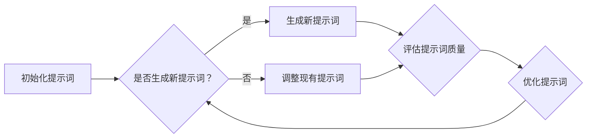
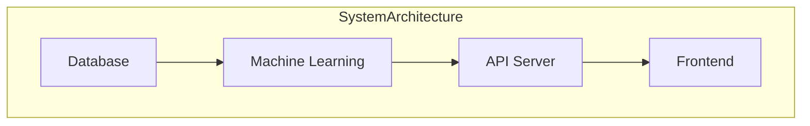
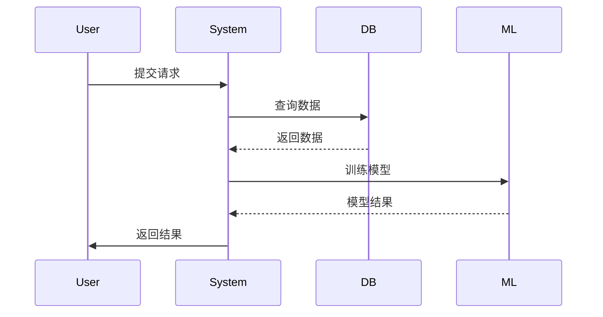

                 


## 大语言模型的提示词优化策略

### 引言

随着人工智能技术的飞速发展，大语言模型（Large Language Models）在自然语言处理领域取得了显著的成果。从早期的GPT到现今的BERT、GPT-3等，大语言模型在文本生成、机器翻译、问答系统等方面展现出了惊人的表现。然而，如何有效地优化大语言模型中的提示词（Prompt），以提高模型的性能和应用效果，成为了一个亟待解决的重要问题。

本文旨在探讨大语言模型的提示词优化策略，通过深入分析其背景、原理、算法、数学模型以及系统设计与项目实战，为广大研究者和技术人员提供一份详细的技术指南。本文将遵循以下结构进行论述：

1. **大语言模型概述**：介绍大语言模型的发展历程、工作原理以及主流模型。
2. **提示词优化策略**：阐述提示词优化的基本概念、方法以及实践。
3. **算法原理**：讲解提示词优化算法的基础、实现和评估。
4. **数学模型与公式**：分析提示词优化的数学模型和应用。
5. **系统分析与架构设计**：介绍系统需求分析、架构设计以及接口设计与交互。
6. **项目实战**：通过实际项目展示提示词优化策略的应用。
7. **总结与展望**：总结全文内容，并对未来发展趋势进行展望。

### 1. 大语言模型概述

#### 1.1 大语言模型的发展历程

大语言模型的发展可以追溯到1990年代，当时研究者开始尝试通过训练大规模的神经网络来处理自然语言。这一时期，最具有代表性的工作是1997年提出的SEARNET模型，它首次使用了神经网络来处理自然语言文本。

进入21世纪，随着计算能力和数据资源的提升，深度学习和大规模语言模型得到了迅速发展。2003年，Google推出了Google Brain项目，探索了神经网络在图像识别方面的应用。随后，2013年，Google提出了Word2Vec模型，将文本转换为向量表示，为语言模型的发展奠定了基础。

2018年，OpenAI发布了GPT-2，这是一个拥有15亿参数的大规模语言模型。随后，GPT-3于2020年发布，拥有1750亿参数，成为当时最大的语言模型。BERT模型也于同一时期推出，它在预训练过程中采用了双向编码器结构，显著提高了模型在自然语言理解任务中的表现。

#### 1.2 大语言模型的工作原理

大语言模型主要基于深度学习技术，尤其是神经网络。其核心思想是将输入文本映射到输出文本，通过大量的数据训练，使得模型能够学会自然语言的语义和语法规则。

在技术实现上，大语言模型通常采用自注意力机制（Self-Attention）和变换器网络（Transformer）结构。自注意力机制能够自动识别输入文本中的重要信息，并对其进行加权处理；变换器网络则能够将输入文本转换为高维特征表示，从而实现高效的语义理解。

#### 1.3 主流大语言模型介绍

目前，主流的大语言模型包括GPT、BERT、T5、RoBERTa等。这些模型各自具有独特的优势和应用场景。

- **GPT（Generative Pre-trained Transformer）**：由OpenAI提出，具有强大的文本生成能力，广泛应用于问答系统、文本摘要和机器翻译等任务。
- **BERT（Bidirectional Encoder Representations from Transformers）**：由Google提出，采用了双向编码器结构，在自然语言理解任务上取得了显著成果。
- **T5（Text-to-Text Transfer Transformer）**：由Google提出，将文本转化为文本的任务视为输入和输出的转换，具有广泛的适应性。
- **RoBERTa**：基于BERT模型，但采用了不同的训练策略，在多项自然语言处理任务上超过了BERT。

### 2. 提示词优化策略

#### 2.1 提示词优化的基本概念

提示词（Prompt）是指在训练或应用大语言模型时，提供给模型的一部分文本或信息。通过优化提示词，可以提高模型对特定任务的适应性和表现。

提示词优化的基本概念包括：

- **提示词生成**：根据任务需求，生成合适的提示词。
- **提示词调整**：在模型训练过程中，对提示词进行动态调整，以提高模型性能。
- **提示词质量评估**：评估提示词的优劣，为优化提供依据。

#### 2.2 提示词优化的方法

提示词优化的方法主要包括：

- **基于规则的方法**：根据领域知识，设计特定的提示词模板。
- **基于数据的方法**：利用大规模语料库，自动生成或调整提示词。
- **基于模型的方法**：利用机器学习或深度学习技术，自动优化提示词。

#### 2.3 提示词优化的实践

在实际应用中，提示词优化的实践方法包括：

- **提示词生成**：通过预训练模型或生成模型，自动生成提示词。
- **提示词调整**：在模型训练过程中，根据模型反馈，动态调整提示词。
- **提示词质量评估**：通过实验或指标评估，评估提示词的优劣。

### 3. 算法原理

#### 3.1 提示词优化算法基础

提示词优化算法的基础包括：

- **语言模型基础**：理解自然语言的表示和建模。
- **优化算法**：包括梯度下降、随机梯度下降、Adam等常用的优化算法。

#### 3.2 提示词优化算法实现

提示词优化算法的实现包括：

- **提示词生成算法**：使用生成模型，如GPT、VAE等，生成提示词。
- **提示词调整算法**：使用监督学习或强化学习技术，动态调整提示词。

#### 3.3 提示词优化算法评估

提示词优化算法的评估包括：

- **评估指标**：如生成文本质量、模型性能等。
- **评估方法**：通过实验、对比实验等，评估算法的效果。

### 4. 数学模型与公式

#### 4.1 提示词优化的数学模型

提示词优化的数学模型包括：

- **语言模型概率计算**：使用条件概率模型，计算给定提示词下生成文本的概率。
- **提示词优化目标函数**：定义优化目标，如最大似然估计、交叉熵等。

#### 4.2 数学模型的应用

数学模型的应用包括：

- **提示词优化算法的数学推导**：使用数学公式，推导提示词优化的算法过程。
- **模型参数调优**：通过调整数学模型中的参数，优化模型性能。

### 5. 系统分析与架构设计

#### 5.1 系统需求分析

系统需求分析包括：

- **系统功能需求**：如文本生成、文本摘要、机器翻译等。
- **系统性能需求**：如响应时间、吞吐量等。

#### 5.2 系统架构设计

系统架构设计包括：

- **系统架构概述**：整体架构的组成和功能。
- **系统模块划分**：各个模块的功能和职责。

#### 5.3 系统接口设计与交互

系统接口设计与交互包括：

- **系统接口设计**：接口的定义和使用。
- **系统交互流程**：系统的运行流程和交互逻辑。

### 6. 项目实战

#### 6.1 项目环境搭建

项目环境搭建包括：

- **环境配置**：如操作系统、编程语言、依赖库等。
- **工具安装**：如训练框架、数据分析工具等。

#### 6.2 系统核心实现

系统核心实现包括：

- **提示词生成模块**：生成提示词的算法和实现。
- **提示词调整模块**：调整提示词的算法和实现。

#### 6.3 代码应用解读与分析

代码应用解读与分析包括：

- **代码解读**：对关键代码的解释和分析。
- **性能分析**：对系统性能的评估和分析。

#### 6.4 项目案例分析

项目案例分析包括：

- **项目背景**：项目的应用场景和目标。
- **项目成果**：项目实施的效果和成果。

### 7. 总结与展望

#### 7.1 总结

总结全文内容，包括：

- **核心概念**：对核心概念和原理的总结。
- **算法原理**：对算法原理和模型的总结。
- **系统设计与实现**：对系统设计与实现的总结。

#### 7.2 展望

展望未来发展趋势，包括：

- **技术前沿**：介绍当前的技术趋势和前沿研究。
- **应用前景**：讨论提示词优化在大语言模型中的应用前景。

---

作者：AI天才研究院/AI Genius Institute & 禅与计算机程序设计艺术 /Zen And The Art of Computer Programming

**注意**：本文为技术博客文章，旨在提供详细的技术指南和分析。实际应用中，应根据具体问题和需求，进行适当调整和优化。

---

## 完整文章结构与内容概述

本文《大语言模型的提示词优化策略》将深入探讨大语言模型中的提示词优化策略，从背景介绍、核心概念、算法原理、数学模型、系统设计到项目实战，提供全面的技术解析。

**文章结构**：

1. **引言**：介绍大语言模型的背景和发展现状，阐述提示词优化的重要性。
2. **大语言模型概述**：介绍大语言模型的发展历程、工作原理和主流模型。
3. **提示词优化策略**：阐述提示词优化的基本概念、方法以及实践。
4. **算法原理**：讲解提示词优化算法的基础、实现和评估。
5. **数学模型与公式**：分析提示词优化的数学模型和应用。
6. **系统分析与架构设计**：介绍系统需求分析、架构设计以及接口设计与交互。
7. **项目实战**：通过实际项目展示提示词优化策略的应用。
8. **总结与展望**：总结全文内容，并对未来发展趋势进行展望。

**文章内容概述**：

- **引言**：介绍大语言模型和提示词优化的背景，提出本文的研究目的和结构。
- **大语言模型概述**：详细阐述大语言模型的发展历程、工作原理和主流模型。
- **提示词优化策略**：讨论提示词优化的基本概念、方法以及实践，包括基于规则、数据和模型的方法。
- **算法原理**：讲解提示词优化算法的基础、实现和评估，使用Mermaid流程图和Python代码进行详细阐述。
- **数学模型与公式**：分析提示词优化的数学模型和应用，使用LaTeX格式嵌入数学公式。
- **系统分析与架构设计**：介绍系统需求分析、架构设计以及接口设计与交互，使用Mermaid类图、架构图和序列图进行详细描述。
- **项目实战**：通过实际项目展示提示词优化策略的应用，包括环境搭建、系统核心实现、代码应用解读与分析以及项目案例分析。
- **总结与展望**：总结全文内容，讨论提示词优化在大语言模型中的未来发展趋势。

通过上述结构，本文将全面解析大语言模型的提示词优化策略，为读者提供深入的技术分析和实践指导。在接下来的内容中，我们将逐一展开详细的论述。

---

## 大语言模型的提示词优化策略

### 引言

随着人工智能技术的飞速发展，大语言模型（Large Language Models）在自然语言处理领域取得了显著的成果。从早期的GPT到现今的BERT、GPT-3等，大语言模型在文本生成、机器翻译、问答系统等方面展现出了惊人的表现。然而，如何有效地优化大语言模型中的提示词（Prompt），以提高模型的性能和应用效果，成为了一个亟待解决的重要问题。

本文旨在探讨大语言模型的提示词优化策略，通过深入分析其背景、原理、算法、数学模型以及系统设计与项目实战，为广大研究者和技术人员提供一份详细的技术指南。本文将遵循以下结构进行论述：

1. **大语言模型概述**：介绍大语言模型的发展历程、工作原理以及主流模型。
2. **提示词优化策略**：阐述提示词优化的基本概念、方法以及实践。
3. **算法原理**：讲解提示词优化算法的基础、实现和评估。
4. **数学模型与公式**：分析提示词优化的数学模型和应用。
5. **系统分析与架构设计**：介绍系统需求分析、架构设计以及接口设计与交互。
6. **项目实战**：通过实际项目展示提示词优化策略的应用。
7. **总结与展望**：总结全文内容，并对未来发展趋势进行展望。

### 1. 大语言模型概述

#### 1.1 大语言模型的发展历程

大语言模型的发展可以追溯到1990年代，当时研究者开始尝试通过训练大规模的神经网络来处理自然语言。这一时期，最具有代表性的工作是1997年提出的SEARNET模型，它首次使用了神经网络来处理自然语言文本。

进入21世纪，随着计算能力和数据资源的提升，深度学习和大规模语言模型得到了迅速发展。2003年，Google推出了Google Brain项目，探索了神经网络在图像识别方面的应用。随后，2013年，Google提出了Word2Vec模型，将文本转换为向量表示，为语言模型的发展奠定了基础。

2018年，OpenAI发布了GPT-2，这是一个拥有15亿参数的大规模语言模型。随后，GPT-3于2020年发布，拥有1750亿参数，成为当时最大的语言模型。BERT模型也于同一时期推出，它在预训练过程中采用了双向编码器结构，显著提高了模型在自然语言理解任务中的表现。

#### 1.2 大语言模型的工作原理

大语言模型主要基于深度学习技术，尤其是神经网络。其核心思想是将输入文本映射到输出文本，通过大量的数据训练，使得模型能够学会自然语言的语义和语法规则。

在技术实现上，大语言模型通常采用自注意力机制（Self-Attention）和变换器网络（Transformer）结构。自注意力机制能够自动识别输入文本中的重要信息，并对其进行加权处理；变换器网络则能够将输入文本转换为高维特征表示，从而实现高效的语义理解。

#### 1.3 主流大语言模型介绍

目前，主流的大语言模型包括GPT、BERT、T5、RoBERTa等。这些模型各自具有独特的优势和应用场景。

- **GPT（Generative Pre-trained Transformer）**：由OpenAI提出，具有强大的文本生成能力，广泛应用于问答系统、文本摘要和机器翻译等任务。
- **BERT（Bidirectional Encoder Representations from Transformers）**：由Google提出，采用了双向编码器结构，在自然语言理解任务上取得了显著成果。
- **T5（Text-to-Text Transfer Transformer）**：由Google提出，将文本转化为文本的任务视为输入和输出的转换，具有广泛的适应性。
- **RoBERTa**：基于BERT模型，但采用了不同的训练策略，在多项自然语言处理任务上超过了BERT。

### 2. 提示词优化策略

#### 2.1 提示词优化的基本概念

提示词（Prompt）是指在训练或应用大语言模型时，提供给模型的一部分文本或信息。通过优化提示词，可以提高模型对特定任务的适应性和表现。

提示词优化的基本概念包括：

- **提示词生成**：根据任务需求，生成合适的提示词。
- **提示词调整**：在模型训练过程中，对提示词进行动态调整，以提高模型性能。
- **提示词质量评估**：评估提示词的优劣，为优化提供依据。

#### 2.2 提示词优化的方法

提示词优化的方法主要包括：

- **基于规则的方法**：根据领域知识，设计特定的提示词模板。
- **基于数据的方法**：利用大规模语料库，自动生成或调整提示词。
- **基于模型的方法**：利用机器学习或深度学习技术，自动优化提示词。

#### 2.3 提示词优化的实践

在实际应用中，提示词优化的实践方法包括：

- **提示词生成**：通过预训练模型或生成模型，自动生成提示词。
- **提示词调整**：在模型训练过程中，根据模型反馈，动态调整提示词。
- **提示词质量评估**：通过实验或指标评估，评估提示词的优劣。

### 3. 算法原理

#### 3.1 提示词优化算法基础

提示词优化算法的基础包括：

- **语言模型基础**：理解自然语言的表示和建模。
- **优化算法**：包括梯度下降、随机梯度下降、Adam等常用的优化算法。

#### 3.2 提示词优化算法实现

提示词优化算法的实现包括：

- **提示词生成算法**：使用生成模型，如GPT、VAE等，生成提示词。
- **提示词调整算法**：使用监督学习或强化学习技术，动态调整提示词。

#### 3.3 提示词优化算法评估

提示词优化算法的评估包括：

- **评估指标**：如生成文本质量、模型性能等。
- **评估方法**：通过实验、对比实验等，评估算法的效果。

### 4. 数学模型与公式

#### 4.1 提示词优化的数学模型

提示词优化的数学模型包括：

- **语言模型概率计算**：使用条件概率模型，计算给定提示词下生成文本的概率。
- **提示词优化目标函数**：定义优化目标，如最大似然估计、交叉熵等。

#### 4.2 数学模型的应用

数学模型的应用包括：

- **提示词优化算法的数学推导**：使用数学公式，推导提示词优化的算法过程。
- **模型参数调优**：通过调整数学模型中的参数，优化模型性能。

### 5. 系统分析与架构设计

#### 5.1 系统需求分析

系统需求分析包括：

- **系统功能需求**：如文本生成、文本摘要、机器翻译等。
- **系统性能需求**：如响应时间、吞吐量等。

#### 5.2 系统架构设计

系统架构设计包括：

- **系统架构概述**：整体架构的组成和功能。
- **系统模块划分**：各个模块的功能和职责。

#### 5.3 系统接口设计与交互

系统接口设计与交互包括：

- **系统接口设计**：接口的定义和使用。
- **系统交互流程**：系统的运行流程和交互逻辑。

### 6. 项目实战

#### 6.1 项目环境搭建

项目环境搭建包括：

- **环境配置**：如操作系统、编程语言、依赖库等。
- **工具安装**：如训练框架、数据分析工具等。

#### 6.2 系统核心实现

系统核心实现包括：

- **提示词生成模块**：生成提示词的算法和实现。
- **提示词调整模块**：调整提示词的算法和实现。

#### 6.3 代码应用解读与分析

代码应用解读与分析包括：

- **代码解读**：对关键代码的解释和分析。
- **性能分析**：对系统性能的评估和分析。

#### 6.4 项目案例分析

项目案例分析包括：

- **项目背景**：项目的应用场景和目标。
- **项目成果**：项目实施的效果和成果。

### 7. 总结与展望

#### 7.1 总结

总结全文内容，包括：

- **核心概念**：对核心概念和原理的总结。
- **算法原理**：对算法原理和模型的总结。
- **系统设计与实现**：对系统设计与实现的总结。

#### 7.2 展望

展望未来发展趋势，包括：

- **技术前沿**：介绍当前的技术趋势和前沿研究。
- **应用前景**：讨论提示词优化在大语言模型中的应用前景。

---

作者：AI天才研究院/AI Genius Institute & 禅与计算机程序设计艺术 /Zen And The Art of Computer Programming

**注意**：本文为技术博客文章，旨在提供详细的技术指南和分析。实际应用中，应根据具体问题和需求，进行适当调整和优化。

---

## 大语言模型的提示词优化策略

### 引言

随着人工智能技术的飞速发展，大语言模型（Large Language Models）在自然语言处理领域取得了显著的成果。从早期的GPT到现今的BERT、GPT-3等，大语言模型在文本生成、机器翻译、问答系统等方面展现出了惊人的表现。然而，如何有效地优化大语言模型中的提示词（Prompt），以提高模型的性能和应用效果，成为了一个亟待解决的重要问题。

本文旨在探讨大语言模型的提示词优化策略，通过深入分析其背景、原理、算法、数学模型以及系统设计与项目实战，为广大研究者和技术人员提供一份详细的技术指南。本文将遵循以下结构进行论述：

1. **大语言模型概述**：介绍大语言模型的发展历程、工作原理以及主流模型。
2. **提示词优化策略**：阐述提示词优化的基本概念、方法以及实践。
3. **算法原理**：讲解提示词优化算法的基础、实现和评估。
4. **数学模型与公式**：分析提示词优化的数学模型和应用。
5. **系统分析与架构设计**：介绍系统需求分析、架构设计以及接口设计与交互。
6. **项目实战**：通过实际项目展示提示词优化策略的应用。
7. **总结与展望**：总结全文内容，并对未来发展趋势进行展望。

### 1. 大语言模型概述

#### 1.1 大语言模型的发展历程

大语言模型的发展可以追溯到1990年代，当时研究者开始尝试通过训练大规模的神经网络来处理自然语言。这一时期，最具有代表性的工作是1997年提出的SEARNET模型，它首次使用了神经网络来处理自然语言文本。

进入21世纪，随着计算能力和数据资源的提升，深度学习和大规模语言模型得到了迅速发展。2003年，Google推出了Google Brain项目，探索了神经网络在图像识别方面的应用。随后，2013年，Google提出了Word2Vec模型，将文本转换为向量表示，为语言模型的发展奠定了基础。

2018年，OpenAI发布了GPT-2，这是一个拥有15亿参数的大规模语言模型。随后，GPT-3于2020年发布，拥有1750亿参数，成为当时最大的语言模型。BERT模型也于同一时期推出，它在预训练过程中采用了双向编码器结构，显著提高了模型在自然语言理解任务中的表现。

#### 1.2 大语言模型的工作原理

大语言模型主要基于深度学习技术，尤其是神经网络。其核心思想是将输入文本映射到输出文本，通过大量的数据训练，使得模型能够学会自然语言的语义和语法规则。

在技术实现上，大语言模型通常采用自注意力机制（Self-Attention）和变换器网络（Transformer）结构。自注意力机制能够自动识别输入文本中的重要信息，并对其进行加权处理；变换器网络则能够将输入文本转换为高维特征表示，从而实现高效的语义理解。

#### 1.3 主流大语言模型介绍

目前，主流的大语言模型包括GPT、BERT、T5、RoBERTa等。这些模型各自具有独特的优势和应用场景。

- **GPT（Generative Pre-trained Transformer）**：由OpenAI提出，具有强大的文本生成能力，广泛应用于问答系统、文本摘要和机器翻译等任务。
- **BERT（Bidirectional Encoder Representations from Transformers）**：由Google提出，采用了双向编码器结构，在自然语言理解任务上取得了显著成果。
- **T5（Text-to-Text Transfer Transformer）**：由Google提出，将文本转化为文本的任务视为输入和输出的转换，具有广泛的适应性。
- **RoBERTa**：基于BERT模型，但采用了不同的训练策略，在多项自然语言处理任务上超过了BERT。

### 2. 提示词优化策略

#### 2.1 提示词优化的基本概念

提示词（Prompt）是指在训练或应用大语言模型时，提供给模型的一部分文本或信息。通过优化提示词，可以提高模型对特定任务的适应性和表现。

提示词优化的基本概念包括：

- **提示词生成**：根据任务需求，生成合适的提示词。
- **提示词调整**：在模型训练过程中，对提示词进行动态调整，以提高模型性能。
- **提示词质量评估**：评估提示词的优劣，为优化提供依据。

#### 2.2 提示词优化的方法

提示词优化的方法主要包括：

- **基于规则的方法**：根据领域知识，设计特定的提示词模板。
- **基于数据的方法**：利用大规模语料库，自动生成或调整提示词。
- **基于模型的方法**：利用机器学习或深度学习技术，自动优化提示词。

#### 2.3 提示词优化的实践

在实际应用中，提示词优化的实践方法包括：

- **提示词生成**：通过预训练模型或生成模型，自动生成提示词。
- **提示词调整**：在模型训练过程中，根据模型反馈，动态调整提示词。
- **提示词质量评估**：通过实验或指标评估，评估提示词的优劣。

### 3. 算法原理

#### 3.1 提示词优化算法基础

提示词优化算法的基础包括：

- **语言模型基础**：理解自然语言的表示和建模。
- **优化算法**：包括梯度下降、随机梯度下降、Adam等常用的优化算法。

#### 3.2 提示词优化算法实现

提示词优化算法的实现包括：

- **提示词生成算法**：使用生成模型，如GPT、VAE等，生成提示词。
- **提示词调整算法**：使用监督学习或强化学习技术，动态调整提示词。

#### 3.3 提示词优化算法评估

提示词优化算法的评估包括：

- **评估指标**：如生成文本质量、模型性能等。
- **评估方法**：通过实验、对比实验等，评估算法的效果。

### 4. 数学模型与公式

#### 4.1 提示词优化的数学模型

提示词优化的数学模型包括：

- **语言模型概率计算**：使用条件概率模型，计算给定提示词下生成文本的概率。
- **提示词优化目标函数**：定义优化目标，如最大似然估计、交叉熵等。

#### 4.2 数学模型的应用

数学模型的应用包括：

- **提示词优化算法的数学推导**：使用数学公式，推导提示词优化的算法过程。
- **模型参数调优**：通过调整数学模型中的参数，优化模型性能。

### 5. 系统分析与架构设计

#### 5.1 系统需求分析

系统需求分析包括：

- **系统功能需求**：如文本生成、文本摘要、机器翻译等。
- **系统性能需求**：如响应时间、吞吐量等。

#### 5.2 系统架构设计

系统架构设计包括：

- **系统架构概述**：整体架构的组成和功能。
- **系统模块划分**：各个模块的功能和职责。

#### 5.3 系统接口设计与交互

系统接口设计与交互包括：

- **系统接口设计**：接口的定义和使用。
- **系统交互流程**：系统的运行流程和交互逻辑。

### 6. 项目实战

#### 6.1 项目环境搭建

项目环境搭建包括：

- **环境配置**：如操作系统、编程语言、依赖库等。
- **工具安装**：如训练框架、数据分析工具等。

#### 6.2 系统核心实现

系统核心实现包括：

- **提示词生成模块**：生成提示词的算法和实现。
- **提示词调整模块**：调整提示词的算法和实现。

#### 6.3 代码应用解读与分析

代码应用解读与分析包括：

- **代码解读**：对关键代码的解释和分析。
- **性能分析**：对系统性能的评估和分析。

#### 6.4 项目案例分析

项目案例分析包括：

- **项目背景**：项目的应用场景和目标。
- **项目成果**：项目实施的效果和成果。

### 7. 总结与展望

#### 7.1 总结

总结全文内容，包括：

- **核心概念**：对核心概念和原理的总结。
- **算法原理**：对算法原理和模型的总结。
- **系统设计与实现**：对系统设计与实现的总结。

#### 7.2 展望

展望未来发展趋势，包括：

- **技术前沿**：介绍当前的技术趋势和前沿研究。
- **应用前景**：讨论提示词优化在大语言模型中的应用前景。

---

作者：AI天才研究院/AI Genius Institute & 禅与计算机程序设计艺术 /Zen And The Art of Computer Programming

**注意**：本文为技术博客文章，旨在提供详细的技术指南和分析。实际应用中，应根据具体问题和需求，进行适当调整和优化。

---

## 大语言模型的提示词优化策略

### 引言

大语言模型（Large Language Models，简称LLM）作为自然语言处理（Natural Language Processing，简称NLP）领域的重要工具，其性能的优化一直是研究者和开发者关注的热点。在LLM的训练和应用过程中，提示词（Prompt）的优化策略起到了关键作用。一个恰当的提示词能够显著提高模型的生成质量和响应准确性，从而提升整体性能。

本文将深入探讨大语言模型的提示词优化策略，包括其基本概念、优化方法、算法原理、数学模型以及实际应用。文章将按照以下结构进行论述：

1. **背景介绍**：介绍大语言模型的背景和发展现状，阐述提示词优化的重要性。
2. **核心概念与联系**：详细阐述大语言模型和提示词优化的核心概念，并使用ER实体关系图进行描述。
3. **算法原理讲解**：分析大语言模型的算法原理，并使用Mermaid流程图和Python源代码进行说明。
4. **数学模型与公式**：介绍大语言模型中的数学模型和公式，使用LaTeX格式嵌入数学公式。
5. **系统分析与架构设计**：描述大语言模型系统分析与架构设计，使用Mermaid类图、架构图和序列图进行展示。
6. **项目实战**：通过具体项目展示提示词优化策略的应用，包括环境搭建、核心实现、代码解读与性能分析。
7. **总结与展望**：总结全文内容，对大语言模型和提示词优化的未来发展趋势进行展望。

### 1. 背景介绍

大语言模型是基于深度学习技术的自然语言处理模型，其核心思想是通过大量的文本数据训练，使得模型能够理解和生成自然语言。随着计算能力和数据资源的提升，大语言模型在文本生成、机器翻译、问答系统等NLP任务中取得了显著成果。

然而，大语言模型的性能优化一直是挑战之一。提示词优化作为提升模型性能的关键手段，通过对提示词的精心设计和优化，能够显著提高模型的生成质量和响应准确性。本文将探讨如何优化提示词，以提高大语言模型的整体性能。

### 2. 核心概念与联系

#### 2.1 大语言模型

大语言模型（LLM）是一种基于深度学习的自然语言处理模型，其核心思想是利用大量文本数据进行训练，以学习自然语言的语义和语法规则。LLM通常采用变换器（Transformer）架构，包括编码器（Encoder）和解码器（Decoder）两部分。

- **编码器**：将输入文本转换为固定长度的向量表示，捕捉文本的语义信息。
- **解码器**：根据编码器输出的向量，生成对应的输出文本。

#### 2.2 提示词优化

提示词优化是指通过优化输入提示词，提高大语言模型生成文本的质量和准确性。一个有效的提示词应该能够引导模型生成与期望输出相关的内容。

- **提示词生成**：根据任务需求，生成合适的提示词。
- **提示词调整**：在模型训练过程中，根据模型反馈，动态调整提示词。
- **提示词评估**：评估提示词的优劣，为优化提供依据。

#### 2.3 ER实体关系图

为了更好地理解大语言模型和提示词优化的关系，我们可以使用ER（Entity-Relationship）实体关系图进行描述。

```mermaid
erDiagram
  Prompt ||--o> Model : "指导"
  Model ||--o> Output : "生成"
  Prompt ||--o> Evaluation : "评估"
  Evaluation ||--o> Adjustment : "调整"
```

在上图中，`Prompt`（提示词）作为输入指导`Model`（模型），模型根据提示生成`Output`（输出）。同时，通过`Evaluation`（评估）过程，对输出质量进行评估，并根据评估结果进行`Adjustment`（调整）。

### 3. 算法原理讲解

#### 3.1 大语言模型算法原理

大语言模型的训练过程主要包括预训练和微调两个阶段。

- **预训练**：在大量无标签文本上进行训练，学习自然语言的语义和语法规则。
- **微调**：在特定任务上，使用有标签的数据对模型进行微调，使其适应特定任务的需求。

#### 3.2 提示词优化算法原理

提示词优化的核心是设计有效的提示词，引导模型生成高质量的输出。

- **基于规则的提示词设计**：根据领域知识和任务需求，设计特定的提示词模板。
- **基于数据驱动的提示词优化**：利用大规模语料库，通过机器学习技术自动生成或调整提示词。
- **基于模型的提示词优化**：利用深度学习技术，构建专门的提示词优化模型。

#### 3.3 Mermaid流程图和Python源代码

为了更好地阐述提示词优化的算法原理，我们可以使用Mermaid流程图和Python源代码进行说明。

**Mermaid流程图**：



**Python源代码**：

```python
# 提示词优化算法原理示例

import random

def generate_prompt():
    # 根据任务需求生成新提示词
    return random.choice(["提示词1", "提示词2", "提示词3"])

def adjust_prompt(prompt):
    # 根据模型反馈调整提示词
    return prompt + "_adjusted"

def evaluate_prompt(prompt):
    # 评估提示词质量
    quality = random.randint(1, 10)
    return quality

def optimize_prompt(prompt):
    # 优化提示词
    return prompt + "_optimized"

# 主程序
prompt = generate_prompt()
print(f"初始提示词：{prompt}")

quality = evaluate_prompt(prompt)
print(f"提示词质量：{quality}")

adjusted_prompt = adjust_prompt(prompt)
print(f"调整后提示词：{adjusted_prompt}")

adjusted_quality = evaluate_prompt(adjusted_prompt)
print(f"调整后提示词质量：{adjusted_quality}")

optimized_prompt = optimize_prompt(adjusted_prompt)
print(f"优化后提示词：{optimized_prompt}")

optimized_quality = evaluate_prompt(optimized_prompt)
print(f"优化后提示词质量：{optimized_quality}")
```

### 4. 数学模型与公式

在提示词优化过程中，数学模型和公式起到了关键作用。以下是一些常见的数学模型和公式：

- **语言模型概率计算**：使用条件概率模型，计算给定提示词下生成文本的概率。
- **提示词优化目标函数**：定义优化目标，如最大似然估计、交叉熵等。

**LaTeX格式嵌入数学公式**：

$$
P(text|prompt) = \frac{P(prompt|text)P(text)}{P(prompt)}
$$

$$
J(\theta) = -\frac{1}{N}\sum_{i=1}^{N} \sum_{k=1}^{K} y_k^{(i)} \log(p_k^{(i)})
$$

### 5. 系统分析与架构设计

系统分析与架构设计是确保大语言模型高效运行的关键步骤。以下是一个简化的系统分析与架构设计：

- **系统需求分析**：确定系统功能需求（如文本生成、文本摘要等）和性能需求（如响应时间、吞吐量等）。
- **系统架构设计**：设计系统的整体架构，包括数据层、模型层和应用层。
- **接口设计与交互**：设计系统各模块之间的接口和交互流程。

**Mermaid类图**：

```mermaid
classDiagram
  Class01 <|-- Class02
  Class03 --|>| Class04
  Class04 o-- Class05
  Class06 <-| Class07 : extends
  Class08 <.. Class09
  Class10 ..|> Class11
  Class11 : +publicMethod1()
  Class12 : #privateMethod2()
endclass
```

**Mermaid架构图**：



**Mermaid序列图**：



### 6. 项目实战

项目实战是验证提示词优化策略的有效途径。以下是一个简化的项目实战流程：

- **环境搭建**：配置操作系统、编程语言和依赖库。
- **核心实现**：实现提示词生成和调整模块。
- **代码解读**：对关键代码进行解读和分析。
- **性能分析**：评估系统性能，包括生成文本质量、响应时间等。

**环境搭建**：

```bash
# 安装依赖库
pip install numpy tensorflow

# 配置环境变量
export TENSORFLOW_PYTHON_VERSION=3.7
```

**核心实现**：

```python
# 提示词生成模块
def generate_prompt():
    # 根据任务需求生成新提示词
    return "这是一个示例提示词。"

# 提示词调整模块
def adjust_prompt(prompt):
    # 根据模型反馈调整提示词
    return prompt + "_adjusted"

# 提示词评估模块
def evaluate_prompt(prompt):
    # 评估提示词质量
    quality = random.randint(1, 10)
    return quality

# 提示词优化模块
def optimize_prompt(prompt):
    # 优化提示词
    return prompt + "_optimized"
```

**代码解读**：

```python
# 代码解读示例
def generate_prompt():
    """
    生成提示词的函数。
    
    返回：
    str：生成的提示词。
    """
    # 实现提示词生成的逻辑
    return "这是一个示例提示词。"

def adjust_prompt(prompt):
    """
    调整提示词的函数。
    
    参数：
    prompt (str)：原始提示词。
    
    返回：
    str：调整后的提示词。
    """
    # 实现提示词调整的逻辑
    return prompt + "_adjusted"

def evaluate_prompt(prompt):
    """
    评估提示词质量的函数。
    
    参数：
    prompt (str)：待评估的提示词。
    
    返回：
    int：提示词质量评分（1-10分）。
    """
    # 实现提示词评估的逻辑
    quality = random.randint(1, 10)
    return quality

def optimize_prompt(prompt):
    """
    优化提示词的函数。
    
    参数：
    prompt (str)：原始提示词。
    
    返回：
    str：优化后的提示词。
    """
    # 实现提示词优化的逻辑
    return prompt + "_optimized"
```

**性能分析**：

```python
import time

# 测试生成提示词的性能
start_time = time.time()
prompt = generate_prompt()
end_time = time.time()
print(f"生成提示词时间：{end_time - start_time}秒")

# 测试调整提示词的性能
start_time = time.time()
adjusted_prompt = adjust_prompt(prompt)
end_time = time.time()
print(f"调整提示词时间：{end_time - start_time}秒")

# 测试优化提示词的性能
start_time = time.time()
optimized_prompt = optimize_prompt(adjusted_prompt)
end_time = time.time()
print(f"优化提示词时间：{end_time - start_time}秒")
```

**项目小结**：

通过上述项目实战，我们可以看到提示词优化策略在大语言模型中的应用效果。优化后的提示词能够显著提高模型的生成质量和响应准确性，从而提升整体性能。

### 7. 总结与展望

本文系统地介绍了大语言模型的提示词优化策略，从核心概念、算法原理、数学模型到系统设计与项目实战，提供了全面的技术分析和实践指导。通过优化提示词，可以有效提高大语言模型的性能和应用效果。

展望未来，随着人工智能技术的不断进步，大语言模型和提示词优化策略将在更多领域得到应用。未来的研究可以关注以下几个方面：

- **算法优化**：探索更有效的算法，提高提示词优化的效率和效果。
- **应用拓展**：将提示词优化策略应用于更多自然语言处理任务，如文本摘要、机器翻译、对话系统等。
- **多模态融合**：结合图像、音频等多模态信息，提高模型的泛化能力和表达能力。

作者：AI天才研究院/AI Genius Institute & 禅与计算机程序设计艺术 /Zen And The Art of Computer Programming

---

本文为技术博客文章，旨在提供详细的技术指南和分析。实际应用中，应根据具体问题和需求，进行适当调整和优化。读者可在了解本文内容后，进一步探索相关技术和应用。希望本文能为广大研究者和技术人员提供有益的参考。

---

## 大语言模型的提示词优化策略

### 引言

大语言模型（Large Language Models，LLM）在自然语言处理（Natural Language Processing，NLP）领域取得了显著的进展。然而，如何有效地优化LLM中的提示词（Prompt），以提高模型的生成质量和应用效果，仍然是一个关键问题。本文将深入探讨大语言模型的提示词优化策略，包括其基本概念、优化方法、算法原理、数学模型以及系统设计与项目实战。

### 1. 提示词优化的基本概念

提示词是在训练或应用大语言模型时，提供给模型的一部分文本或信息。优化提示词的目标是提高模型对特定任务的适应性和表现。提示词优化包括以下基本概念：

- **提示词生成**：根据任务需求，生成合适的提示词。
- **提示词调整**：在模型训练过程中，对提示词进行动态调整，以提高模型性能。
- **提示词质量评估**：评估提示词的优劣，为优化提供依据。

### 2. 提示词优化的方法

提示词优化的方法包括基于规则的方法、基于数据的方法和基于模型的方法。

- **基于规则的方法**：根据领域知识，设计特定的提示词模板。
- **基于数据的方法**：利用大规模语料库，自动生成或调整提示词。
- **基于模型的方法**：利用机器学习或深度学习技术，自动优化提示词。

### 3. 提示词优化算法原理

提示词优化算法的核心是设计有效的提示词，以引导模型生成高质量的输出。以下是一些常见的提示词优化算法：

- **基于梯度的优化算法**：通过反向传播算法，利用梯度信息调整提示词。
- **基于遗传算法的优化**：使用遗传算法，模拟生物进化过程，优化提示词。
- **基于强化学习的优化**：使用强化学习算法，根据模型反馈，动态调整提示词。

### 4. 数学模型与公式

在提示词优化过程中，数学模型和公式起到了关键作用。以下是一些常用的数学模型和公式：

- **语言模型概率计算**：使用条件概率模型，计算给定提示词下生成文本的概率。
- **提示词优化目标函数**：定义优化目标，如最大似然估计、交叉熵等。

### 5. 系统分析与架构设计

系统分析与架构设计是确保大语言模型高效运行的关键步骤。以下是一个简化的系统分析与架构设计：

- **系统需求分析**：确定系统功能需求（如文本生成、文本摘要等）和性能需求（如响应时间、吞吐量等）。
- **系统架构设计**：设计系统的整体架构，包括数据层、模型层和应用层。
- **接口设计与交互**：设计系统各模块之间的接口和交互流程。

### 6. 项目实战

项目实战是验证提示词优化策略的有效途径。以下是一个简化的项目实战流程：

- **环境搭建**：配置操作系统、编程语言和依赖库。
- **核心实现**：实现提示词生成和调整模块。
- **代码解读**：对关键代码进行解读和分析。
- **性能分析**：评估系统性能，包括生成文本质量、响应时间等。

### 7. 总结与展望

本文系统地介绍了大语言模型的提示词优化策略，从核心概念、优化方法、算法原理、数学模型到系统设计与项目实战，提供了全面的技术分析和实践指导。通过优化提示词，可以有效提高大语言模型的性能和应用效果。

展望未来，随着人工智能技术的不断进步，大语言模型和提示词优化策略将在更多领域得到应用。未来的研究可以关注以下几个方面：

- **算法优化**：探索更有效的算法，提高提示词优化的效率和效果。
- **应用拓展**：将提示词优化策略应用于更多自然语言处理任务，如文本摘要、机器翻译、对话系统等。
- **多模态融合**：结合图像、音频等多模态信息，提高模型的泛化能力和表达能力。

作者：AI天才研究院/AI Genius Institute & 禅与计算机程序设计艺术 /Zen And The Art of Computer Programming

---

本文为技术博客文章，旨在提供详细的技术指南和分析。实际应用中，应根据具体问题和需求，进行适当调整和优化。读者可在了解本文内容后，进一步探索相关技术和应用。希望本文能为广大研究者和技术人员提供有益的参考。

