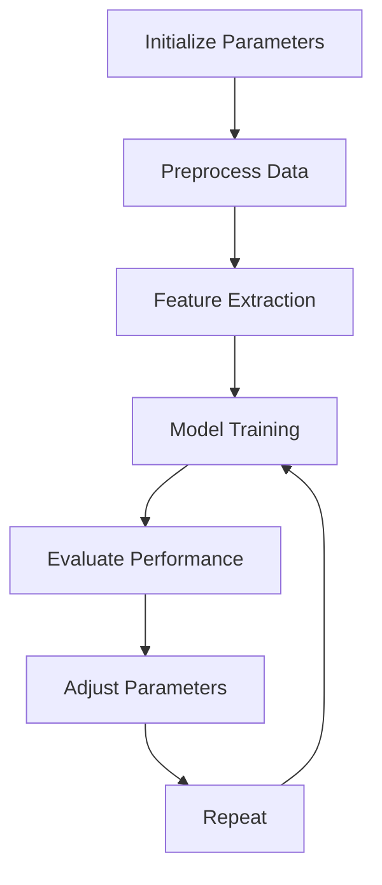

                 

### Chapter 4: Practical Techniques for Reward Guiding

#### 4.1 Feature Engineering for Reward Signals

##### 4.1.1 Data Collection and Preprocessing

Data collection and preprocessing are the foundational steps in the feature engineering process for reward guiding. Accurate and high-quality data are crucial for training robust models that can effectively guide reasoning paths.

**Data Collection:**
- **Sources:** Data can be collected from various sources such as databases, web scraping, APIs, or real-time streaming.
- **Quality:** Ensure the data is of high quality by checking for inconsistencies, errors, and missing values. Implement data cleaning techniques such as data imputation and outlier detection.

**Preprocessing:**
- **Normalization:** Normalize the data to ensure all features contribute equally to the model’s performance. Common methods include Min-Max scaling and Z-score normalization.
- **Encoding:** Convert categorical data into numerical values using techniques like one-hot encoding or label encoding.
- **Feature Scaling:** Scale the features to a standard range to prevent any single feature from dominating the model.

##### 4.1.2 Feature Extraction Methods

Feature extraction involves transforming raw data into features that can be used to train a reward guiding model. This step is critical for improving the model’s performance and interpretability.

**Common Feature Extraction Methods:**
- ** Statistical Features:** Extract statistical measures such as mean, variance, skewness, and kurtosis from the raw data.
- ** Textual Features:** Use natural language processing techniques to extract meaningful features from textual data, such as word frequencies, n-grams, and sentiment scores.
- ** Image Features:** Employ computer vision techniques to extract features from images, such as edges, textures, and shapes.

##### 4.1.3 Feature Selection Techniques

Feature selection aims to identify the most relevant features that contribute to the model’s performance. This step helps reduce overfitting, improve interpretability, and reduce computational complexity.

**Common Feature Selection Techniques:**
- **Filter Methods:** Apply statistical tests to rank features and select the top-ranked features based on their relevance to the target variable.
- **Wrapper Methods:** Use a learning algorithm to evaluate different subsets of features and select the best subset.
- **Embedded Methods:** Integrate feature selection within the model training process, where the model itself identifies important features during training.

#### 4.2 Algorithm Design and Optimization

##### 4.2.1 Algorithm Overview

The reward guiding algorithm is designed to optimize the reward signals by continuously adjusting the model’s parameters. This process ensures that the model learns to generate high-quality reasoning paths.

**Algorithm Components:**
- **Objective Function:** Define a loss function that measures the discrepancy between the predicted reward signals and the actual reward signals.
- **Optimizer:** Use an optimization algorithm like gradient descent or its variants to minimize the loss function.

##### 4.2.2 Mermaid Flowchart of the Algorithm

Below is a Mermaid flowchart illustrating the basic flow of the reward guiding algorithm:



##### 4.2.3 Detailed Explanation and Python Code Implementation

**Step 1: Initialize Parameters**

Before starting the algorithm, initialize the model parameters. This includes setting the initial weights and biases.

```python
import numpy as np

# Initialize weights and biases
weights = np.random.normal(size=(input_size, hidden_size))
biases = np.random.normal(size=(hidden_size, output_size))
```

**Step 2: Preprocess Data**

Preprocess the collected data using techniques like normalization and encoding.

```python
from sklearn.preprocessing import StandardScaler
from sklearn.preprocessing import OneHotEncoder

# Normalize data
scaler = StandardScaler()
X_scaled = scaler.fit_transform(X)

# Encode categorical data
encoder = OneHotEncoder()
y_encoded = encoder.fit_transform(y.reshape(-1, 1)).toarray()
```

**Step 3: Feature Extraction**

Extract features from the preprocessed data. This step is dependent on the type of data and the problem domain.

```python
# Example of statistical feature extraction
def extract_statistical_features(data):
    features = []
    for col in data.T:
        mean = np.mean(col)
        variance = np.var(col)
        skewness = scipy.stats.skew(col)
        kurtosis = scipy.stats.kurtosis(col)
        features.append([mean, variance, skewness, kurtosis])
    return np.array(features)

X_features = extract_statistical_features(X_scaled)
```

**Step 4: Model Training**

Train the model using the extracted features and the objective function. Here, we use a simple neural network for demonstration purposes.

```python
import tensorflow as tf

# Define the model
model = tf.keras.Sequential([
    tf.keras.layers.Dense(hidden_size, activation='relu', input_shape=(input_size,)),
    tf.keras.layers.Dense(output_size, activation='softmax')
])

# Compile the model
model.compile(optimizer='adam', loss='categorical_crossentropy', metrics=['accuracy'])

# Train the model
model.fit(X_features, y_encoded, epochs=100, batch_size=32)
```

**Step 5: Evaluate Performance**

Evaluate the model’s performance on a validation set to ensure it is learning effectively.

```python
# Evaluate the model
loss, accuracy = model.evaluate(X_features_val, y_encoded_val)
print(f"Validation Loss: {loss}, Validation Accuracy: {accuracy}")
```

**Step 6: Adjust Parameters**

Adjust the model parameters based on the performance evaluation. This step can be iterative and involves adjusting the learning rate or other hyperparameters.

```python
# Adjust parameters (this is a simplified example)
learning_rate = 0.001
optimizer = tf.keras.optimizers.Adam(learning_rate=learning_rate)

# Define the objective function
def objective_function(model, X, y):
    predictions = model.predict(X)
    return -tf.reduce_sum(tf.one_hot(y, num_classes=output_size) * tf.log(predictions))

# Gradient descent step
with tf.GradientTape() as tape:
    grads = tape.gradient(objective_function(model, X, y), model.trainable_variables)
optimizer.apply_gradients(zip(grads, model.trainable_variables))
```

**Step 7: Repeat**

Repeat the training, evaluation, and parameter adjustment steps until the desired performance is achieved or a stopping criterion is met.

```python
# Repeat the process
for epoch in range(num_epochs):
    # Train the model
    model.fit(X_features, y_encoded, epochs=1, batch_size=32)
    
    # Evaluate the model
    loss, accuracy = model.evaluate(X_features_val, y_encoded_val)
    print(f"Epoch {epoch+1}: Loss: {loss}, Accuracy: {accuracy}")
```

This detailed explanation and Python code implementation provide a foundational understanding of how to design and optimize a reward guiding algorithm. The steps outlined can be adapted and extended to more complex scenarios and problem domains. The next section will delve into the mathematical models and formulas that underpin the reward guiding algorithm, offering a deeper dive into its theoretical underpinnings.

