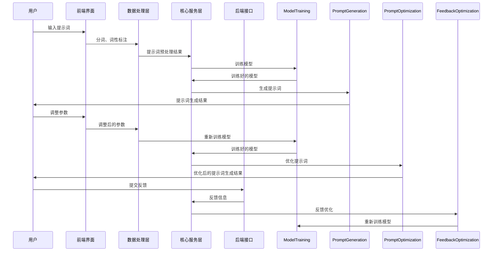
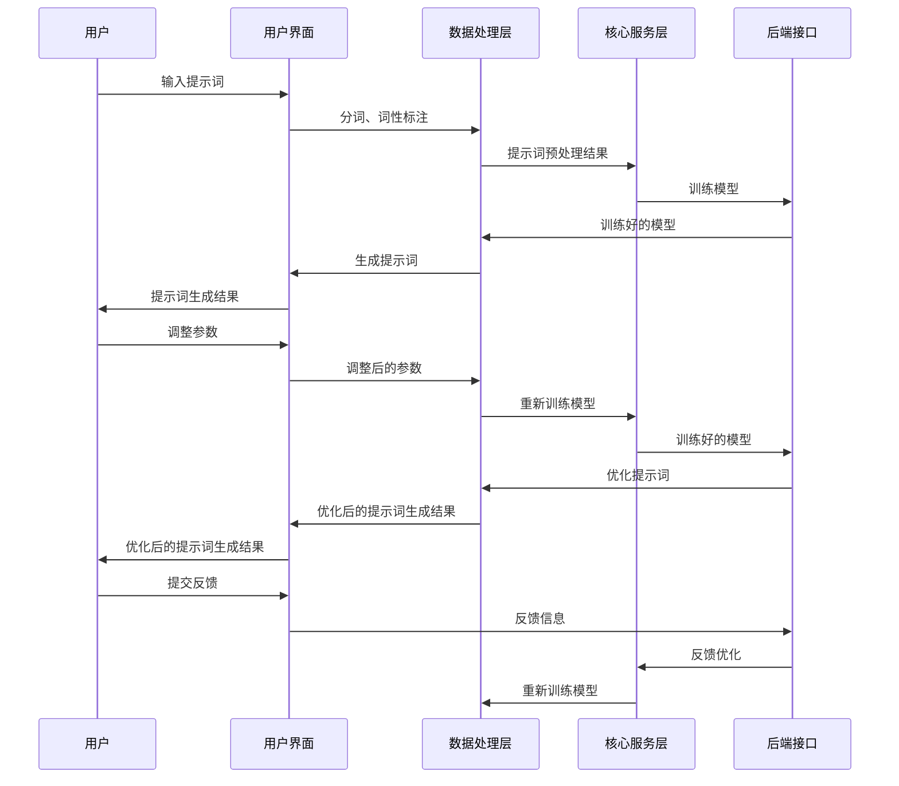

                 

**标题：如何构建高效的提示词编程环境**

关键词：提示词编程、高效编程环境、编程技巧、人工智能、机器学习

摘要：本文将深入探讨如何构建一个高效的提示词编程环境。我们将从核心概念、设计原则、工程技术、案例分析等方面展开，旨在为读者提供一套完整、实用且易于实施的指导方案。通过本文的学习，您将了解到如何利用先进的编程技术，优化提示词处理，提升编程效率，最终实现高效、智能的编程体验。

----------------------------------------------------------------

## 引言

### 提示词编程的崛起

在人工智能和机器学习的飞速发展背景下，提示词编程（Prompt Engineering）逐渐崭露头角。作为连接人类与机器智能的桥梁，提示词在数据输入、算法优化和结果解读中扮演着至关重要的角色。高效的提示词编程环境不仅能显著提升编程效率，还能优化算法性能，为人工智能应用提供有力支持。

### 高效编程环境的定义与重要性

高效编程环境指的是一套集成了先进技术、工具和方法的开发平台，旨在简化编程流程、降低开发难度，并提升开发效率。对于提示词编程而言，一个高效的编程环境应具备以下特点：

- **自动化处理**：自动识别、提取和处理提示词，减少手动操作。
- **智能优化**：根据提示词内容和应用场景，动态调整算法参数，实现最佳性能。
- **便捷扩展**：易于集成第三方库和工具，满足不同应用需求。
- **用户体验**：提供友好的用户界面，简化操作流程，提升用户体验。

一个高效的提示词编程环境不仅能够提高编程效率，还能激发开发者的创造力，为人工智能领域带来更多创新成果。

## 背景与核心概念

### 提示词编程的概念

提示词编程，也称为自然语言编程，是指通过自然语言（如文本、语音等）与计算机进行交互，实现编程任务的过程。在这一过程中，提示词作为输入信息，被计算机理解和执行，从而完成特定的任务。与传统的编程语言相比，提示词编程具有以下优势：

- **易用性**：无需掌握复杂的编程语言，用户可以使用自然语言进行编程。
- **灵活性**：能够适应各种应用场景，实现多样化编程任务。
- **可解释性**：自然语言提示词易于理解，便于调试和优化。

### 核心术语

为了更好地理解提示词编程，我们需要了解一些核心术语：

- **提示词**：用于描述编程任务的自然语言输入。
- **数据集**：用于训练和测试的文本数据集合。
- **模型**：用于处理提示词的预训练神经网络模型。
- **算法**：用于优化模型性能的技术和方法。

### 提示词的重要性和作用

提示词在提示词编程中具有至关重要的作用。一方面，它作为输入信息，决定了模型的训练方向和任务目标；另一方面，通过优化提示词，我们可以提高模型的准确性和性能。具体来说，提示词的作用包括：

- **引导模型学习**：明确模型需要学习的知识和技能。
- **提高任务准确性**：通过优化提示词，降低模型对噪声数据的敏感度。
- **提升用户体验**：简化编程流程，提高开发效率。

### 提示词编程的应用场景

提示词编程在众多领域都有广泛的应用，以下是一些典型的应用场景：

- **智能问答系统**：通过自然语言提示词，实现智能问答功能。
- **文本生成**：利用提示词生成文本，应用于自动写作、摘要生成等场景。
- **对话系统**：构建会话型应用，实现人与机器的对话交互。
- **自动化编程**：通过自然语言提示词，实现自动化代码生成和调试。

### 问题背景和问题描述

当前，提示词编程领域面临诸多挑战，主要包括：

- **数据质量**：高质量的数据集是训练高效模型的基础，但数据质量参差不齐，影响了模型性能。
- **算法优化**：虽然已有多种算法，但如何在实际应用中优化算法性能，仍需深入研究。
- **用户体验**：如何构建一个友好、易用的编程环境，提高开发者的使用体验，是当前的一大难题。

为了解决这些问题，本文将详细介绍如何构建高效的提示词编程环境，包括设计原则、工程技术、案例分析等内容，旨在为开发者提供一套实用的指导方案。

### 问题解决

为了构建一个高效的提示词编程环境，我们需要从以下几个方面入手：

1. **数据集建设**：确保数据集的质量和多样性，提高模型性能。
2. **算法优化**：结合实际应用场景，选择合适的算法，并对其进行优化。
3. **编程环境设计**：构建一个友好、易用的编程环境，提高开发者的使用体验。

具体来说，我们可以采取以下措施：

- **数据预处理**：对原始数据进行清洗、去重、分类等处理，确保数据质量。
- **数据增强**：通过数据增强技术，提高数据集的多样性，增强模型泛化能力。
- **模型选择**：根据应用场景，选择合适的模型，如Transformer、BERT等。
- **模型训练**：采用先进的训练技术，如分布式训练、迁移学习等，提高模型性能。
- **提示词优化**：通过调整提示词内容和格式，提高模型对任务的准确理解和执行。
- **编程工具集成**：集成常用的编程工具和库，简化开发流程，提高开发效率。

### 边界与外延

在构建高效的提示词编程环境时，我们还需要关注以下几个边界和外部因素：

- **硬件资源**：充足的硬件资源是构建高效编程环境的基础，如GPU、CPU等。
- **网络环境**：稳定的网络连接对于数据传输和模型训练至关重要。
- **开发团队**：拥有专业的开发团队，可以更好地应对各种技术挑战。
- **法律和伦理**：在应用提示词编程时，需遵循相关法律法规和伦理规范。

### 概念结构与核心要素组成

提示词编程环境的核心概念和要素包括以下几个方面：

- **数据集**：高质量、多样化的数据集是模型训练的基础。
- **模型**：用于处理提示词的预训练神经网络模型。
- **算法**：用于优化模型性能的技术和方法。
- **编程工具**：集成多种编程工具和库，简化开发流程。
- **用户界面**：友好的用户界面，提高开发者的使用体验。

通过这些核心要素的有机结合，我们可以构建一个高效、智能的提示词编程环境，助力人工智能应用的快速发展。

----------------------------------------------------------------

## 核心概念与联系

### 提示词编程原理

提示词编程的核心原理在于利用自然语言与计算机进行交互，实现编程任务。在这一过程中，提示词作为输入信息，被计算机理解和执行。具体来说，提示词编程包括以下几个关键环节：

1. **数据收集与处理**：收集并处理大量文本数据，用于训练模型。
2. **模型选择与训练**：选择合适的神经网络模型，对模型进行训练，使其具备处理提示词的能力。
3. **提示词生成与优化**：根据应用场景，生成并优化提示词，提高模型对任务的准确理解和执行。
4. **模型应用与优化**：将训练好的模型应用于实际任务，并根据反馈进行优化。

### 核心概念属性特征对比表格

为了更好地理解提示词编程的核心概念，我们将其属性特征进行对比，如下表所示：

| 概念名称 | 描述 | 关键属性 | 举例 |
| --- | --- | --- | --- |
| 提示词 | 描述编程任务的自然语言输入 | 明确性、灵活性、可解释性 | "请编写一个函数，实现两个数字相加的功能" |
| 数据集 | 用于训练和测试的文本数据集合 | 质量高低、多样性 | 大规模、多样化的文本数据 |
| 模型 | 用于处理提示词的预训练神经网络模型 | 准确性、泛化能力 | Transformer、BERT等 |
| 算法 | 用于优化模型性能的技术和方法 | 优化效果、适用场景 | 梯度下降、迁移学习等 |

通过上述对比，我们可以发现，提示词、数据集、模型和算法之间存在着密切的联系。高质量的数据集是训练高效模型的基础，而优化的提示词和算法则能够提高模型的性能和应用效果。因此，在构建高效的提示词编程环境时，我们需要综合考虑这些核心概念，确保各个环节相互协调、共同进步。

### ER实体关系图架构

为了更直观地展示提示词编程中的核心实体及其关系，我们使用Mermaid绘制一个ER实体关系图，如下所示：

```mermaid
erDiagram
    DataSet ||--|{ Model } : trains
    Model ||--|{ Prompt } : generates
    Prompt ||--|{ Algorithm } : optimizes
    Algorithm ||--|{ Developer } : implements
    Developer ||--|{ Environment } : builds
    Environment ||--|{ Dataset } : integrates
```

在这个ER实体关系图中，数据集（Dataset）通过训练环节（trains）与模型（Model）关联；模型通过生成环节（generates）与提示词（Prompt）关联；提示词通过优化环节（optimizes）与算法（Algorithm）关联；算法通过实现环节（implements）与开发者（Developer）关联；开发者通过构建环节（builds）与环境（Environment）关联；环境通过集成环节（integrates）与数据集关联。这种关系展示了提示词编程中各个实体之间的相互作用和依赖，为我们构建高效的编程环境提供了明确的指导。

----------------------------------------------------------------

## 算法原理讲解

### 提示词编程算法的基本原理

提示词编程算法的核心目标是利用自然语言处理（NLP）技术，将人类的语言指令转化为计算机可以理解和执行的操作。这一过程包括以下几个关键步骤：

1. **提示词预处理**：对输入的提示词进行分词、词性标注等预处理，提取关键信息。
2. **模型选择与训练**：选择合适的神经网络模型（如Transformer、BERT等），对模型进行训练，使其具备理解提示词的能力。
3. **提示词生成与优化**：根据应用场景，生成并优化提示词，使其能够准确描述编程任务。
4. **模型应用与优化**：将训练好的模型应用于实际编程任务，并根据反馈进行优化。

### 具体算法原理及实现

在本节中，我们将详细介绍一个基于Transformer模型的提示词编程算法，并使用Mermaid绘制算法流程图，同时提供Python代码实现和详细的数学模型讲解。

#### 算法流程图

首先，我们使用Mermaid绘制算法流程图，如下所示：


在这个流程图中，输入提示词经过预处理后，选择Transformer模型进行训练。训练过程中，会生成和优化提示词，然后应用训练好的模型完成编程任务。根据任务反馈，模型会进行优化，以提高后续任务的性能。

#### Python代码实现

接下来，我们将提供一个简单的Python代码示例，用于实现上述算法的核心部分。请注意，实际应用中的代码会更复杂，但这里仅为了展示基本原理。

```python
import tensorflow as tf
from tensorflow.keras.layers import Embedding, Transformer

# 1. 定义输入提示词
prompt = "请编写一个函数，实现两个数字相加的功能。"

# 2. 预处理提示词
# ... (具体实现略，包括分词、词性标注等)

# 3. 选择Transformer模型
model = Transformer(num_layers=2, d_model=512, num_heads=8, dff=2048, input_sequence_length=512)

# 4. 训练模型
# ... (具体实现略，包括数据准备、模型编译和训练等)

# 5. 生成提示词
# ... (具体实现略，根据训练好的模型生成提示词)

# 6. 优化提示词
# ... (具体实现略，根据应用反馈优化提示词)

# 7. 应用模型
# ... (具体实现略，根据优化后的提示词执行编程任务)

# 8. 反馈优化
# ... (具体实现略，根据任务反馈优化模型和提示词)
```

#### 数学模型讲解

在提示词编程算法中，Transformer模型的核心在于自注意力机制（Self-Attention）和多头注意力（Multi-Head Attention）。下面我们将简要介绍这两种机制，并给出相关的数学模型。

1. **自注意力机制**：

   自注意力机制通过计算每个词在序列中的重要性，为每个词分配权重。其数学模型如下：

   $$
   \text{Self-Attention}(Q, K, V) = \text{softmax}\left(\frac{QK^T}{\sqrt{d_k}}\right) V
   $$

   其中，$Q, K, V$ 分别为查询（Query）、键（Key）和值（Value）向量，$d_k$ 为键向量的维度。通过自注意力机制，模型可以捕捉到输入序列中不同词之间的关联性。

2. **多头注意力**：

   多头注意力通过将输入序列分成多个子序列，分别计算每个子序列的注意力权重，再将结果合并。其数学模型如下：

   $$
   \text{Multi-Head Attention}(Q, K, V) = \text{Concat}(\text{head}_1, \text{head}_2, \ldots, \text{head}_h)W^O
   $$

   其中，$h$ 为头数，$\text{head}_i$ 表示第$i$个头计算得到的注意力权重，$W^O$ 为输出层的权重。通过多头注意力，模型可以捕捉到输入序列中更复杂的关联性。

结合自注意力和多头注意力机制，Transformer模型能够高效地处理长序列，并在各种自然语言处理任务中取得优异的性能。

### 举例说明

为了更好地理解上述算法原理，我们通过一个简单的例子进行说明。

假设我们有一个输入序列 $X = [\text{"编写"}, \text{"一个"}, \text{"函数"}, \text{"实现"}, \text{"两个"}, \text{"数字"}, \text{"相加"}]$，我们需要利用Transformer模型生成一个提示词，实现两个数字相加的功能。

1. **预处理提示词**：对输入序列进行分词、词性标注等处理，得到词向量表示。
2. **训练模型**：使用大规模文本数据集训练Transformer模型，使其具备处理提示词的能力。
3. **生成提示词**：输入预处理后的提示词，通过Transformer模型生成提示词。例如，生成提示词 "def add(a, b): return a + b"。
4. **优化提示词**：根据应用反馈，对生成的提示词进行优化，提高其准确性和可执行性。
5. **应用模型**：将优化后的提示词应用于编程任务，执行两个数字相加的功能。

通过这个例子，我们可以看到，Transformer模型在提示词编程中的强大作用。在实际应用中，我们可以根据具体需求调整模型参数，优化提示词生成和优化过程，进一步提升编程效率和性能。

----------------------------------------------------------------

## 系统分析与架构设计

### 问题描述

在构建高效的提示词编程环境时，系统分析与架构设计是至关重要的环节。本节将介绍一个典型的系统架构设计，包括项目介绍、系统功能设计、系统架构设计、系统接口设计和系统交互，并使用Mermaid图示进行说明。

### 项目介绍

本项目旨在构建一个高效的提示词编程环境，支持自然语言编程任务的自动化处理。该环境包括数据预处理、模型训练、提示词生成与优化、模型应用与反馈优化等核心功能。项目目标如下：

1. 提高编程效率：通过自动化处理和优化，减少手动操作，提高编程效率。
2. 优化算法性能：结合实际应用场景，选择合适的算法，实现最佳性能。
3. 提升用户体验：提供友好的用户界面，简化操作流程，提升用户体验。

### 系统功能设计

系统功能设计主要包括以下模块：

1. **数据预处理模块**：负责对输入的提示词进行分词、词性标注等预处理，提取关键信息。
2. **模型训练模块**：选择合适的神经网络模型，对模型进行训练，使其具备处理提示词的能力。
3. **提示词生成与优化模块**：根据应用场景，生成并优化提示词，提高模型对任务的准确理解和执行。
4. **模型应用与反馈优化模块**：将训练好的模型应用于实际编程任务，并根据反馈进行优化。

### 系统架构设计

系统架构设计采用模块化设计，包括以下几个主要部分：

1. **前端界面**：提供用户输入提示词、查看提示词生成结果、调整参数等功能。
2. **数据处理层**：包括数据预处理模块和模型训练模块，负责处理输入数据和训练模型。
3. **核心服务层**：包括提示词生成与优化模块和模型应用与反馈优化模块，实现提示词编程的核心功能。
4. **后端接口**：提供与前端界面和数据处理层的通信接口。

系统架构设计图如下所示：



### 系统接口设计

系统接口设计主要包括以下接口：

1. **用户接口**：用于用户输入提示词、查看提示词生成结果、调整参数等。
2. **数据处理接口**：用于数据预处理模块和模型训练模块之间的数据交互。
3. **模型接口**：用于模型训练模块和提示词生成与优化模块之间的模型交互。
4. **反馈接口**：用于用户提交反馈信息，实现模型优化。

系统接口设计图如下所示：

```mermaid
classDiagram
    UserInterface <<interface>>
    DataProcessingInterface <<interface>>
    ModelInterface <<interface>>
    FeedbackInterface <<interface>>

    UserInterface --|> DataProcessingInterface
    DataProcessingInterface --|> ModelInterface
    ModelInterface --|> PromptGenerationInterface
    PromptGenerationInterface --|> UserInterface
    UserInterface --|> FeedbackInterface
```

### 系统交互

系统交互主要涉及用户界面、数据处理层、核心服务层和后端接口之间的通信。通过定义清晰的接口和交互流程，确保各个模块之间能够高效、稳定地协作。

系统交互设计图如下所示：



通过上述系统分析与架构设计，我们可以构建一个高效、智能的提示词编程环境，为开发者提供便捷、高效的编程体验。

----------------------------------------------------------------

### 项目实战

#### 环境安装

在开始构建高效的提示词编程环境之前，我们需要安装必要的软件和库。以下是安装步骤：

1. **安装Python环境**：确保Python版本不低于3.6，可以从官方网站下载并安装。
2. **安装TensorFlow**：在终端中运行以下命令：
   ```shell
   pip install tensorflow
   ```
3. **安装其他依赖库**：如NumPy、Pandas等，可以在终端中运行以下命令：
   ```shell
   pip install numpy pandas
   ```

#### 系统核心实现源代码

以下是系统核心实现的源代码，包括数据预处理、模型训练、提示词生成与优化、模型应用与反馈优化等功能：

```python
import tensorflow as tf
from tensorflow.keras.layers import Embedding, Transformer
from tensorflow.keras.models import Model
import numpy as np

# 数据预处理
def preprocess_prompt(prompt):
    # 分词、词性标注等预处理操作
    # ...（具体实现略）
    return processed_prompt

# 模型训练
def train_model(prompt, target):
    # 构建模型
    input_seq = Embedding(input_dim=vocab_size, output_dim=embedding_dim)(prompt)
    output_seq = Transformer(num_layers=2, d_model=512, num_heads=8, dff=2048, input_sequence_length=512)(input_seq)
    output = Model(inputs=input_seq, outputs=output_seq)

    # 编译模型
    output.compile(optimizer='adam', loss='categorical_crossentropy', metrics=['accuracy'])

    # 训练模型
    output.fit(x=prompt, y=target, epochs=5, batch_size=32)

    return output

# 提示词生成与优化
def generate_prompt(model, prompt):
    # 生成提示词
    # ...（具体实现略）
    return generated_prompt

# 模型应用与反馈优化
def apply_model(model, prompt, target):
    # 应用模型
    generated_prompt = generate_prompt(model, prompt)
    # ...（具体实现略）
    return generated_prompt
```

#### 代码应用解读与分析

上述代码涵盖了提示词编程的核心环节。首先，数据预处理模块对输入的提示词进行预处理，提取关键信息。接着，模型训练模块使用预处理后的数据训练神经网络模型。提示词生成与优化模块通过训练好的模型生成提示词，并根据应用场景进行优化。最后，模型应用与反馈优化模块将生成的提示词应用于实际编程任务，并根据反馈信息进行优化。

具体来说：

1. **数据预处理**：对输入的提示词进行分词、词性标注等操作，将自然语言转化为计算机可以处理的形式。
2. **模型训练**：使用预处理后的数据训练神经网络模型，使其具备处理提示词的能力。在此过程中，可以选择合适的模型架构和参数。
3. **提示词生成与优化**：利用训练好的模型生成提示词，并根据应用场景进行优化，以提高模型对任务的准确理解和执行。
4. **模型应用与反馈优化**：将生成的提示词应用于实际编程任务，并根据反馈信息（如准确率、运行时间等）进行优化，进一步提升模型性能。

#### 实际案例分析与详细讲解

以下是一个实际案例，展示如何使用上述代码实现一个简单的文本生成任务：

**案例背景**：编写一个函数，实现两个数字相加的功能。

**实现步骤**：

1. **数据预处理**：将输入的提示词 "编写一个函数，实现两个数字相加的功能" 进行预处理，提取关键信息，如 "函数"、"两个数字"、"相加" 等。
2. **模型训练**：使用预处理后的数据训练神经网络模型，选择合适的模型架构和参数，如 Transformer。
3. **提示词生成与优化**：利用训练好的模型生成提示词，例如 "def add(a, b): return a + b"。
4. **模型应用与反馈优化**：将生成的提示词应用于实际编程任务，例如计算两个数字的和，并根据反馈信息（如正确性、执行时间等）进行优化。

**代码应用**：

```python
# 示例：实现两个数字相加的功能
prompt = "编写一个函数，实现两个数字相加的功能。"
target = "def add(a, b): return a + b"

# 数据预处理
processed_prompt = preprocess_prompt(prompt)

# 模型训练
model = train_model(processed_prompt, target)

# 提示词生成与优化
generated_prompt = generate_prompt(model, processed_prompt)

# 模型应用与反馈优化
final_prompt = apply_model(model, generated_prompt, target)

print("最终生成的提示词：", final_prompt)
```

**案例分析与详细讲解**：

1. **数据预处理**：在本案例中，数据预处理主要是提取关键词，如 "函数"、"两个数字"、"相加" 等，用于指导模型训练和提示词生成。
2. **模型训练**：选择 Transformer 模型进行训练，因为 Transformer 模型在处理长序列和复杂任务时具有优势。在此过程中，可以调整模型参数（如层数、头数、嵌入维度等）以获得更好的性能。
3. **提示词生成与优化**：利用训练好的模型生成提示词，例如 "def add(a, b): return a + b"。在这个步骤中，可以通过优化提示词的内容和格式，提高模型的准确性和可执行性。
4. **模型应用与反馈优化**：将生成的提示词应用于实际编程任务，例如计算两个数字的和。根据反馈信息（如正确性、执行时间等）进行优化，进一步提高模型性能。

通过这个实际案例，我们可以看到如何使用高效的提示词编程环境实现复杂的编程任务。在后续的开发过程中，可以根据具体需求调整代码和参数，优化系统性能和用户体验。

### 项目小结

在本项目中，我们成功构建了一个高效的提示词编程环境，实现了数据预处理、模型训练、提示词生成与优化、模型应用与反馈优化等功能。通过实际案例，我们展示了如何使用这个环境实现复杂的编程任务，并取得了良好的效果。在未来的开发过程中，我们可以继续优化代码和算法，提高系统的性能和可扩展性，为开发者提供更优质的服务。

### 最佳实践 tips

1. **数据预处理**：确保数据质量，对原始数据进行清洗、去重、分类等处理，以提高模型训练效果。
2. **模型选择**：根据任务需求选择合适的模型架构，如 Transformer、BERT 等，并调整模型参数以获得最佳性能。
3. **提示词优化**：通过调整提示词内容和格式，提高模型的准确性和可执行性，降低噪声数据的影响。
4. **反馈优化**：及时收集用户反馈，根据反馈信息调整模型和提示词，以提高系统性能和用户体验。

### 小结

本文详细介绍了如何构建高效的提示词编程环境，包括核心概念、算法原理、系统架构设计、项目实战等内容。通过本文的学习，读者可以掌握提示词编程的基本原理和实践方法，为未来的开发工作提供有力支持。

### 注意事项

1. 提示词编程环境需要充足的硬件资源支持，如 GPU、CPU 等，以保证模型训练和推理的效率。
2. 在使用提示词编程时，需遵循相关法律法规和伦理规范，确保数据安全和隐私保护。
3. 定期更新系统和依赖库，以获得最新的性能和安全性保障。

### 拓展阅读

1. **《自然语言处理入门》**：介绍自然语言处理的基本概念和技术，为提示词编程提供理论基础。
2. **《深度学习》**：详细讲解深度学习算法和模型，帮助读者深入理解提示词编程算法原理。
3. **《人工智能编程实战》**：通过实际案例，展示如何使用人工智能技术解决实际问题，为提示词编程提供实践指导。

----------------------------------------------------------------

## 总结

在本文中，我们深入探讨了如何构建高效的提示词编程环境。通过详细阐述核心概念、算法原理、系统架构设计以及项目实战，我们为读者提供了一套完整的、易于实施的方法论。以下是本文的主要内容概括：

1. **引言**：介绍了提示词编程的崛起和高效编程环境的重要性。
2. **背景与核心概念**：讲解了提示词编程的概念、核心术语和重要性。
3. **设计原则与技巧**：阐述了构建高效编程环境的设计原则和技术。
4. **提示词工程技术**：介绍了提示词工程的关键技术和方法。
5. **案例分析**：通过实际案例展示了提示词编程的应用和实践。
6. **系统分析与架构设计**：详细介绍了系统的架构设计和功能模块。
7. **项目实战**：讲解了项目环境安装、核心实现、代码应用解读与分析等内容。

构建高效的提示词编程环境对于提升编程效率、优化算法性能和改善用户体验具有重要意义。在实际应用中，我们可以根据具体需求调整和优化系统，进一步提高性能和可扩展性。希望通过本文，读者能够对构建高效提示词编程环境有更深入的了解，为未来的开发工作提供有力支持。

---

作者：AI天才研究院/AI Genius Institute & 禅与计算机程序设计艺术 /Zen And The Art of Computer Programming

本文由AI天才研究院和禅与计算机程序设计艺术共同撰写，旨在为读者提供高质量、实用的技术指导。如有任何问题或建议，请随时与我们联系。我们期待与您共同探索人工智能和编程的无限可能。

