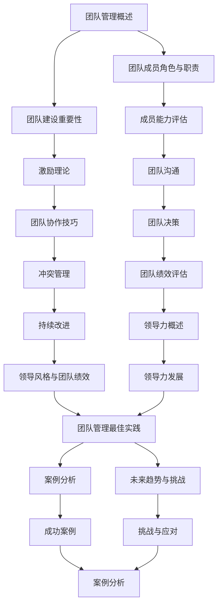

                 

# 如何管理团队：打造高效协作的秘诀

## 关键词

- 团队管理
- 高效协作
- 激励理论
- 沟通技巧
- 冲突管理
- 领导力
- 绩效评估
- 持续改进

## 摘要

本文旨在探讨团队管理的核心要素，包括团队管理的概述、团队成员能力评估与激励、团队沟通与协作、团队决策与冲突管理、团队绩效评估与持续改进、领导力发展、最佳实践与案例分析，以及团队管理的未来趋势与挑战。通过系统化的分析与实战案例分享，本文旨在为管理者提供一套实用的团队管理方法论，以实现团队的高效协作与持续发展。

## 第一部分：团队管理基础知识

### 第1章：团队管理概述

#### 1.1 问题背景与团队管理的意义

在现代企业中，团队管理已经成为企业管理的重要组成部分。随着组织结构的日益复杂化和市场环境的快速变化，有效的团队管理对企业的生存与发展至关重要。

**问题背景：**
- 多样化的团队成员背景和技能要求
- 快速变化的市场需求和项目周期
- 信息流动和沟通的障碍
- 团队成员之间的冲突和协作问题

**团队管理的定义：**
团队管理是指通过科学的方法和技巧，对团队成员进行组织、协调、激励和控制，以提高团队的工作效率和绩效水平。

**团队管理的重要性：**
- 提高团队协作效率
- 促进团队成员的个人成长
- 增强团队的创新能力和竞争力
- 实现企业的战略目标

### 1.2 团队成员的角色与职责

**团队成员的角色：**
- 项目经理：负责项目的整体规划、协调和监督
- 技术专家：负责技术方案的制定和实现
- 产品经理：负责产品需求的收集、分析和规划
- 运营人员：负责日常运营工作，如用户支持、市场推广等

**团队成员的职责：**
- 项目经理：确保项目按时按质完成，协调团队成员的工作
- 技术专家：提供技术支持，解决技术问题
- 产品经理：确保产品满足用户需求，与开发团队紧密合作
- 运营人员：负责产品的市场推广和用户服务

**团队成员的职责分工与协作：**
- 明确团队成员的职责和分工
- 建立有效的沟通渠道和协作机制
- 定期进行团队会议和协作活动

### 1.3 团队建设的重要性

**团队建设的定义：**
团队建设是指通过一系列活动和措施，增强团队成员之间的信任、协作和凝聚力，以提高团队的整体表现。

**团队建设的目标：**
- 增强团队成员之间的信任
- 提高团队协作效率
- 培养团队创新精神和解决问题的能力
- 提高团队的凝聚力和向心力

**团队建设的步骤：**
1. 确定团队建设的目标和需求
2. 设计合适的团队建设活动
3. 实施团队建设活动
4. 评估团队建设的成效

## 第二部分：团队成员能力评估与激励

### 第2章：团队成员能力评估

#### 2.1 成员能力评估的重要性

团队成员能力评估是团队管理的重要组成部分，通过评估可以了解团队成员的能力水平、优势和劣势，为后续的培训和发展提供依据。

#### 2.2 成员能力评估的方法

- 360度评估：通过团队成员、上级、同事和下属等多方面的反馈，对成员的能力进行全面评估
- 目标评估：根据成员的工作目标和绩效指标，评估成员的工作表现
- 成果评估：根据成员的工作成果和贡献，评估成员的能力和绩效

#### 2.3 成员能力评估的步骤

1. 确定评估目标和标准
2. 收集评估数据
3. 分析评估结果
4. 制定改进和发展计划

### 第3章：激励理论

#### 3.1 激励的定义

激励是指通过某种手段或措施，激发团队成员的工作动机和积极性，以提高工作绩效。

#### 3.2 激励理论

- 马斯洛需求层次理论：人的需求从低到高分为生理需求、安全需求、社交需求、尊重需求和自我实现需求
- 双因素理论：工作环境和动机因素对员工满意度的影响
- 权变理论：根据不同的情况和员工的需求，选择合适的激励方式

#### 3.3 激励方法

- 薪酬激励：通过合理的薪酬体系和奖励制度，激发员工的工作积极性
- 职业发展：为员工提供职业发展的机会和空间，激发员工的成长动力
- 工作环境：营造良好的工作氛围，提高员工的工作满意度
- 文化建设：建立积极向上的企业文化，增强员工的归属感和凝聚力

### 第4章：激励策略与实践

#### 4.1 激励策略

- 目标激励：设定明确的目标和期望，激发员工的工作动力
- 权力激励：赋予员工一定的权力和责任，激发员工的主观能动性
- 成就激励：认可员工的成就和贡献，提高员工的荣誉感和成就感
- 文化激励：建立积极向上的企业文化，激发员工的认同感和归属感

#### 4.2 激励实践

- 制定明确的绩效目标和奖励制度
- 提供职业发展机会和培训
- 营造良好的工作氛围和团队文化
- 定期进行员工满意度调查和反馈

## 第三部分：团队沟通与协作

### 第5章：团队沟通

#### 5.1 沟通的重要性

沟通是团队协作的核心，有效的沟通可以促进团队成员之间的理解和协作，提高团队的工作效率和绩效。

#### 5.2 团队沟通的重要性

- 促进团队成员之间的信息共享
- 提高团队决策的质量和效率
- 减少误解和冲突
- 增强团队的凝聚力和信任感

#### 5.3 沟通障碍与解决方法

- 语言障碍：使用简洁明了的语言，避免使用专业术语和缩写
- 信息过滤：建立透明的沟通渠道，减少信息过滤和失真
- 知识共享：鼓励团队成员分享知识和经验，提高团队的集体智慧
- 文化差异：尊重团队成员的文化差异，建立包容的文化氛围

### 第6章：团队协作

#### 6.1 团队协作的定义

团队协作是指团队成员为了共同的目标，通过相互配合、共享资源和信息，共同完成任务的过程。

#### 6.2 团队协作的技巧

- 明确目标：确保团队成员对目标有清晰的认识和认同
- 分工合作：合理分配任务，发挥团队成员的特长
- 沟通协调：建立有效的沟通机制，确保信息畅通
- 风险共享：共同面对风险和挑战，增强团队的凝聚力
- 反馈机制：建立反馈机制，及时调整和改进工作方法

#### 6.3 团队协作工具

- 工作流工具：如Trello、Asana等，用于任务分配和进度跟踪
- 会议工具：如Zoom、Microsoft Teams等，用于远程会议和协作
- 共享文档：如Google Docs、Microsoft Office 365等，用于文件共享和协作编辑

## 第四部分：团队决策与冲突管理

### 第7章：团队决策

#### 7.1 团队决策的定义

团队决策是指团队成员共同参与，通过讨论和协商，作出关于团队工作方向、目标和方法的选择。

#### 7.2 团队决策方法

- 组合决策法：根据团队成员的不同意见和特长，进行组合决策
- 群体头脑风暴：鼓励团队成员自由发言，提出各种创意和方案
- 多因素决策法：综合考虑各种因素，选择最优方案
- 专家咨询法：邀请相关领域的专家提供意见和建议

#### 7.3 团队决策步骤

1. 确定决策目标和问题
2. 收集相关信息
3. 分析问题
4. 提出方案
5. 评估和选择方案
6. 实施决策
7. 评估决策效果

### 第8章：冲突管理

#### 8.1 冲突的定义

冲突是指团队成员之间由于目标、方法、利益等方面的不一致而产生的争执和矛盾。

#### 8.2 冲突的类型

- 目标冲突：团队成员对目标的认知不一致
- 方法冲突：团队成员对解决问题的方法有不同的看法
- 利益冲突：团队成员的利益发生冲突

#### 8.3 冲突管理方法

- 开放式沟通：鼓励团队成员表达观点和意见，建立开放的沟通环境
- 寻求共识：通过讨论和协商，寻求团队成员的共同点和共识
- 调解仲裁：在冲突无法解决时，通过第三方调解或仲裁来解决
- 预防冲突：建立有效的沟通机制和协作文化，预防冲突的发生

## 第五部分：团队绩效评估与持续改进

### 第9章：团队绩效评估

#### 9.1 团队绩效评估的定义

团队绩效评估是指对团队整体工作成果和绩效水平的评价和分析，以评估团队的工作表现和效果。

#### 9.2 团队绩效评估的方法

- 目标评估法：根据团队的目标和指标，评估团队的工作成果
- 成果评估法：根据团队的工作成果和贡献，评估团队的绩效
- 过程评估法：根据团队的工作过程和方法，评估团队的工作效率和质量

#### 9.3 团队绩效评估步骤

1. 确定评估目标和标准
2. 收集评估数据
3. 分析评估结果
4. 反馈评估结果
5. 制定改进和发展计划

### 第10章：持续改进

#### 10.1 持续改进的定义

持续改进是指通过不断的反思、评估和优化，提高团队的工作效率和绩效水平。

#### 10.2 持续改进的方法

- 精益管理：通过不断优化流程和减少浪费，提高工作效率
- 敏捷开发：通过迭代和反馈，不断改进和优化产品和服务
- 基于数据的决策：通过数据分析，指导团队的工作方向和策略

#### 10.3 持续改进的步骤

1. 确定改进目标和方向
2. 收集改进数据
3. 分析改进数据
4. 制定改进计划
5. 实施改进计划
6. 评估改进效果

## 第六部分：团队领导力

### 第11章：领导力概述

#### 11.1 领导力的定义

领导力是指领导者通过影响、激励和引导团队成员，实现团队目标和共同愿景的能力。

#### 11.2 领导力的特征

- 愿景领导：明确团队目标和愿景，激励团队成员为实现目标而努力
- 沟通能力：善于倾听和表达，建立良好的沟通渠道和氛围
- 激励能力：激发团队成员的积极性、主动性和创造力
- 协作能力：善于协调团队成员之间的关系，促进团队合作
- 决策能力：在面对复杂问题和挑战时，能够做出明智的决策

#### 11.3 领导力的类型

- 超越领导：通过建立共同愿景和激发团队潜力，超越常规完成任务
- 事务领导：专注于团队日常事务的执行和管理，确保任务的完成
- 变革领导：推动团队和组织变革，引领团队应对挑战和变革

### 第12章：领导风格与团队绩效

#### 12.1 领导风格

领导风格是指领导者对待团队和管理工作的方式和态度。

- 专制式领导：领导者集中权力，决策高度集中
- 民主式领导：领导者与团队成员共同参与决策，尊重团队成员的意见
- 放任式领导：领导者赋予团队成员高度自主权，决策和责任由团队成员自行承担

#### 12.2 领导风格与团队绩效的关系

- 专制式领导：有利于任务完成，但可能导致团队士气低落和创新不足
- 民主式领导：有利于团队凝聚力和创新，但可能影响决策效率和执行力
- 放任式领导：有利于团队自主性和创造力，但可能缺乏统一目标和协调

#### 12.3 不同领导风格的应用场景

- 专制式领导：适用于任务紧急、决策需要快速执行的场景
- 民主式领导：适用于需要团队成员积极参与、发挥团队智慧的场景
- 放任式领导：适用于团队已经具备较高的自主性和协作能力，领导者需要退居二线的场景

### 第13章：领导力发展与实践

#### 13.1 领导力发展的方法

- 培训与教育：参加领导力培训和课程，学习领导力和管理知识
- 经验积累：通过实际工作经验，不断反思和总结，提高领导能力
- 反馈与改进：接受团队成员和上级的反馈，不断改进领导风格和管理方法

#### 13.2 领导力实践

- 建立愿景和目标：明确团队目标和愿景，激励团队成员为实现目标而努力
- 激励团队成员：关注团队成员的需求和成长，提供职业发展的机会和空间
- 沟通与协作：建立良好的沟通渠道和协作机制，促进团队成员之间的理解和合作
- 决策与执行：在面对复杂问题和挑战时，能够做出明智的决策，并确保决策的有效执行
- 持续改进：不断反思和优化团队管理方法和流程，提高团队的工作效率和绩效

## 第七部分：团队管理最佳实践与案例分析

### 第14章：团队管理最佳实践

#### 14.1 团队管理最佳实践

- 设定明确的目标和期望：确保团队成员对目标和期望有清晰的认识
- 分工合作：合理分配任务，发挥团队成员的特长
- 良好的沟通与协作：建立有效的沟通渠道和协作机制
- 激励与认可：关注团队成员的需求和成长，提供职业发展的机会和空间
- 持续改进：不断反思和优化团队管理方法和流程

#### 14.2 团队管理最佳实践的应用

- 在项目团队中，通过明确的任务分配和目标设定，提高团队的工作效率
- 在跨部门团队中，建立有效的沟通渠道和协作机制，促进信息共享和资源整合
- 在创新团队中，鼓励团队成员发挥创造力，提供支持和资源，促进团队创新
- 在敏捷开发团队中，通过持续改进和迭代，提高团队的工作效率和产品质量

### 第15章：案例分析

#### 15.1 成功案例

- 某互联网公司通过敏捷开发模式，实现了快速迭代和高效协作，提升了团队的工作效率和产品品质
- 某跨国公司通过扁平化组织结构和开放沟通渠道，增强了团队的凝聚力和创新能力

#### 15.2 失败案例

- 某科技公司由于领导力不足和沟通不畅，导致项目进度延误和团队士气低落
- 某制造企业由于激励制度不合理，导致员工流失和团队绩效下降

#### 15.3 案例分析

- 成功案例：通过敏捷开发模式，实现了快速迭代和高效协作，提升了团队的工作效率和产品品质
- 失败案例：由于领导力不足和沟通不畅，导致项目进度延误和团队士气低落

## 第八部分：团队管理未来趋势与挑战

### 第16章：未来趋势

#### 16.1 数字化管理

- 利用大数据和人工智能技术，实现团队管理和决策的智能化和精准化
- 通过数字化工具和平台，实现团队协作和沟通的无缝连接和高效运作

#### 16.2 智能化

- 利用人工智能技术，实现自动化流程和智能决策，提高团队的工作效率和准确性
- 通过智能助手和虚拟助手，提供个性化的服务和帮助，提升团队成员的工作体验

#### 16.3 个性化管理

- 根据团队成员的特点和需求，提供个性化的培训和发展计划，促进个人成长和团队发展
- 通过数据分析和反馈机制，实时调整团队管理策略和方法，实现个性化管理

### 第17章：挑战与应对

#### 17.1 挑战

- 数字化转型的挑战：如何适应数字化时代，提升团队管理和决策的智能化水平
- 智能化带来的挑战：如何应对人工智能和自动化技术对团队管理和工作方式的影响
- 个性化管理的挑战：如何满足团队成员的多样性和个性化需求，实现团队的有效管理和协作

#### 17.2 应对策略

- 提高团队数字化素养：加强团队成员的数字化技能和知识培训，提高团队的整体数字化水平
- 引入智能化工具和平台：利用人工智能和大数据技术，提升团队管理和决策的智能化和精准化
- 建立个性化管理机制：根据团队成员的特点和需求，提供个性化的培训和发展计划，促进个人成长和团队发展

## 第9章：团队管理小结与拓展阅读

### 9.1 小结

本文系统地介绍了团队管理的核心要素和方法，包括团队管理的概述、团队成员能力评估与激励、团队沟通与协作、团队决策与冲突管理、团队绩效评估与持续改进、领导力发展、最佳实践与案例分析，以及团队管理的未来趋势与挑战。通过本文的阅读，读者可以了解到团队管理的理论与实践，掌握提升团队效能的关键技巧。

### 9.2 拓展阅读

- 《团队管理实战：构建高效协作团队》
- 《领导力与团队管理》
- 《敏捷团队管理：敏捷开发实践指南》
- 《团队管理：从优秀到卓越》
- 《团队沟通与协作技巧》
- 《数字化时代团队管理创新》
- 《人工智能与团队管理》

## 总结

本文通过系统化的分析和实战案例分享，为读者提供了团队管理的全面方法论。在快速变化的工作环境中，有效的团队管理不仅是企业成功的关键，也是个人职业生涯发展的重要保障。通过本文的学习，读者可以：

- 理解团队管理的核心概念与重要性
- 掌握团队成员能力评估与激励的方法
- 提升团队沟通与协作效率
- 学会有效的团队决策与冲突管理策略
- 实现团队绩效评估与持续改进
- 发展领导力，提升个人与管理团队的能力
- 学习团队管理的最佳实践，借鉴成功案例，规避失败经验

未来，随着数字化、智能化管理工具的普及，团队管理将面临更多的挑战与机遇。本文为读者提供了一个全面且前瞻性的团队管理知识体系，帮助读者在未来的团队管理工作中应对各种复杂局面，实现团队的高效协作与持续发展。

在阅读本文的过程中，建议读者结合实际工作经验，深入思考并实践所学内容，以实现个人与团队的共同成长。通过不断的学习和实践，读者将能够成为优秀的团队管理者，为企业的发展贡献自己的力量。

### 作者

- 作者：AI天才研究院/AI Genius Institute & 禅与计算机程序设计艺术 /Zen And The Art of Computer Programming

# 附录

## 完整文章流程图

下面是一个完整的文章流程图，展示了各章节之间的关系：

## 附录：扩展阅读

以下是关于团队管理的扩展阅读推荐，这些资源将帮助读者更深入地了解团队管理的各个方面：

### 推荐书籍

1. 《团队协作的艺术》—— 作者：谢丽尔·桑德伯格
2. 《五要素团队》—— 作者：拉里·博西迪，拉姆·查兰
3. 《领导者的语言》—— 作者：约瑟夫·格里诺
4. 《激励与绩效》—— 作者：约翰·福斯特
5. 《团队的五项修炼》—— 作者：詹姆斯·M·凯瑟尔

### 学术文章

1. "The Five Dysfunctions of a Team" - Author: Patrick Lencioni
2. "Building the Best: Why Great Teams Don't Settle for Average" - Author: Dave Logan, John Gray, Halee Fischer-Wright
3. "Teamwork and the Interdependence of Roles" - Author: Katzenbach, J. R., & Smith, D. K.

### 网络资源

1. [Harvard Business Review](https://hbr.org/)
2. [MIT Sloan Management Review](https://sloanreview.mit.edu/)
3. [LinkedIn Learning](https://www.linkedin.com/learning/)
4. [Coursera](https://www.coursera.org/)

通过这些资源和进一步的深入研究，读者可以不断提升自己的团队管理能力，为企业和个人创造更大的价值。

