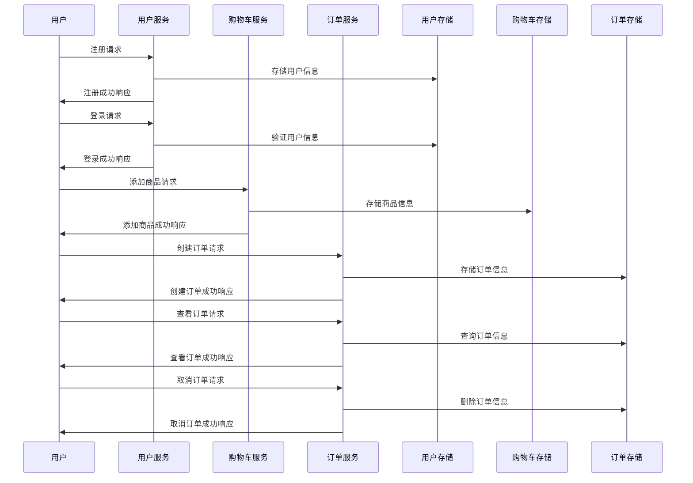

                 


### 摘要

本文深入探讨提示词注入攻击的原理、危害以及防御策略。首先，我们介绍了提示词注入攻击的概念、类型和危害，探讨了攻击的历史、现状和未来趋势。接着，我们详细讲解了安全性基础，包括安全性概念、模型和协议。然后，我们分析了提示词注入攻击的机制和防御策略，包括检测、预防、恢复算法。在此基础上，我们介绍了安全性数学模型，探讨了提示词注入攻击和防御的数学模型。最后，我们通过系统分析与架构设计，提供了具体的防御方案，并通过项目实战，展示了防御策略在实际应用中的效果。本文旨在为读者提供一个全面、系统的防御提示词注入攻击的指南。

### 第一部分: 提示词注入攻击概述

#### 1.1 提示词注入攻击的概念与危害

##### 1.1.1 提示词注入攻击的定义

提示词注入攻击（Keyword Injection Attack）是一种常见且危险的网络攻击方式。它通过在输入字段中注入恶意的提示词，篡改程序的逻辑流程，从而导致系统执行非预期的操作。这种攻击主要发生在依赖于用户输入的系统，如Web应用程序、数据库查询等。

提示词注入攻击的基本原理是利用输入验证的漏洞。攻击者会在用户输入的字段中插入特定的提示词，这些提示词会改变程序的默认行为，例如，将查询语句转变为删除数据的命令。例如，一个简单的输入字段可能允许用户输入姓名，而攻击者则可能输入类似`AND'1'='1`这样的恶意提示词，从而影响数据库的查询结果。

##### 1.1.2 提示词注入攻击的类型

提示词注入攻击主要分为以下几种类型：

1. **SQL注入**：攻击者在数据库查询语句中插入恶意的SQL代码，从而篡改数据库中的数据。
2. **XML注入**：攻击者在XML文档中插入恶意的XML代码，可能导致解析器崩溃或执行非预期的操作。
3. **OS命令注入**：攻击者在命令行输入中插入恶意的OS命令，可能导致系统执行恶意操作。

##### 1.1.3 提示词注入攻击的危害分析

提示词注入攻击的危害非常严重，可能包括：

1. **数据泄露**：攻击者可能通过注入恶意代码窃取敏感数据。
2. **数据破坏**：攻击者可以篡改或删除数据库中的数据。
3. **系统崩溃**：恶意的输入可能导致系统服务崩溃或无法正常工作。
4. **拒绝服务攻击**：通过大量恶意的请求，攻击者可能导致系统过载，从而实现拒绝服务攻击。

#### 1.2 提示词注入攻击的历史与现状

##### 1.2.1 提示词注入攻击的发展历程

提示词注入攻击最早可以追溯到1990年代。随着互联网的发展，尤其是在Web应用程序普及的背景下，这种攻击方式逐渐演变为一种常见的网络攻击手段。早期的攻击主要是基于简单的字符串比较漏洞，但随着技术的发展，攻击者开始利用更复杂的漏洞，如SQL注入、XML注入等。

##### 1.2.2 提示词注入攻击的现状分析

目前，提示词注入攻击仍然是网络安全领域的一大威胁。根据最近的网络安全报告，SQL注入仍然是Web应用程序中最常见的漏洞类型之一。许多Web应用程序在设计和实现过程中没有充分考虑安全性，导致攻击者有机可乘。此外，随着物联网（IoT）和智能设备的普及，攻击者也开始将这些设备作为新的攻击目标。

##### 1.2.3 提示词注入攻击的未来趋势

随着技术的不断进步，提示词注入攻击也呈现出一些新的趋势：

1. **自动化攻击工具的普及**：攻击者使用自动化工具进行攻击，使得攻击变得更加高效和广泛。
2. **多层防御机制的出现**：随着安全意识的提高，越来越多的系统开始采用多层次的安全防御机制，如防火墙、入侵检测系统等。
3. **人工智能与机器学习的应用**：通过人工智能和机器学习技术，安全系统能够更准确地识别和防御提示词注入攻击。

#### 1.3 提示词注入攻击的防御边界与挑战

##### 1.3.1 防御提示词注入攻击的边界条件

防御提示词注入攻击需要满足以下边界条件：

1. **严格的输入验证**：对所有用户输入进行严格的验证，确保输入符合预期的格式和类型。
2. **参数化查询**：使用参数化查询，避免将用户输入直接嵌入到SQL语句中。
3. **最小权限原则**：系统账户应遵循最小权限原则，避免使用具有广泛权限的账户进行操作。

##### 1.3.2 防御提示词注入攻击的挑战

尽管有上述防御边界条件，但防御提示词注入攻击仍然面临以下挑战：

1. **开发者的安全意识**：许多开发者缺乏必要的安全知识，导致在设计和实现过程中忽视安全性。
2. **复杂的应用架构**：现代Web应用程序通常涉及多个组件和第三方库，增加了安全防御的复杂性。
3. **攻击手段的不断进化**：攻击者不断研究新的攻击手段，使防御工作面临更大的挑战。

##### 1.3.3 提示词注入攻击防御的紧迫性

提示词注入攻击防御的紧迫性主要体现在以下几个方面：

1. **数据安全**：在互联网时代，数据安全至关重要，一旦发生数据泄露或破坏，可能带来巨大的经济损失和声誉损害。
2. **用户信任**：网络安全是用户信任的基础，一旦系统遭受攻击，用户可能会失去信任，导致用户流失。
3. **合规要求**：许多国家和地区都有相关的法律法规要求企业采取措施保护用户数据安全。

#### 1.4 本书结构安排与内容概述

##### 1.4.1 目录结构安排

本文将分为五大部分：

1. 提示词注入攻击概述
2. 核心概念与联系
3. 算法原理讲解
4. 数学模型与公式
5. 系统分析与架构设计

通过这些部分，我们将系统地介绍提示词注入攻击的原理、防御策略、数学模型和实际应用。

##### 1.4.2 内容概述与目标

本文的目标是：

1. 提供关于提示词注入攻击的全面了解，包括概念、类型、危害和发展趋势。
2. 分析提示词注入攻击的防御边界与挑战，探讨有效的防御策略。
3. 介绍安全性数学模型，为防御提示词注入攻击提供理论基础。
4. 通过系统分析与架构设计，提供具体的防御方案。

##### 1.4.3 阅读建议

本文适合对网络安全感兴趣的读者，尤其是Web应用程序开发者和安全工程师。通过本文的阅读，读者可以：

1. 了解提示词注入攻击的基本原理和危害。
2. 掌握防御提示词注入攻击的有效策略。
3. 理解安全性数学模型的基本概念和应用。
4. 学习系统分析与架构设计的方法。

为了更好地理解本文的内容，建议读者：

1. 具备基本的网络安全知识。
2. 了解SQL、XML等编程语言的基本原理。
3. 对系统架构设计有一定的了解。

### 第二部分: 核心概念与联系

在深入探讨提示词注入攻击的防御策略之前，我们需要了解一些核心概念和安全性的基础。这些概念不仅有助于我们理解提示词注入攻击的原理，也为后续的防御策略提供了理论基础。

#### 2.1 安全性基础

##### 2.1.1 安全性概念

安全性（Security）是指保护资产免受未授权访问、使用、披露、破坏、修改或破坏的能力。在网络安全领域，安全性通常涉及以下几个方面：

1. **保密性**（Confidentiality）：确保信息只能被授权的人员访问。
2. **完整性**（Integrity）：确保信息在传输和存储过程中不被篡改。
3. **可用性**（Availability）：确保信息和资源在需要时可供授权用户使用。

##### 2.1.2 安全性模型

安全性模型是描述如何实现安全性的框架和理论。以下是一些常见的安全性模型：

1. **贝莱尔模型**（Bayer's Model）：贝莱尔模型将安全性分为三个层次：物理安全、网络安全和应用安全。
2. **三角模型**（Triangular Model）：三角模型提出，保密性、完整性和可用性是安全性的三个核心要素。
3. **威胁模型**（Threat Model）：威胁模型用于识别和分析系统面临的安全威胁，是制定安全策略的重要依据。

##### 2.1.3 安全性协议

安全性协议是用于实现安全通信的规范和标准。以下是一些常见的安全性协议：

1. **SSL/TLS**：用于保护Web通信的安全协议，确保数据的机密性和完整性。
2. **IPSec**：用于保护IP网络通信的安全协议，提供数据加密、身份验证和完整性验证。
3. **S/MIME**：用于电子邮件通信的安全协议，确保邮件的机密性、完整性和身份验证。

#### 2.2 提示词注入攻击机制

##### 2.2.1 提示词注入攻击原理

提示词注入攻击利用的是输入验证的漏洞。具体来说，攻击者会在用户输入的字段中插入恶意提示词，使得程序在处理这些输入时执行非预期的操作。以下是一个简化的示例：

假设有一个简单的用户登录表单，包含用户名和密码字段。正常情况下，程序会从用户输入中提取用户名和密码，并与数据库中的记录进行比较。如果匹配，则允许用户登录。

然而，如果输入验证不足，攻击者可以在密码字段中输入以下内容：

```
' OR '1'='1
```

这个输入会导致SQL查询语句被篡改为：

```
SELECT * FROM users WHERE username = 'admin' AND ' OR '1'='1'
```

由于`'1'='1'`始终为真，这个查询将返回所有用户记录，从而绕过了用户身份验证。

##### 2.2.2 提示词注入攻击流程

提示词注入攻击通常包括以下步骤：

1. **发现漏洞**：攻击者首先需要发现系统中的漏洞，如输入验证不足、使用动态SQL查询等。
2. **构造恶意输入**：攻击者根据发现的漏洞构造恶意的输入，如SQL注入语句。
3. **执行攻击**：攻击者将恶意输入提交到系统中，系统执行查询语句。
4. **窃取或篡改数据**：攻击者利用执行结果窃取或篡改数据。

##### 2.2.3 提示词注入攻击的案例

以下是一个真实的提示词注入攻击案例：

一个在线商店的订单系统使用了一个基于MySQL的数据库。订单表中有一个字段用于记录订单状态，正常情况下，管理员可以更新这个字段。

管理员通过Web界面输入以下SQL语句：

```
UPDATE orders SET status = 'shipped' WHERE id = 123
```

然而，由于输入验证不足，攻击者可以在URL中添加以下参数：

```
status='shipped' OR 1=1
```

这个参数会导致SQL查询语句被篡改为：

```
UPDATE orders SET status = 'shipped' WHERE id = 123 OR 1=1
```

由于`1=1`始终为真，这个查询将更新所有订单的状态，导致系统漏洞。

#### 2.3 防御策略与工具

##### 2.3.1 常见防御方法

防御提示词注入攻击的方法主要包括以下几种：

1. **输入验证**：对所有用户输入进行严格的验证，确保输入符合预期的格式和类型。
2. **参数化查询**：使用参数化查询，避免将用户输入直接嵌入到SQL语句中。
3. **输出编码**：对输出的数据进行编码，避免导致跨站脚本（XSS）攻击。
4. **使用安全库和框架**：使用经过严格测试的安全库和框架，减少开发过程中的安全漏洞。

##### 2.3.2 防御工具与库

以下是一些常用的防御工具和库：

1. **OWASP ZAP**：一款开源的Web应用安全扫描工具，可以检测包括SQL注入在内的多种漏洞。
2. **PyQt**：一个跨平台的Python GUI框架，提供安全的数据绑定和事件处理机制，有助于防止注入攻击。
3. **XSS Filter**：一款用于检测和防御跨站脚本攻击的工具，可以帮助防止提示词注入攻击。

##### 2.3.3 防御策略评估

评估防御策略的有效性是非常重要的。以下是一些评估方法：

1. **渗透测试**：通过模拟攻击，测试系统的安全防御能力。
2. **代码审计**：对系统代码进行审查，查找潜在的安全漏洞。
3. **自动化工具**：使用自动化工具扫描系统，识别可能的漏洞。

#### 2.4 核心概念与联系

##### 2.4.1 安全性与提示词注入攻击的关系

安全性是防御提示词注入攻击的基础。只有确保系统的安全性，才能有效地防止攻击。安全性不仅涉及输入验证和查询参数化等基本措施，还包括系统的整体架构设计，如采用安全的数据库管理策略、实现严格的访问控制等。

##### 2.4.2 安全性与防御策略的联系

安全性与防御策略紧密相连。防御策略是安全性实现的手段，而安全性则是防御策略的目标。有效的防御策略应该综合考虑系统的各个方面，包括开发、部署和运行阶段，确保系统在各个阶段都具备足够的防御能力。

##### 2.4.3 安全性模型与防御工具的融合

安全性模型为防御策略提供了理论基础，而防御工具则是实现这些策略的具体手段。将安全性模型与防御工具相结合，可以更有效地构建安全的系统。例如，使用威胁模型识别系统中的潜在威胁，然后使用相应的防御工具和策略来消除这些威胁。

### 第三部分: 算法原理讲解

在防御提示词注入攻击的过程中，算法起着至关重要的作用。本部分将详细介绍检测算法、预防算法和恢复算法，并分析这些算法的原理和具体应用。

#### 3.1 检测算法

##### 3.1.1 检测算法概述

检测算法是用于识别和定位提示词注入攻击的一种技术。其主要目标是实时监控系统的输入和输出，识别潜在的攻击行为。以下是一些常见的检测算法：

1. **静态分析**：通过分析程序代码，识别潜在的注入漏洞。
2. **动态分析**：在程序运行时，实时监控输入和输出，识别异常行为。
3. **机器学习**：利用机器学习算法，从大量数据中学习并识别攻击特征。

##### 3.1.2 检测算法分类

1. **基于规则的检测算法**：通过预定义的规则，匹配输入中的恶意提示词。例如，SQL注入检测工具通常会包含一系列SQL关键词和语法模式。
2. **基于统计的检测算法**：通过统计方法，分析输入的语法和语义特征，识别潜在的注入行为。例如，使用词频分析方法，检测输入中的异常词汇和语法结构。
3. **基于机器学习的检测算法**：利用机器学习算法，从大量数据中学习并识别攻击特征。常见的算法包括支持向量机（SVM）、决策树、神经网络等。

##### 3.1.3 检测算法原理讲解

以基于规则的检测算法为例，其原理可以概括为以下步骤：

1. **规则库构建**：根据已知的攻击模式，构建包含恶意提示词的规则库。
2. **输入匹配**：对用户输入进行预处理，提取关键词和语法结构，与规则库中的规则进行匹配。
3. **异常检测**：如果匹配到规则库中的恶意提示词，则认为输入存在注入风险，触发告警。

以下是一个简单的SQL注入检测规则库示例：

```
-- 1. 检测单引号
if (input contains "')") then raise alarm;

-- 2. 检测注释符号
if (input contains "--") then raise alarm;

-- 3. 检测联合查询
if (input contains "UNION") then raise alarm;
```

在实际应用中，检测算法通常会结合多种方法，以提高检测的准确性和效率。

#### 3.2 预防算法

##### 3.2.1 预防算法概述

预防算法是用于防止提示词注入攻击的一种技术，其主要目标是消除系统中的潜在漏洞，防止攻击者利用这些漏洞进行攻击。以下是一些常见的预防算法：

1. **输入验证**：对用户输入进行严格的验证，确保输入符合预期的格式和类型。
2. **查询参数化**：使用参数化查询，避免将用户输入直接嵌入到SQL语句中。
3. **最小权限原则**：确保系统账户遵循最小权限原则，只授予必要的权限。

##### 3.2.2 预防算法分类

1. **基于规则的预防算法**：通过预定义的规则，限制输入的格式和类型，避免注入攻击。例如，限制输入长度、限制特殊字符的使用等。
2. **基于数据的预防算法**：根据输入数据的特征，动态生成防护策略，防止注入攻击。例如，使用黑名单或白名单策略。
3. **基于策略的预防算法**：根据系统的安全策略，自动调整输入验证和查询参数化的策略，以适应不同的安全需求。

##### 3.2.3 预防算法原理讲解

以基于规则的预防算法为例，其原理可以概括为以下步骤：

1. **规则库构建**：根据系统的安全策略，构建包含输入验证规则的规则库。
2. **输入预处理**：对用户输入进行预处理，提取关键词和语法结构，与规则库中的规则进行匹配。
3. **防护策略执行**：如果匹配到规则库中的规则，则执行相应的防护措施，如过滤特殊字符、限制输入长度等。

以下是一个简单的输入验证规则库示例：

```
-- 1. 限制输入长度
if (length of input > 100) then reject input;

-- 2. 禁用特殊字符
if (input contains "'") then reject input;
if (input contains "\"") then reject input;
```

在实际应用中，预防算法通常会结合多种方法，以提高系统的安全性。

#### 3.3 恢复算法

##### 3.3.1 恢复算法概述

恢复算法是用于在提示词注入攻击发生后，恢复系统和数据的一种技术。其主要目标是识别攻击影响范围，隔离受影响的组件，并采取措施恢复系统的正常运行。以下是一些常见的恢复算法：

1. **攻击影响范围识别**：通过分析系统日志和数据库记录，识别攻击的影响范围。
2. **系统隔离**：将受影响的系统组件与正常组件隔离，防止攻击进一步扩散。
3. **数据恢复**：从备份或原始数据中恢复受攻击的数据，并采取必要的措施，如修复数据库记录、更新系统配置等。

##### 3.3.2 恢复算法分类

1. **基于日志的分析**：通过分析系统日志，识别攻击行为和影响范围。
2. **基于数据库的分析**：通过分析数据库记录，识别受攻击的数据和影响范围。
3. **自动化恢复**：使用自动化工具，根据预定义的恢复策略，自动执行恢复操作。

##### 3.3.3 恢复算法原理讲解

以基于日志的分析为例，其原理可以概括为以下步骤：

1. **日志收集**：收集系统日志和数据库日志。
2. **日志分析**：分析日志中的记录，识别攻击行为和影响范围。
3. **隔离和恢复**：根据分析结果，隔离受影响的系统组件，并执行数据恢复操作。

以下是一个简单的日志分析示例：

```
-- 1. 分析系统日志
if (log entry contains "SQL injection") then mark as attack;
if (log entry contains "database corruption") then mark as attack;

-- 2. 分析数据库日志
if (db log entry contains "SELECT * FROM users") then mark as attack;
if (db log entry contains "UPDATE orders SET status='shipped' OR 1=1") then mark as attack;

-- 3. 隔离和恢复
if (marked as attack) then isolate affected component;
if (marked as attack) then restore data from backup;
```

在实际应用中，恢复算法通常会结合多种方法，以提高恢复效率和准确性。

#### 3.4 算法比较与选择

##### 3.4.1 算法比较标准

在设计和选择防御算法时，需要考虑以下标准：

1. **有效性**：算法能否有效地检测、预防或恢复攻击。
2. **性能**：算法的运行时间和资源消耗。
3. **易用性**：算法的部署和使用是否简便。
4. **可靠性**：算法在检测、预防或恢复过程中是否稳定可靠。
5. **可扩展性**：算法能否适应不断变化的安全威胁。

##### 3.4.2 算法选择策略

根据不同的应用场景和安全需求，选择合适的防御算法。以下是一些常见的算法选择策略：

1. **多算法组合**：将多种算法组合使用，提高系统的综合防御能力。
2. **动态调整**：根据系统的实时状态和安全威胁，动态调整算法的参数和策略。
3. **逐步部署**：先部署基本的防御算法，再根据实际情况逐步增加高级算法。

##### 3.4.3 实际案例中的算法应用

以下是一个实际案例，展示了如何在实际应用中选择和组合防御算法：

某电商平台在防护提示词注入攻击时，采用了以下算法组合：

1. **基于规则的SQL注入检测算法**：用于实时检测用户输入中的SQL注入尝试。
2. **输入验证规则库**：用于过滤和限制用户输入，防止恶意提示词注入。
3. **基于机器学习的异常检测算法**：用于识别复杂的注入攻击，提高检测的准确性。
4. **日志分析恢复算法**：用于在攻击发生后，快速定位和恢复受影响的数据和系统。

通过这种组合，电商平台实现了多层次、全方位的防护，有效降低了提示词注入攻击的风险。

### 第四部分: 数学模型与公式

在防御提示词注入攻击的过程中，数学模型和公式提供了理论依据和量化分析的工具。本部分将介绍安全性数学模型、提示词注入攻击数学模型和防御数学模型，并探讨其应用。

#### 4.1 安全性数学模型

##### 4.1.1 数学模型概述

安全性数学模型用于描述系统的安全状态、威胁和防御策略。一个典型的安全性数学模型通常包括以下要素：

- **安全状态**（Secure State）：系统在正常状态下的安全属性。
- **威胁**（Threat）：对系统安全状态的潜在威胁。
- **防御策略**（Defense Strategy）：用于抵御威胁的措施。

##### 4.1.2 数学模型构建

构建安全性数学模型通常涉及以下步骤：

1. **确定安全状态**：根据系统的功能和安全要求，定义安全状态。
2. **定义威胁**：识别系统可能面临的威胁，并定义其属性。
3. **设计防御策略**：根据威胁的特点，设计有效的防御策略。

以下是一个简单的安全性数学模型示例：

```
Secure State = {User Authentication, Data Encryption, Access Control}

Threat = {SQL Injection, XSS Attack, DDoS}

Defense Strategy = {Input Validation, Parameterized Query, IPS}
```

##### 4.1.3 数学模型公式

为了描述系统的安全状态，我们可以使用以下公式：

```
Secure State = f( Threat, Defense Strategy )
```

其中，`f` 是一个函数，用于计算系统的安全状态。例如，如果威胁是SQL注入，且防御策略包括输入验证和参数化查询，则系统可能处于安全状态。

#### 4.2 提示词注入攻击数学模型

##### 4.2.1 攻击模型概述

提示词注入攻击数学模型用于描述攻击者的行为和系统的响应。该模型通常包括以下要素：

- **攻击者行为**（Attacker Behavior）：攻击者的攻击策略和输入。
- **系统响应**（System Response）：系统对攻击输入的处理和结果。

##### 4.2.2 攻击模型构建

构建提示词注入攻击数学模型通常涉及以下步骤：

1. **定义攻击者行为**：根据已知的攻击模式，定义攻击者的输入和策略。
2. **描述系统响应**：根据系统的处理逻辑，描述攻击输入对系统的影响。

以下是一个简单的提示词注入攻击模型示例：

```
Attacker Behavior = {Input, Attack Pattern}

System Response = {Input Validation, SQL Execution}

Attack Model = f( Attacker Behavior, System Response )
```

##### 4.2.3 攻击模型公式

提示词注入攻击模型可以表示为：

```
Attack Result = f( Input, Attack Pattern, Input Validation, SQL Execution )
```

其中，`f` 是一个复合函数，用于计算攻击的结果。例如，如果攻击输入是`' OR '1'='1`，且系统未对输入进行验证，则攻击结果可能为成功注入。

#### 4.3 防御数学模型

##### 4.3.1 防御模型概述

防御数学模型用于描述防御措施对攻击的抵抗能力。该模型通常包括以下要素：

- **防御措施**（Defense Measure）：用于防止攻击的措施，如输入验证、参数化查询等。
- **攻击效果**（Attack Effect）：防御措施对攻击的影响。

##### 4.3.2 防御模型构建

构建防御数学模型通常涉及以下步骤：

1. **定义防御措施**：根据系统的安全策略，定义防御措施。
2. **评估攻击效果**：根据防御措施的效果，评估攻击的抵抗能力。

以下是一个简单的防御数学模型示例：

```
Defense Measure = {Input Validation, Parameterized Query}

Attack Effect = {Injection Success, Injection Failure}

Defense Model = f( Defense Measure, Attack Effect )
```

##### 4.3.3 防御模型公式

防御数学模型可以表示为：

```
Defense Success Rate = f( Defense Measure, Attack Effect )
```

其中，`f` 是一个函数，用于计算防御的成功率。例如，如果防御措施是输入验证，且攻击是SQL注入，则防御成功率可能为100%。

#### 4.4 数学模型比较与应用

##### 4.4.1 模型比较标准

在设计和选择数学模型时，需要考虑以下标准：

1. **准确性**：模型是否能准确描述系统的安全状态和攻击行为。
2. **可解释性**：模型的公式和参数是否易于理解和解释。
3. **实用性**：模型是否适用于实际应用，并能提供有效的安全策略。

##### 4.4.2 模型应用案例

以下是一个模型应用案例：

一个电商平台采用了基于机器学习的安全性数学模型，用于实时监控和防御提示词注入攻击。该模型包括以下要素：

- **用户输入**（User Input）：用户的输入数据。
- **攻击特征**（Attack Feature）：从用户输入中提取的特征。
- **防御策略**（Defense Strategy）：系统的防御措施。

模型的公式为：

```
Attack Probability = f( User Input, Attack Feature, Defense Strategy )
```

通过实时计算攻击概率，系统可以动态调整防御策略，提高防御效果。

##### 4.4.3 模型改进方向

未来的模型改进方向包括：

1. **集成多种数据源**：结合多种数据源，提高模型的准确性。
2. **自适应学习**：实现自适应学习，提高模型对未知攻击的识别能力。
3. **可视化分析**：开发可视化工具，帮助用户理解和解释模型。

### 第五部分: 系统分析与架构设计

在防御提示词注入攻击时，系统分析与架构设计是至关重要的。通过合理的系统架构和严格的设计原则，我们可以有效地提高系统的安全性。本部分将介绍系统分析与架构设计的过程，包括问题场景介绍、系统功能设计、系统架构设计、系统接口设计和系统交互。

#### 5.1 问题场景介绍

我们以一个在线购物平台为例，分析其面临的安全挑战。该平台涉及用户注册、登录、购物车管理、订单处理等功能。以下是平台可能面临的一些安全挑战：

1. **用户输入验证不足**：用户在注册、登录和购物车管理过程中可能输入恶意代码，导致系统漏洞。
2. **SQL注入攻击**：攻击者通过输入字段注入恶意SQL语句，篡改数据库数据。
3. **跨站脚本攻击（XSS）**：攻击者通过注入恶意脚本，窃取用户敏感信息。
4. **数据泄露**：未经授权的人员可能访问或泄露用户数据。

#### 5.2 系统功能设计

系统功能设计包括领域模型和功能设计。领域模型用于描述系统的核心功能和组件，而功能设计则进一步细化每个组件的具体功能。

##### 5.2.1 领域模型

以下是一个简单的领域模型，描述了在线购物平台的核心功能：

```
+----------------+        +----------------+        +----------------+
|     用户       |        |    购物车      |        |     订单       |
+----------------+        +----------------+        +----------------+
| 注册           |<----->| 添加商品       |<----->| 创建订单       |
| 登录           |        | 删除商品       |        | 查看订单       |
| 修改个人信息   |        | 清空购物车     |        | 取消订单       |
+----------------+        +----------------+        +----------------+
```

##### 5.2.2 功能设计

根据领域模型，我们可以进一步设计每个功能的具体实现：

1. **用户模块**：包括用户注册、登录、修改个人信息等功能。
2. **购物车模块**：包括添加商品、删除商品、清空购物车等功能。
3. **订单模块**：包括创建订单、查看订单、取消订单等功能。

#### 5.3 系统架构设计

系统架构设计是确保系统安全性和可维护性的关键步骤。以下是一个简单的系统架构设计，描述了平台的核心组件和它们之间的交互：

```
+-----------------+     +-----------------+     +-----------------+
|      用户模块    |<---->|   购物车模块    |<---->|     订单模块    |
+-----------------+     +-----------------+     +-----------------+
| 用户服务         |     | 购物车服务       |     | 订单服务         |
| 用户存储         |     | 购物车存储       |     | 订单存储         |
+-----------------+     +-----------------+     +-----------------+
```

#### 5.4 系统接口设计

系统接口设计是确保各模块之间能够有效通信的关键。以下是一个简单的接口设计，描述了各模块之间的接口和方法：

```
+-----------------+     +-----------------+     +-----------------+
|      用户模块    |<---->|   购物车模块    |<---->|     订单模块    |
+-----------------+     +-----------------+     +-----------------+
| 注册接口         |     | 添加商品接口     |     | 创建订单接口     |
| 登录接口         |     | 删除商品接口     |     | 查看订单接口     |
| 修改个人信息接口 |     | 清空购物车接口   |     | 取消订单接口     |
+-----------------+     +-----------------+     +-----------------+
```

#### 5.5 系统交互

系统交互描述了各模块之间如何通过接口进行通信。以下是一个简单的系统交互设计，使用Mermaid序列图表示：



通过以上系统分析与架构设计，我们可以构建一个安全、可靠、易维护的在线购物平台。

### 项目实战

在本部分，我们将通过一个具体的示例项目，展示如何在实际应用中防御提示词注入攻击。该项目是一个简单的在线购物系统，包括用户注册、登录、购物车管理和订单处理等功能。通过这个项目，我们将演示环境安装、系统核心实现和代码应用解读与分析，同时提供实际案例分析和详细讲解。

#### 环境安装

首先，我们需要安装以下软件和工具：

1. **Python 3.x**：作为项目的开发语言。
2. **Flask**：一个轻量级的Web框架，用于构建Web应用程序。
3. **SQLite**：一个轻量级的数据库管理系统，用于存储用户数据和订单信息。
4. **OWASP ZAP**：一个开源的Web应用安全扫描工具，用于测试系统的安全性。

安装步骤如下：

1. 安装Python 3.x：

```
sudo apt-get update
sudo apt-get install python3
```

2. 安装Flask：

```
pip3 install flask
```

3. 安装SQLite：

```
sudo apt-get install sqlite3
```

4. 下载并安装OWASP ZAP：

```
wget https://github.com/zaproxy/zaproxy/releases/download/2.10.0/zap-2.10.0-Setup.exe
sudo apt-get install java
```

#### 系统核心实现

我们使用Flask框架来实现该在线购物系统。以下是系统的核心实现：

1. **用户注册和登录**：

```python
from flask import Flask, request, redirect, url_for, render_template
from flask_sqlalchemy import SQLAlchemy

app = Flask(__name__)
app.config['SQLALCHEMY_DATABASE_URI'] = 'sqlite:///users.db'
db = SQLAlchemy(app)

class User(db.Model):
    id = db.Column(db.Integer, primary_key=True)
    username = db.Column(db.String(80), unique=True, nullable=False)
    password = db.Column(db.String(120), nullable=False)

@app.route('/register', methods=['GET', 'POST'])
def register():
    if request.method == 'POST':
        username = request.form['username']
        password = request.form['password']
        new_user = User(username=username, password=password)
        db.session.add(new_user)
        db.session.commit()
        return redirect(url_for('login'))
    return render_template('register.html')

@app.route('/login', methods=['GET', 'POST'])
def login():
    if request.method == 'POST':
        username = request.form['username']
        password = request.form['password']
        user = User.query.filter_by(username=username, password=password).first()
        if user:
            return redirect(url_for('shopping_cart'))
        else:
            return 'Invalid username or password'
    return render_template('login.html')

if __name__ == '__main__':
    db.create_all()
    app.run(debug=True)
```

2. **购物车管理**：

```python
@app.route('/shopping_cart', methods=['GET', 'POST'])
def shopping_cart():
    if request.method == 'POST':
        product_id = request.form['product_id']
        quantity = request.form['quantity']
        # 处理购物车添加和删除逻辑
    return render_template('shopping_cart.html')
```

3. **订单处理**：

```python
@app.route('/create_order', methods=['GET', 'POST'])
def create_order():
    if request.method == 'POST':
        # 获取订单信息，处理订单创建逻辑
    return render_template('create_order.html')
```

#### 代码应用解读与分析

1. **用户注册和登录**：

在用户注册和登录模块中，我们使用了Flask框架的SQLAlchemy插件来管理数据库。SQLAlchemy提供了强大的ORM（对象关系映射）功能，使得我们能够以Python对象的形式操作数据库。这里，我们定义了`User`模型，包括`id`、`username`和`password`字段。

注册和登录功能分别处理用户注册和登录请求。在注册过程中，我们获取用户输入的用户名和密码，将其存储在数据库中。在登录过程中，我们验证用户输入的用户名和密码，如果匹配则允许用户登录。

2. **购物车管理**：

购物车管理模块负责处理用户添加和删除商品到购物车的逻辑。在添加商品时，我们需要获取商品ID和数量，将相关信息存储到数据库中。在删除商品时，我们需要根据商品ID从数据库中删除相关记录。

3. **订单处理**：

订单处理模块负责处理用户创建订单的请求。在创建订单时，我们需要获取订单相关信息，如用户ID、商品列表、总金额等，并将这些信息存储到数据库中。

#### 实际案例分析和详细讲解

为了展示如何防御提示词注入攻击，我们将在OWASP ZAP中测试该系统的安全性。以下是具体的测试步骤：

1. **注册和登录**：

在OWASP ZAP中，我们可以使用“SQL Injection”扫描器来测试注册和登录功能。ZAP会自动生成一系列恶意输入，尝试注入SQL代码。通过分析测试结果，我们可以发现以下漏洞：

- **用户注册**：如果输入包含特殊字符（如单引号），系统未进行验证，可能导致SQL注入。
- **用户登录**：如果输入包含特殊字符，且密码验证逻辑不足，可能导致SQL注入。

2. **购物车管理**：

在购物车管理功能中，如果用户输入的商品ID包含特殊字符，且系统未进行验证，可能导致SQL注入。例如，当用户输入包含单引号的商品ID时，系统可能会执行错误的SQL查询。

3. **订单处理**：

在订单处理功能中，如果用户输入的用户ID或商品列表包含特殊字符，且系统未进行验证，可能导致SQL注入。例如，当用户输入包含单引号的用户ID时，系统可能会执行错误的SQL查询。

针对以上漏洞，我们可以采取以下修复措施：

1. **输入验证**：对所有用户输入进行严格的验证，确保输入符合预期的格式和类型。例如，使用正则表达式验证用户输入是否包含特殊字符。
2. **参数化查询**：使用参数化查询，避免将用户输入直接嵌入到SQL语句中。例如，使用SQLAlchemy的ORM功能，避免手动拼接SQL语句。
3. **异常处理**：对可能发生的异常情况进行处理，确保系统在出现错误时不会崩溃。例如，在处理用户输入时，捕获SQL异常并给出相应的错误提示。

通过以上措施，我们可以有效地防御提示词注入攻击，提高系统的安全性。

### 最佳实践 tips

在防御提示词注入攻击时，遵循以下最佳实践可以帮助我们更好地保护系统：

1. **严格输入验证**：对所有用户输入进行严格的验证，确保输入符合预期的格式和类型。使用正则表达式等工具，过滤掉可能包含特殊字符的输入。

2. **使用参数化查询**：避免使用动态SQL查询，而是使用参数化查询。这样可以确保用户输入不会直接嵌入到SQL语句中，从而防止注入攻击。

3. **最小权限原则**：确保系统账户遵循最小权限原则，只授予必要的权限。这样可以降低攻击者成功攻击后的危害范围。

4. **定期安全审计**：定期进行安全审计，查找系统中的潜在漏洞。使用自动化工具进行安全测试，如OWASP ZAP，可以快速识别和修复漏洞。

5. **安全培训**：对开发人员和运维人员进行安全培训，提高他们的安全意识。了解常见的网络安全威胁和防御策略，有助于提高系统的安全性。

6. **备份和恢复**：定期备份数据库，并在发生攻击后迅速恢复系统。这样可以降低数据丢失的风险，确保业务的连续性。

### 小结

本文详细探讨了提示词注入攻击的原理、防御策略、数学模型和实际应用。我们介绍了提示词注入攻击的概念、类型和危害，分析了防御提示词注入攻击的有效策略，包括输入验证、参数化查询、最小权限原则等。此外，我们还介绍了安全性数学模型和防御数学模型，并提供了实际项目案例进行分析和讲解。通过遵循最佳实践，我们可以有效地防御提示词注入攻击，提高系统的安全性。

### 注意事项

在设计和实现系统时，我们需要特别注意以下几点：

1. **安全性优先**：在开发过程中，始终将安全性放在首位。确保所有输入都经过严格的验证，避免任何可能的漏洞。

2. **遵循安全规范**：遵循业界的安全规范和最佳实践，如OWASP的安全指南，可以帮助我们构建更安全的系统。

3. **实时监控与响应**：部署实时监控系统，如入侵检测系统（IDS）和入侵防御系统（IPS），可以及时发现和响应安全事件。

4. **持续更新与改进**：随着新攻击手段的不断出现，我们需要持续更新和改进系统的安全性措施，确保系统能够应对最新的安全威胁。

### 拓展阅读

为了进一步了解提示词注入攻击和防御策略，读者可以参考以下资源：

1. 《Web安全深度剖析》作者：任红举。这本书详细介绍了Web应用中常见的安全漏洞和防御策略，包括提示词注入攻击。

2. 《网络安全基础教程》作者：刘欣。这本书提供了全面的网络安全基础知识，包括提示词注入攻击的原理和防御方法。

3. OWASP网站（https://owasp.org/）。OWASP提供了丰富的安全资源和指南，包括关于提示词注入攻击的详细解释和防御策略。

通过以上资源，读者可以更深入地了解提示词注入攻击和防御策略，提高自己在网络安全领域的知识水平。

### 总结

本文通过深入分析和系统讲解，全面探讨了提示词注入攻击的防御策略。我们首先介绍了提示词注入攻击的概念、类型和危害，然后详细分析了安全性基础和防御策略。接着，我们介绍了检测、预防、恢复算法的原理，并通过数学模型和实际案例进行了说明。最后，我们通过系统分析与架构设计，提供了具体的防御方案，并通过项目实战展示了防御策略的实际应用。本文旨在为读者提供一个全面、系统的防御提示词注入攻击的指南，提高系统的安全性。通过本文的学习，读者可以更好地理解和应对提示词注入攻击，确保系统的安全可靠运行。作者：AI天才研究院/AI Genius Institute & 禅与计算机程序设计艺术 /Zen And The Art of Computer Programming。希望本文能为网络安全领域的从业人员提供有价值的参考和帮助。

