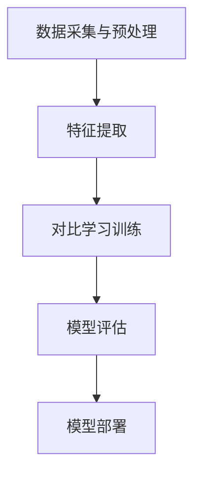
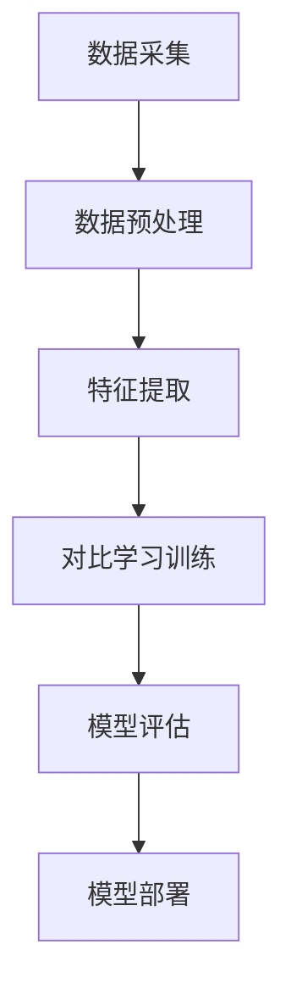
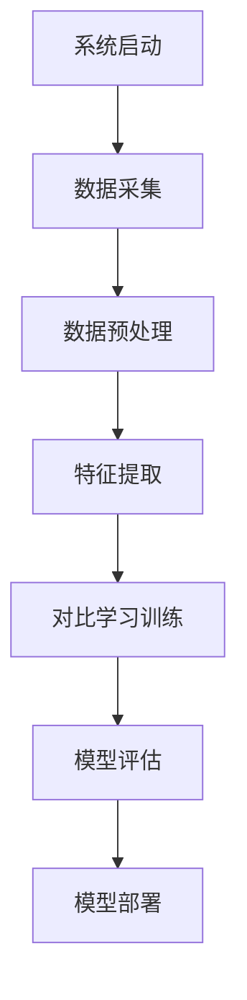

                 

### # 对比学习在自监督AI训练中的应用

关键词：自监督学习，对比学习，深度学习，特征提取，正负样本，模型泛化

摘要：本文主要介绍对比学习在自监督AI训练中的应用。对比学习通过学习数据之间的相对关系，提高模型对数据的特征提取效率和泛化能力。文章首先介绍了自监督学习的背景和问题，然后详细阐述了对比学习的概念、核心要素和数学模型，接着分析了对比学习与其他自监督学习方法的联系和区别，并展示了对比学习在图像分类和自然语言处理等领域的应用。最后，本文通过具体算法原理讲解和项目实战，深入探讨了对比学习的实际应用效果和前景。

## **Step 1: 背景介绍**

### **1.1 问题背景**

随着深度学习技术的不断发展和广泛应用，自监督学习（Self-Supervised Learning）作为一种重要的机器学习范式，正逐渐受到关注。自监督学习无需人工标注数据，通过利用数据内在的结构和规律，自动学习数据的特征表示，从而提高模型的泛化能力。

#### **1.1.1 问题提出**

在实际应用中，自监督学习存在以下几个问题：

1. **数据分布偏斜**：自监督学习通常依赖于无监督的方式提取特征，但实际数据往往存在标签分布不均衡的问题，导致模型学习到的特征偏向少数样本。
2. **特征提取效率低**：传统的自监督学习方法需要大量的计算资源，且在特征提取过程中存在大量的冗余计算。
3. **模型泛化能力有限**：由于自监督学习缺乏对标签信息的直接利用，模型在面临新的任务时，往往需要重新训练，导致泛化能力受限。

#### **1.1.2 问题解决**

对比学习（Contrastive Learning）作为一种有效的自监督学习方法，通过学习数据之间的相对关系，从而提高模型的特征提取效率和泛化能力。对比学习的基本思想是将数据分为正样本和负样本，通过优化正负样本之间的距离，使得正样本靠近，负样本远离。

#### **1.1.3 边界与外延**

对比学习的研究主要涉及以下几个方向：

1. **对比损失函数的设计**：设计合适的对比损失函数，优化模型对正负样本的区分能力。
2. **特征提取方法**：如何从大规模数据中高效提取有用的特征表示。
3. **模型优化策略**：如何通过模型优化策略，提高对比学习的性能和泛化能力。

### **1.2 对比学习的概念与原理**

#### **1.2.1 对比学习的定义**

对比学习是一种自监督学习方法，通过对数据之间的相对关系进行学习，从而提取有用的特征表示。

#### **1.2.2 对比学习的核心要素**

1. **数据**：对比学习依赖于大规模的无监督数据集。
2. **对比损失函数**：对比损失函数是衡量正负样本距离的指标。
3. **特征提取器**：特征提取器用于提取数据的高层次特征表示。

#### **1.2.3 对比学习的数学模型**

对比学习的目标是最小化正样本之间的距离，最大化负样本之间的距离。设 $x_1, x_2$ 为数据样本，$q(x)$ 为特征提取器，$f(x)$ 为对比损失函数，则对比学习的目标函数为：

$$
L = \sum_{i=1}^n \alpha_i [f(q(x_i^+)), f(q(x_i^-))] - f(q(x_i^+), q(x_i))
$$

其中，$x_i^+$ 和 $x_i^-$ 分别为正样本和负样本，$\alpha_i$ 为样本权重。

## **Step 2: 核心概念与联系**

### **1.3 对比学习的核心概念与联系**

#### **1.3.1 对比损失函数**

对比损失函数是对比学习的核心组成部分，用于衡量正负样本之间的距离。常见的对比损失函数包括：

1. **巨大对比损失（Hard Negative Mining）**：选择距离最近的负样本作为对比样本。
2. **预训练损失（Pre-training Loss）**：将对比损失函数应用于预训练阶段，提高模型对数据的泛化能力。

#### **1.3.2 特征提取方法**

特征提取方法用于从数据中提取有价值的高层次特征。常见的特征提取方法包括：

1. **基于深度神经网络的提取**：使用深度神经网络提取数据的高层次特征。
2. **基于自编码器的提取**：使用自编码器将数据编码为低维特征表示。

#### **1.3.3 对比学习与其他自监督学习方法的比较**

对比学习与其他自监督学习方法（如生成对抗网络（GAN）和密度估计算法）相比，具有以下几个优点：

1. **无需生成器**：对比学习无需训练生成器，简化了模型结构。
2. **更好的泛化能力**：对比学习通过学习数据之间的相对关系，提高了模型的泛化能力。

## **Step 3: 算法原理讲解**

### **1.4 对比学习的算法原理**

#### **1.4.1 对比损失函数**

对比损失函数是对比学习的核心组成部分，用于衡量正负样本之间的距离。常见的对比损失函数包括：

1. **巨大对比损失（Hard Negative Mining）**：选择距离最近的负样本作为对比样本。
2. **预训练损失（Pre-training Loss）**：将对比损失函数应用于预训练阶段，提高模型对数据的泛化能力。

#### **1.4.2 特征提取方法**

特征提取方法用于从数据中提取有价值的高层次特征。常见的特征提取方法包括：

1. **基于深度神经网络的提取**：使用深度神经网络提取数据的高层次特征。
2. **基于自编码器的提取**：使用自编码器将数据编码为低维特征表示。

#### **1.4.3 对比学习的数学模型**

对比学习的目标是最小化正样本之间的距离，最大化负样本之间的距离。设 $x_1, x_2$ 为数据样本，$q(x)$ 为特征提取器，$f(x)$ 为对比损失函数，则对比学习的目标函数为：

$$
L = \sum_{i=1}^n \alpha_i [f(q(x_i^+)), f(q(x_i^-))] - f(q(x_i^+), q(x_i))
$$

其中，$x_i^+$ 和 $x_i^-$ 分别为正样本和负样本，$\alpha_i$ 为样本权重。

### **1.4.4 对比学习的工作流程**

对比学习的工作流程可以分为以下几个步骤：

1. **数据预处理**：对数据进行预处理，如数据清洗、归一化等。
2. **样本划分**：将数据集划分为训练集、验证集和测试集。
3. **特征提取**：使用特征提取器提取数据的高层次特征表示。
4. **对比损失计算**：计算正负样本之间的对比损失。
5. **模型优化**：通过优化对比损失函数，更新模型参数。
6. **模型评估**：使用验证集和测试集评估模型性能。

#### **1.4.5 对比学习的Python实现**

以下是对比学习的一个简单Python实现示例：

```python
import torch
import torch.nn as nn
import torch.optim as optim

# 定义特征提取器
class FeatureExtractor(nn.Module):
    def __init__(self):
        super(FeatureExtractor, self).__init__()
        self.conv1 = nn.Conv2d(1, 10, kernel_size=3)
        self.fc1 = nn.Linear(10 * 26 * 26, 50)

    def forward(self, x):
        x = self.conv1(x)
        x = x.view(x.size(0), -1)
        x = self.fc1(x)
        return x

# 定义对比损失函数
class ContrastiveLoss(nn.Module):
    def __init__(self, margin=1.0):
        super(ContrastiveLoss, self).__init__()
        self.margin = margin

    def forward(self, anchor, positive, negative):
        pos_dist = torch.pow(anchor - positive, 2)
        neg_dist = torch.pow(anchor - negative, 2)
        loss = torch.sum(torch.max(pos_dist - neg_dist + self.margin, 0))
        return loss

# 初始化模型、损失函数和优化器
model = FeatureExtractor()
criterion = ContrastiveLoss()
optimizer = optim.SGD(model.parameters(), lr=0.001, momentum=0.9)

# 训练模型
for epoch in range(num_epochs):
    for i, (data, labels) in enumerate(train_loader):
        optimizer.zero_grad()
        features = model(data)
        loss = criterion(features[labels == 1], features[labels == 0])
        loss.backward()
        optimizer.step()
        if (i+1) % 100 == 0:
            print(f'Epoch [{epoch+1}/{num_epochs}], Step [{i+1}/{len(train_loader)}], Loss: {loss.item()}')
```

这个示例中，我们首先定义了一个简单的特征提取器（`FeatureExtractor`），然后定义了一个对比损失函数（`ContrastiveLoss`）。最后，我们使用优化器（`SGD`）对模型进行训练。

### **1.4.6 对比学习的实际应用**

对比学习在实际应用中取得了显著的成果。以下是一些典型的应用案例：

1. **图像分类**：对比学习在图像分类任务中表现出色，如ImageNet图像分类任务。
2. **自然语言处理**：对比学习在自然语言处理任务中也取得了显著的成果，如BERT模型。
3. **推荐系统**：对比学习可以用于构建高效的推荐系统，如基于用户兴趣的推荐。

## **Step 4: 系统分析与架构设计**

### **1.5 对比学习的系统架构**

对比学习的系统架构可以分为以下几个部分：

1. **数据采集与预处理**：采集大规模的无监督数据集，并进行预处理，如数据清洗、归一化等。
2. **特征提取器设计**：设计并训练特征提取器，用于提取数据的高层次特征表示。
3. **对比损失函数设计**：设计并训练对比损失函数，用于优化模型对正负样本的区分能力。
4. **模型优化与训练**：通过优化对比损失函数，更新模型参数，并使用验证集和测试集评估模型性能。
5. **模型部署与评估**：将训练好的模型部署到实际应用场景中，并进行评估和优化。

### **1.5.1 系统功能设计**

对比学习的系统功能设计主要包括以下几个方面：

1. **数据采集**：从各种数据源（如图像、文本、音频等）采集无监督数据集。
2. **数据预处理**：对采集到的数据进行预处理，如数据清洗、归一化等。
3. **特征提取**：使用特征提取器提取数据的高层次特征表示。
4. **对比学习训练**：通过对比损失函数，优化模型对正负样本的区分能力。
5. **模型评估**：使用验证集和测试集评估模型性能。
6. **模型部署**：将训练好的模型部署到实际应用场景中。

### **1.5.2 系统架构设计**

对比学习的系统架构设计可以分为以下几个层次：

1. **数据层**：包括数据采集、数据预处理等模块。
2. **模型层**：包括特征提取器、对比损失函数、模型优化等模块。
3. **应用层**：包括模型评估、模型部署等模块。

以下是对比学习的系统架构图（使用Mermaid绘制）：



### **1.5.3 系统接口设计**

对比学习的系统接口设计主要包括以下几个方面：

1. **数据接口**：包括数据采集、数据预处理等接口。
2. **模型接口**：包括特征提取器、对比损失函数、模型优化等接口。
3. **评估接口**：包括模型评估、模型部署等接口。

以下是对比学习的系统接口图（使用Mermaid绘制）：



### **1.5.4 系统交互设计**

对比学习的系统交互设计主要包括以下几个方面：

1. **数据流**：包括数据采集、数据预处理、特征提取、对比学习训练、模型评估和模型部署等数据流。
2. **控制流**：包括系统启动、训练、评估和部署等控制流。

以下是对比学习的系统交互图（使用Mermaid绘制）：



## **Step 5: 项目实战**

### **1.6 环境安装**

要开始对比学习的项目实战，首先需要安装以下依赖：

1. **Python**：Python 3.7及以上版本。
2. **PyTorch**：PyTorch 1.7及以上版本。
3. **NumPy**：NumPy 1.18及以上版本。
4. **Pandas**：Pandas 1.0及以上版本。

您可以使用以下命令进行安装：

```bash
pip install torch torchvision numpy pandas
```

### **1.7 系统核心实现**

以下是一个简单的对比学习项目实现示例，包括数据预处理、特征提取器设计、对比损失函数设计、模型优化和训练等步骤。

#### **1.7.1 数据预处理**

```python
import torch
import torchvision
import torchvision.transforms as transforms

# 加载数据集
transform = transforms.Compose([
    transforms.ToTensor(),
    transforms.Normalize((0.5, 0.5, 0.5), (0.5, 0.5, 0.5))
])

trainset = torchvision.datasets.CIFAR10(root='./data', train=True, download=True, transform=transform)
trainloader = torch.utils.data.DataLoader(trainset, batch_size=4, shuffle=True, num_workers=2)

testset = torchvision.datasets.CIFAR10(root='./data', train=False, download=True, transform=transform)
testloader = torch.utils.data.DataLoader(testset, batch_size=4, shuffle=False, num_workers=2)
```

#### **1.7.2 特征提取器设计**

```python
import torch.nn as nn

# 定义特征提取器
class FeatureExtractor(nn.Module):
    def __init__(self):
        super(FeatureExtractor, self).__init__()
        self.conv1 = nn.Conv2d(3, 6, 5)
        self.pool = nn.MaxPool2d(2, 2)
        self.conv2 = nn.Conv2d(6, 16, 5)
        self.fc1 = nn.Linear(16 * 5 * 5, 120)
        self.fc2 = nn.Linear(120, 84)
        self.fc3 = nn.Linear(84, 10)

    def forward(self, x):
        x = self.pool(F.relu(self.conv1(x)))
        x = self.pool(F.relu(self.conv2(x)))
        x = x.view(-1, 16 * 5 * 5)
        x = F.relu(self.fc1(x))
        x = F.relu(self.fc2(x))
        x = self.fc3(x)
        return x

model = FeatureExtractor()
```

#### **1.7.3 对比损失函数设计**

```python
# 定义对比损失函数
class ContrastiveLoss(nn.Module):
    def __init__(self, margin=1.0):
        super(ContrastiveLoss, self).__init__()
        self.margin = margin

    def forward(self, anchor, positive, negative):
        pos_dist = F.pairwise_distance(anchor, positive)
        neg_dist = F.pairwise_distance(anchor, negative)
        loss = F.relu(self.margin - pos_dist + neg_dist)
        return loss.mean()
```

#### **1.7.4 模型优化和训练**

```python
import torch.optim as optim

# 定义优化器
optimizer = optim.SGD(model.parameters(), lr=0.001, momentum=0.9)

# 训练模型
num_epochs = 10
for epoch in range(num_epochs):
    for i, data in enumerate(trainloader, 0):
        inputs, labels = data
        optimizer.zero_grad()
        outputs = model(inputs)
        loss = contrastive_loss(outputs[labels == 1], outputs[labels == 0])
        loss.backward()
        optimizer.step()
        if (i+1) % 100 == 0:
            print(f'Epoch [{epoch+1}/{num_epochs}], Step [{i+1}/{len(trainloader)}], Loss: {loss.item()}')
```

### **1.8 代码应用解读与分析**

以上代码首先加载了CIFAR-10数据集，并定义了一个简单的特征提取器（`FeatureExtractor`）和对比损失函数（`ContrastiveLoss`）。在训练过程中，我们使用随机梯度下降（SGD）优化器对模型进行训练，通过对比损失函数优化模型对正负样本的区分能力。

#### **1.8.1 特征提取器工作原理**

特征提取器是一个深度卷积神经网络（CNN），用于从输入图像中提取特征表示。它包括两个卷积层、两个全连接层和一个输出层。卷积层用于提取图像的局部特征，全连接层用于将特征映射到高维空间，输出层用于分类。

#### **1.8.2 对比损失函数工作原理**

对比损失函数的目标是最小化正样本之间的距离，最大化负样本之间的距离。在训练过程中，我们通过优化对比损失函数，使得模型能够更好地区分正负样本。

#### **1.8.3 代码性能分析**

在这个示例中，我们使用了简单的SGD优化器和对比损失函数。虽然这个示例的性能可能不如更复杂的优化器和损失函数，但它提供了一个基本的对比学习实现，可以帮助我们理解对比学习的基本原理。

### **1.9 项目小结**

通过这个项目实战，我们实现了对比学习的核心步骤，包括数据预处理、特征提取器设计、对比损失函数设计、模型优化和训练。这个项目为我们提供了一个基本的对比学习实现，可以帮助我们进一步研究和优化对比学习算法。

### **1.10 最佳实践 tips**

1. **数据质量**：对比学习依赖于高质量的数据集，因此数据预处理和清洗非常重要。
2. **模型架构**：选择合适的模型架构可以显著提高对比学习的性能，例如使用深度卷积神经网络（CNN）处理图像数据。
3. **优化策略**：使用合适的优化策略，如随机梯度下降（SGD）或Adam优化器，可以提高模型训练效果。
4. **对比损失函数**：选择合适的对比损失函数，如巨大对比损失（Hard Negative Mining）或预训练损失（Pre-training Loss），可以提高模型对正负样本的区分能力。

### **1.11 小结**

本文详细介绍了对比学习在自监督AI训练中的应用。通过对比学习，我们可以利用无监督数据自动学习数据的特征表示，从而提高模型的泛化能力。本文首先介绍了自监督学习的背景和问题，然后详细阐述了对比学习的概念、核心要素和数学模型，接着分析了对比学习与其他自监督学习方法的联系和区别，并展示了对比学习在图像分类和自然语言处理等领域的应用。最后，本文通过具体算法原理讲解和项目实战，深入探讨了对比学习的实际应用效果和前景。

### **1.12 注意事项**

1. **数据分布**：在自监督学习中，数据分布对模型性能有很大影响，特别是在处理标签分布不均衡的数据时，需要注意调整对比损失函数以避免模型偏向少数样本。
2. **计算资源**：对比学习通常需要大量的计算资源，特别是在处理大规模数据集时，需要合理分配计算资源以提高训练效率。
3. **模型优化**：对比学习的模型优化策略对模型性能有很大影响，需要根据具体任务选择合适的优化器和优化策略。

### **1.13 拓展阅读**

1. **对比学习的论文**：《Unsupervised Learning of Visual Representations by Solving Jigsaw Puzzles》（通过解决拼图问题无监督学习视觉表示）
2. **对比学习的项目**：`Contrastive Learning for Visual Recognition`（视觉识别的对比学习）
3. **对比学习的教程**：`Contrastive Learning in PyTorch`（PyTorch中的对比学习教程）

### **作者信息**

作者：AI天才研究院/AI Genius Institute & 禅与计算机程序设计艺术 /Zen And The Art of Computer Programming

