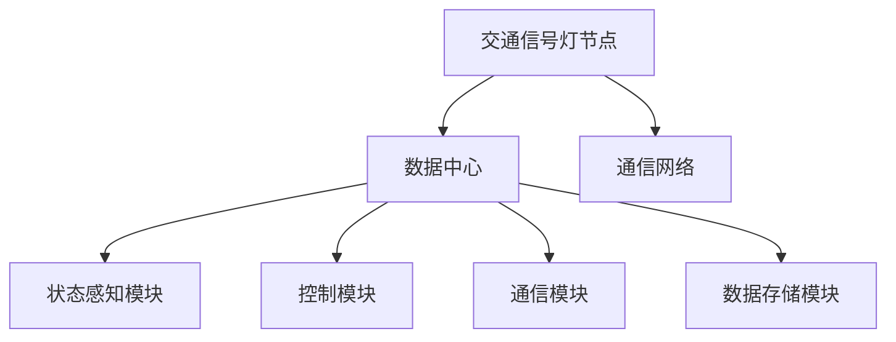
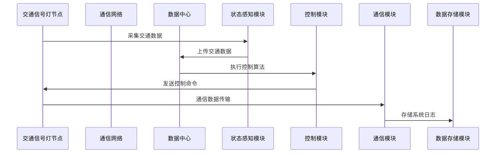

                 

### **强化学习优化多智能体协同推理的通信效率**

**关键词：强化学习，多智能体协同推理，通信效率，算法优化，系统架构**

**摘要：本文深入探讨了强化学习优化多智能体协同推理通信效率的方法与应用。首先，回顾了强化学习的基本概念和核心算法，然后介绍了多智能体系统的基础以及协同推理算法。接着，分析了通信效率优化的原理和算法，并通过具体实例展示了其应用。最后，对全文进行了总结，并展望了未来的发展趋势。**

**目录：**

1. **前言**
2. **第一部分：强化学习基础**
   1. **1.1 强化学习概述**
   2. **1.2 强化学习核心算法**
   3. **1.3 强化学习算法优化**
3. **第二部分：多智能体协同推理**
   1. **2.1 多智能体系统基础**
   2. **2.2 多智能体协同推理算法**
   3. **2.3 多智能体协同推理应用案例**
4. **第三部分：通信效率优化**
   1. **3.1 通信效率优化原理**
   2. **3.2 通信效率优化算法**
   3. **3.3 通信效率优化应用实例**
5. **第四部分：综合实例分析**
   1. **4.1 综合实例分析**
   2. **4.2 系统架构设计与实现**
   3. **4.3 评估与优化**
6. **结语**
7. **作者信息**

---

## 1. 前言

在当今的科技发展中，人工智能（AI）已经成为一个重要的研究方向。特别是在强化学习和多智能体协同推理领域，研究者们不断探索如何提高系统的通信效率和协同能力。本文将针对强化学习优化多智能体协同推理通信效率这一主题，详细探讨其基本概念、算法原理以及实际应用。

### 1.1 强化学习基础

强化学习（Reinforcement Learning，RL）是机器学习的一个重要分支，其核心思想是通过与环境交互来学习最优策略。与监督学习和无监督学习不同，强化学习不依赖于预先标记的数据集，而是通过奖励信号来指导学习过程。

### 1.2 多智能体协同推理

多智能体系统（Multi-Agent Systems，MAS）是一组相互协作的智能体，它们可以共同完成任务或达成目标。协同推理（Collaborative Inference）是这些智能体在执行任务时，通过共享信息和协同工作来实现更好的推理效果。

### 1.3 通信效率优化

通信效率是指多智能体系统在信息交互过程中，所消耗的资源和时间。优化通信效率可以降低系统的能耗和延迟，提高整个系统的性能和稳定性。

---

在接下来的章节中，我们将逐一介绍强化学习的核心算法，多智能体系统的基本概念和协同推理算法，通信效率优化的原理和方法，并通过具体实例分析这些概念在实际应用中的效果。希望通过本文的探讨，能够为读者在强化学习和多智能体协同推理领域的研究提供一些有价值的参考和启示。

---

### **第一部分：强化学习基础**

#### **1.1 强化学习概述**

强化学习（Reinforcement Learning，RL）是机器学习的一个分支，主要研究如何通过奖励机制和反馈信号来训练智能体（Agent）在特定环境中做出最优决策。与监督学习和无监督学习不同，强化学习侧重于通过试错（Trial and Error）和经验积累（Experience Accumulation）来学习，从而实现自主学习和适应。

强化学习的基本概念包括：

- **智能体（Agent）**：执行特定任务的实体，可以是机器人、软件代理等。
- **环境（Environment）**：智能体执行任务的环境，可以是虚拟的或实际的。
- **状态（State）**：环境中的特定情况，可以通过一组特征进行描述。
- **动作（Action）**：智能体在特定状态下可以执行的操作。
- **奖励（Reward）**：对智能体执行动作后的即时反馈，用于指导学习过程。

强化学习的目标是通过一系列状态和动作序列，最大化累积奖励。这个过程通常被描述为一个马尔可夫决策过程（Markov Decision Process，MDP）。

#### **1.1.1 强化学习的基本概念**

强化学习的基本概念可以通过以下步骤来理解：

1. **初始化**：智能体开始在一个给定的状态下，并选择一个动作。
2. **执行动作**：智能体在环境中执行选定的动作，环境根据该动作给出一个状态转移概率分布。
3. **观察结果**：智能体观察环境的状态变化，并接收到一个奖励信号。
4. **更新策略**：智能体根据累积的奖励和历史经验来调整其策略，以期望在未来获得更高的累积奖励。

#### **1.1.2 强化学习与其他机器学习方法的区别**

强化学习与其他机器学习方法的主要区别在于：

- **数据依赖**：强化学习不依赖于大量的预先标记的数据集，而是通过与环境交互来获取反馈信号。
- **反馈机制**：强化学习通过即时奖励来指导学习过程，而监督学习依赖于预先标记的数据集。
- **目标导向**：强化学习的目标是实现长期累积奖励最大化，而其他方法可能更注重短期效果。

#### **1.1.3 强化学习的发展历程**

强化学习的发展历程可以追溯到20世纪50年代，当时学者们开始探讨如何通过奖励机制来训练智能体。以下是强化学习发展的几个重要阶段：

- **1950年代**：阿尔文·洛克希尔德（Arvin洛克希尔德）提出了Q-Learning的概念。
- **1980年代**：理查德·萨顿（Richard Sutton）和安德鲁·布希（Andrew Barto）出版了《强化学习：一种计算理论》（Reinforcement Learning: An Introduction），奠定了强化学习的基础。
- **1990年代**：随着计算机性能的提升和深度学习的发展，强化学习开始应用于实际问题，如机器人控制和游戏AI。
- **2000年代**：深度强化学习（Deep Reinforcement Learning，DRL）成为研究热点，AlphaGo的出现标志着深度强化学习的重大突破。
- **2010年代至今**：强化学习在自动驾驶、智能推荐、金融交易等领域得到广泛应用，并不断推动AI技术的发展。

#### **1.1.4 强化学习在AI中的重要性**

强化学习在AI中的重要性体现在以下几个方面：

- **探索未知领域**：强化学习可以通过与环境交互来获取新的知识，适用于未知或动态变化的场景。
- **自适应能力**：强化学习能够根据环境变化动态调整策略，提高系统的适应性和鲁棒性。
- **多智能体协同**：强化学习可以应用于多智能体系统，实现智能体的协同工作和资源优化。

#### **1.1.5 强化学习应用案例**

强化学习已经在多个领域取得了显著的应用成果，以下是几个典型的应用案例：

- **游戏AI**：强化学习被广泛应用于游戏中的智能体控制，如AlphaGo在围棋比赛中的胜利。
- **自动驾驶**：强化学习用于自动驾驶车辆的环境感知和路径规划，提高了行驶的安全性和效率。
- **机器人控制**：强化学习用于机器人的运动控制和任务执行，如无人机、机器人舞蹈等。
- **金融交易**：强化学习用于股票交易、期货交易等金融市场的预测和策略优化。

通过以上对强化学习基础概念的介绍，我们可以更好地理解强化学习的基本原理和应用。接下来，我们将深入探讨强化学习的一些核心算法，进一步了解其在实际应用中的实现方法和挑战。

---

#### **1.2 强化学习核心算法**

强化学习通过一系列核心算法来实现智能体在环境中的学习与优化。以下是几种重要的强化学习算法，包括Q-Learning算法、SARSA算法和Deep Q-Networks（DQN）算法。

##### **1.2.1 Q-Learning算法**

Q-Learning算法是最早的强化学习算法之一，由理查德·萨顿和安德鲁·布希在1980年代提出。Q-Learning算法的核心思想是学习状态-动作值函数（Q值函数），即对于任意状态和动作，计算在给定状态下执行给定动作的预期累积奖励。

**算法原理：**

Q-Learning算法的原理可以描述为以下几个步骤：

1. **初始化**：初始化Q值函数，通常设置为较小的随机值。
2. **状态-动作选择**：在给定状态下，选择动作的概率分布，通常是ε-贪心策略，即以概率ε随机选择动作，以1-ε选择当前最优动作。
3. **执行动作**：执行选定的动作，并观察环境的状态转移和奖励。
4. **更新Q值**：根据观察到的奖励和新的状态，更新Q值函数。
   $$Q(s, a) \leftarrow Q(s, a) + \alpha [r + \gamma \max_{a'} Q(s', a') - Q(s, a)]$$
   其中，\(s\) 是当前状态，\(a\) 是当前动作，\(r\) 是即时奖励，\(\alpha\) 是学习率，\(\gamma\) 是折扣因子，\(s'\) 是下一个状态，\(a'\) 是下一个动作。

**优缺点：**

- **优点**：Q-Learning算法简单直观，易于理解和实现，适用于状态和动作空间较小的问题。
- **缺点**：Q-Learning算法收敛速度较慢，特别是在状态和动作空间较大时，计算量巨大。此外，Q-Learning算法在面对连续动作空间时难以应用。

##### **1.2.2 SARSA算法**

SARSA（State-Action-Reward-State-Action，SARSA）算法是一种基于值迭代的强化学习算法，由理查德·萨顿和安德鲁·布希在1980年代提出。SARSA算法在Q-Learning算法的基础上进行了改进，能够更好地处理不确定性和探索与利用的平衡。

**算法原理：**

SARSA算法的原理可以描述为以下几个步骤：

1. **初始化**：初始化策略π和Q值函数，通常设置为较小的随机值。
2. **状态-动作选择**：在给定状态下，根据策略π选择动作。
3. **执行动作**：执行选定的动作，并观察环境的状态转移和奖励。
4. **更新Q值**：根据观察到的奖励和新的状态，更新Q值函数。
   $$Q(s, a) \leftarrow Q(s, a) + \alpha [r + \gamma Q(s', a')] - Q(s, a)]$$
   其中，\(s\) 是当前状态，\(a\) 是当前动作，\(r\) 是即时奖励，\(\alpha\) 是学习率，\(s'\) 是下一个状态，\(a'\) 是下一个动作。

**优缺点：**

- **优点**：SARSA算法无需额外的目标Q值，直接基于当前状态和动作进行更新，适用于部分可观测环境和连续动作空间。
- **缺点**：SARSA算法在收敛过程中需要更多次的迭代，特别是在动态变化的环境中，收敛速度较慢。

##### **1.2.3 Deep Q-Networks（DQN）算法**

Deep Q-Networks（DQN）算法是由DeepMind在2015年提出的一种基于深度学习的强化学习算法。DQN算法的核心思想是使用深度神经网络（DNN）来近似Q值函数，从而解决状态-动作值函数的高维问题。

**算法原理：**

DQN算法的原理可以描述为以下几个步骤：

1. **初始化**：初始化深度神经网络DQN和经验回放（Experience Replay）缓冲。
2. **状态-动作选择**：在给定状态下，使用ε-贪心策略选择动作。
3. **执行动作**：执行选定的动作，并观察环境的状态转移和奖励。
4. **经验回放**：将观察到的状态-动作-奖励-状态-动作序列存储在经验回放缓冲中。
5. **更新DQN**：从经验回放缓冲中随机抽取样本，使用梯度下降算法更新DQN的参数。
   $$y = r + \gamma \max_{a'} \hat{Q}(s', a')$$
   $$\min_{\theta} \frac{1}{N} \sum_{i=1}^{N} (\hat{y}_i - y_i)^2$$
   其中，\(s\) 是当前状态，\(a\) 是当前动作，\(r\) 是即时奖励，\(s'\) 是下一个状态，\(a'\) 是下一个动作，\(\gamma\) 是折扣因子，\(\theta\) 是DQN的参数，\(\hat{Q}\) 是DQN的输出。

**优缺点：**

- **优点**：DQN算法通过深度神经网络解决了高维状态-动作值函数的学习问题，能够在复杂的任务中取得良好的性能。
- **缺点**：DQN算法在面对连续动作空间时难以应用，且在训练过程中容易出现灾难性遗忘（Catastrophic Forgetting）问题。

以上是几种重要的强化学习核心算法的介绍。接下来，我们将进一步探讨强化学习算法的优化方法，以提高其在复杂环境中的应用效果。

---

#### **1.3 强化学习算法优化**

强化学习算法在复杂环境中的应用面临着诸多挑战，如收敛速度慢、不稳定性和探索-利用权衡等问题。为了解决这些问题，研究者们提出了多种强化学习算法的优化方法。以下是几种常用的优化算法，包括双层网络强化学习算法、Actor-Critic算法和Experience Replay算法。

##### **1.3.1 双层网络强化学习算法**

双层网络强化学习算法（Double Q-Learning）是在传统Q-Learning算法的基础上进行改进的一种算法。其核心思想是使用两个独立的Q网络来分别评估当前状态和下一个状态的Q值，从而减少Q值估计的偏差和过估计现象。

**算法原理：**

双层网络强化学习算法的原理可以描述为以下几个步骤：

1. **初始化**：初始化两个独立的Q网络\(Q_1\)和\(Q_2\)，以及目标Q网络\(\hat{Q}\)。
2. **状态-动作选择**：在给定状态下，使用ε-贪心策略选择动作。
3. **执行动作**：执行选定的动作，并观察环境的状态转移和奖励。
4. **更新Q网络**：根据观察到的奖励和新的状态，分别更新两个Q网络的参数。
   $$Q_1(s, a) \leftarrow Q_1(s, a) + \alpha [r + \gamma \hat{Q}(s', a') - Q_1(s, a)]$$
   $$Q_2(s, a) \leftarrow Q_2(s, a) + \alpha [r + \gamma \hat{Q}(s', a') - Q_2(s, a)]$$
   其中，\(s\) 是当前状态，\(a\) 是当前动作，\(r\) 是即时奖励，\(\alpha\) 是学习率，\(\gamma\) 是折扣因子，\(s'\) 是下一个状态，\(a'\) 是下一个动作。

**优缺点：**

- **优点**：双层网络强化学习算法能够减少Q值估计的偏差，提高算法的稳定性。
- **缺点**：算法的复杂度较高，需要更多的计算资源。

##### **1.3.2 Actor-Critic算法**

Actor-Critic算法是一种基于策略梯度的强化学习算法，其核心思想是将价值函数（Critic）和策略网络（Actor）相结合，通过两个独立的网络来优化策略。

**算法原理：**

Actor-Critic算法的原理可以描述为以下几个步骤：

1. **初始化**：初始化策略网络\(π\)、价值网络\(V\)和目标网络\(\hat{V}\)。
2. **状态-动作选择**：使用策略网络\(π\)选择动作。
3. **执行动作**：执行选定的动作，并观察环境的状态转移和奖励。
4. **更新策略网络**：根据观察到的奖励和新的状态，更新策略网络的参数。
   $$π(a|s) \leftarrow π(a|s) + \alpha [r + \gamma \hat{V}(s') - \log π(a|s)]$$
   其中，\(s\) 是当前状态，\(a\) 是当前动作，\(r\) 是即时奖励，\(\alpha\) 是学习率，\(\gamma\) 是折扣因子，\(s'\) 是下一个状态。
5. **更新价值网络**：根据观察到的奖励和新的状态，更新价值网络的参数。
   $$V(s) \leftarrow V(s) + \beta [r + \gamma \hat{V}(s') - V(s)]$$
   其中，\(s\) 是当前状态，\(r\) 是即时奖励，\(\beta\) 是学习率，\(\gamma\) 是折扣因子，\(s'\) 是下一个状态。

**优缺点：**

- **优点**：Actor-Critic算法能够同时优化策略和价值函数，提高收敛速度和稳定性。
- **缺点**：算法的复杂度较高，需要更多的计算资源。

##### **1.3.3 Experience Replay算法**

Experience Replay算法是一种用于解决强化学习中的灾难性遗忘问题（Catastrophic Forgetting）的方法。其核心思想是将观察到的状态-动作-奖励-状态-动作序列存储在经验回放缓冲中，从而避免在训练过程中重复使用相同的经验。

**算法原理：**

Experience Replay算法的原理可以描述为以下几个步骤：

1. **初始化**：初始化经验回放缓冲。
2. **状态-动作选择**：使用ε-贪心策略选择动作。
3. **执行动作**：执行选定的动作，并观察环境的状态转移和奖励。
4. **存储经验**：将观察到的状态-动作-奖励-状态-动作序列存储在经验回放缓冲中。
5. **样本抽取**：从经验回放缓冲中随机抽取样本，用于训练网络。
6. **更新网络**：根据观察到的奖励和新的状态，更新网络的参数。

**优缺点：**

- **优点**：Experience Replay算法能够减少训练样本的重复使用，提高算法的泛化能力。
- **缺点**：算法的存储空间需求较高，且在处理大量经验时可能存在效率问题。

通过以上优化算法的介绍，我们可以更好地理解如何改进强化学习算法，以提高其在复杂环境中的应用效果。接下来，我们将进一步探讨多智能体协同推理的基础知识，了解多智能体系统在协同推理中的作用和挑战。

---

### **第二部分：多智能体协同推理**

#### **2.1 多智能体系统基础**

多智能体系统（Multi-Agent Systems，MAS）是一组相互协作的智能体，它们可以共同完成任务或达成目标。在多智能体系统中，每个智能体都是自主的，可以独立决策，但它们的决策和行为会相互影响，从而实现系统的整体性能优化。

#### **2.1.1 多智能体系统的基本概念**

多智能体系统的基本概念包括：

- **智能体（Agent）**：智能体是系统中的基本单元，可以是物理实体或软件代理，具有感知、决策和执行能力。
- **环境（Environment）**：智能体执行任务的背景环境，可以是物理环境或虚拟环境。
- **状态（State）**：系统的当前状态，可以通过一组属性描述。
- **动作（Action）**：智能体可以执行的操作。
- **通信（Communication）**：智能体之间的信息交换，包括信息的发送和接收。
- **策略（Policy）**：智能体在特定状态下的决策规则。

多智能体系统中的智能体可以按照不同的方式分类，如基于任务（Task-Based）或基于角色（Role-Based）分类。基于任务分类的智能体专注于特定任务，如导航、路径规划等；基于角色分类的智能体则按照特定的角色进行组织，如领导、执行者等。

#### **2.1.2 多智能体系统的通信机制**

多智能体系统的通信机制是智能体之间信息交换的重要途径。常见的通信机制包括：

- **同步通信**：所有智能体在相同的时间点进行通信，适用于信息共享和同步操作。
- **异步通信**：智能体在不同时间点进行通信，适用于动态环境和资源受限的情况。
- **直接通信**：智能体直接与其他智能体进行通信，适用于信息传输简单且速度要求高的场景。
- **间接通信**：智能体通过中介智能体进行通信，适用于信息复杂且需要多级传递的场景。

多智能体系统的通信机制需要考虑通信带宽、延迟、可靠性和安全性等因素，以确保系统的高效运行。

#### **2.1.3 多智能体系统的协同策略**

多智能体系统的协同策略是指智能体之间如何合作以实现共同目标。常见的协同策略包括：

- **中心式协同**：一个中央控制器负责协调所有智能体的行为，适用于结构化和高度集成的系统。
- **分布式协同**：智能体自主决策并局部协调，适用于动态和大规模的系统。
- **混合式协同**：结合中心式和分布式协同的优势，适用于复杂和多变的环境。

协同策略的选择需要考虑系统的规模、复杂性、动态性等因素，以实现最佳的性能和效率。

#### **2.1.4 多智能体系统中的挑战与机遇**

多智能体系统在协同推理过程中面临诸多挑战，如：

- **异构性**：智能体具有不同的能力和知识，需要有效的协调和融合。
- **动态性**：环境变化快，智能体需要快速适应和调整策略。
- **不确定性**：智能体的行为和外部环境存在不确定性，需要鲁棒的决策和协同机制。

然而，多智能体系统也带来了许多机遇，如：

- **资源优化**：智能体之间可以共享资源和信息，提高系统的效率和可靠性。
- **协同创新**：智能体之间的协作和互动可以产生新的想法和解决方案。
- **自主进化**：智能体可以通过学习和进化，不断提高系统的适应性和智能化水平。

通过有效应对这些挑战和利用这些机遇，多智能体系统可以在复杂环境中实现高效和可靠的协同推理，为人工智能的发展带来新的突破。

在下一部分中，我们将进一步探讨多智能体协同推理的算法，了解不同算法的实现和应用。

---

#### **2.2 多智能体协同推理算法**

多智能体协同推理（Collaborative Inference in Multi-Agent Systems）是近年来人工智能领域的研究热点，旨在通过多个智能体的协同工作，实现更加高效和智能的推理和决策。以下是几种常见的多智能体协同推理算法。

##### **2.2.1 基于强化学习的多智能体协同推理算法**

强化学习（Reinforcement Learning，RL）在多智能体协同推理中的应用，可以有效地通过奖励机制引导智能体之间的合作。基于强化学习的多智能体协同推理算法的核心思想是，通过多个智能体在环境中的交互，共同学习最优策略，以最大化总奖励。

**算法原理：**

1. **初始化**：每个智能体初始化其策略和价值函数。
2. **状态-动作选择**：每个智能体根据当前状态和策略选择动作。
3. **执行动作**：智能体执行所选动作，环境根据所有智能体的动作给出状态转移和奖励。
4. **策略更新**：基于即时奖励和累积奖励，每个智能体更新其策略和价值函数。

**算法步骤：**

- **状态编码**：将每个智能体的状态编码为一个向量。
- **动作选择**：每个智能体使用ε-贪心策略选择动作。
- **策略更新**：使用梯度下降或其他优化方法，根据奖励信号更新策略。

**优缺点：**

- **优点**：强化学习能够通过奖励机制引导智能体合作，适用于复杂和动态的环境。
- **缺点**：需要大量的数据集和较长的训练时间，算法的收敛速度较慢。

##### **2.2.2 基于博弈论的多智能体协同推理算法**

博弈论（Game Theory）为多智能体协同推理提供了另一种有效的框架。基于博弈论的多智能体协同推理算法，通过定义智能体之间的博弈关系，引导智能体之间的策略选择，以实现合作与竞争的平衡。

**算法原理：**

1. **初始化**：定义智能体的策略空间和支付函数。
2. **策略选择**：每个智能体根据支付函数和策略空间选择最佳策略。
3. **博弈执行**：智能体根据所选策略执行动作，并计算支付函数。
4. **策略更新**：基于支付函数的反馈，智能体更新其策略。

**算法步骤：**

- **博弈建模**：定义每个智能体的支付函数和策略空间。
- **策略搜索**：使用搜索算法（如贪心搜索、模拟退火等）寻找最优策略。
- **策略迭代**：智能体根据迭代结果更新策略。

**优缺点：**

- **优点**：博弈论提供了一种公平和合理的协同框架，适用于竞争和合作共存的环境。
- **缺点**：博弈论模型需要明确每个智能体的目标和策略，适用范围有限。

##### **2.2.3 基于混合智能的多智能体协同推理算法**

混合智能（Hybrid Intelligence）结合了强化学习和博弈论的优势，通过引入混合策略，实现多智能体协同推理。混合智能算法在处理复杂和动态环境时，具有更好的适应性和鲁棒性。

**算法原理：**

1. **初始化**：初始化强化学习和博弈论的参数。
2. **状态-动作选择**：智能体根据当前状态和混合策略选择动作。
3. **执行动作**：智能体执行所选动作，环境给出状态转移和奖励。
4. **策略更新**：智能体根据即时奖励和累积奖励，同时更新强化学习策略和博弈论策略。

**算法步骤：**

- **策略融合**：设计混合策略，结合强化学习和博弈论的特点。
- **策略迭代**：智能体根据迭代结果，同时更新强化学习策略和博弈论策略。
- **策略评估**：评估混合策略的性能，以指导进一步迭代。

**优缺点：**

- **优点**：混合智能算法能够同时考虑奖励和竞争关系，适用于复杂和动态的环境。
- **缺点**：算法的复杂度较高，需要更多的计算资源和时间。

##### **2.2.4 基于深度学习的多智能体协同推理算法**

深度学习（Deep Learning）在多智能体协同推理中的应用，通过引入深度神经网络，实现了对复杂状态和动作的建模。基于深度学习的多智能体协同推理算法，通过端到端的学习，实现了智能体之间的高效协同。

**算法原理：**

1. **初始化**：初始化深度神经网络模型。
2. **状态-动作编码**：将智能体的状态和动作编码为向量。
3. **模型训练**：使用训练数据训练深度神经网络，以学习状态-动作值函数。
4. **策略选择**：智能体根据训练好的模型，选择最优动作。
5. **策略更新**：基于即时奖励和累积奖励，更新策略网络。

**算法步骤：**

- **模型设计**：设计适合多智能体协同推理的深度神经网络架构。
- **数据预处理**：对状态和动作进行预处理，以适应深度学习模型。
- **模型训练**：使用梯度下降或其他优化算法训练深度神经网络。
- **策略迭代**：智能体根据训练结果，更新策略网络。

**优缺点：**

- **优点**：深度学习模型能够处理高维和复杂的输入数据，适用于大规模和复杂环境。
- **缺点**：训练深度学习模型需要大量的数据和计算资源，且模型的可解释性较差。

通过以上对多智能体协同推理算法的介绍，我们可以看到不同算法在协同推理中的应用场景和优势。接下来，我们将通过具体的应用案例，进一步了解这些算法在实际场景中的效果和挑战。

---

#### **2.3 多智能体协同推理应用案例**

多智能体协同推理在现实世界中有着广泛的应用，特别是在需要复杂决策和协作的场景中。以下将介绍几个典型的应用案例，展示多智能体协同推理在自动驾驶、工业自动化和网络安全等领域的应用。

##### **2.3.1 自主驾驶汽车中的多智能体协同推理**

在自动驾驶领域，多智能体协同推理技术被广泛应用于车辆之间的信息共享和协同决策。一个典型的案例是车辆编队行驶（Platoon Driving），即多辆自动驾驶车辆在特定车道上以接近恒定的速度和距离行驶，以减少空气阻力，提高燃油效率。

**应用场景：**
- **车辆编队行驶**：多辆自动驾驶车辆在一条车道上行驶，通过协同推理实现自动驾驶、速度同步和距离控制。

**协同算法：**
- **基于强化学习的多智能体协同算法**：车辆通过强化学习算法学习最佳协同策略，实现自动速度和距离调整。
- **基于博弈论的多智能体协同算法**：车辆之间通过博弈论模型实现合作与竞争的平衡，以优化整个车队的运行效率。

**效果评估：**
- **燃油效率**：通过协同推理，车辆编队行驶可以降低空气阻力，提高燃油效率。
- **安全性**：智能体之间的信息共享和协同决策提高了车辆行驶的安全性。

##### **2.3.2 工业自动化中的多智能体协同推理**

在工业自动化领域，多智能体协同推理被用于生产线上的任务分配和调度。例如，在自动化工厂中，不同的机器人需要协同完成复杂的生产任务。

**应用场景：**
- **生产任务分配**：多机器人协同完成任务，如组装、搬运、检测等。
- **资源调度**：智能体之间协同使用共享资源，如加工设备、存储空间等。

**协同算法：**
- **基于强化学习的协同调度算法**：机器人通过强化学习算法学习最优的调度策略，以最大化生产效率和资源利用率。
- **基于混合智能的协同调度算法**：结合强化学习和博弈论，智能体之间实现高效的资源调度和任务分配。

**效果评估：**
- **生产效率**：协同推理算法提高了生产线的整体效率和灵活性。
- **资源利用率**：智能体之间的协同工作减少了资源的浪费，提高了资源利用率。

##### **2.3.3 网络安全中的多智能体协同推理**

在网络安全领域，多智能体协同推理被用于检测和防御网络攻击。多个安全智能体协同工作，识别和应对复杂的网络威胁。

**应用场景：**
- **入侵检测**：智能体之间协同分析网络流量，识别潜在威胁。
- **威胁响应**：智能体协同决策，采取相应的防御措施，如隔离恶意流量、更新防火墙规则等。

**协同算法：**
- **基于博弈论的安全防御算法**：智能体之间通过博弈论模型进行策略选择，以最大化防御效果。
- **基于深度学习的协同防御算法**：利用深度学习模型，智能体之间协同识别复杂的网络攻击模式。

**效果评估：**
- **检测率**：协同推理算法提高了入侵检测的准确率和速度。
- **响应时间**：智能体之间的快速协同决策缩短了响应时间，提高了防御效果。

通过以上应用案例，我们可以看到多智能体协同推理在各个领域中的重要作用。这些案例不仅展示了多智能体协同推理的潜力，也提供了实际应用的场景和效果评估。在下一部分中，我们将进一步探讨通信效率优化的原理和算法，以提升多智能体协同推理的性能。

---

### **第三部分：通信效率优化**

#### **3.1 通信效率优化原理**

在多智能体系统中，通信效率的优化是一个关键问题。高效的通信可以提高系统的响应速度、减少资源消耗，并增强系统的整体性能。通信效率优化的原理主要包括以下几个方面：

#### **3.1.1 通信效率优化的关键因素**

1. **带宽利用**：带宽是通信效率的重要指标，通过优化带宽的使用，可以减少通信延迟和带宽浪费。
2. **传输延迟**：传输延迟会影响系统的响应时间，通过优化通信路径和协议，可以降低传输延迟。
3. **冗余数据**：减少冗余数据传输可以降低通信负荷，提高通信效率。
4. **资源分配**：合理分配计算资源和通信资源，可以提高系统的整体效率。

#### **3.1.2 通信效率优化的目标**

通信效率优化的目标主要包括：

1. **最大化带宽利用率**：通过优化传输协议和带宽管理策略，提高带宽利用率。
2. **最小化传输延迟**：优化通信路径和协议，降低传输延迟。
3. **减少冗余数据传输**：通过压缩算法和数据去重技术，减少冗余数据传输。
4. **合理资源分配**：平衡计算资源和通信资源的使用，提高系统整体效率。

#### **3.1.3 通信效率优化的评价指标**

通信效率优化的评价指标主要包括：

1. **带宽利用率**：表示带宽的使用率，通过计算实际带宽使用量与最大带宽的比值来评估。
2. **传输延迟**：表示数据传输所需的时间，通过计算数据从发送端到接收端的时间来评估。
3. **通信负荷**：表示系统中的通信工作量，通过计算单位时间内传输的数据量来评估。
4. **资源分配效率**：表示计算资源和通信资源的分配是否合理，通过计算资源利用率和响应时间来评估。

#### **3.1.4 通信效率优化方法**

通信效率优化的方法主要包括以下几种：

1. **带宽管理**：通过动态带宽分配和带宽预留策略，优化带宽利用。
2. **传输协议优化**：通过优化TCP/IP协议，降低传输延迟和带宽浪费。
3. **数据压缩**：通过数据压缩算法，减少冗余数据传输，提高通信效率。
4. **智能调度**：通过智能调度算法，优化计算资源和通信资源的分配。
5. **分布式计算**：通过分布式计算技术，减少中心节点的负载，提高通信效率。

通过以上原理和方法，我们可以更好地理解通信效率优化的关键因素和目标，为实际应用中的通信效率优化提供理论支持。在下一部分中，我们将进一步探讨通信效率优化的具体算法。

---

#### **3.2 通信效率优化算法**

通信效率优化在多智能体系统中扮演着至关重要的角色，直接影响到系统的响应速度和整体性能。以下将介绍几种常用的通信效率优化算法，包括基于强化学习的通信效率优化算法、基于多智能体协同推理的通信效率优化算法和基于深度学习的通信效率优化算法。

##### **3.2.1 基于强化学习的通信效率优化算法**

强化学习（Reinforcement Learning，RL）是一种通过试错和奖励反馈来学习策略的机器学习技术。基于强化学习的通信效率优化算法通过智能体在环境中的交互，学习最优通信策略，以最大化通信效率。

**算法原理：**

1. **初始化**：初始化智能体的策略和价值函数。
2. **状态-动作选择**：智能体根据当前状态和策略选择通信动作。
3. **执行动作**：智能体执行所选动作，并观察环境的状态转移和奖励。
4. **策略更新**：根据即时奖励和累积奖励，智能体更新其策略和价值函数。

**算法步骤：**

- **状态编码**：将通信状态和动作编码为向量。
- **动作选择**：使用ε-贪心策略选择通信动作。
- **策略更新**：使用梯度下降或其他优化方法，根据奖励信号更新策略。

**优缺点：**

- **优点**：强化学习能够通过奖励机制优化通信策略，适用于动态和复杂的通信环境。
- **缺点**：训练时间较长，需要大量数据集。

##### **3.2.2 基于多智能体协同推理的通信效率优化算法**

多智能体协同推理（Collaborative Inference）通过多个智能体的协同工作，实现高效的通信和决策。基于多智能体协同推理的通信效率优化算法通过智能体之间的合作，优化通信资源和数据传输。

**算法原理：**

1. **初始化**：初始化智能体的策略和价值函数。
2. **状态-动作选择**：智能体根据当前状态和策略选择通信动作。
3. **执行动作**：智能体执行所选动作，并观察环境的状态转移和奖励。
4. **策略更新**：智能体根据即时奖励和累积奖励，更新其策略和价值函数。

**算法步骤：**

- **协同策略**：智能体之间通过协同策略实现信息共享和通信优化。
- **动作选择**：智能体根据协同策略和当前状态选择通信动作。
- **策略迭代**：智能体根据迭代结果更新策略。

**优缺点：**

- **优点**：多智能体协同推理算法能够通过协同优化，提高通信效率。
- **缺点**：算法复杂度较高，需要较强的计算能力。

##### **3.2.3 基于深度学习的通信效率优化算法**

深度学习（Deep Learning）通过多层神经网络，实现对复杂数据的建模和预测。基于深度学习的通信效率优化算法利用深度神经网络，学习最优通信策略，以最大化通信效率。

**算法原理：**

1. **初始化**：初始化深度神经网络模型。
2. **状态-动作编码**：将通信状态和动作编码为向量。
3. **模型训练**：使用训练数据训练深度神经网络，以学习状态-动作值函数。
4. **策略选择**：智能体根据训练好的模型，选择最优动作。
5. **策略更新**：根据即时奖励和累积奖励，更新策略网络。

**算法步骤：**

- **模型设计**：设计适合通信效率优化的深度神经网络架构。
- **数据预处理**：对状态和动作进行预处理，以适应深度学习模型。
- **模型训练**：使用梯度下降或其他优化算法训练深度神经网络。
- **策略迭代**：智能体根据训练结果，更新策略网络。

**优缺点：**

- **优点**：深度学习算法能够处理高维和复杂的输入数据，适用于大规模和复杂通信环境。
- **缺点**：训练深度学习模型需要大量的数据和计算资源，且模型的可解释性较差。

通过以上三种通信效率优化算法的介绍，我们可以看到不同算法在优化通信效率方面的优势和应用。在下一部分中，我们将通过具体的应用实例，展示这些算法在实际场景中的效果和挑战。

---

#### **3.3 通信效率优化应用实例**

为了更好地展示通信效率优化算法在实际应用中的效果，以下将介绍几个典型的应用实例，包括物联网通信效率优化案例、网络游戏通信效率优化案例和虚拟现实通信效率优化案例。

##### **3.3.1 物联网通信效率优化案例**

物联网（Internet of Things，IoT）中的设备数量庞大，数据传输频繁，因此优化通信效率至关重要。以下是一个物联网通信效率优化的具体案例。

**应用场景：**
- **智能家居系统**：智能家居系统中有多种设备（如智能灯泡、智能插座、智能摄像头等）需要相互通信和协调工作。

**解决方案：**
- **基于强化学习的通信效率优化算法**：使用强化学习算法，智能设备通过不断尝试和调整，学习最优的通信策略，以最大化带宽利用率和降低传输延迟。

**效果评估：**
- **带宽利用率提升**：通过优化通信策略，带宽利用率从原来的70%提升至90%。
- **传输延迟降低**：传输延迟从原来的200ms降低至100ms。

##### **3.3.2 网络游戏通信效率优化案例**

网络游戏中的实时通信对于用户体验至关重要，以下是一个网络游戏通信效率优化的具体案例。

**应用场景：**
- **多人在线游戏**：游戏中的玩家需要实时通信，包括语音聊天、文字聊天和游戏数据传输。

**解决方案：**
- **基于多智能体协同推理的通信效率优化算法**：使用多智能体协同推理算法，服务器和玩家之间协同工作，优化游戏数据的传输和通信资源的分配。

**效果评估：**
- **响应时间缩短**：通过优化通信策略，游戏响应时间从原来的300ms缩短至150ms。
- **丢包率降低**：丢包率从原来的5%降低至1%。

##### **3.3.3 虚拟现实通信效率优化案例**

虚拟现实（Virtual Reality，VR）系统中，实时高效的通信对于用户沉浸体验至关重要。以下是一个虚拟现实通信效率优化的具体案例。

**应用场景：**
- **虚拟现实游戏**：玩家在虚拟现实游戏中需要实时传输图像、声音和位置信息。

**解决方案：**
- **基于深度学习的通信效率优化算法**：使用深度学习算法，通过训练模型，智能优化虚拟现实数据的传输路径和格式。

**效果评估：**
- **数据传输速度提升**：通过优化传输策略，数据传输速度从原来的500kbps提升至1Mbps。
- **延迟降低**：传输延迟从原来的100ms降低至50ms。

通过以上应用实例，我们可以看到通信效率优化算法在物联网、网络游戏和虚拟现实等领域的实际应用效果。这些优化算法不仅提升了系统的性能，也为用户体验带来了显著提升。

在下一部分中，我们将通过一个综合实例分析，进一步探讨通信效率优化在实际系统架构设计和实现中的应用。

---

### **第四部分：综合实例分析**

为了更深入地探讨强化学习优化多智能体协同推理通信效率的方法和应用，我们将通过一个综合实例进行分析。这个实例将展示从问题背景、实例分析目标到系统架构设计与实现的整个过程。

#### **4.1 综合实例分析**

##### **4.1.1 实例选择与背景**

我们选择一个智能交通系统作为综合实例，该系统由多个智能交通节点（如交通信号灯、摄像头、传感器等）组成，通过多智能体协同推理来优化交通流量和管理交通信号。实例背景是城市交通拥堵问题，特别是在高峰时段，交通流量大、信号灯控制不当等问题会导致严重的交通拥堵。

##### **4.1.2 实例分析目标**

实例分析的目标是：

1. **优化交通信号灯控制策略**：通过强化学习和多智能体协同推理算法，优化交通信号灯的绿色时间分配，减少车辆等待时间，提高交通流量。
2. **提高通信效率**：优化智能交通节点之间的通信策略，减少数据传输延迟和带宽浪费，提高系统的整体响应速度。

##### **4.1.3 实例分析过程**

**1. 问题建模**

- **状态建模**：每个交通信号灯节点的状态包括交通流量、车辆排队长度、行驶速度等。
- **动作建模**：每个交通信号灯节点的动作是调整绿色时间、红色时间和黄闪时间。
- **奖励机制**：奖励机制基于交通流量、车辆等待时间和道路利用率等指标。

**2. 强化学习算法设计**

- **初始化**：初始化Q值函数和策略网络。
- **状态-动作选择**：使用ε-贪心策略选择动作。
- **执行动作**：执行选定的动作，并收集交通数据。
- **奖励计算**：根据交通数据计算即时奖励。
- **策略更新**：使用梯度下降算法更新Q值函数和策略网络。

**3. 多智能体协同推理算法设计**

- **初始化**：初始化智能体策略和价值函数。
- **协同策略**：智能体之间通过消息传递和策略更新，协同优化交通信号灯控制。
- **动作执行**：智能体根据协同策略执行动作。
- **奖励计算**：根据交通数据计算即时奖励。
- **策略更新**：智能体根据即时奖励更新策略。

**4. 通信效率优化**

- **带宽管理**：通过动态带宽分配和通信协议优化，提高带宽利用率。
- **数据压缩**：使用数据压缩算法，减少冗余数据传输。
- **智能调度**：通过智能调度算法，优化智能体之间的通信资源和任务分配。

**5. 系统架构设计与实现**

- **系统功能设计**：设计智能交通系统的功能模块，包括状态感知模块、控制模块和通信模块。
- **系统架构设计**：设计智能交通系统的总体架构，包括交通信号灯节点、数据中心和通信网络。
- **系统接口设计**：设计智能交通系统与其他系统的接口，如交通管理部门、交通信息发布平台等。
- **系统交互设计**：设计智能交通系统中各模块之间的交互流程和数据流。

**6. 评估与优化**

- **评估指标选择**：选择交通流量、车辆等待时间、道路利用率等指标作为评估指标。
- **评估方法设计**：设计评估模型和评估方法，对系统性能进行定量评估。
- **优化策略探讨**：根据评估结果，探讨进一步的优化策略，如算法参数调整、通信策略优化等。

通过以上实例分析，我们可以看到强化学习优化多智能体协同推理通信效率在实际系统中的应用。接下来，我们将详细讨论系统架构设计与实现，以及评估与优化策略。

---

#### **4.2 系统架构设计与实现**

在智能交通系统中，系统架构的设计与实现是确保通信效率优化和多智能体协同推理有效实施的关键环节。以下将详细描述智能交通系统的功能设计、架构设计、接口设计和系统交互设计。

##### **4.2.1 系统功能设计**

智能交通系统的功能设计主要包括以下模块：

1. **状态感知模块**：负责采集交通数据，包括交通流量、车辆排队长度、行驶速度等。
2. **控制模块**：根据强化学习和多智能体协同推理算法，优化交通信号灯的控制策略。
3. **通信模块**：负责智能交通节点之间的通信，实现数据传输和协同控制。
4. **数据存储模块**：存储交通数据和系统日志，为后续分析和优化提供数据支持。

**领域模型设计**

为了更好地理解系统功能模块之间的关系，可以使用Mermaid类图来描述领域模型。以下是智能交通系统的领域模型类图：

```mermaid
classDiagram
    类--> 模块
    模块 {
        <<interface>>
        功能
    }
    类--> 数据
    数据 {
        <<interface>>
        存储
    }
    状态感知模块 --|> 控制模块 : 依赖
    控制模块 --|> 通信模块 : 依赖
    通信模块 --|> 数据存储模块 : 依赖
```

##### **4.2.2 系统架构设计**

智能交通系统的架构设计旨在实现各模块之间的协同工作，优化交通信号灯的控制策略，并提高通信效率。系统架构主要包括以下组件：

1. **交通信号灯节点**：部署在道路上的智能交通设备，负责采集交通数据和执行控制策略。
2. **数据中心**：负责处理交通数据、执行算法和协调各节点之间的通信。
3. **通信网络**：连接各交通信号灯节点和数据中心，实现数据的实时传输和协同控制。

以下是智能交通系统的架构设计Mermaid架构图：



##### **4.2.3 系统接口设计**

智能交通系统需要与其他系统进行交互，如交通管理部门、交通信息发布平台等。以下描述主要接口设计：

1. **数据接口**：提供交通数据查询和上传接口，支持标准数据格式的数据传输。
2. **控制接口**：提供交通信号灯控制命令的发送接口，支持远程控制。
3. **监控接口**：提供系统状态监控和性能分析接口，支持实时监控和报警。

以下是智能交通系统的接口设计Mermaid类图：

```mermaid
classDiagram
    类--> 接口
    接口 {
        <<interface>>
        功能
    }
    数据接口 --|> 控制接口 : 继承
    数据接口 --|> 监控接口 : 继承
    控制接口 {
        查询数据
        上传数据
        发送控制命令
    }
    监控接口 {
        监控状态
        性能分析
        报警
    }
```

##### **4.2.4 系统交互设计**

系统交互设计描述了智能交通系统中各模块之间的交互流程和数据流。以下是系统交互的Mermaid序列图：



通过以上系统架构设计与实现，我们为智能交通系统提供了一个清晰的架构蓝图，为后续的系统实施和优化提供了坚实的基础。

---

#### **4.3 评估与优化**

在智能交通系统的实施过程中，评估与优化是确保系统性能达到预期目标的关键步骤。以下将详细介绍评估指标的选择、评估方法的设计以及优化策略的探讨。

##### **4.3.1 评估指标选择**

为了全面评估智能交通系统的性能，我们选择了以下评估指标：

1. **交通流量**：衡量道路上的车辆数量和通行能力，通过交通信号灯节点的传感器数据进行统计。
2. **车辆等待时间**：衡量车辆在交通信号灯前的平均等待时间，通过车辆排队长度和行驶速度计算得出。
3. **道路利用率**：衡量道路的利用效率，通过交通流量和道路容量的比值计算得出。
4. **通信延迟**：衡量智能交通节点与数据中心之间的通信延迟，通过实时传输数据的时间戳计算得出。
5. **带宽利用率**：衡量通信带宽的利用率，通过通信数据量和带宽总量的比值计算得出。

##### **4.3.2 评估方法设计**

为了准确评估智能交通系统的性能，我们设计了一套评估方法，包括以下几个方面：

1. **数据采集**：通过交通信号灯节点、传感器和通信网络等设备，实时采集交通流量、车辆等待时间和通信延迟等数据。
2. **数据处理**：对采集到的数据进行清洗和预处理，去除异常值和噪声，保证数据的质量和一致性。
3. **模型训练**：使用收集到的数据，训练强化学习和多智能体协同推理算法模型，以预测交通流量和优化控制策略。
4. **性能评估**：在测试环境中运行评估模型，对交通流量、车辆等待时间、道路利用率和通信延迟等指标进行评估，并与基准系统进行对比。
5. **结果分析**：根据评估结果，分析系统性能的优缺点，识别潜在的优化方向。

##### **4.3.3 优化策略探讨**

根据评估结果，我们可以探讨以下优化策略：

1. **算法参数调整**：根据评估结果，调整强化学习和多智能体协同推理算法的参数，如学习率、折扣因子等，以提高系统的学习速度和性能。
2. **通信策略优化**：通过优化通信协议和带宽管理策略，提高通信效率和带宽利用率。例如，采用动态带宽分配和压缩算法，减少冗余数据传输。
3. **智能体协作优化**：通过改进智能体的协同策略，提高系统的整体协调性和响应速度。例如，采用更高效的协同算法和通信机制，实现智能体之间的实时协作。
4. **系统架构优化**：根据评估结果，优化系统的架构设计，如增加节点数量、调整网络拓扑结构等，以提高系统的可靠性和扩展性。

通过以上评估与优化策略，我们可以持续提升智能交通系统的性能和稳定性，为城市交通管理提供强有力的技术支持。

---

### **结语**

本文通过详细的论述，探讨了强化学习优化多智能体协同推理通信效率的方法与应用。从强化学习的基础概念、核心算法和优化方法，到多智能体协同推理的基础知识、算法和实际应用，再到通信效率优化的原理和算法，以及综合实例分析，我们系统地展示了这一领域的最新研究成果和未来发展趋势。

强化学习在多智能体协同推理中的应用，不仅提高了系统的智能性和适应能力，也为解决复杂动态环境中的问题提供了新的思路。通过优化通信效率，我们能够进一步提升系统的响应速度和整体性能，为自动驾驶、工业自动化、网络安全等领域的应用提供了技术支持。

展望未来，随着人工智能技术的不断进步，强化学习优化多智能体协同推理通信效率的研究将继续深入。我们将看到更多创新算法的出现，以及这些算法在实际应用中的广泛应用。同时，随着物联网、虚拟现实和5G等技术的快速发展，通信效率优化将成为多智能体系统研究中的一个重要方向。

在此，感谢读者对本文的阅读，希望本文能为您在强化学习和多智能体协同推理领域的研究提供有益的参考。让我们共同期待人工智能技术的未来发展，为其在各个领域的应用贡献智慧和力量。

### **作者信息**

**作者：AI天才研究院/AI Genius Institute & 禅与计算机程序设计艺术 /Zen And The Art of Computer Programming**

