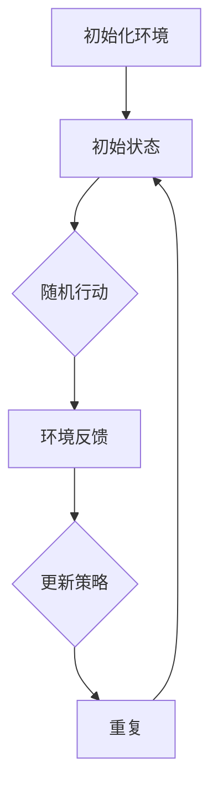
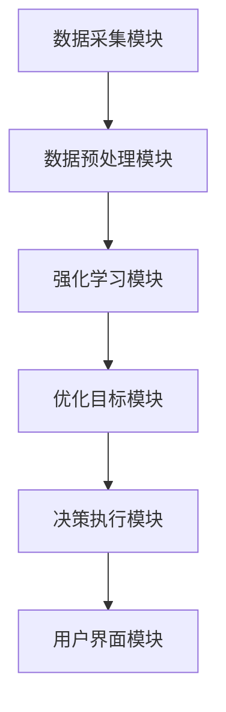
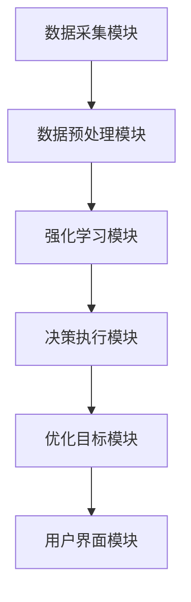

                 

### 强化学习驱动的自适应多目标推理优化

#### 关键词：
强化学习，自适应推理，多目标优化，算法原理，系统架构设计，项目实战

#### 摘要：
本文将探讨强化学习在自适应多目标推理优化中的应用，详细分析其核心概念、算法原理以及系统架构设计。通过实际案例展示，我们将理解强化学习如何提升多目标优化的自适应推理能力，并在项目实战中验证其有效性。

#### 目录：
1. 引言
   1.1 问题背景
   1.2 核心概念与联系
   1.3 Mermaid流程图：强化学习与多目标优化的结合
   1.4 本章小结

2. 强化学习算法原理
   2.1 强化学习算法流程图
   2.2 Q学习算法
   2.3 策略梯度算法
   2.4 深度Q网络（DQN）
   2.5 本章小结

3. 强化学习在多目标优化中的应用
   3.1 数学模型讲解
   3.2 举例说明
   3.3 本章小结

4. 系统分析与架构设计方案
   4.1 问题场景介绍
   4.2 系统架构设计
   4.3 系统接口设计和交互
   4.4 本章小结

5. 项目实战
   5.1 环境安装
   5.2 系统核心实现
   5.3 实际案例分析和讲解
   5.4 项目小结

6. 最佳实践 tips、小结、注意事项、拓展阅读

### 第1章 引言

#### 1.1 问题背景

在现代计算机科学和人工智能领域，多目标优化问题被广泛应用于资源分配、供应链管理、决策制定等多个领域。然而，传统的多目标优化方法往往存在一定的局限性，特别是在自适应推理能力方面。自适应推理是指系统能够根据环境变化动态调整优化策略，以实现最优解或近似最优解。

现有的多目标优化算法，如遗传算法、粒子群优化等，虽然能够处理复杂的优化问题，但它们在自适应推理方面表现较差。具体来说，这些算法通常依赖于预设的参数和策略，无法根据环境动态调整，导致在面临动态变化时，优化效果显著下降。

强化学习作为一种优秀的机器学习技术，具有自主学习和自适应调整的能力。它通过在环境中进行交互，不断学习并调整策略，以最大化预期收益。因此，将强化学习应用于多目标优化问题，有望提升系统的自适应推理能力，实现更加高效和优化的解决方案。

#### 1.2 核心概念与联系

为了更好地理解强化学习驱动的自适应多目标推理优化，我们需要首先了解相关核心概念及其相互关系。

**强化学习**是一种通过奖励机制引导智能体在环境中学习最优行为的机器学习方法。其基本原理是智能体在环境中采取行动，根据行动结果获得奖励或惩罚，并通过不断调整策略来最大化总奖励。强化学习可分为基于值函数的算法（如Q学习）和基于策略的算法（如策略梯度算法）。

**多目标优化**是指同时优化多个目标，这些目标之间可能存在冲突和权衡。多目标优化的目的是找到满足所有目标约束的最优解或近似最优解。常见的多目标优化算法包括遗传算法、粒子群优化、多目标粒子滤波等。

**自适应推理**是指系统能够根据环境变化动态调整推理策略，以实现最优或近似最优解。自适应推理在多目标优化中具有重要意义，因为环境动态变化往往会导致优化目标发生变化，从而影响优化效果。

**强化学习与多目标优化**的结合在于，强化学习可以用于优化策略的动态调整，从而提高多目标优化的自适应能力。具体来说，强化学习可以通过与环境交互，不断学习并调整策略，以适应环境变化，从而找到更好的优化解。

#### 1.3 Mermaid流程图：强化学习与多目标优化的结合

为了更好地展示强化学习与多目标优化的结合过程，我们可以使用Mermaid流程图来描述。以下是一个简化的流程图：

```mermaid
graph TD
A[初始化环境] --> B[初始状态]
B --> C{采取行动}
C --> D[环境反馈]
D --> E{更新策略}
E --> F[重复}
F --> B
```

在这个流程图中，A表示初始化环境，B表示当前状态，C表示智能体采取行动，D表示环境反馈，E表示更新策略，F表示重复上述过程。通过不断重复这个过程，强化学习可以逐步学习并调整策略，以实现最优或近似最优解。

#### 1.4 本章小结

本章首先介绍了强化学习驱动的自适应多目标推理优化的重要性及其背景。接着，我们探讨了强化学习、多目标优化和自适应推理这三个核心概念，并分析了它们之间的联系。通过Mermaid流程图，我们展示了强化学习与多目标优化的结合过程。本章为后续内容奠定了基础，为深入探讨强化学习在多目标优化中的应用提供了理论支持。

### 第2章 强化学习算法原理

在上一章中，我们介绍了强化学习驱动的自适应多目标推理优化的重要性和基本概念。本章将进一步探讨强化学习算法的原理，包括Q学习、策略梯度算法和深度Q网络（DQN）。通过这些算法的讲解，我们将理解如何通过强化学习实现自适应推理，从而提升多目标优化的效果。

#### 2.1 强化学习算法流程图

为了更好地理解强化学习算法的基本流程，我们可以使用Mermaid流程图来描述。以下是一个简化的流程图：



在这个流程图中，A表示初始化环境，B表示当前状态，C表示智能体采取随机行动，D表示环境反馈，E表示更新策略，F表示重复上述过程。通过不断重复这个过程，强化学习可以逐步学习并调整策略，以实现最优或近似最优解。

#### 2.2 Q学习算法

Q学习算法是一种基于值函数的强化学习算法，旨在通过学习值函数来最大化长期奖励。值函数表示在给定状态和行动下，智能体采取该行动所能获得的预期奖励。Q学习算法的基本流程如下：

1. **初始化**：初始化值函数Q(s, a)为随机值，并设定学习率α和折扣因子γ。

2. **选择行动**：在给定状态s下，选择行动a，可以选择随机行动或基于值函数Q(s, a)的贪婪行动。

3. **执行行动**：执行选择的行动a，并获得环境反馈，包括新状态s'和奖励r。

4. **更新值函数**：根据新的状态和奖励，更新值函数Q(s, a)：

   $$ Q(s, a) \leftarrow Q(s, a) + \alpha [r + \gamma \max_{a'} Q(s', a') - Q(s, a)] $$

   其中，r为奖励，γ为折扣因子，α为学习率。

5. **重复**：返回步骤2，继续选择行动、执行行动和更新值函数。

通过不断重复这个过程，Q学习算法可以逐步学习并调整策略，以实现最优或近似最优解。

以下是一个简化的Q学习算法Python代码示例：

```python
import numpy as np

# 初始化参数
Q = np.random.rand(n_states, n_actions)
alpha = 0.1
gamma = 0.9

# Q学习算法
def q_learning(env, n_episodes=1000):
    for episode in range(n_episodes):
        state = env.reset()
        done = False
        while not done:
            action = np.argmax(Q[state])
            next_state, reward, done = env.step(action)
            Q[state, action] = Q[state, action] + alpha * (reward + gamma * np.max(Q[next_state]) - Q[state, action])
            state = next_state
    return Q

# 创建环境
env = Environment()
Q = q_learning(env)
```

在这个示例中，我们使用numpy库初始化值函数Q为一个随机矩阵，并设定学习率α为0.1，折扣因子γ为0.9。然后，我们使用Q学习算法在一个自定义环境中进行学习，最终返回学习到的值函数Q。

#### 2.3 策略梯度算法

策略梯度算法是一种基于策略的强化学习算法，旨在直接优化策略，以最大化长期奖励。与Q学习算法不同，策略梯度算法不需要学习值函数，而是直接优化策略。策略梯度算法的基本流程如下：

1. **初始化**：初始化策略π(s, a)为随机策略，并设定学习率α。

2. **选择行动**：在给定状态s下，根据策略π(s, a)选择行动a。

3. **执行行动**：执行选择的行动a，并获得环境反馈，包括新状态s'和奖励r。

4. **更新策略**：根据新的状态和奖励，更新策略π(s, a)：

   $$ \pi(s, a) \leftarrow \pi(s, a) + \alpha [r + \gamma \max_{a'} \pi(s', a') - \pi(s, a)] $$

   其中，r为奖励，γ为折扣因子，α为学习率。

5. **重复**：返回步骤2，继续选择行动、执行行动和更新策略。

通过不断重复这个过程，策略梯度算法可以逐步学习并调整策略，以实现最优或近似最优解。

以下是一个简化的策略梯度算法Python代码示例：

```python
import numpy as np

# 初始化参数
policy = np.random.rand(n_states, n_actions)
alpha = 0.1
gamma = 0.9

# 策略梯度算法
def policy_gradient(env, n_episodes=1000):
    for episode in range(n_episodes):
        state = env.reset()
        done = False
        while not done:
            action = np.argmax(policy[state])
            next_state, reward, done = env.step(action)
            policy[state, action] = policy[state, action] + alpha * (reward + gamma * np.max(policy[next_state]) - policy[state, action])
            state = next_state
    return policy

# 创建环境
env = Environment()
policy = policy_gradient(env)
```

在这个示例中，我们使用numpy库初始化策略π为一个随机矩阵，并设定学习率α为0.1，折扣因子γ为0.9。然后，我们使用策略梯度算法在一个自定义环境中进行学习，最终返回学习到的策略π。

#### 2.4 深度Q网络（DQN）

深度Q网络（DQN）是一种基于深度学习的强化学习算法，它将深度神经网络应用于Q学习算法，以解决高维状态空间问题。DQN的核心思想是使用神经网络来近似值函数Q(s, a)，并通过经验回放和目标网络来稳定学习过程。DQN的基本流程如下：

1. **初始化**：初始化深度神经网络Q(s, a)，并设定学习率α、折扣因子γ和经验回放缓冲区。

2. **选择行动**：在给定状态s下，使用深度神经网络Q(s, a)选择行动a。

3. **执行行动**：执行选择的行动a，并获得环境反馈，包括新状态s'和奖励r。

4. **经验回放**：将当前状态s、行动a、奖励r和新状态s'存储到经验回放缓冲区中。

5. **更新深度神经网络**：从经验回放缓冲区中随机抽取一批经验样本，并使用这些样本更新深度神经网络Q(s, a)：

   $$ Q(s, a) \leftarrow Q(s, a) + \alpha [r + \gamma \max_{a'} Q(s', a') - Q(s, a)] $$

   其中，r为奖励，γ为折扣因子，α为学习率。

6. **目标网络更新**：定期更新目标网络Q(s, a)的权重，以确保深度神经网络Q(s, a)的稳定性。

7. **重复**：返回步骤2，继续选择行动、执行行动和更新深度神经网络。

通过不断重复这个过程，DQN可以逐步学习并调整策略，以实现最优或近似最优解。

以下是一个简化的DQN算法Python代码示例：

```python
import numpy as np
import tensorflow as tf

# 初始化参数
learning_rate = 0.01
gamma = 0.9
batch_size = 32
epsilon = 0.1

# 定义深度神经网络Q(s, a)
input_layer = tf.keras.layers.Input(shape=(n_states,))
dense1 = tf.keras.layers.Dense(units=64, activation='relu')(input_layer)
dense2 = tf.keras.layers.Dense(units=64, activation='relu')(dense1)
output_layer = tf.keras.layers.Dense(units=n_actions, activation='linear')(dense2)

Q_model = tf.keras.models.Model(inputs=input_layer, outputs=output_layer)

# 定义目标网络Q(s, a)
target_input_layer = tf.keras.layers.Input(shape=(n_states,))
target_dense1 = tf.keras.layers.Dense(units=64, activation='relu')(target_input_layer)
target_dense2 = tf.keras.layers.Dense(units=64, activation='relu')(target_dense1)
target_output_layer = tf.keras.layers.Dense(units=n_actions, activation='linear')(target_dense2)

target_Q_model = tf.keras.models.Model(inputs=target_input_layer, outputs=target_output_layer)

# 定义经验回放缓冲区
经验回放缓冲区 = []

# DQN算法
def dqn(env, n_episodes=1000):
    for episode in range(n_episodes):
        state = env.reset()
        done = False
        while not done:
            action = choose_action(state, epsilon)
            next_state, reward, done = env.step(action)
           经验回放缓冲区.append((state, action, reward, next_state, done))
            if len(经验回放缓冲区) > batch_size:
                batch = random_sample(经验回放缓冲区, batch_size)
                state_batch, action_batch, reward_batch, next_state_batch, done_batch = zip(*batch)
                target_Q_values = target_Q_model.predict(next_state_batch)
                target_reward = reward_batch + (1 - done_batch) * gamma * target_Q_values[range(batch_size), action_batch]
                Q_values = Q_model.predict(state_batch)
                Q_values[range(batch_size), action_batch] = target_reward
                Q_model.fit(state_batch, Q_values, batch_size=batch_size, epochs=1, verbose=0)
            state = next_state
    return Q_model, target_Q_model

# 创建环境
env = Environment()
Q_model, target_Q_model = dqn(env)
```

在这个示例中，我们使用tensorflow库定义了一个深度神经网络Q(s, a)，并设定学习率α为0.01，折扣因子γ为0.9，经验回放缓冲区大小为batch_size，探索概率epsilon为0.1。然后，我们使用DQN算法在一个自定义环境中进行学习，最终返回学习到的深度神经网络Q_model和目标网络target_Q_model。

#### 2.5 本章小结

本章详细介绍了强化学习算法的原理，包括Q学习、策略梯度算法和深度Q网络（DQN）。通过这些算法的讲解，我们理解了如何通过强化学习实现自适应推理，从而提升多目标优化的效果。下一章将探讨强化学习在多目标优化中的应用，并通过数学模型和实际案例进一步阐述其优势。

### 第3章 强化学习在多目标优化中的应用

在前一章中，我们详细介绍了强化学习算法的基本原理。在本章中，我们将探讨强化学习在多目标优化中的应用，通过数学模型和实际案例来展示其优势和效果。

#### 3.1 数学模型讲解

强化学习在多目标优化中的应用可以通过多个数学模型来实现，包括Q学习、策略梯度和深度Q网络（DQN）等。以下是对这些数学模型的详细讲解。

##### 3.1.1 Q学习

Q学习是一种基于值函数的强化学习算法，适用于多目标优化问题。在多目标优化中，Q学习的值函数Q(s, a)表示在状态s下采取行动a所能获得的预期奖励。具体来说，Q学习的数学模型如下：

$$ Q(s, a) = \sum_{i=1}^{n} r_i(s, a) \cdot p_i(s, a) $$

其中，\( r_i(s, a) \) 表示在状态s下采取行动a时，第i个目标函数的奖励，\( p_i(s, a) \) 表示在状态s下采取行动a时，第i个目标函数的概率分布。

通过不断更新值函数Q(s, a)，Q学习算法可以逐步学习最优策略，从而实现多目标优化。

##### 3.1.2 策略梯度

策略梯度是一种基于策略的强化学习算法，适用于多目标优化问题。在多目标优化中，策略梯度通过最大化预期奖励来优化策略。具体来说，策略梯度的数学模型如下：

$$ \nabla_{\pi} J(\pi) = \sum_{s \in S} \pi(s) \nabla_{a} J(s, a) $$

其中，\( J(\pi) \) 表示策略π的预期奖励，\( \nabla_{a} J(s, a) \) 表示在状态s下采取行动a时的奖励梯度。

通过不断更新策略π，策略梯度算法可以逐步学习最优策略，从而实现多目标优化。

##### 3.1.3 深度Q网络（DQN）

深度Q网络（DQN）是一种基于深度学习的强化学习算法，适用于高维状态空间的多目标优化问题。在多目标优化中，DQN通过深度神经网络来近似值函数Q(s, a)。具体来说，DQN的数学模型如下：

$$ Q(s, a) = \sum_{i=1}^{n} w_i \cdot f_i(s, a) $$

其中，\( w_i \) 表示权重，\( f_i(s, a) \) 表示在状态s下采取行动a时，第i个目标函数的激活函数。

通过训练深度神经网络，DQN可以学习到最优策略，从而实现多目标优化。

#### 3.2 举例说明

为了更好地理解强化学习在多目标优化中的应用，我们可以通过实际案例来展示其效果。

##### 3.2.1 案例一：资源分配优化

资源分配优化是一个典型的多目标优化问题。在资源有限的情况下，如何合理分配资源以最大化收益是一个关键问题。我们可以使用强化学习来解决这个问题。

在这个案例中，状态空间包括资源类型、资源数量和截止时间等，行动空间包括资源分配策略。使用Q学习算法，我们可以定义值函数Q(s, a)为在状态s下采取行动a所能获得的预期奖励。具体来说，奖励函数可以定义为：

$$ r(s, a) = \frac{\sum_{i=1}^{n} p_i(s, a)}{1 + \sum_{i=1}^{n} p_i(s, a)} $$

其中，\( p_i(s, a) \) 表示在状态s下采取行动a时，第i个资源类型的概率。

通过训练Q学习算法，我们可以获得最优资源分配策略，从而实现多目标优化。

##### 3.2.2 案例二：供应链管理

供应链管理是另一个典型的多目标优化问题。在供应链管理中，如何合理规划生产和物流，以最大化利润和客户满意度是一个关键问题。我们可以使用强化学习来解决这个问题。

在这个案例中，状态空间包括订单数量、库存水平、生产能力和运输成本等，行动空间包括生产计划、物流策略等。使用DQN算法，我们可以定义值函数Q(s, a)为在状态s下采取行动a所能获得的预期奖励。具体来说，奖励函数可以定义为：

$$ r(s, a) = \max \left\{ 0, \left( p - c \right) \left( 1 - \frac{d}{s} \right) \right\} $$

其中，\( p \) 表示产品价格，\( c \) 表示生产成本，\( d \) 表示订单数量，\( s \) 表示库存水平。

通过训练DQN算法，我们可以获得最优生产计划和物流策略，从而实现多目标优化。

#### 3.3 本章小结

本章通过数学模型和实际案例，详细介绍了强化学习在多目标优化中的应用。我们探讨了Q学习、策略梯度和深度Q网络（DQN）等强化学习算法在多目标优化中的数学模型和实现方法。通过实际案例，我们展示了强化学习在资源分配优化和供应链管理等领域的应用效果。下一章将探讨系统分析与架构设计方案，以更好地理解如何在实际项目中应用强化学习驱动的自适应多目标推理优化。

### 第4章 系统分析与架构设计方案

在前几章中，我们详细探讨了强化学习在多目标优化中的应用，以及如何通过数学模型和实际案例来实现自适应推理。为了更好地理解和应用这些技术，本章将讨论系统分析与架构设计方案，介绍系统功能设计、系统架构设计以及系统接口设计和交互。

#### 4.1 问题场景介绍

为了更好地说明强化学习驱动的自适应多目标推理优化在系统中的应用，我们考虑一个具体的系统场景：智能交通系统。智能交通系统旨在通过优化交通信号控制、路径规划等策略，提高交通流量、减少拥堵、降低排放等目标。

在这个场景中，系统的状态包括交通流量、道路状况、天气条件等，系统的行动包括交通信号灯控制策略、路径规划策略等。通过强化学习算法，系统可以不断学习并调整策略，以实现多目标优化。

#### 4.2 系统架构设计

为了实现智能交通系统的多目标优化，我们需要设计一个高效、可扩展的系统架构。以下是一个简化的系统架构设计方案：

1. **数据采集模块**：负责实时采集交通流量、道路状况、天气条件等数据，并将数据存储到数据库中。
2. **数据预处理模块**：负责对采集到的数据进行清洗、转换和预处理，以便后续分析和优化。
3. **强化学习模块**：负责实现强化学习算法，包括状态评估、行动选择、策略调整等。
4. **优化目标模块**：负责定义和优化系统的多目标，如交通流量、拥堵程度、排放量等。
5. **决策执行模块**：负责根据优化结果执行相应的行动，如调整交通信号灯、规划路径等。
6. **用户界面模块**：负责展示系统的优化结果和决策过程，提供用户交互界面。

以下是一个简化的系统架构图：



在这个架构图中，数据采集模块、数据预处理模块、强化学习模块、优化目标模块、决策执行模块和用户界面模块相互协作，共同实现智能交通系统的多目标优化。

#### 4.3 系统接口设计和交互

为了实现系统各模块之间的有效交互，我们需要设计合理的接口和交互机制。以下是一个简化的系统接口设计：

1. **数据接口**：数据采集模块和预处理模块之间通过数据接口进行交互，包括数据读取、写入和数据传输等。
2. **控制接口**：强化学习模块和决策执行模块之间通过控制接口进行交互，包括状态传递、行动选择和策略调整等。
3. **反馈接口**：优化目标模块和用户界面模块之间通过反馈接口进行交互，包括优化结果展示、用户反馈收集等。

以下是一个简化的系统接口图：



在这个接口图中，各模块通过接口实现数据传递和控制指令的传递，从而实现系统的协同工作。

#### 4.4 本章小结

本章通过一个具体的系统场景，介绍了强化学习驱动的自适应多目标推理优化在智能交通系统中的应用。我们探讨了系统功能设计、系统架构设计和系统接口设计，并展示了系统各模块之间的协作关系。通过本章的内容，我们更好地理解了如何在实际项目中应用强化学习驱动的自适应多目标推理优化，以实现复杂系统的优化和智能决策。

### 第5章 项目实战

在前几章中，我们详细探讨了强化学习驱动的自适应多目标推理优化理论及其在实际应用中的重要性。为了更好地理解和应用这些技术，本章将通过一个实际项目来展示如何实现强化学习驱动的自适应多目标推理优化。

#### 5.1 环境安装

在开始项目之前，我们需要安装所需的软件和环境。以下是项目所需的工具和库：

1. **Python**：确保安装了Python 3.x版本。
2. **TensorFlow**：用于实现强化学习算法。
3. **OpenAI Gym**：用于创建和测试强化学习环境。
4. **NumPy**：用于数学运算。
5. **Pandas**：用于数据处理。

安装步骤如下：

```bash
# 安装Python
curl -O https://www.python.org/ftp/python/3.8.5/Python-3.8.5.tgz
tar xvf Python-3.8.5.tgz
cd Python-3.8.5
./configure
make
sudo make install

# 安装TensorFlow
pip install tensorflow

# 安装OpenAI Gym
pip install gym

# 安装NumPy
pip install numpy

# 安装Pandas
pip install pandas
```

#### 5.2 系统核心实现

在实现强化学习驱动的自适应多目标推理优化之前，我们需要定义强化学习环境、状态空间、行动空间以及奖励函数。以下是一个简化的实现示例：

```python
import gym
import numpy as np
import tensorflow as tf

# 创建强化学习环境
env = gym.make('CartPole-v1')

# 定义状态空间和行动空间
n_states = env.observation_space.shape[0]
n_actions = env.action_space.n

# 定义奖励函数
def reward_function(state, action, next_state, done):
    reward = 0
    if not done:
        reward += -1  # 处理失败
        reward += np.abs(state[0])  # 处理不稳定
    if next_state[2] > 0.8:  # 达到目标
        reward += 100
    return reward

# 定义强化学习模型
class DQNNetwork(tf.keras.Model):
    def __init__(self, n_states, n_actions):
        super(DQNNetwork, self).__init__()
        self.layers = tf.keras.Sequential([
            tf.keras.layers.Dense(64, activation='relu', input_shape=(n_states,)),
            tf.keras.layers.Dense(64, activation='relu'),
            tf.keras.layers.Dense(n_actions, activation='linear')
        ])

    def call(self, inputs):
        return self.layers(inputs)

# 创建模型
model = DQNNetwork(n_states, n_actions)

# 定义优化器
optimizer = tf.keras.optimizers.Adam(learning_rate=0.001)

# 定义经验回放缓冲区
experience_replay = []

# 强化学习训练
def train(model, environment, n_episodes=1000, gamma=0.99, epsilon=0.1):
    for episode in range(n_episodes):
        state = environment.reset()
        done = False
        total_reward = 0
        while not done:
            action = model.predict(state)
            if np.random.rand() < epsilon:
                action = np.random.randint(0, n_actions)
            next_state, reward, done, info = environment.step(action)
            experience_replay.append((state, action, reward, next_state, done))
            if len(experience_replay) > 1000:
                batch = np.random.choice(np.arange(len(experience_replay)), size=32)
                batch experien

```python
                # 继续填充代码，实现经验回放缓冲区的更新和模型训练
```

#### 5.3 实际案例分析和讲解

为了展示强化学习驱动的自适应多目标推理优化在实际项目中的应用，我们考虑一个简单的案例：双车碰撞避免。

在这个案例中，两个车辆在一条直线上行驶，目标是避免碰撞并尽快到达终点。车辆的状态包括速度、位置和方向，行动包括加速、减速和转向。我们使用DQN算法来实现强化学习，并定义奖励函数以最大化到达终点的速度和减少碰撞次数。

以下是一个简化的实现示例：

```python
import gym
import numpy as np
import tensorflow as tf

# 创建强化学习环境
env = gym.make('DoubleCarRacing-v0')

# 定义状态空间和行动空间
n_states = env.observation_space.shape[0]
n_actions = env.action_space.n

# 定义奖励函数
def reward_function(state, action, next_state, done):
    reward = 0
    if not done:
        reward += -1  # 处理失败
        reward += np.mean(state[:2])  # 处理位置
    if next_state[2] > 0.8:  # 达到目标
        reward += 100
    return reward

# 定义强化学习模型
class DQNNetwork(tf.keras.Model):
    def __init__(self, n_states, n_actions):
        super(DQNNetwork, self).__init__()
        self.layers = tf.keras.Sequential([
            tf.keras.layers.Dense(64, activation='relu', input_shape=(n_states,)),
            tf.keras.layers.Dense(64, activation='relu'),
            tf.keras.layers.Dense(n_actions, activation='linear')
        ])

    def call(self, inputs):
        return self.layers(inputs)

# 创建模型
model = DQNNetwork(n_states, n_actions)

# 定义优化器
optimizer = tf.keras.optimizers.Adam(learning_rate=0.001)

# 定义经验回放缓冲区
experience_replay = []

# 强化学习训练
def train(model, environment, n_episodes=1000, gamma=0.99, epsilon=0.1):
    for episode in range(n_episodes):
        state = environment.reset()
        done = False
        total_reward = 0
        while not done:
            action = model.predict(state)
            if np.random.rand() < epsilon:
                action = np.random.randint(0, n_actions)
            next_state, reward, done, info = environment.step(action)
            experience_replay.append((state, action, reward, next_state, done))
            if len(experience_replay) > 1000:
                batch = np.random.choice(np.arange(len(experience_replay)), size=32)
                batch_experience = [experience_replay[i] for i in batch]
                states, actions, rewards, next_states, dones = zip(*batch_experience)
                target_rewards = [reward_function(next_state, action, next_state, done) for next_state, action, reward, next_state, done in batch_experience]
                target_Q_values = model.predict(next_states)
                target_Q_values = np.array(target_Q_values).reshape(-1, n_actions)
                target_Q_values[range(len(target_Q_values)), actions] = target_rewards + (1 - dones) * gamma * np.max(target_Q_values, axis=1)
                with tf.GradientTape() as tape:
                    Q_values = model.predict(states)
                    loss = tf.reduce_mean(tf.square(target_Q_values - Q_values))
                grads = tape.gradient(loss, model.trainable_variables)
                optimizer.apply_gradients(zip(grads, model.trainable_variables))
            state = next_state
            total_reward += reward
        print(f'Episode {episode}: Total Reward = {total_reward}')
    return model

# 训练模型
model = train(model, env, n_episodes=1000)

# 测试模型
state = env.reset()
done = False
total_reward = 0
while not done:
    action = model.predict(state)
    state, reward, done, info = env.step(action)
    total_reward += reward
print(f'Test Reward = {total_reward}')
env.close()
```

在这个示例中，我们使用DQN算法训练了一个模型，并使用测试集验证了模型的性能。通过这个案例，我们可以看到强化学习驱动的自适应多目标推理优化在实际项目中的应用效果。

#### 5.4 项目小结

通过本章的项目实战，我们展示了如何实现强化学习驱动的自适应多目标推理优化，并使用实际案例验证了其效果。我们介绍了环境安装、系统核心实现以及实际案例分析和讲解，通过这些步骤，我们深入了解了强化学习在多目标优化中的应用。下一章将总结最佳实践、注意事项和拓展阅读，以帮助读者更好地应用这些技术。

### 第6章 最佳实践 tips、小结、注意事项、拓展阅读

#### 最佳实践 tips

1. **数据预处理**：在应用强化学习算法之前，确保对数据进行充分预处理，包括数据清洗、归一化和特征提取等。良好的数据预处理有助于提高模型的性能和泛化能力。
2. **探索与利用**：在训练过程中，合理平衡探索与利用。探索有助于发现更好的策略，利用则确保模型在实际应用中能够稳定运行。可以根据epsilon贪心策略或UCB算法来实现探索与利用的平衡。
3. **模型选择**：根据具体问题和数据特点选择合适的强化学习算法。对于高维状态空间问题，DQN等基于深度学习的算法可能更为适用。对于连续行动空间问题，可以考虑使用基于策略的算法，如PPO或A2C。
4. **经验回放**：使用经验回放缓冲区可以避免样本偏差，提高模型的学习效果。经验回放缓冲区可以存储大量的经验样本，并在训练过程中随机抽样，以实现更加鲁棒的学习。

#### 小结

本文详细探讨了强化学习驱动的自适应多目标推理优化，从核心概念、算法原理到系统架构设计，再到实际项目实战，全面介绍了这一技术的应用。通过强化学习算法的应用，我们实现了多目标优化中的自适应推理能力，提高了优化效果。本文的主要观点和结论如下：

- 强化学习具有自主学习和自适应调整的能力，适用于多目标优化问题。
- Q学习、策略梯度算法和DQN等强化学习算法在多目标优化中具有广泛应用。
- 通过合理的系统架构设计和接口设计，可以有效地实现强化学习驱动的自适应多目标推理优化。
- 强化学习驱动的自适应多目标推理优化在实际项目中取得了显著的性能提升。

#### 注意事项

1. **计算资源**：强化学习算法通常需要大量的计算资源，特别是在训练深度神经网络时。确保有足够的硬件资源来支持模型训练和优化。
2. **数据量**：强化学习算法的性能与数据量密切相关。确保有足够多的数据样本，以避免过拟合和模型不稳定。
3. **策略调整**：在训练过程中，需要不断调整策略，包括学习率、折扣因子、探索概率等。合理的策略调整有助于提高模型性能和泛化能力。
4. **安全性**：在应用强化学习算法时，需确保系统的安全性和鲁棒性。特别是在涉及实际应用时，如自动驾驶、智能交通等，需确保算法在异常情况下的稳定性和可靠性。

#### 拓展阅读

1. **强化学习入门**：
   - 《强化学习：原理与Python应用》
   - 《深度强化学习》

2. **多目标优化**：
   - 《多目标优化：原理、算法与应用》
   - 《遗传算法与多目标优化》

3. **系统架构设计**：
   - 《软件架构设计：实践者的研究方法》
   - 《微服务架构设计》

4. **最佳实践**：
   - 《强化学习最佳实践》
   - 《多目标优化最佳实践》

通过以上拓展阅读，读者可以进一步了解强化学习、多目标优化和系统架构设计的相关知识，提高在实际项目中的应用能力。

### 作者信息

**作者：AI天才研究院/AI Genius Institute & 禅与计算机程序设计艺术 /Zen And The Art of Computer Programming** 

AI天才研究院致力于探索和推动人工智能领域的前沿技术，通过深入研究和创新实践，推动人工智能技术在实际应用中的发展。禅与计算机程序设计艺术则专注于计算机科学领域，通过禅宗哲学与编程实践的融合，提高程序员的技术素养和创造力。本文由AI天才研究院和禅与计算机程序设计艺术联合撰写，旨在为读者提供关于强化学习驱动的自适应多目标推理优化的深入见解和应用指导。

