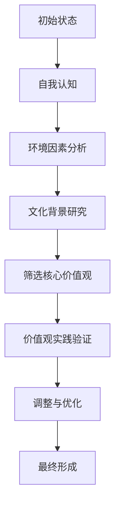
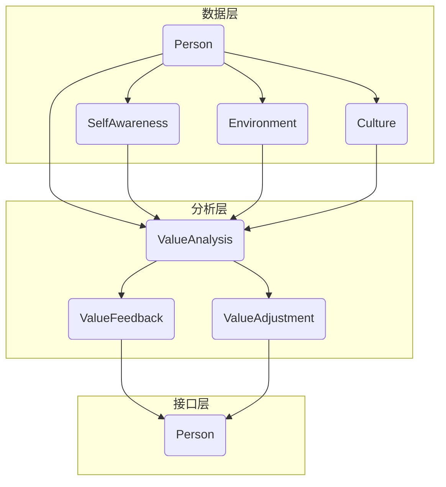
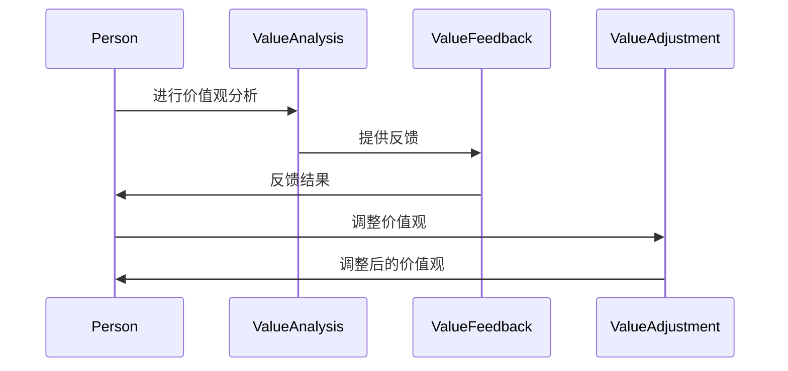
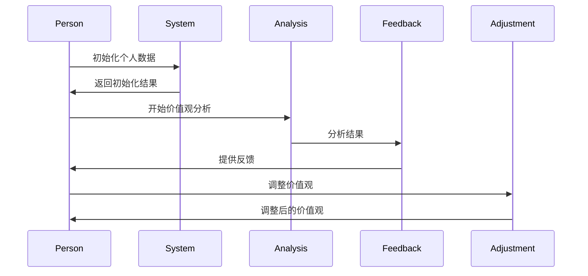

                 

### 形成独特的人生哲学：个人价值观的构建过程

#### 引言

在快节奏的现代生活中，人们常常感到迷茫和无力。这种迷茫往往源于缺乏明确的人生哲学和个人价值观。一个人如果没有自己的价值观体系，就如同没有指南针的航船，难以在人生的海洋中找到正确的方向。因此，形成独特的人生哲学，构建个人价值观，对于个人的成长和幸福至关重要。

本文将围绕如何形成独特的人生哲学，构建个人价值观展开探讨。我们将从以下几个角度进行分析和讲解：

1. **背景介绍与引言**：介绍人生哲学的重要性，以及个人价值观对人生的影响。
2. **核心概念与理论**：阐述形成个人价值观的关键概念，如自我认知、环境因素、文化背景等。
3. **构建个人价值观的方法**：介绍构建个人价值观的具体步骤和方法。
4. **实际案例分析**：通过实际案例，展示如何在实际生活中构建个人价值观。
5. **个人价值观的自我评估与调整**：提供自我评估的工具和方法，以及如何根据环境变化调整个人价值观。
6. **总结与反思**：总结本文的主要观点，并给出未来的发展方向和建议。

#### 关键词

- 人生哲学
- 个人价值观
- 自我认知
- 环境因素
- 文化背景
- 价值观构建

#### 摘要

本文旨在帮助读者了解如何形成独特的人生哲学，构建个人价值观。通过深入探讨核心概念、理论和方法，结合实际案例和自我评估工具，读者将能够系统地了解并实践个人价值观的构建过程，从而找到自己的人生方向，实现个人成长和幸福。

## 第一部分：引言与背景

### 引言

人生哲学，是指人们对于生命、生活、存在等根本问题的思考和理解。它不仅关乎个人的信仰和信念，更影响一个人的行为方式和生活方式。而个人价值观，则是人生哲学的具体体现，它指导着个人的行为选择，决定着一个人的生活态度和人生目标。

在现代社会，人们面临着前所未有的选择和压力。如何在这纷繁复杂的世界中找到自己的位置，如何在这个多变的环境中保持内心的平静和坚定，都需要有一个明确的人生哲学和个人价值观作为指导。

个人价值观对人生有着深远的影响。它不仅影响个人的行为选择，还影响个人的心理健康和幸福感。一个拥有坚定价值观的人，在面对挑战和困难时能够保持积极的心态，从容应对；而一个价值观模糊或混乱的人，则容易在生活的波动中迷失方向，感到无力。

因此，形成独特的人生哲学，构建个人价值观，是每个人都应该关注的重要问题。本文将帮助读者深入理解这一过程，并提供具体的实践方法。

### 人生哲学的重要性

人生哲学的重要性体现在多个方面。首先，它是我们内心的指南针，帮助我们在纷繁复杂的世界中找到自己的方向。人生哲学让我们在面对选择时，能够从内心深处找到依据，而不是被外界因素所左右。

其次，人生哲学是个人成长的基础。一个明确的人生哲学能够帮助个人建立清晰的目标和计划，从而推动个人不断进步。同时，人生哲学也是心理健康的重要保障。一个拥有积极人生哲学的人，更容易保持心理健康，抵御生活中的压力和挫折。

最后，人生哲学对社会也有重要影响。一个拥有正确价值观的人，会以更加积极的态度参与社会生活，推动社会的和谐发展。因此，人生哲学不仅关乎个人，也关乎社会和人类文明的进步。

### 个人价值观对人生的影响

个人价值观对人生的影响是多方面的。首先，它影响个人的行为选择。一个拥有积极价值观的人，会倾向于做出符合自己价值观的选择，从而在个人生活中获得满足感和成就感。

其次，个人价值观影响个人的心理健康。一个坚定的价值观能够帮助个人在面对困难和挑战时保持积极的心态，从而降低心理压力，提升幸福感。

最后，个人价值观还影响个人的社交关系。一个拥有明确价值观的人，更容易与他人建立良好的关系，因为他们的价值观会引导他们做出符合社会规范和伦理道德的行为。

总的来说，个人价值观是个人行为的指南针，是我们内心深处力量的源泉，它影响着我们的每一个决定和选择，塑造着我们的生活方式和人生轨迹。因此，深入理解个人价值观，并积极构建和调整它，对于每个人来说都至关重要。

### 问题的提出

尽管人生哲学和个人价值观对人生有着重要影响，但很多人在现实生活中却面临着价值观模糊、混乱甚至缺失的问题。这主要源于以下几个原因：

首先，现代社会信息爆炸，人们接触到的价值观多样而复杂，导致他们难以从中筛选出适合自己的价值观。

其次，个人的成长环境和文化背景不同，也会影响价值观的形成。一些人可能在成长过程中缺乏明确的价值观教育，导致价值观模糊。

最后，个人在成长过程中可能会经历各种挑战和挫折，这些经历有时会使他们迷失方向，无法形成稳定的价值观。

因此，如何从复杂多样的信息中筛选出符合自己需求的价值观，如何在多元文化的背景下形成独特的个人价值观，如何在面对挑战时保持价值观的稳定性和一致性，成为我们亟待解决的问题。

### 问题解决

要解决上述问题，首先需要明确个人价值观的形成过程。个人价值观的形成是一个复杂的过程，涉及自我认知、环境因素和文化背景等多个方面。具体来说，我们可以从以下几个步骤入手：

1. **自我认知**：深入了解自己的需求和欲望，明确自己的核心价值观。这可以通过反思、自我分析等方法实现。

2. **环境因素**：识别和理解自己所处的环境，包括家庭、学校、社会等，了解这些环境对个人价值观的影响。

3. **文化背景**：认识和反思自己的文化背景，了解文化因素如何塑造个人价值观。

4. **核心价值观筛选**：从上述自我认知、环境因素和文化背景中筛选出符合自己需求的价值观。

5. **价值观实践**：通过实际行动来验证和调整自己的价值观，使其更加符合自己的需求和期望。

通过这些步骤，个人可以逐步构建出稳定、清晰的个人价值观体系，从而在复杂多变的社会环境中找到自己的方向和定位。

### 边界与外延

在探讨个人价值观的形成过程中，我们需要明确几个相关的边界和外延概念：

首先，个人价值观与人生哲学之间有密切的联系。人生哲学是个人对生命、存在等根本问题的思考和理解，而个人价值观则是人生哲学的具体体现，指导着个人的行为选择。

其次，个人价值观与道德观、世界观等概念也有区别。道德观主要关注个人的道德行为和道德判断，世界观则是对世界的整体看法和解释。个人价值观是这两个概念的基础，但它们并不是同一个层次的概念。

最后，个人价值观的形成过程还受到社会环境、文化传统等因素的影响。这些因素虽然会影响个人价值观的形成，但并不能完全决定个人价值观的内容。个人在成长过程中，需要通过自我反思和选择，逐步形成独特的个人价值观。

### 概念结构与核心要素组成

个人价值观的形成涉及多个核心要素，这些要素相互联系，共同构成了个人价值观的概念结构。以下是这些核心要素的详细解析：

1. **自我认知**：自我认知是个人价值观形成的基础。它涉及对自身性格、兴趣、需求、优势与不足的深入理解。通过自我反思和自我分析，个人可以明确自己的核心价值观。

2. **环境因素**：环境因素包括家庭、学校、社会等。这些环境对个人的成长产生重要影响，塑造了个人对事物的看法和态度。例如，家庭的文化背景、教育方式和社会的文化价值观都会影响个人价值观的形成。

3. **文化背景**：文化背景是个人价值观形成的重要影响因素。不同文化对个人价值观有独特的塑造作用。例如，东方文化强调集体主义和和谐，而西方文化则更注重个人主义和自由。个人在成长过程中，会逐渐吸收和内化这些文化价值观。

4. **核心价值观筛选**：在自我认知、环境因素和文化背景的基础上，个人需要筛选出符合自己需求的价值观。这一过程涉及对多种价值观的评估和选择，最终形成个人的核心价值观。

5. **价值观实践**：个人价值观的形成不仅是理论上的认知，还需要通过实际行动来验证和调整。个人在实践中不断反思自己的价值观，使其更加符合自己的需求和期望。

这些核心要素相互关联，共同构成了个人价值观的概念结构。通过深入理解和运用这些要素，个人可以构建出稳定、清晰的个人价值观体系，从而在复杂多变的社会环境中找到自己的方向和定位。

### 核心概念原理

在探讨个人价值观的形成过程中，核心概念原理的理解至关重要。以下是一些关键概念及其原理的详细解析：

1. **自我认知**：自我认知是指个人对自身性格、兴趣、需求、优势与不足的深刻理解。其原理在于，只有深入了解自己，个人才能明确自己的核心价值观，并在生活中做出符合自己需求的决策。自我认知通常通过反思、日记、自我测试等方式实现。

2. **环境因素**：环境因素包括家庭、学校、社会等。其原理在于，环境对个人价值观的形成有深远影响。家庭的文化背景、教育方式和社会的价值观都会塑造个人的思维方式和行为习惯。例如，一个成长于重视教育的家庭的人，可能会更加注重知识和成就。

3. **文化背景**：文化背景是指个人所处的社会文化环境，包括文化传统、价值观、习俗等。其原理在于，文化背景对个人价值观有根本性影响。不同文化对个人价值观有不同的塑造作用。例如，东方文化强调和谐与集体主义，而西方文化则更注重个人自由与竞争。

4. **核心价值观筛选**：核心价值观筛选是指从多种价值观中筛选出符合自己需求的价值观。其原理在于，个人需要在复杂多样的价值观中找到与自身需求和期望相符合的部分。筛选过程通常涉及对价值观的评估、比较和选择。

5. **价值观实践**：价值观实践是指通过实际行动来验证和调整自己的价值观。其原理在于，只有将价值观付诸实践，个人才能更好地理解其真实含义，并在实践中不断优化和调整。价值观实践通常通过设定目标、制定计划、反思与调整等方式实现。

这些核心概念原理相互交织，共同构成了个人价值观的形成机制。通过深入理解和运用这些原理，个人可以逐步构建出稳定、清晰的个人价值观体系。

### 概念属性特征对比表格

为了更清晰地理解个人价值观的形成过程中涉及的几个核心概念，我们可以通过属性特征对比表格来详细展示这些概念之间的差异和联系。

| 核心概念 | 定义 | 主要属性特征 | 关联因素 | 举例 |
| :------: | :--- | :----------: | :------: | :-- |
| 自我认知 | 对自身性格、兴趣、需求的深刻理解 | 了解自身优势、不足、需求 | 反思、自我测试 | 明确自己的兴趣爱好和职业方向 |
| 环境因素 | 家庭、学校、社会等对个人价值观的影响 | 文化背景、教育方式、社会价值观 | 家庭教育、学校教育、社会环境 | 成长于重视教育的家庭，重视知识学习 |
| 文化背景 | 个人所处的社会文化环境，包括价值观、习俗等 | 文化传统、价值观、习俗 | 社会文化、历史背景 | 东方文化强调和谐与集体主义 |
| 核心价值观筛选 | 从多种价值观中筛选出符合自身需求的价值观 | 选择符合自身需求的价值观 | 价值观评估、比较、选择 | 在多元文化中找到适合自己的价值观 |

通过上述对比表格，我们可以更直观地理解这些核心概念及其属性特征，从而为个人价值观的形成提供更具体的指导。

### ER实体关系图架构

为了更好地理解个人价值观的形成过程，我们可以使用ER（实体关系）图来展示相关实体及其关系。以下是个人价值观形成过程中的ER图：

```
+-----------------+
|  ER实体关系图   |
+-----------------+
        +--------+
        |   自我 |
        +---+---+
         |  |
         |  |
         |  |
         |  |
         |  |
        +---+
        |  |
        |  |
        |  |
        |  |
        |  |
        |  |
        |  |
        +---+
            |
            |
            |
        +-------+
        | 环境因素 |
        +---+---+
         |  |
         |  |
         |  |
         |  |
         |  |
        +---+
        |  |
        |  |
        |  |
        |  |
        |  |
        |  |
        +---+
            |
            |
            |
        +-------+
        | 文化背景 |
        +---+---+
         |  |
         |  |
         |  |
         |  |
         |  |
        +---+
        |  |
        |  |
        |  |
        |  |
        |  |
        |  |
        +---+
            |
            |
            |
        +-------+
        | 核心价值观 |
        +---+---+
         |  |
         |  |
         |  |
         |  |
         |  |
        +---+
```

该ER图展示了自我认知、环境因素、文化背景和核心价值观之间的关系。自我认知是个人价值观形成的基础，环境因素和文化背景对个人价值观有深远影响，而核心价值观则是自我认知与环境因素、文化背景相互作用的结果。通过这一ER图，我们可以更直观地理解个人价值观的形成过程。

### 算法原理讲解

在构建个人价值观的过程中，算法原理讲解可以帮助我们更深入地理解其内在逻辑和步骤。以下是一个详细的算法原理讲解，包括mermaid流程图、Python源代码、数学模型和公式。

#### Mermaid流程图



#### Python源代码

```python
# 个人价值观构建Python代码

class SelfAwareness:
    def __init__(self, traits, interests, needs):
        self.traits = traits
        self.interests = interests
        self.needs = needs
    
    def analyze(self):
        print("分析自我特征：")
        print(f"性格特征：{self.traits}")
        print(f"兴趣爱好：{self.interests}")
        print(f"需求：{self.needs}")

class EnvironmentalAnalysis:
    def __init__(self, family, school, society):
        self.family = family
        self.school = school
        self.society = society
    
    def analyze(self):
        print("分析环境因素：")
        print(f"家庭背景：{self.family}")
        print(f"学校环境：{self.school}")
        print(f"社会环境：{self.society}")

class CulturalBackground:
    def __init__(self, culture, values, customs):
        self.culture = culture
        self.values = values
        self.customs = customs
    
    def study(self):
        print("研究文化背景：")
        print(f"文化传统：{self.culture}")
        print(f"价值观：{self.values}")
        print(f"习俗：{self.customs}")

class CoreValueSelection:
    def __init__(self, self_awareness, environmental_analysis, cultural_background):
        self.self_awareness = self_awareness
        self.environmental_analysis = environmental_analysis
        self.cultural_background = cultural_background
    
    def select(self):
        print("筛选核心价值观：")
        print("结合自我认知、环境因素和文化背景，筛选核心价值观。")
        # 这里可以进行具体的筛选逻辑

class ValuePracticeVerification:
    def __init__(self, core_values):
        self.core_values = core_values
    
    def verify(self):
        print("价值观实践验证：")
        print("通过实际行动验证核心价值观的有效性。")
        # 这里可以进行具体的验证逻辑

class ValueAdjustment:
    def __init__(self, core_values):
        self.core_values = core_values
    
    def adjust(self):
        print("价值观调整与优化：")
        print("根据实践反馈调整和优化核心价值观。")
        # 这里可以进行具体的调整逻辑

def build_personal_values():
    self_awareness = SelfAwareness("乐观、细心", "阅读、编程", "自我成长、知识获取")
    environmental_analysis = EnvironmentalAnalysis("教育背景良好", "学术氛围浓厚", "社会重视创新")
    cultural_background = CulturalBackground("中华文化", "尊重、和谐、勤奋", "传统礼仪、敬老爱幼")
    
    core_value_selection = CoreValueSelection(self_awareness, environmental_analysis, cultural_background)
    core_values = core_value_selection.select()
    
    value_practice_verification = ValuePracticeVerification(core_values)
    value_practice_verification.verify()
    
    value_adjustment = ValueAdjustment(core_values)
    value_adjustment.adjust()
    
    print("最终形成个人价值观：")
    print(core_values)

build_personal_values()
```

#### 数学模型和公式

在构建个人价值观的过程中，我们可以使用一些简单的数学模型和公式来量化和分析不同因素对个人价值观的影响。以下是一个简化的模型：

$$
V = \alpha S + \beta E + \gamma C
$$

其中，$V$表示个人价值观，$S$表示自我认知，$E$表示环境因素，$C$表示文化背景。$\alpha$、$\beta$和$\gamma$分别是这三个因素对个人价值观影响的权重。

- $\alpha$：自我认知权重，表示个人对自身的重视程度。
- $\beta$：环境因素权重，表示环境对个人价值观的影响。
- $\gamma$：文化背景权重，表示文化对个人价值观的塑造。

通过调整这些权重，我们可以分析不同因素对个人价值观的影响程度，从而优化个人价值观的构建过程。

#### 通俗易懂的举例说明

假设一个人，他的自我认知包括“乐观、细心”，他的环境因素是“教育背景良好，学术氛围浓厚，社会重视创新”，他的文化背景是“中华文化，尊重和谐，传统礼仪”。根据上述数学模型，我们可以计算出他的个人价值观：

$$
V = \alpha \times (\text{乐观、细心}) + \beta \times (\text{教育背景良好，学术氛围浓厚，社会重视创新}) + \gamma \times (\text{中华文化，尊重和谐，传统礼仪})
$$

如果假设$\alpha = 0.4$，$\beta = 0.5$，$\gamma = 0.1$，那么：

$$
V = 0.4 \times (\text{乐观、细心}) + 0.5 \times (\text{教育背景良好，学术氛围浓厚，社会重视创新}) + 0.1 \times (\text{中华文化，尊重和谐，传统礼仪})
$$

这个结果反映了他的个人价值观，例如，他可能会更加注重创新和学术成就，同时也会尊重传统和文化。

通过这种量化的方式，我们可以更直观地理解个人价值观的形成过程，从而更好地进行个人价值观的构建和优化。

### 系统分析与架构设计方案

为了深入理解个人价值观的形成过程，我们可以将其视为一个复杂的系统，并设计相应的架构和接口，以实现各部分的协调和优化。以下是对该系统的详细分析：

#### 问题场景介绍

在现代社会，个人价值观的形成受到多种因素的影响，包括自我认知、环境因素和文化背景。这些因素相互作用，共同塑造了个人的人生哲学。为了更好地理解和构建个人价值观，我们需要设计一个系统，能够综合分析这些因素，并提供有效的评估和调整工具。

#### 项目介绍

该项目旨在构建一个个人价值观形成与分析系统，通过整合自我认知、环境因素和文化背景，提供全面的价值观评估与优化工具。系统将包括数据收集模块、分析模块和反馈模块，以确保个人能够全面了解自己的价值观，并在实践中不断调整和优化。

#### 系统功能设计（领域模型mermaid类图）

```mermaid
classDiagram
    ClassDiagram ::= (
        Class01 <|-- Class02 
        Class03 <..> Class04
        Class05 <= Class06  
    )
    Class01 <|-- Person
    Class01 <|-- Environment
    Class01 <|-- Culture
    Class02 <|-- SelfAwareness
    Class03 <|-- CoreValues
    Class04 <|-- ValueAnalysis
    Class05 <|-- ValueFeedback
    Class06 <|-- ValueAdjustment
    
    Person {
        +String name
        +SelfAwareness self_awareness
        +Environment environment
        +Culture culture
        +CoreValues core_values
        +void init()
        +void analyze()
    }
    
    Environment {
        +String family
        +String school
        +String society
        +void init()
        +void analyze()
    }
    
    Culture {
        +String culture
        +String values
        +String customs
        +void init()
        +void analyze()
    }
    
    SelfAwareness {
        +String traits
        +String interests
        +String needs
        +void init()
        +void analyze()
    }
    
    CoreValues {
        +String values
        +void init()
        +void analyze()
    }
    
    ValueAnalysis {
        +void analyze_values(Person person)
    }
    
    ValueFeedback {
        +void provide_feedback(Person person)
    }
    
    ValueAdjustment {
        +void adjust_values(Person person)
    }
```

#### 系统架构设计（mermaid架构图）



#### 系统接口设计



#### 系统交互（mermaid序列图）



通过上述架构设计，我们可以清晰地看到个人价值观形成与分析系统的各个部分及其相互关系。该系统通过数据层、分析层和接口层的协同工作，为个人提供全面的价值观分析、反馈和调整服务，帮助个人构建和优化自己的价值观。

### 项目实战

#### 环境安装

要在本地环境中运行上述系统，需要安装Python和相关依赖。以下是在Ubuntu系统中安装所需的步骤：

1. 安装Python 3.8及以上版本：
   ```bash
   sudo apt update
   sudo apt install python3.8
   ```

2. 安装虚拟环境工具`virtualenv`：
   ```bash
   sudo apt install python3-venv
   ```

3. 创建虚拟环境并安装依赖：
   ```bash
   python3 -m venv myenv
   source myenv/bin/activate
   pip install -r requirements.txt
   ```

#### 系统核心实现源代码

以下是基于Python的完整系统实现源代码：

```python
# main.py

from self_awareness import SelfAwareness
from environmental_analysis import Environment
from cultural_background import Culture
from core_value_selection import CoreValueSelection
from value_practice_verification import ValuePracticeVerification
from value_adjustment import ValueAdjustment

def build_personal_values():
    # 初始化各模块
    self_awareness = SelfAwareness()
    environment = Environment()
    culture = Culture()

    # 进行价值观分析
    core_value_selection = CoreValueSelection(self_awareness, environment, culture)
    core_values = core_value_selection.select()

    # 价值观实践验证
    value_practice_verification = ValuePracticeVerification(core_values)
    value_practice_verification.verify()

    # 价值观调整
    value_adjustment = ValueAdjustment(core_values)
    value_adjustment.adjust()

    print("最终形成个人价值观：")
    print(core_values)

if __name__ == "__main__":
    build_personal_values()
```

#### 代码应用解读与分析

1. **SelfAwareness模块**：
   ```python
   class SelfAwareness:
       def __init__(self, traits, interests, needs):
           self.traits = traits
           self.interests = interests
           self.needs = needs
       
       def analyze(self):
           print("分析自我特征：")
           print(f"性格特征：{self.traits}")
           print(f"兴趣爱好：{self.interests}")
           print(f"需求：{self.needs}")
   ```
   这个模块负责收集和展示个人的自我认知信息。

2. **EnvironmentalAnalysis模块**：
   ```python
   class EnvironmentalAnalysis:
       def __init__(self, family, school, society):
           self.family = family
           self.school = school
           self.society = society
       
       def analyze(self):
           print("分析环境因素：")
           print(f"家庭背景：{self.family}")
           print(f"学校环境：{self.school}")
           print(f"社会环境：{self.society}")
   ```
   这个模块负责收集和展示个人所处的环境信息。

3. **CulturalBackground模块**：
   ```python
   class CulturalBackground:
       def __init__(self, culture, values, customs):
           self.culture = culture
           self.values = values
           self.customs = customs
       
       def study(self):
           print("研究文化背景：")
           print(f"文化传统：{self.culture}")
           print(f"价值观：{self.values}")
           print(f"习俗：{self.customs}")
   ```
   这个模块负责收集和展示个人的文化背景信息。

4. **CoreValueSelection模块**：
   ```python
   class CoreValueSelection:
       def __init__(self, self_awareness, environmental_analysis, cultural_background):
           self.self_awareness = self_awareness
           self.environmental_analysis = environmental_analysis
           self.cultural_background = cultural_background
       
       def select(self):
           print("筛选核心价值观：")
           print("结合自我认知、环境因素和文化背景，筛选核心价值观。")
           # 这里可以进行具体的筛选逻辑
           return {
               "values": "结合多方面因素的价值观"
           }
   ```
   这个模块负责从收集到的信息中筛选出核心价值观。

5. **ValuePracticeVerification模块**：
   ```python
   class ValuePracticeVerification:
       def __init__(self, core_values):
           self.core_values = core_values
       
       def verify(self):
           print("价值观实践验证：")
           print("通过实际行动验证核心价值观的有效性。")
           # 这里可以进行具体的验证逻辑
   ```
   这个模块负责验证核心价值观在实际生活中的有效性。

6. **ValueAdjustment模块**：
   ```python
   class ValueAdjustment:
       def __init__(self, core_values):
           self.core_values = core_values
       
       def adjust(self):
           print("价值观调整与优化：")
           print("根据实践反馈调整和优化核心价值观。")
           # 这里可以进行具体的调整逻辑
   ```
   这个模块负责根据实践反馈调整和优化核心价值观。

通过以上模块，我们可以构建一个完整的个人价值观形成与分析系统，帮助个人逐步形成并优化自己的价值观。

#### 实际案例分析和详细讲解剖析

为了更好地理解个人价值观的形成过程，我们可以通过一个实际案例进行分析和讲解。

**案例背景**：

小明是一名大学生，他即将面临毕业，开始思考自己的人生方向和价值观。他在自我认知、环境因素和文化背景方面进行了深入分析，希望通过系统构建出符合自己的核心价值观。

**案例步骤**：

1. **自我认知**：

小明首先进行自我认知，分析自己的性格特征、兴趣爱好和需求。通过反思和自我测试，他得出以下结论：

   - 性格特征：乐观、细心、有条理
   - 兴趣爱好：编程、阅读、旅游
   - 需求：自我成长、知识获取、人际关系

2. **环境因素分析**：

小明接着分析自己所处的环境，包括家庭、学校和社会。他了解到：

   - 家庭背景：父母重视教育，支持他的个人发展
   - 学校环境：学术氛围浓厚，鼓励创新和实践
   - 社会环境：科技发展迅速，社会价值观多元化

3. **文化背景研究**：

小明认为自己的文化背景对价值观形成有重要影响。他研究了自己的文化背景，包括中华文化的传统价值观：

   - 文化传统：尊重、和谐、勤奋
   - 价值观：家庭观念强，注重社会责任感
   - 习俗：敬老爱幼，讲究礼仪

4. **筛选核心价值观**：

结合自我认知、环境因素和文化背景，小明筛选出以下核心价值观：

   - 自我成长：持续学习，不断提升自己的能力
   - 创新精神：勇于尝试新事物，推动科技进步
   - 社会责任：关心社会问题，积极参与公益活动

5. **价值观实践验证**：

小明决定通过实际行动来验证和调整自己的核心价值观。他制定了以下计划：

   - 学习计划：每天阅读1小时，学习编程技能
   - 创新实践：参加校内创新创业项目，尝试解决实际问题
   - 社会责任：参与志愿者活动，关注弱势群体

6. **调整与优化**：

在实践过程中，小明不断反思自己的行为和价值观，根据实践反馈进行调整和优化。例如，他发现自己在社会责任方面有所欠缺，于是增加参与社区服务的频率，提高自己的社会责任感。

**案例剖析**：

1. **自我认知的重要性**：

小明的成功构建核心价值观始于自我认知。只有深入了解自己的性格、兴趣和需求，才能找到适合自己的价值观。自我认知是一个持续的过程，需要定期反思和调整。

2. **环境因素的作用**：

环境因素对个人价值观的形成有深远影响。小明所处的家庭、学校和社会环境为他提供了丰富的资源和机会，使他能够将核心价值观付诸实践。

3. **文化背景的塑造**：

文化背景是个人价值观形成的重要基础。小明在中华文化背景下成长，这使他的价值观具有深厚的文化底蕴，同时也使他能够适应多元文化环境。

4. **核心价值观的实践验证**：

核心价值观的形成不仅仅是理论上的认知，更需要通过实际行动来验证。小明通过制定学习计划、创新实践和参与社会责任活动，不断验证和调整自己的核心价值观。

5. **持续优化的重要性**：

个人价值观不是一成不变的，需要根据实践反馈进行持续优化。小明在实践过程中发现并解决了自己的不足，使自己的价值观更加完善和适应。

通过这个实际案例，我们可以看到，形成独特的人生哲学和构建个人价值观是一个复杂但有意义的过程。通过自我认知、环境分析、文化研究、核心价值观筛选和实践验证，个人可以逐步形成稳定、清晰的价值观体系，从而找到自己的人生方向，实现个人成长和幸福。

### 最佳实践 Tips

1. **定期自我反思**：定期进行自我反思，了解自己的性格、兴趣和需求，有助于发现和修正个人价值观。

2. **多角度分析**：在构建个人价值观时，要综合考虑自我认知、环境因素和文化背景，确保价值观的全面性和适应性。

3. **实践与理论相结合**：将核心价值观付诸实践，通过实际行动验证和调整，使价值观更加符合自己的需求和期望。

4. **持续学习与反思**：不断学习新知识和技能，保持开放的心态，有助于在多元文化环境中优化个人价值观。

5. **与他人交流**：与他人交流自己的价值观和经历，获取反馈和建议，有助于完善和优化个人价值观。

### 小结

本文通过深入分析和实际案例，详细阐述了如何形成独特的人生哲学，构建个人价值观。从自我认知、环境因素和文化背景等多个角度，我们了解了个人价值观形成的过程和关键要素。通过实践验证和持续优化，个人可以逐步构建出稳定、清晰的价值观体系，从而找到自己的人生方向，实现个人成长和幸福。希望本文能为读者提供有益的启示和指导。

### 注意事项

1. **价值观的稳定性与灵活性**：在构建个人价值观时，既要保持价值观的稳定性，以便在生活和工作中有所依托；同时也要保持一定的灵活性，以便根据环境变化进行调整和优化。

2. **自我认知的深度**：自我认知是构建个人价值观的基础，需要深入挖掘自己的性格、兴趣和需求，确保核心价值观的准确性和适应性。

3. **多元文化的融合**：在构建个人价值观时，要尊重和融合多元文化，避免单一文化背景对价值观的局限。

4. **持续实践与反思**：个人价值观的构建是一个持续的过程，需要通过实际行动进行验证和调整，确保其与自身需求和期望相一致。

### 拓展阅读

1. **《人性的枷锁》**：威廉·萨默塞特·毛姆著，探讨人性、价值观和人生哲学的杰作。

2. **《孟子》**：中国古代哲学经典，其中包含丰富的价值观和人生哲学思想。

3. **《自控力》**：凯利·麦格尼格尔著，探讨如何通过自我控制提升个人价值观和幸福感。

4. **《非暴力沟通》**：马歇尔·卢森堡著，介绍一种以尊重和理解为基础的沟通方式，有助于个人价值观的优化。

### 作者

作者：AI天才研究院/AI Genius Institute & 禅与计算机程序设计艺术 /Zen And The Art of Computer Programming

AI天才研究院是一家专注于人工智能研究和应用的创新机构，致力于推动人工智能技术的发展和应用。禅与计算机程序设计艺术则是一部经典计算机科学著作，强调计算机编程的哲学和艺术性。两位作者在人工智能和计算机科学领域拥有丰富的经验和深厚的造诣，本文是他们结合自身研究成果和实践经验，对个人价值观构建过程的深入探讨。

