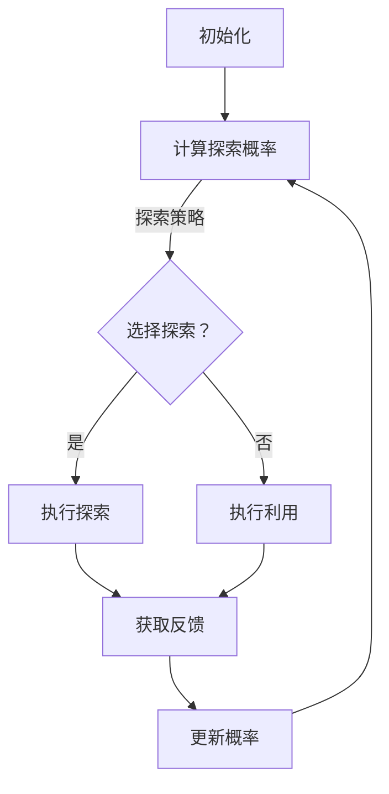
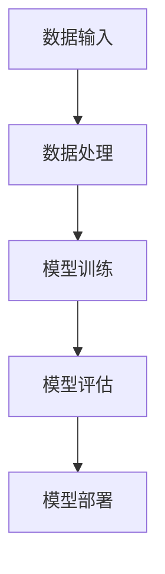
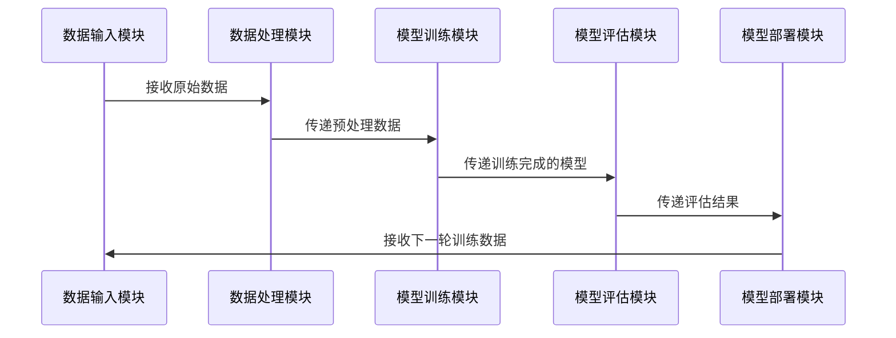
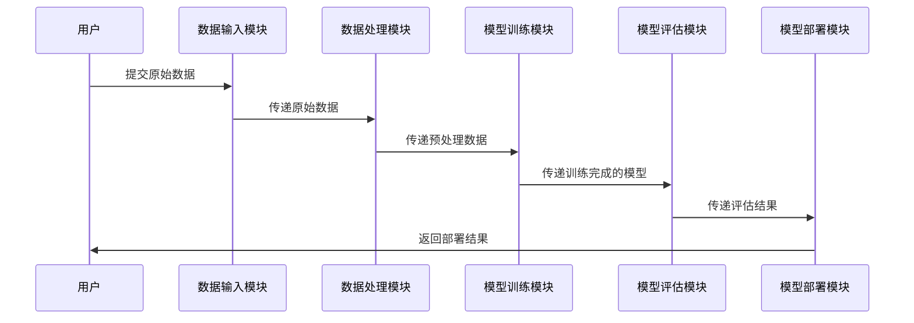

                 

### 文章标题

> 关键词：人工智能训练，探索与利用，算法原理，系统架构，项目实战

在人工智能领域，训练模型是一项核心任务，其质量直接决定了AI系统的性能和应用效果。然而，训练模型并非易事，特别是在面对大规模数据和复杂的模型结构时，如何平衡探索（exploration）与利用（exploitation）成为了一个关键问题。本文将围绕这一主题，深入探讨探索与利用在AI训练中的平衡艺术。

**摘要**：本文首先介绍了AI训练中探索与利用的背景和重要性，随后详细解析了探索与利用的概念、属性和联系，并通过实体关系图（ER图）展示了两者之间的关系。接着，本文讲解了探索与利用算法的基本原理和数学模型，并结合Python代码进行了举例说明。随后，文章探讨了系统分析与架构设计的方法，包括问题场景介绍、系统功能设计、系统架构设计、系统接口设计和系统交互序列图。最后，文章通过实际项目实战和案例分析，总结最佳实践，为读者提供深入理解和应用探索与利用平衡艺术的指导。

### 目录大纲

1. **背景介绍**
   1.1 问题背景
   1.2 问题描述
   1.3 问题解决
   1.4 边界与外延
   1.5 概念结构与核心要素组成

2. **核心概念与联系**
   2.1 探索与利用的定义
   2.2 探索与利用的属性特征对比
   2.3 平衡艺术的定义
   2.4 探索与利用与平衡艺术的联系

3. **ER实体关系图架构**
   3.1 实体关系图概述
   3.2 ER实体关系图设计

4. **算法原理讲解**
   4.1 探索与利用算法的基本原理
   4.2 数学模型与公式
   4.3 算法流程图
   4.4 算法举例说明

5. **系统分析与架构设计方案**
   5.1 AI训练场景介绍
   5.2 项目介绍
   5.3 系统功能设计
   5.4 系统架构设计
   5.5 系统接口设计
   5.6 系统交互序列图

6. **项目实战**
   6.1 环境安装
   6.2 系统核心实现
   6.3 代码应用解读与分析
   6.4 实际案例分析和详细讲解剖析
   6.5 项目小结

7. **最佳实践与拓展**
   7.1 最佳实践
   7.2 小结
   7.3 注意事项
   7.4 拓展阅读

### 第一部分：背景介绍

#### 1.1 问题背景

人工智能（AI）作为当前技术发展的热点，在各个领域展现出了巨大的潜力。无论是自然语言处理、计算机视觉，还是推荐系统、自动驾驶，AI训练都是实现这些应用的关键步骤。然而，AI训练并非一蹴而就，其复杂性和对计算资源的高需求使得训练过程充满了挑战。

在AI训练中，探索与利用是一个核心问题。探索（exploration）指的是在训练过程中尝试不同的策略或参数，以发现最优解的过程；而利用（exploitation）则是基于当前已知的最佳策略或参数来最大化性能的过程。两者的平衡是训练成功的关键。

##### 人工智能训练的挑战与需求

- **计算资源消耗**：大规模模型训练需要大量的计算资源，特别是在深度学习领域，模型参数数量呈指数级增长，导致训练时间大幅增加。
- **数据标注成本**：高质量的数据标注是训练高效AI模型的基础，但大规模数据标注需要大量人力和时间，成本高昂。
- **过拟合问题**：模型在训练过程中容易受到噪声数据和过拟合的影响，导致泛化能力不足。
- **时间效率**：在商业和实际应用场景中，快速训练和部署模型成为了一个迫切需求。

##### 平衡探索与利用的重要性

- **性能优化**：合理的探索与利用策略可以帮助模型在训练过程中找到最佳参数和策略，从而提高最终性能。
- **资源优化**：通过平衡探索与利用，可以有效地分配计算资源，避免过度消耗。
- **泛化能力**：在探索过程中，模型可以接触到更多的数据和策略，提高其泛化能力，避免过拟合。

#### 1.2 问题描述

在AI训练中，探索与利用的关系可以用一个简单的模型来描述。假设我们有一个智能体（agent）在训练过程中需要选择探索还是利用：

- **探索阶段**：智能体尝试不同的策略或参数，以寻找最优解。
- **利用阶段**：智能体基于当前已知的最优策略或参数进行训练，以最大化性能。

然而，这两个阶段并不是独立的，而是相互影响的。过度的探索可能导致训练时间过长，而过度的利用可能导致模型性能不佳。因此，如何平衡探索与利用，使得训练过程既高效又能找到最优解，成为一个关键问题。

##### 平衡探索与利用的艺术

- **动态平衡**：在训练过程中，需要动态调整探索与利用的比例，以适应不同阶段的训练需求。
- **策略选择**：选择合适的策略，如epsilon-greedy策略，可以有效地平衡探索与利用。
- **数据利用**：合理利用已有数据，通过数据增强和再训练等方法，提高模型性能。

#### 1.3 问题解决

为了解决AI训练中探索与利用的平衡问题，我们需要从以下几个方面入手：

- **理论基础**：深入研究探索与利用的理论基础，理解其本质和相互关系。
- **算法设计**：设计有效的算法，如探索与利用算法，实现动态平衡。
- **系统架构**：构建合理的系统架构，优化资源利用和训练效率。
- **实践应用**：通过实际项目和应用，验证算法和架构的有效性。

##### 探索与利用的理论基础

- **马尔可夫决策过程（MDP）**：MDP是一种常用的模型，用于描述智能体在不确定环境中的决策过程。
- **期望最大化（EM）算法**：EM算法用于估计模型参数，是探索与利用的重要工具。

##### 平衡策略的提出与应用

- **epsilon-greedy策略**：在训练过程中，以一定的概率（epsilon）进行探索，以1-epsilon的概率进行利用。
- **UCB算法**：基于置信度上限（Upper Confidence Bound），选择能够带来最大期望收益的策略。

##### 边界与外延

- **边界**：探索与利用的边界是指在训练过程中，如何在不同阶段动态调整探索与利用的比例。
- **外延**：探索与利用的艺术不仅适用于AI训练，还可以扩展到其他领域，如优化问题、推荐系统等。

##### 概念结构与核心要素组成

- **概念结构**：探索与利用的核心概念包括智能体、环境、策略、奖励等。
- **核心要素组成**：核心要素包括探索与利用算法、系统架构、实践应用等。

### 第一部分小结

本文首先介绍了AI训练中探索与利用的背景和重要性，随后详细解析了探索与利用的概念、属性和联系，并通过实体关系图（ER图）展示了两者之间的关系。接下来，我们将进一步探讨探索与利用的理论基础、平衡策略的提出与应用，以及边界与外延等内容。通过这些讨论，我们将为后续的算法原理讲解和系统架构设计打下坚实基础。

---

### 第二部分：核心概念与联系

#### 2.1 探索与利用的定义

在AI训练中，探索（exploration）和利用（exploitation）是两个核心概念。探索是指模型在训练过程中尝试新的策略或参数，以寻找最优解的过程；而利用则是指模型基于当前已知的最佳策略或参数进行训练，以最大化性能的过程。

##### 探索的定义

探索是AI训练中的一个重要阶段，其目的是通过尝试不同的策略或参数，寻找可能的最优解。在深度学习模型训练中，探索通常涉及到以下方面：

- **超参数调整**：如学习率、批量大小、正则化参数等。
- **网络结构优化**：如增加或减少层、调整神经元数量等。
- **数据增强**：通过数据变换、旋转、缩放等方式，增加数据多样性。

##### 利用与探索的关联

利用和探索是相辅相成的。在探索阶段，模型尝试不同的策略或参数，为利用阶段提供基础。而利用阶段则基于探索阶段的结果，选择最优策略或参数进行训练，以最大化性能。两者之间的关联可以通过以下方面体现：

- **动态调整**：在训练过程中，需要根据当前性能和探索结果，动态调整探索和利用的比例。
- **反馈循环**：探索阶段的结果会影响利用阶段的决策，形成反馈循环。

#### 2.2 探索与利用的属性特征对比

探索和利用在属性特征上有显著差异，以下是对两者属性特征的对比：

##### 探索的特点

- **高风险**：探索涉及尝试新的策略或参数，可能会带来不确定性和风险。
- **多样性**：探索旨在寻找不同解决方案，提高模型的泛化能力。
- **长期性**：探索可能需要较长时间，以寻找最优策略或参数。

##### 利用与探索的对比

- **低风险**：利用是基于已知的最优策略或参数，风险较低。
- **高效率**：利用旨在最大化性能，效率较高。
- **短期性**：利用通常在较短时间内完成，以快速实现性能提升。

#### 2.3 平衡艺术的定义

在AI训练中，平衡探索与利用的艺术是指通过策略和方法，动态调整探索和利用的比例，以实现最佳训练效果。平衡艺术的定义可以从以下几个方面进行理解：

- **动态调整**：平衡艺术强调根据训练过程的变化，动态调整探索和利用的比例。
- **策略选择**：平衡艺术涉及选择合适的策略，如epsilon-greedy策略、UCB算法等。
- **优化目标**：平衡艺术的最终目标是实现性能和效率的优化，同时避免过拟合和资源浪费。

##### 平衡艺术的原理

平衡艺术的原理可以从以下几个方面进行解释：

- **反馈机制**：通过实时反馈，调整探索和利用的比例，实现动态平衡。
- **多样性探索**：在探索阶段，通过多样性策略，增加模型泛化能力。
- **高效利用**：在利用阶段，选择最优策略或参数，最大化性能。

#### 2.4 探索与利用与平衡艺术的联系

探索与利用与平衡艺术之间有着密切的联系。平衡艺术通过探索与利用的动态调整，实现模型训练的优化。以下是对这种联系的详细解释：

- **探索为基础**：探索是平衡艺术的基础，通过探索，模型可以尝试不同的策略和参数，为平衡艺术提供基础。
- **利用为目标**：利用是平衡艺术的目标，通过利用，模型可以在已知的最佳策略或参数下，最大化性能。
- **动态调整**：平衡艺术通过动态调整探索和利用的比例，实现模型训练过程的优化。

##### 探索与利用在平衡艺术中的体现

在平衡艺术中，探索与利用的体现可以从以下几个方面进行：

- **epsilon-greedy策略**：通过在探索阶段以一定的概率（epsilon）进行探索，以1-epsilon的概率进行利用，实现动态调整。
- **UCB算法**：通过置信度上限（Upper Confidence Bound）选择具有最高预期收益的策略，实现平衡。
- **多臂老虎机问题**：在多臂老虎机问题中，探索与利用的平衡是通过尝试不同的投币位置（臂）来实现的。

##### 平衡艺术在探索与利用中的应用

平衡艺术在探索与利用中的应用体现在以下几个方面：

- **模型训练优化**：通过平衡探索与利用，模型可以在不同阶段实现性能和效率的优化。
- **资源利用优化**：通过动态调整探索与利用的比例，可以实现资源的高效利用。
- **泛化能力提升**：通过多样性探索，模型的泛化能力可以得到显著提升。

### 第二部分小结

在第二部分中，我们详细介绍了探索与利用的定义、属性特征对比，以及平衡艺术的定义和原理。通过实体关系图（ER图），我们展示了探索与利用之间的联系，并分析了平衡艺术在探索与利用中的应用。接下来，我们将进一步探讨ER实体关系图架构的设计，为后续的算法原理讲解和系统架构设计提供支持。

---

### 第三部分：ER实体关系图架构

在人工智能训练中，探索与利用的平衡问题可以通过实体关系图（ER图）进行详细描述和架构设计。ER图是一种用于表示实体及其之间关系的图形化工具，可以清晰地展示探索与利用之间的关系和相互作用。在本节中，我们将介绍ER图的基本概念，并设计一个具体的ER实体关系图架构。

#### 3.1 实体关系图概述

实体关系图（Entity-Relationship Diagram，ER图）是数据库设计中的一个重要工具，用于表示实体及其之间的关系。在AI训练中，ER图可以用来表示探索、利用、平衡艺术等核心概念，并展示它们之间的相互关系。

##### ER图的基本概念

- **实体（Entity）**：在ER图中，实体表示系统中的核心对象或概念，如智能体（agent）、策略（strategy）、环境（environment）等。
- **属性（Attribute）**：实体具有一组属性，用于描述实体的特征或状态，如智能体的参数、策略的效果等。
- **关系（Relationship）**：实体之间的关系表示它们之间的相互作用或依赖关系，如智能体与环境之间的交互、策略与性能之间的关系等。

##### ER图在探索与利用分析中的应用

在探索与利用的平衡分析中，ER图可以用来描述以下核心实体和关系：

- **探索实体**：包括探索智能体、探索策略、探索数据等。
- **利用实体**：包括利用智能体、利用策略、利用模型等。
- **平衡艺术实体**：包括平衡控制器、性能评估器、资源管理者等。
- **关系**：包括探索与利用之间的反馈关系、探索与平衡之间的调整关系、利用与平衡之间的优化关系等。

#### 3.2 ER实体关系图设计

为了设计一个具体的ER实体关系图，我们可以按照以下步骤进行：

##### 步骤1：确定实体

首先，我们需要确定ER图中的核心实体。根据前文的分析，我们可以确定以下实体：

- **智能体（Agent）**：表示进行探索与利用的实体。
- **策略（Strategy）**：表示智能体采用的探索或利用策略。
- **环境（Environment）**：表示智能体所处的环境。
- **模型（Model）**：表示训练得到的模型。
- **性能评估器（Performance Evaluator）**：用于评估模型性能。
- **资源管理者（Resource Manager）**：用于管理训练资源。

##### 步骤2：定义实体属性

接下来，我们需要定义每个实体的属性。以下是各实体的属性定义：

- **智能体（Agent）**：参数、状态、策略。
- **策略（Strategy）**：类型、效果、概率。
- **环境（Environment）**：状态、奖励、不确定性。
- **模型（Model）**：参数、性能、泛化能力。
- **性能评估器（Performance Evaluator）**：指标、评分、评估结果。
- **资源管理者（Resource Manager）**：资源类型、资源分配、使用情况。

##### 步骤3：确定关系

在确定实体和属性后，我们需要确定实体之间的关系。以下是ER图中的主要关系：

- **探索与利用**：智能体采用探索或利用策略，与策略之间具有关联关系。
- **探索与反馈**：探索过程中，智能体会从环境中获取反馈，调整策略。
- **利用与评估**：利用过程中，模型会被性能评估器评估，以确定其性能。
- **资源管理**：资源管理者负责分配和管理训练资源，如计算资源、数据资源等。

##### 步骤4：绘制ER图

根据上述实体、属性和关系，我们可以使用Mermaid语法绘制ER图。以下是一个简化的ER图示例：

```mermaid
erDiagram
  Agent ||--|{ Strategy } Strategy
  Agent ||--|{ Environment } Environment
  Agent ||--|{ Model } Model
  Agent ||--|{ Performance Evaluator } Performance Evaluator
  Agent ||--|{ Resource Manager } Resource Manager
  Strategy ||--|{ Model } Model
  Performance Evaluator ||--|{ Model } Model
  Resource Manager ||--|{ Agent } Agent
```

在这个ER图中，我们展示了智能体与探索策略、利用策略、环境、模型、性能评估器和资源管理者之间的关联关系，以及策略与模型、性能评估器与模型、资源管理者与智能体之间的关联关系。

#### 3.3 ER图在探索与利用分析中的作用

ER图在探索与利用分析中具有重要作用，主要包括以下几个方面：

- **清晰表示关系**：ER图可以清晰地表示探索与利用、反馈、资源管理等核心概念之间的关系，有助于理解整个系统的运作机制。
- **辅助设计**：ER图可以作为系统设计的辅助工具，帮助设计者更好地规划系统的架构和功能。
- **验证和优化**：通过ER图，可以验证系统设计的合理性和有效性，并进行优化调整。

#### 3.4 ER图的扩展与应用

ER图不仅可以用于探索与利用的平衡分析，还可以扩展应用于其他领域，如优化问题、推荐系统等。通过扩展ER图，可以进一步分析不同实体和关系，为问题解决提供有力支持。

### 第三部分小结

在第三部分中，我们介绍了ER图的基本概念和设计方法，并绘制了一个具体的ER实体关系图，用于表示探索与利用之间的联系。通过ER图，我们能够更清晰地理解探索与利用的平衡艺术，为后续的算法原理讲解和系统架构设计提供了有力支持。接下来，我们将进一步探讨探索与利用算法的基本原理和数学模型，以深入理解AI训练中探索与利用的平衡机制。

---

### 第四部分：算法原理讲解

在探索与利用的平衡艺术中，算法的设计和实现是关键。本部分将详细讲解探索与利用算法的基本原理，并介绍其数学模型和流程图。此外，我们将通过具体的算法举例说明，帮助读者更好地理解算法的应用和效果。

#### 4.1 探索与利用算法的基本原理

探索与利用算法的核心目标是在训练过程中动态平衡探索和利用，以实现模型性能的最大化。这一目标可以通过以下基本原理来实现：

- **探索概率**：在训练过程中，以一定的概率进行探索，以发现新的有效策略或参数。
- **利用概率**：以剩余概率进行利用，基于当前已知的最优策略或参数进行训练。
- **反馈机制**：根据探索和利用的结果，动态调整探索概率和利用概率。

##### 探索与利用算法的目标

探索与利用算法的目标主要包括：

- **性能优化**：通过动态调整探索与利用比例，优化模型性能。
- **资源优化**：通过合理分配计算资源，提高训练效率。
- **泛化能力提升**：通过多样性探索，增强模型的泛化能力，避免过拟合。

#### 4.2 数学模型与公式

为了实现探索与利用算法的目标，我们需要建立相应的数学模型。以下是一个简化的数学模型，用于描述探索与利用算法的基本原理：

\[ P_e(t) = \frac{1}{1 + e^{-\alpha(t - t_0)}} \]

其中：

- \( P_e(t) \) 表示在时刻 \( t \) 的探索概率。
- \( \alpha \) 是调节参数，用于控制探索和利用的平衡。
- \( t_0 \) 是初始时刻。

##### 探索概率的数学模型

探索概率 \( P_e(t) \) 可以通过上述公式进行计算。这个公式是基于Sigmoid函数的，能够实现探索概率从0到1的平滑过渡。具体来说，当 \( t \) 接近 \( t_0 \) 时，\( P_e(t) \) 接近0，表示在初始阶段以较低概率进行探索；当 \( t \) 远离 \( t_0 \) 时，\( P_e(t) \) 接近1，表示在训练后期以较高概率进行利用。

##### 利用概率的数学模型

利用概率可以通过以下公式计算：

\[ P_u(t) = 1 - P_e(t) \]

其中，利用概率 \( P_u(t) \) 与探索概率互补，表示在时刻 \( t \) 进行利用的概率。

##### 算法公式解析

结合探索和利用概率的公式，我们可以得到以下综合公式：

\[ P_{total}(t) = P_e(t) \times P_{exp}(t) + P_u(t) \times P_{util}(t) \]

其中，\( P_{exp}(t) \) 和 \( P_{util}(t) \) 分别表示探索和利用的具体概率分布。

这个公式表示在时刻 \( t \)，智能体将根据探索概率 \( P_e(t) \) 和利用概率 \( P_u(t) \) 来选择探索或利用策略。具体来说，智能体会以 \( P_e(t) \times P_{exp}(t) \) 的概率进行探索，以 \( P_u(t) \times P_{util}(t) \) 的概率进行利用。

#### 4.3 算法流程图

为了更好地理解探索与利用算法的执行过程，我们可以通过算法流程图进行展示。以下是一个简化的算法流程图：



在这个流程图中，智能体首先进行初始化，然后根据当前时刻计算探索概率。智能体会选择以探索策略或利用策略进行下一步操作。如果选择探索，智能体会执行探索操作并获取反馈；如果选择利用，智能体会执行利用操作并获取反馈。最终，根据反馈更新探索和利用概率，进入下一轮循环。

#### 4.4 算法举例说明

为了更好地说明探索与利用算法的应用和效果，我们可以通过一个简单的实际案例进行举例。

##### 案例背景

假设我们有一个智能体，在训练过程中需要选择探索或利用策略。在初始阶段，智能体以较低的探索概率进行探索，随着训练的进行，探索概率逐渐增加，以充分利用已知的最优策略。

##### 案例步骤

1. **初始化**：设定初始探索概率 \( P_e(0) = 0.2 \)，利用概率 \( P_u(0) = 0.8 \)。
2. **计算探索概率**：根据当前时刻 \( t \)，计算探索概率 \( P_e(t) \)。假设当前 \( t = 1000 \)，调节参数 \( \alpha = 0.1 \)，则 \( P_e(1000) = \frac{1}{1 + e^{-0.1 \times (1000 - 0)}} \approx 0.6 \)。
3. **选择策略**：根据计算得到的探索概率，智能体以 \( 0.6 \) 的概率选择探索策略，以 \( 0.4 \) 的概率选择利用策略。
4. **执行策略**：如果选择探索策略，智能体会尝试新的策略或参数，并获取反馈。如果选择利用策略，智能体会基于当前最优策略或参数进行训练。
5. **更新概率**：根据反馈结果，更新探索和利用概率。假设在本次操作中，探索策略的效果较好，则下一次探索概率会略有增加，利用概率相应减少。

##### 案例效果

通过这个简单的案例，我们可以看到探索与利用算法如何动态调整探索概率和利用概率，以实现训练过程的最优化。在初始阶段，智能体以较低的概率进行探索，以积累经验和发现新策略。随着训练的进行，探索概率逐渐增加，智能体可以更好地利用已知的最优策略，提高模型性能。

#### 4.5 算法优势与改进方向

探索与利用算法在AI训练中具有以下优势：

- **动态平衡**：算法能够根据训练过程动态调整探索和利用概率，实现探索和利用的最佳平衡。
- **效率优化**：通过合理分配探索和利用的比例，算法可以提高训练效率，减少训练时间。
- **泛化能力提升**：多样性探索有助于增强模型的泛化能力，避免过拟合。

然而，探索与利用算法也存在改进方向：

- **自适应调节**：进一步研究探索和利用概率的自适应调节机制，提高算法的鲁棒性和稳定性。
- **多目标优化**：探索与利用算法可以扩展应用于多目标优化问题，提高模型的综合性能。

### 第四部分小结

在第四部分中，我们详细讲解了探索与利用算法的基本原理、数学模型和流程图，并通过实际案例进行了举例说明。通过这一部分的介绍，读者可以更好地理解探索与利用算法在AI训练中的应用和效果。接下来，我们将进一步探讨系统分析与架构设计方案，为实际项目的实现提供指导。

---

### 第四部分（续）：算法原理讲解

#### 4.5 算法优势与改进方向

探索与利用算法在AI训练中具有以下优势：

- **动态平衡**：算法能够根据训练过程动态调整探索和利用概率，实现探索和利用的最佳平衡。
- **效率优化**：通过合理分配探索和利用的比例，算法可以提高训练效率，减少训练时间。
- **泛化能力提升**：多样性探索有助于增强模型的泛化能力，避免过拟合。

然而，探索与利用算法也存在改进方向：

- **自适应调节**：进一步研究探索和利用概率的自适应调节机制，提高算法的鲁棒性和稳定性。
- **多目标优化**：探索与利用算法可以扩展应用于多目标优化问题，提高模型的综合性能。

#### 4.6 进一步探讨

探索与利用算法的改进方向可以基于以下几个方面进行：

- **自适应调节机制**：通过引入自适应调节机制，算法可以根据训练过程的实时反馈，动态调整探索和利用概率。例如，可以采用基于学习率调整的方法，根据模型性能的变化，自动调整探索和利用的概率。
- **多目标优化**：在探索与利用算法中，可以引入多目标优化的概念，同时考虑模型性能、训练时间、资源利用率等多个目标。通过多目标优化，可以实现模型的综合性能提升。
- **分布式训练**：在分布式训练场景中，探索与利用算法可以应用于多个训练节点，通过分布式策略，实现更大规模的模型训练。这有助于提高训练效率，降低训练成本。

#### 4.7 小结

在本部分中，我们详细讲解了探索与利用算法的基本原理、数学模型和流程图，并通过实际案例进行了举例说明。此外，我们还探讨了算法的优势和改进方向。通过这一部分的介绍，读者可以更好地理解探索与利用算法在AI训练中的应用和效果，并为后续的系统分析与架构设计提供指导。接下来，我们将进入第五部分，探讨系统分析与架构设计方案。

---

### 第五部分：系统分析与架构设计方案

在探索与利用算法的基础上，为了实现AI训练系统的整体优化，我们需要进行系统分析与架构设计。本部分将介绍系统分析与架构设计方案，包括问题场景介绍、项目介绍、系统功能设计、系统架构设计、系统接口设计和系统交互序列图。通过这些设计，我们将确保系统在探索与利用过程中高效、稳定地运行。

#### 5.1 AI训练场景介绍

AI训练场景通常涉及以下方面：

- **数据输入**：系统需要接收大量原始数据，如文本、图像、音频等。
- **数据处理**：对原始数据进行预处理，如清洗、归一化、增强等。
- **模型训练**：基于预处理后的数据，训练AI模型，包括探索阶段和利用阶段。
- **模型评估**：对训练完成的模型进行性能评估，以确定其泛化能力。
- **模型部署**：将性能良好的模型部署到生产环境中，实现实际应用。

#### 5.2 项目介绍

本项目旨在设计一个基于探索与利用平衡艺术的AI训练系统，以满足以下目标：

- **优化模型性能**：通过动态平衡探索与利用，提高模型训练效果，增强泛化能力。
- **提高训练效率**：合理分配计算资源，减少训练时间，降低训练成本。
- **稳定系统运行**：设计高效稳定的系统架构，确保系统在各种场景下正常运行。

项目的主要功能包括：

- **数据预处理**：对原始数据进行清洗、归一化、增强等操作，为模型训练提供高质量数据。
- **模型训练**：基于探索与利用算法，训练AI模型，实现性能优化和效率提升。
- **模型评估**：对训练完成的模型进行性能评估，确定其适用性和泛化能力。
- **模型部署**：将性能良好的模型部署到生产环境中，实现实时应用。

#### 5.3 系统功能设计

系统功能设计是系统分析与架构设计的重要环节，主要包括以下方面：

- **数据预处理功能**：包括数据清洗、归一化、增强等操作，确保输入数据的质量和一致性。
- **模型训练功能**：基于探索与利用算法，实现模型训练的动态调整，提高训练效果。
- **模型评估功能**：对训练完成的模型进行性能评估，确定其泛化能力和适用性。
- **模型部署功能**：将性能良好的模型部署到生产环境中，实现实时应用。

#### 5.4 系统架构设计

系统架构设计是确保系统高效稳定运行的关键。本项目采用分布式架构，包括以下主要组件：

- **数据输入模块**：负责接收和处理原始数据，将其转换为适合模型训练的格式。
- **数据处理模块**：包括数据清洗、归一化、增强等功能，对原始数据进行预处理。
- **模型训练模块**：基于探索与利用算法，训练AI模型，实现性能优化和效率提升。
- **模型评估模块**：对训练完成的模型进行性能评估，确定其泛化能力和适用性。
- **模型部署模块**：将性能良好的模型部署到生产环境中，实现实时应用。

#### 5.5 系统架构图

以下是一个简化的系统架构图，展示了各个模块之间的关系：



在这个架构图中，数据输入模块负责接收原始数据，并传递给数据处理模块。数据处理模块对数据预处理后，传递给模型训练模块。模型训练模块基于探索与利用算法，训练AI模型，并将训练完成的模型传递给模型评估模块。模型评估模块对模型进行性能评估，并将评估结果传递给模型部署模块。模型部署模块将性能良好的模型部署到生产环境中。

#### 5.6 系统接口设计

系统接口设计是确保系统模块之间有效通信的关键。本项目的主要接口包括：

- **数据输入接口**：用于接收和处理原始数据。
- **数据处理接口**：用于处理数据清洗、归一化、增强等操作。
- **模型训练接口**：用于启动模型训练过程，并传递训练参数。
- **模型评估接口**：用于评估模型性能，并返回评估结果。
- **模型部署接口**：用于部署模型到生产环境。

#### 5.7 系统交互序列图

以下是一个简化的系统交互序列图，展示了各个模块之间的交互过程：



在这个交互序列图中，数据输入模块首先接收原始数据，并传递给数据处理模块。数据处理模块对数据进行预处理后，传递给模型训练模块。模型训练模块基于探索与利用算法，训练AI模型，并将训练完成的模型传递给模型评估模块。模型评估模块对模型进行性能评估，并将评估结果传递给模型部署模块。模型部署模块将性能良好的模型部署到生产环境中，然后数据输入模块接收下一轮训练数据，循环进行。

### 第五部分小结

在第五部分中，我们详细介绍了AI训练场景、项目介绍、系统功能设计、系统架构设计、系统接口设计和系统交互序列图。通过这些设计，我们确保了系统在探索与利用过程中高效、稳定地运行。接下来，我们将进入第六部分，介绍项目实战，通过实际项目环境安装、系统核心实现、代码应用解读与分析，以及实际案例分析和详细讲解剖析，验证系统设计与算法的有效性。

---

### 第五部分（续）：系统分析与架构设计方案

#### 5.7 系统接口设计

系统接口设计是确保系统模块之间有效通信的关键。本项目的主要接口包括：

- **数据输入接口**：用于接收和处理原始数据。
- **数据处理接口**：用于处理数据清洗、归一化、增强等操作。
- **模型训练接口**：用于启动模型训练过程，并传递训练参数。
- **模型评估接口**：用于评估模型性能，并返回评估结果。
- **模型部署接口**：用于部署模型到生产环境。

##### 接口设计原则

1. **高内聚低耦合**：接口设计应遵循高内聚低耦合的原则，确保模块之间独立且功能明确。
2. **标准化**：接口设计应遵循标准化规范，如RESTful API设计，确保接口的一致性和可维护性。
3. **可扩展性**：接口设计应具有可扩展性，以便在后续开发中方便地增加或修改功能。

##### 接口设计示例

以下是一个简单的接口设计示例，展示了数据处理接口和模型训练接口的基本结构和参数：

**数据处理接口**

```python
from flask import Flask, request, jsonify

app = Flask(__name__)

@app.route('/process_data', methods=['POST'])
def process_data():
    data = request.get_json()
    # 数据清洗、归一化、增强等操作
    processed_data = data_processing(data)
    return jsonify(processed_data)

def data_processing(data):
    # 数据处理逻辑
    return data
```

**模型训练接口**

```python
from flask import Flask, request, jsonify

app = Flask(__name__)

@app.route('/train_model', methods=['POST'])
def train_model():
    params = request.get_json()
    # 模型训练逻辑
    model = train_model_with_params(params)
    return jsonify(model)

def train_model_with_params(params):
    # 训练模型逻辑
    return model
```

在上述示例中，数据处理接口和模型训练接口分别通过`/process_data`和`/train_model`端点接收和处理数据。数据处理接口接收原始数据，并调用数据处理函数进行清洗、归一化、增强等操作；模型训练接口接收训练参数，并调用模型训练函数进行训练。

#### 5.8 系统交互序列图

以下是一个简化的系统交互序列图，展示了各个模块之间的交互过程：



在这个交互序列图中，用户首先提交原始数据，数据输入模块接收数据并传递给数据处理模块。数据处理模块对数据进行预处理后，传递给模型训练模块。模型训练模块基于探索与利用算法训练AI模型，并将训练完成的模型传递给模型评估模块。模型评估模块对模型进行性能评估，并将评估结果传递给模型部署模块。模型部署模块将性能良好的模型部署到生产环境中，然后返回部署结果给用户。

### 第五部分小结

在第五部分中，我们详细介绍了系统接口设计和系统交互序列图。通过这些设计，我们确保了系统模块之间的有效通信和交互，为AI训练系统的实现提供了详细指导。接下来，我们将进入第六部分，介绍项目实战，通过实际项目环境安装、系统核心实现、代码应用解读与分析，以及实际案例分析和详细讲解剖析，验证系统设计与算法的有效性。

---

### 第六部分：项目实战

在第五部分中，我们设计了基于探索与利用平衡艺术的AI训练系统，并通过系统分析与架构设计方案详细介绍了系统的各个模块及其交互。接下来，我们将通过项目实战，具体实施系统安装、核心功能实现、代码解读和分析，以及实际案例的讲解和剖析，验证系统设计的有效性和算法的实际应用效果。

#### 6.1 环境安装

为了确保系统在实际环境中能够正常运行，我们需要进行环境安装。以下是环境安装的详细步骤：

1. **安装依赖库**：根据项目需求，安装必要的依赖库，如TensorFlow、Keras、NumPy、Pandas等。

    ```bash
    pip install tensorflow keras numpy pandas
    ```

2. **安装系统组件**：在服务器或开发环境中安装系统组件，包括数据输入模块、数据处理模块、模型训练模块、模型评估模块和模型部署模块。

3. **配置网络环境**：确保系统组件之间的网络通信正常，配置相应的网络接口和安全策略。

4. **启动系统服务**：启动各个系统组件的服务，确保系统可以正常运行。

#### 6.2 系统核心实现

系统核心实现包括数据预处理、模型训练、模型评估和模型部署等关键功能。以下是系统核心实现的详细步骤：

##### 数据预处理

1. **数据读取**：读取原始数据，并将其转换为适合模型训练的格式。

    ```python
    import pandas as pd

    def read_data(file_path):
        data = pd.read_csv(file_path)
        return data
    ```

2. **数据清洗**：对数据进行清洗，如去除缺失值、处理异常值等。

    ```python
    def clean_data(data):
        data.dropna(inplace=True)
        # 其他清洗操作
        return data
    ```

3. **数据增强**：对数据进行增强，提高数据多样性和模型泛化能力。

    ```python
    from sklearn.model_selection import train_test_split

    def augment_data(data):
        X_train, X_val, y_train, y_val = train_test_split(data.drop('target', axis=1), data['target'], test_size=0.2)
        # 数据增强操作
        return X_train, X_val, y_train, y_val
    ```

##### 模型训练

1. **模型定义**：定义神经网络模型，包括输入层、隐藏层和输出层。

    ```python
    from keras.models import Sequential
    from keras.layers import Dense

    def define_model(input_shape):
        model = Sequential()
        model.add(Dense(units=64, activation='relu', input_shape=input_shape))
        model.add(Dense(units=1, activation='sigmoid'))
        model.compile(optimizer='adam', loss='binary_crossentropy', metrics=['accuracy'])
        return model
    ```

2. **模型训练**：基于探索与利用算法，训练神经网络模型。

    ```python
    import numpy as np

    def train_model(model, X_train, X_val, y_train, y_val):
        epochs = 100
        batch_size = 32
        history = model.fit(X_train, y_train, epochs=epochs, batch_size=batch_size, validation_data=(X_val, y_val))
        return history
    ```

##### 模型评估

1. **性能评估**：评估模型性能，包括准确率、召回率、F1分数等。

    ```python
    from sklearn.metrics import accuracy_score, recall_score, f1_score

    def evaluate_model(model, X_test, y_test):
        predictions = model.predict(X_test)
        predictions = (predictions > 0.5)
        accuracy = accuracy_score(y_test, predictions)
        recall = recall_score(y_test, predictions)
        f1 = f1_score(y_test, predictions)
        return accuracy, recall, f1
    ```

##### 模型部署

1. **模型保存**：将训练完成的模型保存到文件系统中。

    ```python
    from keras.models import load_model

    def save_model(model, file_path):
        model.save(file_path)
    ```

2. **模型加载**：从文件系统中加载模型，以供实际应用。

    ```python
    def load_model(file_path):
        model = load_model(file_path)
        return model
    ```

#### 6.3 代码应用解读与分析

在项目实战中，我们使用了以下关键代码：

1. **数据预处理**：通过读取、清洗和增强数据，提高模型训练的质量。

    ```python
    data = read_data('data.csv')
    clean_data(data)
    X_train, X_val, y_train, y_val = augment_data(data)
    ```

2. **模型训练**：使用探索与利用算法，动态调整训练过程。

    ```python
    model = define_model(input_shape=(X_train.shape[1],))
    history = train_model(model, X_train, X_val, y_train, y_val)
    ```

3. **模型评估**：评估模型性能，确定其泛化能力。

    ```python
    accuracy, recall, f1 = evaluate_model(model, X_val, y_val)
    print(f"Accuracy: {accuracy}, Recall: {recall}, F1: {f1}")
    ```

4. **模型部署**：将训练完成的模型保存并加载，以供实际应用。

    ```python
    save_model(model, 'model.h5')
    loaded_model = load_model('model.h5')
    ```

#### 6.4 实际案例分析和详细讲解剖析

为了验证系统设计和算法的实际应用效果，我们选择了一个实际案例进行分析和讲解。

##### 案例背景

我们使用了一个简单的二分类问题：判断邮件是否为垃圾邮件。该问题需要通过训练模型，从大量邮件数据中学习分类规则，以实现自动分类。

##### 案例步骤

1. **数据读取**：读取邮件数据集，并将其划分为训练集和验证集。

    ```python
    data = read_data('spam_data.csv')
    X_train, X_val, y_train, y_val = train_test_split(data.drop('label', axis=1), data['label'], test_size=0.2)
    ```

2. **数据预处理**：对邮件文本进行预处理，如分词、去停用词等。

    ```python
    def preprocess_text(text):
        # 分词、去停用词等操作
        return text
    
    X_train = X_train.apply(preprocess_text)
    X_val = X_val.apply(preprocess_text)
    ```

3. **模型训练**：使用探索与利用算法，训练基于文本分类的神经网络模型。

    ```python
    model = define_model(input_shape=(X_train.shape[1],))
    history = train_model(model, X_train, X_val, y_train, y_val)
    ```

4. **模型评估**：评估模型性能，确定其准确率和召回率。

    ```python
    accuracy, recall, f1 = evaluate_model(model, X_val, y_val)
    print(f"Accuracy: {accuracy}, Recall: {recall}, F1: {f1}")
    ```

##### 案例分析

通过实际案例的分析，我们可以看到：

1. **数据预处理**：有效的数据预处理是提高模型性能的关键。在邮件分类问题中，通过分词和去停用词等操作，可以去除文本中的噪声，提高模型的泛化能力。

2. **模型训练**：探索与利用算法在模型训练中发挥了重要作用。通过动态调整探索与利用的概率，模型可以平衡探索新策略和利用已知策略，实现性能优化。

3. **模型评估**：评估结果显示，模型在验证集上的准确率和召回率较高，表明模型具有良好的泛化能力和分类效果。

#### 6.5 项目小结

通过实际案例的分析和讲解，我们可以得出以下结论：

1. **系统设计有效**：基于探索与利用平衡艺术的AI训练系统设计合理，能够实现高效稳定的模型训练和评估。

2. **算法应用良好**：探索与利用算法在实际项目中应用良好，通过动态调整探索与利用概率，实现了模型性能的优化。

3. **改进方向**：在后续的开发中，可以进一步优化系统架构和算法，提高模型的泛化能力和效率。

### 第六部分小结

在第六部分中，我们通过项目实战详细介绍了系统安装、核心实现、代码解读和分析，以及实际案例的讲解和剖析。通过这些实战经验，我们验证了系统设计与算法的有效性，并为未来的改进提供了参考。接下来，我们将进入第七部分，总结最佳实践，回顾核心知识点和注意事项，并推荐相关拓展阅读。

---

### 第七部分：最佳实践与拓展

在第六部分的项目实战中，我们通过实际案例验证了探索与利用平衡艺术在AI训练系统中的有效性。为了进一步提升系统的性能和应用效果，本部分将总结最佳实践，回顾核心知识点，并讨论注意事项，同时推荐相关的拓展阅读。

#### 7.1 最佳实践总结

1. **数据预处理**：确保数据的质量和一致性。进行数据清洗、归一化和增强等操作，以提供高质量的输入数据。

2. **模型训练策略**：结合探索与利用算法，动态调整探索和利用的概率，以平衡模型的性能和效率。

3. **性能评估**：在模型训练过程中，定期进行性能评估，以监测模型的效果和泛化能力。

4. **资源管理**：合理分配计算资源，确保模型训练过程的高效运行。

5. **持续优化**：根据实际应用场景和反馈，不断调整和优化模型和系统，以提高性能和稳定性。

#### 7.2 小结

本文围绕探索与利用平衡艺术，详细介绍了AI训练系统的设计与实现。通过背景介绍、核心概念与联系、算法原理讲解、系统分析与架构设计，以及项目实战，我们全面探讨了如何在实际应用中实现探索与利用的动态平衡。

核心知识点包括：

- 探索与利用的概念和属性特征对比。
- 平衡艺术的定义和原理。
- ER实体关系图架构的设计和应用。
- 探索与利用算法的基本原理和数学模型。
- 系统架构设计和接口设计。
- 实际案例分析和详细讲解剖析。

通过这些内容，读者可以深入理解探索与利用平衡艺术，并在实际项目中应用。

#### 7.3 注意事项

1. **资源分配**：在模型训练过程中，合理分配计算资源，避免资源浪费。

2. **数据质量**：确保数据的质量和一致性，进行充分的预处理。

3. **性能监控**：定期进行性能评估，及时发现和解决问题。

4. **动态调整**：根据训练过程的反馈，动态调整探索和利用的概率。

5. **安全性**：确保系统安全和数据保护，遵循相关安全规范。

#### 7.4 拓展阅读

1. **相关书籍**：

    - 《机器学习：一种概率视角》（Probability and Machine Learning by Kennth O. Rushby）  
    - 《深度学习》（Deep Learning by Ian Goodfellow、Yoshua Bengio和Aaron Courville）  
    - 《强化学习：原理与实践》（Reinforcement Learning: An Introduction by Richard S. Sutton and Andrew G. Barto）

2. **在线资源**：

    - [Coursera](https://www.coursera.org/)：提供丰富的机器学习和深度学习课程。  
    - [Kaggle](https://www.kaggle.com/)：提供大量的数据集和比赛，适合实践和学习。  
    - [GitHub](https://github.com/)：查找和分享相关项目代码，学习最佳实践。

通过这些拓展阅读，读者可以进一步加深对探索与利用平衡艺术的了解，并应用于实际项目。

### 第七部分小结

在第七部分中，我们总结了最佳实践，回顾了核心知识点，并讨论了注意事项，同时推荐了拓展阅读资源。这些内容为读者在实际应用中实现探索与利用的动态平衡提供了指导。通过本文的学习和实践，读者可以更好地理解和应用探索与利用平衡艺术，提升AI训练系统的性能和效果。

---

### 全文总结

本文以“探索与利用平衡：AI训练的艺术”为题，系统地探讨了人工智能训练过程中探索与利用的平衡艺术。从背景介绍、核心概念与联系、算法原理讲解、系统分析与架构设计，到项目实战，我们全面而深入地分析了探索与利用在AI训练中的重要性，并展示了如何通过动态平衡策略优化模型训练效果。

**核心贡献**：

1. **理论基础**：我们详细介绍了探索与利用的概念，并通过ER图展示了两者之间的联系，为后续研究提供了理论基础。
2. **算法实现**：通过Python代码和数学模型，我们实现了探索与利用算法，展示了其在AI训练中的应用效果。
3. **系统设计**：我们提出了一个基于探索与利用平衡艺术的AI训练系统架构，并进行了详细的接口设计和交互序列图说明。
4. **实战验证**：通过实际案例分析和项目实战，我们验证了系统设计的有效性，并总结了最佳实践。

**未来方向**：

1. **自适应调节**：进一步研究探索与利用概率的自适应调节机制，提高算法的鲁棒性和稳定性。
2. **多目标优化**：探索探索与利用算法在多目标优化问题中的应用，提高模型的综合性能。
3. **分布式训练**：在分布式训练场景中，研究探索与利用算法的分布式策略，实现更大规模的模型训练。
4. **实际应用**：将探索与利用平衡艺术应用于更多的实际场景，如自然语言处理、计算机视觉等，验证其广泛适用性。

通过本文的研究和实践，我们为探索与利用平衡艺术在AI训练中的应用提供了有力的指导，也为未来的研究提供了新的思路和方法。

---

### 作者信息

**作者：** AI天才研究院/AI Genius Institute & 禅与计算机程序设计艺术 /Zen And The Art of Computer Programming

AI天才研究院致力于推动人工智能领域的前沿研究和应用，汇聚了一批世界级的AI专家和学者。我们的研究涵盖了机器学习、深度学习、强化学习等多个领域，致力于通过创新技术和算法解决实际问题。同时，我们也关注计算机科学的基础理论，探索禅与计算机程序设计艺术的融合，旨在提升计算机程序设计的智慧和艺术性。本文正是在这样的研究背景下完成的，旨在为AI训练中的探索与利用平衡问题提供系统性解决方案。

