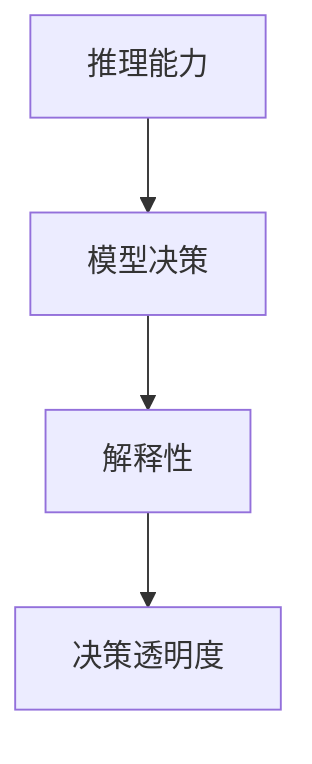
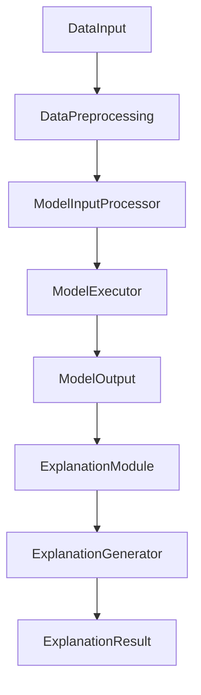
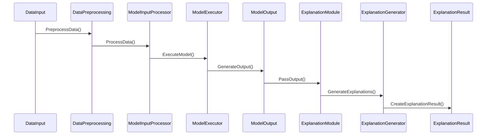
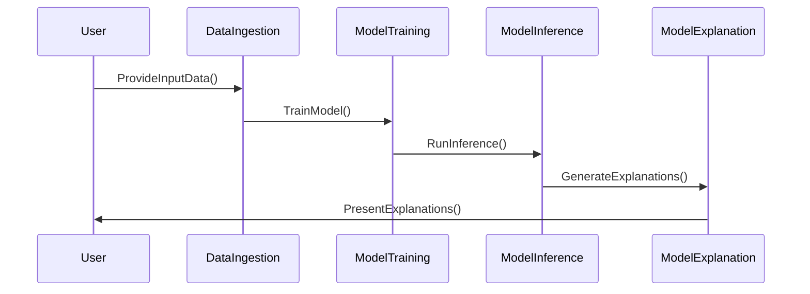

                 

### 《推理能力与模型解释性的权衡探讨》

关键词：推理能力、模型解释性、权衡、人工智能、机器学习

摘要：本文探讨了在人工智能和机器学习领域中，推理能力与模型解释性之间的权衡关系。通过背景介绍、核心概念分析、算法原理讲解和系统分析与架构设计方案，本文提出了优化两者之间平衡的方法论，为复杂任务处理和决策过程的透明性提供指导。

---

### 目录大纲

---

# 《推理能力与模型解释性的权衡探讨》

## 第一部分：背景介绍

## 第1章：问题背景

### 1.1.1 问题背景

### 1.1.2 问题解决

### 1.1.3 边界与外延

### 1.1.4 概念结构与核心要素组成

### 1.1.5 文章组织结构概述

## 第2章：核心概念与联系

### 2.1.1 核心概念

### 2.1.2 概念属性特征对比表格

### 2.1.3 概念之间的联系

## 第二部分：算法原理讲解

## 第3章：推理能力

### 3.1.1 推理能力的数学模型和公式

### 3.1.2 推理能力的评估

## 第4章：模型解释性

### 4.1.1 模型解释性的原理

### 4.1.2 不同类型的解释性模型

## 第三部分：系统分析与架构设计方案

## 第5章：系统功能设计

### 5.1.1 领域模型

### 5.1.2 系统架构设计

## 第6章：系统接口设计

### 6.1.1 系统接口设计

## 第7章：系统交互

### 7.1.1 系统交互

## 第四部分：项目实战

## 第8章：项目实战

### 8.1.1 环境安装

### 8.1.2 系统核心实现源代码

### 8.1.3 代码应用解读与分析

### 8.1.4 实际案例分析与详细讲解剖析

### 8.1.5 项目小结

## 第五部分：最佳实践与拓展

## 第9章：最佳实践

### 9.1.1 最佳实践 tips

### 9.1.2 注意事项

### 9.1.3 拓展阅读

## 第10章：小结

## 参考文献

---

### 第1章：问题背景

#### 1.1.1 问题背景

在当今的人工智能和机器学习领域，推理能力与模型解释性之间的权衡已经成为一个备受关注的问题。推理能力指的是模型在给定输入时进行推断和决策的能力，它是衡量模型性能的关键指标。而模型解释性则是指模型的决策过程和结果的透明度和可理解性，这对于提高模型的信任度和监管合规性至关重要。

随着人工智能应用场景的不断拓展，如何在复杂任务中同时实现高推理能力和高解释性成为了一个亟待解决的问题。一方面，强大的推理能力使得模型能够灵活地处理各种复杂问题，提高任务的完成度；另一方面，解释性模型的透明度和可理解性对于关键应用中的决策过程具有重要意义，如医疗诊断、金融风险评估等。

#### 1.1.2 问题解决

本研究旨在探讨推理能力与模型解释性之间的权衡关系，并提出一套方法论来优化两者之间的平衡。通过系统的分析和架构设计，我们希望能够为实际应用提供有益的指导。

具体而言，本文将首先介绍相关背景和核心概念，然后详细讲解推理能力和模型解释性的算法原理，最后通过系统分析与架构设计方案，展示如何在实际应用中实现两者的平衡。本文还将结合具体案例进行剖析，以验证所提出的方法的有效性。

#### 1.1.3 边界与外延

本研究重点关注机器学习模型，如神经网络、决策树等，并在多个应用领域内进行验证。这些模型在推理能力和解释性方面具有一定的典型性和代表性。

在定义和描述相关概念时，我们将使用清晰的术语和对比表格，以便读者更好地理解。此外，本文还将通过Mermaid流程图和类图，直观地展示概念之间的联系和系统架构设计。

#### 1.1.4 概念结构与核心要素组成

本文的核心概念包括推理能力和模型解释性。推理能力是指模型在给定输入时进行推断和决策的能力，其核心要素包括灵活性、准确性和效率。模型解释性则是指模型的决策过程和结果的透明度和可理解性，其核心要素包括明确性、一致性和实用性。

在文章的组织结构上，我们将首先介绍问题背景和相关概念，然后逐步深入到算法原理讲解和系统分析与架构设计，最后结合项目实战进行详细剖析。这样的结构有助于读者循序渐进地理解整个话题，并能够更好地应用到实际场景中。

### 第2章：核心概念与联系

#### 2.1.1 核心概念

在探讨推理能力与模型解释性之间的权衡时，首先需要明确这两个核心概念的定义和属性。

**推理能力**

推理能力是指模型在给定输入时进行推断和决策的能力。它包括以下几个方面：

1. **灵活性**：模型在不同类型问题上的表现能力。
2. **准确性**：模型推理结果的正确程度。
3. **效率**：模型进行推理的计算资源和时间消耗。

**模型解释性**

模型解释性是指模型的决策过程和结果的透明度和可理解性。它主要涉及以下几方面：

1. **明确性**：模型决策过程的清晰度和透明度。
2. **一致性**：模型在不同输入下的决策结果的可预测性和稳定性。
3. **实用性**：模型决策结果对于实际应用的可解释性和指导意义。

#### 2.1.2 概念属性特征对比表格

为了更直观地对比推理能力和模型解释性的属性特征，我们可以使用一个对比表格：

| 概念        | 定义                                                         | 属性特征                                           | 对比 |
|-------------|--------------------------------------------------------------|----------------------------------------------------|-----|
| 推理能力    | 模型进行推理和决策的能力                                     | 灵活性、准确性、效率                               |     |
| 解释性      | 模型的决策过程和结果的透明度和可理解性                       | 明确性、一致性、实用性                             |     |

通过这个表格，我们可以看到推理能力和模型解释性在属性特征上存在显著的差异。推理能力更关注模型处理复杂任务的能力，而模型解释性则强调决策过程的透明性和可理解性。

#### 2.1.3 概念之间的联系

**关系图架构**

为了更清晰地展示推理能力与模型解释性之间的联系，我们可以使用Mermaid流程图来构建一个概念关系图：



在这个关系图中，推理能力通过模型决策体现出来，而模型解释性则关注决策的透明度和可理解性。这样的关系图有助于我们理解两个概念之间的互动和影响。

### 第3章：推理能力

#### 3.1.1 推理能力的数学模型和公式

推理能力可以通过一系列数学模型和公式来量化。以下是一个基本的推理能力公式：

$$
\text{推理能力} = \frac{\text{正确推理次数}}{\text{总推理次数}}
$$

这个公式表明，推理能力是通过正确推理次数与总推理次数的比例来衡量的。例如，如果一个模型在100个样本中进行推理，其中有80个样本的推理结果是正确的，那么其推理能力为：

$$
\text{推理能力} = \frac{80}{100} = 0.8
$$

这个数值表示模型在总推理次数中有80%的推理结果是正确的。

**详细讲解与举例**

为了更好地理解这个公式，我们可以通过一个具体的例子来进行讲解。

**例子**：假设我们有一个分类模型，它在100个测试样本上进行推理。其中，有80个样本被正确分类，20个样本被错误分类。那么，这个模型的推理能力可以通过以下计算得出：

$$
\text{推理能力} = \frac{80}{100} = 0.8
$$

这个结果表明，该模型在测试样本中有80%的推理结果是正确的，即它的推理能力为0.8。

**推理能力的影响因素**

推理能力受到多个因素的影响，包括：

1. **数据质量**：高质量的训练数据可以提高模型的推理能力。
2. **模型复杂性**：复杂模型通常具有更高的推理能力，但同时也可能引入过拟合问题。
3. **计算资源**：推理能力与模型所需的计算资源密切相关，更高性能的硬件设备可以支持更复杂的模型。

#### 3.1.2 推理能力的评估

推理能力的评估是确保模型性能的重要环节。以下是一些常见的评估标准：

**准确性**

准确性是最常用的评估标准，它衡量的是模型推理结果的正确程度。公式如下：

$$
\text{准确性} = \frac{\text{正确推理次数}}{\text{总推理次数}}
$$

例如，如果一个模型在100个样本上进行推理，其中有80个样本的推理结果是正确的，那么它的准确性为：

$$
\text{准确性} = \frac{80}{100} = 0.8
$$

**灵活性**

灵活性衡量的是模型在不同类型问题上的表现能力。一个灵活的模型应该能够在多种不同场景下都表现出良好的推理能力。

**效率**

效率衡量的是模型进行推理的计算资源和时间消耗。高效的模型可以在更短的时间内完成推理，并使用更少的计算资源。

**综合评估**

在评估推理能力时，通常需要综合考虑准确性、灵活性和效率等多个方面。例如，一个模型可能在准确性方面表现良好，但在灵活性和效率方面有所欠缺。在这种情况下，我们需要根据具体应用场景来权衡这些因素，选择最合适的模型。

### 第4章：模型解释性

#### 4.1.1 模型解释性的原理

模型解释性是指模型的决策过程和结果的透明度和可理解性。它对于提高模型的信任度和监管合规性具有重要意义。模型解释性主要涉及以下几个方面：

**局部解释**

局部解释是对模型在一个特定输入上的决策进行解释。它关注模型对单个样本的决策过程和原因。常见的局部解释方法包括：

1. **SHAP（SHapley Additive exPlanations）值**：SHAP值是一种基于博弈论的方法，用于计算特征对模型决策的贡献。它通过比较模型在有特定特征和没有该特征时的输出差异，来评估该特征的重要性。
2. **LIME（Local Interpretable Model-agnostic Explanations）**：LIME方法通过在模型附近生成类似样本，然后解释这些样本的决策过程，从而为原始样本提供本地解释。

**全局解释**

全局解释是对模型的整个决策过程进行解释。它关注模型在不同输入下的决策规律和特征的重要性。常见的方法包括：

1. **模型可视化**：通过可视化模型的结构和权重，来理解模型的决策过程。
2. **特征重要性排序**：通过对模型训练数据的特征进行重要性排序，来分析哪些特征对模型的决策具有关键影响。

#### 4.1.2 不同类型的解释性模型

为了提高模型的解释性，研究人员开发了多种解释性模型。以下是一些常见的解释性模型：

**SHAP值**

SHAP值是一种基于博弈论的解释性模型，它通过计算特征对模型输出的边际贡献来解释模型的决策。SHAP值的计算公式如下：

$$
\text{SHAP值} = \sum_{i=1}^{n} \frac{1}{n} \cdot (\text{模型输出}_i - \text{基准输出})
$$

其中，$n$ 是特征的数量，$\text{模型输出}_i$ 是特征 $i$ 对模型输出的边际贡献，$\text{基准输出}$ 是模型在没有特征输入时的输出。

**LIME**

LIME方法通过在模型附近生成类似样本，然后解释这些样本的决策过程，来为原始样本提供本地解释。LIME方法的核心步骤包括：

1. **样本生成**：在模型附近生成多个类似样本，以覆盖模型的决策边界。
2. **局部模型拟合**：对每个类似样本使用一个简单的本地模型（如线性回归）来拟合模型的决策过程。
3. **解释生成**：通过本地模型和原始样本之间的差异，来解释原始样本的决策过程。

**模型可视化**

模型可视化是一种直观的解释性方法，通过可视化模型的结构和权重，来理解模型的决策过程。常见的方法包括：

1. **神经网络可视化**：通过可视化神经网络中的激活图和权重矩阵，来展示模型在不同输入下的决策过程。
2. **决策树可视化**：通过可视化决策树的分支结构和节点特征，来展示模型的决策路径和特征重要性。

### 第三部分：系统分析与架构设计方案

#### 第5章：系统功能设计

**5.1.1 领域模型**

为了更好地理解和设计推理能力与模型解释性之间的系统功能，我们可以构建一个领域模型。这个领域模型将涵盖系统中涉及的各个实体及其之间的关系。

**Mermaid 类图**

以下是该领域模型的Mermaid类图：

```mermaid
classDiagram
Model <|-- InferenceEngine
Model <|-- ExplanationModule
ModelEntity <|-- DataInput
ModelEntity <|-- ModelOutput
ModelEntity <|-- ExplanationResult
InferenceEngine <|-- ModelInputProcessor
InferenceEngine <|-- ModelExecutor
ExplanationModule <|-- FeatureExtractor
ExplanationModule <|-- ExplanationGenerator
ModelInputProcessor <|-- DataPreprocessor
ModelExecutor <|-- ModelTrainer
ModelExecutor <|-- ModelTester
FeatureExtractor <|-- LocalExplanations
FeatureExtractor <|-- GlobalExplanations
ExplanationGenerator <|-- SHAPValueCalculator
ExplanationGenerator <|-- LIMEExplanations
ModelEntity { ModelID, ModelType, ModelDescription }
DataInput { InputData, InputFormat }
ModelOutput { OutputData, OutputFormat }
ExplanationResult { ExplanationData, ExplanationFormat }
InferenceEngine { EngineID, EngineType, EngineDescription }
ModelInputProcessor { ProcessorID, ProcessorType, ProcessorDescription }
ModelExecutor { ExecutorID, ExecutorType, ExecutorDescription }
ExplanationModule { ModuleID, ModuleType, ModuleDescription }
FeatureExtractor { ExtractorID, ExtractorType, ExtractorDescription }
ExplanationGenerator { GeneratorID, GeneratorType, GeneratorDescription }
DataPreprocessor { PreprocessorID, PreprocessorType, PreprocessorDescription }
ModelTrainer { TrainerID, TrainerType, TrainerDescription }
ModelTester { TesterID, TesterType, TesterDescription }
LocalExplanations { ExplanationID, ExplanationType, ExplanationDescription }
GlobalExplanations { ExplanationID, ExplanationType, ExplanationDescription }
SHAPValueCalculator { CalculatorID, CalculatorType, CalculatorDescription }
LIMEExplanations { ExplanationID, ExplanationType, ExplanationDescription }
```

在这个类图中，`ModelEntity` 代表模型的基本实体，包括模型ID、类型和描述。`InferenceEngine` 和 `ExplanationModule` 分别代表推理引擎和解释模块，它们分别包含不同的组件。

**5.1.2 系统架构设计**

系统架构设计是确保推理能力与模型解释性之间平衡的关键步骤。以下是一个系统的架构设计，包括数据输入、模型训练、推理和解释的过程。

**Mermaid 架构图**

以下是该系统的Mermaid架构图：



在这个架构图中，数据输入经过预处理后，进入模型输入处理器（`ModelInputProcessor`），然后由模型执行器（`ModelExecutor`）进行推理。模型输出（`ModelOutput`）随后进入解释模块（`ExplanationModule`），由解释生成器（`ExplanationGenerator`）生成解释结果（`ExplanationResult`）。

#### 第6章：系统接口设计

**6.1.1 系统接口设计**

系统接口设计是确保系统模块之间有效通信和协作的关键。以下是一个简单的系统接口设计，包括输入接口、输出接口和中间通信接口。

**Mermaid 序列图**

以下是该系统的Mermaid序列图：



在这个序列图中，数据输入（`DataInput`）经过预处理（`DataPreprocessing`）后，由模型输入处理器（`ModelInputProcessor`）处理。模型执行器（`ModelExecutor`）使用处理后的数据执行推理，生成模型输出（`ModelOutput`）。模型输出随后传递给解释模块（`ExplanationModule`），由解释生成器（`ExplanationGenerator`）生成解释结果（`ExplanationResult`）。

### 第7章：系统交互

**7.1.1 系统交互**

系统交互是指系统中不同模块之间的数据流动和功能协作。以下是一个简单的系统交互过程，包括数据输入、模型训练、推理和解释的交互流程。

**Mermaid 序列图**

以下是该系统的Mermaid序列图：



在这个序列图中，用户（`User`）提供输入数据（`DataIngestion`），数据经过模型训练（`ModelTraining`）后，进入推理阶段（`ModelInference`）。推理结果随后传递给解释模块（`ModelExplanation`），生成解释结果，并呈现给用户。

### 第8章：项目实战

#### 8.1.1 环境安装

在开始项目实战之前，我们需要安装和配置必要的软件和工具。以下是一个简要的安装步骤：

1. **安装Python环境**：确保Python版本在3.6及以上。
2. **安装依赖库**：使用pip命令安装所需的库，如scikit-learn、tensorflow、matplotlib等。
3. **配置数据集**：准备用于训练和测试的数据集。

#### 8.1.2 系统核心实现源代码

以下是一个简单的示例代码，展示了如何实现一个基于神经网络和LIME的解释性模型：

```python
import numpy as np
import pandas as pd
from sklearn.model_selection import train_test_split
from sklearn.neural_network import MLPClassifier
from lime import lime_tabular
import matplotlib.pyplot as plt

# 读取数据集
data = pd.read_csv('data.csv')
X = data.drop('target', axis=1)
y = data['target']

# 分割数据集
X_train, X_test, y_train, y_test = train_test_split(X, y, test_size=0.2, random_state=42)

# 训练模型
model = MLPClassifier()
model.fit(X_train, y_train)

# 测试模型
accuracy = model.score(X_test, y_test)
print(f'Model accuracy: {accuracy:.2f}')

# 使用LIME生成本地解释
explainer = lime_tabular.LimeTabularExplainer(X_train, feature_names=X.columns, class_names=['Negative', 'Positive'], discretize_continuous=True, model reun=False)
i = 5  # 需要解释的样本索引
exp = explainer.explain_instance(X_test.iloc[i], model.predict, num_features=10)

# 绘制解释结果
exp.show_in_notebook(show_table=True, show_all=False)
```

#### 8.1.3 代码应用解读与分析

这段代码首先读取一个CSV文件作为数据集，然后使用scikit-learn的`train_test_split`函数将数据集分为训练集和测试集。接下来，使用`MLPClassifier`训练一个多层感知机模型，并使用`score`函数评估模型在测试集上的准确性。

然后，代码引入LIME库，用于生成本地解释。LIME是一个通用的解释性框架，可以解释任何类型的机器学习模型。在这里，我们使用LIME的`LimeTabularExplainer`类来解释一个基于表格数据的模型。最后，我们使用`explain_instance`函数为测试集中的一个样本生成解释，并通过`show_in_notebook`函数将其可视化。

#### 8.1.4 实际案例分析与详细讲解剖析

为了更好地理解代码的实际应用，我们可以使用一个实际的案例进行详细分析。

**案例**：假设我们有一个房地产销售预测问题，数据集包含房屋的价格、面积、位置和其他特征。我们的目标是预测房屋的价格。

**步骤**：

1. **数据预处理**：将数据集导入Python，并进行必要的清洗和处理，如缺失值填充、异常值处理等。
2. **模型选择**：选择一个合适的模型，如多层感知机（MLP）或决策树。
3. **模型训练**：使用训练集训练模型，并使用测试集评估模型的准确性。
4. **本地解释**：使用LIME为测试集中的样本生成本地解释，分析模型决策的原因。

**代码示例**：

```python
# 读取数据集
data = pd.read_csv('real_estate.csv')
X = data.drop('price', axis=1)
y = data['price']

# 分割数据集
X_train, X_test, y_train, y_test = train_test_split(X, y, test_size=0.2, random_state=42)

# 训练模型
model = MLPClassifier()
model.fit(X_train, y_train)

# 测试模型
accuracy = model.score(X_test, y_test)
print(f'Model accuracy: {accuracy:.2f}')

# 使用LIME生成本地解释
explainer = lime_tabular.LimeTabularExplainer(X_train, feature_names=X.columns, class_names=['Low', 'Medium', 'High'], discretize_continuous=True, model reun=False)
i = 0  # 需要解释的样本索引
exp = explainer.explain_instance(X_test.iloc[i], model.predict, num_features=5)

# 绘制解释结果
exp.show_in_notebook(show_table=True, show_all=False)
```

在这个案例中，我们使用多层感知机模型（`MLPClassifier`）对房地产销售数据进行训练，并使用LIME为测试集中的第一个样本生成本地解释。通过可视化结果，我们可以看到模型如何根据输入特征对房屋价格进行预测。

#### 8.1.5 项目小结

通过这个项目实战，我们展示了如何使用Python和LIME库实现一个基于神经网络和本地解释的房地产销售预测系统。这个案例说明了如何在实际应用中实现推理能力和模型解释性的平衡，为复杂任务提供了有用的指导。

### 第9章：最佳实践与拓展

#### 9.1.1 最佳实践 tips

1. **数据质量**：确保训练数据的质量，包括数据清洗、异常值处理和特征选择等。
2. **模型选择**：根据任务需求和数据特性选择合适的模型，并尝试多种模型进行比较。
3. **参数调优**：使用网格搜索等技术对模型参数进行调优，以实现更好的性能。
4. **解释性模型**：结合使用本地和全局解释方法，以提供更全面的解释。
5. **用户反馈**：定期收集用户反馈，以改进模型的解释性和实用性。

#### 9.1.2 注意事项

1. **计算资源**：解释性模型通常需要更多的计算资源，特别是在生成全局解释时。
2. **模型复杂性**：解释性模型可能增加模型的复杂性，导致性能下降。
3. **解释性方法的选择**：不同的解释性方法适用于不同的模型和应用场景，需要根据实际情况进行选择。

#### 9.1.3 拓展阅读

1. **SHAP值**：深入了解SHAP值的方法和计算过程，参考论文“SHAP: Explaining Individual Contributions to Machine Learning Predictions”。
2. **LIME**：研究LIME算法的原理和实现，参考论文“Learning Importance Weighted Features for Interpretable Machine Learning”。
3. **模型解释性**：探讨其他类型的解释性模型，如LIME和SHAP之外的替代方法。

### 第10章：小结

本文系统地探讨了推理能力与模型解释性之间的权衡关系，介绍了相关的核心概念、算法原理和系统架构设计。通过项目实战，我们展示了如何在实际应用中实现两者的平衡。未来的研究方向包括进一步优化解释性模型的性能和计算效率，以及探索新的解释性方法。随着人工智能技术的不断发展，推理能力和模型解释性将在关键应用中发挥越来越重要的作用。

