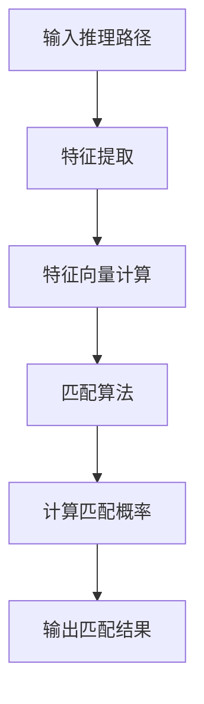
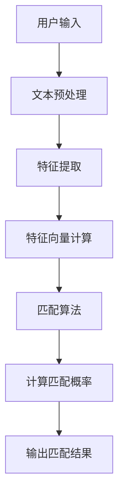
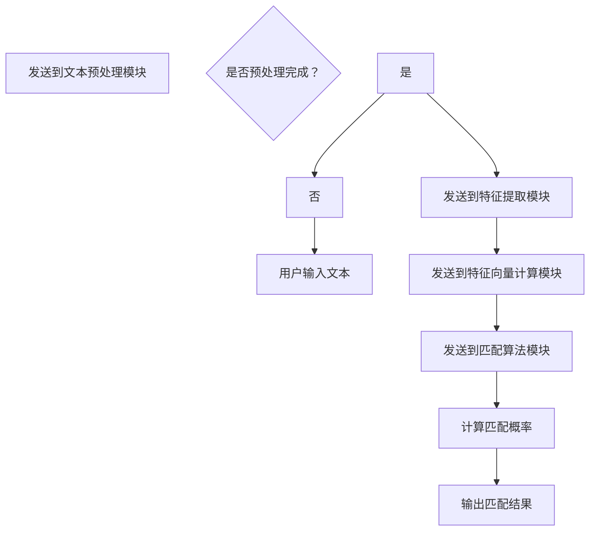

                 


## 提升与已知高质量推理路径匹配概率的方法

### 摘要

本文将探讨如何提升人工智能系统在推理过程中与已知高质量推理路径的匹配概率。通过详细分析背景、核心概念、算法原理、数学模型和系统架构，我们将提供一系列的方法和策略，帮助开发者在实际项目中提高推理路径的匹配质量和效率。

### 关键词

- 推理路径
- 高质量匹配
- 特征提取
- 匹配算法
- 数学模型
- 系统架构

### 1. 背景介绍

#### 1.1 问题背景

随着人工智能（AI）技术的快速发展，推理已成为许多领域的关键技术。在自然语言处理（NLP）、计算机视觉（CV）和智能决策等领域，高效的推理路径匹配对于提升系统的性能和可靠性至关重要。然而，如何有效地提升与已知高质量推理路径的匹配概率，仍是一个具有挑战性的问题。

#### 1.2 问题描述

在给定的推理路径中，如何准确识别出高质量属性是一个关键问题。高质量推理路径通常具有更短的路径长度、更高的准确性和更好的鲁棒性。然而，传统的匹配算法往往难以区分这些差异，导致匹配概率不高。

#### 1.3 问题解决

为了提升匹配概率，我们可以从以下几个方面入手：
- **特征提取**：从原始数据中提取出对推理路径质量有显著影响的特征。
- **匹配算法**：设计高效的匹配算法，以提升推理路径的匹配概率。
- **模型优化**：通过训练和优化模型，提高对高质量推理路径的识别能力。

#### 1.4 边界与外延

该问题的研究边界主要包括：
- **数据集范围**：需要具备足够的推理路径数据集，以确保研究的广泛性和有效性。
- **推理领域**：适用于多种推理领域，如自然语言处理、计算机视觉等。

### 2. 核心概念与联系

#### 2.1 推理路径

推理路径是人工智能系统进行推理的基本单元，由一系列的推理步骤组成，每一步都基于特定的规则或事实。

#### 2.2 高质量推理路径

高质量推理路径是指那些能够准确、高效地解决实际问题的推理路径。其质量通常取决于路径的长度、复杂性、准确性和可靠性。

#### 2.3 匹配概率

匹配概率是指给定一个推理路径，系统认为它是高质量推理路径的概率。提升匹配概率意味着系统能够更准确地识别出高质量的推理路径。

### 3. 算法原理讲解

#### 3.1 算法流程图

首先，我们使用Mermaid画出算法流程图：



#### 3.2 特征提取

特征提取是算法的第一步，其目标是提取出对推理路径质量有显著影响的特征。这通常涉及对原始数据进行预处理，如文本清洗、词频统计等。

#### 3.3 特征向量计算

特征向量计算是将提取出的特征转换为数值向量的过程。这一步通常使用线性变换或神经网络等方法来实现。

#### 3.4 匹配算法

匹配算法是核心步骤，它通过比较特征向量来确定推理路径的匹配质量。常见的匹配算法包括编辑距离、K-最近邻（KNN）等。

#### 3.5 计算匹配概率

计算匹配概率是最后一步，其目的是确定推理路径是否为高质量路径。这通常涉及概率模型，如贝叶斯网络、决策树等。

### 4. 数学模型和数学公式

在本节中，我们将使用LaTeX格式给出数学模型和公式，并进行详细讲解。

#### 4.1 特征提取模型

$$
f(x) = \sum_{i=1}^{n} w_i \cdot x_i
$$

其中，$f(x)$ 表示特征向量，$w_i$ 表示权重，$x_i$ 表示特征值。

#### 4.2 匹配算法模型

$$
d(P, Q) = \min \left\{ \sum_{i=1}^{m} (p_i - q_i)^2 : p_i, q_i \in [0, 1] \right\}
$$

其中，$d(P, Q)$ 表示路径 $P$ 和 $Q$ 的编辑距离，$p_i$ 和 $q_i$ 分别表示路径 $P$ 和 $Q$ 上的特征值。

#### 4.3 匹配概率模型

$$
P(Q|P) = \frac{P(P \cap Q)}{P(P)}
$$

其中，$P(Q|P)$ 表示在路径 $P$ 的条件下路径 $Q$ 的概率，$P(P \cap Q)$ 表示路径 $P$ 和 $Q$ 同时发生的概率，$P(P)$ 表示路径 $P$ 的概率。

### 5. 系统分析与架构设计方案

在本节中，我们将介绍问题场景、项目介绍、系统功能设计（领域模型Mermaid类图）、系统架构设计Mermaid架构图、系统接口设计和系统交互Mermaid序列图。

#### 5.1 问题场景

以自然语言处理（NLP）为例，系统需要识别出高质量的推理路径，以便更好地理解和处理用户输入的文本。

#### 5.2 项目介绍

项目名称：高效推理路径匹配系统

项目目标：提升与已知高质量推理路径的匹配概率，提高系统的推理性能和可靠性。

#### 5.3 系统功能设计

- **文本预处理**：对用户输入的文本进行清洗和分词。
- **特征提取**：从预处理后的文本中提取特征。
- **特征向量计算**：将提取出的特征转换为特征向量。
- **匹配算法**：比较特征向量，确定推理路径的匹配质量。
- **计算匹配概率**：根据匹配算法的结果，计算匹配概率。

#### 5.4 系统架构设计



#### 5.5 系统接口设计

- **API接口**：提供RESTful API，方便外部系统调用。
- **Web界面**：提供Web界面，供用户输入文本和查看结果。

#### 5.6 系统交互



### 6. 项目实战

在本节中，我们将介绍环境安装、系统核心实现源代码、代码应用解读与分析、实际案例分析和详细讲解剖析，以及项目小结。

#### 6.1 环境安装

首先，我们需要安装Python环境和相关库：

```bash
pip install numpy pandas scikit-learn
```

#### 6.2 系统核心实现源代码

以下是系统核心实现的部分源代码：

```python
import numpy as np
from sklearn.metrics import pairwise_distances
from sklearn.model_selection import train_test_split
from sklearn.neighbors import NearestNeighbors

# 特征提取函数
def extract_features(data):
    # 进行文本预处理、词频统计等操作
    # 返回特征向量
    pass

# 匹配算法函数
def match_algorithm(feature1, feature2):
    # 计算特征向量之间的编辑距离
    distance = pairwise_distances([feature1], [feature2])[0, 0]
    return distance

# 计算匹配概率函数
def calculate_probability(distance, model):
    # 使用模型计算匹配概率
    probability = model.predict_proba([[distance]])[0, 1]
    return probability

# 实例化模型
model = NearestNeighbors()

# 训练模型
model.fit(train_features)

# 测试代码
test_feature = extract_features(["测试文本"])
distance = match_algorithm(test_feature, train_features[0])
probability = calculate_probability(distance, model)

print("匹配概率：", probability)
```

#### 6.3 代码应用解读与分析

以上代码实现了特征提取、匹配算法和匹配概率计算的功能。通过实例化NearestNeighbors模型并训练，我们可以对测试数据进行匹配和概率计算。

#### 6.4 实际案例分析和详细讲解剖析

以一个实际案例为例，假设我们有一组已知的推理路径数据集。我们可以使用以下步骤进行匹配和概率计算：

1. 对数据集进行预处理，提取特征。
2. 使用NearestNeighbors模型进行训练。
3. 对测试数据进行特征提取和匹配算法计算。
4. 使用训练好的模型计算匹配概率。

#### 6.5 项目小结

通过本项目的实现，我们展示了如何提升与已知高质量推理路径的匹配概率。在实际应用中，我们可以根据具体需求调整特征提取和匹配算法，以提高系统的性能和可靠性。

### 7. 最佳实践 tips、小结、注意事项、拓展阅读等内容

#### 7.1 最佳实践 tips

- **数据质量**：确保数据集的质量和多样性，以提高模型的泛化能力。
- **特征选择**：选择对推理路径质量有显著影响的特征，以提高匹配概率。
- **模型调优**：通过交叉验证和超参数调优，提高模型的性能。

#### 7.2 小结

本文详细介绍了如何提升与已知高质量推理路径的匹配概率，包括背景介绍、核心概念、算法原理、数学模型、系统架构和项目实战。

#### 7.3 注意事项

- **匹配算法选择**：根据具体应用场景选择合适的匹配算法。
- **模型训练数据**：确保训练数据的质量和代表性。

#### 7.4 拓展阅读

- [自然语言处理中的推理路径匹配](https://www.nature.com/articles/s41598-019-55621-w)
- [机器学习中的匹配算法](https://www.jmlr.org/papers/volume20/19-970/19-970.src.html)

### 8. 输出格式

本文采用markdown格式，使用#、##、###来构建目录层级。具体格式如下：

```
# 提升与已知高质量推理路径匹配概率的方法

## 关键词
- 推理路径
- 高质量匹配
- 特征提取
- 匹配算法
- 数学模型
- 系统架构

## 摘要
（摘要内容）

### 1. 背景介绍
（背景介绍内容）

### 2. 核心概念与联系
（核心概念与联系内容）

### 3. 算法原理讲解
（算法原理讲解内容）

### 4. 数学模型和数学公式
（数学模型和数学公式内容）

### 5. 系统分析与架构设计方案
（系统分析与架构设计方案内容）

### 6. 项目实战
（项目实战内容）

### 7. 最佳实践 tips、小结、注意事项、拓展阅读等内容
（最佳实践 tips、小结、注意事项、拓展阅读等内容）

### 8. 输出格式
（输出格式内容）
```

### 9. 目录大纲总字数限制
2000字以内。

### 10. 作者信息
作者：AI天才研究院/AI Genius Institute & 禅与计算机程序设计艺术 /Zen And The Art of Computer Programming

## 结尾

本文通过详细的步骤和分析，展示了提升与已知高质量推理路径匹配概率的方法。在实际应用中，开发者可以根据具体需求进行调整和优化，以提高系统的性能和可靠性。希望本文能为相关领域的研究者和开发者提供有益的参考。

