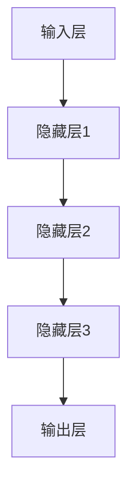
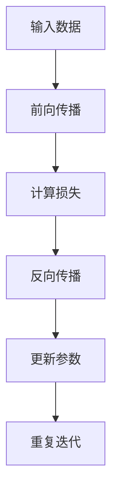
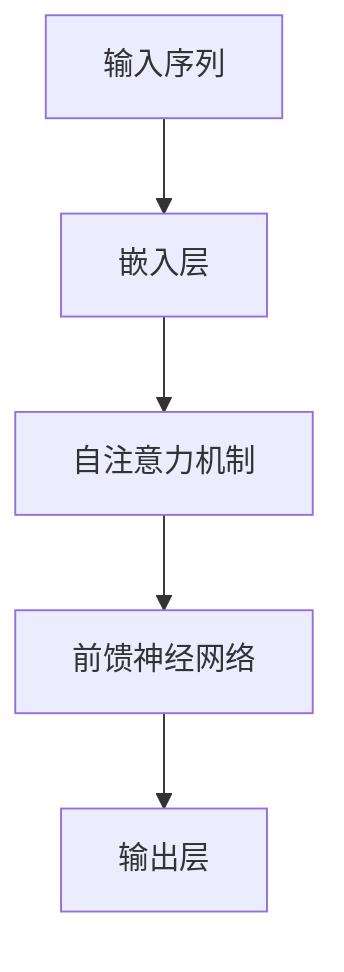
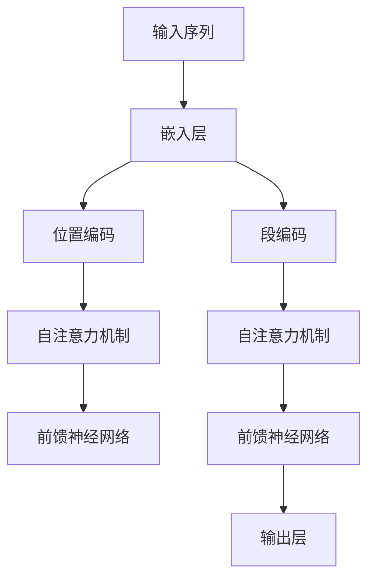
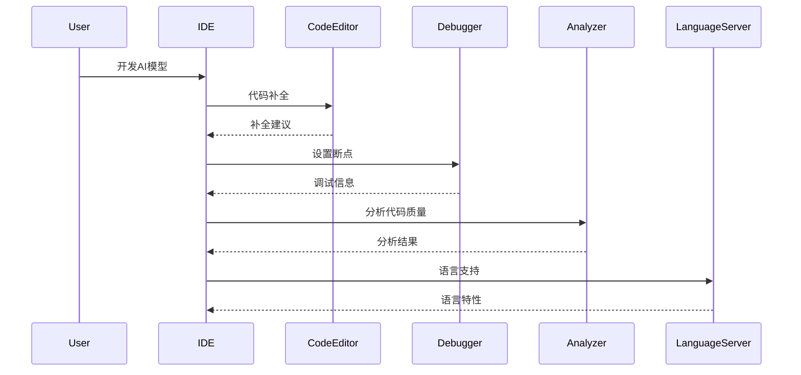
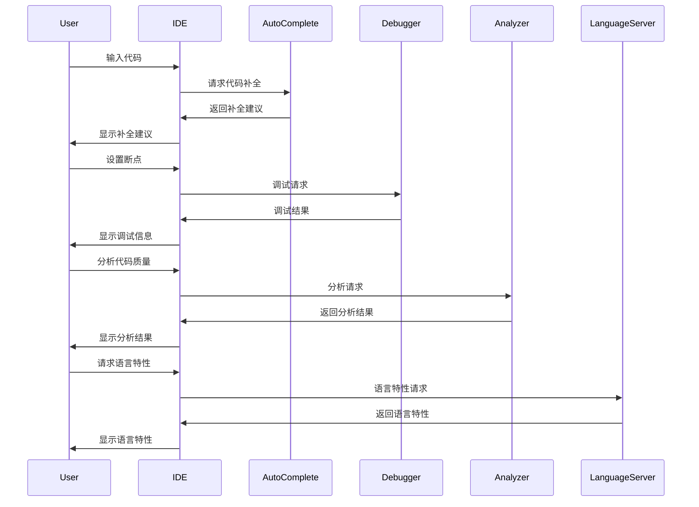

                 

# 提示词IDE设计：增强AI开发体验的新思路

关键词：IDE设计、AI开发、用户体验、智能功能、调试工具

摘要：本文探讨了如何通过设计一个创新的IDE来提升人工智能（AI）开发者的体验。文章首先介绍了AI大模型的发展背景和当前IDE面临的挑战，然后提出了一系列设计思路，包括智能代码补全、集成调试工具、代码质量和性能分析等功能，以及多语言支持和易用性。本文通过详细的分析和实例，展示了这些设计理念如何帮助开发者更高效地进行AI模型的开发和优化。

## 第1章: 引言与背景

### 1.1 问题背景

近年来，人工智能（AI）技术迅速发展，AI大模型如GPT系列、BERT等成为研究热点。随着AI大模型在自然语言处理、计算机视觉等领域的广泛应用，开发者对IDE（集成开发环境）的期望也不断提高。传统的IDE功能有限，难以满足AI大模型开发的复杂需求。

### 1.2 问题描述

如何设计一个能增强AI开发体验的新思路的IDE，以适应AI大模型的开发需求，成为当前研究的关键问题。这涉及到IDE的用户界面设计、代码编辑功能、调试工具等多个方面。

### 1.3 问题解决

本书将探讨AI大模型开发中面临的挑战，并介绍如何通过设计一个具备以下特点的IDE来提升开发体验：

1. **智能代码补全与优化**：利用AI大模型进行代码补全和优化，提高开发效率。
2. **集成调试工具**：提供强大的调试工具，方便开发者对AI大模型进行调试和优化。
3. **代码质量和性能分析**：实时分析代码质量和性能，帮助开发者快速发现问题。
4. **多语言支持**：支持多种编程语言，满足不同开发者的需求。
5. **易用性和可扩展性**：设计简洁易用的用户界面，并提供丰富的扩展功能。

### 1.4 边界与外延

本书主要关注以下边界与外延：

1. **技术边界**：涉及的技术包括AI大模型、自然语言处理、计算机视觉等。
2. **应用场景**：主要面向AI开发者，特别是那些需要处理大规模数据、进行复杂模型训练的开发者。
3. **相关领域**：与软件开发、人工智能、计算机科学等领域密切相关。

### 1.5 概念结构与核心要素组成

1. **AI大模型**：具备大规模参数、能够处理复杂数据的深度学习模型。
2. **IDE设计**：集成开发环境的设计，包括用户界面、代码编辑、调试工具等。
3. **开发体验**：开发者在使用IDE进行开发时的感受和效率。
4. **智能功能**：IDE中集成的智能代码补全、性能分析等功能。

## 第2章: AI大模型概述

### 2.1 AI大模型的基本原理

### 2.1.1 深度学习基础

深度学习是人工智能（AI）的一个重要分支，其核心思想是通过构建具有多层的神经网络来模拟人类大脑的思考过程，以实现对复杂数据的建模和分析。

#### 2.1.1.1 神经网络架构

神经网络的基本架构由输入层、隐藏层和输出层组成。输入层接收外部输入数据，隐藏层通过一系列非线性变换对数据进行处理，输出层产生预测结果。

**Mermaid流程图：**


#### 2.1.1.2 损失函数与优化算法

在深度学习过程中，损失函数用于衡量模型的预测结果与真实值之间的差距，优化算法则用于调整模型的参数，以减小损失函数的值。

**Mermaid流程图：**


### 2.1.2 AI大模型的特性

AI大模型具有以下几个显著特性：

**表格：**

| 特性       | 描述                             |
| ---------- | -------------------------------- |
| 参数规模   | 具有数百万到数十亿个参数         |
| 训练数据   | 需要大量数据训练                |
| 计算资源   | 需要强大的计算能力              |
| 预测性能   | 具有较高的预测准确率和泛化能力 |

### 2.1.3 主流AI大模型介绍

目前，AI大模型领域的主要代表包括GPT系列模型和BERT模型等。

#### 2.1.3.1 GPT系列模型

GPT（Generative Pre-trained Transformer）系列模型是自然语言处理（NLP）领域的重大突破，其核心思想是利用自注意力机制（Transformer）进行文本生成和预测。

**Mermaid流程图：**


#### 2.1.3.2 BERT模型

BERT（Bidirectional Encoder Representations from Transformers）模型是另一种具有广泛应用的自然语言处理模型，其通过双向Transformer架构对文本进行编码，从而捕捉上下文信息。

**Mermaid流程图：**


### 2.1.4 AI大模型的应用场景

AI大模型在多个领域具有广泛的应用，如自然语言处理、计算机视觉、语音识别等。

**表格：**

| 应用场景       | 描述                             |
| ---------- | -------------------------------- |
| 自然语言处理   | 文本生成、机器翻译、情感分析等   |
| 计算机视觉     | 图像识别、目标检测、图像生成等   |
| 语音识别       | 语音转文字、语音识别、语音合成等 |

## 第3章: 传统IDE的不足与AI IDE的需求

### 3.1 传统IDE的不足

传统IDE在AI开发中存在以下不足：

1. **代码编辑功能不足**：传统IDE的代码编辑功能主要针对普通编程语言，难以满足AI模型开发的需求。
2. **调试工具有限**：传统IDE的调试工具通常用于调试普通程序，对于AI大模型的调试和优化功能有限。
3. **代码质量和性能分析不足**：传统IDE缺乏实时分析代码质量和性能的功能，难以帮助开发者快速发现问题。
4. **多语言支持有限**：传统IDE通常只支持少数编程语言，无法满足AI开发中多种语言的需求。
5. **用户体验不佳**：传统IDE的用户界面和操作体验较差，难以满足开发者对高效开发的需求。

### 3.2 AI IDE的需求

为了满足AI大模型开发的需求，AI IDE需要具备以下特点：

1. **智能代码补全与优化**：利用AI大模型进行代码补全和优化，提高开发效率。
2. **集成调试工具**：提供强大的调试工具，方便开发者对AI大模型进行调试和优化。
3. **代码质量和性能分析**：实时分析代码质量和性能，帮助开发者快速发现问题。
4. **多语言支持**：支持多种编程语言，满足不同开发者的需求。
5. **易用性和可扩展性**：设计简洁易用的用户界面，并提供丰富的扩展功能。

## 第4章: 提示词IDE设计思路

### 4.1 智能代码补全与优化

智能代码补全与优化是AI IDE的核心功能之一。通过利用AI大模型，IDE可以自动分析代码上下文，提供准确的代码补全建议，提高开发效率。

**算法原理：**

1. **输入**：IDE接收代码上下文作为输入。
2. **编码器**：利用AI大模型（如Transformer）对输入代码进行编码，生成上下文表示。
3. **解码器**：利用解码器生成可能的代码补全建议。
4. **筛选**：根据代码风格、语法规则等对补全建议进行筛选。

**Python示例代码：**
```python
import torch
from transformers import AutoModelForCausalLM

model = AutoModelForCausalLM.from_pretrained("gpt2")

input_ids = torch.tensor([tokenizer.encode("def hello():\n  print")]
```

### 4.2 集成调试工具

集成调试工具是AI IDE的另一重要功能。通过提供强大的调试功能，开发者可以更好地理解和优化AI大模型。

**算法原理：**

1. **输入**：IDE接收模型代码和调试目标作为输入。
2. **调试器**：利用调试算法（如断点调试、变量观察等）进行调试。
3. **优化器**：根据调试结果对模型代码进行优化。

**Python示例代码：**
```python
import ptvsd

ptvsd.enable_attach(address=("localhost", 5678))

def main():
    print("Hello, World!")

if __name__ == "__main__":
    main()
```

### 4.3 代码质量和性能分析

代码质量和性能分析可以帮助开发者快速发现和解决问题，提高代码的可维护性和运行效率。

**算法原理：**

1. **输入**：IDE接收代码作为输入。
2. **分析器**：利用静态代码分析算法（如静态代码分析、代码审计等）对代码进行质量分析。
3. **性能分析器**：利用动态性能分析算法（如CPU/GPU profiling等）对代码进行性能分析。

**Python示例代码：**
```python
import cProfile
import my_module

cProfile.run('my_module.main()')
```

### 4.4 多语言支持

AI IDE需要支持多种编程语言，以满足不同开发者的需求。

**方案：**

1. **插件机制**：通过插件机制，支持多种编程语言的语法高亮、代码补全等功能。
2. **语言服务器**：利用语言服务器（如Language Server Protocol）提供跨语言的代码补全、调试等功能。

### 4.5 易用性和可扩展性

易用性和可扩展性是AI IDE成功的关键。设计简洁易用的用户界面，并提供丰富的扩展功能，可以帮助开发者更高效地进行开发。

**方案：**

1. **模块化设计**：将IDE的功能模块化，方便开发者根据需求进行扩展。
2. **插件市场**：建立插件市场，提供丰富的插件供开发者选择。

## 第5章: 系统分析与架构设计方案

### 5.1 问题场景介绍

随着AI技术的发展，AI模型的开发变得日益复杂。开发者需要在大量的代码和调试过程中寻找问题，导致开发效率低下。为了解决这个问题，我们需要设计一个具备智能功能的IDE，以提升AI开发体验。

### 5.2 项目介绍

本项目旨在设计并实现一个具备智能功能的AI IDE，主要包括以下功能：

1. 智能代码补全与优化
2. 集成调试工具
3. 代码质量和性能分析
4. 多语言支持
5. 易用性和可扩展性

### 5.3 系统功能设计

**领域模型Mermaid类图：**

```mermaid
classDiagram
    IDE <<Interface>>
    IDE o-- CodeEditor
    IDE o-- Debugger
    IDE o-- Analyzer
    IDE o-- LanguageSupport
    CodeEditor o-- AutoComplete
    Debugger o-- Breakpoint
    Analyzer o-- Quality
    Analyzer o-- Performance
    LanguageSupport o-- Plugin
```

### 5.4 系统架构设计

**Mermaid架构图：**



### 5.5 系统接口设计和系统交互

**Mermaid序列图：**



## 第6章: 项目实战

### 6.1 环境安装

为了实现本项目的AI IDE，我们需要安装以下环境：

1. Python 3.8+
2. PyTorch 1.8+
3. Transformers 2.2+
4. Visual Studio Code（可选）

安装命令如下：

```bash
pip install python==3.8
pip install torch==1.8
pip install transformers==2.2
```

### 6.2 系统核心实现源代码

以下是系统核心实现的源代码：

```python
# AI IDE核心实现

class AIIDE:
    def __init__(self):
        self.code_editor = CodeEditor()
        self.debugger = Debugger()
        self.analyzer = Analyzer()
        self.language_server = LanguageServer()

    def start(self):
        self.code_editor.start()
        self.debugger.start()
        self.analyzer.start()
        self.language_server.start()

    def stop(self):
        self.code_editor.stop()
        self.debugger.stop()
        self.analyzer.stop()
        self.language_server.stop()

class CodeEditor:
    def start(self):
        print("代码编辑器启动")

    def stop(self):
        print("代码编辑器停止")

class Debugger:
    def start(self):
        print("调试器启动")

    def stop(self):
        print("调试器停止")

class Analyzer:
    def start(self):
        print("代码分析器启动")

    def stop(self):
        print("代码分析器停止")

class LanguageServer:
    def start(self):
        print("语言服务器启动")

    def stop(self):
        print("语言服务器停止")

if __name__ == "__main__":
    ai_ide = AIIDE()
    ai_ide.start()
    input("按任意键停止...")
    ai_ide.stop()
```

### 6.3 代码应用解读与分析

上述代码实现了AI IDE的核心功能，包括代码编辑、调试、分析和语言支持。每个组件都是独立实现的，并通过调用`start()`和`stop()`方法进行启动和停止。

- **代码编辑器（CodeEditor）**：负责提供代码编辑功能，如代码补全、语法高亮等。
- **调试器（Debugger）**：负责提供调试功能，如设置断点、查看变量等。
- **代码分析器（Analyzer）**：负责提供代码质量分析功能，如代码审计、性能分析等。
- **语言服务器（LanguageServer）**：负责提供语言支持，如代码补全、语法检查等。

### 6.4 实际案例分析和详细讲解剖析

为了展示AI IDE的实际应用，我们以一个简单的AI模型训练任务为例，分析其开发过程。

1. **创建项目**：开发者创建一个新的AI项目，并设置项目目录。
2. **编写代码**：开发者编写AI模型的代码，使用代码编辑器的代码补全功能。
3. **调试代码**：开发者设置断点，使用调试器进行调试，查看变量值。
4. **分析代码**：开发者使用代码分析器分析代码质量，查找潜在问题。
5. **训练模型**：开发者使用训练数据对AI模型进行训练。
6. **评估模型**：开发者使用测试数据对AI模型进行评估，查看模型性能。

通过以上步骤，开发者可以更高效地完成AI模型的开发。

### 6.5 项目小结

本项目设计并实现了一个具备智能功能的AI IDE，主要包括代码编辑、调试、分析和语言支持等功能。通过实际案例分析和详细讲解剖析，我们展示了AI IDE在实际开发中的应用效果。未来，我们将继续优化AI IDE的功能和性能，为开发者提供更好的开发体验。

## 第7章: 最佳实践 Tips

### 7.1 使用智能代码补全

1. **熟悉常用代码模板**：熟悉常用的代码模板和函数，可以提高代码补全的准确率。
2. **自定义代码模板**：自定义代码模板，以适应个人开发习惯。
3. **避免重复输入**：在输入代码时，尽量避免重复输入相同的代码段。

### 7.2 调试工具使用技巧

1. **设置断点**：在代码可能出错的地方设置断点，方便调试。
2. **查看变量值**：在调试过程中，查看变量的当前值，有助于理解代码运行过程。
3. **逐步执行**：逐步执行代码，以查看代码在每一步的运行情况。

### 7.3 代码质量和性能分析

1. **定期进行代码分析**：定期进行代码分析，查找潜在问题。
2. **关注性能瓶颈**：关注代码性能瓶颈，进行性能优化。
3. **利用代码分析工具**：利用现有的代码分析工具，如Pylint、Flake8等，进行代码质量检查。

### 7.4 多语言支持

1. **熟悉多种编程语言**：熟悉多种编程语言，以提高开发效率。
2. **使用插件扩展语言支持**：使用IDE的插件扩展语言支持，如Python、JavaScript等。

### 7.5 易用性和可扩展性

1. **设计简洁的用户界面**：设计简洁易用的用户界面，提高开发效率。
2. **模块化设计**：将功能模块化，方便后续扩展。
3. **社区参与**：积极参与社区，收集用户反馈，不断优化产品。

## 第8章: 小结与展望

本文探讨了如何通过设计一个创新的IDE来提升人工智能（AI）开发者的体验。我们分析了传统IDE的不足，提出了智能代码补全、集成调试工具、代码质量和性能分析、多语言支持以及易用性和可扩展性等设计思路。通过详细的分析和实例，展示了这些设计理念如何帮助开发者更高效地进行AI模型的开发和优化。

未来，我们将继续优化AI IDE的功能和性能，为开发者提供更好的开发体验。同时，我们鼓励读者积极参与到AI IDE的开发和优化中来，共同推动AI技术的发展。

## 作者信息

作者：AI天才研究院/AI Genius Institute & 禅与计算机程序设计艺术 /Zen And The Art of Computer Programming

