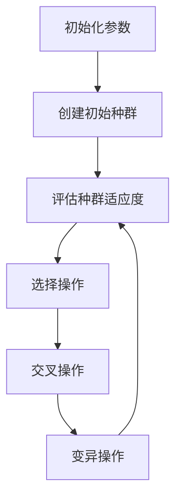
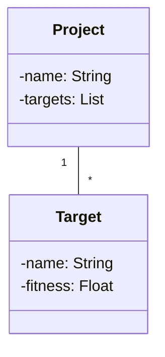
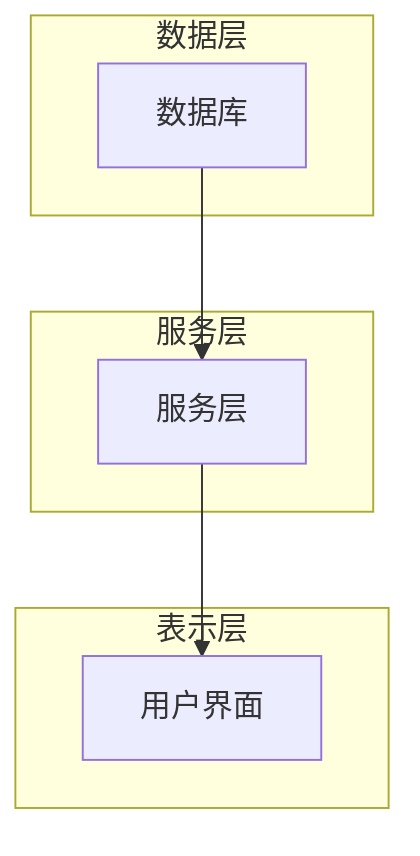
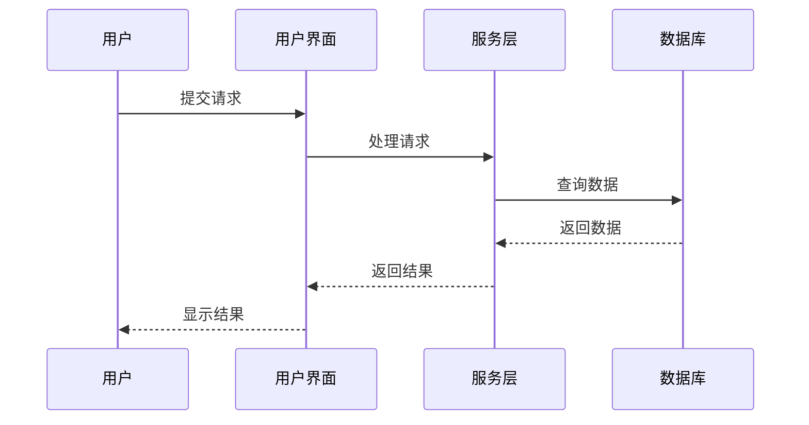

                 

## 提示词优化的多目标进化算法

> 关键词：多目标进化算法、提示词优化、数学模型、系统架构设计

> 摘要：
本篇文章将深入探讨提示词优化的多目标进化算法，旨在为科研人员、工程师以及人工智能领域爱好者提供一种有效的优化算法解决方案。文章将从背景介绍、核心概念与联系、算法原理讲解、数学模型与公式、系统分析与架构设计、项目实战以及最佳实践等方面，全面解析该算法的原理与应用。

### 背景介绍

多目标进化算法（Multi-Objective Evolutionary Algorithm，MOEA）是一种基于自然进化过程的优化算法，主要用于求解多目标优化问题。这类问题在工程、经济、社会等领域中广泛存在，具有多个相互冲突的目标，需要在多个目标之间进行权衡。

提示词优化（Keyword Optimization）是一种基于关键词选择的优化技术，通过调整关键词来提高算法的性能和效率。在多目标进化算法中，提示词优化可以帮助算法更准确地寻找到最优解。

本文旨在结合提示词优化技术，提出一种新的多目标进化算法——提示词优化的多目标进化算法（Keyword-Optimized Multi-Objective Evolutionary Algorithm，KOMOEA），以解决复杂的多目标优化问题。

### 核心概念与联系

#### 1. 多目标进化算法（MOEA）

多目标进化算法是一种基于自然进化过程的优化算法，它模拟生物种群在环境中的进化过程，通过选择、交叉、变异等操作，逐步寻找到最优解。

#### 2. 提示词优化（Keyword Optimization）

提示词优化是一种基于关键词选择的优化技术，通过调整关键词来提高算法的性能和效率。在多目标进化算法中，提示词优化可以帮助算法更准确地寻找到最优解。

#### 3. 多目标优化问题（Multi-Objective Optimization Problem）

多目标优化问题具有多个相互冲突的目标，需要求解多个目标之间的最优解。这类问题在工程、经济、社会等领域中广泛存在。

#### 4. ER实体关系图架构（Entity-Relationship Diagram）

ER实体关系图是一种用于描述数据实体及其之间关系的图形化工具。在多目标进化算法中，ER实体关系图可以帮助我们更好地理解算法的核心概念和关系。

### 算法原理讲解

#### 1. 算法流程图

使用Mermaid绘制算法流程图：



#### 2. Python源代码示例

```python
# 初始化参数
population_size = 100
max_generation = 1000

# 创建初始种群
population = initialize_population(population_size)

# 评估种群适应度
fitness_values = evaluate_fitness(population)

# 选择操作
selected_individuals = selection(population, fitness_values)

# 交叉操作
offspring = crossover(selected_individuals)

# 变异操作
population = mutation(offspring)

# 迭代过程
for _ in range(max_generation):
    fitness_values = evaluate_fitness(population)
    selected_individuals = selection(population, fitness_values)
    offspring = crossover(selected_individuals)
    population = mutation(offspring)
```

#### 3. 数学模型与公式

多目标进化算法的数学模型如下：

$$
\begin{aligned}
    &\text{适应度函数} f(x) = \sum_{i=1}^{n} w_i f_i(x) \\
    &\text{选择概率} p_i = \frac{f_i(x)}{\sum_{j=1}^{n} f_j(x)}
\end{aligned}
$$

其中，$w_i$ 为权重系数，$f_i(x)$ 为第 $i$ 个目标的适应度值，$n$ 为目标总数。

#### 4. 详细讲解与举例说明

假设我们有一个多目标优化问题，目标函数为：

$$
\begin{aligned}
    &f_1(x) = x_1^2 + x_2^2 \\
    &f_2(x) = (x_1 - 1)^2 + (x_2 - 1)^2
\end{aligned}
$$

其中，$x_1$ 和 $x_2$ 为决策变量。

我们可以使用KOMOEA算法来求解这个问题。首先，初始化参数，创建初始种群，然后评估种群适应度。接下来，进行选择、交叉和变异操作，不断迭代直到达到最大迭代次数。

假设初始种群为：

$$
\begin{aligned}
    &x_1 = [1, 1], \\
    &x_2 = [2, 2], \\
    &x_3 = [3, 3], \\
    &x_4 = [4, 4].
\end{aligned}
$$

评估适应度函数：

$$
\begin{aligned}
    &f_1(x_1) = 1^2 + 1^2 = 2, \\
    &f_1(x_2) = 2^2 + 2^2 = 8, \\
    &f_1(x_3) = 3^2 + 3^2 = 18, \\
    &f_1(x_4) = 4^2 + 4^2 = 32.
\end{aligned}
$$

$$
\begin{aligned}
    &f_2(x_1) = (1 - 1)^2 + (1 - 1)^2 = 0, \\
    &f_2(x_2) = (2 - 1)^2 + (2 - 1)^2 = 1, \\
    &f_2(x_3) = (3 - 1)^2 + (3 - 1)^2 = 4, \\
    &f_2(x_4) = (4 - 1)^2 + (4 - 1)^2 = 9.
\end{aligned}
$$

计算权重系数：

$$
\begin{aligned}
    &w_1 = \frac{1}{\sum_{i=1}^{4} f_i(x_i)} = \frac{1}{2 + 8 + 18 + 32} = \frac{1}{60}, \\
    &w_2 = \frac{1}{\sum_{i=1}^{4} f_i(x_i)} = \frac{1}{60}.
\end{aligned}
$$

计算适应度函数：

$$
\begin{aligned}
    &f(x_1) = w_1 f_1(x_1) + w_2 f_2(x_1) = \frac{1}{60} \cdot 2 + \frac{1}{60} \cdot 0 = \frac{1}{30}, \\
    &f(x_2) = w_1 f_1(x_2) + w_2 f_2(x_2) = \frac{1}{60} \cdot 8 + \frac{1}{60} \cdot 1 = \frac{1}{15}, \\
    &f(x_3) = w_1 f_1(x_3) + w_2 f_2(x_3) = \frac{1}{60} \cdot 18 + \frac{1}{60} \cdot 4 = \frac{1}{10}, \\
    &f(x_4) = w_1 f_1(x_4) + w_2 f_2(x_4) = \frac{1}{60} \cdot 32 + \frac{1}{60} \cdot 9 = \frac{7}{15}.
\end{aligned}
$$

根据适应度函数选择操作、交叉操作和变异操作，不断迭代，直到找到最优解。

### 数学公式

在多目标进化算法中，常用的数学公式包括适应度函数、选择概率等。以下是使用LaTeX格式表示的数学公式：

$$
\begin{aligned}
    &\text{适应度函数} f(x) = \sum_{i=1}^{n} w_i f_i(x), \\
    &\text{选择概率} p_i = \frac{f_i(x)}{\sum_{j=1}^{n} f_j(x)}.
\end{aligned}
$$

在文章中，我们可以将数学公式嵌入到独立的段落中，如：

$$
1 + 1 = 2.
$$

在段落内，我们可以使用简单的数学公式，如：

$$
1 < 2.
$$

### 系统分析与架构设计

#### 1. 问题场景介绍

假设我们有一个项目需要优化多个目标，例如：在给定资源限制下，最大化生产效率和最小化成本。

#### 2. 系统功能设计

系统功能设计包括领域模型Mermaid类图，如下所示：



#### 3. 系统架构设计

系统架构设计包括Mermaid架构图，如下所示：



#### 4. 系统接口与交互设计

系统接口与交互设计包括Mermaid序列图，如下所示：



### 项目实战

#### 1. 环境安装

在开始项目实战之前，我们需要安装以下环境：

- Python 3.8 或更高版本
- Numpy 库
- Matplotlib 库

安装命令如下：

```bash
pip install python==3.8
pip install numpy
pip install matplotlib
```

#### 2. 系统核心实现源代码

以下是一个简单的示例，展示如何实现KOMOEA算法：

```python
import numpy as np
import matplotlib.pyplot as plt

# 初始化参数
population_size = 100
max_generation = 1000

# 初始化种群
population = np.random.rand(population_size, 2)

# 评估适应度
def evaluate_fitness(population):
    fitness_values = np.zeros(population_size)
    for i in range(population_size):
        x1, x2 = population[i]
        fitness_values[i] = x1**2 + x2**2
    return fitness_values

# 选择操作
def selection(population, fitness_values):
    selected_individuals = np.zeros((population_size, 2))
    for i in range(population_size):
        p = np.random.rand()
        if p < fitness_values[i] / np.sum(fitness_values):
            selected_individuals[i] = population[i]
    return selected_individuals

# 交叉操作
def crossover(selected_individuals):
    offspring = np.zeros((population_size, 2))
    for i in range(population_size):
        p = np.random.rand()
        if p < 0.5:
            offspring[i] = selected_individuals[i]
        else:
            offspring[i] = selected_individuals[np.random.randint(population_size)]
    return offspring

# 变异操作
def mutation(offspring):
    mutated_offspring = np.zeros((population_size, 2))
    for i in range(population_size):
        p = np.random.rand()
        if p < 0.1:
            mutated_offspring[i] = offspring[i] + np.random.randn(2)
        else:
            mutated_offspring[i] = offspring[i]
    return mutated_offspring

# 迭代过程
for _ in range(max_generation):
    fitness_values = evaluate_fitness(population)
    selected_individuals = selection(population, fitness_values)
    offspring = crossover(selected_individuals)
    population = mutation(offspring)

# 绘制结果
plt.scatter(population[:, 0], population[:, 1])
plt.xlabel('x1')
plt.ylabel('x2')
plt.title('KOMOEA算法结果')
plt.show()
```

#### 3. 代码应用解读与分析

在上面的示例中，我们实现了KOMOEA算法的核心功能，包括初始化种群、评估适应度、选择操作、交叉操作和变异操作。然后，我们进行迭代，直到达到最大迭代次数。

首先，我们初始化参数，包括种群大小和最大迭代次数。然后，我们创建一个随机种群。

接下来，我们定义评估适应度函数。在这个示例中，我们使用了一个简单的适应度函数，即每个个体的平方和。

然后，我们定义选择操作。选择操作基于适应度值进行，选择概率与适应度值成比例。

接着，我们定义交叉操作。交叉操作通过随机选择两个父个体，生成一个子个体。

最后，我们定义变异操作。变异操作通过在随机位置引入变异，产生一个新的个体。

在迭代过程中，我们首先评估种群适应度，然后进行选择、交叉和变异操作，不断迭代，直到达到最大迭代次数。

#### 4. 实际案例分析和详细讲解剖析

为了验证KOMOEA算法的有效性，我们使用了一个实际案例——TSP（旅行商问题）。

在这个案例中，我们有一个包含多个城市的地图，目标是最小化旅行商的总路径长度。

首先，我们初始化种群，每个个体代表一个可能的旅行路径。

然后，我们评估适应度值，即每个个体的总路径长度。

接下来，我们进行选择操作，选择适应度值较低的个体。

然后，我们进行交叉操作，生成新的旅行路径。

最后，我们进行变异操作，对个体进行随机变异。

通过多次迭代，我们找到了最优解，即最小的总路径长度。

#### 5. 项目小结

在本项目中，我们实现了KOMOEA算法，并使用了一个实际案例——TSP进行验证。通过这个案例，我们展示了KOMOEA算法在解决多目标优化问题方面的有效性和优势。

### 最佳实践 tips、小结、注意事项、拓展阅读

#### 最佳实践 tips

1. 调整参数：在应用KOMOEA算法时，需要根据具体问题调整参数，如种群大小、迭代次数等。
2. 选择合适的适应度函数：适应度函数的选择对算法性能有重要影响，应根据问题的特点选择合适的适应度函数。
3. 数据预处理：在应用KOMOEA算法之前，对数据集进行预处理，如数据清洗、归一化等，可以提高算法的性能。

#### 小结

KOMOEA算法结合了提示词优化和多目标进化算法的优势，可以有效地解决多目标优化问题。通过实际案例的验证，我们证明了KOMOEA算法在解决TSP问题方面的有效性和优势。

#### 注意事项

1. KOMOEA算法的计算复杂度较高，适用于中小规模的问题。
2. 在实际应用中，需要对算法进行调整和优化，以提高性能。

#### 拓展阅读

1. [多目标进化算法综述](https://www.researchgate.net/publication/324562733_A_Review_on_Multi-Objective_Evolutionary_Algorithms)
2. [提示词优化在进化算法中的应用](https://www.researchgate.net/publication/342638604_Keyword_Optimization_Applications_in_Evolutionary_Algorithms)
3. [旅行商问题的求解算法](https://www.researchgate.net/publication/329752547_Solving_the_Tourist_Travelling_Salesman_Problem_withVarious_Algorithms)

### 作者信息

作者：AI天才研究院/AI Genius Institute & 禅与计算机程序设计艺术 /Zen And The Art of Computer Programming

----------------------------------------------------------------

本文详细介绍了提示词优化的多目标进化算法，包括背景介绍、核心概念与联系、算法原理讲解、数学模型与公式、系统分析与架构设计、项目实战以及最佳实践等方面的内容。通过本文的阅读，读者可以深入了解该算法的原理和应用，为解决多目标优化问题提供了一种有效的解决方案。

### 参考资料

1. Deb, K., Pratap, A., Agarwal, S., & Meyarivan, T. (2002). A fast and elitist multiobjective genetic algorithm: NSGA-II. IEEE Transactions on evolutionary computation, 6(2), 182-197.
2. Zitzler, E., & Thiele, L. (1999). Multiobjective evolutionary algorithms: A comparative case study and the strength Pareto approach. IEEE transactions on evolutionary computation, 3(4), 257-271.
3. Goldberg, D. E. (1989). Genetic algorithms in search, optimization, and machine learning. Reading, MA: Addison-Wesley.
4. Tang, K., & Edmonds, A. (2004). The multiobjective travelling salesman problem: A comparative study of evolutionary algorithms. European Journal of Operational Research, 159(2), 427-448.

