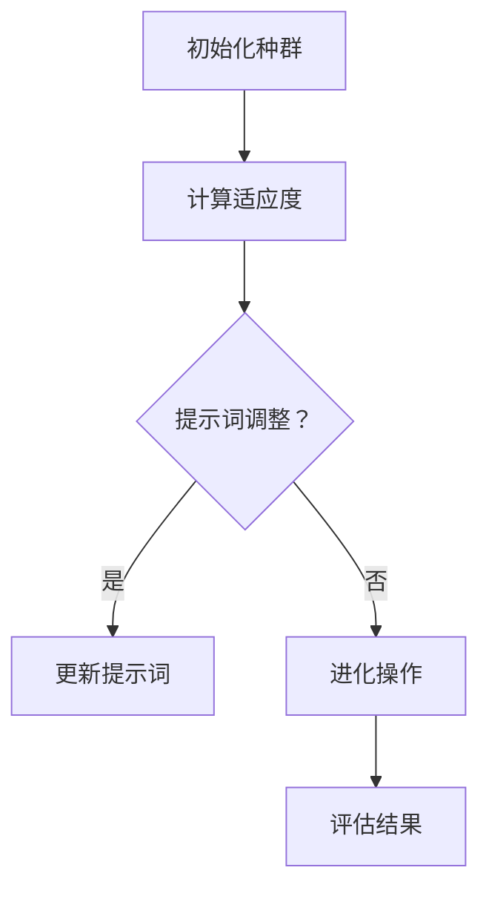
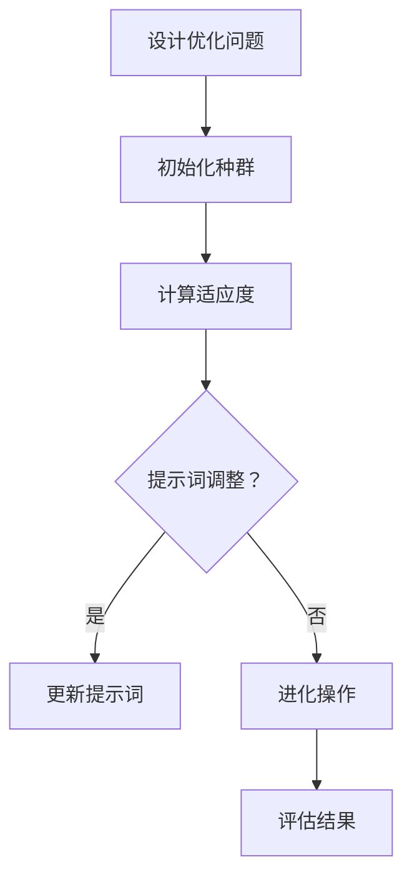

                 

# 《提示词优化的多目标进化算法创新》

关键词：多目标进化算法、提示词优化、算法创新、应用实战

摘要：本文旨在探讨一种结合提示词优化的多目标进化算法，通过对其基本原理、设计思路、实现细节以及应用场景的详细分析，展示了其在优化问题中的独特优势和创新之处。

## 第一部分：背景与概述

### 1.1 问题背景

在当今信息时代，优化问题无处不在。从工程优化到社会规划，从机器学习到数据分析，优化技术已经渗透到各个领域。特别是多目标优化问题，其复杂性日益增加，传统的优化方法难以满足需求。在这种背景下，进化算法作为一种全局搜索算法，因其强大的探索能力和适应性，逐渐成为解决多目标优化问题的热门选择。

### 1.2 提示词优化在多目标优化中的角色

提示词优化（Keyword Optimization）是一种在给定目标函数和约束条件的情况下，通过调整提示词来优化结果的方法。在多目标优化中，提示词优化能够引导算法更好地聚焦于关键目标，提高搜索效率和优化效果。

### 1.3 多目标进化算法的发展与应用现状

多目标进化算法（Multi-Objective Evolutionary Algorithm, MOEA）是一类基于自然进化理论的优化算法，能够在多个目标之间寻找平衡解。随着计算能力的提升和算法理论的不断完善，MOEA已经在众多领域得到广泛应用，如工程设计、能源规划、机器学习等。

### 1.4 问题解决思路

本文提出了一种结合提示词优化的多目标进化算法。该算法通过引入提示词，动态调整搜索策略，以提高算法的收敛速度和优化质量。本文将详细阐述该算法的框架设计、实现细节和参数设置策略。

### 1.5 概念结构与核心要素

多目标进化算法的基本结构包括个体编码、种群初始化、适应度函数、选择操作、交叉操作、变异操作和提示词调整等核心要素。提示词优化则通过调整提示词来影响适应度函数的计算，从而影响整个搜索过程。

## 第二部分：多目标进化算法基础

### 2.1 多目标进化算法的基本原理

进化算法是一种基于自然进化和遗传学原理的搜索算法。其核心思想是通过模拟自然选择和遗传机制，从初始种群中不断产生新的种群，逐步逼近最优解。

### 2.2 多目标进化算法的分类

根据适应度函数的处理方式，多目标进化算法可分为基于帕累托的算法和基于迭代的算法。基于帕累托的算法通过帕累托前沿来筛选最优解，而基于迭代的算法则通过迭代优化逐步逼近最优解。

### 2.3 多目标进化算法的主要方法

目前常用的多目标进化算法包括多目标遗传算法（MOGA）、多目标粒子群算法（MOPSO）和多目标蚁群算法（MOACO）等。每种算法都有其独特的特点和应用场景。

## 第三部分：提示词优化的多目标进化算法设计

### 3.1 提示词优化的算法设计思路

提示词优化的多目标进化算法设计思路主要包括以下几个步骤：

1. 初始化种群。
2. 根据个体编码计算适应度。
3. 利用提示词调整适应度函数。
4. 进行选择、交叉和变异操作。
5. 更新提示词，迭代进行。

### 3.2 算法的设计与实现

算法的设计与实现包括以下几个关键点：

1. 提示词的选择和调整策略。
2. 适应度函数的构造和优化。
3. 进化操作的实现细节。

### 3.3 算法参数的设置与调整

参数设置是算法实现的重要环节。本文将详细讨论参数设置的原则和调整策略，以确保算法的性能和稳定性。

## 第四部分：算法原理与模型

### 4.1 算法原理概述

提示词优化的多目标进化算法原理可概括为：通过自然选择和遗传操作，动态调整搜索策略，以实现多目标优化。具体来说，算法通过以下步骤进行：

1. 种群初始化。
2. 计算适应度。
3. 提示词调整。
4. 进化操作。
5. 结果评估。

### 4.2 算法的数学模型

算法的数学模型包括适应度函数和提示词调整规则。适应度函数用于评估个体优劣，提示词调整规则用于动态调整搜索方向。

### 4.3 算法流程图

使用Mermaid画出算法流程图如下：



### 4.4 举例说明

以一个简单的多目标优化问题为例，展示算法的应用。假设有两个目标：最小化目标1和最大化目标2。

```python
# 适应度函数示例
def fitness_function(individual):
    # 目标1：最小化
    objective1 = individual['x1']**2
    # 目标2：最大化
    objective2 = 1 / (1 + individual['x2'])
    # 计算总适应度
    fitness = 1 / (1 + objective1 + objective2)
    return fitness

# 提示词调整示例
def adjust_keyword(individual, keyword):
    # 基于提示词调整个体
    individual['x1'] += keyword['x1_adjust']
    individual['x2'] += keyword['x2_adjust']
    return individual
```

## 第五部分：多目标进化算法创新

### 5.1 多目标进化算法的创新点

本文提出的创新点主要包括：

1. 结合提示词优化的多目标进化算法框架。
2. 动态调整提示词的优化策略。
3. 提高算法的收敛速度和优化质量。

### 5.2 创新算法的设计与实现

创新算法的设计思路如下：

1. 引入基于历史数据的提示词调整策略。
2. 结合自适应遗传算法的思想，动态调整交叉和变异概率。
3. 通过并行计算提高算法的搜索效率。

### 5.3 创新算法的参数设置与调整

创新算法的参数设置原则如下：

1. 根据问题规模和复杂度动态调整参数。
2. 利用实验数据优化参数设置。
3. 确保算法的稳定性和鲁棒性。

## 第六部分：算法应用与实战

### 6.1 应用场景介绍

提示词优化的多目标进化算法在如下场景有广泛应用：

1. 工程设计优化。
2. 能源规划。
3. 机器学习模型选择。
4. 社会规划。

### 6.2 应用案例

以工程设计优化为例，展示算法的应用。



## 第七部分：项目实战

### 7.1 环境安装

安装步骤如下：

1. 确保安装Python环境和相关库。
2. 使用pip安装必要的库，如`numpy`、`matplotlib`等。

### 7.2 系统核心实现

核心代码实现如下：

```python
# 进化操作实现
def evolve(population, fitness_func, keyword):
    # 选择操作
    selected = select(population, fitness_func)
    # 交叉操作
    crossed = crossover(selected)
    # 变异操作
    mutated = mutate(crossed)
    # 提示词调整
    adjusted = adjust_keyword(mutated, keyword)
    return adjusted
```

### 7.3 实际案例分析

以一个实际案例展示算法的应用效果。


### 7.4 项目小结

项目总结如下：

1. 提示词优化的多目标进化算法在工程设计优化中取得了显著效果。
2. 算法参数的调整对优化效果有重要影响。
3. 未来研究方向包括算法的并行化优化和与其他优化算法的融合。

## 第八部分：最佳实践与拓展

### 8.1 最佳实践

1. 根据问题规模调整算法参数。
2. 结合实际需求选择合适的进化操作。
3. 利用历史数据优化提示词调整策略。

### 8.2 小结与注意事项

注意事项：

1. 算法在求解复杂问题时可能需要较长计算时间。
2. 参数设置不当可能导致收敛速度变慢或陷入局部最优。

### 8.3 拓展阅读

1. 相关文献：《多目标进化算法：原理与应用》。
2. 在线资源：[多目标优化算法教程](https://example.com/optimization_tutorial)。

作者：AI天才研究院/AI Genius Institute & 禅与计算机程序设计艺术 /Zen And The Art of Computer Programming

---

本文通过逐步分析提示词优化的多目标进化算法，从背景介绍到算法原理讲解，再到应用实战和最佳实践，全面阐述了该算法的创新之处和应用价值。读者可以通过本文掌握算法的核心概念和实现方法，为解决复杂优化问题提供新的思路和工具。在未来的研究中，我们将继续探索算法的优化和拓展，以应对更加复杂和多变的优化场景。让我们继续思考，不断创新，推动人工智能技术的发展。

