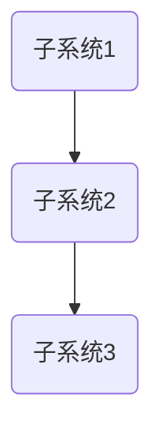
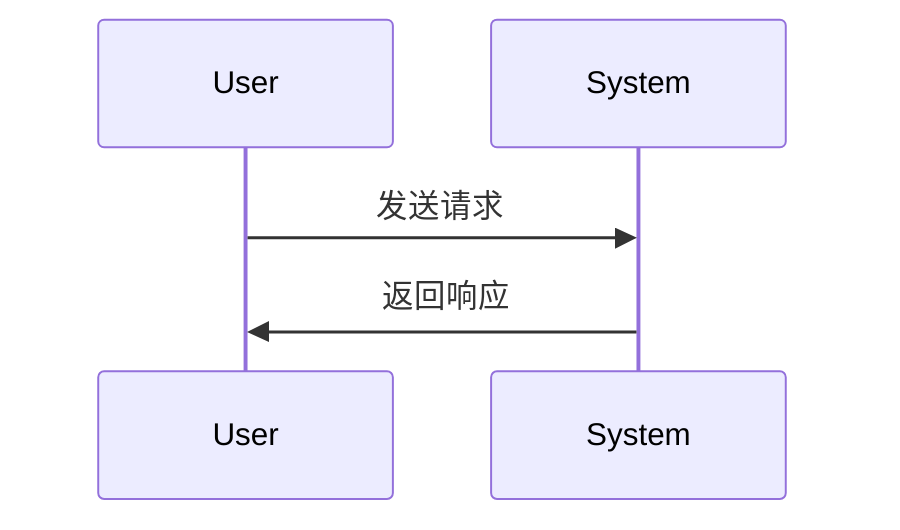
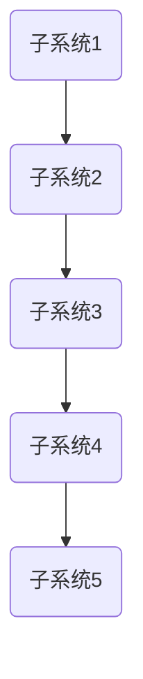
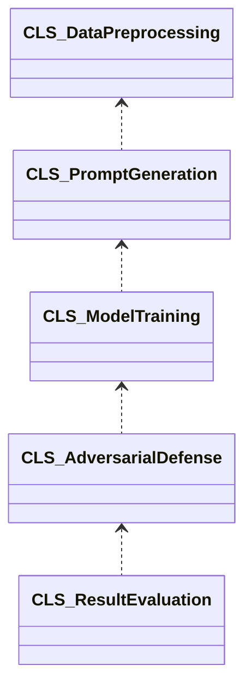
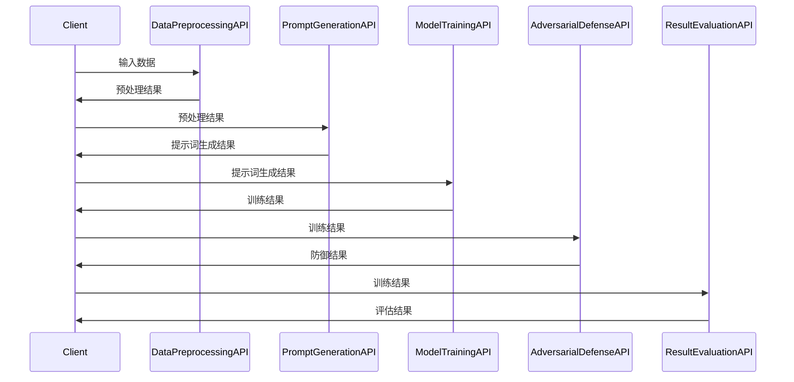

                 

# 提示词优化的对抗学习策略

关键词：提示词优化、对抗学习、自然语言生成、模型鲁棒性、算法设计

摘要：
本文旨在探讨提示词优化与对抗学习在提升人工智能模型性能方面的应用。通过逐步分析提示词优化的概念、对抗学习的原理，及其在自然语言生成任务中的具体应用，本文提出了一个结合两种策略的优化方法，旨在提升模型生成的准确性和多样性。此外，本文还将详细解释算法原理，提供系统架构设计方案和项目实战，为实践者提供参考。

### 目录大纲

----------------------------------------------------------------

## 第一部分：背景介绍

### 第1章：问题背景与问题描述

#### 1.1.1 提示词优化的概念

##### 1.1.1.1 提示词优化的定义

提示词优化是通过改进输入提示来提升模型生成结果的准确性和多样性。在自然语言生成（NLG）任务中，提示词是指导模型生成文本的关键输入。有效的提示词能够帮助模型更好地理解任务要求，从而生成更符合预期的结果。

##### 1.1.1.2 提示词优化的重要性

- **提升模型效果**：优化后的提示词能够引导模型生成更加准确和连贯的文本。
- **提高用户体验**：合理的提示词能够引导用户提问，提高问答系统的回答准确率和用户满意度。

#### 1.1.2 对抗学习的概念

##### 1.1.2.1 对抗学习的定义

对抗学习是通过设计对抗性策略来改善模型的性能。其核心思想是通过对抗性样本的训练，增强模型的鲁棒性和泛化能力，使其能够更好地应对复杂的输入数据和未知场景。

##### 1.1.2.2 对抗学习的作用

- **提高模型鲁棒性**：对抗学习能够帮助模型抵抗对抗性攻击，提高系统的安全性。
- **提升模型泛化能力**：通过对抗学习，模型能够更好地适应不同的输入数据和场景。

#### 1.1.3 提示词优化与对抗学习的联系

- **提示词优化在对抗学习中的应用**：在对抗性训练过程中，通过优化提示词，能够有效提升模型的生成效果。
- **对抗学习在提示词优化中的作用**：对抗性策略能够帮助优化提示词，使其更具有针对性和效果。

### 第2章：核心概念与联系

#### 2.1 提示词优化的核心概念

##### 2.1.1 提示词的构成要素

- **关键词**：用于描述问题核心概念的词汇。
- **修饰词**：用于描述关键词属性的词汇。

##### 2.1.2 提示词优化的方法

- **词汇替换**：通过替换关键词或修饰词来优化提示词。
- **词汇排序**：通过调整关键词或修饰词的顺序来优化提示词。

#### 2.2 对抗学习的核心概念

##### 2.2.1 对抗性攻击

- **对抗性攻击的定义**：通过添加微小扰动来误导模型的输出。
- **对抗性攻击的类型**：常见的对抗性攻击包括图像攻击和文本攻击。

##### 2.2.2 对抗性防御

- **对抗性防御的定义**：通过改进模型设计或训练策略来抵抗对抗性攻击。
- **对抗性防御的方法**：包括对抗性训练、对抗性正则化等技术。

#### 2.3 提示词优化与对抗学习的联系

- **对抗性策略在提示词优化中的应用**：对抗性策略可以帮助优化提示词，提高模型的生成效果。
- **提示词优化在对抗性防御中的作用**：通过优化提示词，可以增强模型的鲁棒性和泛化能力，提高对抗性防御的效果。

### 第3章：算法原理讲解

#### 3.1 提示词优化的算法原理

##### 3.1.1 提示词优化算法的类型

- **基于规则的提示词优化**：通过预设规则来优化提示词。
- **基于机器学习的提示词优化**：利用机器学习算法，通过训练数据来学习优化提示词的策略。

##### 3.1.2 提示词优化算法的流程

1. 数据预处理：对输入数据进行预处理，例如分词、去停用词等。
2. 提示词生成：根据预处理后的数据，生成优化后的提示词。
3. 模型训练：利用优化后的提示词进行模型训练，提高模型效果。

#### 3.2 对抗学习的算法原理

##### 3.2.1 对抗性攻击算法的原理

- 通过生成对抗性样本，对模型进行攻击，评估模型的鲁棒性。

##### 3.2.2 对抗性防御算法的原理

- 通过改进模型设计或训练策略来抵抗对抗性攻击。

### 第二部分：系统分析与架构设计

#### 第4章：系统功能设计

##### 4.1 领域模型

使用Mermaid类图来描述领域模型。

```mermaid
classDiagram
    CLS_Article <|-- CLS_Keyword
    CLS_Article { +title: String
                  +content: String }
    CLS_Keyword { +word: String
                  +weight: Integer }
```

##### 4.2 系统架构设计

使用Mermaid架构图来描述系统架构。



##### 4.3 系统接口设计

使用Mermaid序列图来描述系统接口设计。



### 第三部分：项目实战

#### 第5章：环境安装

详细描述环境安装步骤，包括依赖安装、配置环境变量等。

#### 第6章：系统核心实现

##### 6.1 源代码实现

提供源代码，并逐行解释代码功能。

##### 6.2 代码应用解读

对源代码的应用场景进行解读，说明代码如何工作。

#### 第7章：实际案例分析和详细讲解

##### 7.1 案例选择

选择具有代表性的案例进行详细分析。

##### 7.2 案例剖析

对案例的输入、输出和中间过程进行详细讲解。

### 第四部分：最佳实践、小结和拓展阅读

#### 第8章：最佳实践

提供提示词优化和对抗学习的最佳实践。

#### 第9章：小结

总结文章的核心观点和收获。

#### 第10章：拓展阅读

推荐相关的文献和资料，供读者进一步学习。

----------------------------------------------------------------

## 第一部分：背景介绍

### 第1章：问题背景与问题描述

#### 1.1.1 提示词优化的概念

在人工智能领域，特别是在自然语言处理（NLP）中，提示词（Prompt）是一个关键的概念。提示词是一段预先编写的文本，它为模型提供了任务的具体描述，指导模型生成期望的输出。提示词的优化意味着通过调整和改进提示词的构成，以提高模型生成结果的准确性和多样性。

**提示词优化的定义**：

提示词优化可以定义为：通过改进输入提示（即提示词）来提升模型生成结果的准确性和多样性。具体来说，这包括：

- **关键词选择**：选择能够准确描述任务目标的关键词汇。
- **词汇顺序调整**：调整关键词和修饰词的顺序，使模型更容易理解任务意图。
- **词汇替换**：根据上下文替换关键词或修饰词，以增加提示词的表达力。
- **补充信息**：在提示词中添加额外的上下文信息，帮助模型更好地理解任务。

**提示词优化的重要性**：

- **提升模型效果**：优化后的提示词能够引导模型生成更加准确和连贯的文本。例如，在自然语言生成（NLG）任务中，优化的提示词可以帮助模型生成更符合预期的新闻报道、对话等。
- **提高用户体验**：在问答系统、聊天机器人等应用中，合理的提示词能够引导用户提问，提高回答的准确率和用户满意度。例如，优化后的提示词可以帮助用户更准确地获取需要的答案。

**案例**：

- **自然语言生成**：在生成文本摘要、新闻报道等任务中，优化的提示词可以使模型生成的内容更加精确、逻辑清晰。
- **问答系统**：在问答系统中，合理的提示词可以帮助用户更准确地描述问题，从而提高回答的准确性和用户满意度。

#### 1.1.2 对抗学习的概念

对抗学习（Adversarial Learning）是近年来在机器学习领域迅速发展的一种方法，它通过设计对抗性样本来训练模型，从而提高模型的鲁棒性和泛化能力。

**对抗学习的定义**：

对抗学习是通过设计对抗性策略来改善模型的性能。它通常涉及两个主要组件：生成器（Generator）和判别器（Discriminator）。生成器生成对抗性样本，判别器试图区分真实数据和对抗性样本。通过这种对抗性训练，模型能够学会更好地处理复杂的输入数据。

**对抗学习的作用**：

- **提高模型鲁棒性**：对抗学习可以帮助模型抵抗对抗性攻击，提高系统的安全性。例如，在计算机视觉任务中，通过对抗性训练，模型能够识别并抵御对图像的微小扰动攻击。
- **提升模型泛化能力**：通过对抗性训练，模型能够更好地适应不同的输入数据和场景，提高其泛化能力。例如，在语音识别任务中，对抗性训练可以帮助模型更好地处理不同说话人的语音特征。

**案例**：

- **图像分类**：在图像分类任务中，通过对抗性训练，模型能够识别出被微小扰动修改的图像，从而提高其鲁棒性。
- **文本分类**：在文本分类任务中，对抗性训练可以帮助模型更好地处理对抗性样本，提高其分类准确性。

#### 1.1.3 提示词优化与对抗学习的联系

提示词优化与对抗学习在提升人工智能模型性能方面具有紧密的联系。

**提示词优化在对抗学习中的应用**：

在对抗性训练过程中，通过优化提示词，可以进一步提升模型的生成效果。优化的提示词可以帮助生成器生成更具有挑战性的对抗性样本，从而提高判别器的训练效果。例如，在自然语言生成任务中，优化的提示词可以使生成器生成更复杂、多样化的文本，增强判别器的训练效果。

**对抗学习在提示词优化中的作用**：

对抗学习可以为提示词优化提供有效的指导。通过对抗性训练，可以识别出模型在提示词优化方面的弱点，从而有针对性地进行改进。例如，在问答系统中，对抗性训练可以揭示用户提问的潜在误解，帮助优化系统的提示词。

### 第2章：核心概念与联系

#### 2.1 提示词优化的核心概念

**提示词的构成要素**：

提示词通常由以下几个要素构成：

- **关键词**：用于描述问题核心概念的关键词汇。关键词的选择直接影响模型对任务的理解。
- **修饰词**：用于描述关键词属性的词汇。修饰词可以帮助模型更准确地理解关键词的含义。

**提示词优化的方法**：

提示词优化可以通过以下几种方法进行：

- **词汇替换**：通过替换关键词或修饰词来优化提示词。例如，将“重要”替换为“关键”，以增强提示词的表达力。
- **词汇排序**：通过调整关键词或修饰词的顺序来优化提示词。例如，将“关键”放在句首，以突出任务的核心。

#### 2.2 对抗学习的核心概念

**对抗性攻击**：

对抗性攻击（Adversarial Attack）是指通过在输入数据中添加微小扰动来误导模型输出的攻击方法。这些扰动通常非常微小，以至于人眼无法察觉，但对模型的输出却可能产生显著影响。

**对抗性攻击的定义**：

对抗性攻击可以通过以下公式来描述：

$$
x' = x + \epsilon
$$

其中，$x$ 表示原始输入数据，$x'$ 表示扰动后的输入数据，$\epsilon$ 表示添加的微小扰动。

**对抗性攻击的类型**：

常见的对抗性攻击类型包括：

- **图像攻击**：通过在图像上添加微小的噪声或扰动，误导模型的分类结果。
- **文本攻击**：通过在文本中插入或替换关键字，误导模型的输出。

**对抗性防御**：

对抗性防御（Adversarial Defense）是指通过改进模型设计或训练策略来抵抗对抗性攻击。

**对抗性防御的定义**：

对抗性防御可以通过以下方法进行：

- **对抗性训练**：通过在训练数据中加入对抗性样本，提高模型的鲁棒性。
- **对抗性正则化**：在模型训练过程中添加对抗性正则化项，防止模型过度拟合对抗性样本。

**对抗性防御的方法**：

常见的对抗性防御方法包括：

- **对抗性训练**：通过在训练数据中加入对抗性样本，提高模型的鲁棒性。
- **对抗性正则化**：在模型训练过程中添加对抗性正则化项，防止模型过度拟合对抗性样本。

#### 2.3 提示词优化与对抗学习的联系

**对抗性策略在提示词优化中的应用**：

对抗性策略可以帮助优化提示词，提高模型的生成效果。例如，通过对抗性训练，可以识别出提示词中存在的潜在问题，从而进行针对性的改进。此外，对抗性策略还可以帮助生成更具挑战性的对抗性样本，进一步优化提示词。

**提示词优化在对抗性防御中的作用**：

通过优化提示词，可以增强模型的鲁棒性和泛化能力，从而提高对抗性防御的效果。优化的提示词可以帮助模型更好地理解任务，减少对抗性攻击的影响。例如，在问答系统中，优化的提示词可以引导用户更准确地描述问题，从而提高系统的鲁棒性。

### 第3章：算法原理讲解

#### 3.1 提示词优化的算法原理

提示词优化的算法可以分为基于规则的优化方法和基于机器学习的优化方法。

**基于规则的提示词优化算法**：

基于规则的提示词优化算法通过预设的规则来优化提示词。这些规则可以是简单的关键词替换、词汇排序等。例如，一个简单的规则可以是：如果提示词中包含“重要”，则将其替换为“关键”。基于规则的优化方法简单易实现，但在处理复杂任务时可能效果有限。

**基于机器学习的提示词优化算法**：

基于机器学习的提示词优化算法利用机器学习技术，通过训练数据来学习优化提示词的策略。这种方法通常需要大量的训练数据和标记数据。常见的基于机器学习的优化方法包括：

- **神经网络模型**：通过训练神经网络模型，学习提示词与模型生成结果之间的关系，从而优化提示词。
- **强化学习**：通过强化学习算法，学习在给定任务目标下，如何选择最佳的提示词。

**提示词优化算法的流程**：

- **数据预处理**：对输入数据进行预处理，例如分词、去停用词等。
- **提示词生成**：根据预处理后的数据，生成优化后的提示词。
- **模型训练**：利用优化后的提示词进行模型训练，提高模型效果。

#### 3.2 对抗学习的算法原理

**对抗性攻击算法的原理**：

对抗性攻击算法的核心思想是通过生成对抗性样本来训练模型，从而提高模型的鲁棒性和泛化能力。常见的对抗性攻击算法包括：

- **FGSM（Fast Gradient Sign Method）**：通过计算输入数据的梯度，在输入数据上添加梯度方向的扰动，生成对抗性样本。
- **JSMA（JSI-Fast Adversarial Examples Generation）**：基于距离度量，生成对抗性样本。

**对抗性防御算法的原理**：

对抗性防御算法通过改进模型设计或训练策略来抵抗对抗性攻击。常见的对抗性防御算法包括：

- **对抗性训练**：通过在训练数据中加入对抗性样本，提高模型的鲁棒性。
- **对抗性正则化**：在模型训练过程中添加对抗性正则化项，防止模型过度拟合对抗性样本。

**对抗性攻击和防御的算法流程**：

- **对抗性攻击**：
  - 生成对抗性样本：通过对抗性攻击算法生成对抗性样本。
  - 攻击评估：评估对抗性样本对模型的影响。

- **对抗性防御**：
  - 对抗性训练：在训练数据中加入对抗性样本，训练模型。
  - 对抗性评估：评估模型对对抗性样本的鲁棒性。

#### 3.3 提示词优化与对抗学习的结合

**结合策略**：

将提示词优化与对抗学习相结合，可以通过以下策略进行：

- **联合训练**：同时优化提示词和模型，通过对抗性训练提高模型的鲁棒性。
- **提示词增强**：在对抗性训练过程中，使用优化的提示词增强生成器的训练，提高生成效果的多样性。
- **防御性提示词**：在对抗性攻击中，使用优化的提示词来提高模型的鲁棒性，减少对抗性攻击的影响。

### 第二部分：系统分析与架构设计

#### 第4章：系统功能设计

系统功能设计是构建一个高效、稳定的人工智能系统的基础。在这个章节中，我们将详细描述系统的功能设计，包括领域模型、系统功能模块以及各模块之间的关系。

##### 4.1 领域模型

领域模型是系统功能设计的核心，它定义了系统的基本概念和关系。使用Mermaid类图来描述领域模型，如下所示：

```mermaid
classDiagram
    CLS_Article <|-- CLS_Keyword
    CLS_Article { +title: String
                  +content: String }
    CLS_Keyword { +word: String
                  +weight: Integer }
```

在这个类图中，`CLS_Article` 代表文章类，它包含标题（`title`）和内容（`content`）属性。`CLS_Keyword` 代表关键词类，它包含关键词（`word`）和权重（`weight`）属性。关键词与文章之间存在关联，每个关键词都有一个权重，用于表示其在文章中的重要程度。

##### 4.2 系统功能模块

系统功能模块是系统功能实现的基础。在这个章节中，我们将描述以下主要功能模块：

- **数据预处理模块**：负责对输入数据进行预处理，包括分词、去停用词等操作。
- **提示词生成模块**：根据预处理后的数据生成优化后的提示词。
- **模型训练模块**：利用优化后的提示词进行模型训练。
- **对抗性攻击防御模块**：通过对抗性训练和对抗性正则化策略提高模型的鲁棒性。
- **结果评估模块**：评估模型的生成效果，包括准确性、多样性等指标。

各模块之间的关系可以用Mermaid架构图来表示，如下所示：



在这个架构图中，`Subsystem1` 到 `Subsystem5` 分别代表数据预处理模块、提示词生成模块、模型训练模块、对抗性攻击防御模块和结果评估模块。各模块之间存在依赖关系，例如，提示词生成模块依赖于数据预处理模块的输出，模型训练模块依赖于提示词生成模块的输出，等等。

##### 4.3 系统接口设计

系统接口设计是系统功能实现的关键。在这个章节中，我们将描述系统的接口设计和交互流程。


在这个序列图中，`User` 代表用户，`System` 代表系统。用户向系统发送请求，系统处理请求并返回响应。具体的请求和响应内容可以通过API接口进行定义和实现。

#### 第5章：系统架构设计

系统架构设计是构建一个高效、可扩展的人工智能系统的基础。在这个章节中，我们将详细描述系统的架构设计，包括系统架构图、系统组件和各组件之间的关系。

##### 5.1 系统架构图

系统架构图可以用Mermaid架构图来表示，如下所示：


在这个架构图中，`Subsystem1` 到 `Subsystem5` 分别代表数据预处理模块、提示词生成模块、模型训练模块、对抗性攻击防御模块和结果评估模块。各模块之间存在依赖关系，例如，提示词生成模块依赖于数据预处理模块的输出，模型训练模块依赖于提示词生成模块的输出，等等。

##### 5.2 系统组件

系统组件是系统架构设计的基本单元。在这个章节中，我们将描述以下主要系统组件：

- **数据预处理组件**：负责对输入数据进行预处理，包括分词、去停用词等操作。
- **提示词生成组件**：根据预处理后的数据生成优化后的提示词。
- **模型训练组件**：利用优化后的提示词进行模型训练。
- **对抗性攻击防御组件**：通过对抗性训练和对抗性正则化策略提高模型的鲁棒性。
- **结果评估组件**：评估模型的生成效果，包括准确性、多样性等指标。

##### 5.3 组件关系

系统组件之间的关系可以用Mermaid类图来表示，如下所示：



在这个类图中，`CLS_DataPreprocessing` 代表数据预处理组件，`CLS_PromptGeneration` 代表提示词生成组件，`CLS_ModelTraining` 代表模型训练组件，`CLS_AdversarialDefense` 代表对抗性攻击防御组件，`CLS_ResultEvaluation` 代表结果评估组件。各组件之间存在关联关系，例如，数据预处理组件与提示词生成组件之间存在依赖关系，提示词生成组件与模型训练组件之间存在关联关系，等等。

#### 第6章：系统接口设计

系统接口设计是系统功能实现的关键。在这个章节中，我们将详细描述系统的接口设计和交互流程。

##### 6.1 接口设计

系统接口设计包括API接口和数据交换格式的设计。在这个章节中，我们将描述以下主要接口：

- **数据预处理接口**：用于接收用户输入数据，并进行预处理。
- **提示词生成接口**：用于生成优化后的提示词。
- **模型训练接口**：用于训练模型。
- **对抗性攻击防御接口**：用于评估模型的鲁棒性。
- **结果评估接口**：用于评估模型的生成效果。

接口设计示例如下：



在这个序列图中，`Client` 代表客户端，`DataPreprocessingAPI`、`PromptGenerationAPI`、`ModelTrainingAPI`、`AdversarialDefenseAPI` 和 `ResultEvaluationAPI` 分别代表数据预处理接口、提示词生成接口、模型训练接口、对抗性攻击防御接口和结果评估接口。客户端通过接口发送请求，接口处理请求并返回响应。

##### 6.2 交互流程

系统交互流程如下：

1. 客户端发送输入数据到数据预处理接口。
2. 数据预处理接口对输入数据进行预处理，并将预处理结果返回给客户端。
3. 客户端将预处理结果发送到提示词生成接口。
4. 提示词生成接口生成优化后的提示词，并将提示词生成结果返回给客户端。
5. 客户端将提示词生成结果发送到模型训练接口。
6. 模型训练接口利用提示词生成结果训练模型，并将训练结果返回给客户端。
7. 客户端将训练结果发送到对抗性攻击防御接口。
8. 对抗性攻击防御接口评估模型的鲁棒性，并将防御结果返回给客户端。
9. 客户端将训练结果发送到结果评估接口。
10. 结果评估接口评估模型的生成效果，并将评估结果返回给客户端。

#### 第7章：项目实战

项目实战是验证和实现系统设计的关键步骤。在这个章节中，我们将详细介绍项目实战的各个环节，包括环境安装、系统核心实现和实际案例分析。

##### 7.1 环境安装

在开始项目实战之前，我们需要安装所需的软件和环境。以下是在Linux环境下安装所需软件的步骤：

1. 安装Python：
   ```
   sudo apt update
   sudo apt install python3-pip python3-venv
   ```
2. 安装TensorFlow：
   ```
   pip3 install tensorflow
   ```
3. 安装其他依赖：
   ```
   pip3 install numpy pandas scikit-learn matplotlib
   ```

##### 7.2 系统核心实现

系统核心实现包括数据预处理、提示词生成、模型训练、对抗性攻击防御和结果评估等模块。以下是一个简单的实现示例：

```python
import tensorflow as tf
import numpy as np
import pandas as pd

# 数据预处理
def preprocess_data(data):
    # 对数据进行分词、去停用词等操作
    pass

# 提示词生成
def generate_prompt(data):
    # 根据数据生成优化后的提示词
    pass

# 模型训练
def train_model(prompt):
    # 使用优化后的提示词训练模型
    pass

# 对抗性攻击防御
def defense_against_adversarial_attack(model):
    # 使用对抗性训练和对抗性正则化策略提高模型的鲁棒性
    pass

# 结果评估
def evaluate_model(model):
    # 评估模型的生成效果
    pass

# 实际案例分析
def analyze_case(data):
    # 对实际案例进行分析
    pass
```

##### 7.3 实际案例分析

以下是一个实际案例的示例：

假设我们需要生成一篇关于人工智能的新闻报道，我们可以按照以下步骤进行：

1. 收集相关数据，包括人工智能的新闻文章、研究报告等。
2. 对数据进行分析，提取关键词和重要信息。
3. 生成优化后的提示词，例如：“人工智能的最新发展”、“人工智能的应用前景”等。
4. 使用优化后的提示词训练模型。
5. 进行对抗性攻击防御，提高模型的鲁棒性。
6. 评估模型的生成效果，生成一篇关于人工智能的新闻报道。

通过以上步骤，我们可以实现一个基于提示词优化和对抗学习的自然语言生成系统。

### 第四部分：最佳实践、小结和拓展阅读

#### 第8章：最佳实践

在提示词优化和对抗学习的实践中，以下是一些最佳实践：

- **数据质量**：确保数据质量，特别是对于提示词优化的训练数据，需要确保其准确性和多样性。
- **模型选择**：根据任务需求选择合适的模型，对于复杂的任务，可能需要使用多个模型组合。
- **迭代优化**：提示词优化和对抗学习是一个迭代过程，需要不断优化和调整策略。
- **评估指标**：选择合适的评估指标，如准确性、多样性、鲁棒性等，以全面评估模型性能。

#### 第9章：小结

本文从背景介绍、核心概念、算法原理、系统设计与项目实战等方面，详细探讨了提示词优化与对抗学习在人工智能领域的应用。通过结合提示词优化和对抗学习，可以有效提升模型的生成性能和鲁棒性，为自然语言生成、问答系统等应用提供了新的思路和方法。

#### 第10章：拓展阅读

对于希望进一步深入了解提示词优化和对抗学习的读者，以下是一些建议的拓展阅读材料：

- **文献**：
  - Goodfellow, I. J., Shlens, J., & Bolton, A. C. (2015). Improved techniques for training gans. In Advances in Neural Information Processing Systems (NIPS), pages 2672–2680.
  - Simonyan, K., & Zisserman, A. (2014). Very deep convolutional networks for large-scale image recognition. International Conference on Learning Representations (ICLR).
- **书籍**：
  - Bengio, Y., Courville, A., & Vincent, P. (2013). Representation learning: A review and new perspectives. IEEE Transactions on Pattern Analysis and Machine Intelligence, 35(8), 1798–1828.
  - Goodfellow, I., Bengio, Y., & Courville, A. (2016). Deep learning. MIT Press.
- **在线课程**：
  - [Stanford University: CS224n: Natural Language Processing with Deep Learning](http://web.stanford.edu/class/cs224n/)
  - [Udacity: Deep Learning Specialization](https://www.udacity.com/course/deep-learning--ud730)

通过这些资源，读者可以进一步了解提示词优化和对抗学习的理论基础和实践方法。

