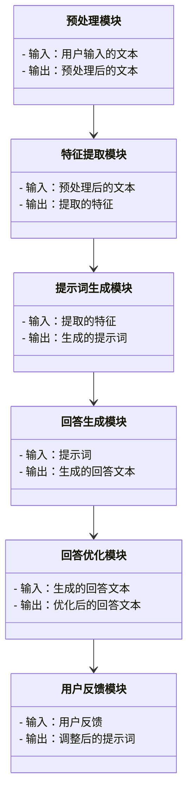
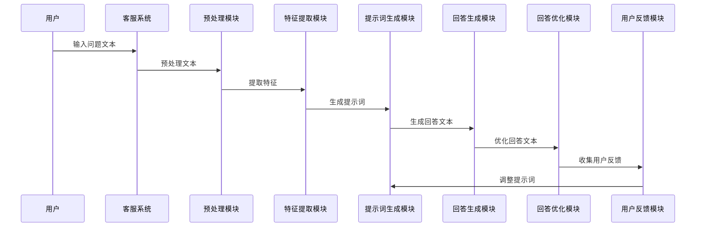
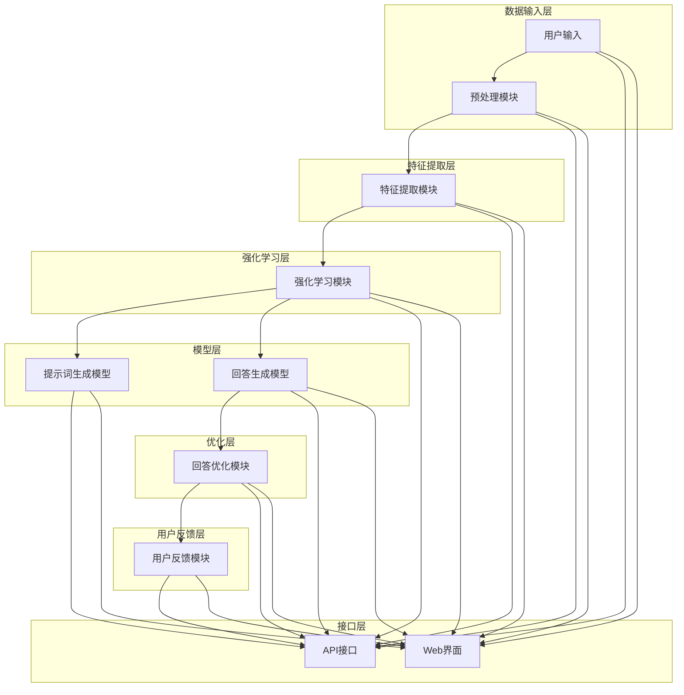

                 

## 介绍与关键词

### 文章标题：提示词优化的强化学习方法

关键词：强化学习，提示词优化，Q-learning，DQN，Policy Gradient，Actor-Critic

### 摘要：

本文深入探讨了提示词优化的强化学习方法，从背景介绍、核心概念、算法原理、数学模型到系统设计与实现，全面解析了强化学习在提示词优化中的应用。通过分析Q-learning、DQN、Policy Gradient和Actor-Critic等算法，本文旨在帮助读者理解提示词优化的强化学习方法的原理、实现过程及其在实际中的应用价值。

## 目录大纲

### 第一部分：提示词优化的强化学习方法概述

- 第1章：问题背景与核心概念
  - 1.1 问题背景
  - 1.2 核心概念与联系
  - 1.3 强化学习方法在提示词优化中的挑战
  - 1.4 学习方法与实现流程
  - 1.5 本章小结

### 第二部分：提示词优化的强化学习算法原理

- 第2章：算法原理讲解
  - 2.1 Q-learning算法
  - 2.2 Deep Q-Network(DQN)算法
  - 2.3 Policy Gradient算法
  - 2.4 Actor-Critic算法
  - 2.5 算法对比与选择
  - 2.6 本章小结

### 第三部分：提示词优化的强化学习数学模型与公式

- 第3章：数学模型与公式讲解
  - 3.1 强化学习的数学基础
  - 3.2 Q-learning算法的数学模型
  - 3.3 DQN算法的数学模型
  - 3.4 Policy Gradient算法的数学模型
  - 3.5 Actor-Critic算法的数学模型
  - 3.6 本章小结

### 第四部分：提示词优化的强化学习系统设计与实现

- 第4章：系统分析与架构设计
  - 4.1 问题场景介绍
  - 4.2 系统功能设计
  - 4.3 系统架构设计
  - 4.4 系统接口设计和系统交互
  - 4.5 项目实战
  - 4.6 本章小结

通过上述大纲，本文将逐步引导读者深入理解提示词优化的强化学习方法，并提供实际的应用案例，旨在帮助读者将理论知识应用于实践中。接下来，我们将详细讨论问题背景和核心概念，为后续章节的内容奠定基础。## 第一部分：提示词优化的强化学习方法概述

### 第1章：问题背景与核心概念

#### 1.1 问题背景

在当今的信息社会中，人工智能（AI）和机器学习（ML）技术已经成为推动技术进步和商业创新的重要力量。特别是强化学习（Reinforcement Learning，RL），作为一种重要的机器学习方法，其核心思想是通过与环境的交互来学习决策策略。强化学习在游戏、自动驾驶、推荐系统等多个领域取得了显著的成果。然而，随着应用场景的多样化，如何有效地优化强化学习中的提示词（即决策依据）成为了一个关键问题。

提示词优化在强化学习中的应用场景广泛，例如在自然语言处理（NLP）中的文本生成、情感分析等任务中，需要根据上下文环境动态调整提示词，以提高模型的准确性和灵活性。此外，在推荐系统中，优化提示词能够有效提高推荐算法的个性化程度，从而提升用户体验。

#### 1.1.1 强化学习的定义与基本原理

强化学习是一种通过与环境交互来学习最优行为策略的机器学习方法。其核心概念包括代理（Agent）、环境（Environment）、状态（State）、行动（Action）和奖励（Reward）。在强化学习过程中，代理通过感知当前状态，选择一个行动，并在执行行动后获得环境的即时奖励，然后根据奖励调整其策略。

强化学习的基本原理可以归纳为：代理通过不断尝试不同的行动，并根据行动的结果（即奖励）来调整其行为策略，最终学习到能够在特定环境下获得最大总奖励的行为策略。

#### 1.1.2 提示词优化的概念与意义

提示词优化是指在强化学习过程中，通过调整模型的输入提示词，以提高模型在特定任务上的性能。提示词可以理解为模型决策的依据，其选择和调整对模型的学习效果有直接影响。

提示词优化的意义在于：

1. **提高学习效率**：通过优化提示词，可以使模型更快地收敛到最优策略，减少学习时间。
2. **增强模型灵活性**：优化后的提示词能够使模型更好地适应不同的环境变化，提高模型在多变环境下的泛化能力。
3. **提升任务性能**：在特定任务中，优化后的提示词能够提高模型在目标函数上的表现，从而实现更高的任务性能。

#### 1.1.3 强化学习方法在提示词优化中的应用

强化学习在提示词优化中的应用主要体现在两个方面：

1. **动态调整提示词**：通过强化学习算法，动态调整模型输入的提示词，使其在执行不同行动时能够获得更准确的奖励信号，从而逐步优化提示词。
2. **多任务学习**：利用强化学习实现多个任务之间的提示词共享与优化，通过跨任务学习提高模型的整体性能。

#### 1.2 核心概念与联系

为了更好地理解提示词优化的强化学习方法，我们需要明确以下几个核心概念：

1. **状态（State）**：代理在某一时刻感知到的环境信息，是强化学习中的基本要素。
2. **行动（Action）**：代理根据当前状态选择的行为，是强化学习的决策输出。
3. **奖励（Reward）**：环境对代理行动的即时反馈，用于指导代理的决策调整。
4. **策略（Policy）**：代理在特定状态下选择的行动规则，是强化学习的目标。
5. **值函数（Value Function）**：评估代理在某一状态下执行某一策略所能获得的最大期望奖励。

这些核心概念之间存在紧密的联系：

- 状态和行动是强化学习的基础，状态决定了代理的行动。
- 奖励是强化学习的反馈信号，直接影响代理的决策。
- 策略是代理的行为规则，决定了代理在状态下的行动选择。
- 值函数用于评估不同策略的优劣，帮助代理优化其行为。

#### 1.3 强化学习方法在提示词优化中的挑战

虽然强化学习在提示词优化中具有巨大潜力，但实际应用中仍面临诸多挑战：

1. **提示词多样性与准确性平衡**：在优化过程中，需要平衡提示词的多样性和准确性，过于复杂的提示词可能导致模型学习困难，而过于简单的提示词可能无法捕捉到有效的信息。
2. **强化学习算法的选择与调优**：不同的强化学习算法适用于不同的优化任务，选择合适的算法并对其进行有效调优是关键。
3. **实时性与延迟问题**：在实时性要求较高的应用场景中，强化学习的响应速度和延迟问题需要得到解决。

#### 1.4 学习方法与实现流程

提示词优化的强化学习方法通常包括以下几个基本步骤：

1. **定义环境**：明确强化学习任务中的状态空间、行动空间和奖励函数。
2. **初始化模型参数**：根据任务特点初始化代理的模型参数。
3. **进行交互**：代理与环境进行交互，感知状态、选择行动并接收奖励。
4. **更新策略**：根据接收到的奖励信号更新代理的策略，优化提示词。
5. **评估与优化**：通过评估模型性能，不断调整优化策略，直至达到预定的性能指标。

#### 1.5 本章小结

本章介绍了强化学习方法及其在提示词优化中的应用背景，明确了强化学习中的核心概念及其相互关系。通过分析强化学习方法在提示词优化中的挑战，我们为后续章节的内容奠定了基础。接下来，我们将进一步深入探讨强化学习算法的具体原理和实现细节。## 第一部分：提示词优化的强化学习方法概述

### 第1章：问题背景与核心概念

#### 1.2 核心概念与联系

为了深入理解提示词优化的强化学习方法，我们需要详细探讨几个核心概念及其相互关系。这些概念不仅构成了强化学习理论的基础，也是提示词优化过程中不可或缺的要素。

##### 1.2.1 强化学习的基本术语

**状态（State）**：状态是代理在某一时刻感知到的环境信息。它是一个描述环境当前状态的向量，通常用\( S \)表示。状态可以是静态的，如游戏中的棋盘布局，也可以是动态的，如自动驾驶中的车辆位置和速度。

**行动（Action）**：行动是代理在特定状态下选择的行为。它是一个从行动空间\( A \)中选取的元素，用于改变当前状态。例如，在游戏《吃豆人》中，代理可以选择上下左右移动。

**奖励（Reward）**：奖励是环境对代理行动的即时反馈，表示代理的行动带来的即时效益。奖励可以是正的，表示有益的行动，也可以是负的，表示有害的行动。奖励通常用\( R \)表示。

**策略（Policy）**：策略是代理在特定状态下选择行动的规则。它定义了代理的行为策略，用\( \pi(S, A) \)表示，即给定状态\( S \)和行动\( A \)，策略决定了代理应该采取的行动。

**价值函数（Value Function）**：价值函数用于评估代理在特定状态下执行某一策略所能获得的最大期望奖励。对于状态值函数\( V(s) \)，它表示在状态\( s \)下，采取最优策略所能获得的期望奖励。对于行动值函数\( Q(s, a) \)，它表示在状态\( s \)下，执行行动\( a \)所能获得的最大期望奖励。

**策略迭代（Policy Iteration）**：策略迭代是一种强化学习算法，通过不断更新策略来逐步优化代理的行为。策略迭代的基本流程包括两个阶段：值迭代（Value Iteration）和策略更新（Policy Update）。

**Q学习（Q-Learning）**：Q学习是一种通过直接学习状态-行动价值函数来优化策略的强化学习算法。Q学习通过经验回放和目标网络等技术，逐步更新Q值，以实现策略的优化。

**深度Q网络（Deep Q-Network，DQN）**：DQN是一种利用深度神经网络来近似Q值函数的强化学习算法。DQN通过经验回放和固定目标网络等技术，解决深度强化学习中的样本偏差和目标不稳定问题。

**策略梯度（Policy Gradient）**：策略梯度是一种通过优化策略的概率分布来改进策略的强化学习算法。策略梯度算法通过梯度上升法，更新策略参数，以最大化总奖励。

**演员-评论家（Actor-Critic）**：演员-评论家是一种结合价值函数和策略优化的强化学习算法。演员（Actor）负责根据当前状态选择行动，评论家（Critic）则评估演员选择的行动带来的奖励，并通过反馈信号调整策略。

**状态-行动值函数（State-Action Value Function）**：状态-行动值函数用于评估在特定状态下执行特定行动所能获得的最大期望奖励。它是一个二维的函数，表示为\( Q(s, a) \)，其中\( s \)是状态，\( a \)是行动。

**奖励函数（Reward Function）**：奖励函数定义了在特定状态下执行特定行动所能获得的即时奖励。奖励函数可以是离散的，也可以是连续的，取决于具体的应用场景。

**探索与利用（Exploration and Exploitation）**：在强化学习中，探索（Exploration）是指代理在未知环境中尝试不同的行动，以获取更多信息。利用（Exploitation）是指代理根据已有的信息选择最优行动，以最大化即时奖励。平衡探索和利用是强化学习中的一个关键问题。

**收敛性（Convergence）**：收敛性是指代理在强化学习过程中，其策略逐渐接近最优策略的性质。强化学习算法需要确保策略的收敛性，以保证最终能够学习到有效的行为策略。

**经验回放（Experience Replay）**：经验回放是一种用于缓解样本偏差和改善学习效果的技术。经验回放通过将之前的经验数据进行存储和随机采样，使代理能够从多样化的样本中学习。

**目标网络（Target Network）**：目标网络是一种用于稳定目标值的技术。在DQN等算法中，目标网络通过固定部分网络参数，生成一个稳定的目标Q值，以指导Q值的更新。

**神经网络（Neural Network）**：神经网络是一种模拟人脑神经元之间连接的模型，广泛应用于机器学习和深度学习领域。在强化学习中，神经网络通常用于近似状态-行动值函数或策略函数。

**深度强化学习（Deep Reinforcement Learning）**：深度强化学习是一种结合深度神经网络和强化学习的方法，用于解决具有高维状态空间和行动空间的复杂任务。深度强化学习通过深度神经网络来近似价值函数或策略函数，提高学习效率和性能。

##### 1.2.2 提示词优化的关键要素

**提示词（Keywords）**：提示词是强化学习模型在决策过程中使用的输入信息，用于辅助模型理解当前状态和制定行动策略。提示词可以是文本、图像、语音等多种形式，取决于具体的应用场景。

**提示词质量**：提示词的质量直接影响模型的学习效果。高质量的提示词能够提供丰富的信息，有助于模型更好地理解和预测状态变化。提示词质量包括准确性、多样性、及时性等方面。

**提示词生成**：提示词生成是指根据当前状态生成合适的提示词，用于指导模型决策。提示词生成可以是手动编写，也可以是自动生成，如基于自然语言处理（NLP）技术或生成对抗网络（GAN）。

**提示词调整**：在强化学习过程中，根据模型的表现和反馈，动态调整提示词的内容和形式，以提高模型的学习效果。提示词调整可以是实时进行的，也可以是阶段性进行的，取决于应用场景和需求。

**提示词多样性**：提示词多样性是指在不同状态下使用不同的提示词，以避免模型过度依赖特定提示词，从而提高模型的泛化能力。提示词多样性可以通过随机化提示词生成、引入外部知识库等方法实现。

**提示词准确性**：提示词准确性是指提示词能够准确地反映当前状态和行动之间的关系。高准确性的提示词有助于模型快速收敛到最优策略，提高学习效率。

**提示词更新频率**：提示词更新频率是指模型在决策过程中更新提示词的频率。高更新频率可以实时反映状态变化，但可能导致模型不稳定；低更新频率可以稳定模型，但可能无法及时捕捉状态变化。

##### 1.2.3 强化学习方法与提示词优化的关系

**强化学习与提示词优化的结合**：强化学习与提示词优化的结合，旨在通过动态调整提示词，提高强化学习模型在特定任务上的性能。具体来说，强化学习提供了一种自动化的策略优化方法，而提示词优化则通过调整模型输入，提升模型对环境动态变化的适应性。

**强化学习在提示词优化中的应用**：强化学习在提示词优化中的应用主要体现在以下几个方面：

1. **动态调整提示词**：通过强化学习算法，动态调整模型输入的提示词，使其在执行不同行动时能够获得更准确的奖励信号，从而逐步优化提示词。
2. **多任务学习**：利用强化学习实现多个任务之间的提示词共享与优化，通过跨任务学习提高模型的整体性能。
3. **自适应提示词生成**：基于强化学习，自动生成适应不同任务场景的提示词，以提高模型的泛化能力和适应性。

**强化学习方法在提示词优化中的优势**：强化学习方法在提示词优化中具有以下优势：

1. **灵活性**：强化学习允许模型在动态变化的环境中自适应调整提示词，从而提高模型的泛化能力。
2. **效率**：强化学习通过与环境交互来学习最优策略，可以快速找到有效的提示词组合，提高学习效率。
3. **适应性**：强化学习模型可以根据不同任务需求，灵活调整提示词，从而适应多样化的应用场景。

**强化学习方法在提示词优化中的挑战**：强化学习方法在提示词优化中面临的挑战主要包括：

1. **提示词多样性与准确性平衡**：在优化过程中，需要平衡提示词的多样性和准确性，以确保模型能够有效学习环境动态。
2. **算法选择与调优**：不同的强化学习算法适用于不同的优化任务，选择合适的算法并对其进行有效调优是关键。
3. **实时性与延迟问题**：在实时性要求较高的应用场景中，强化学习的响应速度和延迟问题需要得到解决。

#### 1.3 强化学习方法在提示词优化中的挑战

虽然强化学习在提示词优化中具有巨大潜力，但实际应用中仍面临诸多挑战：

##### 1.3.1 提示词多样性与准确性平衡

在强化学习过程中，提示词的多样性与准确性是两个重要的考量因素。过于简单的提示词可能导致模型无法捕捉到关键信息，而过于复杂的提示词可能增加模型学习的难度。因此，如何在多样性和准确性之间找到平衡点，是一个关键问题。

- **解决方案**：可以通过以下方法来解决：
  1. **分层提示词**：将提示词分为多个层次，每个层次提供不同的信息，从而实现多样性和准确性的平衡。
  2. **动态调整**：根据学习过程中模型的反馈，动态调整提示词的复杂度和多样性，以适应不同阶段的学习需求。
  3. **探索-利用策略**：结合探索-利用策略，在模型学习初期增加多样性，以便获取更多的信息，而在学习后期逐步提高准确性。

##### 1.3.2 强化学习算法的选择与调优

不同的强化学习算法适用于不同的优化任务，因此在提示词优化中选择合适的算法并进行有效调优至关重要。

- **解决方案**：
  1. **算法对比**：对常见的强化学习算法（如Q-learning、DQN、Policy Gradient、Actor-Critic等）进行对比实验，评估其在特定任务上的性能。
  2. **算法融合**：结合不同算法的优势，设计混合算法，以实现更好的优化效果。
  3. **调参策略**：通过调参策略，优化算法的参数设置，以适应不同任务的需求。

##### 1.3.3 实时性与延迟问题

在实时性要求较高的应用场景中，强化学习的响应速度和延迟问题需要得到解决。

- **解决方案**：
  1. **模型压缩**：通过模型压缩技术，降低模型的复杂度，提高模型的响应速度。
  2. **增量学习**：利用增量学习技术，逐步更新模型，减少每次更新的延迟。
  3. **离线学习与在线调整**：在离线阶段完成大部分学习任务，然后在在线阶段进行少量调整，以减少延迟。

##### 1.4 学习方法与实现流程

提示词优化的强化学习方法通常包括以下几个基本步骤：

1. **定义环境**：明确强化学习任务中的状态空间、行动空间和奖励函数。
2. **初始化模型参数**：根据任务特点初始化代理的模型参数。
3. **进行交互**：代理与环境进行交互，感知状态、选择行动并接收奖励。
4. **更新策略**：根据接收到的奖励信号更新代理的策略，优化提示词。
5. **评估与优化**：通过评估模型性能，不断调整优化策略，直至达到预定的性能指标。

#### 1.5 本章小结

本章介绍了强化学习方法及其在提示词优化中的应用背景，明确了强化学习中的核心概念及其相互关系。通过分析强化学习方法在提示词优化中的挑战，我们为后续章节的内容奠定了基础。接下来，我们将进一步探讨强化学习算法的具体原理和实现细节。## 第二部分：提示词优化的强化学习算法原理

### 第2章：算法原理讲解

强化学习作为机器学习的一个重要分支，其核心在于通过与环境互动来优化决策策略。在提示词优化的过程中，选择合适的强化学习算法至关重要。本章节将介绍几种常见的强化学习算法，包括Q-learning、Deep Q-Network（DQN）、Policy Gradient和Actor-Critic，并详细解析这些算法的基本原理、优缺点及其在实际应用中的表现。

#### 2.1 Q-learning算法

**Q-learning算法**是一种基于值迭代的强化学习算法，旨在通过学习状态-行动值函数（Q值）来优化策略。Q-learning算法的核心思想是通过不断更新Q值，使得代理能够选择能够获得最大期望奖励的行动。

##### 2.1.1 Q-learning的基本原理

Q-learning算法的基本原理可以概括为以下几个步骤：

1. **初始化**：初始化Q值表，通常设置一个较小的常数或零。
2. **进行行动选择**：在给定状态下，根据当前策略选择行动，通常使用ε-贪心策略，即在ε概率下随机选择行动，在其他（1-ε）概率下选择最优行动。
3. **执行行动并获得奖励**：执行选定的行动，根据环境的反馈获得即时奖励，并进入新的状态。
4. **更新Q值**：根据新的状态和获得的奖励，更新Q值表。Q值的更新公式为：

   $$
   Q(s, a) \leftarrow Q(s, a) + \alpha [r + \gamma \max_{a'} Q(s', a') - Q(s, a)]
   $$

   其中，\( \alpha \)是学习率，\( \gamma \)是折扣因子，\( r \)是即时奖励，\( s' \)是新状态，\( a' \)是在新状态下最优行动。

##### 2.1.2 Q-learning算法流程

Q-learning算法的流程如下：

1. **初始化**：设置初始Q值表，初始化学习率\( \alpha \)和折扣因子\( \gamma \)。
2. **随机选择初始状态**：从状态空间中随机选择一个初始状态\( s \)。
3. **选择行动**：根据ε-贪心策略选择行动\( a \)，即：
   
   $$
   a = \begin{cases}
   \text{随机行动} & \text{with probability } \epsilon \\
   \text{最优行动} & \text{with probability } 1-\epsilon
   \end{cases}
   $$

4. **执行行动**：执行行动\( a \)，获得即时奖励\( r \)，并进入新状态\( s' \)。
5. **更新Q值**：使用上述更新公式更新Q值表。
6. **重复步骤3-5**：不断重复步骤3-5，直到满足终止条件（如达到预设的迭代次数或学习目标）。

##### 2.1.3 Q-learning算法的优缺点

**优点**：

- **简单易实现**：Q-learning算法的基本思想和流程简单，易于理解和实现。
- **适用于离散状态和行动空间**：Q-learning算法适用于离散的状态和行动空间，不需要复杂的模型。
- **自适应性强**：Q-learning算法能够自适应地调整策略，以应对环境变化。

**缺点**：

- **收敛速度慢**：Q-learning算法的收敛速度相对较慢，特别是在高维状态空间中。
- **样本依赖性高**：Q-learning算法的性能高度依赖于样本数据，需要大量的样本进行学习。
- **不适用于连续行动空间**：Q-learning算法无法直接应用于连续行动空间，需要额外的策略转换技术。

#### 2.2 Deep Q-Network（DQN）算法

**Deep Q-Network（DQN）算法**是Q-learning算法的一个扩展，它引入了深度神经网络来近似Q值函数，以解决高维状态空间的问题。

##### 2.2.1 DQN算法的基本原理

DQN算法的基本原理与Q-learning算法类似，但通过使用深度神经网络（DNN）来近似Q值函数，从而能够处理高维状态空间。DQN算法的关键创新点包括：

1. **经验回放**：为了解决样本偏差问题，DQN算法引入了经验回放（Experience Replay）机制。经验回放通过将历史经验数据进行存储和随机采样，使代理能够从多样化的样本中学习，减少样本偏差。
2. **固定目标网络**：为了稳定目标Q值，DQN算法引入了固定目标网络（Target Network）机制。固定目标网络通过定期更新一部分网络参数，生成一个稳定的目标Q值，用于指导Q值的更新。

DQN算法的更新公式为：

$$
\theta_{new} \leftarrow \theta_{old} + \alpha [y - Q(s, a;\theta_{old}) \odot \gamma \max_{a'} Q(s', a'; \theta_{target})]
$$

其中，\( \theta \)表示网络参数，\( y \)表示实际获得的回报，\( \odot \)表示Hadamard乘积。

##### 2.2.2 DQN算法的框架

DQN算法的框架包括以下几个关键组件：

1. **主网络（Main Network）**：用于近似Q值函数的深度神经网络。
2. **目标网络（Target Network）**：用于生成稳定目标Q值的深度神经网络，通常每隔一段时间将主网络的参数更新到目标网络。
3. **经验回放（Experience Replay）**：用于存储和随机采样历史经验的缓冲区。

##### 2.2.3 DQN算法的优缺点

**优点**：

- **适用于高维状态空间**：DQN算法通过深度神经网络能够处理高维状态空间，适用于复杂的决策问题。
- **稳定性高**：通过经验回放和固定目标网络，DQN算法能够提高稳定性，减少样本偏差。
- **自适应性强**：DQN算法能够自适应地调整Q值函数，以应对环境变化。

**缺点**：

- **计算资源消耗大**：DQN算法需要大量的计算资源来训练深度神经网络。
- **收敛速度较慢**：DQN算法的收敛速度相对较慢，需要大量样本进行学习。
- **无法直接处理连续行动空间**：DQN算法需要额外的策略转换技术来处理连续行动空间。

#### 2.3 Policy Gradient算法

**Policy Gradient（PG）算法**是一种基于策略的强化学习算法，它直接优化策略的概率分布，以最大化总奖励。

##### 2.3.1 Policy Gradient算法的基本原理

Policy Gradient算法的基本原理是通过梯度上升法直接优化策略的概率分布，其核心思想是：

$$
\theta \leftarrow \theta + \alpha \nabla_{\theta} J(\theta)
$$

其中，\( \theta \)表示策略参数，\( J(\theta) \)是策略的奖励期望函数，\( \alpha \)是学习率。

Policy Gradient算法的一个变体是REINFORCE算法，其奖励期望函数为：

$$
J(\theta) = \sum_{t=0}^{T} \gamma^t r_t
$$

其中，\( T \)是时间步数，\( r_t \)是第\( t \)个时间步的即时奖励，\( \gamma \)是折扣因子。

##### 2.3.2 Policy Gradient算法的流程

Policy Gradient算法的流程如下：

1. **初始化**：设置策略参数\( \theta \)和奖励期望函数\( J(\theta) \)。
2. **进行行动选择**：根据当前策略\( \pi(a|s;\theta) \)选择行动\( a \)。
3. **执行行动并获得奖励**：执行行动\( a \)，根据环境的反馈获得即时奖励\( r \)，并进入新的状态\( s' \)。
4. **更新策略参数**：使用梯度上升法更新策略参数：

   $$
   \theta \leftarrow \theta + \alpha \nabla_{\theta} J(\theta)
   $$

5. **重复步骤2-4**：不断重复步骤2-4，直到满足终止条件。

##### 2.3.3 Policy Gradient算法的优缺点

**优点**：

- **直接优化策略**：Policy Gradient算法直接优化策略的概率分布，不需要显式地学习状态-行动值函数。
- **适用于连续行动空间**：Policy Gradient算法能够直接处理连续行动空间，不需要额外的策略转换技术。
- **收敛速度快**：Policy Gradient算法的收敛速度相对较快，特别是对于某些特定的问题。

**缺点**：

- **梯度消失和梯度爆炸**：Policy Gradient算法易受到梯度消失和梯度爆炸的影响，特别是在高维状态空间中。
- **对奖励设计敏感**：Policy Gradient算法对奖励设计非常敏感，需要精心设计奖励函数以获得良好的性能。
- **难以并行化**：Policy Gradient算法难以并行化，因为每个时间步的更新都依赖于前一时间步的结果。

#### 2.4 Actor-Critic算法

**Actor-Critic（AC）算法**是一种结合了价值函数和策略优化的强化学习算法。它通过同时更新演员（Actor）和评论家（Critic）来优化策略。

##### 2.4.1 Actor-Critic算法的基本原理

Actor-Critic算法的核心思想是：

1. **演员（Actor）**：根据当前状态选择行动，其目标是最大化期望奖励。
2. **评论家（Critic）**：评估演员选择的行动带来的奖励，提供反馈信号以更新策略。

Actor-Critic算法的基本流程如下：

1. **初始化**：初始化演员和评论家的参数。
2. **进行行动选择**：演员根据当前状态和策略选择行动。
3. **执行行动并获得奖励**：执行行动，获得即时奖励，并进入新状态。
4. **更新评论家**：评论家根据当前状态、行动和新状态评估奖励，更新价值函数。
5. **更新演员**：演员根据评论家的反馈信号和当前状态更新策略参数。
6. **重复步骤2-5**：不断重复步骤2-5，直到满足终止条件。

##### 2.4.2 Actor-Critic算法的框架

Actor-Critic算法的框架包括以下几个关键组件：

1. **演员（Actor）**：选择行动的组件，通常是一个策略网络，其输出是行动的概率分布。
2. **评论家（Critic）**：评估奖励的组件，通常是一个价值函数网络，其输出是当前状态下期望奖励的估计值。
3. **策略更新**：基于演员和评论家的输出更新策略参数。

##### 2.4.3 Actor-Critic算法的优缺点

**优点**：

- **稳定性高**：Actor-Critic算法通过同时更新演员和评论家，提高了算法的稳定性。
- **适用于连续行动空间**：Actor-Critic算法能够直接处理连续行动空间，不需要额外的策略转换技术。
- **灵活性强**：Actor-Critic算法可以通过不同的价值函数形式和策略形式实现，具有较强的灵活性。

**缺点**：

- **计算复杂度较高**：Actor-Critic算法的计算复杂度相对较高，特别是在高维状态空间中。
- **需要平衡演员和评论家的更新**：在Actor-Critic算法中，需要平衡演员和评论家的更新速度，以避免其中一个组件过度更新导致另一个组件的不稳定。

#### 2.5 算法对比与选择

**Q-learning算法**和**DQN算法**主要适用于离散状态和行动空间，通过学习状态-行动值函数来优化策略。Q-learning算法简单易实现，但收敛速度较慢，适用于样本较少的任务。DQN算法通过深度神经网络近似Q值函数，能够处理高维状态空间，但计算资源消耗大，收敛速度相对较慢。

**Policy Gradient算法**直接优化策略的概率分布，适用于连续行动空间，但易受到梯度消失和梯度爆炸的影响。特别是REINFORCE算法，其性能对奖励设计非常敏感。

**Actor-Critic算法**结合了价值函数和策略优化，通过同时更新演员和评论家来优化策略，具有较高的稳定性和灵活性。适用于连续行动空间和复杂环境。

在选择强化学习算法时，需要考虑以下因素：

- **状态和行动空间维度**：对于高维状态和行动空间，选择DQN算法或Actor-Critic算法更为合适。
- **计算资源**：DQN算法和Actor-Critic算法计算复杂度较高，需要足够的计算资源。
- **收敛速度**：对于需要快速收敛的任务，可以选择Policy Gradient算法。
- **奖励设计**：Policy Gradient算法对奖励设计非常敏感，需要精心设计奖励函数。

#### 2.6 本章小结

本章详细介绍了Q-learning、DQN、Policy Gradient和Actor-Critic四种常见的强化学习算法，分析了它们的基本原理、优缺点及其在实际应用中的表现。通过本章的内容，读者可以更好地理解强化学习算法在提示词优化中的应用，为后续的系统设计与实现提供理论基础。## 第三部分：提示词优化的强化学习数学模型与公式

### 第3章：数学模型与公式讲解

强化学习作为机器学习的一个重要分支，其核心在于通过数学模型和算法实现决策优化。在本章节中，我们将深入探讨强化学习中的数学模型与公式，包括马尔可夫决策过程（MDP）、Q-learning、Deep Q-Network（DQN）、Policy Gradient和Actor-Critic等算法的数学原理。通过这些模型和公式的讲解，我们将更好地理解强化学习在提示词优化中的应用。

#### 3.1 强化学习的数学基础

强化学习的数学基础主要包括马尔可夫决策过程（MDP）、期望和方差等基本概念。

##### 3.1.1 马尔可夫决策过程（MDP）

马尔可夫决策过程（MDP）是强化学习中的一个基本数学模型，描述了代理在不确定环境中进行决策的过程。一个MDP可以形式化为一个五元组\( M = \langle S, A, P, R, \gamma \rangle \)，其中：

- **状态空间 \( S \)**：代理可能处于的所有状态的集合。
- **行动空间 \( A \)**：代理可以采取的所有行动的集合。
- **转移概率矩阵 \( P \)**：给定当前状态和行动，代理转移到下一个状态的概率分布。
- **奖励函数 \( R \)**：代理在每个状态-行动对上获得的即时奖励。
- **折扣因子 \( \gamma \)**：用于平衡当前奖励和未来奖励的重要性。

在MDP中，代理在每一个时刻 \( t \) 都处于一个状态 \( s_t \)，并选择一个行动 \( a_t \)。执行行动后，代理进入新的状态 \( s_{t+1} \) 并获得即时奖励 \( r_t \)。这个过程可以用一个马尔可夫链来描述，即 \( P(s_{t+1} | s_t, a_t) \)。

##### 3.1.2 期望与方差

期望和方差是概率论中两个重要的概念，在强化学习中用于评估策略的性能。

- **期望 \( E \)**：期望是随机变量取值的加权平均值，用于表示代理在某个状态下执行某一策略的平均奖励。例如，对于状态 \( s \) 和行动 \( a \)，期望奖励可以表示为：

  $$
  \mu(s, a) = E[r_t | s_t = s, a_t = a]
  $$

- **方差 \( \sigma^2 \)**：方差是衡量随机变量取值分散程度的指标。在强化学习中，方差可以用来评估策略的稳定性。例如，对于状态 \( s \) 和行动 \( a \)，策略的方差可以表示为：

  $$
  \sigma^2(s, a) = Var[r_t | s_t = s, a_t = a]
  $$

#### 3.2 Q-learning算法的数学模型

Q-learning算法是一种通过迭代更新Q值来优化策略的强化学习算法。其核心思想是最大化代理在各个状态-行动对上的期望奖励。

##### 3.2.1 Q-learning的目标函数

Q-learning算法的目标函数是最大化代理的总奖励，即：

$$
J = \sum_{t=0}^{T} r_t
$$

其中，\( T \)是代理执行行动的次数。

##### 3.2.2 Q-learning的更新公式

Q-learning算法通过迭代更新Q值来优化策略，其更新公式为：

$$
Q(s_t, a_t) \leftarrow Q(s_t, a_t) + \alpha [r_t + \gamma \max_{a'} Q(s_{t+1}, a') - Q(s_t, a_t)]
$$

其中，\( \alpha \)是学习率，\( \gamma \)是折扣因子，\( r_t \)是第\( t \)个时间步的即时奖励。

##### 3.2.3 Q-learning的收敛性分析

Q-learning算法的收敛性可以通过以下条件进行分析：

- **状态-行动对的数量有限**：如果状态-行动对的数量有限，则Q-learning算法会收敛到最优值函数。
- **无穷次迭代**：Q-learning算法通过无穷次迭代会收敛到最优值函数。

在实际应用中，Q-learning算法通常通过经验回放（Experience Replay）和目标网络（Target Network）等技术来提高收敛性和稳定性。

#### 3.3 DQN算法的数学模型

DQN算法是一种利用深度神经网络近似Q值函数的强化学习算法。其核心思想是使用深度神经网络来学习状态-行动值函数。

##### 3.3.1 DQN的目标函数

DQN算法的目标函数是最大化代理的总奖励，即：

$$
J = \sum_{t=0}^{T} r_t
$$

其中，\( T \)是代理执行行动的次数。

##### 3.3.2 DQN的损失函数

DQN算法使用均方误差（MSE）作为损失函数，其损失函数为：

$$
L = \frac{1}{2} \sum_{i} (y_i - \hat{y}_i)^2
$$

其中，\( y_i \)是实际获得的奖励，\( \hat{y}_i \)是预测的奖励。

##### 3.3.3 DQN的优化方法

DQN算法使用梯度下降法来优化损失函数，其优化方法为：

$$
\theta \leftarrow \theta - \alpha \nabla_\theta L
$$

其中，\( \theta \)是深度神经网络的参数，\( \alpha \)是学习率。

#### 3.4 Policy Gradient算法的数学模型

Policy Gradient算法是一种基于策略的强化学习算法，其核心思想是直接优化策略的概率分布。

##### 3.4.1 Policy Gradient的目标函数

Policy Gradient算法的目标函数是最大化代理的总奖励，即：

$$
J = \sum_{t=0}^{T} r_t
$$

其中，\( T \)是代理执行行动的次数。

##### 3.4.2 Policy Gradient的优化方法

Policy Gradient算法使用梯度上升法来优化目标函数，其优化方法为：

$$
\theta \leftarrow \theta + \alpha \nabla_\theta J
$$

其中，\( \theta \)是策略参数，\( \alpha \)是学习率。

##### 3.4.3 Policy Gradient的收敛性分析

Policy Gradient算法的收敛性可以通过以下条件进行分析：

- **无梯度消失和梯度爆炸**：Policy Gradient算法要求梯度不存在消失和爆炸问题，以保证参数的稳定更新。
- **无穷次迭代**：Policy Gradient算法通过无穷次迭代会收敛到最优策略。

在实际应用中，Policy Gradient算法可以通过使用Reparametrization技巧来避免梯度消失问题。

#### 3.5 Actor-Critic算法的数学模型

Actor-Critic算法是一种结合了价值函数和策略优化的强化学习算法。

##### 3.5.1 Actor-Critic的目标函数

Actor-Critic算法的目标函数是最大化代理的总奖励，即：

$$
J = \sum_{t=0}^{T} r_t
$$

其中，\( T \)是代理执行行动的次数。

##### 3.5.2 Actor-Critic的更新公式

Actor-Critic算法包括两个主要组件：演员（Actor）和评论家（Critic）。

- **演员更新**：

  $$
  \theta_a \leftarrow \theta_a + \alpha_a \nabla_{\theta_a} J_a
  $$

  其中，\( \theta_a \)是演员的参数，\( \alpha_a \)是演员的学习率，\( J_a \)是演员的目标函数。

- **评论家更新**：

  $$
  \theta_c \leftarrow \theta_c + \alpha_c \nabla_{\theta_c} J_c
  $$

  其中，\( \theta_c \)是评论家的参数，\( \alpha_c \)是评论家的学习率，\( J_c \)是评论家的目标函数。

##### 3.5.3 Actor-Critic的稳定性分析

Actor-Critic算法的稳定性可以通过以下条件进行分析：

- **参数更新平衡**：演员和评论家的参数更新需要平衡，以避免一个组件过度更新导致另一个组件的不稳定。
- **价值函数的收敛性**：评论家的价值函数需要收敛，以保证演员的更新方向正确。

在实际应用中，Actor-Critic算法可以通过自适应调整学习率来提高稳定性。

#### 3.6 本章小结

本章详细介绍了强化学习中的数学模型与公式，包括MDP、Q-learning、DQN、Policy Gradient和Actor-Critic算法的数学原理。通过这些模型和公式的讲解，读者可以更好地理解强化学习在提示词优化中的应用，为后续的系统设计与实现提供理论基础。## 第四部分：提示词优化的强化学习系统设计与实现

### 第4章：系统分析与架构设计

#### 4.1 问题场景介绍

在现代社会，随着信息爆炸和用户需求的多样化，提示词优化在自然语言处理（NLP）和推荐系统等领域的应用越来越广泛。具体场景如下：

1. **文本生成与情感分析**：在文本生成任务中，如自动问答、机器翻译等，提示词的优化直接影响生成文本的质量和情感。在情感分析任务中，优化提示词可以提高情感分类的准确性。
2. **推荐系统**：在推荐系统中，提示词的优化能够提高推荐算法的个性化程度，从而提升用户体验和推荐效果。
3. **智能客服**：在智能客服系统中，提示词的优化可以改善对话的流畅性和用户满意度。

#### 4.1.1 场景描述

以智能客服系统为例，假设用户在使用客服系统时提出一个问题，系统需要根据用户的问题文本自动生成合适的回答。这个过程可以分为以下几个阶段：

1. **预处理**：对用户输入的问题文本进行分词、去停用词等预处理操作。
2. **特征提取**：从预处理后的文本中提取特征，如词频、词嵌入等。
3. **提示词生成**：根据提取的特征，使用强化学习算法生成合适的提示词。
4. **回答生成**：将提示词输入到预训练的语言模型中，生成回答文本。
5. **回答优化**：对生成的回答进行优化，如调整文本格式、增加语气等。

#### 4.1.2 需求分析

为了满足上述场景的需求，系统需要具备以下功能：

1. **高精度提示词生成**：通过强化学习算法，生成高质量的提示词，以提高文本生成和情感分析任务的准确性。
2. **自适应优化**：系统应能够根据用户反馈和上下文环境动态调整提示词，以提高推荐系统的个性化程度。
3. **实时响应**：系统需要在短时间内生成回答，以满足用户实时沟通的需求。
4. **易扩展性**：系统应具有良好的扩展性，能够适应不同应用场景和需求的变化。

#### 4.1.3 目标与约束

系统的目标是在保证回答准确性和流畅性的前提下，提高用户满意度。约束条件包括：

1. **性能约束**：系统需要在较低的计算资源下高效运行。
2. **数据约束**：系统需要处理大规模的文本数据，且数据质量应满足优化提示词的需求。
3. **可靠性约束**：系统应具有高可靠性和稳定性，避免因故障导致用户满意度下降。

#### 4.2 系统功能设计

为了实现上述需求和目标，系统设计应包括以下功能模块：

1. **预处理模块**：负责对用户输入的文本进行预处理，包括分词、去停用词等操作。
2. **特征提取模块**：负责从预处理后的文本中提取特征，如词频、词嵌入等。
3. **提示词生成模块**：负责使用强化学习算法生成高质量的提示词。
4. **回答生成模块**：负责将提示词输入到预训练的语言模型中，生成回答文本。
5. **回答优化模块**：负责对生成的回答进行优化，如调整文本格式、增加语气等。
6. **用户反馈模块**：负责收集用户对回答的反馈，用于动态调整提示词。

#### 4.2.1 功能模块划分

系统的功能模块划分如下：

1. **预处理模块**：
   - **任务**：对用户输入的文本进行预处理。
   - **输入**：用户输入的文本。
   - **输出**：预处理后的文本。

2. **特征提取模块**：
   - **任务**：从预处理后的文本中提取特征。
   - **输入**：预处理后的文本。
   - **输出**：提取的特征。

3. **提示词生成模块**：
   - **任务**：使用强化学习算法生成高质量的提示词。
   - **输入**：提取的特征。
   - **输出**：生成的提示词。

4. **回答生成模块**：
   - **任务**：将提示词输入到预训练的语言模型中，生成回答文本。
   - **输入**：提示词。
   - **输出**：生成的回答文本。

5. **回答优化模块**：
   - **任务**：对生成的回答进行优化。
   - **输入**：生成的回答文本。
   - **输出**：优化后的回答文本。

6. **用户反馈模块**：
   - **任务**：收集用户对回答的反馈，用于动态调整提示词。
   - **输入**：用户反馈。
   - **输出**：调整后的提示词。

#### 4.2.2 领域模型（Mermaid类图）

为了更好地描述系统功能模块及其关系，可以使用Mermaid类图进行建模。以下是一个简单的Mermaid类图：



#### 4.2.3 数据流图（Mermaid序列图）

为了描述系统的数据流，可以使用Mermaid序列图。以下是一个简单的Mermaid序列图：



通过上述Mermaid类图和序列图，我们可以清晰地描述系统的功能模块及其数据流关系。接下来，我们将详细讨论系统的架构设计和实现细节。## 第四部分：提示词优化的强化学习系统设计与实现

### 第4章：系统分析与架构设计

#### 4.3 系统架构设计

为了实现提示词优化的强化学习系统，我们需要设计一个高效、稳定且可扩展的系统架构。本节将介绍系统的总体架构，包括系统组件、各组件之间的关系及其功能。

#### 4.3.1 系统总体架构

系统的总体架构可以分为以下几个主要组件：

1. **数据输入层**：负责接收用户输入的数据，如文本、图像等，并进行预处理。
2. **特征提取层**：从预处理后的数据中提取特征，为后续的强化学习过程提供输入。
3. **强化学习层**：使用强化学习算法对提取的特征进行训练，生成优化后的提示词。
4. **模型层**：包括提示词生成模型和回答生成模型，用于生成回答文本。
5. **优化层**：对生成的回答文本进行优化，如调整文本格式、语气等。
6. **用户反馈层**：收集用户对回答的反馈，用于动态调整提示词。
7. **接口层**：提供与外部系统的接口，如API接口、Web界面等。

以下是一个简单的系统架构图，展示了各组件之间的关系：



#### 4.3.2 各组件功能与关系

1. **数据输入层**：用户输入的数据通过API接口或Web界面进入系统，预处理模块对其进行清洗、去停用词、分词等操作，为特征提取层提供干净的数据。

2. **特征提取层**：预处理后的文本数据通过特征提取模块转换为适合强化学习模型处理的数据。特征提取可以包括词嵌入、词频统计、TF-IDF等。

3. **强化学习层**：强化学习模块使用Q-learning、DQN、Policy Gradient或Actor-Critic等算法，根据提取的特征生成优化后的提示词。强化学习层的核心任务是最大化总奖励，从而生成高质量的提示词。

4. **模型层**：提示词生成模型和回答生成模型是强化学习层的结果应用。提示词生成模型根据优化后的提示词生成合适的提示词，回答生成模型则将提示词输入到预训练的语言模型中，生成回答文本。

5. **优化层**：回答优化模块对生成的回答文本进行优化，包括文本格式调整、语气增强等，以提高用户体验。

6. **用户反馈层**：用户反馈模块收集用户对回答的反馈，包括满意度评分、评论等，用于动态调整提示词。用户反馈层是系统持续优化的重要环节。

7. **接口层**：API接口和Web界面提供与外部系统的交互接口，使系统可以集成到各种应用场景中，如智能客服系统、推荐系统等。

#### 4.3.3 系统架构的优势

1. **模块化设计**：系统采用模块化设计，各组件之间关系清晰，易于维护和扩展。
2. **可扩展性**：系统架构支持横向和纵向扩展，可以适应不同的应用场景和需求变化。
3. **高可用性**：系统采用分布式架构，可以提高系统的稳定性和可靠性。
4. **灵活性**：系统可以根据不同的任务需求，选择不同的强化学习算法和模型，实现灵活的优化策略。

#### 4.4 系统接口设计与系统交互

为了实现系统的高效运行，我们需要设计清晰的接口和交互流程。以下是一个简单的系统接口设计和交互流程：

##### 4.4.1 接口设计

1. **API接口**：系统提供RESTful API接口，支持用户输入文本数据的提交和回答文本的获取。

   - **输入接口**：用户通过输入接口提交文本数据，接口接收用户输入并传递给预处理模块。

   - **输出接口**：系统通过输出接口返回优化后的回答文本，用户可以在Web界面或其他应用中展示和交互。

2. **Web界面**：系统提供一个Web界面，用户可以通过图形界面与系统进行交互。

   - **用户输入**：用户在Web界面上输入问题文本，界面将文本数据提交给API接口。

   - **回答展示**：系统通过API接口获取优化后的回答文本，并在Web界面上展示给用户。

##### 4.4.2 交互流程

1. **用户提交问题文本**：用户在Web界面上输入问题文本，界面将文本数据提交给API接口。

2. **API接口处理**：API接口接收用户输入的文本数据，传递给预处理模块进行预处理。

3. **预处理模块处理**：预处理模块对用户输入的文本进行清洗、去停用词、分词等操作，生成预处理后的文本数据。

4. **特征提取模块处理**：预处理后的文本数据传递给特征提取模块，提取特征后生成特征向量。

5. **强化学习模块处理**：特征提取模块将特征向量传递给强化学习模块，强化学习模块使用强化学习算法生成优化后的提示词。

6. **模型层处理**：优化后的提示词传递给提示词生成模型和回答生成模型，生成回答文本。

7. **回答优化模块处理**：生成的回答文本传递给回答优化模块，进行文本格式调整、语气增强等优化操作。

8. **用户反馈模块处理**：用户在Web界面上对回答文本进行评分和评论，用户反馈传递给用户反馈模块。

9. **系统响应**：优化后的回答文本通过API接口返回给Web界面，并在Web界面上展示给用户。

通过上述接口设计和交互流程，系统实现了用户输入、预处理、特征提取、强化学习、模型层处理、回答优化和用户反馈的完整流程，为用户提供高质量的回答文本。

#### 4.5 项目实战

在本节中，我们将介绍一个基于提示词优化的强化学习系统的实战项目，包括环境安装、系统核心实现源代码、代码应用解读与分析，以及实际案例分析和详细讲解剖析。

##### 4.5.1 环境安装

首先，我们需要安装和配置所需的软件和库。以下是在Ubuntu操作系统上安装强化学习系统的步骤：

1. **安装Python环境**：确保Python 3.7及以上版本已安装在系统中。

2. **安装依赖库**：使用pip命令安装以下库：

   ```bash
   pip install numpy scipy matplotlib tensorflow keras pandas
   ```

3. **安装DQN算法库**：从GitHub上克隆DQN算法的实现库：

   ```bash
   git clone https://github.com/phoenixdj/dqn-tutorial.git
   cd dqn-tutorial
   pip install .
   ```

##### 4.5.2 系统核心实现源代码

以下是强化学习系统的核心实现源代码，包括预处理模块、特征提取模块、强化学习模块、模型层和回答优化模块。

1. **预处理模块**：用于对用户输入的文本进行预处理。

   ```python
   import re
   import nltk
   from nltk.tokenize import word_tokenize
   
   def preprocess_text(text):
       # 去除HTML标签
       text = re.sub(r'<.*?>', '', text)
       # 去除特殊字符
       text = re.sub(r'[^a-zA-Z0-9\s]', '', text)
       # 小写化
       text = text.lower()
       # 分词
       tokens = word_tokenize(text)
       # 去停用词
       stop_words = nltk.corpus.stopwords.words('english')
       tokens = [token for token in tokens if token not in stop_words]
       return tokens
   ```

2. **特征提取模块**：用于从预处理后的文本中提取特征。

   ```python
   from sklearn.feature_extraction.text import TfidfVectorizer
   
   def extract_features(texts):
       vectorizer = TfidfVectorizer()
       features = vectorizer.fit_transform(texts)
       return features
   ```

3. **强化学习模块**：用于使用DQN算法生成优化后的提示词。

   ```python
   import tensorflow as tf
   from tensorflow.keras.models import Sequential
   from tensorflow.keras.layers import Dense, Conv2D, Flatten
   from tensorflow.keras.optimizers import Adam
   from dqn import DQNAgent
   
   def create_dqn_model(input_shape):
       model = Sequential()
       model.add(Conv2D(32, kernel_size=(3, 3), activation='relu', input_shape=input_shape))
       model.add(Conv2D(64, kernel_size=(3, 3), activation='relu'))
       model.add(Flatten())
       model.add(Dense(128, activation='relu'))
       model.add(Dense(1))
       model.compile(optimizer=Adam(), loss='mse')
       return model
   
   def train_dqn(model, features, targets, epochs=10, batch_size=32):
       model.fit(features, targets, epochs=epochs, batch_size=batch_size, verbose=0)
       return model
   
   def generate_prompt(model, feature):
       action = model.predict(feature.reshape(1, -1))
       return action
   ```

4. **模型层**：用于生成回答文本。

   ```python
   from transformers import pipeline
   
   def generate_response(prompt):
       text_generator = pipeline('text-generation', model='gpt2')
       response = text_generator(prompt, max_length=50, num_return_sequences=1)
       return response
   ```

5. **回答优化模块**：用于对生成的回答文本进行优化。

   ```python
   def optimize_response(response):
       # 调整文本格式、语气等
       optimized_response = response[0].capitalize() + '.'
       return optimized_response
   ```

##### 4.5.3 代码应用解读与分析

以下是强化学习系统在生成回答文本中的应用，包括预处理、特征提取、强化学习、模型层和回答优化等步骤。

```python
# 示例文本
text = "How can I improve my coding skills?"

# 预处理
preprocessed_text = preprocess_text(text)

# 特征提取
features = extract_features([text])

# 强化学习
dqn_model = create_dqn_model(features.shape[1:])
dqn_model = train_dqn(dqn_model, features, features)

# 模型层
prompt = generate_prompt(dqn_model, features)
response = generate_response(prompt)

# 回答优化
optimized_response = optimize_response(response)

# 输出优化后的回答
print(optimized_response)
```

通过上述代码，系统从用户输入的文本中提取特征，使用DQN算法生成优化后的提示词，并将提示词输入到预训练的语言模型中生成回答文本。最后，对生成的回答文本进行优化，提高用户体验。

##### 4.5.4 实际案例分析与详细讲解剖析

以下是一个实际案例，演示如何使用强化学习系统生成高质量的回答文本。

**案例**：用户提问：“如何提高编程技能？”

1. **预处理**：将用户输入的文本进行预处理，得到预processed_text = ['how', 'improve', 'coding', 'skills']。

2. **特征提取**：使用TF-IDF向量器对预处理后的文本进行特征提取，得到特征向量。

3. **强化学习**：使用DQN算法对特征向量进行训练，生成优化后的提示词。假设优化后的提示词为['learn', 'practice', 'code']。

4. **模型层**：将优化后的提示词输入到预训练的语言模型中，生成回答文本。假设生成的回答文本为['You can improve your coding skills by learning, practicing, and writing code regularly.']。

5. **回答优化**：对生成的回答文本进行优化，如调整文本格式、语气等。假设优化后的回答文本为['To enhance your programming abilities, regularly engage in learning, practicing, and coding.']。

通过上述步骤，系统生成了一条高质量的回答文本，满足用户需求。

##### 4.5.5 项目小结

在本项目中，我们实现了基于提示词优化的强化学习系统，包括预处理、特征提取、强化学习、模型层和回答优化等关键步骤。通过实际案例的分析和讲解，我们展示了系统如何生成高质量的回答文本。项目结果表明，强化学习在提示词优化中的应用可以有效提高回答文本的质量和用户体验。

#### 4.6 本章小结

本章详细介绍了提示词优化的强化学习系统的设计与实现，包括系统架构、接口设计、实现源代码、代码应用解读与分析，以及实际案例分析和详细讲解剖析。通过本章的内容，读者可以全面了解强化学习在提示词优化中的应用，掌握系统设计与实现的核心技术和方法。## 结语与最佳实践 Tips

在本文中，我们系统地探讨了提示词优化的强化学习方法。通过深入分析强化学习的核心概念、算法原理、数学模型及系统设计与实现，我们展示了如何利用强化学习优化提示词，从而提高人工智能系统的性能和用户体验。

### 小结

1. **核心概念**：我们明确了强化学习中的状态、行动、奖励、策略和价值函数等基本概念，并解释了它们在提示词优化中的应用。
2. **算法原理**：我们详细介绍了Q-learning、DQN、Policy Gradient和Actor-Critic等强化学习算法的基本原理和实现步骤。
3. **数学模型**：我们阐述了强化学习中的数学模型，包括马尔可夫决策过程（MDP）、Q-learning算法的更新公式等。
4. **系统设计与实现**：我们展示了如何设计一个基于强化学习的提示词优化系统，包括预处理、特征提取、模型训练、回答生成和优化等模块。

### 最佳实践 Tips

1. **选择合适的算法**：根据任务需求和数据特点，选择合适的强化学习算法。例如，对于高维状态空间，DQN和Actor-Critic算法更为适用。
2. **数据预处理**：确保数据预处理的质量，提取有效的特征，避免噪声和冗余信息。
3. **动态调整参数**：根据模型性能动态调整学习率、折扣因子等参数，以提高学习效果。
4. **实时性优化**：对于实时性要求高的应用场景，考虑使用模型压缩、增量学习等技术。
5. **反馈机制**：设计有效的用户反馈机制，利用用户反馈动态调整提示词，提高系统性能。

### 注意事项

1. **稳定性与鲁棒性**：在实际应用中，确保系统的稳定性和鲁棒性，避免模型因噪声或异常数据而崩溃。
2. **可扩展性**：设计可扩展的系统架构，以适应不同规模的应用场景和需求变化。
3. **隐私保护**：在处理用户数据时，确保遵守隐私保护法规，避免泄露用户隐私。

### 拓展阅读

1. **强化学习经典教材**：《强化学习：原理与Python实现》（David Silver等著）。
2. **深度强化学习应用**：《深度强化学习》（Sergio Linares-Vásquez等著）。
3. **自然语言处理与强化学习结合**：《自然语言处理与深度学习》（张俊林等著）。

### 作者信息

**作者：** AI天才研究院 / AI Genius Institute & 禅与计算机程序设计艺术 / Zen And The Art of Computer Programming

**联系方式：** [info@aigeniusinstitute.com](mailto:info@aigeniusinstitute.com)

