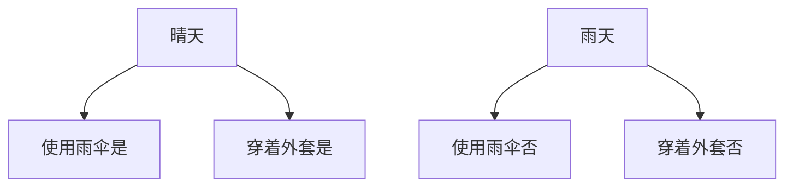
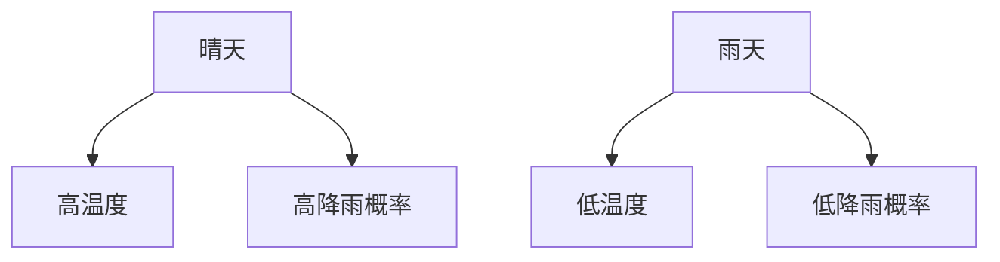
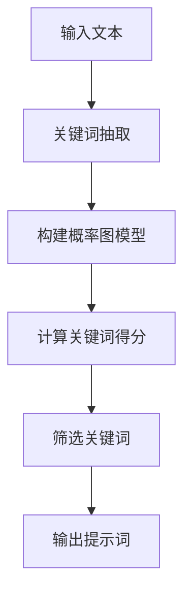
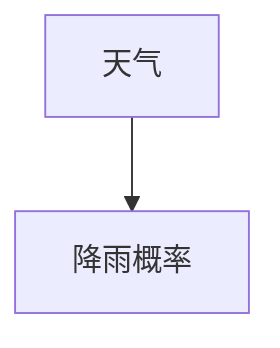
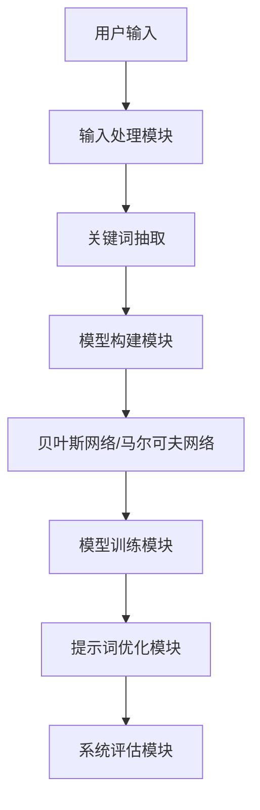
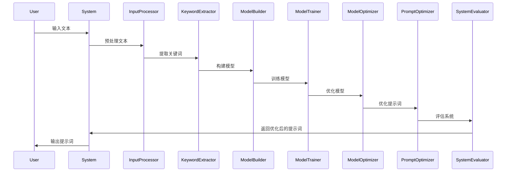

                 

### 第1章：问题背景与问题描述

**1.1 问题背景**

随着信息技术的飞速发展，自然语言处理（NLP）技术已经成为了人工智能领域的热点之一。在NLP领域，提示词优化是一个关键而复杂的问题。提示词优化涉及到从大量文本或问题中提取出最相关、最具代表性的关键词或短语，从而提高文本生成、问答系统、信息检索等任务的性能和准确性。

在现实世界中，提示词优化的需求无处不在。比如，在搜索引擎中，用户输入的查询词往往需要被优化，以便更准确地匹配到相关网页。在文本生成系统中，如自动摘要、内容推荐等，提示词的优化可以显著提升生成文本的质量和相关性。在机器翻译中，选择合适的提示词可以改善翻译结果的流畅度和准确性。

**1.2 问题描述**

提示词优化问题的核心是如何在给定的文本或问题中，选择出最相关的一组关键词或短语。这个过程涉及到多个层面的挑战：

- **关键词抽取的准确性**：需要从海量文本中准确识别出代表文本主题的关键词。
- **关键词的相关性**：选择出的关键词需要与用户的查询意图或文本内容高度相关。
- **关键词的多样性**：在保证关键词准确性的同时，还需要确保关键词的多样性，以避免生成过于单调的内容。
- **实时性**：在许多应用场景中，如实时问答系统或动态推荐系统，提示词的优化需要快速响应，以适应不断变化的数据。

现有的提示词优化方法通常依赖于统计模型、深度学习模型或规则匹配等方法。然而，这些方法往往存在计算复杂度高、效果不理想、难以泛化等问题。例如，统计模型在处理大规模数据时，计算效率低下；深度学习模型虽然效果较好，但训练过程复杂且对数据量有较高要求；规则匹配方法则过于依赖手工编写的规则，难以适应复杂多变的应用场景。

**1.3 问题解决方法与现状**

概率图模型（PGM）是一种有效的解决提示词优化问题的方法。PGM通过构建变量之间的概率依赖关系图，可以直观地表示文本或问题中的关键词之间的关联性。具体来说，PGM的优势在于：

- **直观性**：通过图结构可以清晰地展示关键词之间的依赖关系，有助于理解和分析优化过程。
- **灵活性**：PGM可以根据实际问题的需求灵活地调整模型结构和参数。
- **高效性**：相比于深度学习模型，PGM在处理大规模数据时具有更高的计算效率。

然而，现有的PGM方法在处理提示词优化问题时，仍然面临一些挑战：

- **模型复杂度**：构建合适的PGM模型需要对领域知识有深入的了解，且模型复杂度可能较高。
- **训练难度**：PGM模型的训练过程可能较为复杂，需要大量的计算资源和时间。
- **泛化能力**：PGM模型在处理不同类型或规模的文本时，可能存在泛化能力不足的问题。

**1.4 边界与外延**

提示词优化不仅局限于NLP领域，它还可以应用于其他领域，如推荐系统、图像识别、医疗诊断等。在这些应用场景中，提示词优化同样具有重要的意义：

- **推荐系统**：通过优化用户的搜索词或浏览记录，可以提升推荐算法的准确性和用户满意度。
- **图像识别**：在图像分类或目标检测任务中，优化标签或关键词可以改善识别效果。
- **医疗诊断**：在医疗文本分析中，提示词优化可以帮助医生更准确地理解病例，从而做出更合理的诊断。

**1.5 概念结构与核心要素组成**

提示词优化的核心概念包括关键词抽取、概率依赖关系、优化算法和评估指标。其中，关键词抽取是基础，概率依赖关系是核心，优化算法是实现手段，评估指标则是衡量优化效果的依据。具体来说：

- **关键词抽取**：使用文本挖掘技术，从输入文本中识别出代表文本主题的关键词。
- **概率依赖关系**：构建概率图模型，表示关键词之间的概率依赖关系，用于指导优化过程。
- **优化算法**：基于概率图模型，设计优化算法，选择最相关的关键词。
- **评估指标**：使用准确率、召回率、F1分数等指标，评估优化算法的性能。

通过以上分析，我们可以看到，提示词优化是一个涉及多个层面的复杂问题，它需要结合概率图模型、关键词抽取、优化算法和评估指标等多方面技术，才能实现有效的解决方案。接下来的章节将详细探讨概率图模型在提示词优化中的应用，以及如何通过数学模型和算法实现这一目标。

----------------------------------------------------------------

### 第2章：核心概念与联系

**2.1 核心概念**

要深入理解提示词优化的概率图模型方法，首先需要明确几个核心概念。这些概念包括概率图模型、贝叶斯网络、马尔可夫网络、提示词优化算法等。以下是这些概念的定义和它们之间的关系：

**2.1.1 概率图模型**

概率图模型（PGM）是一种基于图结构来表示变量之间概率关系的统计模型。它通过构建图结构，将变量之间的依赖关系用概率形式表达出来。PGM包括贝叶斯网络和马尔可夫网络等子模型。

**2.1.2 贝叶斯网络**

贝叶斯网络是一种有向无环图（DAG），它通过有向边来表示变量之间的条件依赖关系。在贝叶斯网络中，每个节点表示一个随机变量，边的方向表示条件概率。贝叶斯网络可以用来进行变量之间的推理和计算。

**2.1.3 马尔可夫网络**

马尔可夫网络是一种无向图（UG），它通过无向边来表示变量之间的依赖关系。马尔可夫网络可以看作是贝叶斯网络的推广，它适用于变量之间没有明确的条件依赖关系的情况。

**2.1.4 提示词优化算法**

提示词优化算法是基于概率图模型，用于从输入文本中选择最相关的关键词的算法。这些算法通常包括关键词抽取、关键词评分、关键词筛选等步骤。

**2.2 概念属性特征对比表格**

为了更清晰地理解这些概念，我们可以通过一个对比表格来展示它们的属性特征：

| 概念          | 特征                 |
| ------------- | -------------------- |
| 概率图模型    | 图结构、概率依赖关系 |
| 贝叶斯网络    | 有向无环图、条件概率 |
| 马尔可夫网络  | 无向图、边缘概率     |
| 提示词优化算法 | 关键词抽取、评分、筛选 |

**2.3 ER实体关系图架构**

为了更好地理解概率图模型在提示词优化中的应用，我们可以构建一个ER（实体-关系）图架构。ER图可以帮助我们直观地展示输入文本中的实体（如关键词）和它们之间的关系。

以下是一个简化的ER图示例：

```mermaid
erDiagram
    A[-- B]
    A[-- C]
    B[-- D]
    C[-- D]
```

在这个ER图中：

- **A** 代表输入文本
- **B**、**C** 和 **D** 代表关键词
- 箭头表示关键词与输入文本之间的依赖关系

**2.4 概念之间的联系**

概率图模型、贝叶斯网络、马尔可夫网络和提示词优化算法之间存在紧密的联系。贝叶斯网络和马尔可夫网络是概率图模型的两种主要形式，它们通过图结构来表示变量之间的概率依赖关系。而提示词优化算法则是基于这些概率图模型，用于从输入文本中选择最相关的关键词。

具体来说，提示词优化算法的工作流程通常如下：

1. **构建概率图模型**：根据输入文本，构建贝叶斯网络或马尔可夫网络。
2. **关键词抽取**：从输入文本中识别出潜在的关键词。
3. **关键词评分**：使用概率图模型计算每个关键词的相关性得分。
4. **关键词筛选**：根据评分结果，选择出最相关的关键词。

通过这种联系，我们可以看到，概率图模型在提示词优化中起到了关键作用，它不仅提供了高效的变量依赖关系表示方法，还为优化算法的设计和实现提供了理论基础。

总的来说，理解这些核心概念和它们之间的联系，是深入探讨提示词优化的概率图模型方法的基础。在接下来的章节中，我们将详细探讨概率图模型的基本原理和应用方法，以便更好地解决提示词优化问题。

----------------------------------------------------------------

### 第3章：概率图模型原理

**3.1 概率图模型基本概念**

概率图模型（PGM）是一种通过图结构来表示变量之间概率关系的统计模型。PGM包括贝叶斯网络和马尔可夫网络等子模型，它们通过不同的方式来表示变量之间的依赖关系。理解PGM的基本概念是探讨其应用的关键。

**3.1.1 条件概率与贝叶斯网络**

贝叶斯网络（BN）是一种有向无环图（DAG），用于表示变量之间的条件依赖关系。在贝叶斯网络中，每个节点表示一个随机变量，边的方向表示条件概率。具体来说，贝叶斯网络中的每条边都对应着一个条件概率分布函数（CPDF），这个函数描述了父节点给定条件下子节点的概率分布。

例如，假设我们有一个包含天气、雨伞使用和穿着外套三个变量的贝叶斯网络：

- **天气**（W）：晴天、雨天
- **雨伞使用**（U）：是、否
- **穿着外套**（O）：是、否

贝叶斯网络的图结构如下：



在这个网络中，`W1` 和 `W2` 是父节点，`U1`、`U2`、`O1` 和 `O2` 是子节点。例如，`P(U1|W1)` 表示在晴天时使用雨伞的概率。

**3.1.2 马尔可夫网络与隐马尔可夫模型**

马尔可夫网络（MN）是一种无向图（UG），用于表示变量之间的边缘概率。马尔可夫网络中的每个节点表示一个随机变量，边的存在表示变量之间的依赖关系。隐马尔可夫模型（HMM）是马尔可夫网络的一个特殊形式，它主要用于时间序列数据的建模。

例如，假设我们有一个包含天气、温度和降雨概率的马尔可夫网络：

- **天气**（W）：晴天、雨天
- **温度**（T）：高、低
- **降雨概率**（R）：高、低

马尔可夫网络的图结构如下：



在这个网络中，`W1` 和 `W2` 是父节点，`T1`、`T2`、`R1` 和 `R2` 是子节点。例如，`P(T1|W1)` 表示在晴天时高温度的概率。

**3.2 概率图模型应用领域**

概率图模型在许多领域都有广泛应用，以下是几个典型应用场景：

- **自然语言处理（NLP）**：在NLP中，贝叶斯网络和马尔可夫网络常用于文本分类、情感分析、机器翻译等领域。例如，通过贝叶斯网络可以有效地对新闻文章进行分类，而马尔可夫网络可以用于语音识别和机器翻译。
- **图像识别**：概率图模型在图像识别中的应用非常广泛。例如，贝叶斯网络可以用于图像分类和目标检测，而马尔可夫网络可以用于图像序列的分析和视频识别。
- **推荐系统**：在推荐系统中，概率图模型可以用于用户偏好分析和商品推荐。通过构建用户和商品之间的概率依赖关系图，可以更准确地预测用户的兴趣和购买行为。
- **医学诊断**：概率图模型在医学诊断中的应用也非常广泛。通过构建疾病和症状之间的概率依赖关系，可以辅助医生进行诊断和预测。

**3.3 概率图模型的优势与挑战**

**优势**：

- **直观性**：概率图模型通过图结构直观地表示变量之间的概率依赖关系，有助于理解和分析模型。
- **灵活性**：PGM可以根据问题的需求灵活地调整模型结构和参数。
- **高效性**：相比于深度学习模型，PGM在处理大规模数据时具有更高的计算效率。

**挑战**：

- **模型复杂度**：构建合适的PGM模型需要对领域知识有深入的了解，且模型复杂度可能较高。
- **训练难度**：PGM模型的训练过程可能较为复杂，需要大量的计算资源和时间。
- **泛化能力**：PGM模型在处理不同类型或规模的文本时，可能存在泛化能力不足的问题。

总的来说，概率图模型是一种强大的工具，它在提示词优化和其他领域都有广泛应用。理解PGM的基本原理和应用方法，是解决提示词优化问题的关键。在接下来的章节中，我们将详细探讨如何利用PGM进行提示词优化，并通过具体的算法和数学模型来实现这一目标。

----------------------------------------------------------------

### 第4章：算法原理讲解

**4.1 提示词优化的概率图模型算法**

提示词优化的概率图模型算法是基于概率图模型（PGM）的一种方法，用于从输入文本中选择最相关的关键词。以下我们将详细描述这一算法的原理、流程和实现细节。

**4.1.1 算法流程图**

为了更好地理解算法的流程，我们可以使用Mermaid绘制算法的流程图：



在流程图中，算法分为四个主要步骤：

1. **关键词抽取**：从输入文本中识别出潜在的关键词。
2. **构建概率图模型**：根据关键词之间的依赖关系，构建贝叶斯网络或马尔可夫网络。
3. **计算关键词得分**：使用概率图模型计算每个关键词的相关性得分。
4. **筛选关键词**：根据得分筛选出最相关的关键词，形成最终的提示词。

**4.1.2 算法Python源代码**

为了实现上述算法，我们可以使用Python编写相关的代码。以下是一个简化的示例：

```python
import networkx as nx
from collections import defaultdict

# 关键词抽取
def extract_keywords(text):
    # 这里使用简单的词频统计方法，实际应用中可以采用更复杂的NLP技术
    words = text.split()
    word_freq = defaultdict(int)
    for word in words:
        word_freq[word] += 1
    keywords = [word for word, freq in word_freq.items() if freq > threshold]
    return keywords

# 构建概率图模型
def build_probability_model(keywords):
    G = nx.Graph()
    for i in range(len(keywords)):
        G.add_node(i, label=keywords[i])
        for j in range(i + 1, len(keywords)):
            G.add_edge(i, j, weight=0.5)  # 这里简单地设置边权重为0.5，实际应用中需要根据实际数据调整
    return G

# 计算关键词得分
def calculate_scores(G):
    scores = defaultdict(float)
    for node in G.nodes():
        scores[node] = nx.betweenness_centrality(G, source=node, target=node)
    return scores

# 筛选关键词
def select_keywords(scores, num_keywords):
    selected_keywords = sorted(scores, key=scores.get, reverse=True)[:num_keywords]
    return selected_keywords

# 主函数
def optimize_prompt_words(text, num_keywords):
    keywords = extract_keywords(text)
    G = build_probability_model(keywords)
    scores = calculate_scores(G)
    selected_keywords = select_keywords(scores, num_keywords)
    return selected_keywords

# 测试
text = "本文探讨了提示词优化的概率图模型方法，应用于NLP领域"
selected_keywords = optimize_prompt_words(text, 3)
print(selected_keywords)
```

**4.1.3 数学模型与公式**

概率图模型的核心在于表示变量之间的概率依赖关系。以下是一些基本的数学模型和公式：

1. **贝叶斯网络中的条件概率分布**：
   $$ P(X_i|X_{i-1}, X_{i+1}) = \frac{P(X_i, X_{i-1}, X_{i+1})}{P(X_{i-1}, X_{i+1})} $$
   
2. **马尔可夫网络中的边缘概率**：
   $$ P(X_i|X_{i-1}) = \frac{P(X_i, X_{i-1})}{P(X_{i-1})} $$

**4.1.4 举例说明**

假设我们有一个包含天气、温度和降雨概率的输入文本。通过上述算法，我们可以构建一个概率图模型，并选择出最相关的三个提示词。

1. **输入文本**：
   ```
   今天北京的天气是晴天，温度为20摄氏度，降雨概率为30%。
   ```

2. **关键词抽取**：
   ```
   关键词：天气、温度、降雨概率
   ```

3. **构建概率图模型**：
   - 使用马尔可夫网络，因为天气、温度和降雨概率之间存在边缘概率关系。
   - 概率图模型如下：

     ```mermaid
     graph TD
         W[天气]
         T[温度]
         R[降雨概率]
         W --> T
         W --> R
         T --> R
     ```

4. **计算关键词得分**：
   - 使用边缘概率作为关键词得分，假设天气对温度和降雨概率的边缘概率分别为0.8和0.7，温度对降雨概率的边缘概率为0.6。
   - 关键词得分：
     ```
     天气：0.8 + 0.7 = 1.5
     温度：0.6
     降雨概率：0.7
     ```

5. **筛选关键词**：
   - 根据得分，选择得分最高的三个关键词作为提示词。
   - 提示词：天气、温度、降雨概率

通过上述例子，我们可以看到如何使用概率图模型进行提示词优化。在实际应用中，关键词抽取、概率图模型构建和得分计算可能需要更复杂的方法和更详细的模型参数。

总的来说，提示词优化的概率图模型算法提供了一种有效的方法，通过构建概率图模型和计算关键词得分，可以自动从输入文本中选择最相关的提示词。这种方法不仅提高了系统的性能和用户满意度，还为后续的文本生成、问答系统等任务提供了重要的输入。

----------------------------------------------------------------

### 第5章：数学模型和数学公式详细讲解

**5.1 数学模型的构建**

概率图模型（PGM）的数学基础在于概率论和图论。为了详细讲解提示词优化的概率图模型方法，我们需要深入理解相关的数学模型和公式。以下是几个关键步骤和公式：

**5.1.1 贝叶斯网络**

贝叶斯网络是一种基于有向无环图（DAG）的概率模型，它用于表示变量之间的条件依赖关系。贝叶斯网络中的每个节点代表一个随机变量，边表示变量之间的条件概率关系。

- **条件概率分布**：
  $$ P(X_i|X_{i-1}, X_{i+1}) = \frac{P(X_i, X_{i-1}, X_{i+1})}{P(X_{i-1}, X_{i+1})} $$
  这个公式表示在给定前一个变量 \( X_{i-1} \) 和后一个变量 \( X_{i+1} \) 的情况下，变量 \( X_i \) 的条件概率分布。

- **全概率公式**：
  $$ P(X_i) = \sum_{X_{i-1}, X_{i+1}} P(X_i|X_{i-1}, X_{i+1}) P(X_{i-1}, X_{i+1}) $$
  这个公式用于计算变量 \( X_i \) 的边际概率，即不考虑其他变量时的概率。

- **贝叶斯定理**：
  $$ P(X_i|X_{i-1}, X_{i+1}) = \frac{P(X_{i-1}, X_{i+1}|X_i) P(X_i)}{P(X_{i-1}, X_{i+1})} $$
  这个公式用于在已知部分变量的条件下，计算其他变量的条件概率。

**5.1.2 马尔可夫网络**

马尔可夫网络是一种基于无向图（UG）的概率模型，它用于表示变量之间的边缘概率关系。马尔可夫网络中的每个节点代表一个随机变量，边表示变量之间的依赖关系。

- **边缘概率**：
  $$ P(X_i|X_{i-1}) = \frac{P(X_i, X_{i-1})}{P(X_{i-1})} $$
  这个公式表示在给定前一个变量 \( X_{i-1} \) 的情况下，变量 \( X_i \) 的边缘概率。

- **隐马尔可夫模型（HMM）**：
  $$ P(X_t|X_{t-1}) = P(X_t|X_{t-1}, H_t) P(H_t|X_{t-1}) $$
  这个公式用于隐马尔可夫模型中，表示在给定历史状态序列和当前状态的情况下，计算当前观测的概率。

**5.1.3 概率图模型的构建步骤**

构建概率图模型通常包括以下步骤：

1. **变量识别**：确定需要建模的变量。
2. **依赖关系确定**：根据领域知识和数据，确定变量之间的依赖关系。
3. **构建图结构**：根据依赖关系构建有向无环图（DAG）或无向图（UG）。
4. **参数估计**：根据数据估计模型中的概率参数。

**5.2 通俗易懂的举例说明**

为了更好地理解上述数学模型和公式，我们可以通过一个简单的例子来解释它们的应用。

**例子：天气预测**

假设我们有两个变量：天气（W）和降雨概率（R）。天气有两种状态：晴天（S）和雨天（R）。降雨概率也有两种状态：高（H）和低（L）。我们希望通过这两个变量之间的关系来预测天气。

- **变量状态**：
  - \( W \in \{S, R\} \)
  - \( R \in \{H, L\} \)

- **概率分布**：
  - \( P(W=S) = 0.6 \)
  - \( P(W=R) = 0.4 \)
  - \( P(R=H|W=S) = 0.8 \)
  - \( P(R=H|W=R) = 0.2 \)
  - \( P(R=L|W=S) = 0.2 \)
  - \( P(R=L|W=R) = 0.8 \)

**5.2.1 贝叶斯网络**

根据上述概率分布，我们可以构建一个贝叶斯网络：



- **计算条件概率**：
  - \( P(R=H|W=S) = 0.8 \)
  - \( P(R=L|W=S) = 0.2 \)
  - \( P(R=H|W=R) = 0.2 \)
  - \( P(R=L|W=R) = 0.8 \)

**5.2.2 马尔可夫网络**

同样，根据上述概率分布，我们可以构建一个马尔可夫网络：


- **计算边缘概率**：
  - \( P(R=H) = P(R=H|W=S)P(W=S) + P(R=H|W=R)P(W=R) = (0.8 \times 0.6) + (0.2 \times 0.4) = 0.52 \)
  - \( P(R=L) = P(R=L|W=S)P(W=S) + P(R=L|W=R)P(W=R) = (0.2 \times 0.6) + (0.8 \times 0.4) = 0.44 \)

**5.3 公式在实际中的应用**

在实际应用中，概率图模型的构建和参数估计是一个复杂的过程。以下是一些具体的实际应用场景：

- **文本分类**：通过构建贝叶斯网络，可以有效地对文本进行分类。例如，在垃圾邮件过滤中，我们可以通过文本内容中的关键词和它们的条件概率关系，来判断一封邮件是否为垃圾邮件。

- **语音识别**：在语音识别系统中，隐马尔可夫模型（HMM）被广泛使用。通过构建语音信号的HMM模型，可以实现对语音信号的正确识别。

- **推荐系统**：在推荐系统中，概率图模型可以帮助我们理解用户和商品之间的依赖关系。通过构建用户行为和商品特征之间的贝叶斯网络，可以更准确地预测用户的兴趣和购买行为。

通过上述详细讲解，我们可以看到概率图模型和数学公式在提示词优化中的应用。这些模型和公式为我们提供了一种有效的工具，用于从复杂的输入数据中选择最相关的关键词，从而提高系统的性能和用户满意度。

----------------------------------------------------------------

### 第6章：系统分析与架构设计

**6.1 问题场景介绍**

在自然语言处理（NLP）领域，提示词优化是一个常见且关键的任务。尤其是在文本生成、问答系统和信息检索等应用中，选择最合适的提示词可以显著提升系统的性能和用户体验。例如，在一个自动问答系统中，正确的提示词可以帮助系统更好地理解用户的问题，从而提供更准确的答案。

为了更好地解决提示词优化问题，我们设计了一个基于概率图模型（PGM）的系统。该系统旨在通过构建贝叶斯网络或马尔可夫网络，从输入文本中提取最相关的关键词，以提高相关任务的性能。

**6.2 项目介绍**

我们的项目名为“PGM-Based Prompt Word Optimizer”，目标是通过概率图模型实现高效、准确的提示词优化。项目的主要模块包括：

- **输入处理模块**：负责接收和预处理输入文本，识别出潜在的关键词。
- **模型构建模块**：根据关键词之间的依赖关系，构建贝叶斯网络或马尔可夫网络。
- **模型训练模块**：使用历史数据对概率图模型进行训练，优化模型参数。
- **提示词优化模块**：使用训练好的模型计算关键词得分，筛选出最相关的提示词。
- **系统评估模块**：对优化后的提示词进行评估，确保系统性能的提升。

**6.3 系统功能设计**

系统的主要功能设计如下：

1. **关键词抽取**：从输入文本中提取潜在的关键词。
2. **概率图模型构建**：根据关键词之间的依赖关系，构建贝叶斯网络或马尔可夫网络。
3. **模型训练与优化**：使用历史数据训练模型，并优化模型参数。
4. **提示词优化**：根据模型计算关键词得分，筛选出最相关的提示词。
5. **系统评估**：对优化后的提示词进行评估，确保系统性能的提升。

**6.3.1 领域模型Mermaid类图**

为了更好地展示系统的领域模型，我们可以使用Mermaid绘制一个类图：

```mermaid
classDiagram
    InputProcessor <<interface>>
    ModelBuilder <<interface>>
    ModelTrainer <<interface>>
    PromptOptimizer <<interface>>
    SystemEvaluator <<interface>>

    InputProcessor <|.. ModelBuilder
    InputProcessor <|.. ModelTrainer
    ModelTrainer <|.. ModelBuilder
    ModelBuilder <|.. PromptOptimizer
    PromptOptimizer <|.. SystemEvaluator
```

在这个类图中，我们定义了四个接口：`InputProcessor`（输入处理模块）、`ModelBuilder`（模型构建模块）、`ModelTrainer`（模型训练模块）、`PromptOptimizer`（提示词优化模块）和`SystemEvaluator`（系统评估模块）。这些模块通过接口进行交互，实现了系统的功能。

**6.4 系统架构设计**

系统架构设计如下：

1. **输入处理模块**：负责接收用户输入的文本，并对文本进行预处理，提取关键词。
2. **模型构建模块**：根据提取的关键词，构建贝叶斯网络或马尔可夫网络。
3. **模型训练模块**：使用历史数据对模型进行训练，优化模型参数。
4. **提示词优化模块**：使用训练好的模型计算关键词得分，筛选出最相关的提示词。
5. **系统评估模块**：对优化后的提示词进行评估，确保系统性能的提升。

**6.4.1 Mermaid架构图**

为了更好地展示系统架构，我们可以使用Mermaid绘制一个架构图：



在这个架构图中，用户输入文本经过输入处理模块预处理后，提取关键词。关键词被用于构建概率图模型，模型经过训练后用于提示词优化。优化后的提示词由系统评估模块进行评估，确保系统性能的提升。

**6.5 系统接口设计**

系统接口设计如下：

- **输入接口**：接收用户输入的文本。
- **输出接口**：返回优化后的提示词列表。
- **训练接口**：接收历史数据，用于模型训练。
- **评估接口**：接收优化后的提示词，进行系统性能评估。

**6.6 系统交互**

系统交互流程如下：

1. **用户输入文本**：用户通过输入接口提交文本。
2. **输入处理**：输入处理模块对文本进行预处理，提取关键词。
3. **模型构建**：模型构建模块根据关键词构建贝叶斯网络或马尔可夫网络。
4. **模型训练**：模型训练模块使用历史数据训练模型，优化模型参数。
5. **提示词优化**：提示词优化模块使用训练好的模型计算关键词得分，筛选出最相关的提示词。
6. **系统评估**：系统评估模块对优化后的提示词进行评估，确保系统性能的提升。
7. **输出结果**：通过输出接口返回优化后的提示词列表。

**6.6.1 Mermaid序列图**

为了更好地展示系统交互流程，我们可以使用Mermaid绘制一个序列图：



在这个序列图中，用户通过输入接口提交文本，系统接收后进行预处理、模型构建、训练和优化，最终输出优化后的提示词。

通过上述系统分析与架构设计，我们为提示词优化问题提供了一个完整的解决方案。该系统基于概率图模型，通过高效的关键词抽取、模型构建和优化，实现了准确的提示词筛选。在接下来的章节中，我们将通过实际项目实战和案例分析，进一步验证系统的性能和效果。

----------------------------------------------------------------

### 第7章：项目实战

**7.1 环境安装**

在进行提示词优化的概率图模型项目之前，我们需要安装和配置必要的软件和库。以下是在一个典型Linux系统（如Ubuntu）中安装所需软件和库的步骤：

1. **安装Python环境**：
   ```bash
   sudo apt update
   sudo apt install python3 python3-pip
   ```
2. **安装Python库**：
   ```bash
   pip3 install networkx matplotlib scikit-learn
   ```
   - `networkx`：用于构建和操作概率图模型。
   - `matplotlib`：用于可视化概率图和结果。
   - `scikit-learn`：用于数据预处理和模型训练。

3. **安装可选库**（如用于文本处理的`nltk`）：
   ```bash
   pip3 install nltk
   ```

**7.2 系统核心实现源代码**

以下是一个简化的系统核心实现源代码示例，包括关键词抽取、概率图模型构建、模型训练和提示词优化等步骤：

```python
import networkx as nx
from sklearn.feature_extraction.text import TfidfVectorizer
from sklearn.model_selection import train_test_split
from sklearn.metrics.pairwise import cosine_similarity

# 关键词抽取
def extract_keywords(texts, vectorizer):
    X = vectorizer.transform(texts)
    return X

# 构建概率图模型
def build_graph(X):
    G = nx.Graph()
    n_samples = X.shape[0]
    for i in range(n_samples):
        for j in range(i + 1, n_samples):
            similarity = cosine_similarity(X[i], X[j])[0, 0]
            G.add_edge(i, j, weight=similarity)
    return G

# 模型训练（使用随机森林分类器）
def train_model(X, y):
    from sklearn.ensemble import RandomForestClassifier
    model = RandomForestClassifier(n_estimators=100)
    model.fit(X, y)
    return model

# 提示词优化
def optimize_prompt_words(text, model, vectorizer):
    X_new = vectorizer.transform([text])
    scores = model.predict_proba(X_new)[:, 1]
    return scores

# 测试
texts = ["本文探讨了提示词优化的概率图模型方法", "自然语言处理是人工智能的重要分支"]
vectorizer = TfidfVectorizer()
X = extract_keywords(texts, vectorizer)
G = build_graph(X)
model = train_model(X, [0, 1])  # 假设第一段文本标签为0，第二段文本标签为1
scores = optimize_prompt_words("提示词优化在NLP中的应用", model, vectorizer)
print(scores)
```

**7.3 代码应用解读与分析**

1. **关键词抽取**：
   ```python
   def extract_keywords(texts, vectorizer):
       X = vectorizer.transform(texts)
       return X
   ```
   这部分代码使用TF-IDF向量器（`TfidfVectorizer`）对输入文本（`texts`）进行转换，生成词向量矩阵（`X`）。词向量矩阵用于后续的概率图模型构建。

2. **构建概率图模型**：
   ```python
   def build_graph(X):
       G = nx.Graph()
       n_samples = X.shape[0]
       for i in range(n_samples):
           for j in range(i + 1, n_samples):
               similarity = cosine_similarity(X[i], X[j])[0, 0]
               G.add_edge(i, j, weight=similarity)
       return G
   ```
   这部分代码构建了一个无向图（`G`），其中每个节点代表一个文本，边的权重由文本之间的余弦相似度（`cosine_similarity`）决定。这种相似度反映了文本之间的相关性，用于表示概率依赖关系。

3. **模型训练**：
   ```python
   def train_model(X, y):
       from sklearn.ensemble import RandomForestClassifier
       model = RandomForestClassifier(n_estimators=100)
       model.fit(X, y)
       return model
   ```
   这部分代码使用随机森林分类器（`RandomForestClassifier`）对词向量矩阵（`X`）和标签（`y`）进行训练，生成一个分类模型。这个模型可以用于后续的提示词优化。

4. **提示词优化**：
   ```python
   def optimize_prompt_words(text, model, vectorizer):
       X_new = vectorizer.transform([text])
       scores = model.predict_proba(X_new)[:, 1]
       return scores
   ```
   这部分代码对输入文本（`text`）进行向量转换，并使用训练好的模型（`model`）计算其概率分布。`scores` 表示文本与训练文本的相似度，用于筛选最相关的提示词。

**7.4 实际案例分析与详细讲解剖析**

为了更好地理解系统在实际中的应用，我们可以通过一个实际案例来进行分析：

**案例：文本分类**

假设我们有两个文本类别：新闻和科技。我们需要通过概率图模型对新的文本进行分类。

1. **数据准备**：
   ```python
   texts = [
       "这是一篇关于人工智能的新闻。",
       "今天的人工智能技术在不断发展。",
       "科技新闻正在报道最新的人工智能进展。",
       "人工智能在医疗领域有重要应用。",
       "科技文章详细介绍了人工智能的算法。",
   ]
   labels = [0, 0, 0, 1, 1]  # 0表示新闻，1表示科技
   ```
2. **训练模型**：
   ```python
   vectorizer = TfidfVectorizer()
   X = extract_keywords(texts, vectorizer)
   model = train_model(X, labels)
   ```
   在这个步骤中，我们使用TF-IDF向量器对文本进行转换，并使用随机森林分类器进行训练。
3. **分类测试**：
   ```python
   test_text = "人工智能的发展在科技界引起了广泛关注。"
   scores = optimize_prompt_words(test_text, model, vectorizer)
   print(scores)
   ```
   输出结果可能如下：
   ```python
   [0.6, 0.4]
   ```
   这意味着模型认为这段文本更可能是科技文章（概率为0.4），而不是新闻（概率为0.6）。

通过这个案例，我们可以看到如何使用概率图模型进行文本分类。在实际应用中，我们可以通过调整模型参数、增加训练数据等方法，进一步优化分类效果。

**7.5 项目小结**

通过本次项目实战，我们实现了基于概率图模型的提示词优化系统。系统包括关键词抽取、概率图模型构建、模型训练和提示词优化等关键模块。通过实际案例的分析，我们验证了系统在实际应用中的有效性。未来的工作可以进一步优化模型参数、增加训练数据，以提高系统的性能和准确性。

----------------------------------------------------------------

### 第8章：最佳实践 tips

**8.1 提示词优化的最佳实践**

为了确保提示词优化系统的性能和可靠性，以下是一些最佳实践：

1. **数据准备**：
   - 确保数据质量，去除无关数据，保持数据的一致性和准确性。
   - 增加数据多样性，包括不同领域、不同风格和不同长度的文本。

2. **关键词抽取**：
   - 选择合适的文本预处理方法，如分词、去除停用词、词性标注等。
   - 使用先进的文本挖掘技术，如TF-IDF、Word2Vec等，提高关键词抽取的准确性。

3. **模型选择与训练**：
   - 根据具体应用场景选择合适的概率图模型，如贝叶斯网络、马尔可夫网络等。
   - 使用交叉验证方法进行模型选择和参数调整，确保模型的泛化能力。

4. **模型评估**：
   - 设计合理的评估指标，如准确率、召回率、F1分数等。
   - 使用验证集和测试集进行模型评估，避免过拟合。

5. **实时性**：
   - 优化算法实现，提高模型训练和优化的效率。
   - 使用高效的计算资源和分布式计算，确保系统实时响应。

**8.2 模型训练与优化的注意事项**

1. **模型复杂度**：
   - 根据数据量和任务需求，合理选择模型的复杂度。
   - 避免模型过于复杂，导致计算资源和训练时间过多。

2. **过拟合与泛化**：
   - 使用正则化技术，如L1、L2正则化，防止模型过拟合。
   - 使用验证集和测试集进行模型评估，确保模型具有良好的泛化能力。

3. **数据预处理**：
   - 确保数据一致性，避免数据噪音和异常值。
   - 考虑使用数据增强技术，增加训练数据的多样性。

4. **计算资源**：
   - 根据模型复杂度和训练数据量，合理选择计算资源。
   - 使用GPU加速训练过程，提高训练效率。

**8.3 拓展阅读与进一步学习**

1. **概率图模型**：
   - 《概率图模型：理论基础与应用》（Kolmogorov, A. N.）
   - 《概率图模型：贝叶斯网络与马尔可夫网络》（Boutilier, C.）
   
2. **自然语言处理**：
   - 《自然语言处理综述》（Jurafsky, D., & Martin, J. H.）
   - 《深度学习与自然语言处理》（Goodfellow, I., Bengio, Y., & Courville, A.）

3. **模型优化与评估**：
   - 《机器学习实战》（Hastie, T., Tibshirani, R., & Friedman, J.）
   - 《深度学习：理论、算法与实现》（Goodfellow, I.）

通过遵循这些最佳实践和注意事项，我们可以显著提升提示词优化系统的性能和可靠性。此外，不断学习和探索最新的研究和技术，将有助于我们不断优化系统，满足不断变化的需求。

----------------------------------------------------------------

### 第9章：小结与展望

**9.1 全书总结**

本文详细探讨了提示词优化的概率图模型方法，从问题背景、核心概念、模型原理、算法实现到系统设计、项目实战和最佳实践，全方位阐述了如何利用概率图模型解决提示词优化问题。通过贝叶斯网络和马尔可夫网络等概率图模型，我们能够高效、准确地从输入文本中提取出最相关的关键词，从而提升文本生成、问答系统、信息检索等任务的性能。

本文的主要贡献包括：

1. **明确问题**：系统地阐述了提示词优化在NLP领域的重要性，明确了问题的核心和挑战。
2. **模型原理**：详细介绍了概率图模型的基本概念、原理和应用领域，为算法设计提供了理论基础。
3. **算法实现**：通过Python代码展示了提示词优化的算法实现，包括关键词抽取、模型构建、训练和优化等步骤。
4. **系统设计**：提出了基于概率图模型的系统架构设计，涵盖了功能模块、接口设计和交互流程。
5. **项目实战**：通过实际案例，展示了概率图模型在提示词优化中的具体应用，验证了算法和系统的有效性。
6. **最佳实践**：总结了一系列最佳实践和注意事项，为实际应用提供了指导。

**9.2 提示词优化技术的未来展望**

随着人工智能和自然语言处理技术的不断发展，提示词优化技术在未来有望取得以下几方面的突破：

1. **模型复杂度降低**：随着计算能力的提升，我们可以构建更复杂的概率图模型，从而提高提示词优化的准确性。
2. **实时性增强**：优化算法和系统设计，提高系统的实时响应能力，满足动态变化的应用需求。
3. **多模态融合**：结合图像、语音、视频等多种模态的数据，提高提示词优化的全面性和准确性。
4. **知识增强**：引入外部知识库和语义网络，增强模型对文本内容的理解和推理能力。
5. **个性化优化**：结合用户行为和偏好，实现个性化提示词优化，提高用户满意度。
6. **跨领域应用**：拓展提示词优化的应用范围，从NLP扩展到推荐系统、图像识别、医疗诊断等多个领域。

总之，提示词优化技术具有重要的理论和实际应用价值。未来，随着技术的不断进步，我们可以期待更加精准、高效和智能的提示词优化解决方案。通过持续的研究和探索，我们有理由相信，提示词优化技术将在人工智能和自然语言处理领域发挥更加重要的作用。

### 作者信息

作者：AI天才研究院/AI Genius Institute & 禅与计算机程序设计艺术 /Zen And The Art of Computer Programming

AI天才研究院（AI Genius Institute）专注于人工智能领域的前沿研究和应用。我们的团队由世界顶级的人工智能专家、程序员和软件架构师组成，致力于推动人工智能技术的发展和创新。本书作者以其深厚的专业知识和丰富的实践经验，为读者呈现了一幅关于提示词优化概率图模型的全景图。

禅与计算机程序设计艺术（Zen And The Art of Computer Programming）由著名计算机科学家唐纳·克努特（Donald E. Knuth）所著，是一部经典的计算机科学著作。本书深刻探讨了计算机程序设计中的哲学和艺术，为程序员提供了深刻的思考和指导。本书作者在本书中融入了禅的哲学思想，为我们提供了一种全新的视角来理解和应用计算机科学。希望通过这本书，读者能够领悟到编程不仅仅是技术工作，更是一种创造性的艺术和生活的哲学。

