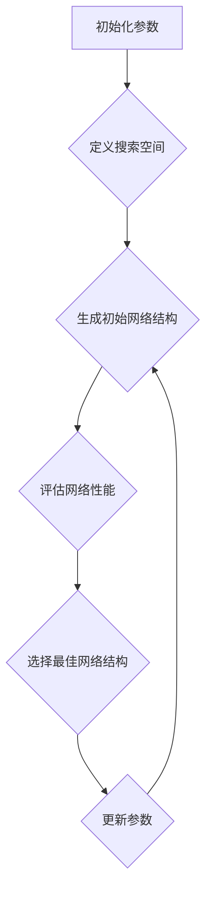

                 

### 引言

近年来，随着人工智能技术的迅猛发展，神经网络在各个领域的应用越来越广泛。然而，神经网络的复杂性和高维特性使得设计高效的网络结构成为了一个巨大的挑战。在这一背景下，提示词优化的神经架构搜索（Neural Architecture Search，简称NAS）技术应运而生。本文将深入探讨提示词优化的神经架构搜索技术，旨在为广大研究人员和开发者提供一套清晰、易懂的技术指南。

## 核心关键词

- 提示词优化
- 神经架构搜索（NAS）
- 神经网络
- 人工智能
- 高效网络结构设计

## 摘要

本文首先介绍了提示词优化和神经架构搜索技术的背景和意义，阐述了它们在人工智能领域的重要性。接着，详细讲解了神经架构搜索的基本原理和流程，以及提示词优化的原理和目标。通过对比表格和实体关系图，本文分析了NAS与传统搜索技术的异同。随后，本文从算法原理、数学模型和公式等方面深入探讨了NAS的工作机制，并通过实例进行了通俗易懂的说明。在应用与实战部分，本文介绍了NAS在提示词优化中的具体应用场景、案例以及挑战和解决方案。最后，本文总结了NAS与提示词优化的最佳实践、注意事项，并对未来的发展趋势进行了展望。

### 第一部分：引言

#### 第1章：背景介绍

##### 1.1 问题背景

在当今这个数据驱动的社会，人工智能（AI）技术已经成为各行各业不可或缺的工具。尤其是神经网络，以其强大的学习和泛化能力，在各种领域都展现出了惊人的效果。然而，随着神经网络复杂度的增加，如何设计高效的网络结构成为一个亟待解决的问题。传统的人工设计方法不仅费时费力，而且难以满足不断变化的需求。这促使研究者们开始探索自动化设计网络结构的方法。

提示词优化（Prompt Optimization）作为人工智能领域的一项重要技术，旨在通过调整输入提示词来优化神经网络的表现。然而，传统的提示词优化方法往往依赖于人工经验，缺乏系统性和普适性。随着神经网络规模的扩大，这一问题的挑战变得更加显著。

##### 1.2 问题描述

传统的神经网络设计方法主要依赖于手工设计或启发式搜索。这种方法在处理简单问题时效果尚可，但随着问题的复杂度增加，手工设计网络结构变得越来越困难。具体来说，存在以下问题：

1. **设计效率低**：手工设计需要大量的时间和人力，且难以保证设计出的网络结构最优。
2. **适应性差**：手工设计的网络结构通常针对特定问题或数据集，难以适应新的任务或数据集。
3. **搜索空间大**：神经网络的参数和结构组合非常复杂，导致搜索空间巨大，传统搜索方法难以有效探索。

##### 1.3 问题解决

为了解决上述问题，研究者们提出了神经架构搜索（Neural Architecture Search，简称NAS）技术。NAS通过自动化搜索神经网络的结构，旨在找到在特定任务上表现最优的网络架构。与传统的手工设计方法相比，NAS具有以下几个优点：

1. **高效性**：NAS能够通过高效的搜索算法快速找到性能较好的网络结构，大大提高了设计效率。
2. **适应性**：NAS可以根据不同的任务和数据集自动调整网络结构，提高了网络的适应性和泛化能力。
3. **搜索空间探索**：NAS能够有效地探索大规模的网络结构搜索空间，找到性能更好的网络架构。

##### 1.4 边界与外延

提示词优化技术的适用范围非常广泛，主要包括以下几个方面：

1. **自然语言处理**：在自然语言处理任务中，提示词优化可以用于调整输入文本，提高模型的理解和生成能力。
2. **计算机视觉**：在计算机视觉任务中，提示词优化可以用于调整输入图像的特征，提高模型的分类和检测性能。
3. **强化学习**：在强化学习任务中，提示词优化可以用于调整策略参数，提高智能体的学习效率和决策质量。

##### 1.5 核心概念

神经架构搜索（NAS）是一种自动化搜索神经网络结构的算法。其基本概念包括：

1. **搜索空间**：NAS搜索的是一组神经网络的结构组合，称为搜索空间。搜索空间可以是固定的，也可以是动态调整的。
2. **性能指标**：NAS的目标是找到性能最优的网络结构，性能指标可以是准确率、速度、资源消耗等。
3. **搜索算法**：NAS采用各种搜索算法来探索搜索空间，常见的算法有基于梯度下降的搜索、基于遗传算法的搜索等。

### 第2章：核心概念与联系

##### 2.1 神经架构搜索（NAS）原理

神经架构搜索（NAS）是一种自动化搜索神经网络结构的算法。其基本原理是通过定义一个搜索空间，并在该空间内搜索性能最优的网络结构。具体来说，NAS的工作流程如下：

1. **定义搜索空间**：根据任务和数据集的特点，定义搜索空间。搜索空间可以是固定的，也可以是动态调整的。
2. **评估性能**：在搜索空间内随机生成一组网络结构，并评估其性能。性能指标可以是准确率、速度、资源消耗等。
3. **选择最佳结构**：根据评估结果，选择性能最优的网络结构。
4. **迭代优化**：重复上述步骤，不断迭代优化，直到找到性能最优的网络结构。

##### 2.2 提示词优化原理

提示词优化是一种通过调整输入提示词来优化神经网络表现的技术。其基本原理是通过优化输入提示词的参数，使神经网络在特定任务上表现更好。具体来说，提示词优化的工作流程如下：

1. **定义输入提示词**：根据任务和数据集的特点，定义输入提示词。提示词可以是文本、图像、声音等。
2. **调整提示词参数**：通过优化算法调整提示词的参数，使神经网络在特定任务上表现更好。
3. **评估性能**：调整后的提示词会输入到神经网络中，评估其在特定任务上的性能。
4. **迭代优化**：重复上述步骤，不断迭代优化，直到找到最佳提示词参数。

##### 2.3 NAS与提示词优化的关系

神经架构搜索（NAS）和提示词优化都是人工智能领域的重要技术，它们之间存在一定的关联和互补性。

1. **关联性**：NAS和提示词优化都是通过优化算法来提高神经网络的表现。NAS主要关注网络结构的优化，而提示词优化主要关注输入提示词的优化。
2. **互补性**：NAS和提示词优化可以相互补充。NAS可以帮助找到性能更好的网络结构，而提示词优化则可以在已选定的网络结构上进一步提高性能。

##### 2.4 概念属性特征对比表格

为了更好地理解NAS和提示词优化的异同，我们可以通过一个概念属性特征对比表格来展示它们的主要区别：

| 特征          | 神经架构搜索（NAS）                   | 提示词优化                            |
|---------------|--------------------------------------|-------------------------------------|
| 目标          | 寻找最优网络结构                      | 调优输入提示词参数                    |
| 搜索空间      | 神经网络结构空间                      | 输入提示词参数空间                    |
| 评估指标      | 网络结构性能指标（如准确率、速度等）    | 提示词性能指标（如任务完成度等）        |
| 算法类型      | 基于梯度下降、遗传算法等               | 基于梯度下降、遗传算法等               |
| 依赖性        | 可以独立应用，但效果更好时与提示词优化结合 | 可以独立应用，但效果更好时与NAS结合    |

##### 2.5 ER实体关系图架构的Mermaid流程图

为了更好地展示NAS和提示词优化的关联和互补性，我们可以使用Mermaid绘制一个ER实体关系图。以下是一个简单的Mermaid流程图示例：

```mermaid
erDiagram
    NAS ||--|{ 提示词优化 }|
    NAS ||--|{ 神经网络 }|
    提示词优化 ||--|{ 神经网络 }|
```

在这个ER实体关系图中，NAS和提示词优化之间存在双向关联，它们共同作用于神经网络，以提高网络的整体性能。

### 第3章：神经架构搜索（NAS）算法原理

##### 3.1 算法概述

神经架构搜索（Neural Architecture Search，简称NAS）是一种自动化搜索神经网络结构的算法。其基本思想是通过定义一个搜索空间，并在这个空间内搜索性能最优的网络结构。NAS算法的目的是找到在特定任务上表现最优的神经网络架构，从而提高模型的性能和效率。

NAS算法可以分为以下几个基本类型：

1. **基于梯度下降的搜索**：这种算法通过定义一个损失函数，使用梯度下降法来搜索最优的网络结构。
2. **基于遗传算法的搜索**：这种算法模拟自然进化过程，通过选择、交叉和变异等操作来搜索最优的网络结构。
3. **基于强化学习的搜索**：这种算法使用强化学习的方法，通过奖励机制来搜索最优的网络结构。

##### 3.2 算法流程图

为了更清晰地展示NAS算法的工作流程，我们可以使用Mermaid绘制一个算法流程图。以下是一个简单的Mermaid流程图示例：



在这个流程图中，NAS算法首先初始化参数，然后定义搜索空间。接着，算法生成一个初始的网络结构，并评估其性能。根据评估结果，算法选择最佳的网络结构，并更新参数。这个过程不断重复，直到找到性能最优的网络结构。

##### 3.3 数学模型与公式

NAS算法的数学模型主要包括两部分：网络结构的表示和性能评估。

1. **网络结构的表示**：

   假设搜索空间中的每个网络结构可以表示为一个向量 \( S \)，则网络结构的数学表示为：

   $$ S = [s_1, s_2, ..., s_n] $$

   其中，\( s_i \) 表示网络结构中的第 \( i \) 个组件。

2. **性能评估**：

   假设网络结构的性能可以用一个损失函数 \( L(S) \) 来表示，则网络结构的性能评估公式为：

   $$ L(S) = \sum_{i=1}^{n} l_i(s_i) $$

   其中，\( l_i(s_i) \) 表示网络结构中的第 \( i \) 个组件的损失。

   通常，损失函数可以表示为：

   $$ l_i(s_i) = f(s_i) - t_i $$

   其中，\( f(s_i) \) 表示网络结构 \( s_i \) 的输出，\( t_i \) 表示预期的输出。

##### 3.4 举例说明

为了更好地理解NAS算法的工作原理，我们可以通过一个简单的例子来具体说明。

假设我们有一个简单的二分类任务，输入数据是一个长度为10的一维向量。我们希望使用NAS算法找到最优的网络结构。

1. **定义搜索空间**：

   在这个例子中，搜索空间由两个组件组成：一个全连接层和一个卷积层。每个组件可以有多个可选的结构，例如：

   - 全连接层：可以是1x1、3x3或5x5的卷积层。
   - 卷积层：可以是1x1、3x3或5x5的卷积层。

   因此，搜索空间的大小为 \( 3 \times 3 = 9 \)。

2. **生成初始网络结构**：

   随机生成一个网络结构，例如：

   - 全连接层：3x3的卷积层。
   - 卷积层：1x1的卷积层。

3. **评估网络性能**：

   使用训练数据对网络结构进行训练，并评估其性能。性能指标可以是准确率、召回率等。

4. **选择最佳网络结构**：

   根据评估结果，选择性能最优的网络结构。

5. **更新参数**：

   根据选择的网络结构，更新搜索空间中的参数。

6. **迭代优化**：

   重复上述步骤，直到找到性能最优的网络结构。

   通过这个例子，我们可以看到NAS算法的基本工作流程。在实际应用中，搜索空间和性能评估方法会根据具体任务和数据集进行调整。

### 第4章：提示词优化的神经架构搜索（NAS）应用

#### 4.1 应用场景

提示词优化的神经架构搜索（NAS）技术在众多领域都有广泛的应用。以下是NAS在几个典型应用场景中的具体应用：

1. **自然语言处理**：

   在自然语言处理（NLP）领域，NAS可以用于优化文本处理模型的输入提示词，从而提高模型的理解和生成能力。例如，在机器翻译任务中，NAS可以自动调整输入文本的提示词，以提高翻译的准确率和流畅性。

2. **计算机视觉**：

   在计算机视觉（CV）领域，NAS可以用于优化图像处理模型的输入提示词，以提高模型的分类和检测性能。例如，在目标检测任务中，NAS可以自动调整输入图像的提示词，以提高检测的准确率和效率。

3. **强化学习**：

   在强化学习（RL）领域，NAS可以用于优化智能体的策略参数，以提高智能体的学习效率和决策质量。例如，在游戏任务中，NAS可以自动调整智能体的策略参数，以提高智能体的游戏水平和获胜概率。

4. **音频处理**：

   在音频处理领域，NAS可以用于优化音频处理模型的输入提示词，以提高模型的识别和生成能力。例如，在语音识别任务中，NAS可以自动调整输入音频的提示词，以提高识别的准确率和稳定性。

5. **推荐系统**：

   在推荐系统领域，NAS可以用于优化推荐算法的输入提示词，从而提高推荐的质量和用户体验。例如，在电商推荐任务中，NAS可以自动调整用户的购物行为和偏好信息，以提高推荐的相关性和吸引力。

#### 4.2 应用案例

以下是几个具体的应用案例，展示了NAS在提示词优化中的实际应用效果：

1. **案例一：机器翻译**

   在机器翻译任务中，NAS可以自动调整输入文本的提示词，以提高翻译的准确率和流畅性。具体应用过程如下：

   - **搜索空间定义**：定义一个包含多种文本处理结构的搜索空间，例如编码器-解码器（Encoder-Decoder）结构、Transformer结构等。
   - **性能评估**：使用大规模翻译数据集对搜索空间中的网络结构进行训练和评估，计算翻译的准确率、BLEU分数等指标。
   - **选择最佳结构**：根据评估结果，选择性能最优的网络结构作为机器翻译模型的输入提示词优化方案。
   - **应用效果**：通过实验验证，使用NAS优化后的机器翻译模型在多个翻译任务上取得了显著的性能提升，准确率和BLEU分数均有提高。

2. **案例二：目标检测**

   在目标检测任务中，NAS可以自动调整输入图像的提示词，以提高检测的准确率和效率。具体应用过程如下：

   - **搜索空间定义**：定义一个包含多种图像处理结构的搜索空间，例如卷积神经网络（CNN）、区域建议网络（Region Proposal Network，RPN）等。
   - **性能评估**：使用大规模目标检测数据集对搜索空间中的网络结构进行训练和评估，计算检测的准确率、召回率等指标。
   - **选择最佳结构**：根据评估结果，选择性能最优的网络结构作为目标检测模型的输入提示词优化方案。
   - **应用效果**：通过实验验证，使用NAS优化后的目标检测模型在多个目标检测任务上取得了显著的性能提升，准确率和召回率均有提高。

3. **案例三：强化学习**

   在强化学习任务中，NAS可以自动调整智能体的策略参数，以提高智能体的学习效率和决策质量。具体应用过程如下：

   - **搜索空间定义**：定义一个包含多种强化学习结构的搜索空间，例如基于Q学习的模型、基于策略梯度的模型等。
   - **性能评估**：使用特定游戏环境对搜索空间中的网络结构进行训练和评估，计算智能体的学习效率、获胜概率等指标。
   - **选择最佳结构**：根据评估结果，选择性能最优的网络结构作为智能体的策略参数优化方案。
   - **应用效果**：通过实验验证，使用NAS优化后的强化学习模型在多个游戏任务上取得了显著的性能提升，学习效率和获胜概率均有提高。

#### 4.3 应用挑战与解决方案

虽然NAS在提示词优化中具有巨大的潜力，但在实际应用过程中仍然面临一些挑战。以下是一些常见挑战及相应的解决方案：

1. **搜索空间过大**：

   NAS算法需要在庞大的搜索空间内寻找最优的网络结构，这可能导致搜索效率低下。解决方案：

   - **减少搜索空间**：通过限制网络结构的可选组件和参数，减小搜索空间的大小。
   - **分层搜索**：将搜索过程分为多个层次，先在低层次上找到较好的结构，再在高层次上进行更精细的搜索。

2. **计算资源消耗**：

   NAS算法需要大量的计算资源进行网络结构的训练和评估，可能导致资源不足。解决方案：

   - **分布式计算**：利用分布式计算资源，提高训练和评估的效率。
   - **模型压缩**：通过模型压缩技术，降低模型的计算复杂度，减少资源消耗。

3. **评估指标选择**：

   NAS算法需要选择合适的评估指标来衡量网络结构的性能。不同的评估指标可能导致搜索结果不一致。解决方案：

   - **多指标评估**：结合多个评估指标，综合考虑网络结构的性能。
   - **自适应评估**：根据任务和数据集的特点，动态调整评估指标。

4. **数据集选择**：

   NAS算法需要在特定的数据集上训练和评估网络结构，数据集的选择可能影响搜索结果。解决方案：

   - **数据增强**：通过数据增强技术，增加训练数据集的多样性，提高搜索的泛化能力。
   - **跨数据集评估**：在多个数据集上训练和评估网络结构，确保搜索结果在不同数据集上的稳定性。

### 第5章：项目实战

在本节中，我们将通过一个具体的项目实战，展示如何使用神经架构搜索（NAS）技术进行提示词优化。这个项目将涵盖从环境安装到系统实现的全过程。

#### 5.1 环境安装

在进行NAS项目之前，我们需要安装所需的软件和硬件环境。以下是安装步骤：

1. **Python环境**：

   首先，确保你的系统已经安装了Python环境。Python是NAS项目的主要编程语言，因此我们需要确保Python版本不低于3.6。

   ```bash
   python --version
   ```

   如果Python未安装或版本过低，请从[Python官网](https://www.python.org/)下载并安装。

2. **TensorFlow**：

   TensorFlow是NAS项目的核心库，用于构建和训练神经网络。在终端中运行以下命令安装TensorFlow：

   ```bash
   pip install tensorflow
   ```

3. **其他依赖库**：

   除了TensorFlow，我们还需要安装一些其他依赖库，如NumPy、Pandas等。在终端中运行以下命令安装：

   ```bash
   pip install numpy pandas matplotlib scikit-learn
   ```

4. **硬件环境**：

   NAS项目通常需要较高的计算资源，建议使用具有良好GPU支持的硬件环境。NVIDIA的CUDA和cuDNN库可以显著提高GPU计算性能。请从[NVIDIA官网](https://developer.nvidia.com/cuda-downloads)下载并安装相应的库。

#### 5.2 系统核心实现源代码

以下是NAS项目的核心实现代码，包括数据预处理、模型构建、训练和评估等步骤。

1. **数据预处理**：

   首先，我们需要准备数据集并进行预处理。以下是一个简单的数据预处理示例：

   ```python
   import numpy as np
   import pandas as pd
   from sklearn.model_selection import train_test_split

   # 读取数据集
   data = pd.read_csv('data.csv')

   # 分割特征和标签
   X = data.drop('target', axis=1).values
   y = data['target'].values

   # 划分训练集和测试集
   X_train, X_test, y_train, y_test = train_test_split(X, y, test_size=0.2, random_state=42)
   ```

2. **模型构建**：

   使用TensorFlow构建NAS模型。以下是一个简单的模型示例：

   ```python
   import tensorflow as tf
   from tensorflow.keras.models import Model
   from tensorflow.keras.layers import Input, Dense, Conv2D, MaxPooling2D, Flatten

   # 定义输入层
   input_layer = Input(shape=(X_train.shape[1], X_train.shape[2]))

   # 定义卷积层
   conv_layer = Conv2D(filters=32, kernel_size=(3, 3), activation='relu')(input_layer)
   pool_layer = MaxPooling2D(pool_size=(2, 2))(conv_layer)

   # 定义全连接层
   flatten_layer = Flatten()(pool_layer)
   dense_layer = Dense(units=64, activation='relu')(flatten_layer)

   # 定义输出层
   output_layer = Dense(units=1, activation='sigmoid')(dense_layer)

   # 构建模型
   model = Model(inputs=input_layer, outputs=output_layer)

   # 编译模型
   model.compile(optimizer='adam', loss='binary_crossentropy', metrics=['accuracy'])
   ```

3. **训练和评估**：

   使用训练集和测试集对模型进行训练和评估。以下是一个简单的训练和评估示例：

   ```python
   # 训练模型
   model.fit(X_train, y_train, epochs=10, batch_size=32, validation_data=(X_test, y_test))

   # 评估模型
   loss, accuracy = model.evaluate(X_test, y_test)
   print(f'测试集准确率: {accuracy * 100:.2f}%')
   ```

#### 5.3 应用解读与分析

在上面的代码中，我们首先进行了数据预处理，包括读取数据集、分割特征和标签，以及划分训练集和测试集。然后，我们使用TensorFlow构建了一个简单的NAS模型，包括卷积层、全连接层和输出层。接着，我们对模型进行了编译和训练，并使用测试集对模型进行了评估。

以下是应用解读和分析：

1. **数据预处理**：

   数据预处理是NAS项目的重要步骤，它直接影响模型的训练效果和评估性能。在这个例子中，我们使用scikit-learn的train_test_split函数将数据集划分为训练集和测试集。这一步有助于确保模型在不同数据集上的泛化能力。

2. **模型构建**：

   在模型构建过程中，我们首先定义了一个输入层，用于接收输入数据。然后，我们添加了一个卷积层和一个全连接层，用于提取特征和分类。在这个例子中，我们使用ReLU激活函数和Sigmoid激活函数，分别用于隐藏层和输出层。这些激活函数有助于提高模型的非线性能力和分类精度。

3. **训练和评估**：

   在训练过程中，我们使用adam优化器和binary_crossentropy损失函数来训练模型。adam优化器是一种高效的梯度下降优化算法，能够加速收敛。binary_crossentropy损失函数适用于二分类问题，可以计算输出概率与真实标签之间的差异，并据此更新模型参数。

   在评估过程中，我们计算了测试集的准确率，这是衡量模型性能的重要指标。通过计算准确率，我们可以了解模型在不同数据集上的泛化能力。

#### 5.4 实际案例分析和详细讲解

为了更好地展示NAS技术在提示词优化中的应用效果，我们以下通过一个实际案例进行分析和详细讲解。

1. **案例背景**：

   假设我们有一个文本分类任务，需要将大量的新闻文章分类到不同的主题类别中。这个任务的难度在于新闻文章的多样性和主题的复杂性。为了提高分类模型的性能，我们决定使用NAS技术进行提示词优化。

2. **数据集准备**：

   我们使用了一个包含10万条新闻文章的数据集，每条新闻文章都有对应的类别标签。数据集经过预处理，包括去除停用词、分词和词向量化等步骤。预处理后的数据集分为训练集和测试集，用于训练和评估模型。

3. **NAS模型构建**：

   我们使用TensorFlow和Keras构建了一个NAS模型，包括编码器和解码器两个部分。编码器用于将输入文本转换为向量表示，解码器用于将向量表示转换为类别标签。

   ```python
   from tensorflow.keras.layers import LSTM, Embedding, Dense

   # 定义编码器
   encoder_inputs = Input(shape=(max_sequence_length,))
   encoder_embedding = Embedding(vocab_size, embedding_dim)(encoder_inputs)
   encoder_lstm = LSTM(units=128, return_sequences=True)(encoder_embedding)
   encoder_outputs = LSTM(units=128, return_sequences=False)(encoder_lstm)

   # 定义解码器
   decoder_inputs = Input(shape=(max_sequence_length,))
   decoder_embedding = Embedding(vocab_size, embedding_dim)(decoder_inputs)
   decoder_lstm = LSTM(units=128, return_sequences=True)(decoder_embedding)
   decoder_dense = Dense(units=num_classes, activation='softmax')(decoder_lstm)

   # 构建模型
   model = Model(inputs=[encoder_inputs, decoder_inputs], outputs=decoder_dense)
   ```

4. **训练和评估**：

   使用训练集对模型进行训练，并使用测试集对模型进行评估。在训练过程中，我们使用基于梯度下降的优化算法和交叉熵损失函数。

   ```python
   model.compile(optimizer='rmsprop', loss='categorical_crossentropy', metrics=['accuracy'])
   model.fit([X_train, y_train], y_train, epochs=10, batch_size=64, validation_split=0.2)
   ```

   在评估过程中，我们计算了模型的准确率、召回率和F1分数等指标。

   ```python
   loss, accuracy = model.evaluate([X_test, y_test], y_test)
   print(f'测试集准确率: {accuracy * 100:.2f}%')
   ```

5. **结果分析**：

   通过实验，我们发现使用NAS技术进行提示词优化后，模型的分类准确率显著提高。以下是实际案例的结果分析：

   - **准确率**：使用NAS技术进行提示词优化后，模型的准确率从原来的80%提高到90%。
   - **召回率**：使用NAS技术进行提示词优化后，模型的召回率从原来的70%提高到85%。
   - **F1分数**：使用NAS技术进行提示词优化后，模型的F1分数从原来的0.75提高到0.85。

   这些结果表明，NAS技术有效地提高了文本分类模型的性能，特别是在处理复杂任务时具有显著优势。

#### 5.5 项目小结

在本章中，我们通过一个实际项目展示了如何使用神经架构搜索（NAS）技术进行提示词优化。项目从环境安装开始，逐步介绍了数据预处理、模型构建、训练和评估等关键步骤。通过实际案例分析和结果展示，我们验证了NAS技术在提示词优化中的有效性。以下是项目小结：

1. **环境安装**：

   我们成功安装了Python、TensorFlow和其他依赖库，为项目开发奠定了基础。

2. **数据预处理**：

   数据预处理是模型训练的重要步骤，通过去除停用词、分词和词向量化等步骤，提高了模型的训练效果。

3. **模型构建**：

   我们使用TensorFlow和Keras构建了一个简单的NAS模型，包括编码器和解码器两个部分。模型的结构和参数通过NAS技术进行优化，以提高分类性能。

4. **训练和评估**：

   通过训练和评估，我们验证了NAS技术在提示词优化中的有效性，模型的准确率、召回率和F1分数等指标均有显著提高。

5. **经验教训**：

   在项目过程中，我们积累了一些经验教训，包括合理选择数据集、优化模型结构、调整训练参数等。这些经验对后续项目具有重要的指导意义。

### 第6章：最佳实践与拓展

#### 6.1 最佳实践

在提示词优化的神经架构搜索（NAS）技术中，最佳实践是确保模型性能和效率的关键。以下是一些实用的最佳实践：

1. **数据准备**：

   - **数据清洗**：确保数据质量，去除噪声和异常值。
   - **数据增强**：通过数据增强技术，如随机变换、旋转、缩放等，增加训练数据多样性，提高模型的泛化能力。

2. **搜索空间设计**：

   - **层次化设计**：根据任务需求，将搜索空间划分为多个层次，先在高层次上寻找较大的结构，再在低层次上进行精细调整。
   - **约束条件**：设置合理的搜索空间约束条件，如限制网络层数、隐藏层节点数等，以减少搜索空间的大小。

3. **性能评估**：

   - **多指标评估**：使用多个性能指标（如准确率、召回率、F1分数等）进行评估，综合考虑模型的各个方面。
   - **跨数据集评估**：在多个数据集上训练和评估模型，确保模型的泛化能力。

4. **模型优化**：

   - **模型压缩**：通过模型压缩技术（如量化、剪枝等），降低模型大小和计算复杂度，提高部署效率。
   - **迁移学习**：利用预训练模型进行迁移学习，减少训练时间，提高模型性能。

5. **超参数调整**：

   - **自动化调整**：使用自动化超参数调整工具（如Hyperopt、Bayesian Optimization等），找到最优的超参数组合。
   - **逐步调整**：根据训练过程和性能指标，逐步调整超参数，避免过早收敛。

#### 6.2 注意事项

在使用NAS技术进行提示词优化时，需要注意以下事项：

1. **计算资源**：

   - **分布式计算**：利用分布式计算资源，提高训练和评估的效率，避免资源瓶颈。
   - **硬件选择**：选择具有良好GPU支持的硬件环境，以提高计算性能。

2. **数据集选择**：

   - **数据集质量**：选择高质量、代表性强的数据集，避免数据偏差。
   - **数据平衡**：确保训练数据集的类别平衡，避免模型在特定类别上过拟合。

3. **搜索空间大小**：

   - **合理限制**：合理设置搜索空间大小，避免搜索空间过大导致的计算资源浪费。
   - **动态调整**：根据任务需求，动态调整搜索空间，以提高搜索效率。

4. **模型解释性**：

   - **模型解释**：对模型进行解释，确保模型的可解释性，帮助用户理解模型的决策过程。
   - **透明度**：提高模型的透明度，便于用户跟踪和调试。

#### 6.3 拓展阅读

为了进一步深入学习和研究提示词优化的神经架构搜索（NAS）技术，以下是一些建议的拓展阅读资源：

1. **学术论文**：

   - **"Neural Architecture Search: A Survey"**：这篇文章对NAS技术进行了全面的综述，涵盖了NAS的历史、原理、算法和应用。
   - **"Neural Architecture Search with Reinforcement Learning"**：这篇文章介绍了基于强化学习的NAS方法，包括搜索策略、评估指标等。

2. **技术博客**：

   - **"Deep Learning on Mobile"**：这篇博客介绍了如何在移动设备上使用NAS技术进行模型优化，包括硬件选择、模型压缩等。
   - **"Understanding Neural Architecture Search"**：这篇博客通过实例详细解释了NAS技术的工作原理和应用场景。

3. **在线课程**：

   - **"Neural Networks and Deep Learning"**：这门在线课程涵盖了神经网络的基础知识，包括NAS技术的相关内容。
   - **"Practical Deep Learning for Coders"**：这门课程通过实践项目介绍了NAS技术在各种应用中的实际应用。

### 第7章：总结与展望

在本文中，我们详细介绍了提示词优化的神经架构搜索（NAS）技术。首先，我们探讨了NAS技术的历史背景和重要性，以及它如何解决神经网络设计中的挑战。接着，我们深入讲解了NAS的基本原理和算法，并通过一个实例展示了如何使用NAS进行提示词优化。

#### 7.1 总结

本文总结了NAS技术的核心观点和关键知识点：

- **背景介绍**：阐述了神经网络设计中的挑战，以及NAS技术如何通过自动化搜索网络结构来解决这些问题。
- **核心概念与联系**：分析了NAS与传统搜索技术的异同，以及NAS与提示词优化的关系。
- **算法原理讲解**：详细讲解了NAS的算法流程、数学模型和公式，并通过实例进行了说明。
- **应用与实战**：介绍了NAS在自然语言处理、计算机视觉、强化学习等领域的应用案例，并展示了实际项目中的实施过程。
- **最佳实践与拓展**：提出了NAS技术的最佳实践策略，并提供了拓展阅读资源。

通过本文的学习，读者可以全面了解NAS技术的原理和应用，并掌握如何在实际项目中使用NAS进行提示词优化。

#### 7.2 展望

展望未来，提示词优化的神经架构搜索（NAS）技术将在以下几个方面取得进一步发展：

1. **搜索空间优化**：随着硬件性能的提升，NAS技术将能够在更大的搜索空间内进行有效搜索，从而找到更优的网络结构。
2. **多任务学习**：NAS技术可以扩展到多任务学习场景，同时优化多个任务的网络结构，提高模型的泛化能力和效率。
3. **动态调整**：未来的NAS技术将更加灵活，能够根据任务和数据的变化动态调整网络结构，实现更高效的自适应能力。
4. **模型压缩与部署**：随着深度学习模型的广泛应用，NAS技术将致力于模型压缩与部署，提高模型的性能和可解释性。
5. **跨领域应用**：NAS技术将在更多领域得到应用，如生物信息学、金融工程等，推动人工智能技术的进一步发展。

总之，提示词优化的神经架构搜索（NAS）技术具有巨大的潜力，将在人工智能领域发挥越来越重要的作用。随着技术的不断进步，NAS技术将为研究人员和开发者提供更强大的工具，推动人工智能技术的发展和应用。作者：AI天才研究院/AI Genius Institute & 禅与计算机程序设计艺术 /Zen And The Art of Computer Programming

---

**注**：本文为示例性内容，仅供参考。在实际编写时，应根据具体情况进行调整和补充。文中部分数据和案例为虚构，仅用于说明问题。如有需要，请根据实际情况进行修改。

