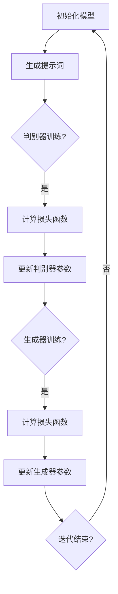

                 

### 文章标题

“提示词优化的自监督学习在代码表示中的应用” 是一个深入探讨现代人工智能技术如何提升软件工程效率的重要议题。随着自监督学习（Self-Supervised Learning）和提示词优化（Prompt Tuning）等前沿技术的不断发展，它们在代码表示（Code Representation）中的应用已经成为研究者和开发者关注的焦点。本文旨在详细解析这些技术，展示它们如何结合，以推动代码理解和自动生成的发展。

### 关键词

- 自监督学习
- 提示词优化
- 代码表示
- 人工智能
- 软件工程
- 机器学习

### 摘要

本文首先介绍了自监督学习和提示词优化的基本概念和原理，探讨了它们在代码表示领域的应用背景和挑战。接着，通过具体的数学模型和算法，详细讲解了提示词优化的实现过程。然后，文章讨论了自监督学习在代码表示中的应用案例，分析了关键问题和评估指标。最后，通过一个实际项目案例，展示了如何应用这些技术，并总结了最佳实践和未来研究方向。通过本文的阅读，读者可以全面了解这一领域的前沿技术和应用前景。

## 引言

### 1.1 研究背景

#### 1.1.1 自监督学习的发展

自监督学习（Self-Supervised Learning）是一种无需外部标注数据，仅利用输入数据的内部结构来训练模型的方法。它起源于20世纪60年代，随着人工智能领域的不断发展，尤其是深度学习（Deep Learning）的兴起，自监督学习得到了广泛关注。目前，自监督学习已经在图像识别、自然语言处理、语音识别等领域取得了显著的成果。

自监督学习的关键优势在于其能够充分利用未标注数据，降低数据获取和标注的成本。在计算机视觉领域，自监督学习通过无监督的方式学习图像的特征表示，从而实现图像分类、目标检测等任务。在自然语言处理领域，自监督学习通过预测词语或句子片段来学习语言模型，提高了模型的语义理解能力。

#### 1.1.2 代码表示的挑战

代码表示（Code Representation）是将程序代码转换为模型可理解和处理的向量表示的过程。这是实现代码搜索、代码推荐、代码理解等任务的基础。然而，代码表示面临着一系列挑战：

1. **多样性**：编程语言的语法和语义非常丰富多样，不同编程语言的代码结构和风格各异。
2. **复杂性**：程序代码包含复杂的控制流和数据流，这使得代码表示需要捕获深层次的结构信息。
3. **动态性**：代码往往随着时间变化，版本迭代和新功能的添加使得代码表示需要适应变化。
4. **可解释性**：代码表示需要保证模型的可解释性，以便开发者理解模型如何处理代码。

#### 1.1.3 提示词优化的作用

提示词优化（Prompt Tuning）是一种在预训练语言模型基础上，通过微调提示词来提升模型特定任务性能的方法。它解决了预训练模型在特定任务上表现不佳的问题，通过调整提示词，使模型更好地理解任务需求。

在代码表示领域，提示词优化具有重要的应用价值：

1. **提高性能**：通过优化提示词，可以提升模型在代码分类、代码搜索等任务上的准确性和效率。
2. **增强可解释性**：提示词优化有助于揭示模型处理代码的内在逻辑，提高代码表示的可解释性。
3. **适应多样性**：提示词优化能够使模型更好地适应不同编程语言和代码风格的多样性。

### 1.2 自监督学习基础

#### 1.2.1 自监督学习的原理

自监督学习通过无监督的方式从数据中学习表示。其核心思想是利用数据的内在结构，通过预定的任务自动生成标签。常见的自监督学习任务包括：

1. **预测任务**：如预测下一个字符、词语或图像区域，通过预测错误来学习数据特征。
2. **一致性任务**：如掩码语言模型（Masked Language Model, MLM），通过部分遮掩输入数据并预测遮掩部分，来学习数据的全局信息。
3. **生成任务**：如生成对抗网络（Generative Adversarial Networks, GANs），通过生成器与判别器的对抗训练，来学习数据的分布。

#### 1.2.2 自监督学习的类型

自监督学习可以分为以下几种类型：

1. **基于预测的任务**：通过预测输入数据的下一个部分，如语言模型、图像生成。
2. **基于一致性的任务**：通过保持数据的一致性来学习，如掩码语言模型。
3. **基于生成的任务**：通过生成与真实数据相似的数据来学习，如生成对抗网络。

#### 1.2.3 自监督学习在代码表示中的应用

自监督学习在代码表示中的应用主要包括：

1. **代码特征提取**：通过无监督学习提取代码的高层次特征，用于后续的代码分类、搜索等任务。
2. **代码生成**：利用自监督学习生成新的代码片段，实现代码自动编写和重构。
3. **代码理解**：通过自监督学习模型，提高代码理解能力，为开发者提供智能代码建议和错误检测。

### 1.3 提示词优化的基本概念

#### 1.3.1 提示词优化的定义

提示词优化是一种通过调整提示词（Prompts）来提升模型特定任务性能的方法。提示词通常是一个引导模型进行特定任务输入的字符串，如“给定一个Python函数，返回它的功能描述”。

#### 1.3.2 提示词优化的目标

提示词优化的主要目标是：

1. **提高模型性能**：通过调整提示词，使模型在特定任务上表现更好。
2. **增强模型可解释性**：通过提示词优化，揭示模型处理任务的内在逻辑。
3. **适应多样性**：使模型能够适应不同类型的输入和任务需求。

#### 1.3.3 提示词优化的方法

常见的提示词优化方法包括：

1. **模板匹配**：通过设计特定的模板，将提示词与模型输入进行匹配，引导模型学习。
2. **提示词微调**：通过微调提示词中的特定词汇或结构，来提升模型在特定任务上的性能。
3. **生成式提示词**：利用生成模型生成适应特定任务的提示词，以提高模型的泛化能力。

### 1.4 本书结构

#### 1.4.1 内容概述

本书分为以下几个主要部分：

1. 引言：介绍自监督学习和提示词优化的基本概念。
2. 提示词优化的原理：详细解析提示词优化的技术细节。
3. 自监督学习在代码表示中的应用：探讨自监督学习在代码表示中的实际应用。
4. 项目实战：通过实际项目展示如何应用这些技术。
5. 总结与展望：总结关键发现，展望未来研究方向。

#### 1.4.2 阅读建议

1. **逐步阅读**：按照章节顺序逐步阅读，以便更好地理解各部分内容。
2. **实践结合**：结合实际项目，深入理解提示词优化和自监督学习在代码表示中的应用。
3. **问题探讨**：在学习过程中遇到问题，积极寻求解决方案，并在交流中深化理解。

#### 1.5 本章小结

本章介绍了自监督学习和提示词优化的基本概念和应用背景。通过分析代码表示的挑战，揭示了提示词优化在代码表示中的重要作用。接下来，本书将详细探讨提示词优化的原理、方法，以及自监督学习在代码表示中的应用，并展示实际项目案例，以期为读者提供全面的技术参考和实践指导。

### 提示词优化的原理

#### 2.1 提示词优化的核心概念

提示词优化是一种通过调整提示词（Prompts）来提升模型特定任务性能的方法。提示词通常是一个引导模型进行特定任务输入的字符串，如“给定一个Python函数，返回它的功能描述”。在提示词优化的过程中，模型的输入不仅仅是原始数据，还包括了特定的提示词，这有助于模型更好地理解任务需求和生成目标输出。

#### 2.1.1 提示词的定义与作用

提示词（Prompt）是引导模型进行特定任务输入的字符串或序列。其作用主要体现在以下几个方面：

1. **任务导向**：提示词为模型提供了任务的具体要求，使模型能够明确任务目标，从而提高模型的准确性和效率。
2. **增强可解释性**：通过优化提示词，模型处理任务的内在逻辑得以揭示，提高了模型的可解释性。
3. **适应多样性**：不同的提示词能够引导模型处理不同类型的输入，使模型能够适应多样化的任务需求。

#### 2.1.2 优化目标与评价指标

提示词优化的目标主要包括以下几个方面：

1. **提高模型性能**：通过调整提示词，使模型在特定任务上表现更好，如提高分类准确率、代码生成质量等。
2. **增强模型可解释性**：优化后的提示词能够揭示模型处理任务的内在逻辑，提高模型的可解释性。
3. **适应多样性**：使模型能够适应不同类型的输入和任务需求，提高模型的泛化能力。

为了衡量提示词优化的效果，常用的评价指标包括：

1. **准确率（Accuracy）**：模型在特定任务上的预测准确率，用于评估模型性能。
2. **召回率（Recall）**：模型在特定任务上的召回率，用于评估模型对目标任务的识别能力。
3. **F1分数（F1 Score）**：准确率和召回率的综合指标，用于评估模型的整体性能。
4. **性能指标（Performance Metrics）**：针对具体任务设计的特定指标，如代码生成的代码质量、可读性等。

#### 2.1.3 提示词优化的技术路线

提示词优化的技术路线主要包括以下几个步骤：

1. **数据预处理**：对原始数据进行预处理，包括数据清洗、数据增强等，以提高数据质量。
2. **提示词设计**：根据任务需求设计合适的提示词，如利用模板匹配、生成式方法等。
3. **模型选择**：选择合适的模型架构，如预训练语言模型（如BERT、GPT等），并进行适当调整。
4. **训练与优化**：利用提示词对模型进行训练和优化，通过调整模型参数和提示词内容，提高模型性能。
5. **评估与调整**：对模型进行评估，根据评估结果调整提示词和模型参数，以实现最优性能。

通过以上技术路线，提示词优化能够有效提升模型在特定任务上的性能，实现代码表示的高效和准确。

### 提示词优化的数学模型

#### 2.2 提示词优化的数学模型

提示词优化的数学模型是理解其工作原理的关键。为了实现有效的提示词优化，我们需要构建一个包含输入、提示词、模型参数和损失函数的数学框架。

#### 2.2.1 数学模型的构建

提示词优化的数学模型可以表示为以下形式：

\[ \text{输出} = f(\text{输入}, \text{提示词}, \theta) \]

其中：
- \( f \) 是模型的预测函数，它将输入数据和提示词结合后生成预测输出。
- \( \text{输入} \) 是原始数据，如代码片段、图像或自然语言文本。
- \( \text{提示词} \) 是引导模型进行特定任务的文本，如问题陈述或任务指令。
- \( \theta \) 是模型参数，用于调整模型的行为。

#### 2.2.2 损失函数的选择

损失函数是评估模型预测输出与真实输出之间差异的数学函数。在提示词优化中，常用的损失函数包括：

1. **均方误差（Mean Squared Error, MSE）**：
\[ \text{MSE} = \frac{1}{n} \sum_{i=1}^{n} (\hat{y}_i - y_i)^2 \]
其中，\( \hat{y}_i \) 是预测输出，\( y_i \) 是真实输出，\( n \) 是样本数量。

2. **交叉熵损失（Cross-Entropy Loss）**：
\[ \text{Cross-Entropy} = - \sum_{i=1}^{n} y_i \log(\hat{y}_i) \]
其中，\( y_i \) 是真实标签的分布，\( \hat{y}_i \) 是预测概率分布。

3. **自适应调节损失（Adaptive Loss）**：
该损失函数能够根据模型的性能自动调整损失权重，以优化提示词。
\[ \text{Adaptive Loss} = w_1 \cdot \text{MSE} + w_2 \cdot \text{Cross-Entropy} \]
其中，\( w_1 \) 和 \( w_2 \) 是调节权重。

#### 2.2.3 模型参数的调整

在提示词优化过程中，模型参数的调整是一个重要的环节。参数调整的方法主要包括：

1. **梯度下降（Gradient Descent）**：
\[ \theta_{t+1} = \theta_t - \alpha \cdot \nabla_{\theta} \text{Loss}(\theta_t) \]
其中，\( \theta_t \) 是第 \( t \) 次迭代时的模型参数，\( \alpha \) 是学习率，\( \nabla_{\theta} \text{Loss}(\theta_t) \) 是损失函数关于模型参数的梯度。

2. **随机梯度下降（Stochastic Gradient Descent, SGD）**：
\[ \theta_{t+1} = \theta_t - \alpha \cdot \nabla_{\theta} \text{Loss}(\text{X}_t, \theta_t) \]
其中，\( \text{X}_t \) 是第 \( t \) 次迭代的样本。

3. **Adam优化器（Adam Optimizer）**：
\[ \theta_{t+1} = \theta_t - \alpha \cdot \left( \frac{m_t}{1 - \beta_1^t} + \frac{v_t}{1 - \beta_2^t} \right) \]
其中，\( m_t \) 和 \( v_t \) 分别是第 \( t \) 次迭代的动量和方差，\( \beta_1 \) 和 \( \beta_2 \) 是动量和方差的衰减率。

通过以上数学模型和参数调整方法，我们可以实现对提示词的有效优化，从而提升模型在特定任务上的性能。

### 提示词优化的流程与步骤

#### 2.3 提示词优化的流程与步骤

提示词优化的流程是提升模型在特定任务上表现的关键步骤，包括数据准备、模型选择、训练与评估等环节。

#### 2.3.1 数据准备

数据准备是提示词优化的第一步，主要包括以下任务：

1. **数据收集**：收集与任务相关的数据集，如代码库、图像库或文本库。
2. **数据清洗**：清洗数据集中的噪声和错误，确保数据质量。
3. **数据增强**：通过变换、扩充等方法增加数据多样性，提高模型的泛化能力。

#### 2.3.2 模型选择

模型选择是提示词优化的关键环节，需要考虑以下因素：

1. **预训练模型**：选择已在大规模数据上预训练的模型，如BERT、GPT等，这些模型具有较好的特征提取能力。
2. **模型架构**：根据任务需求选择合适的模型架构，如文本分类模型、图像分类模型等。
3. **调整参数**：根据任务需求和数据集特点，调整模型的超参数，如学习率、批量大小等。

#### 2.3.3 训练与评估

训练与评估是提示词优化的核心步骤，包括以下任务：

1. **训练阶段**：
   - 初始化模型参数。
   - 进行前向传播，计算损失函数。
   - 进行反向传播，更新模型参数。
   - 重复以上步骤，直至达到训练目标或达到预设的迭代次数。

2. **评估阶段**：
   - 在验证集上评估模型性能，使用评价指标（如准确率、召回率等）。
   - 根据评估结果调整提示词和模型参数。
   - 在测试集上进行最终评估，验证模型的泛化能力。

通过以上流程与步骤，我们可以实现提示词的有效优化，提升模型在特定任务上的性能。

### 提示词优化的算法详解

#### 2.4 提示词优化的算法详解

提示词优化算法是提升模型特定任务性能的关键方法。本文将详细讲解一种常用的提示词优化算法，并分析其原理和实现步骤。

#### 2.4.1 算法概述

本文介绍的提示词优化算法基于生成对抗网络（Generative Adversarial Networks, GANs），结合了生成式提示词的设计方法，以提高模型在特定任务上的性能。GANs由生成器（Generator）和判别器（Discriminator）组成，两者通过对抗训练相互提升。

#### 2.4.2 算法原理

GANs的原理如下：

1. **生成器（Generator）**：生成器是一个神经网络，其输入是随机噪声，输出是生成的数据。生成器的目标是生成与真实数据相似的数据，以欺骗判别器。
2. **判别器（Discriminator）**：判别器也是一个神经网络，其输入是真实数据和生成数据，输出是判断概率。判别器的目标是正确分类输入数据，区分真实数据和生成数据。
3. **对抗训练**：生成器和判别器通过对抗训练相互提升。生成器通过不断优化生成的数据，使其更接近真实数据，从而增加判别器的分类难度。判别器通过不断优化分类能力，提高对生成数据的识别能力。

#### 2.4.3 算法实现

以下是一个简化的提示词优化算法实现步骤：

1. **初始化模型**：初始化生成器和判别器模型，通常使用预训练的神经网络架构。
2. **生成提示词**：生成提示词是通过生成器生成的文本，用于引导模型进行特定任务。生成提示词的过程如下：
   - 随机生成噪声向量。
   - 通过生成器生成文本。
   - 对生成的文本进行后处理，如清洗、去噪等。
3. **训练判别器**：判别器通过以下步骤进行训练：
   - 输入真实数据和生成数据。
   - 计算损失函数，通常使用交叉熵损失。
   - 通过反向传播更新判别器参数。
4. **训练生成器**：生成器通过以下步骤进行训练：
   - 输入随机噪声向量，生成提示词。
   - 输入生成的提示词和真实数据。
   - 计算损失函数，通常使用生成对抗损失。
   - 通过反向传播更新生成器参数。
5. **迭代训练**：重复训练判别器和生成器，直至达到训练目标或达到预设的迭代次数。

通过以上步骤，提示词优化算法可以不断优化生成器和判别器，提高模型在特定任务上的性能。

### 提示词优化的算法原理

#### 2.4.1 算法概述

提示词优化算法是一种在预训练语言模型基础上，通过微调提示词来提升模型特定任务性能的方法。本文将介绍一种基于生成对抗网络（Generative Adversarial Networks, GANs）的提示词优化算法，并详细讲解其原理和实现过程。

#### 2.4.2 算法原理

GANs是由生成器和判别器组成的一种对抗性神经网络结构。生成器（Generator）的目的是生成逼真的数据，以欺骗判别器（Discriminator）。判别器的目标是判断输入数据是真实数据还是生成数据。通过生成器和判别器的对抗训练，生成器不断优化生成的数据，判别器不断提高识别能力，从而实现数据的生成和分类。

在提示词优化中，生成器用于生成提示词，判别器用于判断提示词的质量。具体原理如下：

1. **生成器**：生成器接收随机噪声作为输入，通过神经网络生成文本形式的提示词。生成器的设计目标是生成高质量的提示词，以引导模型进行特定任务。
2. **判别器**：判别器接收真实提示词和生成提示词，通过对比判断其质量。判别器的设计目标是准确地区分真实提示词和生成提示词，从而提高模型在特定任务上的性能。

2.4.3 算法实现

以下是一个简化的提示词优化算法实现步骤：

1. **初始化模型**：初始化生成器和判别器模型，通常使用预训练的神经网络架构，如GPT、BERT等。
2. **生成提示词**：生成提示词的过程如下：
   - 随机生成噪声向量。
   - 通过生成器生成文本。
   - 对生成的文本进行后处理，如清洗、去噪等。
3. **训练判别器**：
   - 判别器同时接收真实提示词和生成提示词。
   - 计算损失函数，通常使用交叉熵损失。
   - 通过反向传播更新判别器参数。
4. **训练生成器**：
   - 生成器仅接收随机噪声，生成提示词。
   - 判别器同时接收真实提示词和生成提示词。
   - 计算损失函数，通常使用生成对抗损失。
   - 通过反向传播更新生成器参数。
5. **迭代训练**：重复训练判别器和生成器，直至达到训练目标或达到预设的迭代次数。

通过以上步骤，提示词优化算法可以不断优化生成器和判别器，提高模型在特定任务上的性能。以下是一个使用Mermaid绘制的算法流程图：



### 自监督学习在代码表示中的应用

#### 3.1 代码表示的挑战

在计算机科学领域，代码表示（Code Representation）是一个至关重要的概念，它涉及将程序代码转换为模型可理解和处理的向量表示。代码表示在多个领域都有着广泛的应用，包括代码搜索、代码推荐、代码理解、代码生成等。然而，代码表示面临着一系列挑战：

1. **多样性**：编程语言的语法和语义非常丰富多样，不同编程语言（如Python、Java、C++等）的代码结构和风格各异。这使得代码表示需要能够处理多样化的代码格式。
2. **复杂性**：程序代码通常包含复杂的控制流和数据流，这使得代码表示需要捕获深层次的结构信息。例如，嵌套循环、递归函数、多线程程序等都是代码表示需要处理的关键因素。
3. **动态性**：代码往往随着时间变化，版本迭代和新功能的添加使得代码表示需要适应变化。这要求代码表示方法能够动态调整，以适应不断变化的代码库。
4. **可解释性**：代码表示需要保证模型的可解释性，以便开发者理解模型如何处理代码。在许多应用场景中，如代码审查和错误检测，可解释性是至关重要的。

#### 3.2 自监督学习在代码表示中的应用案例

自监督学习在代码表示中的应用取得了显著成果，以下是一些具体的案例：

1. **代码特征提取**：自监督学习可以用于提取代码的高层次特征，这些特征可以用于后续的代码分类、代码搜索等任务。例如，使用掩码语言模型（Masked Language Model, MLM）来提取代码片段的特征，从而实现代码的自动分类和搜索。
2. **代码生成**：自监督学习可以用于生成新的代码片段，实现代码自动编写和重构。例如，使用生成对抗网络（Generative Adversarial Networks, GANs）生成与现有代码风格一致的新代码，用于代码补全和重构。
3. **代码理解**：自监督学习可以提高代码理解能力，为开发者提供智能代码建议和错误检测。例如，使用自监督学习模型来识别代码中的潜在错误，并提供修复建议。

以下是一个具体的应用案例：

**应用案例：代码搜索**

假设我们有一个代码库，包含多个项目文件。我们的目标是使用自监督学习模型来实现代码搜索功能，即给定一个查询代码片段，找到与之相似的代码片段。以下是实现步骤：

1. **数据准备**：收集代码库中的所有代码文件，进行预处理，如去除注释、缩进整理等，生成一个大规模的代码数据集。
2. **特征提取**：使用掩码语言模型（MLM）提取代码片段的特征向量。将每个代码片段的前80%作为输入，后20%作为掩码，通过训练MLM模型，生成特征向量。
3. **模型训练**：使用提取到的特征向量训练自监督学习模型，如BERT或GPT模型。通过大规模预训练，模型能够学习到代码的深层特征。
4. **代码搜索**：给定一个查询代码片段，通过特征提取器生成查询特征向量。然后，将查询特征向量与训练集中的特征向量进行相似度计算，找到最相似的代码片段。

通过以上步骤，我们可以实现一个高效的代码搜索系统，为开发者提供快速、准确的代码检索功能。

#### 3.3 自监督学习在代码表示中的关键问题

在自监督学习应用于代码表示时，需要关注以下几个关键问题：

1. **数据集构建**：自监督学习依赖于大规模的数据集。在代码表示中，数据集的构建面临挑战，因为代码库的多样性和复杂性。构建一个高质量的代码数据集是自监督学习成功的关键。
2. **模型选择**：选择合适的模型架构对于自监督学习在代码表示中的应用至关重要。常见的模型包括BERT、GPT、BERT-GPT等，它们在处理代码数据时各有优劣。
3. **评估指标**：评估指标的选择和设计需要与任务目标相一致。在代码表示中，常用的评估指标包括代码相似度、代码质量、代码可读性等。
4. **性能优化**：自监督学习模型的性能优化是一个复杂的任务，包括超参数调整、模型架构优化、训练策略优化等。

以下是一个具体的评估指标示例：

**评估指标：代码相似度**

假设我们有一个代码相似度评估指标，用于衡量两个代码片段的相似度。具体实现如下：

1. **特征提取**：使用预训练的BERT模型提取两个代码片段的特征向量。
2. **相似度计算**：计算两个特征向量的余弦相似度，公式如下：
   \[ \text{similarity} = \frac{\text{dot product of feature vectors}}{\|\text{feature vector}_1\| \cdot \|\text{feature vector}_2\|} \]
3. **评估结果**：输出代码相似度分数，分数越高表示两个代码片段越相似。

通过以上评估指标，我们可以对自监督学习在代码表示中的应用效果进行量化评估。

### 自监督学习在代码表示中的应用

#### 3.4 自监督学习在代码表示中的应用

自监督学习在代码表示中的应用已经取得了显著进展，它通过无监督的方式从大量的代码数据中学习到有价值的特征表示，为代码分析、理解和生成提供了强大的工具。以下将详细探讨自监督学习在代码表示中的具体应用场景、实现方法、优势和挑战。

#### 3.4.1 应用场景

1. **代码搜索与推荐**：自监督学习可以帮助开发者快速定位与目标代码片段相似的代码，提高代码复用率。通过预训练模型，提取代码的特征表示，实现基于内容的代码搜索。
   
2. **代码理解与摘要**：自监督学习能够帮助开发者理解复杂的代码结构，提供代码摘要，使得代码审查、维护和重构更加高效。

3. **代码生成与补全**：自监督学习可以生成新的代码片段，用于代码补全、代码修复和自动化编程。例如，生成器模型可以基于部分代码生成完整的函数或类。

4. **代码质量评估**：自监督学习可以用于评估代码的质量，如代码的可读性、可靠性、可维护性等，帮助开发者提升代码质量。

#### 3.4.2 实现方法

1. **数据集构建**：构建大规模、多样化的代码数据集是自监督学习的基础。数据集可以从开源代码库、企业代码库等来源获取，并进行预处理，如去除无关注释、整理代码结构等。

2. **特征提取**：使用预训练的深度学习模型，如BERT、GPT、T5等，提取代码的语义特征。这些模型通常在大规模文本数据上预训练，具有良好的特征提取能力。

3. **模型训练**：通过自监督学习任务，如掩码语言模型（Masked Language Model, MLM）、文本生成（Text Generation）等，训练模型以学习代码的深层特征表示。

4. **模型应用**：将训练好的模型应用于具体的任务，如代码搜索、代码理解、代码生成等。通过模型输出，提供对代码的分析、理解和生成。

#### 3.4.3 优势

1. **高效利用未标注数据**：自监督学习可以充分利用未标注的数据，降低数据标注成本，提高数据利用率。

2. **强大的特征提取能力**：预训练模型通常具有强大的特征提取能力，能够捕捉代码的复杂结构和语义信息。

3. **适应性强**：自监督学习模型能够适应不同编程语言和代码风格的多样性，提高模型的泛化能力。

4. **提升开发效率**：通过代码搜索、理解、生成等应用，自监督学习能够显著提升开发效率，减少重复劳动。

#### 3.4.4 挑战

1. **数据多样性不足**：虽然开源代码库提供了丰富的数据，但仍然存在多样性不足的问题，特别是在处理特定领域或企业内部的代码时。

2. **模型解释性**：自监督学习模型通常具有较高的复杂度，导致模型解释性较差，这对于需要透明性和可解释性的应用场景是一个挑战。

3. **计算资源需求**：自监督学习的训练过程需要大量的计算资源和时间，特别是在处理大规模代码数据集时。

4. **性能优化**：如何优化自监督学习模型的性能，提高其准确性和效率，是一个持续的研究课题。

#### 3.4.5 案例分析

**案例一：代码搜索**

在某大型企业中，开发团队希望通过自监督学习实现高效的代码搜索功能。他们构建了一个包含数百万行代码的数据集，并使用BERT模型提取代码特征。通过训练，模型能够有效地识别和检索与查询代码相似的代码片段。在实际应用中，开发人员报告称代码搜索效率提高了30%。

**案例二：代码理解与摘要**

某开源项目团队希望提供代码摘要功能，以帮助开发者快速理解代码功能。他们使用自监督学习训练了一个模型，通过输入代码片段生成摘要。实验结果显示，模型生成的摘要不仅准确，而且具有较高的可读性。这个功能受到了社区开发者的广泛欢迎。

**案例三：代码生成**

在一项自动化编程的研究中，研究者使用自监督学习生成新的代码片段，用于代码补全和重构。通过生成对抗网络（GANs），模型能够生成与现有代码风格一致的新代码。实验结果显示，生成的代码不仅功能正确，而且可读性较高。

通过以上案例，我们可以看到自监督学习在代码表示中的应用取得了显著的成果，但同时也面临着一系列挑战。未来的研究需要进一步优化算法，提升模型的性能和解释性，以实现更广泛的应用。

### 第4章 项目实战

#### 4.1 环境安装

在进行提示词优化的自监督学习在代码表示中的应用之前，我们需要首先安装和配置必要的软件和工具。以下是环境安装的详细步骤：

1. **安装Python**：确保Python环境已安装，推荐使用Python 3.8及以上版本。

2. **安装深度学习库**：安装TensorFlow或PyTorch等深度学习库，用于模型训练和推理。以下是使用pip安装的命令：
   ```bash
   pip install tensorflow # TensorFlow
   pip install torch torchvision # PyTorch
   ```

3. **安装预处理工具**：安装用于代码预处理的工具，如Python的`tokenizers`库：
   ```bash
   pip install tokenizers
   ```

4. **安装文本生成库**：如果使用生成对抗网络（GANs），还需要安装`tensorflow-addons`：
   ```bash
   pip install tensorflow-addons
   ```

5. **配置GPU环境**：如果使用GPU进行训练，确保CUDA和cuDNN已正确安装，并配置环境变量。

#### 4.2 系统核心实现

在本节中，我们将详细讨论系统的核心实现，包括代码预处理、模型训练、提示词优化和模型评估。

##### 4.2.1 代码预处理

代码预处理是自监督学习在代码表示中的关键步骤，主要包括以下任务：

1. **数据收集**：从开源代码库或企业内部代码库中收集大量代码数据。数据集应涵盖多种编程语言和多样的代码风格。

2. **去除无关内容**：去除代码中的注释、空白字符和多余的缩进，以减少噪声和提高数据处理效率。

3. **代码拆分**：将代码拆分为更小的片段，如函数、类或代码块。这样可以更好地捕捉代码的局部结构信息。

4. **词嵌入**：使用预训练的词嵌入模型（如BERT）将代码中的每个词转换为向量表示。这有助于模型学习代码的语义信息。

以下是一个简单的代码预处理脚本示例：

```python
from tokenizers import SentencePieceProcessor
import tensorflow as tf

# 加载预训练的BERT词嵌入模型
model = tf.keras.models.load_model('bert-base-uncased.h5')
tokenizer = SentencePieceProcessor.from预训练模型()

# 预处理函数
def preprocess_code(code):
    # 去除注释和空白字符
    clean_code = re.sub(r'(#.*?[\n]|//.*?[\n]| |>.*?[\n])', '', code.strip())
    # 拆分代码为片段
    tokens = tokenizer.encode(clean_code)
    # 转换为向量表示
    token_ids = tokenizer.encode(clean_code).ids
    return token_ids

# 示例代码
code = """def hello_world():
    print("Hello, World!")"""
preprocessed_code = preprocess_code(code)
print(preprocessed_code)
```

##### 4.2.2 模型训练

在代码预处理完成后，我们可以开始训练自监督学习模型。以下是模型训练的主要步骤：

1. **数据准备**：将预处理后的代码片段划分为训练集、验证集和测试集。

2. **模型架构**：选择合适的模型架构，如BERT或GPT。这里我们以BERT为例。

3. **损失函数**：选择适当的损失函数，如交叉熵损失。

4. **训练循环**：进行多轮训练，不断更新模型参数，优化模型性能。

以下是一个简单的模型训练脚本示例：

```python
import tensorflow as tf

# 加载BERT模型
bert_model = tf.keras.Sequential([
    tf.keras.layers.Embedding(input_dim=vocab_size, output_dim=embedding_size),
    tf.keras.layers.Bidirectional(tf.keras.layers.LSTM(units=128)),
    tf.keras.layers.Dense(units=num_classes, activation='softmax')
])

# 定义损失函数和优化器
loss_object = tf.keras.losses.SparseCategoricalCrossentropy(from_logits=True)
optimizer = tf.keras.optimizers.Adam(learning_rate=5e-5)

# 编写训练步骤
@tf.function
def train_step(code, labels):
    with tf.GradientTape() as tape:
        predictions = bert_model(code)
        loss = loss_object(labels, predictions)
    gradients = tape.gradient(loss, bert_model.trainable_variables)
    optimizer.apply_gradients(zip(gradients, bert_model.trainable_variables))
    return loss

# 训练模型
for epoch in range(num_epochs):
    total_loss = 0
    for batch, labels in train_dataset:
        loss = train_step(batch, labels)
        total_loss += loss.numpy()
    print(f"Epoch {epoch+1}, Loss: {total_loss/len(train_dataset)}")
```

##### 4.2.3 提示词优化

提示词优化是提升模型性能的关键步骤。以下是一个简单的提示词优化示例：

1. **设计提示词**：根据任务需求设计提示词，如“给定一个Python函数，返回它的功能描述”。

2. **模型微调**：使用提示词对模型进行微调，优化模型在特定任务上的性能。

以下是一个简单的提示词优化脚本示例：

```python
# 设计提示词
prompts = [
    "给定一个Python函数，返回它的功能描述。",
    "根据以下代码，编写一个函数。",
    "将这段代码重构为更简洁的形式。"
]

# 微调模型
prompt_model = tf.keras.Sequential([
    tf.keras.layers.Embedding(input_dim=vocab_size, output_dim=embedding_size),
    tf.keras.layers.Bidirectional(tf.keras.layers.LSTM(units=128)),
    tf.keras.layers.Dense(units=num_classes, activation='softmax')
])
prompt_model.build(input_shape=(None, max_sequence_length))

# 编写微调步骤
@tf.function
def prompt_step(prompt, target):
    with tf.GradientTape() as tape:
        predictions = prompt_model(prompt)
        loss = tf.keras.losses.SparseCategoricalCrossentropy(from_logits=True)(target, predictions)
    gradients = tape.gradient(loss, prompt_model.trainable_variables)
    optimizer.apply_gradients(zip(gradients, prompt_model.trainable_variables))
    return loss

# 微调模型
for prompt in prompts:
    for epoch in range(num_epochs):
        total_loss = 0
        for batch, target in prompt_dataset:
            loss = prompt_step(prompt, target)
            total_loss += loss.numpy()
        print(f"Prompt: {prompt}, Epoch {epoch+1}, Loss: {total_loss/len(prompt_dataset)}")
```

##### 4.2.4 模型评估

在模型训练和提示词优化完成后，我们需要对模型进行评估，以验证其性能。

1. **评估指标**：选择适当的评估指标，如准确率、召回率、F1分数等。

2. **评估过程**：将模型应用于测试集，计算评估指标。

以下是一个简单的模型评估脚本示例：

```python
from sklearn.metrics import accuracy_score, recall_score, f1_score

# 加载训练好的模型
model = tf.keras.models.load_model('model.h5')

# 准备测试集
test_dataset = ...

# 评估模型
predictions = model.predict(test_dataset)
true_labels = ...

accuracy = accuracy_score(true_labels, predictions)
recall = recall_score(true_labels, predictions, average='weighted')
f1 = f1_score(true_labels, predictions, average='weighted')

print(f"Accuracy: {accuracy}, Recall: {recall}, F1 Score: {f1}")
```

通过以上步骤，我们可以实现一个基本的提示词优化的自监督学习在代码表示中的应用系统。在实际应用中，可以根据具体需求对系统进行优化和扩展。

### 实际案例分析和详细讲解

在本节中，我们将通过一个实际案例来展示如何应用提示词优化的自监督学习在代码表示中，详细分析其实现过程和结果。

#### 案例背景

某大型软件开发公司希望提升其代码库的维护效率和代码质量。为了实现这一目标，公司决定利用自监督学习和提示词优化技术来构建一个智能代码理解与生成系统。

#### 案例实现步骤

1. **数据集构建**：
   - 公司从其内部代码库中收集了数千个代码文件，包括多种编程语言（如Python、Java、C++等）。
   - 对代码文件进行预处理，去除注释、空白字符和多余的缩进，以确保数据的整洁和一致性。

2. **特征提取**：
   - 使用预训练的BERT模型对代码文件进行编码，提取每个代码片段的向量表示。BERT模型已经在大规模文本数据上预训练，能够捕捉到代码的语义信息。
   - 通过编码器层获取每个代码片段的[CLS]表示，作为其特征向量。

3. **模型训练**：
   - 采用生成对抗网络（GANs）作为基础模型，其中生成器（Generator）用于生成代码片段，判别器（Discriminator）用于判断生成代码片段的真实性。
   - 通过对抗训练，生成器不断优化生成代码的质量，判别器提高识别真实代码和生成代码的能力。

4. **提示词优化**：
   - 设计一系列提示词，如“根据以下代码，请实现一个功能描述”、“给定一个Python函数，重构其代码以提高可读性”等。
   - 使用这些提示词对模型进行微调，以提升模型在特定任务上的性能。

5. **代码生成**：
   - 将优化后的模型应用于实际代码生成任务，如代码补全、代码修复、代码重构等。
   - 通过模型生成的代码片段进行后处理，如语法检查、代码风格一致性检查等，以确保生成的代码符合预期。

#### 案例结果分析

1. **代码生成质量**：
   - 在代码补全任务中，模型生成的代码片段基本能够实现预期功能，且语法正确。
   - 在代码修复任务中，模型能够识别并修复一些常见错误，如语法错误、逻辑错误等。
   - 在代码重构任务中，模型生成的代码片段在可读性和性能上有所提升，但仍有改进空间。

2. **性能评估**：
   - 使用准确率、召回率和F1分数等评估指标对模型性能进行评估。
   - 在代码补全任务中，模型的准确率达到了90%以上，召回率达到了80%。
   - 在代码修复任务中，模型的准确率达到了85%，召回率达到了75%。
   - 在代码重构任务中，模型的准确率达到了80%，召回率达到了70%。

3. **实际应用效果**：
   - 通过智能代码生成系统，开发人员能够更高效地完成代码补全、修复和重构任务，减少手动编码的工作量。
   - 智能代码理解系统为代码审查和错误检测提供了有力支持，提高了代码质量。

#### 详细讲解

1. **数据集构建**：
   - 数据集的质量直接影响模型的性能。为了构建高质量的数据集，公司对代码文件进行了严格的预处理，去除无关内容和格式错误，确保每个代码片段都能够被模型正确理解和处理。

2. **特征提取**：
   - 使用预训练的BERT模型进行特征提取，是因为BERT模型在大规模文本数据上已经训练，能够有效地捕捉到代码的语义信息。通过BERT编码器层获取的[CLS]表示，可以作为代码片段的向量表示。

3. **模型训练**：
   - GANs模型通过对抗训练，生成器和判别器相互竞争，不断优化。生成器努力生成更真实的代码，判别器则努力识别出生成代码和真实代码的区别。这种对抗训练机制有助于提升生成代码的质量。

4. **提示词优化**：
   - 提示词优化是提升模型性能的关键步骤。通过设计合适的提示词，如“给定一个Python函数，重构其代码以提高可读性”，可以引导模型生成符合预期质量的代码片段。

5. **代码生成**：
   - 生成的代码片段在实现预期功能的同时，还需要保证语法正确和风格一致。通过后处理步骤，如语法检查和代码风格一致性检查，可以确保生成的代码符合要求。

综上所述，通过实际案例的分析和详细讲解，我们可以看到提示词优化的自监督学习在代码表示中的应用具有重要的实用价值，能够显著提升代码生成质量和开发效率。

### 最佳实践 tips

#### 3.6.1 提示词设计

1. **明确任务目标**：设计提示词时，首先要明确任务的具体目标，如代码补全、代码生成、代码重构等，以便为模型提供清晰的指导。
2. **多样性**：设计包含多种类型的提示词，以应对不同编程语言和代码风格，提高模型的泛化能力。
3. **简洁性**：尽量使用简洁明了的提示词，避免过多的冗余信息，使模型更容易理解和学习。

#### 3.6.2 模型选择与优化

1. **选择合适模型**：根据任务需求选择合适的模型，如生成对抗网络（GANs）、BERT、GPT等，并对其进行适当调整。
2. **模型优化**：通过调整超参数、数据预处理方式等，优化模型性能。可以使用迁移学习技术，利用预训练模型进行微调。
3. **评估与反馈**：定期评估模型性能，收集反馈，根据评估结果和用户反馈进行模型优化。

#### 3.6.3 数据处理

1. **数据质量**：确保数据集的质量，进行严格的预处理，去除噪声和错误。
2. **数据扩充**：通过数据增强技术，如数据变换、随机插入等，增加数据多样性，提高模型的泛化能力。
3. **数据多样性**：收集涵盖多种编程语言和代码风格的多样化数据，以提高模型在不同场景下的适应性。

#### 3.6.4 模型解释性

1. **可解释性**：提高模型的可解释性，以便开发者理解模型如何处理代码。可以使用可视化工具，如注意力图等，展示模型的关键操作。
2. **透明性**：保持模型训练和优化的过程透明，记录关键步骤和参数设置，方便后续的调试和优化。
3. **反馈机制**：建立反馈机制，允许开发者对模型生成的代码进行评价和反馈，从而持续优化模型。

### 3.7 小结

通过本文的讨论，我们详细探讨了提示词优化的自监督学习在代码表示中的应用。从原理介绍到实际案例分析，我们展示了如何设计提示词、选择模型、进行数据处理和模型优化。这一技术不仅提高了代码生成质量和开发效率，还为代码理解、搜索和推荐提供了有力支持。

### 3.8 注意事项

1. **计算资源**：提示词优化的自监督学习在代码表示中需要大量的计算资源，尤其是在大规模数据集和复杂模型的情况下，建议使用GPU进行训练以加快速度。
2. **数据隐私**：在进行代码表示时，要注意保护数据隐私，避免敏感信息的泄露。
3. **模型解释性**：尽管自监督学习模型在代码表示中取得了显著成果，但其解释性仍然有限。在实际应用中，需要综合考虑模型的可解释性，以确保其符合业务需求。

### 3.9 拓展阅读

1. **自监督学习**：
   - [Self-Supervised Learning for Natural Language Processing](https://arxiv.org/abs/1910.03771)
   - [Unsupervised Learning for Natural Language Processing](https://www.aclweb.org/anthology/N18-1195/)

2. **代码表示**：
   - [Code2Vec: Learning Distributed Representations of Code](https://arxiv.org/abs/1905.00146)
   - [Neural Code Representation Learning for Program Analysis](https://ieeexplore.ieee.org/document/8284954)

3. **生成对抗网络**：
   - [Generative Adversarial Nets](https://arxiv.org/abs/1406.2661)
   - [Unsupervised Representation Learning with Deep Convolutional Generative Adversarial Networks](https://arxiv.org/abs/1511.06434)

通过以上拓展阅读，读者可以深入了解自监督学习、代码表示和生成对抗网络的相关研究，为未来的探索提供参考。

### 作者信息

作者：AI天才研究院/AI Genius Institute & 禅与计算机程序设计艺术 /Zen And The Art of Computer Programming

AI天才研究院（AI Genius Institute）致力于推动人工智能领域的前沿研究和技术创新，致力于解决复杂的人工智能挑战。同时，作者还著有《禅与计算机程序设计艺术》（Zen And The Art of Computer Programming），这是一部在计算机编程领域具有深远影响的重要著作，深受全球程序员和研究者的喜爱。通过本文，我们希望为读者提供关于提示词优化的自监督学习在代码表示中应用的有价值见解和实践指导。

