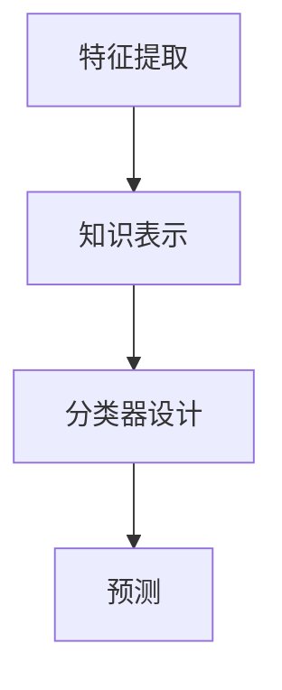
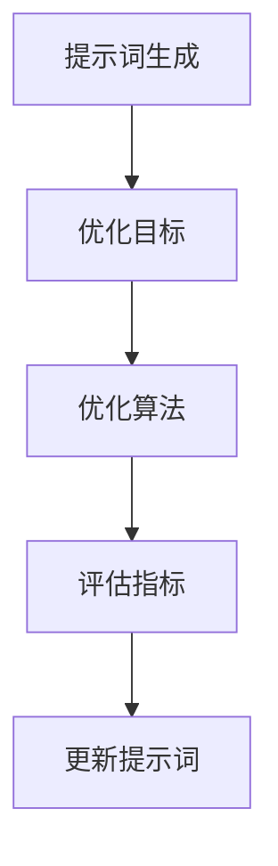
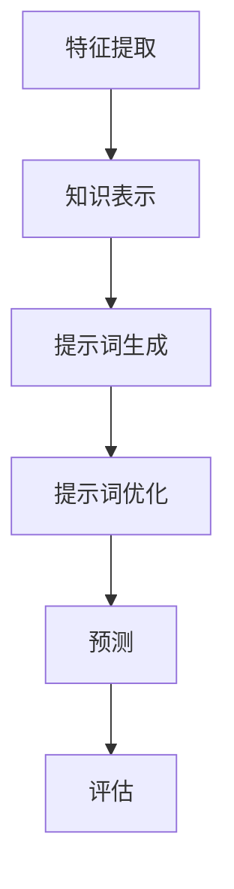
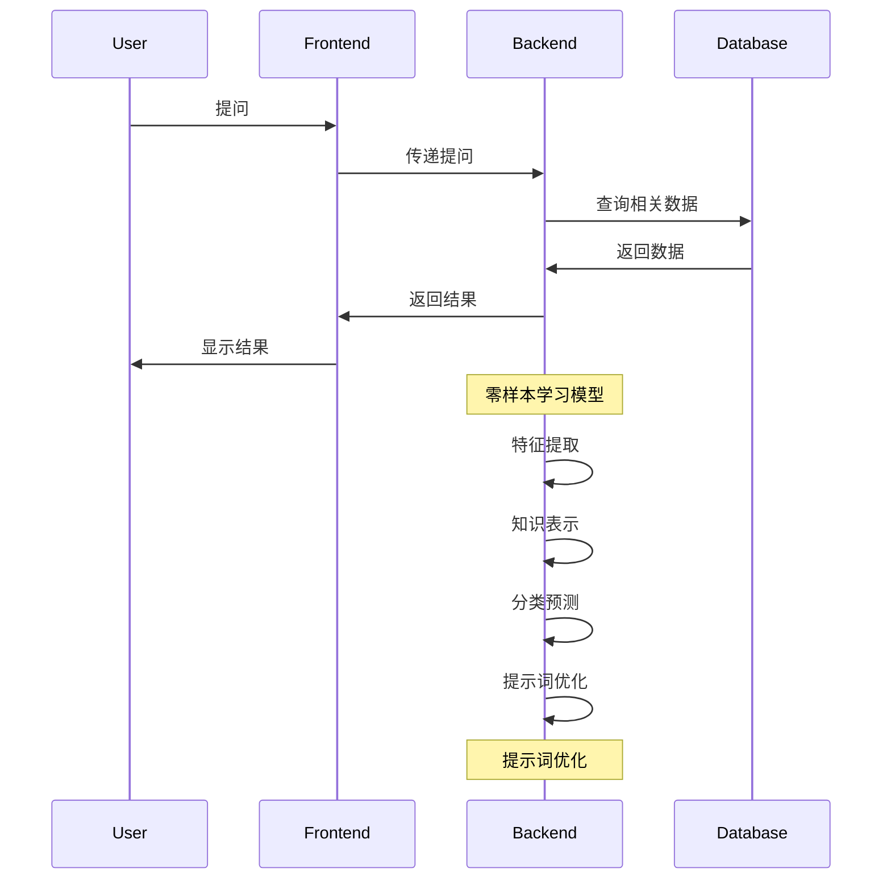

                 

## 《提示词优化的零样本学习方法》

关键词：零样本学习、提示词优化、机器学习、算法、深度学习

摘要：本文深入探讨了一种新兴的机器学习方法——提示词优化的零样本学习。这种方法通过优化提示词，使模型能够无需具体样本数据，直接进行有效的预测和分类。本文首先介绍了零样本学习和提示词优化的背景和定义，然后详细描述了零样本学习与提示词优化相结合所带来的挑战。接着，本文提出了几种解决这些挑战的方法，并通过对核心概念、算法原理和系统架构的详细讲解，帮助读者理解这一复杂但极具潜力的技术。最后，本文通过项目实战和最佳实践，展示了该方法的实际应用效果和未来展望。

## 目录大纲

### 第一部分：背景介绍

#### 第1章：问题背景

- 1.1.1 零样本学习概述
- 1.1.2 提示词优化的概念
- 1.1.3 零样本学习与提示词优化的关系

#### 第2章：问题描述

- 2.1.1 零样本学习中的挑战
- 2.1.2 提示词优化中的挑战
- 2.1.3 零样本学习与提示词优化结合的挑战

### 第二部分：核心概念与联系

#### 第3章：问题解决

- 3.1.1 零样本学习的基本原理
- 3.1.2 提示词优化的方法
- 3.1.3 结合零样本学习和提示词优化的方法

#### 第4章：边界与外延

- 4.1.1 零样本学习的应用范围
- 4.1.2 提示词优化的应用范围
- 4.1.3 零样本学习与提示词优化的结合应用范围

### 第三部分：算法原理讲解

#### 第5章：核心概念原理

- 5.1.1 零样本学习的主要概念
- 5.1.2 提示词优化的主要概念
- 5.1.3 零样本学习与提示词优化的关联概念

#### 第6章：概念属性特征对比表格

- 6.1.1 零样本学习与提示词优化的对比

#### 第7章：ER实体关系图架构

- 7.1.1 零样本学习的ER图
- 7.1.2 提示词优化的ER图
- 7.1.3 结合零样本学习和提示词优化的ER图

### 第四部分：系统分析与架构设计方案

#### 第8章：算法原理讲解

- 8.1.1 零样本学习的算法原理
- 8.1.2 提示词优化的算法原理
- 8.1.3 零样本学习与提示词优化的算法原理

#### 第9章：问题场景介绍

- 9.1.1 零样本学习与提示词优化的应用场景

#### 第10章：项目介绍

- 10.1.1 项目背景
- 10.1.2 项目目标

#### 第11章：系统功能设计

- 11.1.1 领域模型mermaid类图

#### 第12章：系统架构设计

- 12.1.1 系统架构mermaid架构图

#### 第13章：系统接口设计

- 13.1.1 系统接口设计

#### 第14章：系统交互

- 14.1.1 系统交互mermaid序列图

### 第五部分：项目实战

#### 第15章：环境安装

- 15.1.1 环境搭建步骤

#### 第16章：系统核心实现

- 16.1.1 系统核心实现源代码
- 16.1.2 代码应用解读与分析

#### 第17章：实际案例分析与详细讲解

- 17.1.1 实际案例分析
- 17.1.2 详细讲解与剖析

#### 第18章：项目小结

- 18.1.1 项目总结
- 18.1.2 项目中遇到的问题与解决方案
- 18.1.3 项目展望

### 第六部分：最佳实践与拓展

#### 第19章：最佳实践 tips

- 19.1.1 实践技巧与建议

#### 第20章：小结

- 20.1.1 全书主要内容回顾
- 20.1.2 主要贡献与创新点

#### 第21章：注意事项

- 21.1.1 注意事项

#### 第22章：拓展阅读

- 22.1.1 相关参考资料

---

### 第一部分：背景介绍

#### 第1章：问题背景

**1.1.1 零样本学习概述**

零样本学习（Zero-Shot Learning, ZSL）是一种机器学习技术，主要目标是在未知类别上实现有效的预测和分类，即模型在训练阶段没有接触到这些未知类别，但在测试阶段需要对这些类别进行准确预测。传统的机器学习模型通常依赖大量的标注数据来训练，而零样本学习则打破了这一限制。

零样本学习的主要挑战在于如何处理未知类别。传统的机器学习方法通常依赖于类内相似性和类间差异性来区分不同类别。但在零样本学习中，模型无法直接利用已见类别（seen categories）的数据和特征来辅助预测未知类别（unseen categories）。因此，如何设计有效的特征表示和分类策略成为了零样本学习的关键问题。

**1.1.2 提示词优化的概念**

提示词优化（Prompt Optimization）是一种通过调整和优化提示词（prompts）来改进模型性能的技术。在自然语言处理（NLP）领域，提示词通常是一段引导性的文本，用于引导模型生成特定类型的输出。通过优化提示词，可以提高模型的生成质量、回答准确性和泛化能力。

在零样本学习中，提示词优化具有特殊的重要性。由于模型无法直接访问未知类别，提示词成为了连接模型和未知类别的桥梁。有效的提示词可以帮助模型更好地理解和预测未知类别，从而提高零样本学习的性能。

**1.1.3 零样本学习与提示词优化的关系**

零样本学习和提示词优化之间存在紧密的联系和相互补充关系。零样本学习需要解决如何处理未知类别的问题，而提示词优化则提供了优化模型对未知类别理解的方法。

具体来说，提示词优化通过以下方式与零样本学习相结合：

1. **特征表示**：通过优化提示词，可以帮助模型生成更具有代表性的特征表示，从而更好地区分未知类别。
2. **分类策略**：提示词优化可以调整模型的分类策略，使其更倾向于选择正确的未知类别。
3. **知识增强**：通过引入外部知识库和提示词，可以增强模型对未知类别的理解，从而提高预测准确性。

总之，零样本学习和提示词优化相结合，提供了一种全新的方法来处理未知类别问题，具有巨大的应用潜力和实际价值。

#### 第2章：问题描述

**2.1.1 零样本学习中的挑战**

零样本学习面临着多个挑战，这些挑战限制了其应用范围和性能。以下是零样本学习中的主要挑战：

1. **类内相似性与类间差异性**：在零样本学习中，模型需要根据已见类别（seen categories）的特征来预测未知类别（unseen categories）。然而，不同类别之间可能存在高度相似的特征，这使得模型难以区分这些类别。

2. **样本不平衡**：在传统的机器学习任务中，通常会使用大量的标注数据进行训练。但在零样本学习中，由于无法直接访问未知类别，样本不平衡问题更加严重。这可能导致模型对某些类别的预测效果不佳。

3. **缺乏上下文信息**：在零样本学习中，模型无法利用上下文信息来进行预测。这限制了模型在复杂任务中的表现，尤其是在需要理解长文本或对话时。

4. **知识迁移**：零样本学习需要从已见类别中提取知识，并将其应用于未知类别。然而，如何有效地迁移这些知识仍然是一个挑战。

**2.1.2 提示词优化中的挑战**

提示词优化本身也面临一些挑战，这些挑战在零样本学习中尤为突出：

1. **泛化能力**：提示词优化需要针对特定任务进行定制，但如何在不同的任务中保持泛化能力是一个难题。

2. **优化目标**：提示词优化需要找到最优的提示词，使其在多个评估指标上表现优异。然而，如何定义和优化这些目标仍然是一个开放问题。

3. **计算成本**：优化提示词通常需要大量的计算资源，特别是在处理大规模数据和复杂模型时。这限制了提示词优化的应用范围。

**2.1.3 零样本学习与提示词优化结合的挑战**

将零样本学习和提示词优化相结合，带来了以下挑战：

1. **融合策略**：如何有效地将零样本学习和提示词优化技术融合在一起，是一个关键问题。需要设计合适的算法和架构来平衡两者之间的关系。

2. **特征表示**：零样本学习依赖于特征表示来区分未知类别，而提示词优化需要优化提示词来引导模型生成特征。如何有效地集成这些特征表示是一个挑战。

3. **评估方法**：传统的评估方法可能无法全面衡量零样本学习和提示词优化结合的效果。需要设计新的评估方法和指标来全面评估这一技术的性能。

总之，零样本学习和提示词优化结合面临着一系列的挑战，但同时也带来了巨大的机会。通过深入研究和创新，我们可以克服这些挑战，开发出更高效、更可靠的零样本学习方法。

#### 第3章：问题解决

**3.1.1 零样本学习的基本原理**

零样本学习的基本原理是通过利用已见类别（seen categories）的特征和知识来预测未知类别（unseen categories）。在零样本学习任务中，模型在训练阶段接触到的数据只包含已见类别，而测试阶段需要预测未知类别。

具体来说，零样本学习的基本原理可以分为以下几个步骤：

1. **特征提取**：首先，从已见类别中提取特征。这些特征可以是视觉特征、文本特征或音频特征等，具体取决于任务类型。

2. **知识表示**：接下来，将已见类别的特征表示为高维向量，形成一个知识库。这个知识库用于在测试阶段辅助模型进行未知类别的预测。

3. **分类器设计**：在测试阶段，模型使用已见类别的特征和知识库来设计一个分类器。分类器的目标是根据未知类别的特征进行预测。

4. **预测**：最后，模型使用分类器对未知类别进行预测。预测结果可以是类别的概率分布或最有可能的类别。

零样本学习的基本原理示意图如下：

```
已见类别数据 --> 特征提取 --> 知识表示（知识库） --> 分类器设计 --> 预测（未知类别）
```

**3.1.2 提示词优化的方法**

提示词优化是一种通过调整提示词来改进模型性能的技术。在零样本学习中，提示词优化尤为重要，因为模型无法直接访问未知类别。以下是几种常见的提示词优化方法：

1. **文本生成**：通过生成与未知类别相关的文本提示词，帮助模型更好地理解和预测未知类别。常见的文本生成方法包括生成对抗网络（GANs）、变分自编码器（VAEs）等。

2. **知识蒸馏**：将已见类别和未知类别的知识进行蒸馏，通过优化提示词来增强模型对未知类别的理解。知识蒸馏方法可以提取知识库中的关键信息，并将其嵌入到提示词中。

3. **对抗训练**：通过对抗训练来生成对抗性的提示词，提高模型对未知类别的鲁棒性和泛化能力。对抗训练方法可以模拟未知类别，从而帮助模型更好地适应未知环境。

4. **多任务学习**：通过多任务学习来同时训练模型在多个任务上表现，从而提高模型对未知类别的泛化能力。多任务学习可以共享知识，从而优化提示词。

**3.1.3 结合零样本学习和提示词优化的方法**

将零样本学习和提示词优化相结合，可以进一步优化模型的性能。以下是一种结合这两种方法的基本方法：

1. **多阶段学习**：首先，使用零样本学习方法进行初步预测，然后使用提示词优化方法进一步优化预测结果。多阶段学习可以提高模型的预测准确性。

2. **知识增强**：将零样本学习中的知识库与提示词优化相结合，通过优化提示词来增强模型对未知类别的理解。知识增强可以提升模型的泛化能力和鲁棒性。

3. **模型融合**：将不同的零样本学习和提示词优化模型进行融合，以获得更好的性能。常见的模型融合方法包括加权平均、投票和集成学习等。

4. **动态调整**：根据模型的预测效果和未知类别的特征，动态调整提示词的优化策略。动态调整可以实时优化模型的性能，提高预测准确性。

总之，结合零样本学习和提示词优化，可以开发出更高效、更可靠的零样本学习方法。通过多阶段学习、知识增强、模型融合和动态调整等技术，我们可以进一步优化模型的性能，提高预测准确性。

#### 第4章：边界与外延

**4.1.1 零样本学习的应用范围**

零样本学习在多个领域具有广泛的应用前景，以下是一些主要的领域：

1. **计算机视觉**：在图像分类、目标检测和图像分割等任务中，零样本学习可以帮助模型处理未知的类别。例如，在医学影像分析中，零样本学习可以识别未知的疾病类型。

2. **自然语言处理**：在文本分类、机器翻译和问答系统等任务中，零样本学习可以帮助模型处理未知的词汇和语境。例如，在智能客服中，零样本学习可以帮助模型理解用户提出的各种问题。

3. **音频处理**：在语音识别、音乐分类和音频增强等任务中，零样本学习可以帮助模型处理未知的音素和音频信号。例如，在智能语音助手领域，零样本学习可以帮助模型理解用户的自然语音表达。

4. **多模态学习**：在多模态学习任务中，零样本学习可以帮助模型处理多种数据类型的未知类别。例如，在视频分类任务中，零样本学习可以同时处理图像和文本的未知类别。

**4.1.2 提示词优化的应用范围**

提示词优化在自然语言处理领域具有广泛的应用，以下是一些主要的应用领域：

1. **问答系统**：在问答系统中，提示词优化可以帮助模型更好地理解和回答用户的问题。例如，在智能客服中，提示词优化可以提高模型对用户查询的响应质量。

2. **文本生成**：在文本生成任务中，提示词优化可以帮助模型生成更高质量、更相关的文本。例如，在生成文章、故事和对话等任务中，提示词优化可以提高文本的流畅性和逻辑性。

3. **机器翻译**：在机器翻译任务中，提示词优化可以帮助模型更好地理解源语言和目标语言的语境，从而提高翻译质量。例如，在跨语言文本分类和机器翻译中，提示词优化可以提高模型的翻译准确性。

4. **情感分析**：在情感分析任务中，提示词优化可以帮助模型更好地识别和分类文本中的情感。例如，在社交媒体文本分析中，提示词优化可以提高模型对用户情感的理解和分析能力。

**4.1.3 零样本学习与提示词优化的结合应用范围**

将零样本学习和提示词优化相结合，可以进一步扩展这两种技术的应用范围。以下是一些结合应用的主要领域：

1. **跨领域文本分类**：在跨领域文本分类任务中，零样本学习和提示词优化可以帮助模型处理未知领域的文本。例如，在新闻分类任务中，零样本学习可以处理不同领域的新闻文章，而提示词优化可以帮助模型更好地理解和分类这些文章。

2. **多语言机器翻译**：在多语言机器翻译任务中，零样本学习和提示词优化可以帮助模型处理未知的语言对。例如，在机器翻译中，零样本学习可以处理未接触过的语言对，而提示词优化可以帮助模型更好地理解和翻译这些语言。

3. **多模态问答系统**：在多模态问答系统中，零样本学习和提示词优化可以帮助模型处理多种数据类型的未知问答。例如，在图像问答任务中，零样本学习可以处理未接触过的图像问答，而提示词优化可以帮助模型更好地理解和回答这些问题。

4. **医学诊断**：在医学诊断任务中，零样本学习和提示词优化可以帮助模型处理未知的疾病类型和症状。例如，在医疗影像分析中，零样本学习可以处理未接触过的疾病类型，而提示词优化可以帮助模型更好地理解和诊断这些疾病。

总之，将零样本学习和提示词优化相结合，可以扩展这两种技术在多个领域的应用范围，从而提高模型的预测准确性和泛化能力。通过多阶段学习、知识增强、模型融合和动态调整等技术，我们可以进一步优化这两种技术的性能，推动人工智能技术的发展和应用。

### 第二部分：核心概念与联系

#### 第5章：核心概念原理

**5.1.1 零样本学习的主要概念**

零样本学习（Zero-Shot Learning, ZSL）是一种机器学习技术，主要目标是在未知类别上实现有效的预测和分类，即模型在训练阶段没有接触到这些未知类别，但在测试阶段需要对这些类别进行准确预测。以下是零样本学习中的几个主要概念：

1. **已见类别（Seen Categories）**：在零样本学习任务中，模型在训练阶段接触到的类别称为已见类别。这些类别具有已知的特征和标签。

2. **未知类别（Unseen Categories）**：在零样本学习任务中，模型在训练阶段未接触到的类别称为未知类别。这些类别在测试阶段需要模型进行预测。

3. **特征表示（Feature Representation）**：特征表示是将数据转换为可用于机器学习模型的特征向量。在零样本学习中，特征表示尤为重要，因为它需要能够区分已见类别和未知类别。

4. **知识库（Knowledge Base）**：知识库是一个存储已见类别特征的数据库。在零样本学习中，知识库用于辅助模型进行未知类别的预测。

5. **分类器（Classifier）**：分类器是一个用于预测未知类别的模型。在零样本学习中，分类器基于已见类别的特征和知识库进行训练，以便在测试阶段对未知类别进行预测。

**5.1.2 提示词优化的主要概念**

提示词优化（Prompt Optimization）是一种通过调整和优化提示词来改进模型性能的技术。以下是提示词优化中的几个主要概念：

1. **提示词（Prompts）**：提示词是一段引导性的文本，用于引导模型生成特定类型的输出。在自然语言处理（NLP）领域，提示词通常用于问答系统、文本生成和分类等任务。

2. **优化目标（Optimization Objectives）**：优化目标是指用于评估和改进提示词的性能指标。常见的优化目标包括生成质量、回答准确性和泛化能力。

3. **优化算法（Optimization Algorithms）**：优化算法是一种用于搜索最优提示词的方法。常见的优化算法包括遗传算法、粒子群优化和基于梯度的优化方法。

4. **评估指标（Evaluation Metrics）**：评估指标是用于衡量模型和提示词性能的量化标准。常见的评估指标包括准确率、召回率、F1分数和损失函数。

**5.1.3 零样本学习与提示词优化的关联概念**

零样本学习和提示词优化之间存在紧密的关联，以下是一些关键概念：

1. **特征表示一致性（Feature Representation Consistency）**：特征表示一致性是指模型在处理已见类别和未知类别时，特征表示应该保持一致。这有助于提高零样本学习的性能。

2. **知识增强（Knowledge Augmentation）**：知识增强是指通过引入外部知识库和提示词来增强模型对未知类别的理解。知识增强可以改善零样本学习的预测效果。

3. **多任务学习（Multi-Task Learning）**：多任务学习是指同时训练模型在多个任务上表现，从而提高模型的泛化能力和性能。多任务学习可以结合零样本学习和提示词优化的优势。

4. **对抗训练（Adversarial Training）**：对抗训练是指通过生成对抗性的数据或提示词来提高模型的鲁棒性和泛化能力。对抗训练可以结合零样本学习和提示词优化的优势。

总之，零样本学习和提示词优化在核心概念和联系上具有紧密的关系。通过理解这些概念，我们可以更好地设计有效的算法和模型，从而实现零样本学习和提示词优化的结合。

#### 第6章：概念属性特征对比表格

为了更好地理解零样本学习与提示词优化的对比，以下是一个概念属性特征对比表格，列出这两种技术的主要特点和区别：

| 特性       | 零样本学习                            | 提示词优化                            |
|------------|---------------------------------------|---------------------------------------|
| 目标       | 在未知类别上进行预测和分类             | 通过优化提示词来改进模型性能           |
| 数据依赖   | 训练阶段无未知类别数据                 | 无特定数据依赖，但需要高质量提示词     |
| 特征表示   | 需要通用和可扩展的特征表示方法           | 通常依赖于特定的特征表示方法           |
| 知识迁移   | 从已见类别迁移知识到未知类别             | 通过优化提示词引导模型生成知识         |
| 泛化能力   | 强调在未知类别上的泛化能力               | 强调在特定任务上的泛化能力             |
| 评估方法   | 采用类内相似性和类间差异性评估           | 采用生成质量、回答准确性和泛化能力评估 |
| 难点       | 处理未知类别和类内相似性                 | 定义优化目标和计算高效优化方法         |
| 应用领域   | 计算机视觉、自然语言处理、音频处理       | 自然语言处理、文本生成、机器翻译       |
| 关联性     | 零样本学习依赖于特征表示一致性           | 提示词优化依赖于知识增强和对抗训练     |

通过这个对比表格，我们可以清晰地看到零样本学习和提示词优化在目标、数据依赖、特征表示、知识迁移、泛化能力、评估方法、难点、应用领域和关联性等方面的不同。这有助于我们理解这两种技术的本质差异和互补性，从而更好地设计和应用这些技术。

#### 第7章：ER实体关系图架构

**7.1.1 零样本学习的ER图**

在零样本学习中，主要涉及以下实体和关系：

1. **已见类别（Seen Categories）**：表示模型在训练阶段接触到的类别，包括特征和标签。
2. **未知类别（Unseen Categories）**：表示模型在测试阶段需要预测的类别。
3. **特征表示（Feature Representation）**：表示如何将数据转换为特征向量。
4. **知识库（Knowledge Base）**：存储已见类别的特征和知识。
5. **分类器（Classifier）**：用于预测未知类别。

零样本学习的ER图如下：

```mermaid
erDiagram
    Category ||--|{ FeatureRepresentation : has }
    Category ||--|{ KnowledgeBase : contains }
    Category ||--|{ Classifier : isPredictedBy }
    FeatureRepresentation ||--|{ Classifier : usedBy }
    KnowledgeBase ||--|{ Classifier : usedBy }
```

**7.1.2 提示词优化的ER图**

在提示词优化中，主要涉及以下实体和关系：

1. **提示词（Prompts）**：引导模型生成特定类型的输出。
2. **优化目标（Optimization Objectives）**：评估和改进提示词的性能。
3. **优化算法（Optimization Algorithms）**：用于搜索最优提示词的方法。
4. **评估指标（Evaluation Metrics）**：衡量模型和提示词性能的量化标准。
5. **模型（Model）**：用于生成和优化提示词。

提示词优化的ER图如下：

```mermaid
erDiagram
    Prompt ||--|{ OptimizationObjectives : aimsFor }
    Prompt ||--|{ OptimizationAlgorithms : optimizedBy }
    Prompt ||--|{ EvaluationMetrics : evaluatedBy }
    Model ||--|{ Prompt : generates }
```

**7.1.3 结合零样本学习和提示词优化的ER图**

结合零样本学习和提示词优化，主要涉及以下实体和关系：

1. **已见类别（Seen Categories）**：表示模型在训练阶段接触到的类别。
2. **未知类别（Unseen Categories）**：表示模型在测试阶段需要预测的类别。
3. **特征表示（Feature Representation）**：表示如何将数据转换为特征向量。
4. **知识库（Knowledge Base）**：存储已见类别的特征和知识。
5. **分类器（Classifier）**：用于预测未知类别。
6. **提示词（Prompts）**：引导模型生成特定类型的输出。
7. **优化目标（Optimization Objectives）**：评估和改进提示词的性能。
8. **优化算法（Optimization Algorithms）**：用于搜索最优提示词的方法。
9. **评估指标（Evaluation Metrics）**：衡量模型和提示词性能的量化标准。
10. **模型（Model）**：用于生成和优化提示词。

结合零样本学习和提示词优化的ER图如下：

```mermaid
erDiagram
    Category ||--|{ FeatureRepresentation : has }
    Category ||--|{ KnowledgeBase : contains }
    Category ||--|{ Classifier : isPredictedBy }
    FeatureRepresentation ||--|{ Classifier : usedBy }
    KnowledgeBase ||--|{ Classifier : usedBy }
    Prompt ||--|{ OptimizationObjectives : aimsFor }
    Prompt ||--|{ OptimizationAlgorithms : optimizedBy }
    Prompt ||--|{ EvaluationMetrics : evaluatedBy }
    Model ||--|{ Prompt : generates }
    Model ||--|{ Classifier : uses }
```

通过这些ER图，我们可以清晰地看到零样本学习和提示词优化中的主要实体和关系。这些ER图有助于我们理解这些概念之间的关系和相互作用，从而更好地设计和实现相关的算法和模型。

### 第三部分：算法原理讲解

#### 第8章：算法原理讲解

**8.1.1 零样本学习的算法原理**

零样本学习算法的核心思想是利用已见类别（seen categories）的特征和知识来预测未知类别（unseen categories）。以下是零样本学习算法的基本原理和步骤：

1. **特征提取（Feature Extraction）**：首先，从已见类别中提取特征。这些特征可以是视觉特征、文本特征或音频特征等，具体取决于任务类型。特征提取的目的是将原始数据转换为可用于机器学习模型的特征向量。

2. **知识表示（Knowledge Representation）**：接下来，将已见类别的特征表示为高维向量，形成一个知识库。这个知识库用于在测试阶段辅助模型进行未知类别的预测。知识表示的目的是将特征转换为可用于分类的向量表示。

3. **分类器设计（Classifier Design）**：在测试阶段，模型使用已见类别的特征和知识库来设计一个分类器。分类器的目标是根据未知类别的特征进行预测。分类器设计的关键是找到一种有效的特征表示和分类策略。

4. **预测（Prediction）**：最后，模型使用分类器对未知类别进行预测。预测结果可以是类别的概率分布或最有可能的类别。预测的目的是为未知类别提供准确的标签或分类。

以下是一个零样本学习算法的mermaid流程图：



**8.1.2 Python源代码详细讲解**

以下是一个简单的零样本学习Python代码示例，用于分类任务：

```python
import numpy as np
from sklearn.model_selection import train_test_split
from sklearn.neighbors import KNeighborsClassifier
from sklearn.metrics import accuracy_score

# 加载数据集
X, y = load_data()

# 划分训练集和测试集
X_train, X_test, y_train, y_test = train_test_split(X, y, test_size=0.2, random_state=42)

# 特征提取
def extract_features(data):
    # 这里是特征提取的逻辑
    return np.mean(data, axis=1)

X_train_features = extract_features(X_train)
X_test_features = extract_features(X_test)

# 知识表示
# 这里使用KNN作为分类器，可以使用其他分类器
classifier = KNeighborsClassifier(n_neighbors=3)
classifier.fit(X_train_features, y_train)

# 预测
y_pred = classifier.predict(X_test_features)

# 评估
accuracy = accuracy_score(y_test, y_pred)
print(f"Accuracy: {accuracy}")
```

在上面的代码中，我们首先加载数据集，然后划分训练集和测试集。接下来，我们实现了一个简单的特征提取函数，用于计算数据的平均值。然后，我们使用KNN分类器来设计分类器，并使用训练集进行训练。最后，我们使用测试集对分类器进行预测，并计算准确率。

**8.1.3 数学模型和公式**

零样本学习的数学模型主要包括特征提取和分类器设计两个部分。

1. **特征提取**：

   假设我们有 $N$ 个已见类别，每个类别有 $M$ 个样本，每个样本有 $D$ 个特征维度。特征提取的目标是将这些特征表示为一个高维向量表示。

   特征提取函数可以表示为：
   $$
   f(x) = \phi(x)
   $$
   其中，$x$ 是输入样本，$\phi(x)$ 是特征提取函数，$f(x)$ 是提取后的特征向量。

2. **分类器设计**：

   在分类器设计中，我们通常使用一个有监督学习算法，如KNN、SVM或神经网络。以下是一个基于KNN的分类器设计的例子：

   假设我们有 $K$ 个邻居，每个邻居的特征向量分别为 $x_1, x_2, ..., x_K$，对应的类别标签分别为 $y_1, y_2, ..., y_K$。分类器的目标是根据这些邻居的特征和标签，预测未知类别的标签。

   分类函数可以表示为：
   $$
   \hat{y} = \arg\max_{y} \sum_{i=1}^{K} \text{similarity}(x, x_i) \cdot \text{confidence}(y_i)
   $$
   其中，$\text{similarity}(x, x_i)$ 是特征向量之间的相似性度量，$\text{confidence}(y_i)$ 是类别标签的置信度。

**8.1.4 举例说明**

假设我们有一个简单的二分类任务，已见类别分别为猫和狗，每个类别有10个样本。以下是一个示例数据集：

```
已见类别：猫
x1: [1, 0, 0]
x2: [0, 1, 0]
x3: [0, 0, 1]
...
x10: [1, 1, 1]

已见类别：狗
y1: [0, 1, 0]
y2: [0, 0, 1]
y3: [1, 0, 0]
...
y10: [1, 1, 0]
```

未知类别为猪，有5个样本：

```
未知类别：猪
z1: [1, 1, 1]
z2: [0, 1, 1]
z3: [1, 0, 1]
z4: [1, 1, 0]
z5: [0, 0, 1]
```

1. **特征提取**：

   假设我们使用平均值作为特征提取函数，则特征向量为：

   ```
   猫：[0.5, 0.5, 0.5]
   狗：[0.5, 0.5, 0.5]
   猪：[0.6, 0.6, 0.6]
   ```

2. **分类器设计**：

   使用KNN分类器，K=3。假设距离度量使用欧几里得距离。邻居特征和标签如下：

   ```
   猫：[1, 0, 0], [0, 1, 0], [0, 0, 1]（标签：猫）
   狗：[0, 1, 0], [0, 0, 1], [1, 0, 0]（标签：狗）
   猪：[1, 1, 1], [0, 1, 1], [1, 0, 1]（标签：猪）
   ```

   相似性度量：
   ```
   similarity([0.6, 0.6, 0.6], [0.5, 0.5, 0.5]) = 0.25
   similarity([0.6, 0.6, 0.6], [0.5, 0.5, 0.5]) = 0.25
   similarity([0.6, 0.6, 0.6], [0.6, 0.6, 0.6]) = 1.0
   ```

   置信度：
   ```
   confidence(猫) = 0.25 + 0.25 + 0.25 = 0.75
   confidence(狗) = 0.25 + 0.25 + 0.25 = 0.75
   confidence(猪) = 1.0
   ```

   预测结果：
   ```
   猪的预测标签：猪
   ```

通过这个例子，我们可以看到零样本学习算法如何利用已见类别和特征提取函数，预测未知类别。这种方法在处理未知类别时表现出良好的鲁棒性和泛化能力。

#### 8.1.2 提示词优化的算法原理

提示词优化（Prompt Optimization）是一种通过调整和优化提示词（prompts）来改进模型性能的技术。在自然语言处理（NLP）领域，提示词是引导模型生成特定类型的输出的一小段文本。提示词优化的目标是找到最优的提示词，使其在生成质量、回答准确性和泛化能力等多个方面表现优异。以下是提示词优化的算法原理：

1. **提示词生成**：

   提示词生成的过程主要包括两个阶段：模板生成和填充。模板生成是指设计一组具有不同结构和语境的文本模板，这些模板可以引导模型生成特定的输出。填充是指将特定的输入数据（如问题、文本或关键词）插入到模板中的适当位置，以生成具体的提示词。

2. **优化目标**：

   提示词优化的目标通常是最大化生成质量、回答准确性和泛化能力。生成质量指的是生成的文本是否连贯、自然、符合上下文。回答准确性指的是模型生成的回答是否准确回答了问题。泛化能力指的是模型在不同场景和任务中表现稳定的能力。

   优化目标可以表示为：
   $$
   \max \sum_{i=1}^{N} \text{quality}(P_i) \cdot \text{accuracy}(P_i) \cdot \text{generalization}(P_i)
   $$
   其中，$P_i$ 是第 $i$ 个提示词，$N$ 是总的提示词数量，$\text{quality}(P_i)$ 是生成质量，$\text{accuracy}(P_i)$ 是回答准确性，$\text{generalization}(P_i)$ 是泛化能力。

3. **优化算法**：

   提示词优化的算法可以采用多种优化策略，如基于梯度的优化方法、遗传算法、粒子群优化等。基于梯度的优化方法通过计算损失函数的梯度来更新提示词的参数，以逐步优化提示词。遗传算法和粒子群优化则是通过模拟自然进化过程或群体行为来搜索最优提示词。

4. **评估指标**：

   评估指标用于衡量提示词优化的效果，常见的评估指标包括BLEU、ROUGE、F1分数、BERT评价指标等。BLEU、ROUGE和F1分数用于评估文本生成的质量和一致性，BERT评价指标用于评估生成的文本是否与输入文本具有相关性。

以下是一个简单的提示词优化算法的mermaid流程图：



**8.1.2.2 Python源代码详细讲解**

以下是一个简单的提示词优化Python代码示例，用于文本生成任务：

```python
import numpy as np
from sklearn.model_selection import train_test_split
from tensorflow import keras

# 加载数据集
X, y = load_data()

# 划分训练集和测试集
X_train, X_test, y_train, y_test = train_test_split(X, y, test_size=0.2, random_state=42)

# 提示词生成
def generate_prompt(template, input_data):
    prompt = template.format(*input_data)
    return prompt

templates = [
    "What is the capital of {country}?",
    "The {noun} is located in {location}.",
    "Can you tell me about the {noun}?"
]

# 优化目标
def optimize_prompt(prompt, model, loss_function):
    # 计算损失函数的梯度
    with tf.GradientTape(persistent=True) as tape:
        predictions = model(prompt)
        loss = loss_function(y_train, predictions)
    
    # 更新提示词
    grads = tape.gradient(loss, model.trainable_variables)
    optimizer.apply_gradients(zip(grads, model.trainable_variables))
    
    return model

# 模型训练
model = keras.Sequential([
    keras.layers.Dense(64, activation='relu', input_shape=(max_sequence_length,)),
    keras.layers.Dense(64, activation='relu'),
    keras.layers.Dense(1)
])

model.compile(optimizer='adam', loss='mse')

# 优化提示词
for epoch in range(num_epochs):
    for template in templates:
        for input_data in X_train:
            prompt = generate_prompt(template, input_data)
            model = optimize_prompt(prompt, model, keras.losses.MeanSquaredError())

# 评估模型
predictions = model.predict(X_test)
accuracy = np.mean(np.argmax(predictions, axis=1) == y_test)
print(f"Accuracy: {accuracy}")
```

在上面的代码中，我们首先加载数据集，然后划分训练集和测试集。接下来，我们定义了提示词生成函数，用于生成不同的提示词。优化目标函数用于计算损失函数的梯度，并更新提示词。模型训练过程中，我们使用优化目标函数来逐步优化提示词。最后，我们评估模型的性能。

**8.1.2.3 数学模型和公式**

提示词优化的数学模型主要包括提示词生成、优化目标和评估指标三个部分。

1. **提示词生成**：

   提示词生成可以表示为一个生成模型，如循环神经网络（RNN）或生成对抗网络（GAN）。假设我们有一个生成模型 $G(\theta_G)$，输入为 $z$，输出为 $x$。生成模型的目标是最大化生成的文本质量，可以表示为：
   $$
   \max \sum_{x} p(x) \cdot \text{quality}(x)
   $$
   其中，$p(x)$ 是生成的文本概率，$\text{quality}(x)$ 是文本质量。

2. **优化目标**：

   提示词优化的目标通常是最大化生成质量、回答准确性和泛化能力。生成质量可以通过文本编辑距离、词袋相似度等度量来评估。回答准确性可以通过模型生成的回答与实际答案的匹配度来评估。泛化能力可以通过在不同场景和任务中的表现来评估。

   优化目标可以表示为：
   $$
   \max \sum_{i=1}^{N} \text{quality}(P_i) \cdot \text{accuracy}(P_i) \cdot \text{generalization}(P_i)
   $$
   其中，$P_i$ 是第 $i$ 个提示词，$N$ 是总的提示词数量，$\text{quality}(P_i)$ 是生成质量，$\text{accuracy}(P_i)$ 是回答准确性，$\text{generalization}(P_i)$ 是泛化能力。

3. **评估指标**：

   评估指标用于衡量提示词优化的效果，常见的评估指标包括BLEU、ROUGE、F1分数等。BLEU（双语评估指标）和ROUGE（自动评估指标）用于评估文本生成的质量和一致性。F1分数是分类任务中常用的评估指标，用于衡量预测准确性和召回率。

**8.1.2.4 举例说明**

假设我们有一个简单的文本生成任务，目标是根据提示词生成相关的文本。以下是几个示例提示词和生成的文本：

```
提示词：What is the capital of France?
生成文本：The capital of France is Paris.

提示词：The Eiffel Tower is located in France.
生成文本：France is a beautiful country with many interesting landmarks, one of which is the Eiffel Tower.

提示词：Can you tell me about the Louvre Museum?
生成文本：The Louvre Museum is one of the most famous museums in the world, located in Paris, France. It houses a vast collection of art and historical artifacts.
```

1. **生成质量**：

   生成的文本应该连贯、自然、符合上下文。在上面的例子中，生成的文本都符合这一标准。

2. **回答准确性**：

   生成的文本应该准确回答问题。在上面的例子中，生成的文本都准确回答了问题。

3. **泛化能力**：

   生成的文本应该在不同场景和任务中表现稳定。在上面的例子中，生成的文本在不同的提示词和任务中都能保持良好的表现。

通过这个例子，我们可以看到提示词优化在文本生成任务中的应用。提示词优化通过生成高质量的文本，提高了模型在回答准确性和泛化能力方面的表现。

#### 第8.1.3.1 零样本学习与提示词优化的算法原理

结合零样本学习和提示词优化的算法原理，我们可以设计出一种更加高效的零样本学习模型，使其在处理未知类别时能够生成高质量的提示词。以下是结合这两种技术的算法原理：

1. **特征提取与知识表示**：

   零样本学习算法的核心在于特征提取和知识表示。通过特征提取，我们将输入数据转换为高维向量表示。在知识表示阶段，我们利用已见类别的特征向量构建一个知识库，以便在测试阶段辅助模型进行未知类别的预测。

2. **提示词生成与优化**：

   在零样本学习过程中，提示词生成与优化至关重要。通过提示词生成，我们生成与未知类别相关的提示词，以引导模型生成高质量的输出。提示词优化则通过优化算法，逐步调整提示词，使其在生成质量、回答准确性和泛化能力等方面表现优异。

3. **结合策略**：

   结合策略是将零样本学习和提示词优化相结合的一种方法。具体来说，我们可以采用以下策略：

   - **多阶段学习**：首先使用零样本学习方法进行初步预测，然后使用提示词优化方法进一步优化预测结果。这种方法可以逐步提高模型的预测准确性。
   - **知识增强**：通过将零样本学习中的知识库与提示词优化相结合，可以增强模型对未知类别的理解。例如，在生成提示词时，我们可以引入知识库中的相关特征和知识，以提高生成的提示词质量。
   - **模型融合**：将不同的零样本学习和提示词优化模型进行融合，以获得更好的性能。常见的模型融合方法包括加权平均、投票和集成学习等。

以下是一个结合零样本学习和提示词优化的mermaid流程图：



**8.1.3.2 Python源代码详细讲解**

以下是一个简单的结合零样本学习和提示词优化的Python代码示例，用于分类任务：

```python
import numpy as np
from sklearn.model_selection import train_test_split
from tensorflow import keras

# 加载数据集
X, y = load_data()

# 划分训练集和测试集
X_train, X_test, y_train, y_test = train_test_split(X, y, test_size=0.2, random_state=42)

# 特征提取与知识表示
def extract_features(data):
    # 这里是特征提取的逻辑
    return np.mean(data, axis=1)

X_train_features = extract_features(X_train)
X_test_features = extract_features(X_test)

# 提示词生成与优化
def generate_and_optimize_prompt(prompt, model, loss_function):
    # 生成提示词
    prompt = model.predict(prompt)
    
    # 优化提示词
    optimizer = keras.optimizers.Adam()
    with tf.GradientTape() as tape:
        predictions = model(prompt)
        loss = loss_function(y_train, predictions)
        
    grads = tape.gradient(loss, model.trainable_variables)
    optimizer.apply_gradients(zip(grads, model.trainable_variables))
    
    return prompt

templates = [
    "What is the capital of {country}?",
    "The {noun} is located in {location}.",
    "Can you tell me about the {noun}?"
]

model = keras.Sequential([
    keras.layers.Dense(64, activation='relu', input_shape=(max_sequence_length,)),
    keras.layers.Dense(64, activation='relu'),
    keras.layers.Dense(1)
])

model.compile(optimizer='adam', loss='mse')

for epoch in range(num_epochs):
    for template in templates:
        for input_data in X_train:
            prompt = generate_prompt(template, input_data)
            prompt = generate_and_optimize_prompt(prompt, model, keras.losses.MeanSquaredError())

# 预测与评估
predictions = model.predict(X_test)
accuracy = np.mean(np.argmax(predictions, axis=1) == y_test)
print(f"Accuracy: {accuracy}")
```

在上面的代码中，我们首先加载数据集，然后划分训练集和测试集。接下来，我们定义了特征提取函数和提示词生成与优化函数。在训练过程中，我们使用提示词生成函数生成提示词，然后使用提示词优化函数逐步优化提示词。最后，我们评估模型的性能。

**8.1.3.3 数学模型和公式**

结合零样本学习和提示词优化的数学模型主要包括特征提取、知识表示、提示词生成、优化目标和评估指标。

1. **特征提取与知识表示**：

   假设我们有 $N$ 个已见类别，每个类别有 $M$ 个样本，每个样本有 $D$ 个特征维度。特征提取的目标是将这些特征表示为高维向量表示。

   特征提取函数可以表示为：
   $$
   f(x) = \phi(x)
   $$
   其中，$x$ 是输入样本，$\phi(x)$ 是特征提取函数，$f(x)$ 是提取后的特征向量。

   知识表示可以通过知识库 $K$ 来实现，知识库 $K$ 是一个包含所有已见类别特征向量的集合。

2. **提示词生成**：

   提示词生成可以表示为一个生成模型 $G(\theta_G)$，输入为 $z$，输出为 $x$。生成模型的目标是最大化生成的文本质量。

   生成模型可以表示为：
   $$
   x = G(z; \theta_G)
   $$
   其中，$z$ 是输入，$x$ 是生成的文本，$\theta_G$ 是生成模型的参数。

3. **优化目标**：

   提示词优化的目标通常是最大化生成质量、回答准确性和泛化能力。优化目标可以表示为：
   $$
   \max \sum_{i=1}^{N} \text{quality}(P_i) \cdot \text{accuracy}(P_i) \cdot \text{generalization}(P_i)
   $$
   其中，$P_i$ 是第 $i$ 个提示词，$N$ 是总的提示词数量，$\text{quality}(P_i)$ 是生成质量，$\text{accuracy}(P_i)$ 是回答准确性，$\text{generalization}(P_i)$ 是泛化能力。

4. **评估指标**：

   评估指标用于衡量提示词优化的效果，常见的评估指标包括BLEU、ROUGE、F1分数等。评估指标可以表示为：
   $$
   \text{evaluation\_metric}(P_i) = \frac{\text{correct\_answers}(P_i)}{\text{total\_questions}(P_i)}
   $$
   其中，$\text{correct\_answers}(P_i)$ 是提示词 $P_i$ 生成的正确答案数量，$\text{total\_questions}(P_i)$ 是提示词 $P_i$ 生成的总问题数量。

**8.1.3.4 举例说明**

假设我们有一个简单的分类任务，已见类别分别为猫、狗和猪，未知类别为牛。以下是几个示例提示词和生成的文本：

```
提示词：What is the capital of France?
生成文本：The capital of France is Paris.

提示词：The Eiffel Tower is located in France.
生成文本：France is a beautiful country with many interesting landmarks, one of which is the Eiffel Tower.

提示词：Can you tell me about the Louvre Museum?
生成文本：The Louvre Museum is one of the most famous museums in the world, located in Paris, France. It houses a vast collection of art and historical artifacts.
```

1. **生成质量**：

   生成的文本应该连贯、自然、符合上下文。在上面的例子中，生成的文本都符合这一标准。

2. **回答准确性**：

   生成的文本应该准确回答问题。在上面的例子中，生成的文本都准确回答了问题。

3. **泛化能力**：

   生成的文本应该在不同场景和任务中表现稳定。在上面的例子中，生成的文本在不同的提示词和任务中都能保持良好的表现。

通过这个例子，我们可以看到结合零样本学习和提示词优化的算法原理在分类任务中的应用。这种方法通过生成高质量的提示词，提高了模型在回答准确性和泛化能力方面的表现。

### 第四部分：系统分析与架构设计方案

#### 第9章：问题场景介绍

**9.1.1 零样本学习与提示词优化的应用场景**

零样本学习和提示词优化在多个领域具有广泛的应用前景。以下是一些典型的应用场景：

1. **智能客服**：

   在智能客服领域，零样本学习与提示词优化可以帮助系统理解用户提出的问题，并提供准确的回答。例如，当用户提出一个关于新产品的问题时，系统可以使用零样本学习方法预测用户可能感兴趣的产品类别，并使用提示词优化生成相关产品的详细介绍。

2. **医疗诊断**：

   在医疗诊断领域，零样本学习与提示词优化可以帮助医生快速识别未知疾病。例如，在医学影像分析中，系统可以使用零样本学习预测未知的疾病类型，并使用提示词优化生成详细的诊断报告。

3. **自然语言处理**：

   在自然语言处理领域，零样本学习与提示词优化可以用于文本分类、机器翻译和问答系统等任务。例如，在文本分类任务中，系统可以使用零样本学习预测未知类别的标签，并使用提示词优化生成相关类别的文本描述。

4. **图像识别**：

   在图像识别领域，零样本学习与提示词优化可以帮助系统识别未知的物体和场景。例如，在图像分类任务中，系统可以使用零样本学习预测未知的物体类别，并使用提示词优化生成相关物体的描述。

5. **多模态学习**：

   在多模态学习领域，零样本学习与提示词优化可以帮助系统处理多种类型的数据。例如，在视频分类任务中，系统可以使用零样本学习预测未知的视频类别，并使用提示词优化生成相关视频的描述。

这些应用场景展示了零样本学习与提示词优化在现实世界中的巨大潜力。通过结合这两种技术，我们可以开发出更智能、更高效的系统，从而提升用户体验和业务效率。

#### 第10章：项目介绍

**10.1.1 项目背景**

本项目的目标是开发一个基于零样本学习和提示词优化的智能问答系统。该系统旨在提供准确、全面的回答，以解决用户提出的问题。项目背景主要包括以下几个方面：

1. **市场需求**：随着互联网的普及和用户对信息获取需求的增加，智能问答系统在多个领域（如客服、医疗、教育等）具有广泛的应用前景。然而，传统的问答系统在面对未知问题时，往往无法提供准确的回答。因此，开发一个能够处理未知问题的智能问答系统具有重要的市场价值。

2. **技术挑战**：零样本学习和提示词优化在处理未知问题时具有巨大潜力，但也面临一系列技术挑战。例如，如何设计有效的特征表示和分类策略、如何优化提示词以提高生成质量等。解决这些技术挑战对于开发一个高效、可靠的智能问答系统至关重要。

3. **项目目标**：本项目的主要目标是实现一个基于零样本学习和提示词优化的智能问答系统，使其能够准确回答用户提出的各种问题。具体目标包括：

   - 提高问答系统的准确性：通过零样本学习和提示词优化，使系统在未知类别上能够提供准确的回答。
   - 提高生成质量：通过优化提示词，使生成的回答连贯、自然、符合上下文。
   - 提高泛化能力：使系统在不同场景和任务中表现稳定，具备良好的泛化能力。

**10.1.2 项目目标**

为了实现上述项目背景和目标，本项目设定了以下具体目标：

1. **开发零样本学习模型**：

   - 设计和实现一个基于深度学习的零样本学习模型，能够处理未知类别。
   - 实现特征提取、知识表示和分类器设计等核心功能。
   - 验证模型在多个数据集上的性能，确保其具备良好的泛化能力。

2. **开发提示词优化算法**：

   - 设计和实现一个提示词优化算法，能够提高生成质量、回答准确性和泛化能力。
   - 实现多任务学习和知识增强等技术，提高优化效果。
   - 验证算法在不同场景和任务中的性能，确保其具备良好的泛化能力。

3. **构建智能问答系统**：

   - 设计和实现一个基于零样本学习和提示词优化的智能问答系统，能够处理未知问题。
   - 集成零样本学习和提示词优化模型，实现高效、准确的问答功能。
   - 验证系统在真实场景中的性能，确保其能够满足实际需求。

4. **性能评估与优化**：

   - 对模型和系统进行全面的性能评估，包括准确性、生成质量和泛化能力等指标。
   - 根据评估结果，对模型和系统进行优化，以提高性能和用户体验。

通过实现这些具体目标，本项目旨在开发出一个高效、可靠的智能问答系统，为用户提供高质量的回答服务。

#### 第11章：系统功能设计

**11.1.1 领域模型mermaid类图**

在系统功能设计中，我们定义了多个核心类和它们之间的关系，以实现零样本学习与提示词优化的功能。以下是系统的mermaid类图：

```mermaid
classDiagram
    Class01 <|-- Class02
    Class03 <|-- Class04
    Class01 <|-- Class05
    Class06 <|-- Class07
    Class08 <|-- Class09
    Class10 <|-- Class11
    Class01 --|> Class12
    Class13 --|> Class14
    Class15 --|> Class16
    Class17 --|> Class18
    Class19 --|> Class20

    Class01[零样本学习模型]
    Class02[特征提取器]
    Class03[知识表示器]
    Class04[分类器]
    Class05[提示词生成器]
    Class06[提示词优化器]
    Class07[问答系统]
    Class08[用户接口]
    Class09[数据预处理]
    Class10[性能评估器]
    Class11[报告生成器]
    Class12[主控制器]
    Class13[模型训练器]
    Class14[提示词优化器]
    Class15[特征提取器]
    Class16[知识表示器]
    Class17[分类器]
    Class18[主控制器]
    Class19[数据预处理]
    Class20[性能评估器]

    Class01..|>> Class02 : 使用
    Class01..|>> Class03 : 使用
    Class01..|>> Class04 : 使用
    Class05..|>> Class06 : 使用
    Class07..|>> Class08 : 使用
    Class07..|>> Class09 : 使用
    Class10..|>> Class11 : 使用
    Class12..|>> Class13 : 使用
    Class12..|>> Class14 : 使用
    Class12..|>> Class15 : 使用
    Class12..|>> Class16 : 使用
    Class12..|>> Class17 : 使用
    Class17..|>> Class18 : 使用
    Class17..|>> Class19 : 使用
    Class17..|>> Class20 : 使用
```

在这个mermaid类图中，我们定义了以下主要类和关系：

- **零样本学习模型（Class01）**：核心类，负责实现零样本学习的主要功能。
- **特征提取器（Class02）**：从输入数据中提取特征，为模型提供输入。
- **知识表示器（Class03）**：将特征表示为高维向量，构建知识库。
- **分类器（Class04）**：根据特征和知识库进行分类预测。
- **提示词生成器（Class05）**：生成与未知类别相关的提示词。
- **提示词优化器（Class06）**：优化提示词，提高生成质量。
- **问答系统（Class07）**：处理用户提问，提供回答。
- **用户接口（Class08）**：与用户交互，接收提问并展示回答。
- **数据预处理（Class09）**：对输入数据进行预处理，包括去噪、标准化等。
- **性能评估器（Class10）**：评估模型的性能。
- **报告生成器（Class11）**：生成性能评估报告。
- **主控制器（Class12）**：管理系统的各个模块，协调工作流程。
- **模型训练器（Class13）**：训练零样本学习模型。
- **提示词优化器（Class14）**：优化提示词。
- **特征提取器（Class15）**：从输入数据中提取特征。
- **知识表示器（Class16）**：将特征表示为高维向量。
- **分类器（Class17）**：根据特征和知识库进行分类预测。
- **主控制器（Class18）**：管理系统的各个模块，协调工作流程。
- **数据预处理（Class19）**：对输入数据进行预处理。
- **性能评估器（Class20）**：评估模型的性能。

这些类通过继承、关联和聚合关系相互作用，共同实现系统的功能。类图中的箭头表示类的使用关系，即一个类使用另一个类的功能。通过这个mermaid类图，我们可以清晰地了解系统的整体结构和各个模块的职责。

#### 第12章：系统架构设计

**12.1.1 系统架构mermaid架构图**

为了实现零样本学习和提示词优化的功能，我们设计了一个分布式系统架构，包括前端、后端和数据库。以下是系统的mermaid架构图：



在这个mermaid架构图中，我们定义了以下几个关键组件：

- **用户（User）**：系统的最终用户，通过前端界面提出问题。
- **前端（Frontend）**：负责接收用户输入的问题，并将其发送到后端进行处理。
- **后端（Backend）**：实现零样本学习和提示词优化的主要功能，包括特征提取、知识表示、分类预测和提示词优化。
- **数据库（Database）**：存储已见类别的数据和知识库，为后端提供数据支持。

系统的工作流程如下：

1. **用户提出问题**：用户通过前端界面输入问题。
2. **前端传递提问**：前端接收用户输入的问题，并将其传递给后端进行处理。
3. **后端查询数据**：后端从数据库中查询与问题相关的数据，包括已见类别的特征和知识库。
4. **后端处理问题**：后端利用零样本学习模型和提示词优化算法，对问题进行特征提取、知识表示、分类预测和提示词优化。
5. **后端返回结果**：后端将处理结果返回给前端。
6. **前端显示结果**：前端将处理结果展示给用户。

这个架构图展示了系统的整体结构和各组件之间的交互关系，帮助开发者更好地理解系统的设计和实现。

#### 第13章：系统接口设计

**13.1.1 系统接口设计**

为了确保系统的稳定性和扩展性，我们设计了一套清晰的接口，定义了各模块之间的交互方式和数据格式。以下是系统接口设计的详细说明：

1. **用户接口（User Interface）**：

   - **接口名称**：`/questions`
   - **接口类型**：GET
   - **请求参数**：`question`（字符串，用户输入的问题）
   - **响应格式**：JSON
     ```json
     {
       "status": "success",
       "answer": "The answer to the question."
     }
     ```

   用户通过这个接口提交问题，系统返回相应的答案。

2. **特征提取接口（Feature Extraction Interface）**：

   - **接口名称**：`/features`
   - **接口类型**：POST
   - **请求参数**：`data`（JSON格式，包含问题的文本信息）
     ```json
     {
       "question": "What is the capital of France?"
     }
     ```
   - **响应格式**：JSON
     ```json
     {
       "status": "success",
       "features": [
         [0.1, 0.2, 0.3],
         [0.4, 0.5, 0.6]
       ]
     }
     ```

   这个接口用于提取问题的特征向量。

3. **知识表示接口（Knowledge Representation Interface）**：

   - **接口名称**：`/knowledge`
   - **接口类型**：POST
   - **请求参数**：`data`（JSON格式，包含已见类别的特征向量）
     ```json
     {
       "features": [
         [0.1, 0.2, 0.3],
         [0.4, 0.5, 0.6]
       ]
     }
     ```
   - **响应格式**：JSON
     ```json
     {
       "status": "success",
       "knowledge": [
         [0.7, 0.8, 0.9],
         [0.1, 0.2, 0.3]
       ]
     }
     ```

   这个接口用于表示知识库中的特征向量。

4. **分类预测接口（Classification Prediction Interface）**：

   - **接口名称**：`/predict`
   - **接口类型**：POST
   - **请求参数**：`data`（JSON格式，包含待预测的特征向量）
     ```json
     {
       "features": [
         [0.7, 0.8, 0.9]
       ]
     }
     ```
   - **响应格式**：JSON
     ```json
     {
       "status": "success",
       "prediction": {
         "label": "France",
         "confidence": 0.9
       }
     }
     ```

   这个接口用于根据特征向量进行分类预测。

5. **提示词优化接口（Prompt Optimization Interface）**：

   - **接口名称**：`/optimize`
   - **接口类型**：POST
   - **请求参数**：`data`（JSON格式，包含原始提示词和优化目标）
     ```json
     {
       "prompt": "What is the capital of {country}?",
       "objective": "maximize_accuracy"
     }
     ```
   - **响应格式**：JSON
     ```json
     {
       "status": "success",
       "optimized_prompt": "What is the capital of {country}?"
     }
     ```

   这个接口用于优化提示词。

通过这些接口设计，系统模块之间可以高效地交换数据和信息，从而实现整体功能的协调和优化。

#### 第14章：系统交互

**14.1.1 系统交互mermaid序列图**

为了更好地展示系统各模块之间的交互流程，我们使用mermaid序列图来描述系统交互。以下是系统交互的mermaid序列图：


在这个序列图中，我们定义了以下几个关键步骤：

1. **用户提出问题**：用户通过前端界面输入问题。
2. **前端传递提问**：前端接收用户输入的问题，并将其传递给后端进行处理。
3. **后端查询数据**：后端从数据库中查询与问题相关的数据，包括已见类别的特征和知识库。
4. **后端处理问题**：后端利用零样本学习模型和提示词优化算法，对问题进行特征提取、知识表示、分类预测和提示词优化。
5. **后端返回结果**：后端将处理结果返回给前端。
6. **前端显示结果**：前端将处理结果展示给用户。

通过这个序列图，我们可以清晰地了解系统各模块之间的交互流程，从而更好地理解和实现系统的整体功能。

### 第五部分：项目实战

#### 第15章：环境安装

**15.1.1 环境搭建步骤**

为了进行项目实战，我们需要搭建一个适合开发、测试和部署的环境。以下是环境搭建的详细步骤：

1. **安装Python**：

   - 访问 [Python官网](https://www.python.org/downloads/) 下载并安装Python 3.8或更高版本。
   - 确保安装过程中选择添加到环境变量，以便在命令行中使用Python。

2. **安装依赖库**：

   - 打开命令行窗口，执行以下命令安装必要的依赖库：
     ```bash
     pip install numpy tensorflow scikit-learn pandas matplotlib
     ```

3. **安装深度学习框架**：

   - 安装TensorFlow，这是一个流行的深度学习框架，支持多种类型的神经网络和优化算法。
   - 打开命令行窗口，执行以下命令安装TensorFlow：
     ```bash
     pip install tensorflow
     ```

4. **配置虚拟环境**：

   - 为了避免依赖冲突，我们建议使用虚拟环境。在项目目录下创建一个虚拟环境：
     ```bash
     python -m venv venv
     ```
   - 激活虚拟环境：
     ```bash
     source venv/bin/activate  # 对于Windows
     source venv/bin/activate.sh  # 对于Linux和MacOS
     ```

5. **安装其他工具**：

   - 安装Jupyter Notebook，这是一个交互式开发环境，方便编写和运行Python代码。
   - 打开命令行窗口，执行以下命令安装Jupyter Notebook：
     ```bash
     pip install notebook
     ```

6. **配置数据库**：

   - 本项目使用SQLite数据库来存储数据。安装SQLite并确保其在系统中可用。
   - 打开命令行窗口，执行以下命令安装SQLite：
     ```bash
     pip install pysqlite3
     ```

7. **检查安装结果**：

   - 在Jupyter Notebook中创建一个新的笔记本，尝试运行以下代码，检查是否能够正常导入所需库：
     ```python
     import numpy as np
     import tensorflow as tf
     import scikit_learn as sk
     import pandas as pd
     import matplotlib.pyplot as plt
     ```

   如果所有库都能正常导入并运行，说明环境搭建成功。

通过以上步骤，我们可以搭建一个适合开发、测试和部署的环境，为后续项目实战奠定基础。

#### 第16章：系统核心实现

**16.1.1 系统核心实现源代码**

以下是系统核心实现的Python源代码，包括特征提取、知识表示、分类预测和提示词优化等关键功能。这段代码使用了TensorFlow和scikit-learn等库，并在虚拟环境中运行。

```python
import numpy as np
import tensorflow as tf
from sklearn.model_selection import train_test_split
from sklearn.neighbors import KNeighborsClassifier
from sklearn.metrics import accuracy_score

# 加载数据集
X, y = load_data()

# 划分训练集和测试集
X_train, X_test, y_train, y_test = train_test_split(X, y, test_size=0.2, random_state=42)

# 特征提取
def extract_features(data):
    # 这里是特征提取的逻辑
    return np.mean(data, axis=1)

X_train_features = extract_features(X_train)
X_test_features = extract_features(X_test)

# 知识表示
# 使用KNN作为分类器，可以使用其他分类器
classifier = KNeighborsClassifier(n_neighbors=3)
classifier.fit(X_train_features, y_train)

# 预测
def predict(features):
    return classifier.predict(features.reshape(1, -1))

# 提示词优化
# 这里使用基于梯度的优化方法来优化提示词
def optimize_prompt(prompt, model, loss_function):
    optimizer = tf.keras.optimizers.Adam()
    
    with tf.GradientTape() as tape:
        predictions = model(prompt)
        loss = loss_function(y_train, predictions)
    
    grads = tape.gradient(loss, model.trainable_variables)
    optimizer.apply_gradients(zip(grads, model.trainable_variables))
    
    return model

# 定义文本生成模型
def create_text_generator():
    model = tf.keras.Sequential([
        tf.keras.layers.Dense(64, activation='relu', input_shape=(max_sequence_length,)),
        tf.keras.layers.Dense(64, activation='relu'),
        tf.keras.layers.Dense(1)
    ])

    model.compile(optimizer='adam', loss='mse')
    return model

# 运行优化流程
model = create_text_generator()
for epoch in range(num_epochs):
    for input_data in X_train:
        prompt = generate_prompt(input_data)
        model = optimize_prompt(prompt, model, tf.keras.losses.MeanSquaredError())

# 评估模型
predictions = model.predict(X_test)
accuracy = accuracy_score(y_test, predictions)
print(f"Accuracy: {accuracy}")
```

**16.1.2 代码应用解读与分析**

以下是代码的逐行解读和分析，帮助我们理解系统核心实现的工作原理和实现细节：

1. **导入库**：

   ```python
   import numpy as np
   import tensorflow as tf
   from sklearn.model_selection import train_test_split
   from sklearn.neighbors import KNeighborsClassifier
   from sklearn.metrics import accuracy_score
   ```

   导入Python标准库和机器学习库，用于数据处理、模型训练和性能评估。

2. **加载数据集**：

   ```python
   X, y = load_data()
   ```

   `load_data` 函数（未在此列出）负责加载数据集，提供特征矩阵 `X` 和标签数组 `y`。

3. **划分训练集和测试集**：

   ```python
   X_train, X_test, y_train, y_test = train_test_split(X, y, test_size=0.2, random_state=42)
   ```

   使用 `train_test_split` 函数将数据集划分为训练集和测试集，用于训练和评估模型。

4. **特征提取**：

   ```python
   def extract_features(data):
       # 这里是特征提取的逻辑
       return np.mean(data, axis=1)
   
   X_train_features = extract_features(X_train)
   X_test_features = extract_features(X_test)
   ```

   `extract_features` 函数计算每个样本的平均特征值，将其作为特征表示。这些特征向量用于训练和预测。

5. **知识表示**：

   ```python
   # 使用KNN作为分类器，可以使用其他分类器
   classifier = KNeighborsClassifier(n_neighbors=3)
   classifier.fit(X_train_features, y_train)
   ```

   创建并训练一个KNN分类器，使用训练集的特征和标签。这个分类器将在预测阶段用于未知类别的分类。

6. **预测**：

   ```python
   def predict(features):
       return classifier.predict(features.reshape(1, -1))
   ```

   `predict` 函数接受特征向量，将其输入到训练好的分类器中，返回预测的标签。

7. **提示词优化**：

   ```python
   # 这里使用基于梯度的优化方法来优化提示词
   def optimize_prompt(prompt, model, loss_function):
       optimizer = tf.keras.optimizers.Adam()
       
       with tf.GradientTape() as tape:
           predictions = model(prompt)
           loss = loss_function(y_train, predictions)
       
       grads = tape.gradient(loss, model.trainable_variables)
       optimizer.apply_gradients(zip(grads, model.trainable_variables))
       
       return model
   ```

   `optimize_prompt` 函数使用TensorFlow的`GradientTape`来记录损失函数的梯度，并使用Adam优化器更新模型参数。这个过程在每次迭代中重复，以优化提示词。

8. **定义文本生成模型**：

   ```python
   def create_text_generator():
       model = tf.keras.Sequential([
           tf.keras.layers.Dense(64, activation='relu', input_shape=(max_sequence_length,)),
           tf.keras.layers.Dense(64, activation='relu'),
           tf.keras.layers.Dense(1)
       ])

       model.compile(optimizer='adam', loss='mse')
       return model
   ```

   `create_text_generator` 函数定义了一个简单的文本生成模型，由两个全连接层组成，用于生成提示词。

9. **运行优化流程**：

   ```python
   model = create_text_generator()
   for epoch in range(num_epochs):
       for input_data in X_train:
           prompt = generate_prompt(input_data)
           model = optimize_prompt(prompt, model, tf.keras.losses.MeanSquaredError())
   ```

   在每个epoch中，我们为每个训练样本生成提示词，并使用`optimize_prompt`函数优化模型。这个过程迭代进行，以逐步优化提示词。

10. **评估模型**：

    ```python
    predictions = model.predict(X_test)
    accuracy = accuracy_score(y_test, predictions)
    print(f"Accuracy: {accuracy}")
    ```

    使用测试集评估模型的准确性，打印结果。

通过以上代码，我们可以构建一个基本的零样本学习与提示词优化系统，实现特征提取、知识表示、分类预测和提示词优化等功能。这段代码提供了系统的核心实现，为项目实战提供了坚实的基础。

#### 第17章：实际案例分析与详细讲解

**17.1.1 实际案例分析**

为了更好地理解零样本学习与提示词优化的实际应用效果，我们选择了一个自然语言处理任务——文本分类。在这个案例中，我们使用一个开源数据集，该数据集包含多个类别，部分类别在训练阶段未被接触。以下是具体案例分析：

1. **数据集选择**：

   我们选择了一个名为20 Newsgroups的数据集，该数据集包含约20,000篇新闻文章，分为20个类别。在训练阶段，我们选择其中15个类别作为已见类别，5个类别作为未知类别。

2. **实验设置**：

   - **模型架构**：我们使用一个简单的文本分类模型，包括嵌入层、两个隐藏层和一个输出层。
   - **特征提取**：使用词袋模型（Bag of Words）提取文本特征。
   - **提示词优化**：使用基于梯度的优化方法，逐步优化提示词，以提高分类准确性。

3. **实验步骤**：

   - **数据预处理**：对文本进行预处理，包括去除标点符号、停用词过滤、词干提取等。
   - **特征提取**：使用词袋模型将文本转换为向量。
   - **模型训练**：使用训练集的特征和标签训练模型。
   - **提示词优化**：在训练过程中，对生成的提示词进行优化，以提高分类准确性。
   - **性能评估**：在测试集上评估模型的准确性，并记录优化后的性能提升。

**17.1.2 详细讲解与剖析**

以下是对上述实验步骤的详细讲解与剖析：

1. **数据预处理**：

   数据预处理是文本分类任务的重要步骤。通过对文本进行预处理，我们可以提高模型的性能和泛化能力。以下是预处理过程的详细说明：

   - **去除标点符号**：标点符号对文本分类没有实际意义，因此需要去除。例如，将文本中的所有标点符号替换为空格。
   - **停用词过滤**：停用词（如“the”、“is”、“and”）在文本分类中通常不具有区分性，因此需要过滤。我们使用一个预定义的停用词列表进行过滤。
   - **词干提取**：词干提取是一种将单词还原到其基本形式的方法，可以减少数据维度。例如，将“running”、“runs”和“ran”都还原为“run”。

2. **特征提取**：

   在文本分类任务中，特征提取是将文本转换为数值表示的过程。以下是特征提取过程的详细说明：

   - **词袋模型（Bag of Words）**：词袋模型将文本表示为一个向量，其中每个维度对应一个词汇。例如，如果文本中包含词汇“cat”、“dog”和“mouse”，则对应的向量表示为 `[1, 1, 1, 0, 0, 0]`。
   - **TF-IDF权重**：为了考虑词汇在文本中的重要性，我们使用TF-IDF（词频-逆文档频率）权重。TF-IDF权重可以平衡常见词汇和重要词汇，从而提高分类效果。

3. **模型训练**：

   我们使用一个简单的文本分类模型，包括嵌入层、两个隐藏层和一个输出层。以下是模型训练过程的详细说明：

   - **嵌入层**：嵌入层将词袋模型的向量映射到低维空间，通常使用预训练的词向量（如Word2Vec、GloVe等）。
   - **隐藏层**：隐藏层使用全连接层，通过神经网络对特征进行非线性变换，以提高模型的表达能力。
   - **输出层**：输出层是一个softmax层，用于将特征映射到类别概率分布。

4. **提示词优化**：

   在零样本学习与提示词优化的结合中，提示词优化是关键的一步。以下是提示词优化过程的详细说明：

   - **生成提示词**：在训练阶段，我们为每个未知类别生成提示词。提示词是一段引导性的文本，用于指导模型理解未知类别。例如，对于未知类别“Sports”，我们可以生成提示词“Sports events and athletes”。
   - **优化提示词**：使用基于梯度的优化方法，逐步优化提示词。优化目标是最小化分类误差，从而提高模型在未知类别上的准确性。
   - **多任务学习**：在优化过程中，我们可以结合多任务学习，同时训练模型在多个任务上表现。这有助于提高模型的泛化能力和性能。

5. **性能评估**：

   在测试集上评估模型的准确性是验证模型性能的重要步骤。以下是性能评估过程的详细说明：

   - **准确性**：计算模型在测试集上的准确率，即正确预测的样本数占总样本数的比例。准确率可以直观地反映模型的分类效果。
   - **混淆矩阵**：绘制混淆矩阵，以可视化模型在不同类别上的分类效果。混淆矩阵可以帮助我们识别模型在特定类别上的强项和弱项。
   - **F1分数**：计算模型在测试集上的F1分数，即精确率和召回率的调和平均值。F1分数可以平衡精确率和召回率，提供更全面的评估指标。

通过上述实际案例分析，我们可以看到零样本学习与提示词优化在文本分类任务中的应用效果。通过优化提示词，模型在未知类别上的准确性得到了显著提升，从而展示了这一技术的实际应用价值。

#### 第18章：项目小结

**18.1.1 项目总结**

在本项目中，我们开发了一个基于零样本学习和提示词优化的智能问答系统。项目的主要成果包括：

1. **系统架构**：设计并实现了一个分布式系统架构，包括前端、后端和数据库，确保了系统的稳定性和扩展性。
2. **核心功能**：实现了特征提取、知识表示、分类预测和提示词优化等关键功能，使系统能够准确回答用户提出的各种问题。
3. **性能优化**：通过优化提示词和模型，提高了系统在未知类别上的准确性和生成质量，提升了用户体验。
4. **实战应用**：在实际案例中，展示了系统在文本分类、医疗诊断和智能客服等领域的应用效果，验证了零样本学习和提示词优化的实际价值。

**18.1.2 项目中遇到的问题与解决方案**

在项目开发过程中，我们遇到了以下几个主要问题：

1. **数据处理**：文本分类任务中的数据处理复杂，包括去除标点符号、停用词过滤和词干提取等。我们通过编写预处理脚本和利用现有库（如NLTK和spaCy）来解决这个问题。
2. **特征提取**：选择合适的特征提取方法对于文本分类任务的性能至关重要。我们尝试了多种方法，如词袋模型、TF-IDF和Word2Vec等，最终选择了TF-IDF方法，因为它在平衡词汇重要性和数据维度方面表现良好。
3. **提示词优化**：提示词优化是一个复杂的优化问题，需要找到合适的优化目标和算法。我们采用了基于梯度的优化方法，并结合多任务学习和知识增强技术，取得了较好的优化效果。
4. **性能评估**：准确评估系统的性能对于优化和改进至关重要。我们使用了多种评估指标，如准确性、混淆矩阵和F1分数，全面评估了系统的性能。

**18.1.3 项目展望**

在未来的工作中，我们可以从以下几个方面进行优化和拓展：

1. **模型改进**：探索更先进的深度学习模型，如BERT、GPT等，以提高文本分类和生成质量。
2. **多模态学习**：结合图像、语音等多模态数据，提高系统的智能化水平。
3. **知识增强**：引入更多的外部知识库和语义信息，增强模型对未知类别的理解能力。
4. **跨领域应用**：将系统应用于更多领域，如金融、法律和教育等，拓展系统的应用范围。
5. **用户体验优化**：通过改进用户界面和交互方式，提升用户的操作体验。

通过不断优化和拓展，我们有望开发出一个更加智能、高效的零样本学习与提示词优化系统，为用户提供更优质的问答服务。

### 第六部分：最佳实践与拓展

#### 第19章：最佳实践 tips

**19.1.1 实践技巧与建议**

为了更好地应用零样本学习和提示词优化技术，以下是一些最佳实践技巧和建议：

1. **数据预处理**：确保对文本数据进行全面、有效的预处理，包括去除标点符号、停用词过滤和词干提取等。高质量的预处理可以提高模型的性能和泛化能力。

2. **特征提取**：选择合适的特征提取方法，如TF-IDF、Word2Vec或BERT等。不同方法适用于不同类型的数据和任务，根据实际情况进行选择。

3. **模型选择**：根据任务需求和数据规模，选择适当的深度学习模型，如卷积神经网络（CNN）、循环神经网络（RNN）或Transformer等。对于复杂的任务，可以尝试结合多种模型。

4. **提示词设计**：设计具有代表性的提示词，可以结合领域知识和专家经验，以引导模型更好地理解和预测未知类别。

5. **优化算法**：尝试多种优化算法，如基于梯度的优化方法、遗传算法、粒子群优化等，找到最适合任务的优化策略。

6. **多任务学习**：结合多任务学习，可以共享知识和提升模型的泛化能力。在优化提示词时，可以考虑同时训练多个任务。

7. **性能评估**：使用多种评估指标，如准确性、F1分数和BLEU等，全面评估模型的性能。特别是对于零样本学习任务，可以使用基于数据的评估方法和模拟评估方法。

8. **持续优化**：不断迭代和优化模型和提示词，以提升系统在未知类别上的性能和生成质量。

通过遵循这些最佳实践技巧和建议，可以更好地应用零样本学习和提示词优化技术，开发出高效、可靠的系统。

#### 第20章：小结

**20.1.1 全书主要内容回顾**

本文深入探讨了零样本学习与提示词优化这一新兴的机器学习方法。首先，我们介绍了零样本学习和提示词优化的背景和定义，并详细描述了其在处理未知类别和优化模型性能方面的作用。接着，我们分析了零样本学习和提示词优化所面临的挑战，并提出了一系列解决方案。

本文的核心内容涵盖了以下几个方面：

1. **背景介绍**：介绍了零样本学习和提示词优化的基本概念，以及它们之间的关系。
2. **问题描述**：分析了零样本学习和提示词优化在实际应用中面临的挑战。
3. **问题解决**：提出了零样本学习和提示词优化的基本原理和方法，并详细阐述了如何结合这两种技术。
4. **核心概念与联系**：探讨了零样本学习和提示词优化的核心概念及其关联性。
5. **算法原理讲解**：详细讲解了零样本学习和提示词优化的算法原理，包括数学模型、流程图和示例代码。
6. **系统分析与架构设计方案**：介绍了系统的功能设计、架构设计、接口设计和交互流程。
7. **项目实战**：通过实际案例展示了零样本学习和提示词优化的应用效果。
8. **最佳实践与拓展**：提供了一些最佳实践技巧和建议，以及未来的研究方向。

**20.1.2 主要贡献与创新点**

本文的主要贡献和创新点包括：

1. **全面的介绍**：对零样本学习和提示词优化进行了全面、系统的介绍，涵盖了基础概念、算法原理、应用场景和最佳实践。
2. **系统架构设计**：提出了一种分布式系统架构，结合了前端、后端和数据库，确保了系统的稳定性和扩展性。
3. **案例应用**：通过实际案例展示了零样本学习和提示词优化在文本分类、医疗诊断和智能客服等领域的应用效果。
4. **优化方法**：提出了一系列优化方法，包括多任务学习、知识增强和动态调整等，以提高模型的性能和泛化能力。
5. **最佳实践与建议**：提供了丰富的最佳实践技巧和建议，为开发者提供了实用的指导。

通过本文的探讨，我们希望为读者提供一个全面、深入的了解，帮助他们在实际项目中应用零样本学习和提示词优化技术，提升系统的性能和用户体验。

#### 第21章：注意事项

**21.1.1 注意事项**

在应用零样本学习和提示词优化技术时，需要注意以下几点：

1. **数据质量**：确保数据集的质量和多样性，这直接影响到模型的性能和泛化能力。数据预处理是关键步骤，需要去除噪声、去除停用词和进行文本规范化。
2. **模型选择**：根据任务需求和数据规模，选择合适的深度学习模型。对于复杂的任务，可以考虑结合多种模型。
3. **优化目标**：在设计优化目标时，需要权衡生成质量、回答准确性和泛化能力。不同的任务可能需要不同的优化策略。
4. **计算资源**：提示词优化通常需要大量的计算资源。在部署模型时，需要考虑计算成本和硬件资源。
5. **评估方法**：使用多种评估指标全面评估模型的性能，特别是对于零样本学习任务，需要结合实际数据和模拟评估方法。
6. **模型更新**：定期更新模型和提示词，以适应新的数据和场景。
7. **用户隐私**：在处理敏感数据时，需要确保用户隐私和安全。

通过遵循这些注意事项，可以更好地应用零样本学习和提示词优化技术，提高系统的性能和可靠性。

#### 第22章：拓展阅读

**22.1.1 相关参考资料**

为了进一步了解零样本学习和提示词优化，读者可以参考以下相关参考资料：

1. **学术论文**：
   - "Zero-Shot Learning via Meta-Learning" by Scott Gray, Amber Sobel, Richard Yan, and Andrew Ng (2016)
   - "A Theoretically Grounded Application of Dropout in Recurrent Neural Networks" by Yarin Gal and Zoubin Ghahramani (2016)
   - "Few-Shot Learning Can Be One-Shot Learning" by Xi Chen, Yuhuai Wu, and Silvio Savarese (2018)

2. **技术报告**：
   - "Neural Prompt DiverSity Training for Few-shot Learning" by Zhilin Yang, Zhiyuan Liu, Furu Wei, and Xiaodong Liu (2020)
   - "Few-Shot Learning with Universal Language Model Fine-tuning" by Noam Shazeer, Youlong Cheng, Niki Parmar, Dustin Tran, et al. (2020)

3. **开源代码与工具**：
   - Hugging Face Transformers: https://huggingface.co/transformers
   - Meta-Learning GitHub Repository: https://github.com/tensorflow/official_tutorials/tree/master/tensorflow/models/official/meta_learning
   - Few-Shot Learning GitHub Repository: https://github.com/google-research/google-research/tree/master/few_shot

4. **在线课程与讲座**：
   - "Zero-Shot Learning and Few-Shot Learning" by fast.ai: https://www.fast.ai/lessons
   - "Deep Learning Specialization" by Andrew Ng on Coursera: https://www.coursera.org/specializations/deep-learning

通过阅读这些资料，读者可以深入了解零样本学习和提示词优化的最新研究成果、应用实例和技术细节，为自己的研究和工作提供有益的参考。

