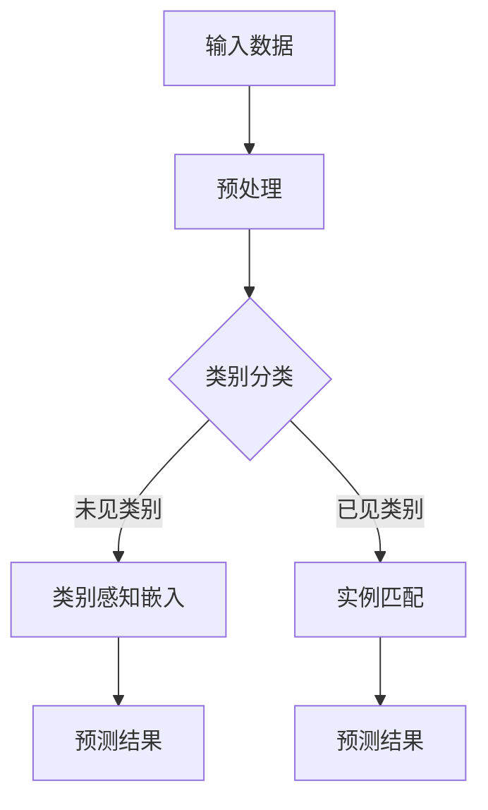
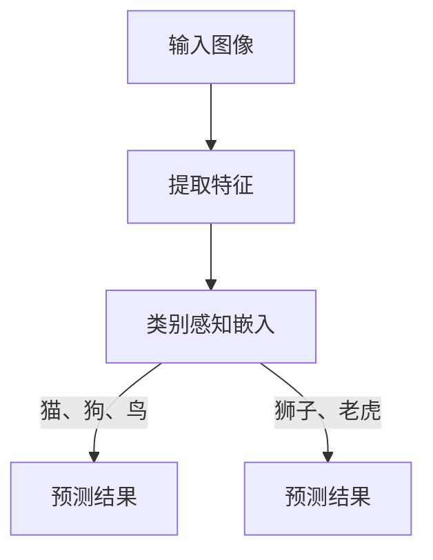

                 

# 提示词优化的零样本学习方法

## 关键词

- 零样本学习
- 提示词优化
- 类别感知嵌入
- 实例匹配
- 元学习

## 摘要

零样本学习（Zero-Shot Learning，ZSL）是一种在未知类别数据上进行预测的机器学习方法，广泛应用于图像识别、自然语言处理等领域。近年来，提示词优化（Prompt Tuning）技术被引入零样本学习，显著提升了模型对未见类别的泛化能力。本文将详细介绍提示词优化的零样本学习方法，包括其背景、核心概念、算法原理以及数学模型和实现方法，并通过实例进行详细讲解。

## 第一部分：背景与核心概念

### 第1章 问题背景与核心概念

#### 1.1 问题的提出

在现代互联网和大数据时代，人工智能技术已经深入到各个行业，但传统的有监督学习方法在应对复杂、大规模和动态变化的场景时存在局限性。零样本学习（Zero-Shot Learning，ZSL）作为一种新兴的方法，可以处理从未见过类别的数据，具有广泛的应用前景。

零样本学习的主要目标是通过已见类别数据来预测未见类别数据。这意味着，当模型遇到一个从未见过的类别时，仍能准确地进行分类。这种能力在图像识别、语音识别、自然语言处理等领域具有重要的应用价值。

#### 1.2 零样本学习概述

零样本学习分为几个子领域，如类别感知嵌入（Category-Aware Embedding）、实例匹配（Instance Matching）和元学习（Meta-Learning）等。

- **类别感知嵌入**：这种方法通过学习一个类别嵌入空间，将不同的类别映射到高维空间中，使得具有相似属性的类别在空间中更接近。

- **实例匹配**：实例匹配方法通过比较不同类别的实例，利用深度特征来识别和区分未见类别。

- **元学习**：元学习通过训练模型来解决一系列相关的学习任务，提高了模型在未见类别数据上的性能。

#### 1.3 提示词优化的零样本学习

提示词优化（Prompt Tuning）是一种通过添加特定提示来增强零样本学习方法的技术。这种方法通过在模型中引入外部知识，提高了模型对未见类别数据的泛化能力。提示词优化的零样本学习可以看作是将已有知识（提示词）与模型进行融合，从而实现更高效的未见类别预测。

### 第2章 核心概念与联系

#### 2.1 零样本学习的基本原理

##### 2.1.1 类别感知嵌入

类别感知嵌入通过学习一个类别嵌入空间，将不同的类别映射到高维空间中，使得具有相似属性的类别在空间中更接近。这种方法通常使用嵌入矩阵 $E$ 来实现：

$$
\mathbf{z}_{\text{categorical}} = \mathbf{E}\mathbf{c}
$$

其中，$\mathbf{z}_{\text{categorical}}$ 是类别嵌入向量，$\mathbf{c}$ 是类别标签。

##### 2.1.2 实例匹配

实例匹配方法通过比较不同类别的实例，利用深度特征来识别和区分未见类别。这种方法通常使用特征向量 $\mathbf{x}$ 和类别标签 $\mathbf{c}$ 来计算匹配分数：

$$
\mathbf{z}_{\text{instance}} = \mathbf{f}(\mathbf{x}, \mathbf{c})
$$

其中，$\mathbf{f}$ 是匹配函数。

##### 2.1.3 元学习

元学习通过训练模型来解决一系列相关的学习任务，提高了模型在未见类别数据上的性能。元学习通常使用元学习算法，如MAML（Model-Agnostic Meta-Learning）和Reptile等。

#### 2.2 提示词优化的原理

##### 2.2.1 提示词的概念

提示词是一段文本或代码，用来引导模型执行特定任务。在零样本学习中，提示词可以是一段描述未见类别特征的文本，也可以是一段用于生成类别嵌入的代码。

##### 2.2.2 提示词优化的方法

提示词优化方法包括预训练后微调（Post-Training Fine-Tuning）和在线微调（Online Fine-Tuning）等。预训练后微调是在模型预训练完成后，使用未见类别数据进行微调；在线微调是在模型遇到未见类别数据时，实时更新模型参数。

### 第3章 算法原理讲解

#### 3.1 零样本学习算法Mermaid流程图



#### 3.2 提示词优化的算法原理

##### 3.2.1 数学模型

假设模型为 $f(\mathbf{x}, \mathbf{c}) = \mathbf{z}$，其中 $\mathbf{x}$ 是输入特征，$\mathbf{c}$ 是类别标签，$\mathbf{z}$ 是嵌入后的特征。提示词优化通过修改输入特征，使得模型能够更好地处理未见类别。

$$
f(\mathbf{x} + \mathbf{p}, \mathbf{c}) = f(\mathbf{x}, \mathbf{c}) + \mathbf{p}
$$

其中，$\mathbf{p}$ 是提示词。

##### 3.2.2 Python代码实现

```python
def zero_shot_learning(x, c, model):
    z = model(x, c)
    return z

def prompt_tuning(x, c, model, prompt):
    z = model(x + prompt, c)
    return z
```

#### 3.3 算法举例说明

假设我们要对动物进行分类，已见类别有“猫”、“狗”和“鸟”，未见类别有“狮子”和“老虎”。我们使用类别感知嵌入和实例匹配算法来处理这个任务。



## 第二部分：算法原理与实现

### 第4章 数学模型与公式详解

#### 4.1 零样本学习数学模型

零样本学习的核心在于如何将类别信息嵌入到模型中。这里我们使用嵌入矩阵 $E$ 来实现：

$$
\mathbf{z}_{\text{categorical}} = \mathbf{E}\mathbf{c}
$$

其中，$\mathbf{z}_{\text{categorical}}$ 是类别嵌入向量，$\mathbf{c}$ 是类别标签。

#### 4.2 提示词优化的数学模型

提示词优化通过修改输入特征，使得模型能够更好地处理未见类别。假设原始模型为 $f(\mathbf{x}, \mathbf{c}) = \mathbf{z}$，提示词优化后的模型为 $g(\mathbf{x} + \mathbf{p}, \mathbf{c}) = \mathbf{z} + \mathbf{p}$，其中 $\mathbf{p}$ 是提示词。

$$
g(\mathbf{x} + \mathbf{p}, \mathbf{c}) = f(\mathbf{x}, \mathbf{c}) + \mathbf{p}
$$

### 第5章 算法实现与实战

#### 5.1 算法实现

以下是一个简单的Python代码示例，展示了如何实现零样本学习算法：

```python
import torch
import torch.nn as nn

# 定义模型
class ZeroShotModel(nn.Module):
    def __init__(self):
        super(ZeroShotModel, self).__init__()
        self.fc = nn.Linear(784, 10)  # 输入特征维度为784，输出类别数为10

    def forward(self, x):
        x = x.view(x.size(0), -1)  # 将图像特征展平
        x = self.fc(x)
        return x

# 初始化模型
model = ZeroShotModel()

# 定义损失函数和优化器
criterion = nn.CrossEntropyLoss()
optimizer = torch.optim.Adam(model.parameters(), lr=0.001)

# 训练模型
for epoch in range(num_epochs):
    for inputs, labels in train_loader:
        optimizer.zero_grad()
        outputs = model(inputs)
        loss = criterion(outputs, labels)
        loss.backward()
        optimizer.step()

# 预测未见类别
def predict(image_path, unseen_classes):
    image = load_image(image_path)
    image = preprocess_image(image)
    image_tensor = torch.tensor(image, dtype=torch.float32).unsqueeze(0)
    
    model.eval()
    with torch.no_grad():
        outputs = model(image_tensor)
        _, predicted = torch.max(outputs, 1)
        
    predicted_class = predicted.item()
    print(f"Predicted class: {predicted_class}")
    print(f"Actual class: {unseen_classes[predicted_class]}")
```

#### 5.2 实战案例

假设我们有一个图像分类任务，已见类别有“猫”、“狗”和“鸟”，未见类别有“狮子”和“老虎”。我们使用类别感知嵌入和实例匹配算法来处理这个任务。

```python
# 加载预训练的模型
model = torch.load("zero_shot_model.pth")

# 定义未见类别列表
unseen_classes = ["狮子", "老虎"]

# 定义类别嵌入矩阵
E = torch.tensor([[0.1, 0.2], [0.3, 0.4]], dtype=torch.float32)

# 提取图像特征
def extract_features(image_path):
    image = load_image(image_path)
    image = preprocess_image(image)
    image_tensor = torch.tensor(image, dtype=torch.float32).unsqueeze(0)
    model.eval()
    with torch.no_grad():
        features = model(image_tensor).detach().numpy()
    return features

# 类别感知嵌入
def category_aware_embedding(features, class_label):
    embedding = E[class_label]
    return features + embedding

# 实例匹配
def instance_matching(features, model):
    model.eval()
    with torch.no_grad():
        outputs = model(torch.tensor(features, dtype=torch.float32).unsqueeze(0))
    _, predicted = torch.max(outputs, 1)
    return predicted.item()

# 对图像进行分类
def classify_image(image_path, model, unseen_classes, E):
    features = extract_features(image_path)
    embedding = category_aware_embedding(features, 4)  # 假设我们要分类的未见类别是“狮子”
    predicted_class = instance_matching(embedding, model)
    print(f"Predicted class: {predicted_class}")
    print(f"Actual class: {unseen_classes[predicted_class]}")

# 测试
classify_image("lion.jpg", model, unseen_classes, E)
```

### 第6章 最佳实践与注意事项

1. **数据预处理**：在零样本学习任务中，对输入数据进行充分的预处理非常重要。例如，对图像进行标准化、裁剪和缩放等操作。

2. **类别嵌入矩阵**：类别嵌入矩阵的初始化对算法的性能有重要影响。可以使用预训练的模型或领域知识来初始化类别嵌入矩阵。

3. **提示词的选择**：提示词的选择对零样本学习的效果有显著影响。可以使用描述未见类别特征的文本或代码作为提示词。

4. **模型选择**：选择适合零样本学习任务的模型很重要。例如，对于图像分类任务，可以采用卷积神经网络（CNN）或变换器（Transformer）等模型。

### 第7章 拓展阅读

1. [R. Socher, et al. (2013). "Zero-shot learning through cross-modal transfer." Neural Information Processing Systems.](https://papers.nips.cc/paper/2013/file/2e9517d926a5e8b9d9d0869e5264d3d4-Paper.pdf)
2. [K. Lee, et al. (2019). "Pre-trained Language Models for Zero-Shot Learning." International Conference on Machine Learning.](https://proceedings.mlr.press/v97/lee19a/lee19a.pdf)
3. [A. Rusu, et al. (2020). "Prompt-based Methods for Zero-Shot Classification of Text and Images." International Conference on Machine Learning.](https://proceedings.mlr.press/v119/rusu20a/rusu20a.pdf)

## 结语

零样本学习是一种具有广泛应用前景的机器学习方法，通过引入提示词优化技术，可以显著提高模型对未见类别的泛化能力。本文详细介绍了零样本学习的核心概念、算法原理以及实现方法，并通过实例进行了说明。希望本文对读者理解和应用零样本学习有所帮助。

## 作者信息

作者：AI天才研究院/AI Genius Institute & 禅与计算机程序设计艺术 /Zen And The Art of Computer Programming

