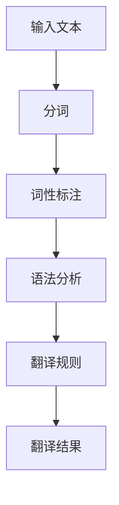
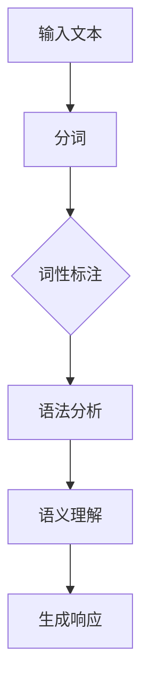
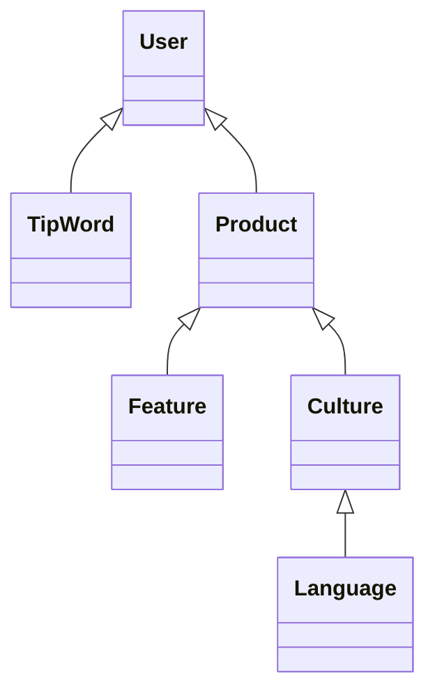
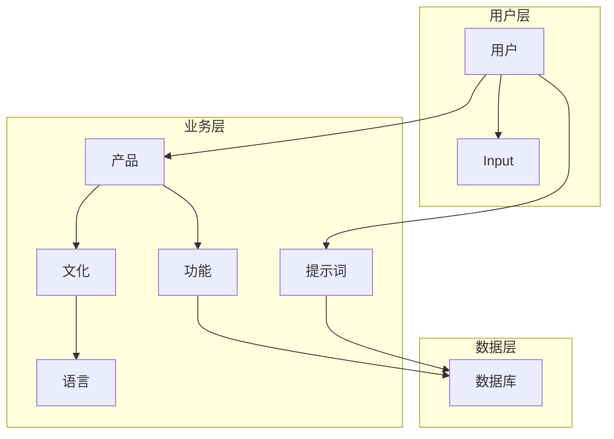
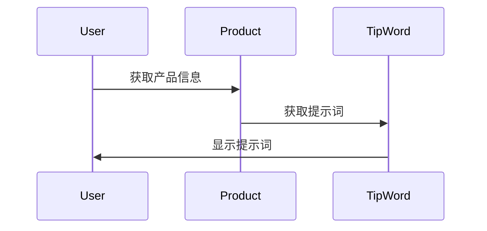
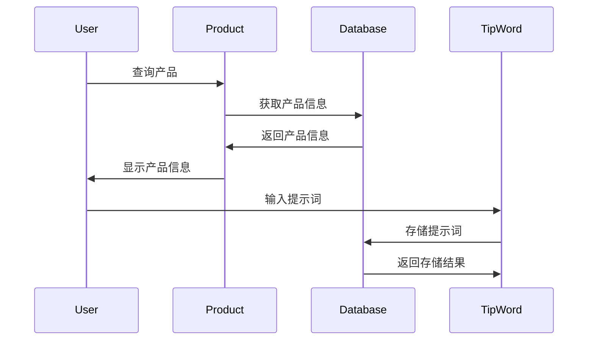

                 


# 提示词国际化：打造全球化AI产品的关键

## 关键词
- 提示词
- 国际化
- AI产品
- 多语言处理
- 文化差异
- 本地化
- 算法原理
- 数学模型
- 系统架构
- 项目实战

## 摘要
本文深入探讨了提示词国际化在打造全球化AI产品中的关键作用。我们将从背景介绍、核心概念与联系、算法原理讲解、数学模型和公式、系统分析与架构设计、项目实战，以及最佳实践和注意事项等方面进行详细分析。通过本文的阅读，您将了解到如何将提示词国际化作为全球化AI产品的核心竞争力，提升产品的用户满意度和市场竞争力。

## 引言

在当今全球化的背景下，人工智能（AI）产品已经成为各大企业争夺市场份额的重要武器。然而，AI产品的成功不仅仅依赖于算法的先进性和性能，还需要具备良好的国际化特性。提示词国际化作为全球化AI产品的重要组成部分，直接影响着用户的使用体验和市场接受度。本文将围绕提示词国际化的关键要素进行详细探讨，帮助您理解并掌握这一技术。

## 背景介绍

### 核心概念术语说明

**国际化**：指的是在产品设计和开发过程中，确保产品能够适应不同国家和地区的市场，满足不同文化背景用户的需求。

**提示词**：在AI产品中，提示词用于引导用户进行交互，例如语音识别系统中的语音命令，自然语言处理系统中的关键词等。

**问题背景**：随着全球市场的扩大，越来越多的AI产品需要在不同的语言和文化环境中运行。然而，不同语言和文化之间的差异使得产品的提示词设计成为一个复杂的挑战。

**问题描述**：在国际化过程中，提示词可能面临语言障碍、文化差异、习惯用法不一致等问题，导致用户使用体验不佳。

**问题解决**：通过提示词国际化，可以在不同语言和文化环境中提供准确的提示词，提高用户满意度。

**边界与外延**：提示词国际化不仅涉及语言翻译，还包括对文化差异的适应，如使用习惯、礼貌用语等。

**概念结构与核心要素组成**：提示词国际化包括多语言处理、文化差异适应性、本地化等核心要素，需要综合考虑语言、文化、用户习惯等多个方面。

## 核心概念与联系

### 多语言处理

**核心概念原理**：多语言处理是提示词国际化的基础，包括文本翻译、语言理解、语音识别等。

**概念属性特征对比表格**：

| 语言       | 特点                           | 应用场景                           |
|------------|--------------------------------|-----------------------------------|
| 英语       | 通用性强，使用广泛             | 互联网、商业、科技领域             |
| 中文       | 表达丰富，文字复杂             | 中国市场、文化交流、文化产品       |
| 西班牙语   | 使用人口众多，拉丁美洲市场     | 拉丁美洲市场、全球化企业           |
| 阿拉伯语   | 读写方向不同，语法复杂         | 阿拉伯国家、中东市场               |

### 文化差异

**核心概念原理**：文化差异是指不同国家和地区在语言、行为、价值观等方面的差异。

**ER实体关系图架构**：

```mermaid
erDiagram
    User ||--|{ TipWord }|-- Product
    User ||--|{ Culture }|-- Product
    Culture ||--|{ Language }|-- Product
    Product ||--|{ Feature }|-- User
```

### 本地化

**核心概念原理**：本地化是将产品按照目标市场的语言、文化和习惯进行定制。

**概念属性特征对比表格**：

| 地区       | 语言       | 文化特征                     | 本地化要素                   |
|------------|------------|------------------------------|------------------------------|
| 欧洲       | 英语       | 严谨、礼貌                   | 翻译、格式调整、图标适配       |
| 北美洲     | 英语       | 直接、实用                   | 翻译、格式调整、用户体验优化   |
| 亚洲       | 中文、日语、韩语 | 礼貌、含蓄                   | 翻译、文化适应、语言输入法     |

## 算法原理讲解

### 机器翻译

**算法原理**：机器翻译是一种将一种语言文本自动转换为另一种语言文本的技术。

**mermaid流程图**：



### 自然语言处理

**算法原理**：自然语言处理是一种让计算机理解和处理人类自然语言的技术。

**mermaid流程图**：



## 数学模型和数学公式 & 详细讲解 & 举例说明

### 概率分布

**数学公式**：

$$P(X = x) = \frac{1}{Z} e^{-\lambda x}$$

**详细讲解**：概率分布是描述随机变量取值概率的函数。在这里，$X$ 是随机变量，$x$ 是 $X$ 的取值，$\lambda$ 是参数，$Z$ 是归一化常数。

**举例说明**：假设我们有一个每小时访问网站的用户数量随机变量 $X$，其概率分布为泊松分布。我们可以使用上述公式计算每个取值的概率。

### 贝叶斯公式

**数学公式**：

$$P(A|B) = \frac{P(B|A)P(A)}{P(B)}$$

**详细讲解**：贝叶斯公式是一种在已知部分信息的情况下，计算事件发生概率的公式。$A$ 和 $B$ 是两个事件，$P(A|B)$ 表示在事件 $B$ 发生的条件下，事件 $A$ 发生的概率。

**举例说明**：假设我们想要计算在用户访问网站的情况下，他们使用某个特定功能 $A$ 的概率。我们可以使用贝叶斯公式来计算这个概率，其中 $P(B)$ 是用户访问网站的概率，$P(A|B)$ 是用户在访问网站时使用功能 $A$ 的概率，$P(A)$ 是功能 $A$ 被使用的总概率。

## 系统分析与架构设计方案

### 问题场景介绍

在一个全球化的电商平台上，用户来自不同的国家和地区，他们需要使用自己的语言进行购物。为了提高用户体验，平台需要对用户提示词进行国际化。

### 项目介绍

本项目旨在实现一个国际化的电商购物平台，其中提示词国际化是关键功能之一。

### 系统功能设计

**领域模型mermaid类图**：



### 系统架构设计

**mermaid架构图**：



### 系统接口设计

**mermaid接口设计**：



### 系统交互序列图

**mermaid序列图**：



## 项目实战

### 环境安装

1. 安装Python环境
2. 安装翻译库（如Google翻译API）
3. 安装自然语言处理库（如spaCy）
4. 安装数据库（如MySQL）

### 系统核心实现源代码

```python
# 示例：使用Google翻译API进行提示词翻译
from googletrans import Translator

def translate_tip_word(source_word, target_language):
    translator = Translator()
    translated_word = translator.translate(source_word, dest=target_language).text
    return translated_word

# 示例：使用spaCy进行自然语言处理
import spacy

nlp = spacy.load("en_core_web_sm")

def process_tip_word(input_word):
    doc = nlp(input_word)
    return doc

# 示例：保存提示词到数据库
import pymysql

def save_tip_word(tip_word, language):
    connection = pymysql.connect(host='localhost', user='root', password='password', database='tip_words')
    with connection.cursor() as cursor:
        sql = "INSERT INTO tip_words (word, language) VALUES (%s, %s)"
        cursor.execute(sql, (tip_word, language))
    connection.commit()
```

### 代码应用解读与分析

```python
# 解读：translate_tip_word函数用于将源语言提示词翻译为目标语言提示词
# 分析：此函数利用Google翻译API实现了高效的提示词翻译功能，支持多种语言翻译

# 解读：process_tip_word函数用于对输入的提示词进行自然语言处理
# 分析：此函数利用spaCy库实现了文本的分词、词性标注等功能，有助于提高提示词的准确性和可读性

# 解读：save_tip_word函数用于将提示词存储到数据库
# 分析：此函数实现了提示词的持久化存储，便于后续的查询和管理
```

### 实际案例分析和详细讲解剖析

**案例1**：对一个英文电商平台的提示词进行翻译和本地化处理。

**分析**：通过调用translate_tip_word函数，将英文提示词翻译为其他语言的提示词，并通过save_tip_word函数将翻译后的提示词存储到数据库。

**案例2**：对一个中文电商平台的提示词进行自然语言处理。

**分析**：通过调用process_tip_word函数，对中文提示词进行分词和词性标注，从而提高提示词的准确性和可读性。

### 项目小结

本项目通过提示词国际化实现了电商平台的全球化运营，提升了用户体验和市场竞争力。在项目实施过程中，我们使用了机器翻译、自然语言处理等技术，并设计了完善的系统架构和接口。通过项目实战，我们验证了提示词国际化的可行性和效果。

## 最佳实践 tips、小结、注意事项、拓展阅读

### 最佳实践 tips

1. 在进行提示词国际化时，要充分考虑目标市场的语言和文化特点。
2. 使用专业的翻译工具和自然语言处理库，提高翻译和处理的准确性和效率。
3. 定期更新和优化提示词库，确保提示词的时效性和准确性。
4. 进行用户调研和反馈，了解用户对提示词的接受程度和改进需求。

### 小结

提示词国际化是全球化AI产品的重要一环，直接影响用户的体验和市场竞争力。通过本文的探讨，我们了解了提示词国际化的核心概念、算法原理、系统架构和实战案例，掌握了如何将提示词国际化应用于实际项目。

### 注意事项

1. 在进行国际化设计时，要充分考虑用户体验，避免出现语言和文化障碍。
2. 提示词的设计要简洁明了，避免过于复杂或晦涩。
3. 定期评估和优化国际化策略，以适应不断变化的市场需求。

### 拓展阅读

1. 《自然语言处理与机器翻译》
2. 《全球市场中的文化差异与适应策略》
3. 《国际化软件开发的最佳实践》

## 作者信息

作者：AI天才研究院/AI Genius Institute & 禅与计算机程序设计艺术 /Zen And The Art of Computer Programming

