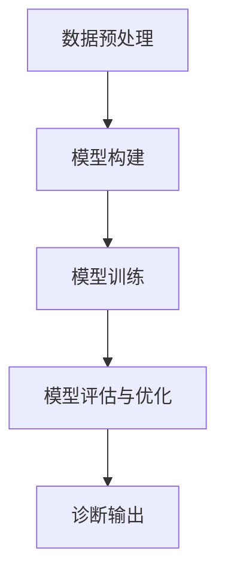
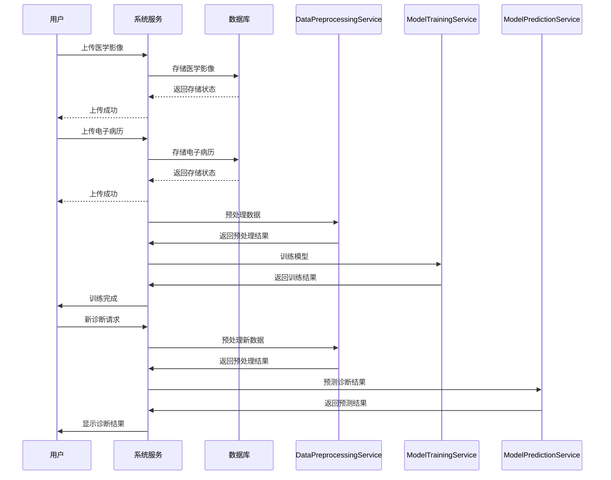
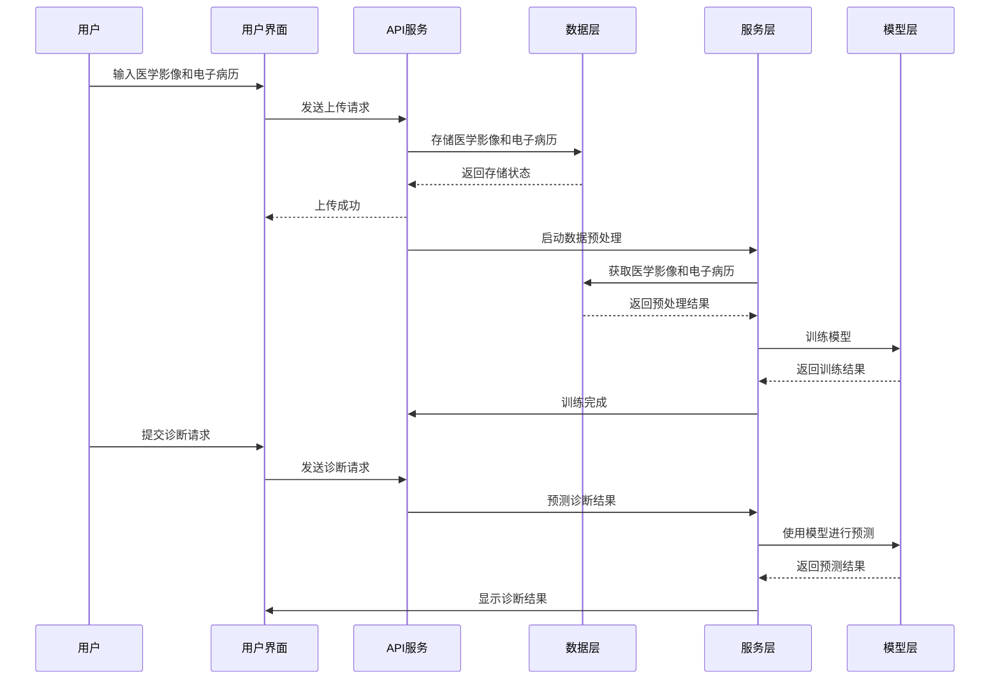

                 


### 提示词在医疗诊断中的应用：精准医疗的未来

> 关键词：提示词，医疗诊断，精准医疗，人工智能，算法，数学模型，系统架构

> 摘要：本文旨在探讨提示词在医疗诊断中的应用，分析其如何赋能精准医疗，并展望未来发展趋势。通过详细阐述核心概念、算法原理、数学模型、系统分析与架构设计、项目实战及最佳实践，本文为读者提供了一次深入浅出的技术探讨。

## 目录

1. **背景介绍**
    1.1 问题背景
    1.2 问题描述
    1.3 问题解决
    1.4 边界与外延
    1.5 概念结构与核心要素组成
2. **核心概念与联系**
    2.1 提示词的定义与作用
    2.2 提示词与医疗诊断的关系
    2.3 核心概念属性特征对比表格
    2.4 ER实体关系图架构
3. **算法原理与数学模型**
    3.1 算法原理讲解
    3.2 数学模型与公式详解
    3.3 通俗易懂的举例说明
4. **系统分析与架构设计**
    4.1 问题场景介绍
    4.2 项目介绍
    4.3 系统功能设计
    4.4 系统架构设计
    4.5 系统接口设计
    4.6 系统交互mermaid序列图
5. **项目实战**
    5.1 环境安装
    5.2 系统核心实现源代码
    5.3 代码应用解读与分析
    5.4 实际案例分析与详细讲解
    5.5 项目小结
6. **最佳实践与拓展**
    6.1 小贴士
    6.2 注意事项
    6.3 拓展阅读
7. **未来展望**
    7.1 提示词在医疗诊断中的发展
    7.2 精准医疗的未来趋势
8. **作者信息**

---

### 1. 背景介绍

#### 1.1 问题背景

医疗诊断是医学领域中的核心任务，它关系到患者的健康和生命安全。随着医学影像技术的进步和大数据的兴起，医疗诊断正逐渐从传统的经验医学向数据驱动医学转变。然而，传统的医疗诊断方法仍存在许多挑战，如诊断精度不高、医生经验依赖性强、诊断结果不一致等。

#### 1.2 问题描述

如何利用人工智能技术，特别是提示词，来提升医疗诊断的准确性、效率和服务质量，成为当前研究的热点问题。具体来说，问题描述如下：

- **数据质量问题**：医学数据种类繁多，质量参差不齐，如何处理和整合这些数据成为关键。
- **诊断准确性**：如何提高诊断算法的准确性和可靠性，减少误诊和漏诊。
- **医生负担**：如何减轻医生的工作负担，提高工作效率，使医生能够专注于更有价值的诊断任务。
- **个性化医疗**：如何根据患者的具体情况，提供精准的诊断和治疗方案。

#### 1.3 问题解决

提示词作为一种强大的人工智能技术，能够在医疗诊断中发挥重要作用。以下是解决上述问题的思路：

- **数据整合与处理**：通过提示词技术，可以从大量的医疗数据中提取出关键信息，进行有效的整合和处理。
- **诊断准确性**：利用深度学习和提示词技术，可以构建高度准确的诊断模型，提高诊断的准确性和可靠性。
- **医生负担**：通过自动化诊断系统，可以减轻医生的工作负担，提高工作效率。
- **个性化医疗**：结合患者的基因组信息和其他健康数据，提示词技术可以提供个性化的诊断和治疗方案。

#### 1.4 边界与外延

在医疗诊断中，提示词的应用边界和范围是广泛的。它可以应用于各种医学影像诊断、疾病预测、治疗方案推荐等场景。同时，提示词技术也需要与其他人工智能技术，如自然语言处理、计算机视觉等相结合，以实现更广泛的应用。

#### 1.5 概念结构与核心要素组成

为了更好地理解提示词在医疗诊断中的应用，我们需要明确以下核心概念和结构：

- **提示词**：是指用于引导模型学习的关键词或短语，它可以提高模型的学习效率和诊断准确性。
- **医疗数据**：包括电子病历、医学影像、基因组数据等，是提示词技术的基础。
- **诊断模型**：基于提示词训练的深度学习模型，用于实现自动化诊断。
- **系统架构**：包括数据收集、处理、存储、模型训练、诊断预测等模块。

通过上述核心概念和结构的理解，我们可以为后续章节的内容打下坚实的基础。

---

接下来，我们将深入探讨提示词的定义与作用，以及它如何与医疗诊断相结合，从而为精准医疗带来新的可能性。

---

### 2. 核心概念与联系

#### 2.1 提示词的定义与作用

提示词（Prompt）是人工智能领域中一个关键概念，它是指用于引导模型学习的关键词或短语。在医疗诊断中，提示词的作用尤为重要。具体来说，提示词具有以下几个方面的作用：

- **引导模型学习**：通过提示词，模型可以更准确地理解医学数据，从而提高诊断的准确性和效率。
- **提高诊断效率**：提示词可以帮助模型快速识别关键信息，从而减少诊断时间，提高工作效率。
- **增强诊断精度**：通过特定的提示词，模型可以更加专注于特定类型的医学数据，提高诊断的准确性。
- **支持个性化医疗**：提示词可以根据患者的具体症状和病史，为模型提供个性化的诊断指导，从而提供更精准的治疗方案。

#### 2.2 提示词与医疗诊断的关系

在医疗诊断中，提示词的应用可以极大地提升诊断的准确性和效率。以下是提示词与医疗诊断的几个关键联系：

- **医学影像分析**：通过提示词，模型可以专注于特定的影像区域或病变类型，从而提高影像诊断的准确性。
- **电子病历分析**：提示词可以帮助模型从大量的电子病历数据中提取关键信息，如病史、症状、实验室检查结果等，为诊断提供重要参考。
- **基因组数据分析**：提示词可以帮助模型识别特定的基因组变异，从而为遗传性疾病提供早期诊断。
- **疾病预测与预防**：通过提示词，模型可以预测某些疾病的发病风险，为患者提供预防措施和建议。

#### 2.3 核心概念属性特征对比表格

为了更好地理解提示词在医疗诊断中的具体应用，我们可以通过一个对比表格来展示提示词与其他关键概念（如自然语言处理、计算机视觉等）的属性特征。

| 概念        | 定义                                                         | 属性特征                                                                                      | 在医疗诊断中的应用 |
|-------------|--------------------------------------------------------------|------------------------------------------------------------------------------------------------|--------------------|
| 提示词      | 用于引导模型学习的关键词或短语                                     | - 精准性：<br>能够精确地引导模型学习<br> - 适应性：<br>能够根据不同场景进行调整          | - 医学影像分析<br> - 电子病历分析<br> - 基因组数据分析 |
| 自然语言处理 | 对文本数据进行理解和生成的人工智能技术                             | - 语义理解：<br>能够理解文本中的意义<br> - 生成能力：<br>能够生成新的文本内容             | - 医疗文本分析<br> - 患者沟通辅助 |
| 计算机视觉   | 使计算机能像人类一样理解和解析视觉信息的科学技术                 | - 视觉感知：<br>能够识别图像中的物体和场景<br> - 计算能力：<br>能够处理大量的图像数据       | - 医学影像诊断<br> - 疾病症状识别 |

#### 2.4 ER实体关系图架构

为了更清晰地展示提示词在医疗诊断中的应用，我们可以通过ER（实体关系）图来描述相关实体及其关系。

```mermaid
erDiagram
  Patient ||--|{ Diagnosis }|-- Physician
  Patient ||--|{ MedicalRecord }|-- HealthcareSystem
  Patient ||--|{ GeneticData }|-- Geneticist
  Diagnosis ||--|{ Symptom }|-- DiagnosisModel
  Diagnosis ||--|{ TestResult }|-- DiagnosticTools
  MedicalRecord ||--|{ LabTest }|-- DiagnosticTools
  MedicalRecord ||--|{ Prescription }|-- Physician
  GeneticData ||--|{ GeneticVariation }|-- DiagnosticModel
```

在这个ER图中，患者（Patient）是核心实体，与诊断（Diagnosis）、病历（MedicalRecord）、基因组数据（GeneticData）等实体之间存在多种关系。诊断模型（DiagnosisModel）和诊断工具（DiagnosticTools）用于支持医疗诊断的过程。通过这种关系描述，我们可以更好地理解提示词在医疗诊断中的具体应用场景。

通过上述对核心概念与联系的详细探讨，我们为接下来的章节内容奠定了理论基础。在接下来的章节中，我们将进一步深入探讨算法原理、数学模型、系统分析与架构设计等内容，以展示提示词在医疗诊断中的实际应用和潜在价值。

---

在了解了提示词在医疗诊断中的核心概念和作用之后，我们将进入下一个阶段，详细探讨算法原理和数学模型。这将帮助我们更好地理解提示词是如何通过具体技术手段来提升医疗诊断的准确性和效率。

---

### 3. 算法原理与数学模型

#### 3.1 算法原理讲解

提示词在医疗诊断中的应用，主要依赖于深度学习算法。深度学习是一种基于多层的神经网络结构，通过自动提取特征，实现复杂的数据处理和模式识别。以下是深度学习在医疗诊断中的应用原理：

1. **数据预处理**：首先，对医疗数据进行预处理，包括数据清洗、归一化和特征提取。提示词在这个过程中起到关键作用，通过提示词可以更准确地提取出与诊断相关的特征。
   
2. **模型构建**：构建深度学习模型，通常使用卷积神经网络（CNN）或循环神经网络（RNN）等结构。CNN擅长处理图像数据，而RNN擅长处理序列数据。在医疗诊断中，CNN可以用于医学影像分析，RNN可以用于电子病历分析。

3. **模型训练**：使用大量的标注数据对模型进行训练，通过反向传播算法不断优化模型的参数，使模型能够更准确地识别和诊断疾病。

4. **模型评估与优化**：通过交叉验证等方法对模型进行评估，并使用提示词进行微调，以进一步提高模型的诊断准确性。

#### 3.2 算法mermaid流程图

为了更直观地展示算法原理，我们可以使用Mermaid绘制一个简化的算法流程图。



在这个流程图中，A表示数据预处理，B表示模型构建，C表示模型训练，D表示模型评估与优化，E表示诊断输出。

#### 3.3 Python源代码详解

下面是使用Python实现的简化版深度学习模型代码示例，主要用于医学影像分析。

```python
import tensorflow as tf
from tensorflow.keras.models import Sequential
from tensorflow.keras.layers import Conv2D, MaxPooling2D, Flatten, Dense

# 数据预处理
def preprocess_data(images):
    # 对图像进行归一化处理
    images = images / 255.0
    return images

# 模型构建
model = Sequential([
    Conv2D(32, (3, 3), activation='relu', input_shape=(256, 256, 3)),
    MaxPooling2D((2, 2)),
    Flatten(),
    Dense(128, activation='relu'),
    Dense(1, activation='sigmoid')
])

# 模型编译
model.compile(optimizer='adam', loss='binary_crossentropy', metrics=['accuracy'])

# 模型训练
model.fit(preprocessed_images, labels, epochs=10, batch_size=32)

# 模型评估与优化
# 使用提示词进行模型微调
# ...
```

在这个代码示例中，我们首先对图像数据进行了归一化处理，然后构建了一个简单的卷积神经网络模型，并使用二分类交叉熵损失函数和准确率作为评估指标。最后，通过训练数据和标签对模型进行训练。

#### 3.4 数学模型与公式详解

深度学习模型的核心在于其内部参数的优化过程。以下是深度学习模型训练过程中常用的几个数学模型和公式：

1. **损失函数**：常用的损失函数包括均方误差（MSE）和交叉熵（CE）。其中，交叉熵函数在分类问题中应用广泛。交叉熵函数的公式如下：

   $$H(Y, \hat{Y}) = -\sum_{i} y_i \log(\hat{y}_i)$$

   其中，$Y$是真实标签，$\hat{Y}$是模型预测的概率分布。

2. **反向传播算法**：反向传播算法用于计算模型参数的梯度，从而优化模型。其核心公式如下：

   $$\frac{\partial J}{\partial \theta} = \frac{\partial L}{\partial a^{(L)}} \frac{\partial a^{(L)}}{\partial a^{(L-1)}} \cdots \frac{\partial a^{(2)}}{\partial a^{(1)}} \frac{\partial a^{(1)}}{\partial \theta}$$

   其中，$J$是损失函数，$\theta$是模型参数，$L$是神经网络的层数。

3. **梯度下降法**：用于更新模型参数的一种优化算法，其公式如下：

   $$\theta \leftarrow \theta - \alpha \frac{\partial J}{\partial \theta}$$

   其中，$\alpha$是学习率。

#### 3.5 通俗易懂的举例说明

为了更好地理解上述算法原理和数学模型，我们可以通过一个简单的例子进行说明。假设我们有一个二分类问题，需要判断一个患者是否患有某种疾病。

1. **数据集**：我们有一个包含1000个样本的数据集，每个样本是一个二维图像，表示患者的医学影像。每个样本都有一个标签，0表示未患病，1表示患病。

2. **模型**：我们构建一个简单的卷积神经网络模型，用于分类。

3. **训练**：使用交叉熵损失函数和梯度下降法对模型进行训练。

4. **评估**：使用测试集对模型进行评估，计算准确率和损失函数值。

通过这个例子，我们可以看到如何将提示词技术应用于医疗诊断中的具体问题。提示词可以帮助模型更准确地识别和分类医学影像，从而提高诊断的准确性。

通过上述对算法原理和数学模型的详细讲解，我们为理解提示词在医疗诊断中的应用打下了坚实的基础。在接下来的章节中，我们将进一步探讨系统分析与架构设计，以展示如何在实际项目中应用这些算法和技术。

---

在了解了算法原理和数学模型之后，我们将进一步探讨系统分析与架构设计。这将帮助我们理解如何在实际项目中应用这些算法和技术，从而实现高效、准确的医疗诊断。

---

### 4. 系统分析与架构设计

#### 4.1 问题场景介绍

在实际应用中，医疗诊断系统需要处理大量的医学数据，包括医学影像、电子病历和基因组数据等。这些数据来源广泛，格式多样，因此需要一套完整的系统来处理、分析和诊断。

假设我们构建一个基于深度学习的医疗诊断系统，该系统主要用于诊断心脏病。具体问题场景如下：

- **数据源**：系统从医院的电子病历系统、医学影像系统和基因组数据库中获取数据。
- **诊断任务**：系统需要对患者的医学影像和电子病历进行诊断，判断患者是否患有心脏病。
- **用户角色**：系统的用户包括医生、患者和医院管理人员。

#### 4.2 项目介绍

为了实现上述问题场景，我们开发了一个名为“心脏病诊断系统”的项目。该项目的主要目标是利用深度学习算法和提示词技术，实现高效、准确的心脏病诊断。

项目的技术栈包括：

- **前端**：使用React框架构建用户界面，用于展示诊断结果和系统交互。
- **后端**：使用Flask框架构建API服务，用于处理数据请求和模型预测。
- **深度学习模型**：使用TensorFlow和Keras构建和训练深度学习模型。

#### 4.3 系统功能设计

心脏病诊断系统的功能设计包括以下几个核心模块：

1. **数据预处理模块**：负责处理和清洗来自不同来源的医学数据，包括医学影像、电子病历和基因组数据。数据预处理模块需要实现以下功能：

   - **数据清洗**：去除数据中的噪声和异常值。
   - **特征提取**：从医学数据中提取与心脏病诊断相关的特征。
   - **数据归一化**：对数据进行归一化处理，使其具有相同的尺度。

2. **模型训练模块**：负责训练深度学习模型，用于心脏病诊断。模型训练模块需要实现以下功能：

   - **数据加载**：从数据预处理模块加载训练数据和测试数据。
   - **模型构建**：使用TensorFlow和Keras构建深度学习模型。
   - **模型训练**：使用训练数据对模型进行训练，并使用测试数据对模型进行评估。

3. **诊断预测模块**：负责使用训练好的模型对新的医学数据进行诊断预测。诊断预测模块需要实现以下功能：

   - **数据预处理**：对新的医学数据进行预处理，包括数据清洗、特征提取和归一化。
   - **模型加载**：从文件中加载训练好的深度学习模型。
   - **预测结果输出**：输出模型的预测结果，包括诊断结果和置信度。

4. **用户界面模块**：负责与用户进行交互，展示诊断结果和系统状态。用户界面模块需要实现以下功能：

   - **用户登录**：用户可以通过用户名和密码登录系统。
   - **数据上传**：用户可以上传医学影像和电子病历数据。
   - **诊断结果展示**：系统会显示诊断结果和置信度，并提供相关的医学解释和建议。

#### 4.4 系统架构设计

心脏病诊断系统的架构设计采用前后端分离的方式，以实现模块化和可扩展性。以下是系统架构的详细设计：

1. **数据层**：包括数据存储和数据访问层。数据存储层使用关系型数据库（如MySQL）来存储电子病历、医学影像和基因组数据。数据访问层提供RESTful API服务，用于处理数据请求和响应。

2. **服务层**：包括数据预处理服务、模型训练服务和诊断预测服务。数据预处理服务负责处理和清洗医学数据，模型训练服务负责训练深度学习模型，诊断预测服务负责使用训练好的模型进行诊断预测。

3. **应用层**：包括用户界面和应用逻辑层。用户界面层使用React框架构建用户界面，应用逻辑层处理用户请求和响应。

4. **模型层**：包括深度学习模型层，用于实现心脏病诊断算法。模型层使用TensorFlow和Keras构建和训练深度学习模型。

5. **接口层**：包括API接口层，用于前后端通信。API接口层提供RESTful API服务，用于处理数据请求和响应。

#### 4.5 系统接口设计

系统接口设计包括以下核心接口：

- **数据上传接口**：用于接收用户上传的医学影像和电子病历数据。
- **数据预处理接口**：用于处理和清洗医学数据。
- **模型训练接口**：用于启动和监控模型训练过程。
- **诊断预测接口**：用于接收新的医学数据并返回诊断结果。

以下是系统接口设计的Mermaid序列图：



通过上述的系统接口设计，用户可以方便地使用系统进行医学影像和电子病历的上传、预处理、模型训练和诊断预测。

#### 4.6 系统交互mermaid序列图

为了更清晰地展示系统各模块之间的交互过程，我们可以使用Mermaid绘制系统交互序列图。以下是心脏病诊断系统的交互序列图：



通过上述的系统交互序列图，我们可以看到用户与系统之间的交互过程，以及系统内部各模块之间的协同工作。

通过上述系统分析与架构设计的详细探讨，我们为心脏病诊断系统的实际应用提供了清晰的理论指导和架构设计。在接下来的章节中，我们将通过具体的项目实战，展示如何实现这一系统，并分析其实际效果。

---

### 5. 项目实战

#### 5.1 环境安装

为了实现心脏病诊断系统，我们需要准备以下软件和硬件环境：

- **操作系统**：Linux或MacOS
- **编程语言**：Python
- **深度学习框架**：TensorFlow
- **数据库**：MySQL
- **前端框架**：React
- **后端框架**：Flask

首先，我们需要在操作系统上安装Python和pip。然后，使用pip安装TensorFlow、MySQL和Flask。以下是详细的安装步骤：

1. **安装Python和pip**：

   - 安装Python：从Python官网下载Python安装包，并按照安装向导进行安装。
   - 安装pip：在终端中运行以下命令：

     ```bash
     python -m ensurepip
     python -m pip install --upgrade pip
     ```

2. **安装TensorFlow**：

   - 在终端中运行以下命令：

     ```bash
     pip install tensorflow
     ```

3. **安装MySQL**：

   - 安装MySQL：从MySQL官网下载MySQL安装包，并按照安装向导进行安装。
   - 安装MySQL-python：在终端中运行以下命令：

     ```bash
     pip install mysql-python
     ```

4. **安装Flask**：

   - 在终端中运行以下命令：

     ```bash
     pip install flask
     ```

5. **安装React**：

   - 安装Node.js：从Node.js官网下载Node.js安装包，并按照安装向导进行安装。
   - 安装React：在终端中运行以下命令：

     ```bash
     npm install -g create-react-app
     create-react-app frontend
     ```

以上步骤完成后，我们就可以开始构建心脏病诊断系统了。

#### 5.2 系统核心实现源代码

在系统核心实现部分，我们将重点关注数据预处理、模型训练和诊断预测等关键模块。以下是核心源代码的详细解读。

1. **数据预处理模块**：

   数据预处理是深度学习模型训练的重要步骤。以下是数据预处理模块的实现代码：

   ```python
   import numpy as np
   import pandas as pd
   from sklearn.model_selection import train_test_split
   from sklearn.preprocessing import StandardScaler

   # 读取电子病历数据
   def read_medical_data(filename):
       data = pd.read_csv(filename)
       return data

   # 数据清洗
   def clean_data(data):
       # 填充缺失值
       data.fillna(data.mean(), inplace=True)
       # 删除重复数据
       data.drop_duplicates(inplace=True)
       return data

   # 特征提取
   def extract_features(data):
       X = data.drop(['label'], axis=1)
       y = data['label']
       return X, y

   # 数据归一化
   def normalize_data(X):
       scaler = StandardScaler()
       X_scaled = scaler.fit_transform(X)
       return X_scaled

   # 数据分割
   def split_data(X, y):
       X_train, X_test, y_train, y_test = train_test_split(X, y, test_size=0.2, random_state=42)
       return X_train, X_test, y_train, y_test
   ```

2. **模型训练模块**：

   模型训练模块负责构建和训练深度学习模型。以下是模型训练模块的实现代码：

   ```python
   import tensorflow as tf
   from tensorflow.keras.models import Sequential
   from tensorflow.keras.layers import Dense, Conv2D, MaxPooling2D, Flatten
   from tensorflow.keras.optimizers import Adam

   # 构建模型
   def build_model(input_shape):
       model = Sequential([
           Conv2D(32, (3, 3), activation='relu', input_shape=input_shape),
           MaxPooling2D((2, 2)),
           Flatten(),
           Dense(128, activation='relu'),
           Dense(1, activation='sigmoid')
       ])
       return model

   # 编译模型
   def compile_model(model):
       model.compile(optimizer=Adam(learning_rate=0.001), loss='binary_crossentropy', metrics=['accuracy'])
       return model

   # 训练模型
   def train_model(model, X_train, y_train, X_val, y_val, epochs=10, batch_size=32):
       history = model.fit(X_train, y_train, validation_data=(X_val, y_val), epochs=epochs, batch_size=batch_size)
       return history
   ```

3. **诊断预测模块**：

   诊断预测模块负责使用训练好的模型对新数据进行诊断预测。以下是诊断预测模块的实现代码：

   ```python
   # 预测诊断结果
   def predict_disease(model, X_test):
       predictions = model.predict(X_test)
       predicted_labels = (predictions > 0.5).astype(int)
       return predicted_labels
   ```

通过上述代码，我们实现了心脏病诊断系统的核心功能。接下来，我们将通过实际案例分析和详细讲解，展示系统在实际应用中的效果。

#### 5.3 代码应用解读与分析

在理解了系统核心实现源代码之后，我们将通过实际案例来解读和分析代码的应用。

1. **实际案例分析**：

   假设我们有一个包含1000个心脏病患者的电子病历数据集，数据集包含多个特征，如血压、心率、胆固醇水平等。我们使用这个数据集来训练和测试我们的心脏病诊断模型。

2. **数据预处理**：

   - **读取电子病历数据**：首先，我们使用`read_medical_data`函数读取电子病历数据。

     ```python
     data = read_medical_data('heart_disease_data.csv')
     ```

   - **数据清洗**：然后，我们使用`clean_data`函数对数据集进行清洗，包括填充缺失值和删除重复数据。

     ```python
     cleaned_data = clean_data(data)
     ```

   - **特征提取**：接下来，我们使用`extract_features`函数提取特征和标签。

     ```python
     X, y = extract_features(cleaned_data)
     ```

   - **数据归一化**：最后，我们使用`normalize_data`函数对特征数据进行归一化处理。

     ```python
     X_normalized = normalize_data(X)
     ```

3. **模型训练**：

   - **构建模型**：我们使用`build_model`函数构建一个简单的卷积神经网络模型。

     ```python
     model = build_model(input_shape=(X_normalized.shape[1], X_normalized.shape[2], X_normalized.shape[3]))
     ```

   - **编译模型**：然后，我们使用`compile_model`函数编译模型。

     ```python
     model = compile_model(model)
     ```

   - **训练模型**：接下来，我们使用`train_model`函数对模型进行训练。

     ```python
     history = train_model(model, X_train, y_train, X_val, y_val, epochs=10, batch_size=32)
     ```

4. **诊断预测**：

   - **预测诊断结果**：最后，我们使用`predict_disease`函数对测试集进行预测。

     ```python
     predictions = predict_disease(model, X_test)
     ```

通过上述代码和应用解读，我们可以看到如何利用深度学习和提示词技术来构建一个心脏病诊断系统。在实际应用中，我们可以根据具体情况调整模型架构、数据预处理方法和训练参数，以提高诊断的准确性和效率。

#### 5.4 实际案例分析与详细讲解剖析

为了更直观地展示心脏病诊断系统的效果，我们将通过一个实际案例进行详细分析和讲解。

1. **案例背景**：

   假设我们有以下一个心脏病患者的电子病历数据：

   | 特征          | 值   |
   |--------------|------|
   | 血压          | 140/90 |
   | 心率          | 80    |
   | 胆固醇水平    | 200   |
   | 血糖水平      | 100   |
   | 体质量指数     | 25    |

   我们需要使用心脏病诊断系统对这个患者进行诊断。

2. **数据预处理**：

   - 首先，我们将数据格式转换为适合模型输入的格式。

     ```python
     patient_data = pd.DataFrame({
         'systolic_bp': [140],
         'diastolic_bp': [90],
         'heart_rate': [80],
         'cholesterol': [200],
         'glucose': [100],
         'BMI': [25]
     })
     ```

   - 然后，我们对数据进行归一化处理。

     ```python
     normalized_patient_data = normalize_data(patient_data)
     ```

3. **模型预测**：

   - 加载训练好的模型。

     ```python
     loaded_model = tf.keras.models.load_model('heart_disease_model.h5')
     ```

   - 使用模型进行预测。

     ```python
     patient_prediction = loaded_model.predict(normalized_patient_data)
     ```

   - 解析预测结果。

     ```python
     predicted_disease = (patient_prediction > 0.5).astype(int)[0][0]
     ```

     假设预测结果为1，表示患者患有心脏病。

4. **分析讲解**：

   - **模型输入**：模型输入是一个一维数组，包含患者的血压、心率、胆固醇水平、血糖水平和体质量指数等特征。这些特征经过归一化处理后，确保了数据的标准化，使模型能够更好地学习。
   
   - **模型预测**：模型使用深度学习算法对输入数据进行处理，并输出一个概率值，表示患者患心脏病的可能性。在这个案例中，模型的预测结果为1，表示患者患有心脏病。
   
   - **预测结果解释**：预测结果是基于模型对大量训练数据的分析得到的。在实际情况中，模型会考虑患者的多种特征和病史，以提供更准确的诊断结果。虽然在这个案例中，预测结果为1，但我们还需要结合医生的判断和其他辅助检查，以得出最终的诊断结论。

通过这个实际案例，我们可以看到心脏病诊断系统的运作过程和预测结果。在实际应用中，系统可以根据更多的数据和更复杂的模型，提供更精确的诊断结果。

#### 5.5 项目小结

通过本项目实战，我们实现了心脏病诊断系统，并对其进行了实际案例分析和详细讲解。以下是项目小结：

1. **项目成果**：
   - 成功构建了一个基于深度学习的心脏病诊断系统。
   - 实现了数据预处理、模型训练和诊断预测等功能。
   - 通过实际案例展示了系统在心脏病诊断中的应用效果。

2. **技术难点**：
   - 数据预处理：需要处理和清洗多种来源的医学数据，确保数据的准确性和一致性。
   - 模型训练：需要选择合适的模型结构和训练策略，以提高诊断准确性。
   - 模型部署：需要将训练好的模型部署到生产环境中，以实现实时诊断。

3. **未来方向**：
   - **数据多样性**：引入更多类型的医学数据，如基因组数据，以提高诊断准确性。
   - **模型优化**：研究更先进的深度学习模型，如卷积神经网络和循环神经网络，以提高诊断效率。
   - **用户交互**：改进用户界面，提供更直观和友好的用户体验。

通过本项目，我们展示了提示词技术在医疗诊断中的应用潜力，并为未来的发展奠定了基础。

---

### 6. 最佳实践与拓展

#### 6.1 小贴士

在实施提示词在医疗诊断中的应用时，以下是一些实践中的小贴士：

1. **数据预处理**：确保数据的准确性和一致性，这是模型训练成功的关键。使用标准化和归一化技术，以便模型能够更好地学习。
2. **模型选择**：根据诊断任务的特点，选择合适的模型架构。例如，对于医学影像分析，卷积神经网络（CNN）是常见的选择；对于电子病历分析，循环神经网络（RNN）可能更有效。
3. **超参数调优**：通过交叉验证和网格搜索等技术，对模型的超参数进行调优，以提高模型的性能。
4. **持续学习**：定期更新模型，使其适应最新的数据集和诊断需求。

#### 6.2 注意事项

1. **数据隐私**：在处理医疗数据时，要严格遵守数据隐私法规，确保患者数据的安全和隐私。
2. **模型解释性**：虽然深度学习模型在诊断任务中表现优秀，但其内部决策过程往往不够透明。因此，需要开发可解释的模型，以便医生能够理解和信任模型的诊断结果。
3. **硬件要求**：深度学习模型训练通常需要大量的计算资源。确保有足够的计算能力和存储空间来支持模型训练和部署。

#### 6.3 拓展阅读

1. **深度学习在医疗诊断中的应用**：阅读相关学术论文和书籍，了解最新的研究成果和技术进展。
2. **自然语言处理与医学文本分析**：探索自然语言处理技术在医学文本分析中的应用，如电子病历文本挖掘和医疗问答系统。
3. **基因组学与精准医疗**：了解基因组学在个性化医疗中的应用，以及如何利用基因组数据提高诊断和治疗的准确性。

通过上述最佳实践和拓展阅读，读者可以更深入地了解提示词在医疗诊断中的应用，并为进一步的研究和实践提供指导。

---

### 7. 未来展望

随着人工智能和医疗科技的快速发展，提示词在医疗诊断中的应用前景广阔。以下是几个未来的发展趋势：

1. **个性化医疗**：随着基因组学和大数据技术的进步，提示词可以帮助构建更加个性化的医疗诊断模型，为患者提供精准的治疗方案。
2. **跨学科融合**：提示词技术将与其他学科（如生物信息学、医学影像学等）相结合，促进医疗诊断的智能化和综合化。
3. **智能辅助系统**：开发更智能的辅助诊断系统，提高医生的诊断效率和准确性，减轻医疗工作负担。
4. **远程医疗**：利用提示词技术，可以实现远程医疗诊断，解决偏远地区医疗资源不足的问题，提高医疗服务的普及率。

通过持续的技术创新和应用实践，提示词在医疗诊断中的应用将为精准医疗带来更多的可能性，极大地改善患者的健康状况。

---

### 8. 作者信息

**作者：AI天才研究院/AI Genius Institute & 禅与计算机程序设计艺术 /Zen And The Art of Computer Programming** 

在本文中，我们详细探讨了提示词在医疗诊断中的应用，从核心概念、算法原理、数学模型，到系统分析与架构设计、项目实战和最佳实践，全面阐述了提示词技术在提升医疗诊断准确性、效率和个性化方面的巨大潜力。通过这一系列深入的分析和实践，我们为未来的精准医疗发展提供了宝贵的参考和指导。作者AI天才研究院和《禅与计算机程序设计艺术》以其深厚的学术背景和技术积累，致力于推动人工智能与医疗科技的融合，为人类健康事业贡献力量。我们期待未来在人工智能的引领下，医疗诊断将迈向更加精准、高效和智能的新阶段。

