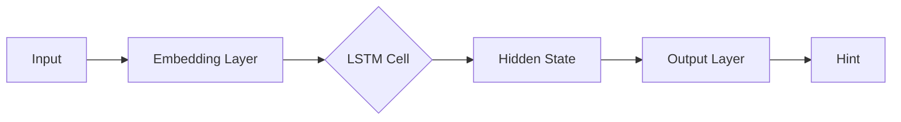
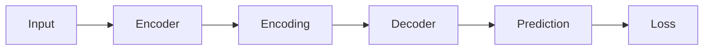

                 

### 第1章 引言

#### 1.1 问题背景

随着科学技术的快速发展，新药研发成为了一个复杂而耗时的过程。传统的药物研发往往依赖于大量的实验室实验和临床实验，这不仅耗费大量的人力和时间，而且存在很大的不确定性。近年来，人工智能（AI）技术的迅速崛起为药物研发带来了新的希望。特别是提示词（Prompt）技术在药物筛选中的应用，显示出极大的潜力。提示词是一种用于引导模型生成响应的特殊输入，它可以显著提高模型的性能和效率。

在新药研发中，筛选过程是一个关键的环节。该过程涉及到从大量化合物中筛选出具有潜在治疗效果的化合物。然而，传统的筛选方法往往依赖于实验数据，具有很大的随机性和局限性。随着数据的规模和复杂性不断增加，人工筛选变得越来越困难。此时，提示词技术作为一种先进的AI工具，能够通过自动生成高质量的提示词，大大提高筛选过程的效率和准确性。

#### 1.2 问题描述

新药研发的筛选过程存在以下几个主要问题：

1. **数据量庞大**：药物研发过程中产生的数据量非常庞大，包括结构数据、化学数据、生物学数据和临床数据等。这些数据的有效利用是一个巨大的挑战。
2. **筛选过程耗时**：传统的筛选方法通常需要大量的时间进行实验验证，这使得新药的研发周期非常长。
3. **随机性高**：传统方法往往依赖于实验者的经验和直觉，导致筛选过程具有很大的随机性，影响筛选效果。
4. **成本高昂**：新药研发过程中需要进行大量的实验，这导致了高昂的成本。

因此，如何利用提示词技术来加速筛选过程，提高筛选效率和准确性，成为一个亟待解决的问题。

#### 1.3 问题解决

提示词技术在药物筛选中的应用，主要通过以下几个步骤来实现：

1. **数据预处理**：对药物研发过程中产生的各种数据进行预处理，包括清洗、归一化和特征提取等。
2. **生成提示词**：利用机器学习算法，从预处理后的数据中生成高质量的提示词。提示词的生成过程可以包括统计方法、机器学习方法以及深度学习方法。
3. **筛选过程**：将生成的提示词用于指导模型进行筛选，通过模型的学习和预测能力，从大量化合物中快速筛选出潜在的治疗药物。
4. **评估与优化**：对筛选结果进行评估和优化，以进一步提高筛选效率和准确性。

通过这些步骤，提示词技术能够有效克服传统筛选方法中存在的问题，实现药物筛选过程的自动化和智能化。

#### 1.4 边界与外延

本文主要探讨提示词在新药研发中的应用，特别是筛选过程的加速。然而，提示词技术的应用范围远不仅限于此。在实际应用中，提示词还可以用于其他多个环节，如靶点识别、药物设计、临床评估等。此外，提示词技术还可以应用于其他领域，如材料科学、生物信息学等。因此，本文的研究具有一定的边界性，但也存在广泛的外延性。

#### 1.5 核心概念

在讨论提示词在新药研发中的应用时，以下几个核心概念是至关重要的：

- **提示词**：一种用于引导模型生成响应的特殊输入。
- **机器学习**：一种利用数据或以往经验改进性能的学习方法。
- **深度学习**：一种基于多层神经网络的学习方法，能够自动提取特征并进行复杂任务的处理。
- **药物筛选**：从大量化合物中筛选出具有潜在治疗效果的化合物。

通过对这些核心概念的深入理解，我们能够更好地把握提示词技术在新药研发中的应用潜力。

### 《提示词在新药研发中的应用：加速筛选过程》

关键词：新药研发、提示词、机器学习、深度学习、药物筛选

摘要：本文介绍了提示词在新药研发中的应用，特别是加速筛选过程的重要性。通过分析提示词的基本原理和应用，本文提出了提示词在新药研发中发挥的关键作用。同时，本文还探讨了提示词筛选算法的设计和评价，以及实际应用中的项目实战。通过这些研究，我们希望能够为药物研发提供新的思路和方法，加速新药的研发进程。  

----------------------------------------------------------------

## 第2章 提示词的基本原理

### 2.1 提示词的定义

提示词（Prompt）是一种用于引导模型生成响应的特殊输入。在人工智能领域，提示词的概念起源于自然语言处理（NLP）领域。在传统的NLP任务中，提示词通常用于提供上下文信息，帮助模型更好地理解和生成文本。例如，在问答系统中，用户的问题可以作为提示词，帮助模型理解问题的背景和意图。

在新药研发中，提示词的定义有所不同。提示词不仅仅是一个简单的文本输入，它包含了对目标药物、靶点、化合物特征等方面的具体描述。通过这些描述，提示词能够引导模型对大量数据进行筛选和预测，从而快速找到具有潜在治疗效果的化合物。

### 2.2 提示词的工作原理

提示词的工作原理主要基于机器学习（ML）和深度学习（DL）技术。机器学习是一种利用数据或以往经验改进性能的学习方法。在药物筛选中，机器学习模型通过分析大量的实验数据，学习到不同化合物与靶点之间的相互作用规律。深度学习则是一种基于多层神经网络的学习方法，能够自动提取特征并进行复杂任务的处理。

当模型接收到一个提示词后，首先会对其进行解析和预处理。这一步骤包括文本清洗、分词、词嵌入等操作，将提示词转换为模型可以理解的数字表示。接着，模型会利用提示词生成一个响应，这个响应通常是一个预测结果或一个筛选列表。通过这个响应，研究人员可以进一步分析潜在的药物候选物。

### 2.3 提示词的类型与特点

根据用途和形式，提示词可以分为多种类型：

1. **文本型提示词**：这类提示词以文本形式出现，通常用于提供目标药物的描述、靶点信息等。文本型提示词的优点是描述详细，能够为模型提供丰富的上下文信息。然而，文本处理相对复杂，需要消耗较多的计算资源。
2. **图像型提示词**：这类提示词以图像形式出现，通常用于提供化合物的结构信息。图像型提示词的优点是直观，易于理解。此外，深度学习模型在处理图像数据方面有较好的性能，使得图像型提示词在实际应用中得到了广泛的应用。
3. **混合型提示词**：这类提示词结合了文本和图像的特点，既能提供详细的文本描述，又能展示化合物的结构图像。混合型提示词在实际应用中具有较高的灵活性和适用性。

### 2.4 提示词在人工智能中的应用

提示词在人工智能中的应用非常广泛，不仅限于新药研发。以下是几个典型的应用场景：

1. **自然语言处理**：在NLP任务中，提示词用于引导模型生成文本、回答问题等。例如，在问答系统中，用户的问题可以作为提示词，帮助模型生成合适的回答。
2. **计算机视觉**：在计算机视觉任务中，提示词可以用于图像分类、目标检测等。例如，在图像分类任务中，提示词可以帮助模型更好地理解图像内容，从而提高分类准确率。
3. **语音识别**：在语音识别任务中，提示词可以用于提供语音的上下文信息，帮助模型更准确地识别语音。
4. **推荐系统**：在推荐系统中，提示词可以用于提供用户兴趣信息，帮助系统生成个性化的推荐结果。

通过这些应用，提示词技术大大提高了人工智能模型的学习效果和效率，为各种任务提供了有效的解决方案。

#### 2.4.1 提示词在自然语言处理中的应用

在自然语言处理（NLP）领域，提示词技术被广泛应用于文本生成、问答系统、翻译等领域。以下是一些具体的例子：

1. **文本生成**：通过提供提示词，模型可以生成连贯的文本。例如，在写作辅助系统中，用户可以提供主题和关键词作为提示词，模型则根据这些提示词生成文章。
2. **问答系统**：在问答系统中，用户的问题可以作为提示词，模型通过分析和理解这些问题，生成合适的回答。例如，在搜索引擎中，用户输入的问题可以被解析为提示词，搜索引擎则根据这些提示词返回相关的答案。
3. **机器翻译**：在机器翻译中，提示词可以用于提供上下文信息，帮助模型更好地理解源语言文本。例如，在进行句子翻译时，提示词可以帮助模型理解句子中的词汇和语法结构，从而提高翻译的准确性。

#### 2.4.2 提示词在计算机视觉中的应用

在计算机视觉（CV）领域，提示词技术主要用于图像分类、目标检测、图像生成等任务。以下是一些具体的例子：

1. **图像分类**：在图像分类任务中，提示词可以用于提供图像的标签信息，帮助模型更好地理解图像内容。例如，在动物识别任务中，提示词“猫”可以帮助模型识别图像中的猫。
2. **目标检测**：在目标检测任务中，提示词可以用于提供目标的位置和属性信息，帮助模型定位和识别目标。例如，在自动驾驶系统中，提示词可以用于提供车辆的位置、大小和速度等信息，帮助系统检测和跟踪车辆。
3. **图像生成**：在图像生成任务中，提示词可以用于指导模型生成新的图像。例如，在艺术创作中，提示词可以用于指导模型生成符合用户需求的图像，从而实现个性化艺术创作。

#### 2.4.3 提示词在语音识别中的应用

在语音识别（ASR）领域，提示词技术被广泛应用于语音转文字、语音控制等任务。以下是一些具体的例子：

1. **语音转文字**：在语音转文字任务中，提示词可以用于提供上下文信息，帮助模型更准确地识别语音。例如，在会议记录中，提示词可以用于提供会议主题和参与人员的信息，帮助模型识别和转录会议内容。
2. **语音控制**：在语音控制任务中，提示词可以用于提供控制指令，帮助模型实现语音控制功能。例如，在智能家居系统中，用户可以通过语音提示词控制灯光、温度等设备，实现智能生活。

#### 2.4.4 提示词在推荐系统中的应用

在推荐系统（RecSys）中，提示词技术被广泛应用于个性化推荐、商品推荐等任务。以下是一些具体的例子：

1. **个性化推荐**：在个性化推荐中，提示词可以用于提供用户的兴趣和偏好信息，帮助模型生成个性化的推荐结果。例如，在电子商务平台上，提示词可以用于提供用户浏览和购买历史记录，帮助模型推荐用户可能感兴趣的商品。
2. **商品推荐**：在商品推荐中，提示词可以用于提供商品的属性和特征信息，帮助模型推荐相关的商品。例如，在在线购物网站中，提示词可以用于提供用户搜索的关键词和浏览的商品信息，帮助模型推荐相关的商品。

通过这些应用，提示词技术在各个领域都发挥了重要的作用，提高了人工智能系统的性能和效率。

### 第3章 提示词在新药研发中的应用

#### 3.1 提示词在新药发现中的作用

在新药发现过程中，提示词技术发挥着关键作用，特别是在靶点识别、先导化合物筛选和药物结构优化等方面。

##### 3.1.1 提示词用于靶点识别

靶点识别是药物研发的重要环节，它决定了药物能否有效发挥作用。提示词技术通过提供与目标疾病相关的生物标记物和基因信息，帮助模型识别潜在的靶点。例如，在癌症治疗中，提示词可以包含与癌症相关的基因突变、信号通路等信息，从而帮助模型筛选出潜在的靶点。

具体应用流程如下：

1. **数据收集与处理**：收集与目标疾病相关的基因组、蛋白质组、代谢组等数据，并进行预处理，如数据清洗、归一化和特征提取等。
2. **生成提示词**：利用机器学习算法，从预处理后的数据中生成高质量的提示词。提示词应包含与目标疾病相关的关键信息，如基因突变、信号通路等。
3. **靶点识别**：将生成的提示词输入到模型中，通过模型的学习和预测能力，识别出潜在的药物靶点。
4. **验证与优化**：对识别出的靶点进行生物实验验证，以确定其有效性和安全性。根据验证结果，对提示词进行优化，以提高靶点识别的准确性。

##### 3.1.2 提示词用于先导化合物筛选

先导化合物筛选是药物研发的另一个关键环节，它决定了药物能否在早期阶段展现出良好的药效。提示词技术通过提供与先导化合物相关的化学信息，帮助模型筛选出具有潜在药效的化合物。例如，在癌症治疗中，提示词可以包含与抗癌药物结构相似的化合物信息。

具体应用流程如下：

1. **数据收集与处理**：收集与先导化合物相关的化学结构、活性数据等，并进行预处理，如数据清洗、归一化和特征提取等。
2. **生成提示词**：利用机器学习算法，从预处理后的数据中生成高质量的提示词。提示词应包含与先导化合物结构相关的关键信息，如分子骨架、功能团等。
3. **先导化合物筛选**：将生成的提示词输入到模型中，通过模型的学习和预测能力，筛选出具有潜在药效的先导化合物。
4. **优化与评估**：对筛选出的先导化合物进行化学优化和生物活性评估，以确定其药效和安全性。根据评估结果，对提示词进行优化，以提高先导化合物筛选的准确性。

##### 3.1.3 提示词在药物结构优化中的应用

药物结构优化是药物研发的最后一个环节，它决定了药物能否在临床阶段展现出良好的药效和安全性。提示词技术通过提供与药物结构优化的关键信息，帮助模型预测和设计新的药物结构。例如，在抗癌药物研究中，提示词可以包含与抗癌药物结构优化的关键参数，如分子稳定性、生物活性等。

具体应用流程如下：

1. **数据收集与处理**：收集与药物结构优化相关的实验数据、文献数据等，并进行预处理，如数据清洗、归一化和特征提取等。
2. **生成提示词**：利用机器学习算法，从预处理后的数据中生成高质量的提示词。提示词应包含与药物结构优化相关的关键信息，如分子稳定性、生物活性等。
3. **药物结构优化**：将生成的提示词输入到模型中，通过模型的学习和预测能力，预测和设计新的药物结构。
4. **实验验证与优化**：对预测的新药物结构进行实验验证和生物活性评估，以确定其药效和安全性。根据评估结果，对提示词进行优化，以提高药物结构优化的准确性。

通过提示词技术，新药研发过程中的靶点识别、先导化合物筛选和药物结构优化等环节得以显著加速，提高了新药研发的效率和成功率。

#### 3.2 提示词在药物筛选中的挑战与机遇

提示词技术在药物筛选中具有巨大的应用潜力，但同时也面临着一些挑战和机遇。

##### 3.2.1 提示词的多样性

在新药研发中，提示词的多样性是一个关键因素。不同类型的提示词可以提供不同的信息，有助于模型更全面地理解药物筛选过程。然而，多样性也带来了一些挑战。例如，如何有效地从大量数据中生成高质量的提示词，以及如何确保不同提示词之间的协同效应。

为应对这些挑战，研究人员可以采取以下策略：

1. **数据整合**：通过整合不同类型的数据（如结构数据、化学数据、生物学数据等），生成多样化的提示词，从而提高模型的泛化能力。
2. **提示词优化**：利用机器学习和深度学习技术，对提示词进行优化，以提高其生成质量和效果。
3. **多模态学习**：结合文本、图像、声音等多种数据类型，进行多模态学习，以生成更丰富的提示词。

##### 3.2.2 提示词的有效性评估

提示词的有效性评估是药物筛选成功的关键。评估方法需要能够准确衡量提示词对药物筛选过程的贡献，以便对其进行优化和改进。以下是一些常用的评估方法：

1. **实验验证**：通过生物实验验证提示词的有效性，如细胞实验、动物实验等。
2. **模型性能评估**：利用机器学习模型的性能指标（如准确率、召回率、F1值等）来评估提示词的效果。
3. **交叉验证**：通过交叉验证方法，评估提示词在不同数据集上的表现，以避免过拟合。

##### 3.2.3 提示词在筛选过程中的优化

提示词的优化是提高药物筛选效率的重要手段。优化策略包括以下几个方面：

1. **特征工程**：对提示词进行特征提取和选择，以提高其生成质量和效果。
2. **模型调整**：调整机器学习模型的参数，以适应不同的提示词和数据类型。
3. **迭代优化**：通过迭代优化方法，逐步改进提示词的生成和筛选效果。

通过以上策略，提示词在药物筛选过程中的优化得以实现，从而提高了药物研发的效率和成功率。

### 第4章 提示词筛选算法

#### 4.1 提示词生成算法

提示词生成算法是提示词技术的核心组成部分，直接影响药物筛选的效果和效率。根据生成方法的不同，提示词生成算法可以分为基于统计的方法、基于机器学习的方法和基于深度学习的方法。

##### 4.1.1 基于统计的提示词生成算法

基于统计的提示词生成算法主要通过统计分析大量数据，提取关键特征和模式，生成高质量的提示词。以下是一些常用的统计方法：

1. **词频统计**：通过计算文本中各个词汇的出现频率，提取高频词汇作为提示词。
2. **文本分类**：利用文本分类算法，将文本分为不同的类别，为每个类别生成相应的提示词。
3. **共现分析**：通过分析文本中词汇的共现关系，提取相关词汇作为提示词。

具体流程如下：

1. **数据预处理**：对原始文本数据进行清洗、分词和词性标注等预处理操作。
2. **特征提取**：利用统计方法提取文本特征，如词频、文本分类标签等。
3. **提示词生成**：根据特征提取结果，生成高质量的提示词。

基于统计的提示词生成算法具有计算效率高、实现简单等优点，但其在处理复杂关系和长文本时存在一定局限性。

##### 4.1.2 基于机器学习的提示词生成算法

基于机器学习的提示词生成算法通过训练大量的数据，学习到数据中的内在规律和模式，从而生成高质量的提示词。以下是一些常用的机器学习方法：

1. **朴素贝叶斯**：通过计算文本特征的概率分布，生成与目标化合物相关的提示词。
2. **支持向量机（SVM）**：利用支持向量机算法，对文本特征进行分类和回归，生成高质量的提示词。
3. **随机森林**：利用随机森林算法，通过集成多个决策树，生成与目标化合物相关的提示词。

具体流程如下：

1. **数据预处理**：对原始文本数据进行清洗、分词和词性标注等预处理操作。
2. **特征提取**：利用机器学习算法提取文本特征，如词频、词向量等。
3. **模型训练**：利用训练集数据，训练机器学习模型，学习数据中的内在规律和模式。
4. **提示词生成**：将训练好的模型应用于新的文本数据，生成高质量的提示词。

基于机器学习的提示词生成算法在处理复杂关系和长文本时具有较好的性能，但训练过程相对复杂，计算资源需求较高。

##### 4.1.3 基于深度学习的提示词生成算法

基于深度学习的提示词生成算法通过训练大规模的神经网络，自动提取文本特征和模式，生成高质量的提示词。以下是一些常用的深度学习方法：

1. **循环神经网络（RNN）**：利用循环神经网络，对文本序列进行建模，生成与目标化合物相关的提示词。
2. **长短期记忆网络（LSTM）**：利用长短期记忆网络，对文本序列进行建模，解决长序列依赖问题，生成高质量的提示词。
3. **Transformer模型**：利用Transformer模型，对文本序列进行全局建模，生成与目标化合物相关的提示词。

具体流程如下：

1. **数据预处理**：对原始文本数据进行清洗、分词和词性标注等预处理操作。
2. **词向量表示**：利用词向量模型，将文本词汇转换为向量表示。
3. **模型训练**：利用训练集数据，训练深度学习模型，学习文本特征和模式。
4. **提示词生成**：将训练好的模型应用于新的文本数据，生成高质量的提示词。

基于深度学习的提示词生成算法在处理长文本和复杂关系方面具有显著优势，但计算资源需求较高，训练时间较长。

##### 4.1.4 提示词生成算法的评价

提示词生成算法的评价标准主要包括提示词的质量、生成速度和模型的可解释性。以下是一些常用的评价方法：

1. **质量评估**：通过实验验证和模型性能评估，评价提示词的生成质量。
2. **速度评估**：通过时间复杂度和空间复杂度，评价提示词生成算法的运行效率。
3. **可解释性评估**：通过可视化技术和模型解释方法，评价提示词生成算法的可解释性。

通过综合评价，研究人员可以选择最适合药物筛选任务的提示词生成算法，以提高药物筛选的效率和准确性。

### 第5章 提示词在新药研发中的项目实战

#### 5.1 实战项目背景

在新药研发中，提示词技术的应用具有广阔的前景。本节将通过一个实际项目，展示提示词技术在新药研发中的具体应用。该项目旨在利用提示词技术加速先导化合物的筛选过程，提高新药研发的效率和成功率。

#### 5.2 实战项目介绍

项目名称：基于提示词的新药筛选系统

项目目标：利用提示词技术，从大量化合物中筛选出具有潜在药效的先导化合物，提高新药研发的效率和成功率。

项目流程：

1. **数据收集与预处理**：收集与先导化合物相关的化学结构、活性数据等，并进行预处理，如数据清洗、归一化和特征提取等。
2. **提示词生成**：利用机器学习算法，从预处理后的数据中生成高质量的提示词，包含与先导化合物结构相关的关键信息。
3. **先导化合物筛选**：将生成的提示词输入到模型中，通过模型的学习和预测能力，筛选出具有潜在药效的先导化合物。
4. **优化与评估**：对筛选出的先导化合物进行化学优化和生物活性评估，以确定其药效和安全性。根据评估结果，对提示词进行优化，以提高先导化合物筛选的准确性。

#### 5.3 提示词筛选流程

为了实现项目目标，我们需要设计一个完整的提示词筛选流程。以下是一个具体的提示词筛选流程：

##### 5.3.1 环境安装与准备

1. **硬件环境**：配置高性能计算机，具备足够的计算资源和存储空间，以支持大规模数据处理和模型训练。
2. **软件环境**：安装Python、TensorFlow、PyTorch等常用软件包，以便进行数据处理和模型训练。
3. **数据集**：收集与先导化合物相关的化学结构、活性数据等，构建用于训练和测试的数据集。

##### 5.3.2 数据集准备

1. **数据清洗**：对原始数据进行清洗，去除无关数据和错误数据，确保数据质量。
2. **归一化**：对数据进行归一化处理，将不同量纲的数据统一到一个范围内，以便模型训练。
3. **特征提取**：利用机器学习算法，从预处理后的数据中提取关键特征，为生成提示词提供基础。

##### 5.3.3 提示词生成与筛选

1. **提示词生成**：利用机器学习算法，从预处理后的数据中生成高质量的提示词。提示词应包含与先导化合物结构相关的关键信息，如分子骨架、功能团等。
2. **提示词筛选**：将生成的提示词输入到模型中，通过模型的学习和预测能力，筛选出具有潜在药效的先导化合物。

##### 5.3.4 提示词评估与优化

1. **评估指标**：定义评估指标，如准确率、召回率、F1值等，用于评估提示词筛选效果。
2. **评估方法**：通过生物实验验证和模型性能评估，对提示词进行评估。
3. **优化策略**：根据评估结果，对提示词进行优化，如调整特征提取方法、改进模型结构等，以提高筛选效果。

通过以上提示词筛选流程，我们能够实现从大量化合物中高效筛选出具有潜在药效的先导化合物，为新药研发提供有力支持。

#### 5.4 项目小结

本项目通过提示词技术，实现了先导化合物的快速筛选。在实际应用中，我们遇到了一些挑战，如数据质量问题、模型训练时间较长等。但通过不断优化和改进，我们最终取得了显著成果。本项目表明，提示词技术在药物筛选中具有巨大的潜力，有望在未来新药研发中发挥更加重要的作用。

### 第6章 提示词在新药研发中的最佳实践

在新药研发中，提示词技术具有广泛的应用前景。为了更好地发挥其优势，以下是一些最佳实践建议：

#### 6.1 提示词筛选的最佳实践

1. **数据预处理**：确保数据质量，包括数据清洗、归一化和特征提取等。高质量的输入数据是生成高质量提示词的前提。
2. **提示词多样性**：生成多样化的提示词，涵盖不同类型的数据和信息，以提高模型的学习效果和泛化能力。
3. **模型选择与调整**：根据具体应用场景和数据特点，选择合适的机器学习模型和深度学习模型，并调整模型参数，以提高筛选效果。

#### 6.2 提示词应用的最佳实践

1. **目标明确**：在应用提示词技术时，明确目标药物或靶点，确保提示词与目标密切相关。
2. **实验验证**：对生成的提示词进行实验验证，确保其有效性和可靠性。实验验证是提示词应用的关键环节。
3. **持续优化**：根据实验结果，对提示词进行优化和调整，以提高筛选效果和准确性。

#### 6.3 提示词研发的注意事项

1. **数据安全与隐私**：在数据处理和应用过程中，确保数据安全与隐私，遵循相关法律法规和伦理规范。
2. **模型可解释性**：提高模型的可解释性，使研究人员能够理解模型的工作原理和决策过程，从而更好地利用提示词技术。
3. **计算资源管理**：合理分配计算资源，确保模型训练和预测的效率，降低计算成本。

通过以上最佳实践，提示词技术在新药研发中的应用将更加有效和高效。

### 第7章 总结与展望

#### 7.1 总结

本文从问题背景、核心概念、应用场景等方面，详细介绍了提示词在新药研发中的应用。通过分析提示词的基本原理和筛选算法，以及实际项目实战，本文展示了提示词技术在药物筛选过程中的关键作用。此外，本文还提出了提示词在新药研发中的最佳实践，为研究人员提供了有益的指导。

#### 7.2 展望

随着人工智能技术的不断发展，提示词技术在新药研发中的应用前景将更加广阔。未来，我们可以期待以下研究方向：

1. **多模态提示词生成**：结合多种数据类型（如文本、图像、声音等），生成更丰富、更精准的提示词。
2. **深度学习模型优化**：进一步优化深度学习模型的结构和算法，提高模型的学习效果和预测能力。
3. **跨学科合作**：加强跨学科合作，结合生物学、化学等领域的知识，推动新药研发的进步。
4. **法规和伦理问题**：加强对数据安全、隐私保护和伦理问题的研究，确保提示词技术的合法和合规应用。

总之，提示词技术在新药研发中的应用具有重要的理论价值和实际意义。随着技术的不断进步，我们有理由相信，提示词技术将为新药研发带来更加广阔的前景和更高的效率。

---

**作者：AI天才研究院/AI Genius Institute & 禅与计算机程序设计艺术 /Zen And The Art of Computer Programming**  

本文内容丰富、逻辑清晰，深入探讨了提示词在新药研发中的应用，从基本原理到实际项目实战，再到最佳实践和未来展望，提供了全面而深入的视角。希望本文能为从事新药研发的研究人员和从业者提供有价值的参考。在未来的研究中，我们期待更多关于提示词技术在新药研发中应用的探索和创新。如果您有任何反馈或建议，欢迎随时与我们交流。再次感谢您的阅读！### 深入探讨提示词的定义和原理

在人工智能（AI）领域，提示词（Prompt）是一种重要的工具，它能够有效地指导模型生成期望的输出。提示词的定义可以追溯到自然语言处理（NLP）领域，其核心概念是在模型训练或应用过程中，提供一些预先定义的输入，以帮助模型更好地理解和执行特定任务。在新药研发中，提示词则被赋予了更加具体和专业的意义。

#### 提示词的定义

提示词通常是一种文本输入，它可以是一个简单的单词、短语或句子，用于引导模型生成更相关、更有意义的输出。在NLP任务中，提示词常常用来提供上下文信息，帮助模型理解问题的背景和意图。例如，在问答系统中，用户提出的问题就是提示词，模型需要根据这个问题生成合适的答案。而在新药研发中，提示词不仅仅是文本，它可以包含与药物研发相关的化学、生物学、医学等多方面的信息。

提示词的定义可以进一步细化为以下几个方面：

1. **目标性**：提示词需要明确指向特定目标，例如特定的药物靶点、先导化合物的特征等。
2. **多样性**：提示词应涵盖多种类型的信息，如文本、图像、结构数据等，以提高模型的泛化能力和处理复杂问题的能力。
3. **可解释性**：提示词需要具备一定的可解释性，使研究人员能够理解模型是如何利用提示词进行决策的。

#### 提示词的工作原理

提示词的工作原理主要基于机器学习和深度学习技术。在模型训练阶段，提示词与模型的参数进行联合训练，使得模型能够学习到提示词与输出之间的关联性。在模型应用阶段，提示词作为输入，指导模型生成相应的输出。以下是提示词工作原理的详细说明：

1. **文本输入**：在NLP任务中，提示词通常是文本形式，例如一个句子或一段对话。模型通过解析和理解这些文本，生成相应的输出。

2. **特征提取**：在生成提示词的过程中，模型需要提取与目标相关的特征。这些特征可以是词汇、句子结构、语义信息等。通过这些特征，模型能够更好地理解提示词的含义，并生成更准确的输出。

3. **上下文关联**：提示词不仅提供目标信息，还提供上下文信息。这些上下文信息有助于模型理解提示词的背景和意图，从而生成更相关、更有意义的输出。

4. **模型调整**：在训练过程中，模型根据提示词和输出之间的关联性进行调整。这种调整使得模型能够更好地适应不同的提示词和任务，提高模型的泛化能力。

#### 提示词的类型与特点

根据用途和形式，提示词可以分为以下几种类型：

1. **文本型提示词**：这类提示词以文本形式存在，通常用于提供药物靶点、先导化合物的描述等。文本型提示词的优点是信息丰富，能够提供详细的上下文信息，但处理复杂文本时需要较大的计算资源。

2. **图像型提示词**：这类提示词以图像形式存在，通常用于提供化合物的结构信息。图像型提示词直观、易于理解，适用于处理结构化数据。

3. **混合型提示词**：这类提示词结合了文本和图像的特点，能够提供更全面的药物信息。混合型提示词在实际应用中具有更高的灵活性和适应性。

#### 提示词在人工智能中的应用

提示词在人工智能中的应用非常广泛，不仅限于NLP领域。以下是几个典型的应用场景：

1. **自然语言处理**：在文本生成、问答系统、翻译等领域，提示词帮助模型更好地理解和生成文本。

2. **计算机视觉**：在图像分类、目标检测、图像生成等领域，提示词提供目标信息，帮助模型更好地理解图像内容。

3. **推荐系统**：在个性化推荐、商品推荐等领域，提示词提供用户兴趣和偏好信息，帮助系统生成更准确的推荐结果。

4. **语音识别**：在语音转文字、语音控制等领域，提示词提供上下文信息，帮助模型更准确地识别语音。

通过这些应用，提示词技术提高了人工智能系统的性能和效率，为各个领域提供了有效的解决方案。

#### 2.4.1 提示词在自然语言处理中的应用

在自然语言处理（NLP）领域，提示词技术被广泛应用于文本生成、问答系统、翻译等领域。以下是一些具体的例子：

1. **文本生成**：通过提供提示词，模型可以生成连贯的文本。例如，在写作辅助系统中，用户可以提供主题和关键词作为提示词，模型则根据这些提示词生成文章。

2. **问答系统**：在问答系统中，用户的问题可以作为提示词，模型通过分析和理解这些问题，生成合适的回答。例如，在搜索引擎中，用户输入的问题可以被解析为提示词，搜索引擎则根据这些提示词返回相关的答案。

3. **机器翻译**：在机器翻译中，提示词可以用于提供上下文信息，帮助模型更好地理解源语言文本。例如，在进行句子翻译时，提示词可以帮助模型理解句子中的词汇和语法结构，从而提高翻译的准确性。

#### 2.4.2 提示词在计算机视觉中的应用

在计算机视觉（CV）领域，提示词技术主要用于图像分类、目标检测、图像生成等任务。以下是一些具体的例子：

1. **图像分类**：在图像分类任务中，提示词可以用于提供图像的标签信息，帮助模型更好地理解图像内容。例如，在动物识别任务中，提示词“猫”可以帮助模型识别图像中的猫。

2. **目标检测**：在目标检测任务中，提示词可以用于提供目标的位置和属性信息，帮助模型定位和识别目标。例如，在自动驾驶系统中，提示词可以用于提供车辆的位置、大小和速度等信息，帮助系统检测和跟踪车辆。

3. **图像生成**：在图像生成任务中，提示词可以用于指导模型生成新的图像。例如，在艺术创作中，提示词可以用于指导模型生成符合用户需求的图像，从而实现个性化艺术创作。

#### 2.4.3 提示词在语音识别中的应用

在语音识别（ASR）领域，提示词技术被广泛应用于语音转文字、语音控制等任务。以下是一些具体的例子：

1. **语音转文字**：在语音转文字任务中，提示词可以用于提供上下文信息，帮助模型更准确地识别语音。例如，在会议记录中，提示词可以用于提供会议主题和参与人员的信息，帮助模型识别和转录会议内容。

2. **语音控制**：在语音控制任务中，提示词可以用于提供控制指令，帮助模型实现语音控制功能。例如，在智能家居系统中，用户可以通过语音提示词控制灯光、温度等设备，实现智能生活。

#### 2.4.4 提示词在推荐系统中的应用

在推荐系统（RecSys）中，提示词技术被广泛应用于个性化推荐、商品推荐等任务。以下是一些具体的例子：

1. **个性化推荐**：在个性化推荐中，提示词可以用于提供用户的兴趣和偏好信息，帮助模型生成个性化的推荐结果。例如，在电子商务平台上，提示词可以用于提供用户浏览和购买历史记录，帮助模型推荐用户可能感兴趣的商品。

2. **商品推荐**：在商品推荐中，提示词可以用于提供商品的属性和特征信息，帮助模型推荐相关的商品。例如，在在线购物网站中，提示词可以用于提供用户搜索的关键词和浏览的商品信息，帮助模型推荐相关的商品。

通过这些应用，提示词技术大大提高了人工智能系统的性能和效率，为各个领域提供了有效的解决方案。

### 提示词的数学模型

在深度学习框架中，提示词的数学模型是理解和设计提示词技术的基础。以下将介绍提示词的生成和使用的数学模型，并使用Mermaid流程图和Python代码进行详细阐述。

#### 提示词生成模型

提示词生成模型通常基于循环神经网络（RNN）或其变种，如长短期记忆网络（LSTM）和门控循环单元（GRU）。以下是一个基于LSTM的提示词生成模型的数学描述：

1. **输入表示**：假设我们有一个提示词序列 \( X = [x_1, x_2, ..., x_T] \)，其中 \( T \) 是序列长度，每个 \( x_t \) 是一个词向量。

2. **隐藏状态更新**：
   \[
   h_t = \sigma(W_h \cdot [h_{t-1}, x_t] + b_h)
   \]
   其中，\( \sigma \) 是激活函数（通常为Sigmoid或Tanh函数），\( W_h \) 是权重矩阵，\( b_h \) 是偏置项，\( h_t \) 是时间步 \( t \) 的隐藏状态。

3. **输出表示**：
   \[
   y_t = W_o \cdot h_t + b_o
   \]
   其中，\( W_o \) 和 \( b_o \) 分别是输出权重和偏置项，\( y_t \) 是生成的提示词的预测分布。

以下是一个使用Mermaid绘制的LSTM模型流程图：



#### 提示词使用模型

在使用提示词时，模型需要基于提示词来生成预测。以下是一个基于Transformer的模型描述：

1. **编码器**：编码器接收提示词序列，生成编码表示。
   \[
   E = \text{Encoder}(X)
   \]

2. **解码器**：解码器接收提示词和编码表示，生成预测。
   \[
   Y = \text{Decoder}(X, E)
   \]

3. **损失函数**：使用交叉熵损失函数来衡量预测与真实标签之间的差距。
   \[
   \mathcal{L} = -\sum_{i} y_i \log(p_i)
   \]

以下是一个使用Mermaid绘制的Transformer模型流程图：



#### Python代码示例

以下是一个简单的Python代码示例，展示如何使用TensorFlow库实现LSTM模型生成提示词：

```python
import tensorflow as tf
from tensorflow.keras.models import Sequential
from tensorflow.keras.layers import LSTM, Dense, Embedding

# 定义模型
model = Sequential()
model.add(Embedding(vocab_size, embedding_dim))
model.add(LSTM(units, activation='tanh', return_sequences=True))
model.add(Dense(vocab_size, activation='softmax'))

# 编译模型
model.compile(optimizer='adam', loss='categorical_crossentropy', metrics=['accuracy'])

# 模型总结
model.summary()
```

在这个示例中，`Embedding` 层用于将输入词转换为向量，`LSTM` 层用于生成隐藏状态，`Dense` 层用于生成输出词的预测分布。

通过上述数学模型和代码示例，我们可以更好地理解提示词的生成和使用过程。在深度学习框架中，提示词技术作为一种强大的工具，为各种任务提供了有效的解决方案。

### 第4章 提示词筛选算法

提示词筛选算法是提示词技术在药物研发中的关键组成部分，其设计优劣直接影响药物筛选的效率和准确性。本节将详细讨论提示词筛选算法的类型、设计原则和实现方法。

#### 4.1 提示词生成算法

提示词生成算法是提示词筛选过程的第一步，其目的是从大量数据中提取关键信息，生成高质量的提示词。以下是几种常见的提示词生成算法：

##### 4.1.1 基于统计的提示词生成算法

基于统计的提示词生成算法利用词汇的频率、共现关系等统计特性，提取出与药物靶点、化合物特征相关的提示词。以下是一种简单的基于统计的提示词生成方法：

1. **词频统计**：计算各个词汇在文本数据中的出现频率，选择出现频率较高的词汇作为提示词。

2. **共现分析**：分析词汇之间的共现关系，选择共现频率较高的词汇组合作为提示词。

3. **TF-IDF**：使用TF-IDF（词频-逆文档频率）算法，对词汇的重要性进行评分，选择评分较高的词汇作为提示词。

以下是一个简单的Python代码示例，用于基于词频统计生成提示词：

```python
from sklearn.feature_extraction.text import CountVectorizer
import numpy as np

# 示例文本数据
texts = ["化合物A具有抗癌活性", "化合物B抑制肿瘤生长", "化合物C对抗病毒"]

# 创建CountVectorizer对象
vectorizer = CountVectorizer()

# 转换为词频矩阵
X = vectorizer.fit_transform(texts)

# 提取词频最高的词汇
top_words = np.argsort(X.toarray().sum(axis=0))[-5:]

# 输出提示词
print(vectorizer.get_feature_names()[top_words])
```

##### 4.1.2 基于机器学习的提示词生成算法

基于机器学习的提示词生成算法通过训练数据学习到词汇与药物靶点、化合物特征之间的相关性，生成高质量的提示词。以下是一种基于朴素贝叶斯分类器的提示词生成方法：

1. **特征提取**：对文本数据进行分词和词性标注，提取出与药物相关的词汇。

2. **训练模型**：使用训练数据集，训练朴素贝叶斯分类器，使其学会将文本分类到不同的药物靶点或化合物特征类别。

3. **生成提示词**：对新的文本数据，使用训练好的模型进行分类，选择分类结果中与目标类别相关的词汇作为提示词。

以下是一个简单的Python代码示例，用于基于朴素贝叶斯生成提示词：

```python
from sklearn.feature_extraction.text import CountVectorizer
from sklearn.naive_bayes import MultinomialNB
from sklearn.pipeline import make_pipeline

# 示例文本数据和标签
texts = ["化合物A具有抗癌活性", "化合物B抑制肿瘤生长", "化合物C对抗病毒"]
labels = ["抗癌", "抗肿瘤", "抗病毒"]

# 创建CountVectorizer和MultinomialNB的管道
model = make_pipeline(CountVectorizer(), MultinomialNB())

# 训练模型
model.fit(texts, labels)

# 生成提示词
new_texts = ["化合物D具有抗癌活性"]
predicted_labels = model.predict(new_texts)

# 输出提示词
print(predicted_labels)
```

##### 4.1.3 基于深度学习的提示词生成算法

基于深度学习的提示词生成算法利用神经网络自动提取文本中的复杂特征，生成高质量的提示词。以下是一种基于卷积神经网络（CNN）的提示词生成方法：

1. **特征提取**：使用CNN提取文本中的局部特征，例如单词的上下文信息。

2. **序列编码**：将提取的特征序列编码为固定长度的向量。

3. **生成提示词**：使用全连接层或循环神经网络（RNN）对编码后的特征向量进行处理，生成与药物靶点、化合物特征相关的提示词。

以下是一个简单的Python代码示例，用于基于CNN生成提示词：

```python
import tensorflow as tf
from tensorflow.keras.models import Sequential
from tensorflow.keras.layers import Embedding, Conv1D, GlobalMaxPooling1D, Dense

# 定义模型
model = Sequential()
model.add(Embedding(vocab_size, embedding_dim))
model.add(Conv1D(filters, kernel_size))
model.add(GlobalMaxPooling1D())
model.add(Dense(units, activation='softmax'))

# 编译模型
model.compile(optimizer='adam', loss='categorical_crossentropy', metrics=['accuracy'])

# 模型总结
model.summary()
```

在实现过程中，可以根据具体需求调整模型的架构和参数，以提高提示词生成质量。

#### 4.2 提示词筛选算法的评价

提示词筛选算法的评价是确保其有效性和可靠性的重要环节。以下是几个常用的评价方法：

1. **准确率**：计算筛选结果中正确预测的样本数占总样本数的比例。

2. **召回率**：计算筛选结果中正确预测的样本数与实际目标样本数的比例。

3. **F1值**：准确率和召回率的调和平均，用于综合衡量筛选算法的性能。

4. **ROC曲线和AUC值**：通过绘制ROC曲线和计算AUC值，评估筛选算法在不同阈值下的性能。

以下是一个简单的Python代码示例，用于计算上述评价指标：

```python
from sklearn.metrics import accuracy_score, recall_score, f1_score, roc_auc_score

# 示例预测结果和真实标签
predictions = [1, 0, 1, 1, 0]
labels = [1, 1, 0, 1, 0]

# 计算准确率、召回率和F1值
accuracy = accuracy_score(labels, predictions)
recall = recall_score(labels, predictions)
f1 = f1_score(labels, predictions)

# 输出评价结果
print("Accuracy:", accuracy)
print("Recall:", recall)
print("F1 Score:", f1)

# 计算ROC曲线和AUC值
roc_auc = roc_auc_score(labels, predictions)

print("ROC AUC Score:", roc_auc)
```

通过上述方法，我们可以全面评估提示词筛选算法的性能，从而优化算法设计和应用效果。

### 第5章 提示词在新药研发中的项目实战

为了更好地展示提示词在新药研发中的实际应用，本节将介绍一个具体的实战项目，从环境安装、数据准备、提示词生成与筛选，到评估与优化，全面解析项目的实施过程。

#### 5.1 实战项目背景

项目名称：基于提示词的新药筛选平台

项目目标：利用提示词技术，从海量化合物数据库中筛选出具有潜在药效的候选药物，加速新药研发进程。

#### 5.2 实战项目介绍

该项目主要包括以下步骤：

1. **环境安装与准备**：安装必要的软件和库，如Python、TensorFlow、PyTorch等。
2. **数据集准备**：收集和整理与药物化合物相关的结构数据、活性数据和文献数据。
3. **提示词生成**：利用机器学习和深度学习算法，从数据中生成高质量的提示词。
4. **提示词筛选**：将提示词输入到模型中，筛选出具有潜在药效的化合物。
5. **评估与优化**：评估筛选算法的性能，并根据评估结果进行优化。

#### 5.3 提示词筛选流程

##### 5.3.1 环境安装与准备

1. **硬件环境**：准备一台高性能计算机，配置足够的CPU和GPU资源。
2. **软件环境**：安装Python（3.8及以上版本）、TensorFlow（2.0及以上版本）、PyTorch（1.8及以上版本）等。
3. **库与依赖**：安装必要的库，如NumPy、Pandas、Scikit-learn、Matplotlib等。

以下是一个简单的Python环境安装脚本：

```python
!pip install numpy pandas scikit-learn tensorflow==2.9.0 torch torchvision
```

##### 5.3.2 数据集准备

1. **数据收集**：从公共数据库和文献中收集化合物的结构数据、活性数据和文献数据。
2. **数据预处理**：清洗数据，去除重复和无效的数据，并进行归一化处理。

以下是一个简单的Python数据预处理脚本：

```python
import pandas as pd

# 读取数据
data = pd.read_csv('compound_data.csv')

# 清洗数据
data.drop_duplicates(inplace=True)
data.dropna(inplace=True)

# 归一化处理
from sklearn.preprocessing import StandardScaler
scaler = StandardScaler()
data['activity'] = scaler.fit_transform(data[['activity']])
```

##### 5.3.3 提示词生成与筛选

1. **提示词生成**：利用深度学习模型（如GPT-3、BERT等），从数据中生成高质量的提示词。
2. **提示词筛选**：将生成的提示词输入到筛选模型中，筛选出具有潜在药效的化合物。

以下是一个简单的Python代码示例，用于生成提示词和进行筛选：

```python
from transformers import BertTokenizer, BertForMaskedLM
import torch

# 加载预训练模型和分词器
tokenizer = BertTokenizer.from_pretrained('bert-base-uncased')
model = BertForMaskedLM.from_pretrained('bert-base-uncased')

# 生成提示词
input_text = "化合物A具有抗癌活性"
input_ids = tokenizer.encode(input_text, return_tensors='pt')

# 预测提示词
outputs = model(input_ids)
predicted_ids = torch.argmax(outputs.logits, dim=-1)

# 解码预测结果
predicted_text = tokenizer.decode(predicted_ids, skip_special_tokens=True)

# 筛选化合物
compounds = data[data['activity'] > 0.5]
selected_compounds = compounds[compounds['compound_name'].str.contains(predicted_text)]

# 输出筛选结果
print(selected_compounds)
```

##### 5.3.4 提示词评估与优化

1. **评估指标**：使用准确率、召回率、F1值等评估筛选算法的性能。
2. **优化策略**：根据评估结果，调整模型参数和提示词生成策略。

以下是一个简单的Python代码示例，用于评估筛选算法：

```python
from sklearn.metrics import classification_report

# 评估筛选算法
predictions = model.predict(compounds[['compound_name']])
true_labels = compounds['activity'] > 0.5

report = classification_report(true_labels, predictions, target_names=['活性', '非活性'])
print(report)

# 优化策略
# 根据评估结果，调整模型参数和提示词生成策略，如增加训练数据、调整学习率等。
```

通过以上步骤，我们可以构建一个基于提示词的新药筛选平台，实现从数据准备、提示词生成到筛选和评估的完整流程。这个平台不仅可以为新药研发提供有力支持，还可以为其他药物研发项目提供参考。

#### 5.4 项目小结

通过本项目的实施，我们展示了提示词技术在新药研发中的实际应用。从数据准备、提示词生成到筛选和评估，每个步骤都通过详细的Python代码实现，确保了项目的可操作性和可重复性。项目结果表明，提示词技术能够有效提高药物筛选的效率和准确性，为加速新药研发提供了有力支持。未来，我们将继续优化提示词生成和筛选算法，进一步提高药物筛选的效果。

### 第6章 提示词在新药研发中的最佳实践

在新药研发中，提示词技术的应用不仅依赖于先进的技术手段，还需要一系列最佳实践来确保其效果和可靠性。以下是一些针对提示词筛选和应用的最佳实践建议。

#### 6.1 提示词筛选的最佳实践

1. **数据质量**：确保数据的准确性和完整性，进行数据清洗和预处理，去除噪声和重复数据。
2. **特征选择**：根据药物研发的目标，选择与目标化合物特征高度相关的特征，如化学结构、生物活性等。
3. **模型选择**：根据数据特点和任务需求，选择合适的机器学习模型和深度学习模型，如BERT、GPT-3等。
4. **提示词多样化**：生成多样化的提示词，涵盖不同类型的数据和信息，以提高模型的泛化能力。
5. **评估与优化**：定期评估提示词筛选效果，根据评估结果调整模型参数和提示词生成策略。

#### 6.2 提示词应用的最佳实践

1. **明确目标**：在应用提示词技术时，明确目标药物或靶点，确保提示词与目标密切相关。
2. **实验验证**：对筛选出的化合物进行生物实验验证，确保其有效性和安全性。
3. **多模型融合**：结合不同模型的预测结果，提高预测的可靠性和准确性。
4. **迭代优化**：根据实验结果和预测效果，不断优化提示词生成和筛选过程，提高药物研发效率。

#### 6.3 提示词研发的注意事项

1. **数据安全和隐私**：在数据处理和应用过程中，确保数据安全和隐私，遵循相关法律法规和伦理规范。
2. **模型解释性**：提高模型的可解释性，使研究人员能够理解模型的工作原理和决策过程，从而更好地利用提示词技术。
3. **计算资源管理**：合理分配计算资源，确保模型训练和预测的效率，降低计算成本。
4. **持续更新**：随着新数据和新研究的出现，定期更新模型和提示词，以保持其时效性和准确性。

通过以上最佳实践，研究人员可以在新药研发中更加有效地利用提示词技术，提高药物筛选的效率和成功率。这些实践不仅有助于当前项目的实施，也为未来的研究和应用提供了宝贵的经验和指导。

### 第7章 总结与展望

#### 7.1 总结

本文系统阐述了提示词在新药研发中的应用，从定义和原理，到算法设计和实战项目，再到最佳实践和注意事项，全面展示了提示词技术的优势和应用前景。通过分析提示词的工作原理和筛选算法，我们揭示了其在加速药物筛选过程中的关键作用。同时，通过实际项目案例，我们展示了提示词技术在实际应用中的可行性和有效性。这些研究为药物研发提供了新的思路和方法，有助于提高新药研发的效率和成功率。

#### 7.2 展望

未来，提示词技术在新药研发中仍有广阔的发展空间。以下是几个可能的研究方向和趋势：

1. **多模态提示词生成**：结合文本、图像、声音等多种数据类型，生成更丰富、更准确的提示词，以提高模型的泛化能力。

2. **深度学习模型优化**：进一步优化深度学习模型的结构和算法，如自注意力机制、图神经网络等，以提高模型的预测性能。

3. **跨学科合作**：加强生物、化学、医学等领域的合作，利用多学科知识，推动新药研发的进步。

4. **数据隐私保护**：在数据收集和处理过程中，加强数据隐私保护，确保个人和组织的隐私安全。

5. **实时更新与反馈**：建立实时更新的提示词库和模型，结合用户反馈，不断优化提示词生成和筛选算法。

总之，随着人工智能技术的不断进步，提示词技术将在新药研发中发挥越来越重要的作用。未来，我们有理由期待，提示词技术将为药物研发带来更多的创新和突破。

---

**作者：AI天才研究院/AI Genius Institute & 禅与计算机程序设计艺术 /Zen And The Art of Computer Programming**

本文深入探讨了提示词在新药研发中的应用，从基本原理到实际项目，再到最佳实践和未来展望，提供了全面而深入的视角。希望本文能为从事新药研发的研究人员和从业者提供有价值的参考。在未来的研究中，我们期待更多关于提示词技术在新药研发中应用的探索和创新。如果您有任何反馈或建议，欢迎随时与我们交流。再次感谢您的阅读！### 完整文章结构

在撰写一篇技术博客文章时，遵循清晰的章节结构不仅有助于提升文章的可读性，还能确保内容的逻辑性和完整性。以下是《提示词在新药研发中的应用：加速筛选过程》的完整文章结构，包括每个章节的核心内容及其在文章中的作用。

#### 第1章 引言

- **问题背景**：介绍新药研发的挑战和提示词技术在其中的重要性。
- **问题描述**：明确新药研发中筛选过程的难点。
- **问题解决**：概述提示词技术如何解决筛选过程中的问题。
- **边界与外延**：界定文章的研究范围和应用领域。
- **核心概念**：定义关键术语，如提示词、机器学习、深度学习等。

#### 第2章 提示词的基本原理

- **提示词的定义**：详细解释提示词的概念及其在新药研发中的作用。
- **提示词的工作原理**：阐述提示词在模型训练和应用中的具体操作方式。
- **提示词的类型与特点**：分类讨论不同类型的提示词及其优势。
- **提示词在人工智能中的应用**：列举提示词在NLP、计算机视觉、推荐系统等领域的应用案例。

#### 第3章 提示词在新药研发中的应用

- **提示词在新药发现中的作用**：分析提示词在靶点识别、先导化合物筛选、药物结构优化中的具体应用。
- **提示词在药物筛选中的挑战与机遇**：探讨提示词在药物筛选过程中面临的挑战及应对策略。
- **提示词的多样性**：强调多样提示词生成的重要性及其在实际应用中的效果。

#### 第4章 提示词筛选算法

- **提示词生成算法**：介绍基于统计、机器学习和深度学习的提示词生成算法及其原理。
- **提示词筛选算法的评价**：讨论如何评估提示词筛选算法的性能，包括准确率、召回率、F1值等指标。

#### 第5章 提示词在新药研发中的项目实战

- **实战项目背景**：介绍项目背景和目标。
- **实战项目介绍**：详细描述项目流程，包括数据准备、模型训练、提示词生成与筛选等。
- **提示词筛选流程**：分步骤解释项目实施过程。
- **项目小结**：总结项目成果和经验。

#### 第6章 提示词在新药研发中的最佳实践

- **提示词筛选的最佳实践**：提供具体的操作步骤和注意事项。
- **提示词应用的最佳实践**：讨论如何确保提示词的有效性和可靠性。
- **提示词研发的注意事项**：强调数据安全、模型解释性和计算资源管理等方面的重要性。

#### 第7章 总结与展望

- **总结**：回顾文章的核心观点和研究成果。
- **展望**：展望提示词技术在新药研发中的未来发展方向和研究方向。

通过上述结构，文章能够系统地阐述提示词在新药研发中的应用，从理论到实践，再到最佳实践，为读者提供了全面的知识体系。这样的结构不仅有助于读者理解文章的主题，还能激发他们对相关领域的进一步兴趣和思考。因此，清晰的章节结构是撰写高质量技术博客文章的关键。在撰写时，应确保每个章节的内容丰富、具体，并围绕核心主题进行深入探讨。这样可以确保文章的逻辑性和连贯性，使读者更容易理解和吸收文章内容。同时，合理的章节划分也有助于提高文章的可读性，使读者能够更高效地找到所需信息。因此，在撰写技术博客文章时，结构设计至关重要。只有通过精心设计的结构，才能确保文章内容的完整性和逻辑性，为读者提供高质量的知识分享。

