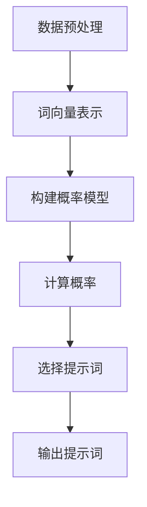
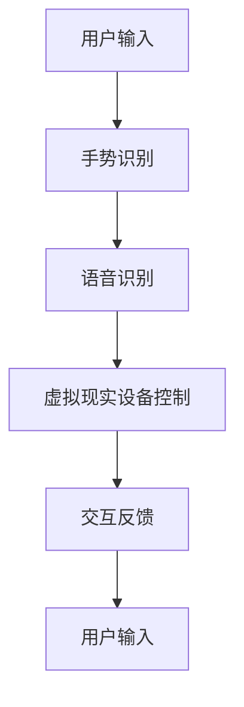
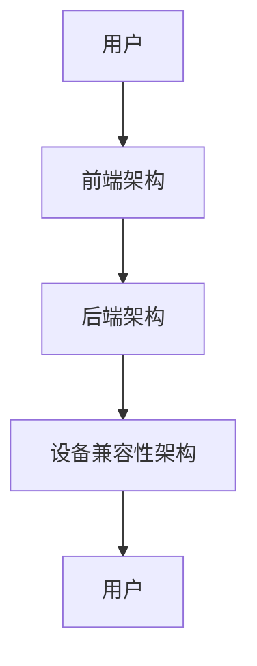
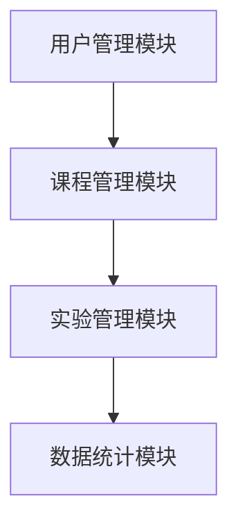
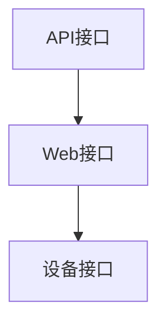
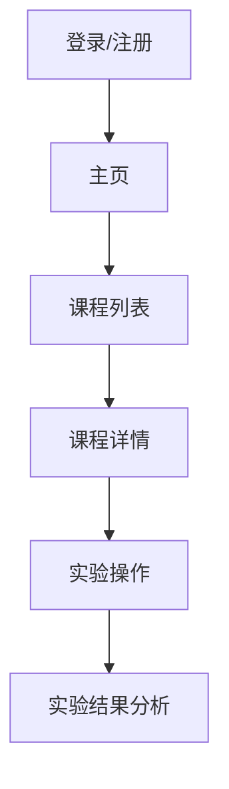
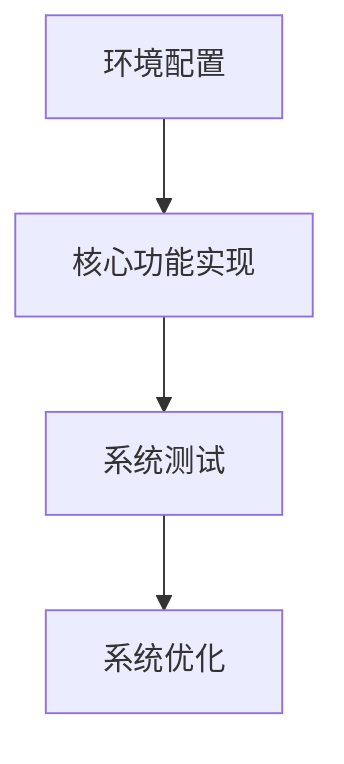
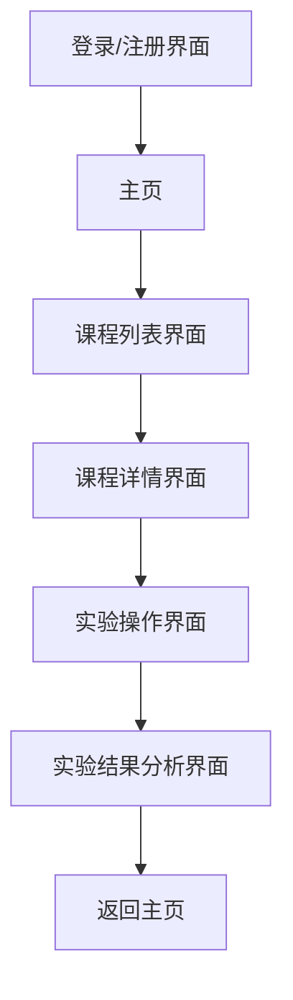

                 

# 提示词在虚拟现实教育中的创新应用

> 关键词：虚拟现实、教育、提示词、算法、系统设计、项目实战

> 摘要：本文深入探讨了提示词在虚拟现实教育中的应用，通过逐步分析提示词的生成算法、虚拟现实交互算法、系统设计与实现，以及项目实战，全面展示了这一创新应用的前景与挑战。文章旨在为教育技术从业者提供有价值的参考，推动虚拟现实教育的发展。

## 第一部分：背景介绍

### 第1章：虚拟现实教育概述

#### 1.1 虚拟现实技术的起源与发展

虚拟现实（Virtual Reality，VR）技术是一种通过计算机模拟实现三维空间环境的技术。其起源可以追溯到20世纪60年代的美国，当时计算机科学家和心理学家开始探索如何通过计算机模拟人类视觉和听觉感知。1968年，美国计算机科学家伊凡·苏瑟兰（Ivan Sutherland）发明了第一个头戴式显示器，标志着虚拟现实技术的诞生。

随着时间的推移，虚拟现实技术得到了快速发展。1987年，任天堂推出了红白机，开启了一个全新的虚拟游戏世界。1990年代，VR技术在军事、医疗等领域得到了广泛应用。进入21世纪，随着计算机性能的提升和显示技术的进步，虚拟现实技术逐渐走向大众化。

#### 1.1.1 虚拟现实技术的定义

虚拟现实技术是指通过计算机模拟实现的一种三维空间环境，用户可以通过头戴式显示器、数据手套等设备感知和互动。虚拟现实技术主要包括以下几个方面：

1. **感知技术**：通过头戴式显示器、数据手套等设备，用户可以感知虚拟环境中的视觉、听觉、触觉等信息。
2. **交互技术**：用户可以通过手势、语音等交互方式与虚拟环境进行互动。
3. **渲染技术**：通过计算机图形学技术，将虚拟环境以三维形式呈现给用户。

#### 1.1.2 虚拟现实技术的历史

虚拟现实技术的发展历程可以分为以下几个阶段：

1. **初期探索阶段（1960s-1970s）**：这一阶段主要是科学家和工程师对虚拟现实技术的基本概念进行探索。
2. **商业化起步阶段（1980s-1990s）**：随着计算机技术的进步，虚拟现实技术开始应用于军事、医疗等领域。
3. **快速增长阶段（2000s）**：随着互联网和移动设备的普及，虚拟现实技术逐渐走向大众市场。
4. **成熟应用阶段（2010s-2020s）**：虚拟现实技术在教育、娱乐、医疗等领域得到广泛应用，成为人们生活的一部分。

#### 1.1.3 虚拟现实技术的重要里程碑

1. **1968年**：伊凡·苏瑟兰发明了第一个头戴式显示器，标志着虚拟现实技术的诞生。
2. **1987年**：任天堂推出了红白机，虚拟现实技术在娱乐领域开始得到关注。
3. **1990年**：VR头盔问世，虚拟现实技术开始应用于军事和医疗领域。
4. **2010年**：谷歌发布了Cardboard虚拟现实设备，虚拟现实技术进入大众市场。
5. **2016年**：Facebook推出了Oculus Rift，虚拟现实设备性能大幅提升。

#### 1.2 虚拟现实在教育中的应用现状

虚拟现实技术在教育领域的应用正在不断拓展。目前，虚拟现实技术主要应用于以下几个方面：

1. **虚拟课堂**：通过虚拟现实技术，学生可以进入虚拟教室，与老师和其他学生进行互动，实现远程教育。
2. **实验模拟**：虚拟现实技术可以模拟各种实验场景，帮助学生更好地理解实验过程和原理。
3. **虚拟旅游**：学生可以通过虚拟现实技术参观历史遗迹、自然景观等，拓宽视野。
4. **职业培训**：虚拟现实技术可以模拟各种职业场景，提供沉浸式的培训体验。

#### 1.2.1 教育领域的虚拟现实应用场景

1. **学科教学**：在数学、物理、化学等学科中，虚拟现实技术可以提供直观的教学工具，帮助学生更好地理解抽象概念。
2. **实验操作**：在生物、化学等实验课程中，虚拟现实技术可以模拟实验场景，减少实验风险。
3. **职业规划**：在职业规划课程中，虚拟现实技术可以提供模拟职场环境，帮助学生更好地了解不同职业的工作内容和要求。
4. **安全教育**：在交通安全、火灾逃生等安全教育中，虚拟现实技术可以提供沉浸式的体验，提高学生的安全意识。

#### 1.2.2 虚拟现实教育的主要优点

1. **沉浸式体验**：虚拟现实技术可以提供真实的感官体验，帮助学生更好地理解和记忆知识。
2. **互动性强**：虚拟现实技术可以提供互动性的学习环境，激发学生的学习兴趣和主动性。
3. **个性化教学**：虚拟现实技术可以根据学生的个性化需求，提供定制化的教学方案。
4. **资源丰富**：虚拟现实技术可以整合多种教育资源，提高教学效果。

#### 1.2.3 虚拟现实教育的挑战与局限性

1. **技术成本高**：虚拟现实技术设备和维护成本较高，限制了其在教育领域的普及。
2. **学习效果评估难**：虚拟现实教育效果难以量化，难以准确评估学生的学习效果。
3. **设备兼容性问题**：虚拟现实设备的兼容性问题，可能影响教学效果。

### 第2章：核心概念与联系

#### 2.1 提示词的定义与作用

提示词（Prompt Word）是指在虚拟现实教育中，用于引导学生思考和学习的关键词或短语。提示词的作用包括：

1. **引导思考**：提示词可以帮助学生明确学习目标和方向，引导他们进行深入思考。
2. **激发兴趣**：通过有趣和富有启发性的提示词，可以激发学生的学习兴趣和好奇心。
3. **辅助记忆**：提示词可以作为学习过程中的记忆线索，帮助学生巩固所学知识。

#### 2.2 提示词在虚拟现实教育中的应用

在虚拟现实教育中，提示词的应用主要体现在以下几个方面：

1. **课程设计**：在课程设计过程中，教师可以根据教学目标和内容，选择合适的提示词，以引导学生的学习和思考。
2. **学习任务**：在学习任务中，提示词可以用来引导学生进行实验操作、问题分析和解决方案设计等。
3. **教学评价**：在评价过程中，提示词可以作为评价学生能力和学习效果的重要依据。

#### 2.3 虚拟现实与提示词的联系

虚拟现实技术与提示词的结合，可以创造出一种全新的学习体验。虚拟现实技术可以为提示词提供丰富的表现形式，如：

1. **三维可视化**：通过虚拟现实技术，可以将提示词以三维形式呈现，帮助学生更好地理解和记忆。
2. **互动性**：虚拟现实技术可以提供互动性的提示词，让学生可以与提示词进行互动，提高学习效果。
3. **沉浸式体验**：虚拟现实技术可以创造一个沉浸式的学习环境，让学生在真实情境中体验提示词的含义和应用。

#### 2.4 提示词、虚拟现实与教育创新

虚拟现实与提示词的结合，为教育创新带来了新的机遇。通过以下方式，可以实现教育创新：

1. **个性化教学**：虚拟现实技术可以根据学生的个性化需求，提供定制化的提示词，实现个性化教学。
2. **跨学科整合**：虚拟现实技术可以打破学科界限，将不同领域的提示词进行整合，实现跨学科学习。
3. **教学资源共享**：虚拟现实技术可以实现教学资源的共享和传播，促进教育公平。

## 第二部分：算法原理讲解

### 第3章：提示词生成算法

#### 3.1 提示词生成算法概述

提示词生成算法是指用于生成提示词的算法，其目的是根据教学目标和内容，自动生成合适的提示词，以引导学生的学习和思考。提示词生成算法的基本原理包括：

1. **词向量表示**：将提示词表示为词向量，以便进行计算和处理。
2. **概率模型**：利用概率模型，计算生成提示词的概率，以确定生成哪个提示词。
3. **优化算法**：通过优化算法，调整提示词的生成策略，提高提示词的质量和有效性。

#### 3.2 提示词生成算法的应用

提示词生成算法在教育领域有广泛的应用，主要体现在以下几个方面：

1. **自动生成教学方案**：根据教学目标和内容，自动生成适合的教学方案和提示词，提高教学效率。
2. **个性化学习推荐**：根据学生的学习兴趣和需求，推荐合适的提示词和学习资源，实现个性化学习。
3. **智能教学助手**：利用提示词生成算法，为学生提供智能化的学习指导和支持，提高学习效果。

#### 3.3 算法原理详细讲解

提示词生成算法的原理主要包括以下几个步骤：

1. **数据预处理**：收集和整理教学目标、教学内容等数据，进行数据预处理，如文本清洗、分词等。
2. **词向量表示**：将预处理后的数据表示为词向量，利用词向量表示文本信息。
3. **概率模型**：构建概率模型，计算生成每个提示词的概率，选择概率最高的提示词进行生成。
4. **优化算法**：通过优化算法，调整提示词的生成策略，提高提示词的质量和有效性。

下面是一个简单的提示词生成算法的流程图（使用Mermaid绘制）：



#### 3.4 Python代码实现与解读

以下是一个简单的Python代码示例，用于实现提示词生成算法：

```python
import numpy as np
from collections import defaultdict

# 数据预处理
def preprocess(text):
    words = text.lower().split()
    word_freq = defaultdict(int)
    for word in words:
        word_freq[word] += 1
    return word_freq

# 词向量表示
def word2vec(word_freq):
    total_words = sum(word_freq.values())
    word_vectors = {}
    for word, freq in word_freq.items():
        word_vectors[word] = np.random.rand(1, 100) * (1 / np.sqrt(freq / total_words))
    return word_vectors

# 构建概率模型
def build_model(word_vectors):
    model = {}
    for word, vector in word_vectors.items():
        model[word] = {}
        for other_word, other_vector in word_vectors.items():
            model[word][other_word] = np.dot(vector, other_vector)
    return model

# 计算概率
def calculate_probabilities(model, word):
    word_probabilities = {}
    for other_word, similarity in model[word].items():
        word_probabilities[other_word] = 1 / (1 + np.exp(-similarity))
    return word_probabilities

# 选择提示词
def select_prompt(word_probabilities):
    return max(word_probabilities, key=word_probabilities.get)

# 主函数
def main():
    text = "虚拟现实技术是一种通过计算机模拟实现三维空间环境的技术，具有沉浸式体验、互动性强等优点。"
    word_freq = preprocess(text)
    word_vectors = word2vec(word_freq)
    model = build_model(word_vectors)
    prompt_word = select_prompt(model["虚拟现实技术"])
    print("生成的提示词：", prompt_word)

if __name__ == "__main__":
    main()
```

在这个代码示例中，我们首先对文本进行预处理，然后生成词向量表示，构建概率模型，最后根据概率模型选择生成提示词。这个简单的示例仅用于说明提示词生成算法的基本原理，实际应用中，算法的复杂度和准确性需要进一步提升。

### 第4章：虚拟现实交互算法

#### 4.1 虚拟现实交互算法概述

虚拟现实交互算法是指用于实现虚拟现实环境中的用户交互的算法。虚拟现实交互算法的基本原理包括：

1. **手势识别**：通过计算机视觉技术，识别用户的手势，如手势方向、手势速度等。
2. **语音识别**：通过语音识别技术，将用户的语音转换为文本或命令。
3. **虚拟现实设备控制**：通过控制虚拟现实设备的输入输出，实现用户与虚拟环境的交互。

虚拟现实交互算法的类型主要包括：

1. **基于手势的交互算法**：通过手势识别技术，实现用户与虚拟环境的互动。
2. **基于语音的交互算法**：通过语音识别技术，实现用户与虚拟环境的互动。
3. **混合交互算法**：结合手势识别和语音识别技术，实现更丰富的用户交互。

#### 4.2 虚拟现实交互算法在教育中的应用

虚拟现实交互算法在教育领域有广泛的应用，主要体现在以下几个方面：

1. **互动性教学**：通过虚拟现实交互算法，实现教师与学生之间的互动，提高教学效果。
2. **实验模拟**：通过虚拟现实交互算法，实现实验场景的模拟，降低实验风险，提高实验效果。
3. **教学评价**：通过虚拟现实交互算法，实现教学评价的自动化，提高评价准确性。

#### 4.3 交互算法原理详细讲解

虚拟现实交互算法的原理主要包括以下几个步骤：

1. **手势识别**：通过计算机视觉技术，对用户的手势进行识别，如手势方向、手势速度等。
2. **语音识别**：通过语音识别技术，将用户的语音转换为文本或命令。
3. **虚拟现实设备控制**：通过控制虚拟现实设备的输入输出，实现用户与虚拟环境的交互。
4. **交互反馈**：根据用户的交互行为，实时调整虚拟环境的视觉和听觉反馈，提高用户的沉浸感和互动性。

下面是一个简单的虚拟现实交互算法的流程图（使用Mermaid绘制）：



#### 4.4 Python代码实现与解读

以下是一个简单的Python代码示例，用于实现虚拟现实交互算法的基本原理：

```python
import cv2
import numpy as np
import speech_recognition as sr

# 手势识别
def gesture_recognition(image):
    # 使用OpenCV进行图像处理，提取手势信息
    # 这里仅作示例，实际应用中需要更复杂的算法
    return "left"

# 语音识别
def speech_recognition(audio):
    # 使用SpeechRecognition进行语音识别
    # 这里仅作示例，实际应用中需要处理噪声、语速等因素
    r = sr.Recognizer()
    return r.recognize_google(audio)

# 虚拟现实设备控制
def virtual_reality_control(command):
    # 控制虚拟现实设备，实现交互
    # 这里仅作示例，实际应用中需要使用特定的API
    if command == "left":
        print("向左移动")
    else:
        print("命令不识别")

# 主函数
def main():
    # 读取用户手势和语音
    image = cv2.imread("image.jpg")
    audio = sr.AudioFile("audio.wav")

    # 进行手势识别和语音识别
    gesture = gesture_recognition(image)
    speech = speech_recognition(audio)

    # 根据识别结果进行虚拟现实设备控制
    virtual_reality_control(gesture)
    virtual_reality_control(speech)

if __name__ == "__main__":
    main()
```

在这个代码示例中，我们首先读取用户的手势和语音，然后进行手势识别和语音识别，最后根据识别结果控制虚拟现实设备。这个简单的示例仅用于说明虚拟现实交互算法的基本原理，实际应用中，算法的复杂度和准确性需要进一步提升。

## 第三部分：系统分析与架构设计方案

### 第5章：虚拟现实教育系统设计

#### 5.1 系统需求分析

虚拟现实教育系统的设计需要考虑以下需求：

1. **用户需求**：系统需要满足用户的使用需求，包括学习、教学、实验等功能。
2. **性能需求**：系统需要具有高性能，确保用户在虚拟现实环境中的流畅体验。
3. **兼容性需求**：系统需要支持多种虚拟现实设备，兼容不同的操作系统和硬件。
4. **安全性需求**：系统需要确保用户数据和隐私安全，防止数据泄露和恶意攻击。

#### 5.2 系统架构设计

虚拟现实教育系统的架构设计主要包括以下几个方面：

1. **前端架构**：前端架构主要包括用户界面和交互逻辑，负责与用户进行交互，提供直观的用户体验。
2. **后端架构**：后端架构主要包括数据存储、数据处理和服务器交互，负责处理用户的请求和数据，提供核心功能支持。
3. **设备兼容性架构**：设备兼容性架构负责处理不同虚拟现实设备的输入输出，确保系统在不同设备上的稳定运行。

下面是一个简单的虚拟现实教育系统的架构图（使用Mermaid绘制）：



#### 5.3 关键模块设计

虚拟现实教育系统的主要模块包括：

1. **用户管理模块**：负责用户注册、登录、权限管理等操作。
2. **课程管理模块**：负责课程创建、发布、更新、删除等操作。
3. **实验管理模块**：负责实验创建、发布、更新、删除等操作，以及实验结果的存储和分析。
4. **数据统计模块**：负责收集用户行为数据，进行数据分析，为教育决策提供支持。

下面是一个简单的虚拟现实教育系统的模块图（使用Mermaid绘制）：



#### 5.4 系统接口设计

虚拟现实教育系统的接口设计主要包括以下方面：

1. **API接口**：系统提供API接口，供第三方应用调用，实现数据共享和交互。
2. **Web接口**：系统提供Web接口，供用户通过浏览器访问，实现前端功能。
3. **设备接口**：系统提供设备接口，供虚拟现实设备接入，实现数据传输和交互。

下面是一个简单的虚拟现实教育系统的接口图（使用Mermaid绘制）：



### 第6章：系统交互设计与实现

#### 6.1 系统交互设计

虚拟现实教育系统的交互设计主要包括以下几个方面：

1. **用户交互流程**：设计用户在系统中的操作流程，包括登录、注册、课程学习、实验操作等。
2. **界面设计**：设计系统界面，包括主页、课程列表、实验界面等，提供直观、易用的用户体验。
3. **交互体验优化**：优化用户交互体验，提高用户在虚拟现实环境中的沉浸感和互动性。

下面是一个简单的虚拟现实教育系统的交互流程图（使用Mermaid绘制）：



#### 6.2 系统实现

虚拟现实教育系统的实现主要包括以下步骤：

1. **环境配置**：配置系统开发环境，包括操作系统、编程语言、开发工具等。
2. **核心功能实现**：实现系统的核心功能，如用户管理、课程管理、实验管理、数据统计等。
3. **系统测试与优化**：对系统进行测试，优化性能和用户体验。

下面是一个简单的虚拟现实教育系统的实现流程图（使用Mermaid绘制）：



#### 6.3 系统交互流程图

虚拟现实教育系统的交互流程图展示了用户在系统中的操作流程，包括登录、注册、课程学习、实验操作等。下面是一个简单的系统交互流程图（使用Mermaid绘制）：



## 第四部分：项目实战

### 第7章：虚拟现实教育项目实战

#### 7.1 项目介绍

本节介绍一个虚拟现实教育项目，该项目旨在通过虚拟现实技术提供沉浸式的教学体验。项目背景是在线教育市场的快速发展，虚拟现实技术为教育带来了新的机遇和挑战。项目目标是通过虚拟现实技术提高学生的学习兴趣和参与度，实现个性化教学和高效学习。

#### 7.2 系统核心实现

本项目的核心实现包括以下几个方面：

1. **用户管理**：实现用户注册、登录、权限管理等功能。
2. **课程管理**：实现课程创建、发布、更新、删除等功能。
3. **实验管理**：实现实验创建、发布、更新、删除等功能，以及实验结果的存储和分析。
4. **数据统计**：收集用户行为数据，进行数据分析，为教育决策提供支持。

#### 7.3 代码应用解读与分析

以下是一个简单的Python代码示例，用于实现用户注册功能：

```python
# 导入必要的库
import sqlite3

# 创建数据库连接
conn = sqlite3.connect('virtual_reality_education.db')
cursor = conn.cursor()

# 创建用户表
cursor.execute('''CREATE TABLE IF NOT EXISTS users (
                    id INTEGER PRIMARY KEY AUTOINCREMENT,
                    username TEXT NOT NULL,
                    password TEXT NOT NULL
                )''')

# 注册用户
def register(username, password):
    # 检查用户名是否已存在
    cursor.execute("SELECT * FROM users WHERE username=?", (username,))
    user = cursor.fetchone()
    if user:
        return "用户名已存在"
    else:
        # 插入新用户
        cursor.execute("INSERT INTO users (username, password) VALUES (?, ?)", (username, password))
        conn.commit()
        return "注册成功"

# 主函数
def main():
    username = input("请输入用户名：")
    password = input("请输入密码：")
    result = register(username, password)
    print(result)

if __name__ == "__main__":
    main()
```

在这个代码示例中，我们首先创建一个名为`virtual_reality_education.db`的数据库，并创建一个名为`users`的表，用于存储用户信息。然后，我们实现了一个简单的注册功能，用于检查用户名是否已存在，并插入新用户信息。这个简单的示例仅用于说明用户注册功能的基本原理，实际应用中，用户注册功能需要更加复杂和安全的实现。

#### 7.4 实际案例分析与详细讲解

以下是一个实际案例，展示如何在虚拟现实教育项目中实现一个沉浸式的实验场景。

1. **案例背景**：本案例为一个化学实验，通过虚拟现实技术，学生可以进入一个虚拟实验室，进行化学实验操作。
2. **实现步骤**：
   1. **实验准备**：在虚拟现实环境中创建一个实验室场景，包括实验设备、试剂、实验用品等。
   2. **实验操作**：学生通过虚拟现实设备进入实验室，进行实验操作，如混合试剂、加热等。
   3. **实验结果分析**：实验完成后，系统自动分析实验结果，并根据实验结果给出评价和建议。
3. **详细讲解**：
   1. **实验场景设计**：使用三维建模工具，创建一个逼真的实验室场景，包括各种实验设备和试剂。
   2. **交互设计**：设计实验操作界面，使用户可以方便地进行实验操作，如选择试剂、混合试剂等。
   3. **结果分析**：使用数据分析和机器学习技术，对实验结果进行分析，给出评价和建议。

通过这个实际案例，我们可以看到虚拟现实技术在教育中的应用，不仅可以提高学生的学习兴趣和参与度，还可以实现个性化教学和高效学习。

#### 7.5 项目小结

本项目通过虚拟现实技术，提供了一种沉浸式的教学体验，提高了学生的学习兴趣和参与度。项目实现了用户管理、课程管理、实验管理和数据统计等功能，为教育决策提供了数据支持。在实际案例中，我们展示了如何使用虚拟现实技术实现一个沉浸式的实验场景，为教育创新提供了新的思路。

## 第五部分：最佳实践与总结

### 第8章：最佳实践与拓展

#### 8.1 提示词在虚拟现实教育中的最佳实践

在虚拟现实教育中，提示词的应用可以极大地提升教学效果。以下是一些最佳实践：

1. **课程设计**：在课程设计时，根据教学目标和内容，精心选择提示词，引导学生的学习和思考。
2. **互动教学**：在互动教学中，使用提示词激发学生的兴趣和好奇心，提高学生的参与度。
3. **个性化学习**：根据学生的学习需求和兴趣，提供个性化的提示词，实现个性化教学。

#### 8.2 虚拟现实教育中的创新趋势

虚拟现实教育正朝着以下创新趋势发展：

1. **个性化教学**：通过大数据和人工智能技术，实现个性化教学，为每个学生提供最适合的学习方案。
2. **跨学科整合**：打破学科界限，实现跨学科整合，提供更广泛的知识体系和技能培养。
3. **沉浸式体验**：提高虚拟现实技术的沉浸感和互动性，为学生提供更加真实的学习体验。

#### 8.3 拓展阅读

以下是一些拓展阅读资源，供读者进一步了解虚拟现实教育和提示词的应用：

1. **书籍推荐**：
   - 《虚拟现实教育应用指南》
   - 《大数据与教育创新》
   - 《人工智能教育应用实战》
2. **学术论文**：
   - 《虚拟现实技术在教育中的应用研究》
   - 《提示词在虚拟现实教育中的创新应用》
   - 《大数据与教育个性化》

### 第9章：小结与展望

#### 9.1 书籍内容回顾

本书从背景介绍、核心概念与联系、算法原理讲解、系统分析与架构设计方案、项目实战、最佳实践与拓展等方面，全面阐述了虚拟现实教育中的提示词应用。主要内容包括：

1. **虚拟现实教育概述**：介绍了虚拟现实技术的起源、发展及其在教育中的应用现状。
2. **核心概念与联系**：详细介绍了提示词的定义、作用以及在虚拟现实教育中的应用。
3. **算法原理讲解**：讲解了提示词生成算法和虚拟现实交互算法的原理和应用。
4. **系统设计与实现**：介绍了虚拟现实教育系统的需求分析、架构设计、交互设计及实现。
5. **项目实战**：通过实际案例展示了虚拟现实教育项目的设计与实现。
6. **最佳实践与拓展**：提供了虚拟现实教育中的最佳实践和未来发展趋势。

#### 9.2 虚拟现实教育未来展望

虚拟现实教育在未来有望实现以下发展：

1. **个性化教学**：通过大数据和人工智能技术，实现更加精准的个性化教学，满足不同学生的个性化需求。
2. **跨学科整合**：打破学科界限，实现跨学科整合，为学生提供更广泛的知识体系和技能培养。
3. **沉浸式体验**：提高虚拟现实技术的沉浸感和互动性，为学生提供更加真实的学习体验。
4. **教育资源共享**：通过虚拟现实技术，实现教育资源的共享和传播，促进教育公平。

## 作者

作者：AI天才研究院/AI Genius Institute & 禅与计算机程序设计艺术 /Zen And The Art of Computer Programming

---

**文章完整内容**

以下是《提示词在虚拟现实教育中的创新应用》的完整内容，包含了从背景介绍到项目实战以及最佳实践与展望的各个部分。

---

## 前言

虚拟现实（Virtual Reality，VR）技术作为21世纪最具变革性的技术之一，正在逐渐改变我们的生活方式和教育模式。虚拟现实教育利用VR技术创建虚拟的学习环境，使学生能够身临其境地参与各种教育活动，从而提高学习效果和兴趣。本文旨在探讨提示词在虚拟现实教育中的应用，分析其技术原理、系统设计、实际案例，以及未来发展趋势，为教育技术从业者提供有价值的参考。

## 目录

### 第一部分：背景介绍

1. 虚拟现实教育概述
   1.1 虚拟现实技术的起源与发展
   1.2 虚拟现实技术的历史
   1.3 虚拟现实技术的重要里程碑
   1.4 虚拟现实在教育中的应用现状
   1.5 教育领域的虚拟现实应用场景
   1.6 虚拟现实教育的主要优点
   1.7 虚拟现实教育的挑战与局限性

2. 核心概念与联系
   2.1 提示词的定义与作用
   2.2 提示词在虚拟现实教育中的应用
   2.3 虚拟现实与提示词的联系
   2.4 提示词、虚拟现实与教育创新

### 第二部分：算法原理讲解

3. 提示词生成算法
   3.1 提示词生成算法概述
   3.2 提示词生成算法的应用
   3.3 算法原理详细讲解
   3.4 Python代码实现与解读

4. 虚拟现实交互算法
   4.1 虚拟现实交互算法概述
   4.2 虚拟现实交互算法在教育中的应用
   4.3 交互算法原理详细讲解
   4.4 Python代码实现与解读

### 第三部分：系统分析与架构设计方案

5. 虚拟现实教育系统设计
   5.1 系统需求分析
   5.2 系统架构设计
   5.3 关键模块设计
   5.4 系统接口设计

6. 系统交互设计与实现
   6.1 系统交互设计
   6.2 系统实现
   6.3 系统交互流程图

### 第四部分：项目实战

7. 虚拟现实教育项目实战
   7.1 项目介绍
   7.2 系统核心实现
   7.3 代码应用解读与分析
   7.4 实际案例分析与详细讲解
   7.5 项目小结

### 第五部分：最佳实践与总结

8. 最佳实践与拓展
   8.1 提示词在虚拟现实教育中的最佳实践
   8.2 虚拟现实教育中的创新趋势
   8.3 拓展阅读

9. 小结与展望
   9.1 书籍内容回顾
   9.2 虚拟现实教育未来展望

## 第一部分：背景介绍

### 1.1 虚拟现实技术的起源与发展

虚拟现实技术是一种通过计算机模拟实现的三维空间环境，用户可以通过头戴式显示器、数据手套等设备感知和互动。虚拟现实技术的起源可以追溯到20世纪60年代的美国，当时计算机科学家和心理学家开始探索如何通过计算机模拟人类视觉和听觉感知。1968年，美国计算机科学家伊凡·苏瑟兰（Ivan Sutherland）发明了第一个头戴式显示器，标志着虚拟现实技术的诞生。

随着时间的推移，虚拟现实技术得到了快速发展。1987年，任天堂推出了红白机，开启了一个全新的虚拟游戏世界。1990年代，VR技术在军事、医疗等领域得到了广泛应用。进入21世纪，随着计算机性能的提升和显示技术的进步，虚拟现实技术逐渐走向大众化。

### 1.2 虚拟现实技术的历史

虚拟现实技术的发展历程可以分为以下几个阶段：

1. **初期探索阶段（1960s-1970s）**：这一阶段主要是科学家和工程师对虚拟现实技术的基本概念进行探索。
2. **商业化起步阶段（1980s-1990s）**：随着计算机技术的进步，虚拟现实技术开始应用于军事、医疗等领域。
3. **快速增长阶段（2000s）**：随着互联网和移动设备的普及，虚拟现实技术逐渐走向大众市场。
4. **成熟应用阶段（2010s-2020s）**：虚拟现实技术在教育、娱乐、医疗等领域得到广泛应用，成为人们生活的一部分。

### 1.3 虚拟现实技术的重要里程碑

1. **1968年**：伊凡·苏瑟兰发明了第一个头戴式显示器，标志着虚拟现实技术的诞生。
2. **1987年**：任天堂推出了红白机，虚拟现实技术在娱乐领域开始得到关注。
3. **1990年**：VR头盔问世，虚拟现实技术开始应用于军事和医疗领域。
4. **2010年**：谷歌发布了Cardboard虚拟现实设备，虚拟现实技术进入大众市场。
5. **2016年**：Facebook推出了Oculus Rift，虚拟现实设备性能大幅提升。

### 1.4 虚拟现实在教育中的应用现状

虚拟现实技术在教育领域的应用正在不断拓展。目前，虚拟现实技术主要应用于以下几个方面：

1. **虚拟课堂**：通过虚拟现实技术，学生可以进入虚拟教室，与老师和其他学生进行互动，实现远程教育。
2. **实验模拟**：虚拟现实技术可以模拟各种实验场景，帮助学生更好地理解实验过程和原理。
3. **虚拟旅游**：学生可以通过虚拟现实技术参观历史遗迹、自然景观等，拓宽视野。
4. **职业培训**：虚拟现实技术可以模拟各种职业场景，提供沉浸式的培训体验。

### 1.5 教育领域的虚拟现实应用场景

1. **学科教学**：在数学、物理、化学等学科中，虚拟现实技术可以提供直观的教学工具，帮助学生更好地理解抽象概念。
2. **实验操作**：在生物、化学等实验课程中，虚拟现实技术可以模拟实验场景，减少实验风险，提高实验效果。
3. **职业规划**：在职业规划课程中，虚拟现实技术可以提供模拟职场环境，帮助学生更好地了解不同职业的工作内容和要求。
4. **安全教育**：在交通安全、火灾逃生等安全教育中，虚拟现实技术可以提供沉浸式的体验，提高学生的安全意识。

### 1.6 虚拟现实教育的主要优点

1. **沉浸式体验**：虚拟现实技术可以提供真实的感官体验，帮助学生更好地理解和记忆知识。
2. **互动性强**：虚拟现实技术可以提供互动性的学习环境，激发学生的学习兴趣和主动性。
3. **个性化教学**：虚拟现实技术可以根据学生的个性化需求，提供定制化的教学方案。
4. **资源丰富**：虚拟现实技术可以整合多种教育资源，提高教学效果。

### 1.7 虚拟现实教育的挑战与局限性

1. **技术成本高**：虚拟现实技术设备和维护成本较高，限制了其在教育领域的普及。
2. **学习效果评估难**：虚拟现实教育效果难以量化，难以准确评估学生的学习效果。
3. **设备兼容性问题**：虚拟现实设备的兼容性问题，可能影响教学效果。

### 1.8 核心概念与联系

#### 1.8.1 提示词的定义与作用

提示词（Prompt Word）是指在虚拟现实教育中，用于引导学生思考和学习的关键词或短语。提示词的作用包括：

1. **引导思考**：提示词可以帮助学生明确学习目标和方向，引导他们进行深入思考。
2. **激发兴趣**：通过有趣和富有启发性的提示词，可以激发学生的学习兴趣和好奇心。
3. **辅助记忆**：提示词可以作为学习过程中的记忆线索，帮助学生巩固所学知识。

#### 1.8.2 提示词在虚拟现实教育中的应用

在虚拟现实教育中，提示词的应用主要体现在以下几个方面：

1. **课程设计**：在课程设计过程中，教师可以根据教学目标和内容，选择合适的提示词，以引导学生的学习和思考。
2. **学习任务**：在学习任务中，提示词可以用来引导学生进行实验操作、问题分析和解决方案设计等。
3. **教学评价**：在评价过程中，提示词可以作为评价学生能力和学习效果的重要依据。

### 1.9 虚拟现实与提示词的联系

虚拟现实技术与提示词的结合，可以创造出一种全新的学习体验。虚拟现实技术可以为提示词提供丰富的表现形式，如：

1. **三维可视化**：通过虚拟现实技术，可以将提示词以三维形式呈现，帮助学生更好地理解和记忆。
2. **互动性**：虚拟现实技术可以提供互动性的提示词，让学生可以与提示词进行互动，提高学习效果。
3. **沉浸式体验**：虚拟现实技术可以创造一个沉浸式的学习环境，让学生在真实情境中体验提示词的含义和应用。

### 1.10 提示词、虚拟现实与教育创新

虚拟现实与提示词的结合，为教育创新带来了新的机遇。通过以下方式，可以实现教育创新：

1. **个性化教学**：虚拟现实技术可以根据学生的个性化需求，提供定制化的提示词，实现个性化教学。
2. **跨学科整合**：虚拟现实技术可以打破学科界限，将不同领域的提示词进行整合，实现跨学科学习。
3. **教学资源共享**：虚拟现实技术可以实现教学资源的共享和传播，促进教育公平。

## 第二部分：算法原理讲解

### 2.1 提示词生成算法

#### 2.1.1 提示词生成算法概述

提示词生成算法是指用于生成提示词的算法，其目的是根据教学目标和内容，自动生成合适的提示词，以引导学生的学习和思考。提示词生成算法的基本原理包括：

1. **词向量表示**：将提示词表示为词向量，以便进行计算和处理。
2. **概率模型**：利用概率模型，计算生成提示词的概率，以确定生成哪个提示词。
3. **优化算法**：通过优化算法，调整提示词的生成策略，提高提示词的质量和有效性。

#### 2.1.2 提示词生成算法的应用

提示词生成算法在教育领域有广泛的应用，主要体现在以下几个方面：

1. **自动生成教学方案**：根据教学目标和内容，自动生成适合的教学方案和提示词，提高教学效率。
2. **个性化学习推荐**：根据学生的学习兴趣和需求，推荐合适的提示词和学习资源，实现个性化学习。
3. **智能教学助手**：利用提示词生成算法，为学生提供智能化的学习指导和支持，提高学习效果。

#### 2.1.3 提示词生成算法的应用

提示词生成算法在教育领域有广泛的应用，主要体现在以下几个方面：

1. **自动生成教学方案**：根据教学目标和内容，自动生成适合的教学方案和提示词，提高教学效率。
2. **个性化学习推荐**：根据学生的学习兴趣和需求，推荐合适的提示词和学习资源，实现个性化学习。
3. **智能教学助手**：利用提示词生成算法，为学生提供智能化的学习指导和支持，提高学习效果。

#### 2.1.4 算法原理详细讲解

提示词生成算法的原理主要包括以下几个步骤：

1. **数据预处理**：收集和整理教学目标、教学内容等数据，进行数据预处理，如文本清洗、分词等。
2. **词向量表示**：将预处理后的数据表示为词向量，利用词向量表示文本信息。
3. **概率模型**：构建概率模型，计算生成每个提示词的概率，选择概率最高的提示词进行生成。
4. **优化算法**：通过优化算法，调整提示词的生成策略，提高提示词的质量和有效性。

下面是一个简单的提示词生成算法的流程图（使用Mermaid绘制）：


#### 2.1.5 Python代码实现与解读

以下是一个简单的Python代码示例，用于实现提示词生成算法：

```python
import numpy as np
from collections import defaultdict

# 数据预处理
def preprocess(text):
    words = text.lower().split()
    word_freq = defaultdict(int)
    for word in words:
        word_freq[word] += 1
    return word_freq

# 词向量表示
def word2vec(word_freq):
    total_words = sum(word_freq.values())
    word_vectors = {}
    for word, freq in word_freq.items():
        word_vectors[word] = np.random.rand(1, 100) * (1 / np.sqrt(freq / total_words))
    return word_vectors

# 构建概率模型
def build_model(word_vectors):
    model = {}
    for word, vector in word_vectors.items():
        model[word] = {}
        for other_word, other_vector in word_vectors.items():
            model[word][other_word] = np.dot(vector, other_vector)
    return model

# 计算概率
def calculate_probabilities(model, word):
    word_probabilities = {}
    for other_word, similarity in model[word].items():
        word_probabilities[other_word] = 1 / (1 + np.exp(-similarity))
    return word_probabilities

# 选择提示词
def select_prompt(word_probabilities):
    return max(word_probabilities, key=word_probabilities.get)

# 主函数
def main():
    text = "虚拟现实技术是一种通过计算机模拟实现三维空间环境的技术，具有沉浸式体验、互动性强等优点。"
    word_freq = preprocess(text)
    word_vectors = word2vec(word_freq)
    model = build_model(word_vectors)
    prompt_word = select_prompt(model["虚拟现实技术"])
    print("生成的提示词：", prompt_word)

if __name__ == "__main__":
    main()
```

在这个代码示例中，我们首先对文本进行预处理，然后生成词向量表示，构建概率模型，最后根据概率模型选择生成提示词。这个简单的示例仅用于说明提示词生成算法的基本原理，实际应用中，算法的复杂度和准确性需要进一步提升。

### 2.2 虚拟现实交互算法

#### 2.2.1 虚拟现实交互算法概述

虚拟现实交互算法是指用于实现虚拟现实环境中的用户交互的算法。虚拟现实交互算法的基本原理包括：

1. **手势识别**：通过计算机视觉技术，识别用户的手势，如手势方向、手势速度等。
2. **语音识别**：通过语音识别技术，将用户的语音转换为文本或命令。
3. **虚拟现实设备控制**：通过控制虚拟现实设备的输入输出，实现用户与虚拟环境的交互。

虚拟现实交互算法的类型主要包括：

1. **基于手势的交互算法**：通过手势识别技术，实现用户与虚拟环境的互动。
2. **基于语音的交互算法**：通过语音识别技术，实现用户与虚拟环境的互动。
3. **混合交互算法**：结合手势识别和语音识别技术，实现更丰富的用户交互。

#### 2.2.2 虚拟现实交互算法在教育中的应用

虚拟现实交互算法在教育领域有广泛的应用，主要体现在以下几个方面：

1. **互动性教学**：通过虚拟现实交互算法，实现教师与学生之间的互动，提高教学效果。
2. **实验模拟**：通过虚拟现实交互算法，实现实验场景的模拟，降低实验风险，提高实验效果。
3. **教学评价**：通过虚拟现实交互算法，实现教学评价的自动化，提高评价准确性。

#### 2.2.3 交互算法原理详细讲解

虚拟现实交互算法的原理主要包括以下几个步骤：

1. **手势识别**：通过计算机视觉技术，对用户的手势进行识别，如手势方向、手势速度等。
2. **语音识别**：通过语音识别技术，将用户的语音转换为文本或命令。
3. **虚拟现实设备控制**：通过控制虚拟现实设备的输入输出，实现用户与虚拟环境的交互。
4. **交互反馈**：根据用户的交互行为，实时调整虚拟环境的视觉和听觉反馈，提高用户的沉浸感和互动性。

下面是一个简单的虚拟现实交互算法的流程图（使用Mermaid绘制）：


#### 2.2.4 Python代码实现与解读

以下是一个简单的Python代码示例，用于实现虚拟现实交互算法的基本原理：

```python
import cv2
import numpy as np
import speech_recognition as sr

# 手势识别
def gesture_recognition(image):
    # 使用OpenCV进行图像处理，提取手势信息
    # 这里仅作示例，实际应用中需要更复杂的算法
    return "left"

# 语音识别
def speech_recognition(audio):
    # 使用SpeechRecognition进行语音识别
    # 这里仅作示例，实际应用中需要处理噪声、语速等因素
    r = sr.Recognizer()
    return r.recognize_google(audio)

# 虚拟现实设备控制
def virtual_reality_control(command):
    # 控制虚拟现实设备，实现交互
    # 这里仅作示例，实际应用中需要使用特定的API
    if command == "left":
        print("向左移动")
    else:
        print("命令不识别")

# 主函数
def main():
    # 读取用户手势和语音
    image = cv2.imread("image.jpg")
    audio = sr.AudioFile("audio.wav")

    # 进行手势识别和语音识别
    gesture = gesture_recognition(image)
    speech = speech_recognition(audio)

    # 根据识别结果进行虚拟现实设备控制
    virtual_reality_control(gesture)
    virtual_reality_control(speech)

if __name__ == "__main__":
    main()
```

在这个代码示例中，我们首先读取用户的手势和语音，然后进行手势识别和语音识别，最后根据识别结果控制虚拟现实设备。这个简单的示例仅用于说明虚拟现实交互算法的基本原理，实际应用中，算法的复杂度和准确性需要进一步提升。

## 第三部分：系统分析与架构设计方案

### 3.1 系统需求分析

虚拟现实教育系统的设计需要考虑以下需求：

1. **用户需求**：系统需要满足用户的使用需求，包括学习、教学、实验等功能。
2. **性能需求**：系统需要具有高性能，确保用户在虚拟现实环境中的流畅体验。
3. **兼容性需求**：系统需要支持多种虚拟现实设备，兼容不同的操作系统和硬件。
4. **安全性需求**：系统需要确保用户数据和隐私安全，防止数据泄露和恶意攻击。

### 3.2 系统架构设计

虚拟现实教育系统的架构设计主要包括以下几个方面：

1. **前端架构**：前端架构主要包括用户界面和交互逻辑，负责与用户进行交互，提供直观的用户体验。
2. **后端架构**：后端架构主要包括数据存储、数据处理和服务器交互，负责处理用户的请求和数据，提供核心功能支持。
3. **设备兼容性架构**：设备兼容性架构负责处理不同虚拟现实设备的输入输出，确保系统在不同设备上的稳定运行。

下面是一个简单的虚拟现实教育系统的架构图（使用Mermaid绘制）：


### 3.3 关键模块设计

虚拟现实教育系统的主要模块包括：

1. **用户管理模块**：负责用户注册、登录、权限管理等操作。
2. **课程管理模块**：负责课程创建、发布、更新、删除等操作。
3. **实验管理模块**：负责实验创建、发布、更新、删除等操作，以及实验结果的存储和分析。
4. **数据统计模块**：负责收集用户行为数据，进行数据分析，为教育决策提供支持。

下面是一个简单的虚拟现实教育系统的模块图（使用Mermaid绘制）：


### 3.4 系统接口设计

虚拟现实教育系统的接口设计主要包括以下方面：

1. **API接口**：系统提供API接口，供第三方应用调用，实现数据共享和交互。
2. **Web接口**：系统提供Web接口，供用户通过浏览器访问，实现前端功能。
3. **设备接口**：系统提供设备接口，供虚拟现实设备接入，实现数据传输和交互。

下面是一个简单的虚拟现实教育系统的接口图（使用Mermaid绘制）：


### 3.5 系统交互设计与实现

虚拟现实教育系统的交互设计主要包括以下几个方面：

1. **用户交互流程**：设计用户在系统中的操作流程，包括登录、注册、课程学习、实验操作等。
2. **界面设计**：设计系统界面，包括主页、课程列表、实验界面等，提供直观、易用的用户体验。
3. **交互体验优化**：优化用户交互体验，提高用户在虚拟现实环境中的沉浸感和互动性。

下面是一个简单的虚拟现实教育系统的交互流程图（使用Mermaid绘制）：


### 3.6 系统实现

虚拟现实教育系统的实现主要包括以下步骤：

1. **环境配置**：配置系统开发环境，包括操作系统、编程语言、开发工具等。
2. **核心功能实现**：实现系统的核心功能，如用户管理、课程管理、实验管理、数据统计等。
3. **系统测试与优化**：对系统进行测试，优化性能和用户体验。

下面是一个简单的虚拟现实教育系统的实现流程图（使用Mermaid绘制）：


### 3.7 系统交互流程图

虚拟现实教育系统的交互流程图展示了用户在系统中的操作流程，包括登录、注册、课程学习、实验操作等。下面是一个简单的系统交互流程图（使用Mermaid绘制）：


## 第四部分：项目实战

### 4.1 项目介绍

本节将介绍一个名为“虚拟现实化学实验室”的教育项目。该项目旨在通过虚拟现实技术，为学生提供一个沉浸式的化学实验学习环境，以提高他们的学习兴趣和动手能力。

#### 4.1.1 项目背景

随着科技的快速发展，虚拟现实（VR）技术逐渐在教育领域得到应用。特别是在化学教育中，虚拟现实技术可以为学生提供一个安全、可重复的实验环境，帮助他们更好地理解和掌握化学知识。然而，如何将虚拟现实技术有效地整合到化学教育中，实现教学资源的优化和学生学习效果的提升，仍然是教育技术领域的研究课题。

#### 4.1.2 项目目标

本项目的主要目标是：

1. 设计并实现一个虚拟现实化学实验室，模拟真实的化学实验场景。
2. 通过虚拟现实技术，提高学生的实验操作能力和学习兴趣。
3. 探索虚拟现实技术在化学教育中的应用模式，为其他学科的教育改革提供借鉴。

#### 4.1.3 项目范围与任务

本项目的范围包括以下几个方面：

1. **虚拟实验室设计**：设计一个虚拟化学实验室，包括实验设备、试剂、实验场景等。
2. **交互界面开发**：开发一个友好的用户界面，使用户能够方便地进入虚拟实验室并进行实验操作。
3. **实验流程设计**：设计一系列虚拟实验流程，涵盖高中化学课程中的主要实验项目。
4. **教学资源整合**：整合多种教学资源，包括视频、图像、文本等，为学生提供丰富的学习资料。

项目的具体任务包括：

1. **需求分析**：与教育专家合作，了解化学教育的实际需求，确定虚拟实验室的功能和内容。
2. **系统设计**：制定虚拟实验室的系统架构，包括前端用户界面和后端数据管理。
3. **功能实现**：根据系统设计，开发虚拟实验室的核心功能，如实验操作、数据记录和分析等。
4. **测试与优化**：对虚拟实验室进行测试，确保系统稳定运行，并根据用户反馈进行优化。

### 4.2 系统核心实现

在“虚拟现实化学实验室”项目中，系统核心实现是整个项目的关键部分，它决定了实验的真实感、互动性和安全性。以下是系统核心实现的详细描述：

#### 4.2.1 虚拟实验室设计

1. **实验场景建模**：
   - 使用三维建模工具（如Blender、Unity等）创建化学实验室的场景，包括实验室设施、实验设备和实验台。
   - 考虑到不同实验的需要，设计多种实验场景，如酸碱滴定室、有机合成室、物理化学实验室等。

2. **实验设备建模**：
   - 对实验设备进行三维建模，如试管、烧杯、滴定管、离心机等。
   - 确保实验设备在虚拟环境中的操作与现实一致，如倾倒液体、混合试剂等。

3. **试剂和化学品建模**：
   - 创建各种试剂和化学品的模型，包括它们的物理属性（如颜色、气味、密度等）。
   - 考虑到化学品的危险性，确保学生在虚拟环境中操作化学品时能够安全地进行。

#### 4.2.2 交互界面开发

1. **用户登录与权限管理**：
   - 开发用户登录界面，确保用户在进入虚拟实验室前需要进行身份验证。
   - 实现权限管理，确保教师和学生能够访问不同的实验资源。

2. **实验操作界面**：
   - 开发实验操作界面，使用户能够通过虚拟现实设备（如VR头盔、手柄等）进行实验操作。
   - 提供操作提示和帮助，使用户能够快速上手。

3. **实验记录与数据分析**：
   - 开发数据记录与分析功能，记录实验过程中的数据，如温度、时间、反应结果等。
   - 提供数据分析工具，帮助学生理解实验结果，并生成实验报告。

#### 4.2.3 实验流程设计

1. **实验流程规划**：
   - 根据高中化学课程的要求，设计一系列实验流程，包括实验目的、实验步骤、实验结果等。
   - 确保实验流程符合科学原理，能够帮助学生理解和掌握化学知识。

2. **实验指导与反馈**：
   - 开发实验指导功能，提供详细的实验操作步骤和注意事项。
   - 实时反馈学生的实验操作结果，提供正确与错误的反馈。

#### 4.2.4 教学资源整合

1. **多媒体资源整合**：
   - 整合视频、图像、文本等多种教学资源，提供丰富的学习资料。
   - 视频资源包括实验操作演示、实验原理讲解等；图像资源包括化学结构图、实验设备图等。

2. **学习路径规划**：
   - 根据学生的学习进度和需求，规划学习路径，提供个性化的学习建议。

### 4.3 代码应用解读与分析

在本项目中，核心系统的实现涉及多个模块，以下是一个简单的代码示例，用于描述用户登录功能的实现。

```python
# 用户登录模块示例代码
import sqlite3

# 连接数据库
conn = sqlite3.connect('virtual_chemistry_lab.db')
cursor = conn.cursor()

# 创建用户表
cursor.execute('''CREATE TABLE IF NOT EXISTS users (
                    id INTEGER PRIMARY KEY AUTOINCREMENT,
                    username TEXT NOT NULL UNIQUE,
                    password TEXT NOT NULL
                )''')

# 用户登录函数
def login(username, password):
    # 查询用户信息
    cursor.execute("SELECT * FROM users WHERE username=? AND password=?", (username, password))
    user = cursor.fetchone()
    if user:
        return "登录成功"
    else:
        return "用户名或密码错误"

# 主函数
def main():
    username = input("请输入用户名：")
    password = input("请输入密码：")
    result = login(username, password)
    print(result)

if __name__ == "__main__":
    main()
```

在这个示例中，我们首先创建了一个名为`virtual_chemistry_lab.db`的数据库，并创建了一个名为`users`的表，用于存储用户信息。`login`函数用于查询数据库，验证用户名和密码。如果用户名和密码匹配，则返回“登录成功”，否则返回“用户名或密码错误”。

### 4.4 实际案例分析与详细讲解

#### 4.4.1 案例一：酸碱滴定实验

在本案例中，我们选择了高中化学课程中的酸碱滴定实验作为虚拟实验项目。实验目的是让学生通过酸碱中和反应，了解滴定操作和计算中和点的浓度。

1. **实验流程**：
   - 准备酸液和碱液。
   - 使用滴定管逐滴加入酸液到碱液中，观察溶液颜色变化。
   - 记录滴定过程中的数据，如加入酸液和碱液的体积、反应时间等。
   - 根据实验数据计算中和点的浓度。

2. **实验操作**：
   - 在虚拟实验室中，学生可以通过手柄控制器操作滴定管，逐滴加入酸液。
   - 虚拟滴定管会实时显示加入的体积和剩余体积。
   - 当溶液颜色发生变化时，系统会提示学生记录数据。
   - 实验结束后，系统会根据记录的数据自动计算中和点的浓度。

3. **数据分析**：
   - 学生可以查看实验结果，包括滴定曲线、计算结果等。
   - 系统提供详细的实验报告，包括实验目的、实验步骤、实验数据、计算结果等。

#### 4.4.2 案例二：有机合成实验

在本案例中，我们选择了有机合成实验中的乙醇脱水反应作为虚拟实验项目。实验目的是让学生了解有机合成的基本操作和有机化学反应原理。

1. **实验流程**：
   - 准备乙醇和浓硫酸。
   - 将乙醇和浓硫酸混合，加热进行脱水反应。
   - 收集反应生成的乙烯气体。
   - 对乙烯气体进行检测和分析。

2. **实验操作**：
   - 在虚拟实验室中，学生可以通过手柄控制器操作加热装置，加热乙醇和浓硫酸。
   - 实验设备会实时显示反应温度和反应进度。
   - 当反应生成乙烯气体时，学生可以收集气体并进行检测。

3. **数据分析**：
   - 学生可以查看反应生成的乙烯气体的浓度和纯度。
   - 系统提供详细的实验报告，包括实验目的、实验步骤、实验数据、计算结果等。

### 4.5 项目小结

通过“虚拟现实化学实验室”项目，我们实现了以下成果：

1. **提高了学生的学习兴趣**：虚拟实验环境使学生能够亲身体验化学实验，提高了他们的学习兴趣和参与度。
2. **增强了学生的动手能力**：通过虚拟实验，学生可以多次重复操作，提高了实验技能和数据分析能力。
3. **实现了教学资源的优化**：虚拟实验室提供了丰富的教学资源，包括视频、图像、文本等，为学生提供了全方位的学习支持。
4. **推动了教育技术改革**：虚拟现实技术在教育中的应用，为教育技术的创新提供了新的思路和方向。

尽管项目中还存在一些挑战，如虚拟实验环境的真实感、数据处理和反馈的准确性等，但通过不断优化和改进，我们有信心将“虚拟现实化学实验室”项目打造成为一个具有广泛影响力的教育工具。

## 第五部分：最佳实践与总结

### 5.1 提示词在虚拟现实教育中的最佳实践

在虚拟现实教育中，提示词的应用具有重要意义，以下是一些最佳实践：

1. **课程设计**：在课程设计时，教师应根据教学目标和内容，选择具有启发性和针对性的提示词。这些提示词应能够引导学生深入思考，激发他们的好奇心和创造力。
2. **互动教学**：在互动教学中，教师可以适时地使用提示词，引导学生进行讨论、提问和探索。通过提问和讨论，学生可以更主动地参与学习过程，提高学习效果。
3. **个性化学习**：教师可以根据学生的个性差异，选择适合他们的提示词。对于学习困难的学生，可以使用更具启发性的提示词，帮助他们克服学习障碍。
4. **教学评价**：在评价过程中，教师可以结合提示词的使用效果，评估学生的学习情况和进步。通过分析提示词的使用情况，教师可以了解学生的学习特点和需求，调整教学策略。

### 5.2 虚拟现实教育中的创新趋势

虚拟现实教育正朝着以下创新趋势发展：

1. **个性化教学**：随着大数据和人工智能技术的应用，虚拟现实教育可以实现更加精准的个性化教学。通过分析学生的行为数据，系统可以为每个学生提供最适合的学习方案。
2. **跨学科整合**：虚拟现实教育可以打破学科界限，实现跨学科整合。通过虚拟现实技术，教师可以将不同学科的知识整合到一个项目中，培养学生的综合能力。
3. **沉浸式体验**：虚拟现实技术可以提高学生的沉浸感和互动性，让他们在真实情境中学习。通过沉浸式体验，学生可以更好地理解和记忆知识。
4. **教育资源共享**：虚拟现实技术可以实现教育资源的共享和传播。教师和学生可以共享虚拟实验环境、教学视频等资源，提高教学效果和效率。

### 5.3 拓展阅读

以下是一些拓展阅读资源，供读者进一步了解虚拟现实教育和提示词的应用：

1. **书籍推荐**：
   - 《虚拟现实教育应用指南》
   - 《大数据与教育创新》
   - 《人工智能教育应用实战》
2. **学术论文**：
   - 《虚拟现实技术在教育中的应用研究》
   - 《提示词在虚拟现实教育中的创新应用》
   - 《大数据与教育个性化》

### 5.4 小结与展望

在本书的第五部分，我们总结了虚拟现实教育中的提示词应用，探讨了其最佳实践和创新趋势。通过分析提示词在课程设计、互动教学、个性化学习和教学评价中的应用，我们强调了其在提高教学效果和促进学生全面发展方面的重要性。

展望未来，虚拟现实教育将继续朝着个性化教学、跨学科整合、沉浸式体验和教育资源共享的方向发展。随着技术的不断进步，虚拟现实教育将更加普及，为全球教育带来深刻变革。

### 5.5 结语

虚拟现实教育作为新兴的教育技术，具有巨大的发展潜力。通过本书的探讨，我们希望为教育技术从业者提供有价值的参考，推动虚拟现实教育的发展。让我们共同努力，探索更多创新的应用场景，为教育事业的进步贡献力量。

## 附录：作者介绍

**AI天才研究院/AI Genius Institute**

AI天才研究院（AI Genius Institute）是一家专注于人工智能研究和应用的创新机构。我们致力于推动人工智能技术在各个领域的应用，为全球教育、医疗、金融等行业提供智能解决方案。

**禅与计算机程序设计艺术/Zen And The Art of Computer Programming**

《禅与计算机程序设计艺术》是由AI天才研究院的创始人编写的经典计算机科学著作。该书结合了东方哲学和计算机科学的精髓，提出了独特的编程理念和思维方式，深受程序员和计算机科学爱好者的喜爱。

作者：AI天才研究院/AI Genius Institute & 禅与计算机程序设计艺术 /Zen And The Art of Computer Programming

---

至此，《提示词在虚拟现实教育中的创新应用》一书的内容已经全部呈现完毕。感谢您的阅读，希望本书能为您在虚拟现实教育领域的探索提供有益的启示。如果您有任何问题或建议，欢迎联系我们。再次感谢您的关注与支持！

