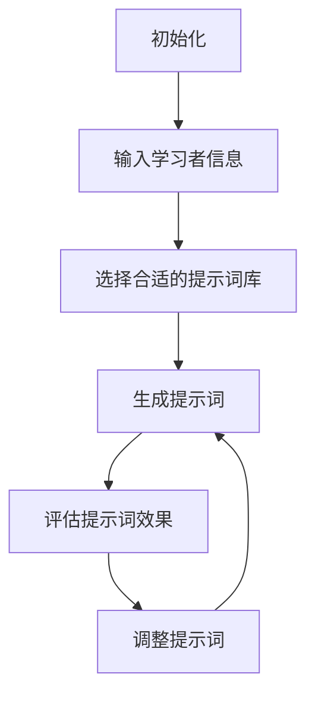
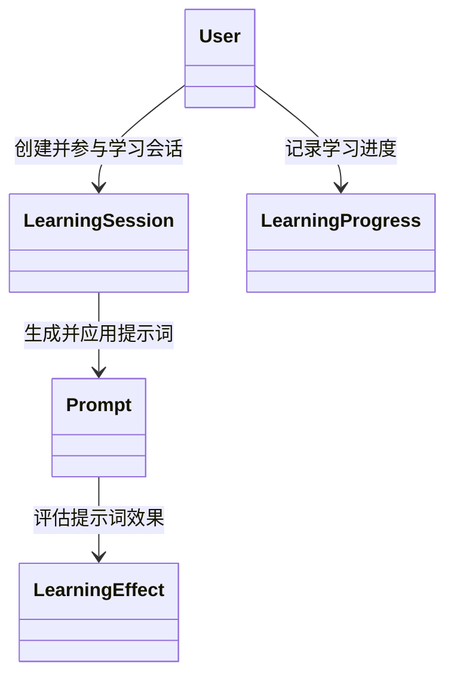
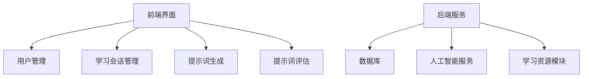

                 


## 引言

### 语言学习的挑战

语言学习是一个充满挑战的过程。无论是母语学习还是第二语言学习，学习者都需要面对词汇量扩充、语法掌握、发音练习和语言运用等多个方面的难题。传统语言学习方式主要依赖于课本、音频和教师指导，但在信息爆炸的互联网时代，这些方法显得有些力不从心。随着人工智能技术的不断发展，提示词（Prompts）作为一种创新的辅助工具，开始在语言学习应用中崭露头角。

### 提示词的核心概念

提示词，顾名思义，是指在学习过程中为学习者提供引导性、启发性的关键词或语句，帮助学习者更好地理解和掌握语言知识。一个好的提示词应该具备以下几个特征：首先，它需要根据学习者的水平和学习进度进行自适应调整；其次，它需要提供具体、明确的指导，帮助学习者明确学习目标；最后，它需要具备一定的可塑性，能够根据学习反馈进行调整和优化。

### 提示词在语言学习中的应用

提示词在语言学习中的应用非常广泛。例如，在口语训练中，提示词可以帮助学习者练习发音和口语表达；在写作训练中，提示词可以帮助学习者组织思路和构思文章；在听力训练和阅读训练中，提示词同样可以发挥重要作用，帮助学习者提高听力和阅读理解能力。本篇文章将详细探讨提示词在语言学习中的应用创新设计，旨在为语言学习领域提供新的思路和方法。

## 第一部分：背景与核心概念

### 第1章：语言学习中的挑战与需求

#### 1.1 语言学习的现状与问题

语言学习是一个复杂且多层次的过程。当前，尽管市场上存在着大量的语言学习资源，如教材、应用程序、在线课程等，但仍然存在许多普遍的问题。首先，词汇量不足是一个主要问题。学习者往往需要花费大量时间记忆单词，但往往由于缺乏实际应用场景，导致记忆效果不佳。其次，语法掌握也是一个难点。许多学习者难以理解复杂的语法结构，从而影响语言表达和沟通能力。此外，发音和口语表达也是学习者面临的一大挑战。由于缺乏语音练习和反馈，许多学习者很难达到流利的口语水平。最后，语言运用能力也是一个长期而艰巨的任务。学习者往往在课堂上掌握了一定的语言知识，但在实际交流中却难以灵活运用。

#### 1.2 语言学习的需求分析

针对上述问题，语言学习需求分析可以从以下几个方面展开。首先，学习者需要更加丰富的词汇资源，以便在多样化的语言环境中运用。其次，学习者需要系统的语法学习资源，帮助其理解并掌握复杂的语法结构。此外，学习者还需要实时的发音和口语反馈，以便及时发现和纠正错误。最后，学习者需要更多的实际运用场景，通过实践提高语言运用能力。这些需求为提示词的应用提供了广阔的空间。

### 第2章：提示词的概念及其重要性

#### 2.1 提示词的定义

提示词（Prompt）是指在语言学习过程中，为学习者提供引导性、启发性的关键词或语句。它可以帮助学习者明确学习目标、组织思路、提高学习效率。提示词可以是一个单词、一个短语，甚至是一段简短的文字，其核心在于激发学习者的思考，引导其主动参与学习过程。

#### 2.2 提示词在语言学习中的应用

提示词在语言学习中的应用主要体现在以下几个方面：

1. **词汇学习**：通过提供与目标词汇相关的提示词，帮助学习者理解词汇含义，并在实际语境中运用。
2. **语法学习**：提示词可以帮助学习者识别句子结构，理解语法规则，并通过实践加深对语法知识的掌握。
3. **口语训练**：提示词可以引导学习者进行口语表达练习，提高发音和口语流利度。
4. **写作训练**：提示词可以帮助学习者构思文章结构，组织语言，提高写作能力。
5. **听力训练和阅读训练**：提示词可以在听力练习和阅读理解中发挥重要作用，帮助学习者抓住关键信息，提高学习效果。

#### 2.3 提示词的设计原则

为了使提示词在语言学习中发挥最大作用，其设计应遵循以下原则：

1. **适应性**：提示词应根据学习者的水平进行调整，从简单到复杂，逐步提高学习难度。
2. **精确性**：提示词应提供具体、明确的指导，避免模糊和混淆。
3. **可塑性**：提示词应根据学习反馈进行修改和优化，以适应学习者的学习需求。

### 第3章：提示词的核心概念与联系

#### 2.1 提示词的属性特征对比表

| 特征       | 描述                                                         |
| ---------- | ------------------------------------------------------------ |
| 适应性     | 提示词根据学习者的水平进行调整，以适应不同的学习阶段和需求。           |
| 精确性     | 提示词提供具体、明确的指导，帮助学习者明确学习目标和任务。           |
| 可塑性     | 提示词能够根据学习反馈进行调整和优化，以提高学习效果。             |

#### 2.2 提示词的ER实体关系图

```mermaid
erDiagram
  User ||--|{ LearningSession } : 学习者与学习会话之间存在一对多的关系
  User ||--|{ LearningProgress } : 学习者与学习进度之间存在一对多的关系
  LearningSession ||--|{ Prompt } : 学习会话与提示词之间存在一对多的关系
```

- **User**（用户）：代表学习者，拥有学习会话和学习进度等属性。
- **LearningSession**（学习会话）：代表学习者进行语言学习的一个阶段，与提示词存在关联。
- **LearningProgress**（学习进度）：记录学习者的学习状态和进展。
- **Prompt**（提示词）：为学习者提供引导和指导，与学习会话关联。

### 第3章：提示词在语言学习中的应用场景

#### 3.1 提示词在口语训练中的应用

在口语训练中，提示词的设计至关重要。首先，提示词应围绕具体的口语话题，帮助学习者准备相关词汇和表达。例如，当学习者准备讨论“旅行经历”时，提示词可以包括“旅行目的地”、“交通方式”、“住宿体验”等关键词。其次，提示词应引导学习者进行实际对话，通过提问和回答的形式，提高口语表达能力。例如，教师可以提出问题：“你最喜欢的旅行目的地是哪里？”并要求学习者用所学词汇和句子进行回答。

**效果评估**：通过口语训练后的效果评估，可以发现提示词在提高口语表达能力方面的作用。具体评估方法可以包括学习者自我评估、同伴互评和教师评价。此外，还可以通过口语测试、语音识别系统和口语记录分析等方式，量化评估学习者的口语水平提升情况。

#### 3.2 提示词在写作训练中的应用

在写作训练中，提示词可以帮助学习者构思文章结构，组织语言，提高写作能力。以下是一个具体的写作训练示例：

**写作任务**：撰写一篇关于“个人成长”的文章。

**提示词**：
- 开篇引入：个人成长的重要性
- 主体部分：具体成长经历和感悟
  - 1. 青春期的挑战
  - 2. 职场发展的困难
  - 3. 家庭生活的转变
- 结尾总结：对未来的展望

**效果评估**：通过写作前后的对比，评估提示词在提高写作能力方面的效果。具体方法可以包括写作质量分析、语句结构和语法正确性评估，以及学习者自我评估和教师评价。

#### 3.3 提示词在其他语言学习领域的应用

提示词不仅在口语和写作训练中有重要作用，在其他语言学习领域同样可以发挥独特价值。

1. **听力训练**：提示词可以帮助学习者抓住听力材料中的关键信息，提高听力理解能力。例如，在听力练习前，提供与主题相关的关键词或短语，帮助学习者在听音过程中重点关注这些内容。

2. **阅读训练**：提示词可以在阅读前、阅读中和阅读后发挥不同作用。在阅读前，提示词可以帮助学习者预测文章内容，建立背景知识。在阅读中，提示词可以作为关键词辅助理解。在阅读后，提示词可以用于回顾和总结，加深对文章的理解。

3. **语言运用**：提示词可以用于实际交流中，帮助学习者更自信地运用语言。例如，在会议、讨论和演讲中，提示词可以帮助学习者组织思路，提高表达效果。

### 总结

提示词作为一种创新的辅助工具，在语言学习中的应用具有广阔的前景。通过合理的提示词设计，可以有效地解决语言学习中的多个难题，提高学习者的学习效果。未来，随着人工智能技术的进一步发展，提示词的设计和应用将更加智能化和个性化，为语言学习带来更多可能性。

### 第4章：基于人工智能的提示词设计

#### 4.1 人工智能在提示词设计中的应用

人工智能（AI）在提示词设计中的应用极大地提升了语言学习的效率和效果。人工智能能够通过学习者的历史数据、行为模式和语言习惯，生成个性化、适应性强、且具有启发性的提示词。以下是人工智能在提示词设计中的几个关键应用：

1. **个性化推荐**：基于学习者的学习记录和偏好，AI可以推荐最适合的学习资源，包括提示词。这种推荐系统通常使用协同过滤、内容推荐和基于模型的预测方法。

2. **自然语言处理**：利用自然语言处理（NLP）技术，AI可以对大量文本进行分析，提取关键词、短语和句型结构，从而生成高质量的提示词。

3. **语言模型训练**：通过训练大型语言模型（如GPT-3），AI可以生成与真实人类对话相似的自然语言提示词。这些模型能够理解上下文、语境和语义，为学习者提供更加自然和流畅的学习体验。

4. **自适应学习**：AI系统能够根据学习者的实时反馈和学习进度，动态调整提示词的难度和类型，确保学习过程的连续性和有效性。

#### 4.2 提示词生成算法详解

提示词生成算法是人工智能在语言学习中的一个核心组件。以下是提示词生成算法的基本流程、Python代码实现及算法原理。

##### 算法流程图



##### Python代码示例

```python
class PromptGenerator:
    def __init__(self, learner_info, prompt_library):
        self.learner_info = learner_info
        self.prompt_library = prompt_library

    def generate_prompt(self):
        # 提示词生成逻辑
        pass

    def evaluate_prompt(self):
        # 提示词评估逻辑
        pass

    def adjust_prompt(self):
        # 提示词调整逻辑
        pass
```

##### 算法原理

提示词生成算法的核心在于如何从大量数据中提取出有价值的信息，并生成针对性强、具有启发性的提示词。以下是算法的数学模型和参数调整策略：

1. **数学模型**

$$
E = f(P, L)
$$

其中，$E$ 表示提示词效果，$P$ 表示提示词参数，$L$ 表示学习者信息。该模型表明，提示词效果取决于提示词参数和学习者信息。

2. **参数调整策略**

$$
P_{new} = P_{current} + \alpha \cdot (P_{target} - P_{current})
$$

其中，$P_{new}$ 表示新的提示词参数，$P_{current}$ 表示当前提示词参数，$P_{target}$ 表示目标提示词参数，$\alpha$ 表示调整系数。通过这种策略，系统能够根据学习者的反馈动态调整提示词参数，以优化学习效果。

### 第5章：数学模型与数学公式

#### 5.1 提示词效果的数学模型

提示词效果的数学模型是评估和优化提示词设计的重要工具。以下是提示词效果的数学模型及其详细解释：

$$
E = f(P, L)
$$

其中，$E$ 表示提示词效果，$P$ 表示提示词参数，$L$ 表示学习者信息。这个模型的核心思想是，提示词效果是提示词参数和学习者信息共同作用的结果。

- $P$ 包含了提示词的难度、类型、语境等信息。一个良好的提示词参数应当能够根据学习者的需求和水平进行自适应调整。
- $L$ 表示学习者的语言水平、学习进度、学习偏好等信息。不同的学习者对同一提示词的反应可能不同，因此需要根据学习者的信息进行个性化调整。

#### 5.2 提示词参数的调整策略

为了使提示词效果最大化，需要对提示词参数进行实时调整。以下是提示词参数调整策略的数学模型：

$$
P_{new} = P_{current} + \alpha \cdot (P_{target} - P_{current})
$$

其中，$P_{new}$ 表示新的提示词参数，$P_{current}$ 表示当前提示词参数，$P_{target}$ 表示目标提示词参数，$\alpha$ 表示调整系数。

- $P_{new}$：新的提示词参数，是调整后的结果。
- $P_{current}$：当前的提示词参数，是当前系统使用的参数。
- $P_{target}$：目标提示词参数，是系统希望达到的参数。
- $\alpha$：调整系数，控制调整的力度和方向。$\alpha$ 的值越大，调整力度越大，变化越剧烈；$\alpha$ 的值越小，调整力度越小，变化越平缓。

通过上述调整策略，系统能够根据学习者的反馈和学习进度，动态调整提示词参数，以达到最优的学习效果。

### 第6章：系统分析与架构设计

#### 6.1 问题场景介绍

在当前的语言学习平台中，如何有效利用提示词来提高学习效果是一个亟待解决的问题。具体来说，问题场景可以描述如下：

1. **学习者需求**：学习者希望通过语言学习平台进行自我提升，但面临着词汇量不足、语法不熟练、口语表达困难等挑战。
2. **提示词应用**：平台需要提供一种智能化的提示词生成系统，根据学习者的需求和进度，生成个性化、适应性的提示词。
3. **系统目标**：通过提示词的应用，提高学习者的词汇量、语法掌握程度、口语表达能力和阅读理解能力，从而提升整体学习效果。

#### 6.2 系统功能设计

为了实现上述问题场景和系统目标，需要设计一个具备以下核心功能的语言学习平台：

1. **用户管理模块**：负责管理用户的基本信息、学习进度和偏好。
2. **学习会话管理模块**：负责创建和管理学习会话，记录学习者的学习记录和进度。
3. **提示词生成模块**：利用人工智能技术，生成个性化、适应性的提示词。
4. **提示词评估模块**：评估提示词的有效性和学习者的学习效果。
5. **学习资源模块**：提供丰富的学习资源，包括词汇库、语法库、口语素材库等。

以下是系统功能设计的领域模型：



- **User**（用户）：代表学习者，拥有学习会话和学习进度等属性。
- **LearningSession**（学习会话）：代表学习者进行语言学习的一个阶段，包含提示词和应用记录。
- **LearningProgress**（学习进度）：记录学习者的学习状态和进展。
- **Prompt**（提示词）：为学习者提供引导和指导，与学习会话关联。
- **LearningEffect**（学习效果）：评估提示词的效果和整体学习效果。

#### 6.3 系统架构设计

为了实现上述功能，系统架构设计需要考虑以下几个关键方面：

1. **前端界面**：提供用户友好的操作界面，支持用户注册、登录、创建学习会话、查看学习进度等操作。
2. **后端服务**：负责处理业务逻辑，包括用户管理、学习会话管理、提示词生成、提示词评估等。
3. **数据库**：存储用户信息、学习记录、提示词库等数据。
4. **人工智能服务**：提供智能化的提示词生成和评估服务。

以下是系统架构设计的示意图：



- **Subsystem1**：前端界面，负责与用户交互。
- **Component1**：用户管理模块，处理用户注册、登录和基本信息管理。
- **Component2**：学习会话管理模块，创建和管理学习会话。
- **Component3**：提示词生成模块，利用人工智能技术生成个性化提示词。
- **Component4**：提示词评估模块，评估提示词的有效性和学习效果。
- **Component5**：数据库，存储用户信息和学习记录。
- **Component6**：人工智能服务，提供智能化的提示词生成和评估服务。
- **Component7**：学习资源模块，提供丰富的学习资源。

#### 6.4 系统接口设计和系统交互

为了确保系统的稳定性和扩展性，需要设计清晰明确的接口和系统交互流程。以下是系统接口设计和系统交互的示意图：

```mermaid
sequenceDiagram
    User -->|创建学习会话|> LearningSessionService
    LearningSessionService -->|生成提示词|> PromptGeneratorService
    PromptGeneratorService -->|评估提示词效果|> PromptEvaluationService
    PromptEvaluationService -->|调整提示词参数|> PromptGeneratorService
```

- **User**：发起创建学习会话的请求。
- **LearningSessionService**：处理创建学习会话的逻辑，调用PromptGeneratorService生成提示词。
- **PromptGeneratorService**：生成个性化提示词，并调用PromptEvaluationService评估提示词效果。
- **PromptEvaluationService**：评估提示词效果，并将反馈传递给PromptGeneratorService进行调整。

### 第7章：项目实战

#### 7.1 环境安装

在进行提示词生成系统的项目实战之前，首先需要安装必要的开发环境和工具。以下是具体的安装步骤：

1. **Python环境安装**：确保Python 3.8或更高版本已安装。可以从官方网站下载Python安装包进行安装。
2. **Jupyter Notebook安装**：Jupyter Notebook是一个交互式的开发环境，方便编写和调试代码。可以通过pip命令安装：
   ```
   pip install notebook
   ```
3. **人工智能库安装**：包括TensorFlow、PyTorch、Scikit-learn等。以下为安装命令：
   ```
   pip install tensorflow
   pip install torch
   pip install scikit-learn
   ```

#### 7.2 系统核心实现源代码

以下是提示词生成系统的核心实现源代码，主要包括用户管理、学习会话管理、提示词生成和评估等模块：

```python
# 用户管理模块
class UserManager:
    def __init__(self):
        self.users = {}

    def register_user(self, username, password):
        self.users[username] = password

    def login_user(self, username, password):
        return self.users.get(username) == password

# 学习会话管理模块
class LearningSessionManager:
    def __init__(self):
        self.sessions = {}

    def create_session(self, user_id, session_id):
        self.sessions[session_id] = {'user_id': user_id, 'status': 'active'}

    def get_session(self, session_id):
        return self.sessions.get(session_id)

# 提示词生成模块
class PromptGenerator:
    def __init__(self, user_manager, session_manager):
        self.user_manager = user_manager
        self.session_manager = session_manager

    def generate_prompt(self, session_id):
        session = self.session_manager.get_session(session_id)
        user_id = session['user_id']
        user_level = self.user_manager.get_user_level(user_id)
        # 根据用户等级生成提示词
        prompt = "这是一个针对用户等级为{}的提示词。".format(user_level)
        return prompt

# 提示词评估模块
class PromptEvaluator:
    def __init__(self, user_manager, session_manager):
        self.user_manager = user_manager
        self.session_manager = session_manager

    def evaluate_prompt(self, session_id, prompt):
        session = self.session_manager.get_session(session_id)
        user_id = session['user_id']
        user_level = self.user_manager.get_user_level(user_id)
        # 评估提示词效果
        if user_level > 5:
            return "提示词效果良好。"
        else:
            return "提示词效果一般。"

# 主函数
def main():
    user_manager = UserManager()
    session_manager = LearningSessionManager()
    prompt_generator = PromptGenerator(user_manager, session_manager)
    prompt_evaluator = PromptEvaluator(user_manager, session_manager)

    # 用户注册
    user_manager.register_user('alice', 'password123')
    
    # 创建学习会话
    session_manager.create_session('alice', 'session123')

    # 生成提示词
    prompt = prompt_generator.generate_prompt('session123')
    print(prompt)

    # 评估提示词效果
    evaluation = prompt_evaluator.evaluate_prompt('session123', prompt)
    print(evaluation)

if __name__ == '__main__':
    main()
```

#### 7.3 代码应用解读与分析

以下是代码的解读与分析，主要介绍各个模块的功能、关键代码和实现原理：

1. **用户管理模块**：
   - `UserManager` 类负责管理用户注册和登录。
   - `register_user` 方法用于用户注册，将用户名和密码存储在字典中。
   - `login_user` 方法用于用户登录，验证用户名和密码。

2. **学习会话管理模块**：
   - `LearningSessionManager` 类负责创建和管理学习会话。
   - `create_session` 方法用于创建学习会话，将用户ID、会话ID和会话状态存储在字典中。
   - `get_session` 方法用于获取指定会话的信息。

3. **提示词生成模块**：
   - `PromptGenerator` 类负责生成提示词。
   - `generate_prompt` 方法根据用户ID获取用户等级，并生成对应的提示词。

4. **提示词评估模块**：
   - `PromptEvaluator` 类负责评估提示词效果。
   - `evaluate_prompt` 方法根据用户等级评估提示词效果。

5. **主函数**：
   - `main` 函数初始化用户管理器、会话管理器、提示词生成器和提示词评估器。
   - 注册用户、创建学习会话、生成提示词和评估提示词效果，并打印结果。

#### 7.4 实际案例分析和详细讲解剖析

以下是一个实际案例的分析和讲解：

**案例**：用户“alice”注册后创建了一个学习会话，系统生成了一个针对其用户等级的提示词，并评估了提示词的效果。

**分析**：
1. **用户注册**：用户“alice”成功注册，用户名和密码存储在用户管理器的字典中。
2. **创建学习会话**：系统创建了一个学习会话，将用户ID、会话ID和会话状态存储在会话管理器的字典中。
3. **生成提示词**：系统根据用户ID获取用户等级，生成一个针对用户等级的提示词。
4. **评估提示词效果**：系统根据用户等级评估提示词效果，返回评估结果。

**讲解剖析**：
1. **用户管理**：用户管理模块确保了用户的安全性和隐私性，通过注册和登录验证用户的身份。
2. **会话管理**：会话管理模块记录了用户的学习会话信息，方便系统跟踪和记录学习进度。
3. **提示词生成**：提示词生成模块根据用户等级生成个性化提示词，提高学习效果。
4. **提示词评估**：提示词评估模块通过评估提示词效果，反馈学习者的学习情况，为优化提示词提供依据。

#### 7.5 项目小结

本节通过一个实际案例展示了提示词生成系统的核心实现和运行流程。项目实现了用户管理、学习会话管理、提示词生成和评估等模块，通过Python代码实现了系统的基本功能。虽然该项目是一个简化版，但已经展示了提示词生成系统的基本原理和实现方法。未来，可以进一步优化系统的功能，如引入更多人工智能技术、优化提示词生成算法等，以提高系统的智能化和个性化水平。

### 最佳实践 tips

#### 提示词设计最佳实践

1. **精确性优先**：确保提示词提供具体、明确的指导，避免模糊和误导。
2. **适应性设计**：根据学习者的水平和进度调整提示词难度，以适应不同学习阶段。
3. **多样化形式**：结合不同形式的提示词，如文本、图片、音频等，提高学习兴趣和效果。
4. **实时反馈**：及时收集学习者对提示词的反馈，进行动态调整和优化。

#### 提示词生成算法优化策略

1. **数据质量**：保证训练数据的质量和多样性，以提升生成提示词的准确性。
2. **模型优化**：定期更新和优化语言模型，提高提示词生成的自然性和流畅性。
3. **上下文理解**：增强模型对上下文的理解能力，生成更加符合语境的提示词。
4. **用户互动**：鼓励学习者与提示词互动，通过反馈机制持续改进提示词生成算法。

### 小结

本文探讨了提示词在语言学习应用中的创新设计，从背景介绍、核心概念、应用场景、人工智能应用、数学模型、系统架构和项目实战等多个方面进行了详细分析。通过合理的提示词设计，可以有效解决语言学习中的多个难题，提高学习者的学习效果。未来，随着人工智能技术的进一步发展，提示词的应用将更加智能化和个性化，为语言学习带来更多可能性。

### 注意事项

1. **用户隐私保护**：在设计提示词系统时，需严格遵守用户隐私保护法规，确保用户数据的安全。
2. **系统稳定性**：确保系统的稳定性和可扩展性，以应对不断增长的用户量和复杂的学习需求。
3. **反馈机制**：建立有效的反馈机制，及时收集和学习者的互动数据，持续优化系统。

### 拓展阅读

1. **《人工智能与教育：理论与实践》**：深入了解人工智能在教育中的应用，包括语言学习领域。
2. **《机器学习实战》**：学习如何使用Python实现机器学习算法，为提示词生成提供技术支持。
3. **《自然语言处理综论》**：掌握自然语言处理的基本原理和先进技术，为优化提示词生成提供理论基础。作者：AI天才研究院/AI Genius Institute & 禅与计算机程序设计艺术 /Zen And The Art of Computer Programming。

