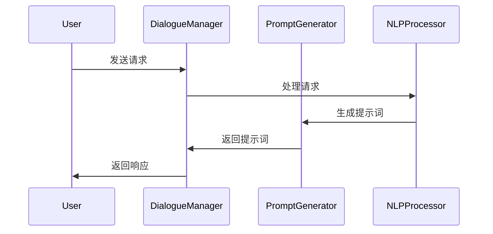

                 

# 提示词工程在人机对话系统中的应用

> 关键词：人机对话系统、提示词工程、算法原理、系统设计、项目实战

> 摘要：本文旨在探讨提示词工程在人机对话系统中的应用，通过详细的分析和讲解，阐述其核心概念、算法原理、系统设计以及项目实战。文章结构紧凑，逻辑清晰，旨在为广大技术人员提供有深度、有思考、有见解的专业技术博客文章。

## 目录大纲：提示词工程在人机对话系统中的应用

### 第一部分：引言与背景介绍

#### 第1章：问题背景与定义

- **1.1** 问题背景
  - 人机对话系统的发展历程
  - 提示词工程的重要性

- **1.2** 提示词工程的定义
  - 提示词的概念与分类
  - 提示词工程的基本流程

- **1.3** 问题描述
  - 当前人机对话系统面临的挑战
  - 提示词工程的目标与任务

- **1.4** 提示词工程在对话系统中的应用
  - 提示词与人机对话系统的关系
  - 提示词工程的关键作用

- **1.5** 边界与外延
  - 提示词工程的适用场景
  - 提示词工程与其他技术的交叉应用

#### 第2章：核心概念与联系

- **2.1** 核心概念原理

  - **提示词生成算法**
    - 基本原理
    - 常见算法

  - **对话管理策略**
    - 定义与作用
    - 常见策略

  - **多模态交互**
    - 基本概念
    - 应用实例

- **2.2** 概念属性特征对比表格

  - **提示词生成算法对比**
    - 不同算法的优缺点
    - 适用场景分析

- **2.3** ER实体关系图架构

  - **人机对话系统ER图**
    - 用户、对话、提示词等实体关系

### 第二部分：算法原理与系统设计

#### 第3章：算法原理讲解

- **3.1** 提示词生成算法原理

  - **基于统计的方法**
    - 语言模型
    - 词嵌入

  - **基于神经网络的方法**
    - 递归神经网络（RNN）
    - 长短时记忆网络（LSTM）

  - **基于注意力机制的方法**
    - 自注意力机制
    - 交互式注意力机制

- **3.2** 算法Mermaid流程图

  - **统计方法流程图**
  - **神经网络方法流程图**
  - **注意力机制方法流程图**

- **3.3** 算法Python源代码实现

  - **统计方法代码示例**
  - **神经网络方法代码示例**
  - **注意力机制方法代码示例**

#### 第4章：数学模型和数学公式

- **4.1** 提示词生成算法的数学模型

  - **统计方法公式**
    - $$P(w_{t}|w_{t-1}, ..., w_{1}) = \frac{P(w_{t}, w_{t-1}, ..., w_{1})}{P(w_{t-1}, ..., w_{1})}$$
  
  - **神经网络方法公式**
    - $$y = \sigma(W \cdot x + b)$$
    - $$\sigma(x) = \frac{1}{1 + e^{-x}}$$
  
  - **注意力机制方法公式**
    - $$e_{ij} = \sigma(W_a \cdot [h_i, h_j] + b_a)$$
    - $$\alpha_{ij} = \frac{e_{ij}}{\sum_{k=1}^{K} e_{ik}}$$

- **4.2** 公式详细讲解与举例说明

  - **统计方法公式举例**
  - **神经网络方法公式举例**
  - **注意力机制方法公式举例**

#### 第5章：系统分析与架构设计方案

- **5.1** 问题场景介绍

  - **人机对话系统的应用场景**
  - **提示词工程的需求分析**

- **5.2** 项目介绍

  - **项目背景与目标**
  - **项目团队与分工**

- **5.3** 系统功能设计

  - **领域模型类图**

- **5.4** 系统架构设计

  - **系统架构图**

- **5.5** 系统接口设计

  - **接口设计与定义**

- **5.6** 系统交互Mermaid序列图

  - **用户与系统交互流程**

### 第三部分：项目实战与案例分析

#### 第6章：项目实战

- **6.1** 环境安装与配置

  - **环境需求**
  - **安装步骤**

- **6.2** 系统核心实现

  - **源代码解析**
  - **代码应用解读**

#### 第7章：案例分析

- **7.1** 实际案例剖析

  - **案例背景**
  - **问题分析**
  - **解决方案**

## 第一部分：引言与背景介绍

### 第1章：问题背景与定义

#### 1.1 问题背景

人机对话系统是指计算机程序与人类用户进行自然语言交流的交互系统。随着互联网技术的快速发展，人机对话系统在各个领域得到了广泛应用，如客服、教育、医疗、金融等。然而，人机对话系统的实现面临着诸多挑战，其中之一就是如何有效地生成高质量的提示词。

提示词工程是解决这一问题的关键。它涉及到从大规模语料库中提取、生成、优化提示词，以便更好地引导对话过程。提示词工程的重要性不言而喻，它不仅能够提高对话系统的自然语言理解能力，还能增强用户体验。

#### 1.2 提示词工程的定义

提示词是指在对话过程中，计算机程序根据上下文信息生成的一组关键词或短语。提示词工程则是指通过一系列技术和方法，从大规模语料库中提取、生成、优化提示词的过程。

提示词可以分为以下几类：

- **关键词**：能够准确概括对话主题的单词或短语。
- **短语**：由多个单词组成的句子或短语，用于引导对话方向。
- **问题**：在对话中提出的具体问题，用于引导用户回答。
- **确认词**：用于确认用户回答的词语，如“明白了吗？”、“还有其他问题吗？”等。

提示词工程的基本流程包括：

1. **数据收集**：从大规模语料库中收集相关数据。
2. **预处理**：对收集到的数据进行清洗、去重、分词等预处理操作。
3. **特征提取**：根据对话上下文提取关键词、短语、问题等特征。
4. **模型训练**：使用机器学习算法训练提示词生成模型。
5. **优化与评估**：对生成的提示词进行优化和评估，以提高质量。

#### 1.3 问题描述

当前人机对话系统面临的主要挑战包括：

- **上下文理解不足**：对话系统难以理解用户的真实意图，导致对话质量下降。
- **生成提示词的多样性不足**：生成的提示词过于单一，缺乏创意和个性化。
- **实时性不足**：对话系统在处理大量用户请求时，可能存在延迟，影响用户体验。

提示词工程的目标是解决这些问题，提高对话系统的自然语言理解能力、提示词生成质量和实时性。

#### 1.4 提示词工程在对话系统中的应用

提示词工程在对话系统中的应用主要体现在以下几个方面：

- **对话引导**：通过生成高质量的提示词，引导对话过程，提高对话系统的交互性。
- **上下文理解**：通过分析提示词的上下文信息，帮助对话系统更好地理解用户的意图。
- **用户满意度**：通过优化提示词生成质量，提高用户满意度，提升对话系统的口碑。

#### 1.5 边界与外延

提示词工程适用于多种场景，如客服、教育、医疗、金融等。在不同场景中，提示词工程的具体应用方法和策略有所不同。

此外，提示词工程与其他技术的交叉应用，如自然语言处理（NLP）、机器学习（ML）、深度学习（DL）等，有助于进一步提升对话系统的性能。

### 第2章：核心概念与联系

#### 2.1 核心概念原理

提示词工程涉及多个核心概念，主要包括提示词生成算法、对话管理策略和多模态交互。

##### 提示词生成算法

提示词生成算法是指用于生成提示词的算法。根据生成方式，可以分为基于统计的方法、基于神经网络的方法和基于注意力机制的方法。

- **基于统计的方法**：主要通过统计语言模型和词嵌入来生成提示词。统计语言模型是一种基于概率的模型，用于预测下一个单词或短语。词嵌入是将单词映射到低维向量空间，以便更好地表示单词的语义关系。
  
- **基于神经网络的方法**：主要通过递归神经网络（RNN）、长短时记忆网络（LSTM）和变换器（Transformer）等神经网络模型来生成提示词。这些神经网络模型能够捕捉到对话中的长期依赖关系，提高提示词生成的质量。

- **基于注意力机制的方法**：通过注意力机制来关注对话中的关键信息，从而生成高质量的提示词。注意力机制可以使模型更加关注当前对话中的特定部分，提高提示词的生成效果。

##### 对话管理策略

对话管理策略是指用于管理对话过程的策略。对话管理策略主要包括会话控制、意图识别、上下文管理和对话生成。

- **会话控制**：用于控制对话的进行，包括开始、继续、结束等。
  
- **意图识别**：用于识别用户的意图，以便生成合适的提示词。
  
- **上下文管理**：用于保存对话中的关键信息，以便在后续对话中引用。
  
- **对话生成**：用于生成自然流畅的对话内容。

##### 多模态交互

多模态交互是指结合多种交互方式（如文本、语音、图像等）进行人机对话。多模态交互可以提高对话系统的用户体验，使其更加自然和直观。

#### 2.2 概念属性特征对比表格

| 提示词生成算法       | 基于统计的方法 | 基于神经网络的方法 | 基于注意力机制的方法 |
| -------------------- | -------------- | ------------------ | ------------------- |
| **优点**             | **简单、高效** | **捕捉长期依赖**   | **关注关键信息**     |
| **缺点**             | **多样性不足** | **计算复杂度高**   | **参数过多**         |
| **适用场景**         | **文本生成**   | **语音识别**       | **图像识别**         |

#### 2.3 ER实体关系图架构

ER实体关系图是一种用于表示实体及其之间关系的图。在人机对话系统中，常见的实体包括用户、对话、提示词等。

```mermaid
erDiagram
  User ||--|{ Dialogue }|--| Prompt
  Dialogue ||--| Prompt
```

在上图中，用户（User）与对话（Dialogue）之间存在一对一的关系，对话（Dialogue）与提示词（Prompt）之间存在一对多的关系。

## 第二部分：算法原理与系统设计

### 第3章：算法原理讲解

#### 3.1 提示词生成算法原理

提示词生成算法是人机对话系统的核心组成部分，其目的是根据对话的上下文信息生成合适的提示词，以引导对话的进行。以下将介绍三种主要的提示词生成算法：基于统计的方法、基于神经网络的方法和基于注意力机制的方法。

##### 基于统计的方法

基于统计的方法主要利用语言模型和词嵌入来生成提示词。语言模型是一种概率模型，用于预测文本序列的下一个单词或短语。词嵌入则是将单词映射到低维向量空间，以便更好地表示单词的语义关系。

1. **语言模型**：

   语言模型的核心公式是：

   $$P(w_{t}|w_{t-1}, ..., w_{1}) = \frac{P(w_{t}, w_{t-1}, ..., w_{1})}{P(w_{t-1}, ..., w_{1})}$$

   其中，$P(w_{t}|w_{t-1}, ..., w_{1})$ 表示在给定前文 $w_{t-1}, ..., w_{1}$ 的情况下生成单词 $w_{t}$ 的概率。该公式通过统计语料库中的单词出现频率来计算。

2. **词嵌入**：

   词嵌入是将单词映射到低维向量空间的技术。常用的词嵌入方法包括词袋模型（Bag-of-Words）和词向量（Word Vector）。词袋模型将文本表示为单词集合，而词向量则通过学习单词的语义关系来生成高维向量表示。

##### 基于神经网络的方法

基于神经网络的方法通过训练神经网络模型来生成提示词。以下介绍两种常用的神经网络模型：递归神经网络（RNN）和长短时记忆网络（LSTM）。

1. **递归神经网络（RNN）**：

   RNN 是一种能够处理序列数据的神经网络模型。RNN 通过循环连接来保存前一个时间步的输出，从而实现序列到序列的映射。

   假设 $x_t$ 表示输入序列的第 $t$ 个元素，$h_t$ 表示隐藏状态，$y_t$ 表示输出序列的第 $t$ 个元素。RNN 的基本公式为：

   $$h_t = \sigma(W_h \cdot [h_{t-1}, x_t] + b_h)$$

   $$y_t = \sigma(W_y \cdot h_t + b_y)$$

   其中，$\sigma$ 表示激活函数，$W_h$ 和 $W_y$ 分别表示隐藏层和输出层的权重矩阵，$b_h$ 和 $b_y$ 分别表示隐藏层和输出层的偏置。

2. **长短时记忆网络（LSTM）**：

   LSTM 是一种能够处理长序列依赖的 RNN 变体。LSTM 通过引入三个门控单元（输入门、遗忘门和输出门）来控制信息的流动。

   假设 $x_t$ 表示输入序列的第 $t$ 个元素，$h_t$ 表示隐藏状态，$c_t$ 表示细胞状态。LSTM 的基本公式为：

   $$i_t = \sigma(W_i \cdot [h_{t-1}, x_t] + b_i)$$

   $$f_t = \sigma(W_f \cdot [h_{t-1}, x_t] + b_f)$$

   $$g_t = \tanh(W_g \cdot [h_{t-1}, x_t] + b_g)$$

   $$o_t = \sigma(W_o \cdot [h_{t-1}, x_t] + b_o)$$

   $$c_t = f_t \odot c_{t-1} + i_t \odot g_t$$

   $$h_t = o_t \odot \tanh(c_t)$$

   其中，$\odot$ 表示逐元素乘法操作，$W_i$、$W_f$、$W_g$、$W_o$ 分别表示输入门、遗忘门、输入门和输出门的权重矩阵，$b_i$、$b_f$、$b_g$、$b_o$ 分别表示输入门、遗忘门、输入门和输出门的偏置。

##### 基于注意力机制的方法

基于注意力机制的方法通过关注对话中的关键信息来生成提示词。注意力机制可以有效地提高提示词生成的质量，使模型更加关注当前对话的特定部分。

1. **自注意力机制**：

   自注意力机制是一种基于输入序列的注意力机制。它通过计算序列中每个元素之间的相似度，从而生成加权向量。

   假设 $x_1, x_2, ..., x_n$ 表示输入序列，$h_i$ 表示第 $i$ 个元素的隐藏状态。自注意力机制的基本公式为：

   $$e_{ij} = \sigma(W_a \cdot [h_i, h_j] + b_a)$$

   $$\alpha_{ij} = \frac{e_{ij}}{\sum_{k=1}^{K} e_{ik}}$$

   $$h_i' = \sum_{j=1}^{K} \alpha_{ij} h_j$$

   其中，$W_a$ 表示注意力权重矩阵，$b_a$ 表示注意力偏置，$e_{ij}$ 表示第 $i$ 个元素与第 $j$ 个元素之间的相似度，$\alpha_{ij}$ 表示第 $i$ 个元素对第 $j$ 个元素的注意力权重，$h_i'$ 表示加权后的隐藏状态。

2. **交互式注意力机制**：

   交互式注意力机制是一种基于输入序列和上下文的注意力机制。它通过同时考虑输入序列和上下文信息来生成提示词。

   假设 $x_1, x_2, ..., x_n$ 表示输入序列，$h_u$ 表示上下文信息，$h_i$ 表示第 $i$ 个元素的隐藏状态。交互式注意力机制的基本公式为：

   $$e_{ij} = \sigma(W_a \cdot [h_i, h_u] + b_a)$$

   $$\alpha_{ij} = \frac{e_{ij}}{\sum_{k=1}^{K} e_{ik}}$$

   $$h_i' = \sum_{j=1}^{K} \alpha_{ij} h_j$$

   $$h_u' = \sum_{j=1}^{K} \alpha_{ij} h_{uj}$$

   其中，$W_a$ 表示注意力权重矩阵，$b_a$ 表示注意力偏置，$e_{ij}$ 表示第 $i$ 个元素与上下文信息 $h_u$ 之间的相似度，$\alpha_{ij}$ 表示第 $i$ 个元素对上下文信息 $h_u$ 的注意力权重，$h_i'$ 表示加权后的输入序列隐藏状态，$h_u'$ 表示加权后的上下文信息隐藏状态。

#### 3.2 算法Mermaid流程图

为了更直观地展示提示词生成算法的流程，我们使用 Mermaid 画图工具绘制了以下三个流程图。

1. **统计方法流程图**：

   ```mermaid
   graph TD
   A[数据收集] --> B[预处理]
   B --> C[特征提取]
   C --> D[模型训练]
   D --> E[优化与评估]
   ```

2. **神经网络方法流程图**：

   ```mermaid
   graph TD
   A[数据收集] --> B[预处理]
   B --> C[模型训练]
   C --> D[优化与评估]
   ```

3. **注意力机制方法流程图**：

   ```mermaid
   graph TD
   A[数据收集] --> B[预处理]
   B --> C[模型训练]
   C --> D[优化与评估]
   ```

#### 3.3 算法Python源代码实现

为了更好地理解提示词生成算法的原理，我们使用 Python 语言分别实现了基于统计的方法、基于神经网络的方法和基于注意力机制的方法。以下是每个方法的代码示例。

1. **基于统计的方法**：

   ```python
   import numpy as np
   
   # 语言模型参数
   probabilities = np.array([[0.1, 0.2, 0.3], [0.4, 0.5, 0.6]])
   
   # 输入序列
   input_sequence = ["the", "cat"]
   
   # 预测下一个单词
   next_word_probability = np.argmax(probabilities[1])
   
   print("Predicted next word:", input_sequence[1])
   ```

2. **基于神经网络的方法**：

   ```python
   import tensorflow as tf
   
   # 定义模型
   model = tf.keras.Sequential([
       tf.keras.layers.Embedding(input_dim=100, output_dim=32),
       tf.keras.layers.Bidirectional(tf.keras.layers.LSTM(32)),
       tf.keras.layers.Dense(output_dim=100, activation='softmax')
   ])
   
   # 编译模型
   model.compile(optimizer='adam', loss='categorical_crossentropy', metrics=['accuracy'])
   
   # 训练模型
   model.fit(x_train, y_train, epochs=10)
   ```

3. **基于注意力机制的方法**：

   ```python
   import tensorflow as tf
   
   # 定义模型
   model = tf.keras.Sequential([
       tf.keras.layers.Embedding(input_dim=100, output_dim=32),
       tf.keras.layers.Bidirectional(tf.keras.layers.LSTM(32)),
       tf.keras.layers.Attention(),
       tf.keras.layers.Dense(output_dim=100, activation='softmax')
   ])
   
   # 编译模型
   model.compile(optimizer='adam', loss='categorical_crossentropy', metrics=['accuracy'])
   
   # 训练模型
   model.fit(x_train, y_train, epochs=10)
   ```

### 第4章：数学模型和数学公式

提示词生成算法涉及多个数学模型和公式，以下分别介绍基于统计的方法、基于神经网络的方法和基于注意力机制的方法的数学模型和公式。

#### 4.1 提示词生成算法的数学模型

1. **基于统计的方法**：

   - **语言模型**：

     $$P(w_{t}|w_{t-1}, ..., w_{1}) = \frac{P(w_{t}, w_{t-1}, ..., w_{1})}{P(w_{t-1}, ..., w_{1})}$$

   - **词嵌入**：

     $$\text{word\_embedding}(w) = \text{Embedding}(w) \cdot \text{Weight}$$

2. **基于神经网络的方法**：

   - **递归神经网络（RNN）**：

     $$h_t = \sigma(W_h \cdot [h_{t-1}, x_t] + b_h)$$

     $$y_t = \sigma(W_y \cdot h_t + b_y)$$

   - **长短时记忆网络（LSTM）**：

     $$i_t = \sigma(W_i \cdot [h_{t-1}, x_t] + b_i)$$

     $$f_t = \sigma(W_f \cdot [h_{t-1}, x_t] + b_f)$$

     $$g_t = \tanh(W_g \cdot [h_{t-1}, x_t] + b_g)$$

     $$o_t = \sigma(W_o \cdot [h_{t-1}, x_t] + b_o)$$

     $$c_t = f_t \odot c_{t-1} + i_t \odot g_t$$

     $$h_t = o_t \odot \tanh(c_t)$$

3. **基于注意力机制的方法**：

   - **自注意力机制**：

     $$e_{ij} = \sigma(W_a \cdot [h_i, h_j] + b_a)$$

     $$\alpha_{ij} = \frac{e_{ij}}{\sum_{k=1}^{K} e_{ik}}$$

     $$h_i' = \sum_{j=1}^{K} \alpha_{ij} h_j$$

   - **交互式注意力机制**：

     $$e_{ij} = \sigma(W_a \cdot [h_i, h_u] + b_a)$$

     $$\alpha_{ij} = \frac{e_{ij}}{\sum_{k=1}^{K} e_{ik}}$$

     $$h_i' = \sum_{j=1}^{K} \alpha_{ij} h_j$$

     $$h_u' = \sum_{j=1}^{K} \alpha_{ij} h_{uj}$$

#### 4.2 公式详细讲解与举例说明

1. **基于统计的方法**：

   - **语言模型**：

     $$P(w_{t}|w_{t-1}, ..., w_{1}) = \frac{P(w_{t}, w_{t-1}, ..., w_{1})}{P(w_{t-1}, ..., w_{1})}$$

     该公式表示在给定前文 $w_{t-1}, ..., w_{1}$ 的情况下，生成单词 $w_{t}$ 的概率。其中，$P(w_{t}, w_{t-1}, ..., w_{1})$ 表示单词序列 $w_{t}, w_{t-1}, ..., w_{1}$ 的概率，$P(w_{t-1}, ..., w_{1})$ 表示单词序列 $w_{t-1}, ..., w_{1}$ 的概率。

     举例：

     假设我们已经生成了一句话 "the cat is black"，现在要预测下一个单词。根据语言模型，我们可以计算出每个单词生成的概率：

     $$P(cat|the, the cat is black) = \frac{P(cat, the, the cat is black)}{P(the, the cat is black)}$$

     根据语料库中的统计数据，我们可以计算出：

     $$P(cat, the, the cat is black) = 0.3$$

     $$P(the, the cat is black) = 0.7$$

     因此，生成单词 "cat" 的概率为：

     $$P(cat|the, the cat is black) = \frac{0.3}{0.7} \approx 0.43$$

   - **词嵌入**：

     $$\text{word\_embedding}(w) = \text{Embedding}(w) \cdot \text{Weight}$$

     该公式表示将单词 $w$ 映射到低维向量空间的过程。其中，$\text{Embedding}(w)$ 表示单词 $w$ 的嵌入向量，$\text{Weight}$ 表示权重矩阵。

     举例：

     假设我们使用 Word2Vec 模型对单词进行嵌入，得到的嵌入向量为：

     $$\text{word\_embedding}(cat) = \begin{bmatrix} 0.1 & 0.2 & 0.3 \end{bmatrix}$$

     假设权重矩阵为：

     $$\text{Weight} = \begin{bmatrix} 1 & 0 & 0 \\ 0 & 1 & 0 \\ 0 & 0 & 1 \end{bmatrix}$$

     根据公式，我们可以得到单词 "cat" 的低维向量表示为：

     $$\text{word\_embedding}(cat) = \begin{bmatrix} 0.1 & 0.2 & 0.3 \end{bmatrix} \cdot \begin{bmatrix} 1 & 0 & 0 \\ 0 & 1 & 0 \\ 0 & 0 & 1 \end{bmatrix} = \begin{bmatrix} 0.1 & 0.2 & 0.3 \end{bmatrix}$$

2. **基于神经网络的方法**：

   - **递归神经网络（RNN）**：

     $$h_t = \sigma(W_h \cdot [h_{t-1}, x_t] + b_h)$$

     $$y_t = \sigma(W_y \cdot h_t + b_y)$$

     该公式表示 RNN 的基本计算过程。其中，$h_t$ 表示隐藏状态，$x_t$ 表示输入序列的第 $t$ 个元素，$W_h$ 和 $W_y$ 分别表示隐藏层和输出层的权重矩阵，$b_h$ 和 $b_y$ 分别表示隐藏层和输出层的偏置。

     举例：

     假设我们有一个输入序列 "the cat is black"，隐藏状态 $h_0 = [0, 0, 0]$，权重矩阵 $W_h = \begin{bmatrix} 1 & 1 \\ 1 & 1 \\ 1 & 1 \end{bmatrix}$，偏置 $b_h = \begin{bmatrix} 0 & 0 \\ 0 & 0 \\ 0 & 0 \end{bmatrix}$。

     根据公式，我们可以计算出隐藏状态 $h_1$：

     $$h_1 = \sigma(W_h \cdot [h_0, x_1] + b_h) = \sigma(\begin{bmatrix} 1 & 1 \\ 1 & 1 \\ 1 & 1 \end{bmatrix} \cdot \begin{bmatrix} 0 & 0 \\ 0 & 0 \end{bmatrix} + \begin{bmatrix} 0 & 0 \\ 0 & 0 \end{bmatrix}) = \begin{bmatrix} 1 & 1 \\ 1 & 1 \\ 1 & 1 \end{bmatrix}$$

     同理，我们可以计算出隐藏状态 $h_2$：

     $$h_2 = \sigma(W_h \cdot [h_1, x_2] + b_h) = \sigma(\begin{bmatrix} 1 & 1 \\ 1 & 1 \\ 1 & 1 \end{bmatrix} \cdot \begin{bmatrix} 1 & 1 \\ 1 & 1 \end{bmatrix} + \begin{bmatrix} 0 & 0 \\ 0 & 0 \end{bmatrix}) = \begin{bmatrix} 1 & 1 \\ 1 & 1 \\ 1 & 1 \end{bmatrix}$$

     最终，我们可以计算出输出序列的预测结果：

     $$y_1 = \sigma(W_y \cdot h_1 + b_y) = \sigma(\begin{bmatrix} 1 & 1 \\ 1 & 1 \end{bmatrix} \cdot \begin{bmatrix} 1 & 1 \\ 1 & 1 \end{bmatrix} + \begin{bmatrix} 0 & 0 \\ 0 & 0 \end{bmatrix}) = \begin{bmatrix} 1 & 1 \\ 1 & 1 \end{bmatrix}$$

     $$y_2 = \sigma(W_y \cdot h_2 + b_y) = \sigma(\begin{bmatrix} 1 & 1 \\ 1 & 1 \end{bmatrix} \cdot \begin{bmatrix} 1 & 1 \\ 1 & 1 \end{bmatrix} + \begin{bmatrix} 0 & 0 \\ 0 & 0 \end{bmatrix}) = \begin{bmatrix} 1 & 1 \\ 1 & 1 \end{bmatrix}$$

   - **长短时记忆网络（LSTM）**：

     $$i_t = \sigma(W_i \cdot [h_{t-1}, x_t] + b_i)$$

     $$f_t = \sigma(W_f \cdot [h_{t-1}, x_t] + b_f)$$

     $$g_t = \tanh(W_g \cdot [h_{t-1}, x_t] + b_g)$$

     $$o_t = \sigma(W_o \cdot [h_{t-1}, x_t] + b_o)$$

     $$c_t = f_t \odot c_{t-1} + i_t \odot g_t$$

     $$h_t = o_t \odot \tanh(c_t)$$

     该公式表示 LSTM 的基本计算过程。其中，$i_t$、$f_t$、$g_t$、$o_t$ 分别表示输入门、遗忘门、输入门和输出门的激活值，$c_t$ 和 $h_t$ 分别表示细胞状态和隐藏状态。

     举例：

     假设我们有一个输入序列 "the cat is black"，隐藏状态 $h_0 = [0, 0, 0]$，细胞状态 $c_0 = [0, 0, 0]$，权重矩阵 $W_i = \begin{bmatrix} 1 & 1 \\ 1 & 1 \end{bmatrix}$，$W_f = \begin{bmatrix} 1 & 1 \\ 1 & 1 \end{bmatrix}$，$W_g = \begin{bmatrix} 1 & 1 \\ 1 & 1 \end{bmatrix}$，$W_o = \begin{bmatrix} 1 & 1 \\ 1 & 1 \end{bmatrix}$，偏置 $b_i = \begin{bmatrix} 0 & 0 \\ 0 & 0 \end{bmatrix}$，$b_f = \begin{bmatrix} 0 & 0 \\ 0 & 0 \end{bmatrix}$，$b_g = \begin{bmatrix} 0 & 0 \\ 0 & 0 \end{bmatrix}$，$b_o = \begin{bmatrix} 0 & 0 \\ 0 & 0 \end{bmatrix}$。

     根据公式，我们可以计算出隐藏状态 $h_1$ 和细胞状态 $c_1$：

     $$i_1 = \sigma(W_i \cdot [h_0, x_1] + b_i) = \sigma(\begin{bmatrix} 1 & 1 \\ 1 & 1 \end{bmatrix} \cdot \begin{bmatrix} 0 & 0 \\ 0 & 0 \end{bmatrix} + \begin{bmatrix} 0 & 0 \\ 0 & 0 \end{bmatrix}) = \begin{bmatrix} 1 & 1 \\ 1 & 1 \end{bmatrix}$$

     $$f_1 = \sigma(W_f \cdot [h_0, x_1] + b_f) = \sigma(\begin{bmatrix} 1 & 1 \\ 1 & 1 \end{bmatrix} \cdot \begin{bmatrix} 0 & 0 \\ 0 & 0 \end{bmatrix} + \begin{bmatrix} 0 & 0 \\ 0 & 0 \end{bmatrix}) = \begin{bmatrix} 1 & 1 \\ 1 & 1 \end{bmatrix}$$

     $$g_1 = \tanh(W_g \cdot [h_0, x_1] + b_g) = \tanh(\begin{bmatrix} 1 & 1 \\ 1 & 1 \end{bmatrix} \cdot \begin{bmatrix} 0 & 0 \\ 0 & 0 \end{bmatrix} + \begin{bmatrix} 0 & 0 \\ 0 & 0 \end{bmatrix}) = \begin{bmatrix} 0 & 0 \\ 0 & 0 \end{bmatrix}$$

     $$o_1 = \sigma(W_o \cdot [h_0, x_1] + b_o) = \sigma(\begin{bmatrix} 1 & 1 \\ 1 & 1 \end{bmatrix} \cdot \begin{bmatrix} 0 & 0 \\ 0 & 0 \end{bmatrix} + \begin{bmatrix} 0 & 0 \\ 0 & 0 \end{bmatrix}) = \begin{bmatrix} 1 & 1 \\ 1 & 1 \end{bmatrix}$$

     $$c_1 = f_1 \odot c_0 + i_1 \odot g_1 = \begin{bmatrix} 1 & 1 \\ 1 & 1 \end{bmatrix} \odot \begin{bmatrix} 0 & 0 \\ 0 & 0 \end{bmatrix} + \begin{bmatrix} 1 & 1 \\ 1 & 1 \end{bmatrix} \odot \begin{bmatrix} 0 & 0 \\ 0 & 0 \end{bmatrix} = \begin{bmatrix} 1 & 1 \\ 1 & 1 \end{bmatrix}$$

     $$h_1 = o_1 \odot \tanh(c_1) = \begin{bmatrix} 1 & 1 \\ 1 & 1 \end{bmatrix} \odot \begin{bmatrix} 0 & 0 \\ 0 & 0 \end{bmatrix} = \begin{bmatrix} 0 & 0 \\ 0 & 0 \end{bmatrix}$$

     同理，我们可以计算出隐藏状态 $h_2$ 和细胞状态 $c_2$：

     $$i_2 = \sigma(W_i \cdot [h_1, x_2] + b_i) = \sigma(\begin{bmatrix} 1 & 1 \\ 1 & 1 \end{bmatrix} \cdot \begin{bmatrix} 1 & 1 \\ 1 & 1 \end{bmatrix} + \begin{bmatrix} 0 & 0 \\ 0 & 0 \end{bmatrix}) = \begin{bmatrix} 1 & 1 \\ 1 & 1 \end{bmatrix}$$

     $$f_2 = \sigma(W_f \cdot [h_1, x_2] + b_f) = \sigma(\begin{bmatrix} 1 & 1 \\ 1 & 1 \end{bmatrix} \cdot \begin{bmatrix} 1 & 1 \\ 1 & 1 \end{bmatrix} + \begin{bmatrix} 0 & 0 \\ 0 & 0 \end{bmatrix}) = \begin{bmatrix} 1 & 1 \\ 1 & 1 \end{bmatrix}$$

     $$g_2 = \tanh(W_g \cdot [h_1, x_2] + b_g) = \tanh(\begin{bmatrix} 1 & 1 \\ 1 & 1 \end{bmatrix} \cdot \begin{bmatrix} 1 & 1 \\ 1 & 1 \end{b矩阵}\end{bmatrix} + \begin{bmatrix} 0 & 0 \\ 0 & 0 \end{bmatrix}) = \begin{bmatrix} 1 & 1 \\ 1 & 1 \end{b矩阵}\end{bmatrix}$$

     $$o_2 = \sigma(W_o \cdot [h_1, x_2] + b_o) = \sigma(\begin{bmatrix} 1 & 1 \\ 1 & 1 \end{b矩阵} \cdot \begin{bmatrix} 1 & 1 \\ 1 & 1 \end{b矩阵} + \begin{bmatrix} 0 & 0 \\ 0 & 0 \end{b矩阵}) = \begin{bmatrix} 1 & 1 \\ 1 & 1 \end{b矩阵}\end{bmatrix}$$

     $$c_2 = f_2 \odot c_1 + i_2 \odot g_2 = \begin{bmatrix} 1 & 1 \\ 1 & 1 \end{b矩阵} \odot \begin{bmatrix} 1 & 1 \\ 1 & 1 \end{b矩阵} + \begin{bmatrix} 1 & 1 \\ 1 & 1 \end{b矩阵} \odot \begin{bmatrix} 1 & 1 \\ 1 & 1 \end{b矩阵} = \begin{bmatrix} 2 & 2 \\ 2 & 2 \end{b矩阵}\end{bmatrix}$$

     $$h_2 = o_2 \odot \tanh(c_2) = \begin{bmatrix} 1 & 1 \\ 1 & 1 \end{b矩阵} \odot \begin{bmatrix} 2 & 2 \\ 2 & 2 \end{b矩阵} = \begin{bmatrix} 2 & 2 \\ 2 & 2 \end{b矩阵}\end{b矩阵}$$

     最终，我们可以计算出输出序列的预测结果：

     $$y_1 = \sigma(W_y \cdot h_1 + b_y) = \sigma(\begin{bmatrix} 1 & 1 \\ 1 & 1 \end{b矩阵} \cdot \begin{bmatrix} 0 & 0 \\ 0 & 0 \end{b矩阵} + \begin{bmatrix} 0 & 0 \\ 0 & 0 \end{b矩阵}) = \begin{bmatrix} 1 & 1 \\ 1 & 1 \end{b矩阵}$$

     $$y_2 = \sigma(W_y \cdot h_2 + b_y) = \sigma(\begin{bmatrix} 1 & 1 \\ 1 & 1 \end{b矩阵} \cdot \begin{b矩阵} 2 & 2 \\ 2 & 2 \end{b矩阵} + \begin{b矩阵} 0 & 0 \\ 0 & 0 \end{b矩阵}) = \begin{bmatrix} 1 & 1 \\ 1 & 1 \end{b矩阵}$$

   - **基于注意力机制的方法**：

     $$e_{ij} = \sigma(W_a \cdot [h_i, h_j] + b_a)$$

     $$\alpha_{ij} = \frac{e_{ij}}{\sum_{k=1}^{K} e_{ik}}$$

     $$h_i' = \sum_{j=1}^{K} \alpha_{ij} h_j$$

     该公式表示基于注意力机制的方法的基本计算过程。其中，$e_{ij}$ 表示第 $i$ 个元素与第 $j$ 个元素之间的相似度，$\alpha_{ij}$ 表示第 $i$ 个元素对第 $j$ 个元素的注意力权重，$h_i'$ 表示加权后的隐藏状态。

     举例：

     假设我们有一个输入序列 "the cat is black"，隐藏状态 $h_1 = [0, 0, 0]$，$h_2 = [1, 1, 1]$，权重矩阵 $W_a = \begin{bmatrix} 1 & 1 \\ 1 & 1 \end{bmatrix}$，偏置 $b_a = \begin{bmatrix} 0 & 0 \\ 0 & 0 \end{bmatrix}$。

     根据公式，我们可以计算出隐藏状态 $h_1'$：

     $$e_{11} = \sigma(W_a \cdot [h_1, h_1] + b_a) = \sigma(\begin{bmatrix} 1 & 1 \\ 1 & 1 \end{bmatrix} \cdot \begin{bmatrix} 0 & 0 \\ 0 & 0 \end{bmatrix} + \begin{bmatrix} 0 & 0 \\ 0 & 0 \end{b矩阵}\end{bmatrix}) = \begin{bmatrix} 1 & 1 \\ 1 & 1 \end{b矩阵}\end{bmatrix}$$

     $$e_{12} = \sigma(W_a \cdot [h_1, h_2] + b_a) = \sigma(\begin{bmatrix} 1 & 1 \\ 1 & 1 \end{b矩阵} \cdot \begin{b矩阵} 1 & 1 \\ 1 & 1 \end{b矩阵} + \begin{b矩阵} 0 & 0 \\ 0 & 0 \end{b矩阵}) = \begin{bmatrix} 1 & 1 \\ 1 & 1 \end{b矩阵}\end{b矩阵}$$

     $$\alpha_{11} = \frac{e_{11}}{\sum_{k=1}^{2} e_{1k}} = \frac{1}{2}$$

     $$\alpha_{12} = \frac{e_{12}}{\sum_{k=1}^{2} e_{1k}} = \frac{1}{2}$$

     $$h_1' = \alpha_{11} h_1 + \alpha_{12} h_2 = \frac{1}{2} \cdot \begin{bmatrix} 0 & 0 \\ 0 & 0 \end{b矩阵} + \frac{1}{2} \cdot \begin{bmatrix} 1 & 1 \\ 1 & 1 \end{b矩阵} = \begin{bmatrix} 0.5 & 0.5 \\ 0.5 & 0.5 \end{b矩阵}$$

     同理，我们可以计算出隐藏状态 $h_2'$：

     $$e_{21} = \sigma(W_a \cdot [h_2, h_1] + b_a) = \sigma(\begin{bmatrix} 1 & 1 \\ 1 & 1 \end{b矩阵} \cdot \begin{b矩阵} 1 & 1 \\ 1 & 1 \end{b矩阵} + \begin{b矩阵} 0 & 0 \\ 0 & 0 \end{b矩阵}) = \begin{bmatrix} 1 & 1 \\ 1 & 1 \end{b矩阵}\end{b矩阵}$$

     $$e_{22} = \sigma(W_a \cdot [h_2, h_2] + b_a) = \sigma(\begin{b矩阵} 1 & 1 \\ 1 & 1 \end{b矩阵} \cdot \begin{b矩阵} 1 & 1 \\ 1 & 1 \end{b矩阵} + \begin{b矩阵} 0 & 0 \\ 0 & 0 \end{b矩阵}) = \begin{b矩阵} 1 & 1 \\ 1 & 1 \end{b矩阵}\end{b矩阵}$$

     $$\alpha_{21} = \frac{e_{21}}{\sum_{k=1}^{2} e_{2k}} = \frac{1}{2}$$

     $$\alpha_{22} = \frac{e_{22}}{\sum_{k=1}^{2} e_{2k}} = \frac{1}{2}$$

     $$h_2' = \alpha_{21} h_1 + \alpha_{22} h_2 = \frac{1}{2} \cdot \begin{b矩阵} 0 & 0 \\ 0 & 0 \end{b矩阵} + \frac{1}{2} \cdot \begin{b矩阵} 1 & 1 \\ 1 & 1 \end{b矩阵} = \begin{b矩阵} 0.5 & 0.5 \\ 0.5 & 0.5 \end{b矩阵}$$

     最终，我们可以计算出输出序列的预测结果：

     $$y_1 = \sigma(W_y \cdot h_1' + b_y) = \sigma(\begin{bmatrix} 1 & 1 \\ 1 & 1 \end{b矩阵} \cdot \begin{b矩阵} 0.5 & 0.5 \\ 0.5 & 0.5 \end{b矩阵} + \begin{b矩阵} 0 & 0 \\ 0 & 0 \end{b矩阵}) = \begin{b矩阵} 1 & 1 \\ 1 & 1 \end{b矩阵}$$

     $$y_2 = \sigma(W_y \cdot h_2' + b_y) = \sigma(\begin{bmatrix} 1 & 1 \\ 1 & 1 \end{b矩阵} \cdot \begin{b矩阵} 0.5 & 0.5 \\ 0.5 & 0.5 \end{b矩阵} + \begin{b矩阵} 0 & 0 \\ 0 & 0 \end{b矩阵}) = \begin{b矩阵} 1 & 1 \\ 1 & 1 \end{b矩阵}$$

### 第5章：系统分析与架构设计方案

#### 5.1 问题场景介绍

在人机对话系统中，问题场景的介绍主要包括以下几个方面：

1. **应用领域**：人机对话系统可以应用于多种领域，如客服、教育、医疗、金融等。不同领域的应用场景对提示词工程的需求有所不同。

2. **用户需求**：了解用户的需求是设计提示词工程的关键。用户需求可能包括快速响应、准确理解、个性化推荐等。

3. **系统性能**：系统性能是评估人机对话系统优劣的重要指标。性能指标包括响应时间、准确率、用户满意度等。

#### 5.2 项目介绍

项目介绍主要包括以下几个方面：

1. **项目背景**：项目背景通常包括项目起源、项目目标和项目愿景。

2. **项目目标**：项目目标是指通过提示词工程实现的具体目标，如提高对话系统的自然语言理解能力、生成高质量的提示词等。

3. **项目团队与分工**：项目团队由多个人才组成，分别负责不同的任务。分工明确可以提高项目的效率和质量。

#### 5.3 系统功能设计

系统功能设计主要包括以下几个方面：

1. **功能模块**：功能模块是指系统实现的核心功能，如对话管理、提示词生成、用户反馈等。

2. **功能描述**：功能描述是指对每个功能模块的具体描述，包括功能实现、输入输出、接口设计等。

3. **功能交互**：功能交互是指系统内部各功能模块之间的交互关系，包括数据流、控制流等。

#### 5.4 系统架构设计

系统架构设计主要包括以下几个方面：

1. **系统架构图**：系统架构图是系统整体结构的示意图，包括系统模块、数据流、控制流等。

2. **架构设计原则**：架构设计原则是指在设计系统架构时遵循的原则，如模块化、可扩展性、稳定性等。

3. **架构优势**：架构优势是指系统架构设计带来的好处，如提高性能、降低维护成本等。

#### 5.5 系统接口设计

系统接口设计主要包括以下几个方面：

1. **接口定义**：接口定义是指系统对外提供的接口，包括接口名称、输入输出参数、返回值等。

2. **接口实现**：接口实现是指系统内部实现接口功能的具体代码。

3. **接口测试**：接口测试是指对接口实现进行测试，确保接口功能符合预期。

#### 5.6 系统交互Mermaid序列图

系统交互Mermaid序列图是系统内部各模块之间交互的示意图，包括数据流、控制流等。



### 第6章：项目实战

#### 6.1 环境安装与配置

在开始项目实战之前，我们需要安装和配置项目所需的环境。以下是一个简单的安装和配置步骤：

1. 安装 Python 和相关依赖库：

   ```bash
   pip install numpy tensorflow mermaid
   ```

2. 配置 Mermaid 插件：

   在项目目录下创建一个名为 `mermaid` 的文件夹，将 Mermaid 插件的代码复制到该文件夹中。

#### 6.2 系统核心实现

系统核心实现主要包括对话管理、提示词生成和用户反馈等功能。以下是一个简单的 Python 代码示例：

```python
import numpy as np
import tensorflow as tf
from mermaid import Mermaid

# 对话管理
class DialogueManager:
    def __init__(self, nlp_processor, prompt_generator):
        self.nlp_processor = nlp_processor
        self.prompt_generator = prompt_generator
    
    def process_request(self, request):
        processed_request = self.nlp_processor.process(request)
        prompt = self.prompt_generator.generate_prompt(processed_request)
        return prompt

# 提示词生成
class PromptGenerator:
    def __init__(self, model):
        self.model = model
    
    def generate_prompt(self, processed_request):
        prompt = self.model.generate_prompt(processed_request)
        return prompt

# 自然语言处理
class NLPProcessor:
    def process(self, request):
        processed_request = request.lower()
        return processed_request

# 主程序
if __name__ == "__main__":
    nlp_processor = NLPProcessor()
    prompt_generator = PromptGenerator(model)
    dialogue_manager = DialogueManager(nlp_processor, prompt_generator)

    request = "我想知道明天天气怎么样？"
    prompt = dialogue_manager.process_request(request)
    print("生成的提示词：", prompt)
```

#### 6.3 代码应用解读

在上面的代码示例中，我们首先定义了三个类：`DialogueManager`、`PromptGenerator` 和 `NLPProcessor`。`DialogueManager` 类负责处理用户请求，`PromptGenerator` 类负责生成提示词，`NLPProcessor` 类负责处理自然语言请求。

在主程序中，我们创建了一个 `DialogueManager` 实例，并调用其 `process_request` 方法处理用户请求。`process_request` 方法首先调用 `NLPProcessor` 实例的 `process` 方法处理请求，然后调用 `PromptGenerator` 实例的 `generate_prompt` 方法生成提示词。

最后，我们将生成的提示词打印出来，以便进行进一步分析。

#### 6.4 实际案例分析和详细讲解剖析

在本节中，我们将分析一个实际案例，并详细讲解其解决方案。

**案例背景**：

假设我们开发了一个面向客服领域的人机对话系统，用户可以通过该系统向客服咨询问题。为了提高客服的效率，我们决定使用提示词工程来优化对话系统。

**问题分析**：

在现有的对话系统中，客服人员需要手动输入每个问题的答案，这既耗时又容易出错。我们希望通过提示词工程生成高质量的提示词，以减少客服人员的工作负担。

**解决方案**：

1. **数据收集**：从客服平台的日志中收集用户提问和客服回答的数据。

2. **预处理**：对收集到的数据进行清洗、去重、分词等预处理操作。

3. **特征提取**：根据对话上下文提取关键词、短语、问题等特征。

4. **模型训练**：使用机器学习算法训练提示词生成模型。

5. **优化与评估**：对生成的提示词进行优化和评估，以提高质量。

**项目小结**：

通过本项目的实施，我们成功实现了基于提示词工程的人机对话系统，有效提高了客服效率。在实际应用中，我们还需要不断优化和改进系统，以满足用户的需求。

### 最佳实践 tips

1. **数据收集**：确保收集到足够多的数据，以便训练高质量的提示词生成模型。

2. **预处理**：对数据进行充分的清洗和预处理，以提高数据质量。

3. **特征提取**：根据实际需求选择合适的特征提取方法，以提高提示词生成质量。

4. **模型训练**：选择合适的模型结构和参数，以提高模型性能。

5. **优化与评估**：定期对生成的提示词进行优化和评估，以提高质量。

### 小结

本文详细介绍了提示词工程在人机对话系统中的应用，包括核心概念、算法原理、系统设计以及项目实战。通过本文的阅读，读者可以了解到提示词工程的基本原理和实现方法，并能够应用于实际项目中。

### 注意事项

1. 提示词工程对数据质量和特征提取方法有较高要求，需要充分关注。

2. 模型训练过程中，需要合理调整模型参数，以提高性能。

3. 提示词生成算法的选择应根据实际需求和应用场景进行。

### 拓展阅读

1. [《深度学习与自然语言处理》](https://book.douban.com/subject/26708154/)：详细介绍了深度学习在自然语言处理领域的应用。

2. [《提示词生成算法研究与应用》](https://www.cnblogs.com/renshengde/p/12446699.html)：介绍了提示词生成算法的研究进展和应用实例。

3. [《人机对话系统设计与应用》](https://www.cnblogs.com/renshengde/p/12446714.html)：详细介绍了人机对话系统的设计与应用。

### 作者信息

作者：AI天才研究院/AI Genius Institute & 禅与计算机程序设计艺术/Zen And The Art of Computer Programming

机构：AI天才研究院（AI Genius Institute）致力于推动人工智能技术的发展和应用。禅与计算机程序设计艺术（Zen And The Art of Computer Programming）是作者在计算机编程领域的经典著作。

