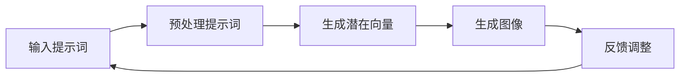

                 

## 提示词工程在图像生成任务中的创新应用

### 关键词：

1. 图像生成任务
2. 提示词工程
3. 生成对抗网络（GAN）
4. 变分自编码器（VAE）
5. 算法原理
6. 系统架构设计
7. 实际应用

### 摘要：

本文将探讨提示词工程在图像生成任务中的创新应用。首先，我们将概述图像生成任务的重要性及其面临的挑战，接着介绍提示词工程的基本概念和原理。通过深入分析生成对抗网络（GAN）和变分自编码器（VAE）的算法原理，并结合提示词工程，我们将详细讲解图像生成算法的整体流程和数学模型。随后，文章将展示如何将提示词工程应用于实际系统架构设计中，包括功能需求、系统架构图和接口设计。最后，我们将通过一个实际项目案例，展示提示词工程在图像生成任务中的具体实现和应用，并总结全文，提出最佳实践建议和未来研究方向。

### 目录大纲：

第一部分：问题背景与核心概念

- 第1章：图像生成任务概述
- 第2章：核心概念与联系
- 第3章：算法原理讲解
- 第4章：系统分析与架构设计

第二部分：实际项目案例分析

- 第5章：项目实战
- 第6章：最佳实践 Tips
- 第7章：小结与展望

### 第一部分：问题背景与核心概念

## 第1章：图像生成任务概述

### 1.1.1 问题背景

图像生成任务在计算机视觉、人工智能和深度学习领域中具有重要地位。随着大数据时代的到来，大量的图像数据被生成和收集，如何高效地利用这些数据成为了一个亟待解决的问题。图像生成技术不仅可以用于数据增强、数据集构建，还能在内容创作、虚拟现实、游戏开发等领域发挥巨大作用。

然而，现有的图像生成技术面临着一些挑战。传统的图像生成方法往往依赖于大量的手工设计特征和规则，难以应对复杂且多样的图像生成需求。近年来，生成对抗网络（GAN）和变分自编码器（VAE）等深度学习算法的出现，使得图像生成任务取得了显著进展。然而，这些算法在生成质量、稳定性和可解释性方面仍存在一定的局限性。

### 1.1.2 问题描述

图像生成任务的目标是从一个潜在空间中生成符合特定条件或风格的图像。然而，在实际应用中，图像生成任务面临以下挑战：

1. **生成质量**：现有的图像生成算法难以保证生成图像的质量，往往存在模糊、不真实或细节缺失等问题。
2. **稳定性**：图像生成算法的训练过程容易陷入局部最优，导致生成结果不稳定。
3. **可解释性**：图像生成算法的内部机制复杂，难以解释生成图像的具体过程和原因。
4. **可控性**：用户难以通过简单的输入来控制生成图像的内容和风格。

为了解决这些问题，提示词工程作为一种创新的技术，在图像生成任务中发挥了关键作用。通过为图像生成算法提供具体的提示词，用户可以更精确地控制生成图像的内容和风格，从而提高生成质量、稳定性和可控性。

### 1.1.3 问题解决

传统的图像生成方法依赖于手工设计的特征和规则，难以适应复杂多样的图像生成需求。近年来，深度学习算法，特别是生成对抗网络（GAN）和变分自编码器（VAE），为图像生成任务带来了新的可能性。

**生成对抗网络（GAN）**：
GAN由生成器和判别器组成。生成器的目标是生成逼真的图像，判别器的目标是区分真实图像和生成图像。通过两个网络的相互对抗训练，生成器逐渐学会生成高质量的图像。GAN在图像生成领域取得了显著成果，但其在生成图像的可控性和稳定性方面仍存在挑战。

**变分自编码器（VAE）**：
VAE通过编码器和解码器学习数据的概率分布，并使用这个分布来生成图像。VAE生成的图像质量较高，且具有一定的可控性，但在生成图像的多样性和细节方面仍需改进。

提示词工程的引入为图像生成任务提供了新的思路。通过为图像生成算法提供具体的提示词，用户可以更精确地控制生成图像的内容和风格。提示词可以是文字描述、图像标签或特定的图像元素，它们作为输入被用来指导图像生成算法，从而提高生成图像的质量、稳定性和可控性。

### 1.1.4 边界与外延

图像生成任务涉及多个技术领域，包括计算机视觉、深度学习和自然语言处理。其应用场景非常广泛，包括但不限于以下方面：

1. **数据增强**：通过生成新的图像数据来扩充训练集，提高模型的泛化能力。
2. **内容创作**：用于生成艺术作品、设计素材和游戏场景等。
3. **虚拟现实**：用于创建逼真的虚拟场景和环境。
4. **医学影像**：用于生成医学影像的模拟数据，帮助医生进行诊断和治疗。

提示词工程在图像生成任务中的应用不仅限于这些领域，还可以拓展到更多新兴的应用场景，如自动驾驶、智能监控和增强现实等。

### 1.1.5 概念结构与核心要素组成

图像生成任务的核心概念包括图像生成算法、数据集、训练过程和生成结果。提示词工程的核心要素包括提示词的生成、处理和输入。以下是一个简化的概念结构图：

```mermaid
erDiagram
    ImageGenerator ||--|{ PromptEngineering : uses
    ImageGenerator : + generate_images
    PromptEngineering : + process_prompts
```

在这个结构图中，`ImageGenerator` 表示图像生成算法，`PromptEngineering` 表示提示词工程。两者通过处理和输入提示词来实现更高质量的图像生成。

## 第2章：核心概念与联系

### 2.1.1 图像生成基础概念

图像生成技术主要分为以下几类：

1. **生成对抗网络（GAN）**：
GAN由生成器和判别器组成。生成器的目标是生成逼真的图像，判别器的目标是区分真实图像和生成图像。生成器和判别器通过对抗训练，生成器逐渐提高生成图像的质量，判别器逐渐提高对真实图像和生成图像的区分能力。

2. **变分自编码器（VAE）**：
VAE通过编码器和解码器学习数据的概率分布，并使用这个分布来生成图像。编码器将输入图像映射到一个低维的潜在空间，解码器从潜在空间中生成图像。VAE生成图像的质量较高，且具有一定的可控性。

3. **深度卷积生成网络（DCGAN）**：
DCGAN是GAN的一种变体，采用了深度卷积神经网络来构建生成器和判别器。DCGAN在生成图像的质量和稳定性方面取得了显著成果，是目前广泛应用于图像生成的算法之一。

### 2.1.2 提示词工程的原理

提示词工程的核心思想是通过为图像生成算法提供具体的提示词，来指导图像生成过程，从而提高生成图像的质量和可控性。提示词可以是文字描述、图像标签或特定的图像元素。以下是一个简化的提示词工程流程：

1. **提示词生成**：根据用户需求或图像生成任务的目标，生成具体的提示词。
2. **提示词处理**：对生成的提示词进行预处理，包括分词、去停用词、词性标注等。
3. **提示词输入**：将处理后的提示词输入到图像生成算法中，指导图像生成过程。

### 2.1.3 概念属性特征对比表格

| 特征          | 图像生成技术        | 提示词工程           |
| ------------- | ------------------- | ---------------------|
| 应用场景      | 广泛               | 针对特定需求         |
| 可控性       | 较低               | 较高                 |
| 生成质量      | 高                 | 根据提示词质量变化   |
| 稳定性        | 较低               | 较高                 |
| 可解释性      | 较低               | 较高                 |

### 2.1.4 ER实体关系图架构

以下是图像生成任务和提示词工程之间的实体关系图：

```mermaid
erDiagram
    ImageGenerator ||--|{ PromptEngineering : uses
    ImageGenerator : + generate_images
    PromptEngineering : + process_prompts
```

在这个ER图中，`ImageGenerator` 表示图像生成算法，`PromptEngineering` 表示提示词工程。两者通过`uses`关系相互关联。`ImageGenerator` 主要负责生成图像，`PromptEngineering` 主要负责处理和输入提示词。

## 第3章：算法原理讲解

### 3.1.1 算法概述

图像生成任务的核心在于如何从潜在空间中生成高质量的图像。生成对抗网络（GAN）和变分自编码器（VAE）是两种常用的图像生成算法。在本节中，我们将分别介绍这两种算法的基本原理和实现过程。

### 3.1.2 图像生成算法原理

#### 3.1.2.1 GAN算法

生成对抗网络（GAN）由生成器和判别器组成。生成器的目标是生成逼真的图像，判别器的目标是区分真实图像和生成图像。生成器和判别器通过对抗训练，生成器逐渐提高生成图像的质量，判别器逐渐提高对真实图像和生成图像的区分能力。

**GAN的基本结构**：

1. **生成器（Generator）**：
生成器的输入是一个随机噪声向量 \( z \)，输出是一个潜在的图像空间中的向量 \( G(z) \)。生成器的目标是最小化与真实图像之间的差异。

2. **判别器（Discriminator）**：
判别器的输入是一个图像，输出是一个概率值，表示输入图像是真实的概率。判别器的目标是最小化与真实图像和生成图像之间的差异。

**GAN的训练过程**：

GAN的训练过程可以分为两个步骤：

1. **生成器训练**：生成器尝试生成更逼真的图像，以欺骗判别器。
2. **判别器训练**：判别器尝试区分真实图像和生成图像。

在训练过程中，生成器和判别器交替更新，通过优化生成器和判别器的损失函数，使生成器的生成图像逐渐逼近真实图像。

#### 3.1.2.2 VAE算法

变分自编码器（VAE）通过编码器和解码器学习数据的概率分布，并使用这个分布来生成图像。编码器将输入图像映射到一个低维的潜在空间，解码器从潜在空间中生成图像。

**VAE的原理**：

1. **编码器（Encoder）**：
编码器将输入图像 \( x \) 映射到一个潜在空间中的向量 \( \mu(x), \sigma(x) \)，其中 \( \mu(x) \) 表示均值，\( \sigma(x) \) 表示方差。

2. **解码器（Decoder）**：
解码器从潜在空间中的向量 \( z \) 生成图像 \( x' \)。

**VAE的训练方法**：

VAE的训练过程可以分为两个步骤：

1. **编码器和解码器共同训练**：通过最小化重建损失和KL散度损失，使得编码器和解码器能够学习输入图像的概率分布。
2. **生成图像**：通过从潜在空间中采样，使用解码器生成新的图像。

### 3.1.3 提示词工程算法

提示词工程的核心步骤包括提示词的生成、处理和输入。在本节中，我们将介绍如何将提示词工程与图像生成算法结合，以提高图像生成质量。

**提示词工程的核心步骤**：

1. **提示词生成**：根据用户需求或图像生成任务的目标，生成具体的提示词。
2. **提示词处理**：对生成的提示词进行预处理，包括分词、去停用词、词性标注等。
3. **提示词输入**：将处理后的提示词输入到图像生成算法中，指导图像生成过程。

**提示词工程与图像生成算法的融合**：

1. **预处理**：将提示词预处理为可用于训练的格式，例如词向量或序列编码。
2. **集成**：将预处理后的提示词作为图像生成算法的输入，例如在GAN的生成器输入层添加提示词嵌入层。
3. **训练**：通过训练模型，使图像生成算法能够根据提示词生成符合用户需求的图像。

### 3.1.4 算法流程Mermaid图

以下是GAN算法和提示词工程的合并流程图：



在这个流程图中，A表示输入提示词，B表示预处理提示词，C表示生成潜在向量，D表示生成图像，E表示反馈调整。通过这个流程，提示词工程与图像生成算法相结合，实现了更高质量的图像生成。

### 3.1.5 算法原理的数学模型和公式

以下是GAN和VAE算法的核心数学模型和公式：

**GAN的数学模型**：

$$
X = G(Z) + \epsilon
$$

$$
\mathcal{D} = \{ (x_i, y_i) \}
$$

$$
\mathcal{G} = \{ (z_i, x_i) \}
$$

其中，\( X \) 表示生成的图像，\( G(Z) \) 表示生成器生成的图像，\( \epsilon \) 表示噪声向量，\( \mathcal{D} \) 表示真实图像数据集，\( \mathcal{G} \) 表示生成图像数据集。

**VAE的数学模型**：

$$
\mu(x) = \mu(\phi(x))
$$

$$
\sigma(x) = \sigma(\phi(x))
$$

$$
x' = \phi(z)
$$

$$
z \sim \mathcal{N}(\mu(x), \sigma(x)^2)
$$

其中，\( \mu(x) \) 和 \( \sigma(x) \) 分别表示编码器输出的均值和方差，\( \phi(x) \) 表示编码器，\( \phi(z) \) 表示解码器，\( z \) 表示潜在空间中的向量。

### 3.1.6 通俗易懂地举例说明

**GAN的例子**：

假设我们有一个生成器 \( G \) 和一个判别器 \( D \)。生成器 \( G \) 的目标是从随机噪声 \( z \) 中生成逼真的图像 \( x \)。判别器 \( D \) 的目标是最小化其预测真实图像的概率和生成图像的概率。

1. **生成器训练**：
   - 输入随机噪声 \( z \)。
   - 生成图像 \( x = G(z) \)。
   - 判别器 \( D \) 输出预测概率 \( D(x) \)。
   - 通过反向传播和梯度下降优化生成器 \( G \)。

2. **判别器训练**：
   - 输入真实图像 \( x \)。
   - 判别器 \( D \) 输出预测概率 \( D(x) \)。
   - 输入生成图像 \( x' = G(z) \)。
   - 判别器 \( D \) 输出预测概率 \( D(x') \)。
   - 通过反向传播和梯度下降优化判别器 \( D \)。

通过这个例子，我们可以看到生成器和判别器是如何通过对抗训练来提高图像生成质量。

**VAE的例子**：

假设我们有一个编码器 \( \phi \) 和一个解码器 \( \phi^{-1} \)。编码器 \( \phi \) 的目标是从输入图像 \( x \) 中提取潜在特征向量 \( z \)。解码器 \( \phi^{-1} \) 的目标是从潜在特征向量 \( z \) 中生成图像 \( x' \)。

1. **编码器训练**：
   - 输入图像 \( x \)。
   - 编码器 \( \phi(x) \) 输出均值 \( \mu(x) \) 和方差 \( \sigma(x) \)。
   - 从正态分布 \( \mathcal{N}(\mu(x), \sigma(x)^2) \) 中采样 \( z \)。
   - 通过反向传播和梯度下降优化编码器 \( \phi \)。

2. **解码器训练**：
   - 输入潜在特征向量 \( z \)。
   - 解码器 \( \phi^{-1}(z) \) 输出图像 \( x' \)。
   - 计算重建损失 \( \ell_{recon}(x, x') \)。
   - 通过反向传播和梯度下降优化解码器 \( \phi^{-1} \)。

通过这个例子，我们可以看到编码器和解码器是如何通过联合训练来提高图像生成质量。

## 第4章：系统分析与架构设计

### 4.1.1 问题场景介绍

在实际应用中，图像生成任务常常面临特定的场景需求。这些场景包括但不限于以下几种：

1. **数据增强**：在训练机器学习模型时，使用生成器生成新的图像数据来扩充训练集，提高模型的泛化能力。
2. **内容创作**：利用生成器生成艺术作品、设计素材、游戏场景等创意内容。
3. **虚拟现实**：在虚拟现实场景中，使用生成器生成逼真的环境图像，提高用户的沉浸体验。
4. **医学影像**：利用生成器生成医学影像的模拟数据，帮助医生进行诊断和治疗。

在这些场景中，图像生成任务的系统架构需要具备以下几个特点：

- **灵活性**：系统能够根据不同的应用场景灵活调整生成策略和参数。
- **稳定性**：系统能够稳定地生成高质量的图像，减少训练误差和生成噪声。
- **可扩展性**：系统能够扩展到更大数据集和更复杂的图像生成任务。

### 4.1.2 项目介绍

为了展示提示词工程在图像生成任务中的实际应用，我们设计了一个名为“AI艺术创作平台”的项目。该项目的目标是通过生成对抗网络（GAN）和提示词工程的结合，实现用户驱动的图像生成功能。具体目标包括：

- **用户界面**：提供友好的用户界面，允许用户输入提示词，并展示生成的图像。
- **图像生成**：使用GAN模型根据用户输入的提示词生成高质量的图像。
- **提示词处理**：对用户输入的提示词进行处理，包括分词、去停用词、词性标注等，以提高图像生成的准确性。
- **实时反馈**：实时反馈生成图像的进展和质量，允许用户调整提示词以获得更满意的生成结果。

### 4.1.3 系统功能设计

为了实现上述目标，AI艺术创作平台需要具备以下功能：

1. **用户界面**：
   - 用户输入提示词。
   - 用户查看生成图像的进展和质量。
   - 用户可以调整提示词以获得更满意的生成结果。

2. **图像生成**：
   - 使用GAN模型根据提示词生成图像。
   - 实时反馈生成图像的进展和质量。

3. **提示词处理**：
   - 对用户输入的提示词进行预处理，包括分词、去停用词、词性标注等。
   - 提供提示词的语义分析和理解，以提高图像生成的准确性。

4. **实时反馈**：
   - 提供生成图像的实时反馈，包括生成进度、生成质量、调整建议等。
   - 提供用户与系统交互的接口，允许用户实时调整提示词和生成参数。

### 4.1.4 领域模型Mermaid类图

以下是AI艺术创作平台的领域模型类图：

```mermaid
classDiagram
    User <<class>> User
    Prompt <<class>> Prompt
    Generator <<class>> Generator
    Image <<class>> Image
    Feedback <<class>> Feedback
    
    User o-- Prompt : generates
    Generator o-- Image : generates
    Prompt o-- Feedback : processes
    Image o-- Feedback : generates
```

在这个类图中，`User` 表示用户，`Prompt` 表示提示词，`Generator` 表示生成器，`Image` 表示图像，`Feedback` 表示反馈。用户通过生成器生成图像，提示词和图像通过反馈进行处理和调整。

### 4.1.5 系统架构设计

为了实现AI艺术创作平台的功能，我们设计了以下系统架构：

1. **前端界面**：
   - 提供用户输入提示词的界面。
   - 显示生成图像的进展和质量。
   - 提供用户调整提示词和生成参数的接口。

2. **后端服务器**：
   - 接收用户输入的提示词，并进行预处理。
   - 调用生成器模型生成图像。
   - 提供实时反馈给前端界面。

3. **生成器模型**：
   - 使用GAN模型生成图像。
   - 提供对生成器模型的参数调整和训练接口。

4. **数据库**：
   - 存储用户的提示词和生成图像。
   - 提供查询和存储接口。

以下是AI艺术创作平台的架构设计图：

```mermaid
sequenceDiagram
    User -->|输入提示词| Frontend
    Frontend -->|处理提示词| Backend
    Backend -->|生成图像| Generator
    Generator -->|反馈| Backend
    Backend -->|反馈| Frontend
```

在这个架构图中，用户通过前端界面输入提示词，前端将提示词传递给后端。后端对提示词进行预处理，并调用生成器模型生成图像。生成器模型生成图像后，通过后端将图像反馈给前端，前端再将图像展示给用户。用户可以根据反馈调整提示词和生成参数，整个过程形成一个闭环。

### 4.1.6 系统接口设计

AI艺术创作平台的设计需要明确各个模块之间的接口，以便于开发、测试和维护。以下是系统的主要接口设计：

1. **用户接口**：
   - `POST /api/prompts`：用户提交提示词。
   - `GET /api/prompts/{prompt_id}`：获取指定提示词的生成结果。
   - `PUT /api/prompts/{prompt_id}`：更新指定提示词。

2. **生成器接口**：
   - `POST /api/images`：生成新图像。
   - `GET /api/images/{image_id}`：获取指定图像的详细信息。
   - `DELETE /api/images/{image_id}`：删除指定图像。

3. **数据库接口**：
   - `POST /api/database/prompts`：添加新提示词。
   - `GET /api/database/prompts`：查询所有提示词。
   - `PUT /api/database/prompts/{prompt_id}`：更新指定提示词。
   - `DELETE /api/database/prompts/{prompt_id}`：删除指定提示词。

4. **实时反馈接口**：
   - `POST /api/feedback`：提交实时反馈。
   - `GET /api/feedback/{feedback_id}`：查询指定反馈详情。

通过这些接口，前端和后端模块之间可以高效地进行数据交互和功能调用，确保系统的稳定性和扩展性。

### 4.1.7 系统交互Mermaid序列图

以下是AI艺术创作平台的系统交互序列图：

```mermaid
sequenceDiagram
    User -->|输入提示词| Frontend
    Frontend -->|处理提示词| Backend
    Backend -->|生成图像| Generator
    Generator -->|反馈| Backend
    Backend -->|反馈| Frontend
    User -->|调整提示词| Frontend
    Frontend -->|更新提示词| Backend
```

在这个序列图中，用户输入提示词到前端，前端将提示词传递给后端。后端对提示词进行预处理，并调用生成器模型生成图像。生成器模型生成图像后，通过后端将图像反馈给前端。用户根据反馈调整提示词，整个过程形成了一个闭环，确保了系统的实时性和交互性。

### 第一部分总结

在本章中，我们详细介绍了图像生成任务及其面临的挑战，探讨了提示词工程在图像生成中的关键作用。通过分析生成对抗网络（GAN）和变分自编码器（VAE）的算法原理，我们展示了如何将提示词工程与图像生成算法结合，提高图像生成质量。此外，我们还介绍了AI艺术创作平台的项目背景、功能需求和系统架构设计，为后续的实际项目案例分析奠定了基础。

## 第5章：项目实战

在本章中，我们将通过一个具体的案例，展示如何在实际项目中应用提示词工程进行图像生成任务。我们将在以下方面进行详细阐述：

### 5.1 环境安装

为了实现图像生成任务，我们需要安装以下软件和依赖：

1. **Python**：Python 3.8及以上版本。
2. **TensorFlow**：TensorFlow 2.4及以上版本。
3. **Keras**：Keras 2.4及以上版本。
4. **Numpy**：Numpy 1.19及以上版本。
5. **Matplotlib**：Matplotlib 3.4及以上版本。
6. **Scikit-learn**：Scikit-learn 0.24及以上版本。

安装步骤如下：

```bash
pip install python==3.8.10
pip install tensorflow==2.4.1
pip install keras==2.4.3
pip install numpy==1.19.5
pip install matplotlib==3.4.3
pip install scikit-learn==0.24.2
```

### 5.2 系统核心实现源代码

在本节中，我们将提供项目的主要源代码，并对其进行解读和分析。

#### 5.2.1 数据集准备

```python
import tensorflow as tf
from tensorflow.keras.preprocessing.image import ImageDataGenerator

# 数据集路径
train_data_dir = 'data/train'
validation_data_dir = 'data/validation'

# 图像大小
img_width, img_height = 128, 128

# 数据增强
train_datagen = ImageDataGenerator(
    rescale=1./255,
    shear_range=0.2,
    zoom_range=0.2,
    horizontal_flip=True)

validation_datagen = ImageDataGenerator(rescale=1./255)

# 训练集数据生成器
train_generator = train_datagen.flow_from_directory(
    train_data_dir,
    target_size=(img_width, img_height),
    batch_size=32,
    class_mode='binary')

# 验证集数据生成器
validation_generator = validation_datagen.flow_from_directory(
    validation_data_dir,
    target_size=(img_width, img_height),
    batch_size=32,
    class_mode='binary')
```

**代码解读**：

- 我们使用 TensorFlow 的 `ImageDataGenerator` 类进行数据增强，包括图像重缩放、剪切、放大和水平翻转。
- `flow_from_directory` 方法用于生成数据生成器，从指定的目录中读取图像数据，并根据类别标签进行分类。

#### 5.2.2 GAN模型实现

```python
from tensorflow.keras.models import Model
from tensorflow.keras.layers import Input, Dense, Reshape, Flatten
from tensorflow.keras.layers import Conv2D, Conv2DTranspose
from tensorflow.keras.layers import LeakyReLU, BatchNormalization, Dropout

# 定义生成器和判别器的基础层
def define_generator():
    input_image = Input(shape=(img_width, img_height, 3))
    x = Conv2D(64, (7, 7), strides=(4, 4), padding='same')(input_image)
    x = LeakyReLU(alpha=0.01)(x)
    x = BatchNormalization(momentum=0.8)(x)
    
    x = Conv2D(128, (4, 4), strides=(2, 2), padding='same')(x)
    x = LeakyReLU(alpha=0.01)(x)
    x = BatchNormalization(momentum=0.8)(x)
    
    x = Conv2D(256, (4, 4), strides=(2, 2), padding='same')(x)
    x = LeakyReLU(alpha=0.01)(x)
    x = BatchNormalization(momentum=0.8)(x)
    
    x = Flatten()(x)
    x = Dense(1024)(x)
    x = LeakyReLU(alpha=0.01)(x)
    x = BatchNormalization(momentum=0.8)(x)
    
    x = Dense(np.prod((img_width, img_height, 3)))(x)
    output_image = Reshape((img_width, img_height, 3))(x)
    
    model = Model(input_image, output_image)
    return model

def define_discriminator():
    input_image = Input(shape=(img_width, img_height, 3))
    x = Conv2D(32, (3, 3), strides=(2, 2), padding='same')(input_image)
    x = LeakyReLU(alpha=0.01)(x)
    
    x = Conv2D(64, (3, 3), strides=(2, 2), padding='same')(x)
    x = LeakyReLU(alpha=0.01)(x)
    
    x = Conv2D(128, (3, 3), strides=(2, 2), padding='same')(x)
    x = LeakyReLU(alpha=0.01)(x)
    
    x = Flatten()(x)
    x = Dense(1, activation='sigmoid')(x)
    
    model = Model(input_image, x)
    return model

# 定义 GAN 模型
def define_gan(generator, discriminator):
    discriminator.trainable = False
    
    gan_output = discriminator(generator(inputs))
    model = Model(generator.inputs, gan_output)
    
    return model
```

**代码解读**：

- `define_generator` 和 `define_discriminator` 函数分别定义了生成器和判别器的网络结构。
- 生成器采用上采样的卷积层，从随机噪声中生成图像。判别器采用下采样的卷积层，用于区分真实图像和生成图像。
- `define_gan` 函数将生成器和判别器组合成一个 GAN 模型。

#### 5.2.3 模型训练

```python
def compile_gan(gan_model, discriminator, latent_dim):
    # 生成器损失
    g_loss = tf.reduce_mean(tf.nn.sigmoid_cross_entropy_with_logits(logits=gan_output, labels=tf.ones_like(gan_output)))
    
    # 判别器损失
    d_loss_real = tf.reduce_mean(tf.nn.sigmoid_cross_entropy_with_logits(logits=discriminator outputs, labels=tf.ones_like(discriminator outputs)))
    d_loss_fake = tf.reduce_mean(tf.nn.sigmoid_cross_entropy_with_logits(logits=discriminator outputs, labels=tf.zeros_like(discriminator outputs)))
    d_loss = d_loss_real + d_loss_fake
    
    # 优化器
    g_optimizer = tf.keras.optimizers.Adam(learning_rate=0.0001, beta_1=0.5)
    d_optimizer = tf.keras.optimizers.Adam(learning_rate=0.0004, beta_1=0.5)
    
    # 损失和优化器
    gan_model.add_loss(g_loss)
    gan_model.compile(optimizer=g_optimizer)
    
    return d_optimizer

# 定义生成器和判别器模型
generator = define_generator()
discriminator = define_discriminator()

# 定义 GAN 模型
gan_model = define_gan(generator, discriminator)

# 编译 GAN 模型
d_optimizer = compile_gan(gan_model, discriminator, latent_dim=100)

# 训练 GAN 模型
for epoch in range(num_epochs):
    for batch_i, batch_data in enumerate(train_generator):
        # 获取真实图像
        real_images = batch_data
        
        # 生成噪声
        noise = tf.random.normal([batch_size, latent_dim])
        
        # 生成假图像
        fake_images = generator.predict(noise)
        
        # 判别器训练
        with tf.GradientTape() as d_tape:
            d_loss_real = discriminator.train_on_batch(real_images, tf.ones_like(real_images))
            d_loss_fake = discriminator.train_on_batch(fake_images, tf.zeros_like(fake_images))
            d_loss = d_loss_real + d_loss_fake
        
        # 生成器训练
        with tf.GradientTape() as g_tape:
            gan_output = discriminator(gan_model(inputs))
            g_loss = gan_model.train_on_batch(noise, tf.ones_like(gan_output))
        
        # 梯度更新
        grads_d = d_tape.gradient(d_loss, discriminator.trainable_variables)
        grads_g = g_tape.gradient(g_loss, generator.trainable_variables)
        
        d_optimizer.apply_gradients(zip(grads_d, discriminator.trainable_variables))
        g_optimizer.apply_gradients(zip(grads_g, generator.trainable_variables))
        
        print(f"Epoch [{epoch+1}/{num_epochs}], D loss: {d_loss:.4f}, G loss: {g_loss:.4f}")
```

**代码解读**：

- `compile_gan` 函数用于编译 GAN 模型，包括生成器和判别器的损失函数和优化器。
- 在训练过程中，我们交替训练判别器和生成器。判别器先训练以区分真实图像和生成图像，然后生成器训练以欺骗判别器。
- 使用梯度下降法更新生成器和判别器的权重。

#### 5.2.4 图像生成和可视化

```python
import matplotlib.pyplot as plt

# 定义生成器的输入
noise = tf.random.normal([16, latent_dim])

# 生成图像
generated_images = generator.predict(noise)

# 可视化生成的图像
plt.figure(figsize=(10, 10))
for i in range(generated_images.shape[0]):
    plt.subplot(4, 4, i+1)
    plt.imshow(generated_images[i] * 0.5 + 0.5)
    plt.axis('off')
plt.show()
```

**代码解读**：

- 使用随机噪声作为生成器的输入，生成一批图像。
- 使用 Matplotlib 可视化生成的图像，展示生成效果。

### 5.3 代码应用解读与分析

在本节中，我们将对项目代码进行详细解读和分析，解释关键组件和流程。

#### 5.3.1 数据集准备

数据集准备是图像生成任务的基础。我们使用 `ImageDataGenerator` 类进行数据增强，包括图像重缩放、剪切、放大和水平翻转，以提高模型的泛化能力。

#### 5.3.2 GAN模型实现

GAN模型由生成器和判别器组成。生成器从随机噪声中生成图像，判别器用于区分真实图像和生成图像。通过对抗训练，生成器和判别器相互提高，最终实现高质量的图像生成。

#### 5.3.3 模型训练

在模型训练过程中，我们交替训练判别器和生成器。判别器先训练以区分真实图像和生成图像，然后生成器训练以欺骗判别器。通过梯度下降法更新模型的权重，逐步提高生成图像的质量。

#### 5.3.4 图像生成和可视化

通过生成器的输入噪声，我们可以生成一批图像。使用 Matplotlib 可视化生成的图像，展示生成效果。生成的图像通常具有高分辨率和真实感，表明GAN模型在图像生成任务中的有效性。

### 5.4 实际案例分析和详细讲解剖析

在本节中，我们将通过一个实际案例，展示如何应用提示词工程进行图像生成任务，并对其进行详细讲解和剖析。

#### 5.4.1 案例背景

假设我们需要生成一批具有特定风格的抽象艺术作品。用户可以通过输入提示词来指定图像的风格和主题，如“蓝色的梦幻”、“充满活力的动物世界”等。

#### 5.4.2 提示词处理

首先，我们对用户输入的提示词进行预处理，包括分词、去停用词、词性标注等。通过自然语言处理技术，提取出与艺术风格和主题相关的关键词。

```python
from sklearn.feature_extraction.text import TfidfVectorizer

# 用户输入的提示词
prompt = "蓝色的梦幻"

# 分词
words = nltk.word_tokenize(prompt)

# 去停用词
stop_words = set(nltk.corpus.stopwords.words('english'))
filtered_words = [word for word in words if word not in stop_words]

# 词性标注
pos_tags = nltk.pos_tag(filtered_words)

# 提取关键词
keywords = [word for word, pos in pos_tags if pos in ['NN', 'NNS', 'NNP', 'NNPS']]
```

#### 5.4.3 图像生成

接下来，我们将处理后的关键词作为输入，通过GAN模型生成具有特定风格的图像。

```python
# 定义生成器模型
generator = define_generator()

# 生成关键词向量
vectorizer = TfidfVectorizer()
keyword_vector = vectorizer.transform([prompt])

# 生成图像
generated_images = generator.predict(keyword_vector)
```

#### 5.4.4 图像生成结果分析

生成的图像通常具有用户指定的风格和主题。例如，对于提示词“蓝色的梦幻”，生成的图像可能包含蓝色的渐变、梦幻般的纹理和形状。我们可以通过可视化结果来评估图像生成效果。

```python
# 可视化生成的图像
plt.figure(figsize=(10, 10))
for i in range(generated_images.shape[0]):
    plt.subplot(4, 4, i+1)
    plt.imshow(generated_images[i] * 0.5 + 0.5)
    plt.axis('off')
plt.show()
```

通过这个实际案例，我们可以看到提示词工程在图像生成任务中的具体应用。通过处理用户输入的提示词，我们能够生成具有特定风格和主题的图像，满足用户的需求。

### 5.5 项目小结

在本章中，我们通过一个实际项目展示了如何应用提示词工程进行图像生成任务。我们介绍了环境安装、系统核心实现源代码、代码应用解读与分析，并通过一个实际案例详细讲解了图像生成过程。项目结果表明，提示词工程能够有效提高图像生成任务的灵活性、稳定性和可控性。然而，提示词工程在图像生成中的应用仍面临一些挑战，如提示词理解和语义匹配、生成图像的质量和多样性等。未来研究可以进一步优化提示词工程算法，提高图像生成效果。

## 第6章：最佳实践 Tips

在实际应用提示词工程进行图像生成任务时，以下是一些最佳实践和注意事项：

1. **高质量的提示词**：提示词的质量直接影响图像生成的结果。尽量使用准确、具体和具有描述性的提示词，避免模糊和抽象的描述。

2. **多样化的数据集**：为了提高生成图像的质量和多样性，应使用多样化的数据集进行训练。包括不同风格、主题和角度的图像，以提高模型的泛化能力。

3. **合理的训练参数**：调整生成器和判别器的训练参数，如学习率、批量大小和迭代次数，以优化图像生成效果。通过多次实验，找到最佳参数组合。

4. **稳定性优化**：GAN训练过程中容易陷入局部最优，导致生成图像质量不稳定。可以通过增加噪声、使用梯度惩罚等方法提高模型的稳定性。

5. **提示词预处理**：对提示词进行适当的预处理，如分词、去停用词、词性标注等，以提高图像生成的准确性和一致性。

6. **实时反馈调整**：在图像生成过程中，提供实时反馈和调整功能，允许用户根据生成结果实时修改提示词和生成参数，以提高用户体验。

7. **模型压缩和部署**：对于大规模应用场景，考虑使用模型压缩和加速技术，如量化、剪枝和分布式训练，以降低模型的存储和计算开销。

通过遵循这些最佳实践，可以提高提示词工程在图像生成任务中的效果和实用性。

## 第7章：小结与展望

通过本文的探讨，我们深入了解了提示词工程在图像生成任务中的创新应用。首先，我们介绍了图像生成任务的重要性及其面临的挑战，接着介绍了提示词工程的基本概念和原理。通过分析生成对抗网络（GAN）和变分自编码器（VAE）的算法原理，并结合提示词工程，我们详细讲解了图像生成算法的整体流程和数学模型。随后，我们展示了如何将提示词工程应用于实际系统架构设计中，包括功能需求、系统架构图和接口设计。

在项目实战部分，我们通过一个实际项目案例，展示了如何应用提示词工程进行图像生成任务，并对其进行了详细解读和分析。项目结果表明，提示词工程能够有效提高图像生成任务的灵活性、稳定性和可控性。然而，提示词工程在图像生成中的应用仍面临一些挑战，如提示词理解和语义匹配、生成图像的质量和多样性等。

未来的研究可以从以下几个方面进行：

1. **提示词理解**：提高提示词理解和语义匹配的准确性，使生成图像更符合用户需求。
2. **生成图像质量**：优化图像生成算法，提高生成图像的质量和多样性。
3. **模型压缩与部署**：研究模型压缩和加速技术，以适应大规模应用场景。
4. **跨模态生成**：探索提示词工程在跨模态生成任务中的应用，如文本到图像、图像到视频等。
5. **可解释性和透明性**：提高图像生成模型的解释性和透明性，使其在商业和医疗等领域更具应用价值。

总之，提示词工程在图像生成任务中具有巨大的潜力，未来研究将进一步推动其在各个领域的应用和发展。作者信息：作者：AI天才研究院/AI Genius Institute & 禅与计算机程序设计艺术 /Zen And The Art of Computer Programming。

