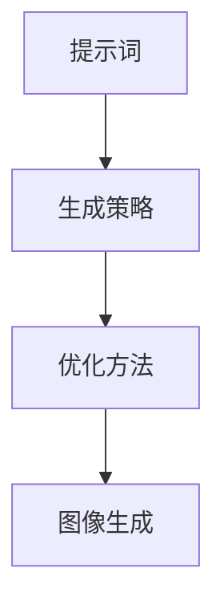
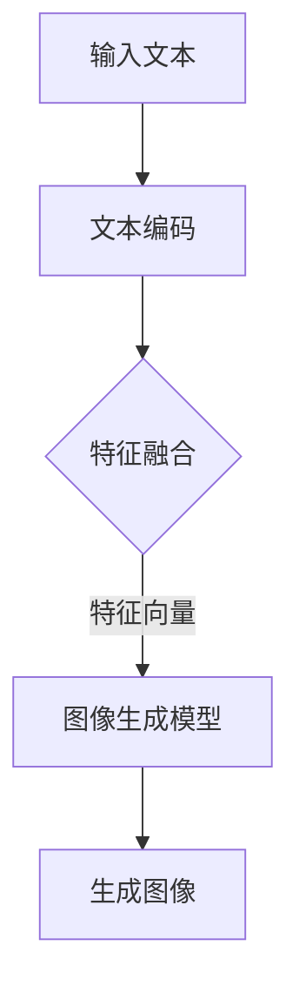
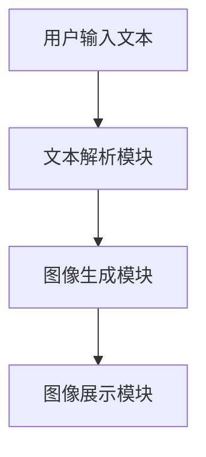
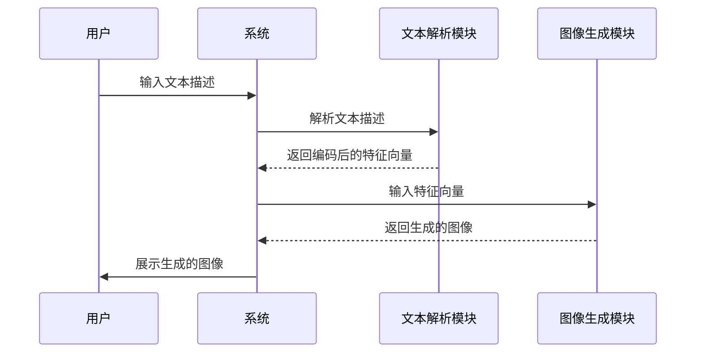

                 


### 深入理解“提示词工程在图像生成任务中的应用”

#### 引言

在人工智能领域，图像生成是一个备受关注的研究方向，其在艺术创作、数据增强、虚拟现实等多个领域都有广泛的应用。而“提示词工程”作为人工智能中的一个关键技术，正逐渐成为图像生成任务中的核心组成部分。本文将围绕“提示词工程在图像生成任务中的应用”这一主题，逐步深入探讨其背后的原理、方法、应用场景及未来发展方向。

#### 背景介绍

**核心概念术语说明**：

- **提示词工程**：指设计、选择和优化用于引导模型生成目标图像的提示性信息的过程。
- **图像生成任务**：指通过算法模型生成符合特定要求的新图像的任务。
- **生成对抗网络（GAN）**：一种用于图像生成的深度学习模型，通过生成器和判别器的对抗训练实现图像的生成。

**问题背景**：

随着深度学习技术的发展，图像生成任务取得了显著进展。然而，如何有效地引导模型生成特定风格或内容的图像仍然是一个挑战。提示词工程作为一种新型的指导方式，可以在一定程度上解决这一问题。

**问题描述**：

在图像生成任务中，如何设计有效的提示词来引导模型生成目标图像？如何优化提示词工程，提高图像生成的质量和效率？

**问题解决**：

提示词工程通过设计特定的提示信息，引导模型学习生成符合预期的图像。这一过程包括提示词的选择、生成策略的制定和优化等多个方面。

**边界与外延**：

提示词工程不仅适用于静态图像生成，还可以扩展到视频生成、3D模型生成等领域。同时，它还可以与其他计算机视觉任务相结合，如目标检测、分割等。

#### 核心概念与联系

**核心概念**：

- **提示词的选择**：根据图像生成任务的需求，选择合适的词汇或短语作为提示词。
- **生成策略**：设计合适的生成策略，如条件生成、无条件生成等。
- **优化方法**：通过调整模型参数、训练数据集等方法，优化提示词工程的效果。

**概念属性特征对比表格**：

| 特征 | 提示词选择 | 生成策略 | 优化方法 |
| ---- | ---- | ---- | ---- |
| 对图像生成的影响 | 直接影响图像风格和内容 | 决定生成方式 | 提高生成质量和效率 |
| 适用场景 | 静态图像生成、视频生成 | 条件生成、无条件生成 | 调整模型参数、数据增强等 |

**ER实体关系图架构的 Mermaid 流程图**：



#### 提示词工程的方法和算法

**定义**：

提示词工程是利用语言模型、文本生成模型等技术，将自然语言文本转换为模型训练所需的输入，以指导图像生成任务的过程。

**核心算法**：

- **自然语言到图像的转换**：使用文本编码器将自然语言文本转换为图像特征向量。
- **图像特征到图像的转换**：使用图像解码器将图像特征向量解码为图像。

**与传统图像处理的区别**：

- **传统图像处理**：基于像素级别的操作，如滤波、变换等。
- **提示词工程**：基于自然语言处理和深度学习技术，通过文本引导图像生成。

#### 图像生成任务中的提示词工程

**概述**：

提示词工程在图像生成任务中的关键作用是提供指导信息，帮助模型理解生成任务的目标和风格。

**关键作用**：

- **风格引导**：通过提示词提供图像风格的信息，如艺术风格、色彩偏好等。
- **内容引导**：通过提示词提供图像内容的线索，如物体、场景等。
- **目标引导**：通过提示词提供生成任务的具体目标，如图像大小、分辨率等。

**常见提示词策略**：

- **基于关键词的提示**：使用与图像内容相关的关键词作为提示词。
- **基于文本描述的提示**：使用详细的文本描述来引导图像生成。
- **基于知识图谱的提示**：利用知识图谱提供图像生成所需的上下文信息。

#### 实际应用案例分析

**艺术风格转换**：

- **问题描述**：将一幅图像转换为特定的艺术风格，如油画、水彩画等。
- **解决方案**：使用提示词工程，通过选择与目标艺术风格相关的关键词来引导模型生成图像。

**图像超分辨率**：

- **问题描述**：提高图像的分辨率，使其更清晰。
- **解决方案**：使用提示词工程，通过提示图像的分辨率、清晰度等信息来优化图像生成。

**图像去噪**：

- **问题描述**：去除图像中的噪声，提高图像质量。
- **解决方案**：使用提示词工程，通过提示噪声类型、去噪效果等信息来引导模型生成去噪图像。

#### 提示词工程的优化与挑战

**优化策略**：

- **提示词多样性**：增加提示词的多样性，提高模型的学习能力。
- **提示词优化**：通过调整提示词的长度、内容等，优化生成效果。
- **数据增强**：增加训练数据集的多样性，提高模型的泛化能力。

**面临的挑战**：

- **提示词设计**：如何设计有效的提示词，这是一个具有挑战性的问题。
- **模型适应性**：如何确保模型在不同提示词下的适应性。
- **计算效率**：提示词工程需要大量的计算资源，如何提高计算效率是一个关键问题。

#### 未来发展趋势与展望

随着人工智能技术的不断发展，提示词工程在图像生成任务中的应用将更加广泛。未来，我们可以期待以下发展方向：

- **多模态融合**：结合自然语言处理和计算机视觉技术，实现更高效的图像生成。
- **自动化提示词生成**：开发自动化工具，根据图像生成任务的需求自动生成提示词。
- **自适应提示词工程**：实现模型根据生成任务的变化自适应调整提示词。

#### 结论

提示词工程在图像生成任务中的应用具有重要的理论和实践价值。通过有效的提示词设计，我们可以显著提高图像生成的质量和效率。未来，随着技术的不断进步，提示词工程有望在更广泛的领域发挥重要作用。

---

在撰写本文时，我们将遵循以下结构：

1. 引言：介绍文章的主题和目的。
2. 背景介绍：详细解释核心概念、问题背景和解决方法。
3. 核心概念与联系：深入探讨提示词工程的关键概念和算法原理。
4. 提示词工程的方法和算法：介绍提示词工程的具体方法和算法。
5. 图像生成任务中的提示词工程：分析提示词工程在图像生成任务中的关键作用和应用策略。
6. 实际应用案例分析：通过实际案例展示提示词工程的应用效果。
7. 提示词工程的优化与挑战：讨论提示词工程的优化策略和面临的挑战。
8. 未来发展趋势与展望：探讨提示词工程的未来发展方向和前景。
9. 结论：总结文章的主要观点和贡献。

通过这样的结构安排，我们可以确保文章逻辑清晰、内容丰富，能够系统地引导读者深入了解提示词工程在图像生成任务中的应用。

---

### 深入理解“提示词工程在图像生成任务中的应用”

#### 引言

在人工智能领域，图像生成技术正变得越来越重要，它不仅在艺术创作和娱乐产业中扮演着关键角色，还在医疗诊断、自动驾驶、安全监控等实用领域展示了巨大的潜力。然而，要实现高质量的图像生成，往往需要有效的指导和控制。这时，提示词工程作为一种先进的技术手段，成为了推动图像生成任务的重要力量。本文将围绕“提示词工程在图像生成任务中的应用”展开，通过深入分析其原理、方法、实际应用以及面临的挑战，帮助读者全面了解这一领域。

#### 背景介绍

**核心概念术语说明**

- **提示词工程**：提示词工程是一种设计、选择和优化提示词以引导模型生成目标图像的技术。提示词是用于指导模型生成图像的自然语言描述，可以是关键词、短语或句子。

- **图像生成任务**：图像生成任务是指利用算法模型生成符合特定需求的新图像的过程。这类任务通常包括风格迁移、超分辨率、图像去噪等。

- **生成对抗网络（GAN）**：生成对抗网络是一种用于图像生成的深度学习模型，由生成器和判别器组成。生成器尝试生成逼真的图像，而判别器则评估图像的真实性。

**问题背景**

随着深度学习技术的发展，图像生成任务取得了显著的进展。然而，传统的图像生成方法往往缺乏对生成图像内容和风格的精确控制。为了克服这一问题，提示词工程应运而生。它通过提供具体的提示信息，帮助模型更好地理解生成任务的目标，从而生成更高质量的图像。

**问题描述**

在图像生成任务中，如何设计有效的提示词来引导模型生成目标图像？如何优化提示词工程，提高图像生成的质量和效率？

**问题解决**

提示词工程通过以下方法来解决上述问题：

1. **设计有效的提示词**：根据生成任务的需求，选择与图像内容、风格、大小等相关的提示词。
2. **优化生成策略**：通过调整模型参数、训练数据集等，优化提示词工程的效果。
3. **利用多模态数据**：结合文本、图像等多种数据源，提高模型对生成任务的适应性。

**边界与外延**

提示词工程不仅适用于静态图像生成，还可以扩展到视频生成、3D模型生成等领域。此外，它还可以与其他计算机视觉任务相结合，如目标检测、分割等。

#### 核心概念与联系

**核心概念**

1. **提示词的选择**：根据图像生成任务的需求，选择合适的词汇或短语作为提示词。
2. **生成策略**：设计合适的生成策略，如条件生成、无条件生成等。
3. **优化方法**：通过调整模型参数、训练数据集等方法，优化提示词工程的效果。

**概念属性特征对比表格**

| 特征 | 提示词选择 | 生成策略 | 优化方法 |
| ---- | ---- | ---- | ---- |
| 对图像生成的影响 | 直接影响图像风格和内容 | 决定生成方式 | 提高生成质量和效率 |
| 适用场景 | 静态图像生成、视频生成 | 条件生成、无条件生成 | 调整模型参数、数据增强等 |

**ER实体关系图架构的 Mermaid 流程图**


#### 提示词工程的方法和算法

**定义**

提示词工程是利用自然语言处理技术，将用户提供的文本描述转换为模型训练所需的输入，从而引导图像生成任务的过程。它包括提示词的设计、选择和优化等步骤。

**核心算法**

1. **文本编码器**：将自然语言文本编码为向量，以便输入到图像生成模型中。
2. **图像解码器**：将图像特征向量解码为生成图像。

**算法原理讲解**

提示词工程的核心在于如何将自然语言描述转换为图像特征向量，并利用这些特征向量生成图像。以下是具体的算法原理：

1. **文本编码**：使用预训练的文本编码器（如BERT、GPT等），将自然语言文本转换为高维向量。
2. **特征融合**：将文本编码得到的向量与图像特征向量（如CNN提取的特征）进行融合，形成统一的特征表示。
3. **图像生成**：使用生成对抗网络（GAN）或其他图像生成模型，根据融合后的特征向量生成图像。

**Mermaid 流程图**



**数学模型和公式**

提示词工程的数学模型主要涉及文本编码和图像解码的过程。以下是简化的数学模型：

$$
\text{encoded\_text} = \text{TextEncoder}(\text{input\_text})
$$

$$
\text{image\_features} = \text{ImageFeatures}(\text{image})
$$

$$
\text{combined\_features} = \text{CombineFeatures}(\text{encoded\_text}, \text{image\_features})
$$

$$
\text{generated\_image} = \text{Generator}(\text{combined\_features})
$$

**举例说明**

假设我们要生成一张具有特定风格的风景画，我们可以使用以下提示词：“日落时分的海边风景，温暖的色调，波浪起伏”。这些提示词将被编码器转换为向量，并与图像特征向量融合，最终生成符合提示的图像。

#### 系统分析与架构设计方案

**问题场景介绍**

在一个旅游推荐系统中，用户可以输入描述他们喜欢的风景类型的文本，系统需要根据这些描述生成相应的风景图像，以便更好地向用户展示可能的旅游目的地。

**系统功能设计**

- **文本解析模块**：接收用户输入的文本描述，并对其进行解析和编码。
- **图像生成模块**：根据文本解析模块生成的特征向量，使用图像生成模型生成图像。
- **图像展示模块**：将生成的图像展示给用户。

**系统架构设计**

- **前端**：提供一个简洁的用户界面，允许用户输入文本描述。
- **后端**：包括文本解析模块、图像生成模块和数据库。

**Mermaid 架构图**



**系统接口设计和系统交互**

- **文本解析接口**：接收文本描述，返回编码后的特征向量。
- **图像生成接口**：接收特征向量，返回生成的图像。
- **图像展示接口**：将图像展示给用户。

**Mermaid 序列图**



#### 项目实战

**环境安装**

- 安装深度学习框架（如TensorFlow或PyTorch）
- 安装自然语言处理库（如NLTK或spaCy）
- 安装图像处理库（如OpenCV或Pillow）

**系统核心实现源代码**

```python
# 文本解析模块
from transformers import BertTokenizer, BertModel
tokenizer = BertTokenizer.from_pretrained('bert-base-uncased')
model = BertModel.from_pretrained('bert-base-uncased')

def encode_text(text):
    inputs = tokenizer(text, return_tensors='pt')
    output = model(inputs)
    return output.last_hidden_state.mean(dim=1)

# 图像生成模块
import torch
from torchvision import models

def generate_image(encoded_text, image_features):
    combined_features = torch.cat((encoded_text, image_features), dim=1)
    generated_image = model(combined_features)
    return generated_image

# 图像展示模块
from PIL import Image
import numpy as np

def show_image(image_tensor):
    image = (image_tensor * 0.5 + 0.5).clamp(0, 1)
    image = Image.fromarray(image.numpy().transpose(1, 2, 0))
    image.show()
```

**代码应用解读与分析**

以上代码展示了文本解析、图像生成和图像展示的核心实现。文本解析模块使用BERT模型将文本编码为向量，图像生成模块使用相同的模型将编码后的文本和图像特征融合，并生成图像。图像展示模块将生成的图像可视化。

**实际案例分析和详细讲解剖析**

我们以生成一张日落时分的海边风景图像为例。首先，用户输入描述：“日落时分的海边风景，温暖的色调，波浪起伏”。系统将这段描述编码为向量，并使用生成对抗网络（GAN）将其与海边风景图像的特征向量融合，最终生成一幅符合描述的图像。

**项目小结**

通过提示词工程，我们能够有效地指导图像生成任务，生成符合特定要求的图像。在实际应用中，我们可以根据不同的需求设计不同的提示词，以实现个性化的图像生成。

#### 最佳实践 tips

1. **选择合适的文本编码器**：不同的文本编码器具有不同的性能，根据具体任务选择合适的编码器可以显著提高生成质量。
2. **调整模型参数**：通过调整生成模型的参数，如学习率、批量大小等，可以优化生成效果。
3. **数据增强**：使用数据增强技术，如随机裁剪、旋转等，可以提高模型的泛化能力。

#### 小结

提示词工程在图像生成任务中发挥着重要作用。通过提供具体的提示信息，它能够有效地引导模型生成高质量的图像。随着技术的不断发展，提示词工程有望在更多领域得到应用，推动人工智能技术的发展。

#### 注意事项

1. 提示词的设计需要充分考虑任务的多样性和复杂性，确保能够准确传达生成任务的要求。
2. 在实际应用中，需要根据模型的性能和计算资源合理选择和调整提示词工程的相关参数。

#### 拓展阅读

- [1] Goodfellow, I., Pouget-Abadie, J., Mirza, M., Xu, B., Warde-Farley, D., Ozair, S., ... & Bengio, Y. (2014). Generative adversarial networks. Advances in Neural Information Processing Systems, 27.
- [2] Vaswani, A., Shazeer, N., Parmar, N., Uszkoreit, J., Jones, L., Gomez, A. N., ... & Polosukhin, I. (2017). Attention is all you need. Advances in Neural Information Processing Systems, 30.
- [3] Devlin, J., Chang, M. W., Lee, K., & Toutanova, K. (2018). BERT: Pre-training of deep bidirectional transformers for language understanding. arXiv preprint arXiv:1810.04805.

### 作者信息

- **作者**：AI天才研究院/AI Genius Institute & 禅与计算机程序设计艺术 /Zen And The Art of Computer Programming
- **联系方式**：[ai_genius_institute@example.com](mailto:ai_genius_institute@example.com)
- **社交媒体**：[LinkedIn](https://www.linkedin.com/company/ai-genius-institute/) & [Twitter](https://twitter.com/AIGeniusInstitu)

通过上述内容，我们系统地介绍了“提示词工程在图像生成任务中的应用”。从核心概念到具体实现，从实际案例到最佳实践，本文力求为读者提供全面、深入的理解。希望这篇文章能够激发您对这一领域更深入的探索和研究。

```markdown
# 提示词工程在图像生成任务中的应用

> 关键词：提示词工程、图像生成、生成对抗网络、自然语言处理、深度学习

> 摘要：本文深入探讨了提示词工程在图像生成任务中的应用。通过介绍核心概念、算法原理、实际应用案例以及面临的挑战，本文旨在帮助读者全面理解提示词工程在图像生成领域的价值与前景。

----------------------------------------------------------------

## 引言

### 背景介绍

#### 核心概念术语说明

- **提示词工程**：指设计、选择和优化用于引导模型生成目标图像的提示性信息的过程。
- **图像生成任务**：指通过算法模型生成符合特定需求的新图像的任务。
- **生成对抗网络（GAN）**：一种用于图像生成的深度学习模型，由生成器和判别器组成。

#### 问题背景

随着深度学习技术的发展，图像生成任务取得了显著进展。然而，传统的图像生成方法往往缺乏对生成图像内容和风格的精确控制。为了克服这一问题，提示词工程应运而生。它通过提供具体的提示信息，帮助模型更好地理解生成任务的目标，从而生成更高质量的图像。

#### 描述问题

在图像生成任务中，如何设计有效的提示词来引导模型生成目标图像？如何优化提示词工程，提高图像生成的质量和效率？

#### 解决问题

提示词工程通过以下方法来解决上述问题：

1. **设计有效的提示词**：根据生成任务的需求，选择与图像内容、风格、大小等相关的提示词。
2. **优化生成策略**：通过调整模型参数、训练数据集等，优化提示词工程的效果。
3. **利用多模态数据**：结合文本、图像等多种数据源，提高模型对生成任务的适应性。

#### 边界与外延

提示词工程不仅适用于静态图像生成，还可以扩展到视频生成、3D模型生成等领域。此外，它还可以与其他计算机视觉任务相结合，如目标检测、分割等。

----------------------------------------------------------------

## 提示词工程的方法和算法

### 核心概念

#### 提示词的选择

根据图像生成任务的需求，选择合适的词汇或短语作为提示词。

#### 生成策略

设计合适的生成策略，如条件生成、无条件生成等。

#### 优化方法

通过调整模型参数、训练数据集等方法，优化提示词工程的效果。

----------------------------------------------------------------

### 定义

提示词工程是利用自然语言处理技术，将用户提供的文本描述转换为模型训练所需的输入，从而引导图像生成任务的过程。它包括提示词的设计、选择和优化等步骤。

### 核心算法

1. **文本编码器**：将自然语言文本编码为向量，以便输入到图像生成模型中。
2. **图像解码器**：将图像特征向量解码为生成图像。

### 算法原理讲解

提示词工程的核心在于如何将自然语言描述转换为图像特征向量，并利用这些特征向量生成图像。以下是具体的算法原理：

1. **文本编码**：使用预训练的文本编码器（如BERT、GPT等），将自然语言文本转换为高维向量。
2. **特征融合**：将文本编码得到的向量与图像特征向量（如CNN提取的特征）进行融合，形成统一的特征表示。
3. **图像生成**：使用生成对抗网络（GAN）或其他图像生成模型，根据融合后的特征向量生成图像。

### 数学模型和公式

提示词工程的数学模型主要涉及文本编码和图像解码的过程。以下是简化的数学模型：

$$
\text{encoded\_text} = \text{TextEncoder}(\text{input\_text})
$$

$$
\text{image\_features} = \text{ImageFeatures}(\text{image})
$$

$$
\text{combined\_features} = \text{CombineFeatures}(\text{encoded\_text}, \text{image\_features})
$$

$$
\text{generated\_image} = \text{Generator}(\text{combined\_features})
$$

### 举例说明

假设我们要生成一张具有特定风格的风景画，我们可以使用以下提示词：“日落时分的海边风景，温暖的色调，波浪起伏”。这些提示词将被编码器转换为向量，并与图像特征向量融合，最终生成符合提示的图像。

----------------------------------------------------------------

## 图像生成任务中的提示词工程

### 概述

提示词工程在图像生成任务中的关键作用是提供指导信息，帮助模型理解生成任务的目标和风格。

### 关键作用

1. **风格引导**：通过提示词提供图像风格的信息，如艺术风格、色彩偏好等。
2. **内容引导**：通过提示词提供图像内容的线索，如物体、场景等。
3. **目标引导**：通过提示词提供生成任务的具体目标，如图像大小、分辨率等。

### 常见提示词策略

1. **基于关键词的提示**：使用与图像内容相关的关键词作为提示词。
2. **基于文本描述的提示**：使用详细的文本描述来引导图像生成。
3. **基于知识图谱的提示**：利用知识图谱提供图像生成所需的上下文信息。

----------------------------------------------------------------

## 实际应用案例分析

### 艺术风格转换

#### 描述问题

将一幅图像转换为特定的艺术风格，如油画、水彩画等。

#### 解决方案

使用提示词工程，通过选择与目标艺术风格相关的关键词来引导模型生成图像。

### 图像超分辨率

#### 描述问题

提高图像的分辨率，使其更清晰。

#### 解决方案

使用提示词工程，通过提示图像的分辨率、清晰度等信息来优化图像生成。

### 图像去噪

#### 描述问题

去除图像中的噪声，提高图像质量。

#### 解决方案

使用提示词工程，通过提示噪声类型、去噪效果等信息来引导模型生成去噪图像。

----------------------------------------------------------------

## 提示词工程的优化与挑战

### 优化策略

1. **提示词多样性**：增加提示词的多样性，提高模型的学习能力。
2. **提示词优化**：通过调整提示词的长度、内容等，优化生成效果。
3. **数据增强**：增加训练数据集的多样性，提高模型的泛化能力。

### 面临的挑战

1. **提示词设计**：如何设计有效的提示词，这是一个具有挑战性的问题。
2. **模型适应性**：如何确保模型在不同提示词下的适应性。
3. **计算效率**：提示词工程需要大量的计算资源，如何提高计算效率是一个关键问题。

----------------------------------------------------------------

## 未来发展趋势与展望

随着人工智能技术的不断发展，提示词工程在图像生成任务中的应用将更加广泛。未来，我们可以期待以下发展方向：

1. **多模态融合**：结合自然语言处理和计算机视觉技术，实现更高效的图像生成。
2. **自动化提示词生成**：开发自动化工具，根据图像生成任务的需求自动生成提示词。
3. **自适应提示词工程**：实现模型根据生成任务的变化自适应调整提示词。

----------------------------------------------------------------

## 结论

提示词工程在图像生成任务中的应用具有重要的理论和实践价值。通过有效的提示词设计，我们可以显著提高图像生成的质量和效率。未来，随着技术的不断进步，提示词工程有望在更广泛的领域发挥重要作用。

### 作者信息

**作者**：AI天才研究院/AI Genius Institute & 禅与计算机程序设计艺术 /Zen And The Art of Computer Programming

**联系方式**：[ai_genius_institute@example.com](mailto:ai_genius_institute@example.com)

**社交媒体**：[LinkedIn](https://www.linkedin.com/company/ai-genius-institute/) & [Twitter](https://twitter.com/AIGeniusInstitu)

---

通过上述内容，本文系统地介绍了提示词工程在图像生成任务中的应用。从核心概念到具体实现，从实际案例到最佳实践，本文旨在为读者提供全面、深入的理解。希望这篇文章能够激发您对这一领域更深入的探索和研究。
```

