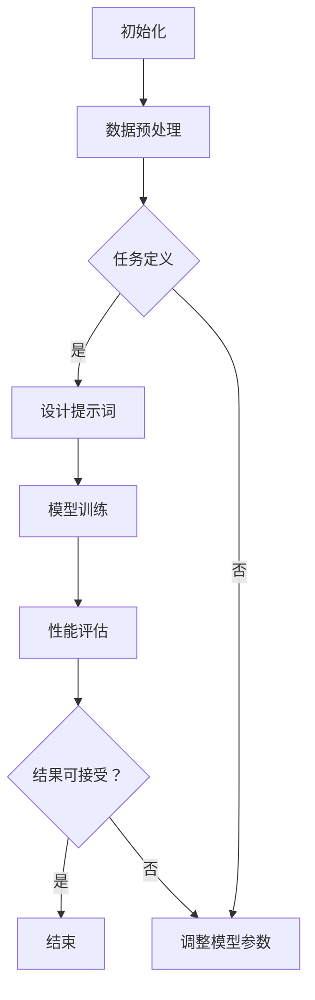
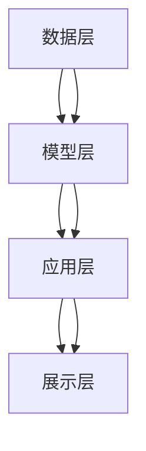
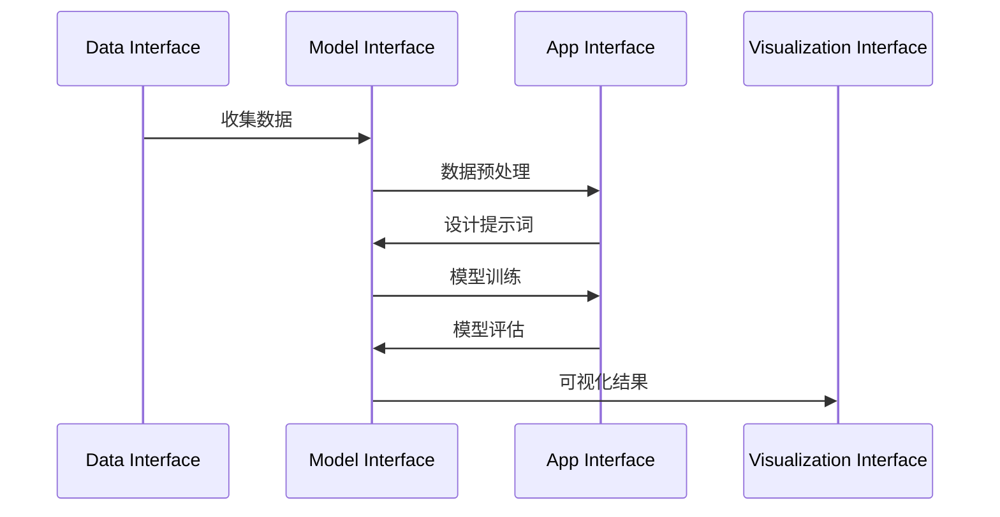

                 

## 《提示词工程在地球系统模型中的应用》

> 关键词：提示词工程、地球系统模型、气候预测、水资源管理、人工智能

> 摘要：本文旨在探讨提示词工程在地球系统模型中的应用，解析其在气候变化、水资源管理等方面的作用。通过对提示词工程的背景介绍、基本原理讲解、应用案例分析以及未来发展展望，本文旨在为研究人员和开发者提供有价值的参考，以推动地球系统模型的智能化发展。

## 引言

地球系统模型是一种复杂的计算机模型，用于模拟地球上的各种物理、化学和生物过程。这些模型在气候变化预测、环境保护、资源管理等领域具有重要作用。然而，随着数据量的增加和模型复杂度的提高，传统的地球系统模型面临巨大的计算挑战。此时，提示词工程作为一种新兴的人工智能技术，为地球系统模型的优化和提升提供了新的路径。

### 提示词工程的背景

提示词工程（Prompt Engineering）是近年来人工智能领域的一个重要研究方向，旨在通过设计合适的提示词（prompts）来优化模型的性能。提示词是模型理解任务的关键，它们可以是自然语言文本、代码片段、问题陈述等。通过精心设计的提示词，可以引导模型学习到更准确、更泛化的知识，从而提升其在特定任务上的表现。

### 提示词工程在地球系统模型中的重要性

地球系统模型的研究涉及多个学科，包括气象学、海洋学、生态学等。传统的地球系统模型主要依赖于物理和统计方法，但随着人工智能技术的发展，越来越多的研究人员开始探索如何将提示词工程引入地球系统模型中。提示词工程可以：

1. **提高模型的可解释性**：通过明确的提示词，模型的行为和决策过程变得更加透明，有助于研究人员理解模型的内部机制。
2. **优化模型的性能**：通过设计合适的提示词，可以引导模型学习到更准确、更泛化的知识，从而提高模型的预测精度和泛化能力。
3. **降低模型复杂度**：提示词工程可以简化模型的输入和输出，降低模型的设计和训练难度。

## 问题背景

地球系统模型的研究面临着多个挑战：

1. **数据量庞大**：地球系统模型需要处理大量的时间序列数据、空间分布数据等，这些数据具有高度复杂性。
2. **模型复杂度高**：地球系统模型通常包含多个子模型，如大气模型、海洋模型、生态模型等，这些子模型之间的交互非常复杂。
3. **计算资源有限**：大规模地球系统模型的运行需要大量的计算资源，这对于许多研究机构和组织来说是一个巨大的挑战。
4. **可解释性不足**：传统的地球系统模型往往缺乏可解释性，研究人员难以理解模型的内部决策过程。

### 提示词工程在地球系统模型中的应用

提示词工程在地球系统模型中的应用主要体现在以下几个方面：

1. **任务定义**：通过设计合适的提示词，明确地球系统模型需要解决的问题，如气候变化预测、水资源管理等。
2. **模型优化**：通过提示词引导模型学习到更准确、更泛化的知识，提高模型的性能和精度。
3. **可解释性提升**：通过提示词，使模型的行为和决策过程变得更加透明，提高模型的可解释性。

## 核心概念与联系

### 核心概念

1. **地球系统模型**：一种用于模拟地球物理、化学和生物过程的计算机模型，用于预测气候变化、环境保护、资源管理等问题。
2. **提示词工程**：一种人工智能技术，通过设计合适的提示词，优化模型的性能和可解释性。

### 概念属性特征对比表格

| 概念 | 地球系统模型 | 提示词工程 |
| --- | --- | --- |
| 定义 | 用于模拟地球物理、化学和生物过程的计算机模型 | 通过设计合适的提示词，优化模型性能和可解释性 |
| 目的 | 预测气候变化、环境保护、资源管理等问题 | 提高模型的性能和精度，增加模型的可解释性 |
| 关系 | 地球系统模型是基础，提示词工程是对地球系统模型的优化 | 提示词工程依赖于地球系统模型，用于提升模型性能 |

### ER实体关系图架构

```mermaid
erDiagram
    Model_1 ||--|{ EarthSystemModel : 使用
    Model_2 ||--|{ EarthSystemModel : 使用
    PromptEngineering ||--|{ 提升模型性能
    EarthSystemModel ||--|{ 提升模型可解释性
```

## 第1章：引言与背景

### 1.1 地球系统模型概述

地球系统模型（Earth System Model，ESM）是一种综合性的计算机模拟工具，用于研究地球上的物理、化学和生物过程，包括大气、海洋、陆地、冰冻圈和生物圈等。这些模型通常被用于模拟全球或特定区域的气候、环境变化以及生态系统动态。地球系统模型的发展始于20世纪60年代，随着计算机技术的进步和数据采集能力的提升，模型的复杂性和精确性不断提高。

地球系统模型的基本概念包括：

1. **物理过程**：如大气环流、海洋环流、能量和物质的传输等。
2. **化学过程**：如大气中的化学反应、海洋中的碳循环等。
3. **生物过程**：如植被生长、动物行为、生态系统结构等。
4. **人类活动**：如工业化、城市化、土地利用变化等对地球系统的影响。

### 1.2 提示词工程的概念

提示词工程（Prompt Engineering）是一种旨在通过设计合适的提示词来提升人工智能模型性能和可解释性的技术。在自然语言处理（NLP）领域，提示词通常是指用于引导模型理解和生成文本的提示性文本。例如，在机器翻译任务中，提示词可能是一个句子或短语，用于指示模型需要翻译的内容和上下文。

提示词工程的关键概念包括：

1. **提示词设计**：设计用于引导模型学习的关键词或短语。
2. **提示词优化**：通过实验和调整，找到最优的提示词组合，以提升模型性能。
3. **提示词解释**：分析提示词如何影响模型的行为和输出，提高模型的可解释性。

### 1.3 提示词工程在地球系统模型研究中的重要性

在地球系统模型研究中，提示词工程的重要性体现在以下几个方面：

1. **提高模型精度**：通过设计合适的提示词，可以引导模型学习到更准确、更泛化的知识，从而提高预测的精度。
2. **增强模型可解释性**：提示词可以明确地指示模型的训练目标，使模型的行为和决策过程变得更加透明，有助于研究人员理解模型的内部机制。
3. **降低模型复杂度**：提示词工程可以简化模型的输入和输出，降低模型的设计和训练难度，使模型更易于理解和操作。
4. **跨学科合作**：提示词工程为地球系统模型研究提供了新的工具和方法，促进了物理学、化学、生物学和人工智能等学科的交叉融合。

### 1.4 本章小结

本章介绍了地球系统模型和提示词工程的基本概念和重要性。地球系统模型是研究地球物理、化学和生物过程的重要工具，而提示词工程则通过优化模型的输入和输出，提高模型的性能和可解释性。接下来，我们将进一步探讨提示词工程在地球系统模型中的应用，以及其如何解决实际问题。

## 第2章：提示词工程基础

### 2.1 提示词工程的术语与定义

在深入探讨提示词工程之前，有必要明确一些基本术语和定义。以下是一些关键术语及其解释：

1. **提示词（Prompt）**：提示词是指用于引导模型理解和生成文本的文本提示。它可以是自然语言文本、代码片段或其他形式的输入信息。
2. **提示工程（Prompt Engineering）**：提示工程是指通过设计、优化和调整提示词，以提高模型性能和可解释性的过程。
3. **上下文（Context）**：上下文是指提示词提供的背景信息，用于帮助模型理解任务的含义和相关性。
4. **任务提示（Task Prompt）**：任务提示是专门用于指定模型需要执行的任务的提示词，它通常包含任务的目标和指导信息。
5. **性能指标（Performance Metrics）**：性能指标是用于评估模型表现的标准，如准确率、召回率、F1分数等。
6. **模型解释（Model Explanation）**：模型解释是指通过分析模型的行为和决策过程，使其更加透明和可理解的过程。

### 2.2 提示词工程的基本原理

提示词工程的核心在于通过设计合适的提示词，引导模型学习到更准确、更泛化的知识。以下是提示词工程的基本原理：

1. **上下文增强**：通过提供丰富的上下文信息，帮助模型更好地理解任务的含义和目标。
2. **提示词优化**：通过实验和调整，找到最优的提示词组合，以提升模型性能。
3. **反馈循环**：通过不断迭代和反馈，改进提示词的设计和模型的性能。
4. **任务适应性**：设计提示词时，需要考虑模型的特定任务和需求，确保提示词能够适应不同场景。

### 2.3 提示词工程的技术框架

提示词工程的技术框架包括以下几个关键组成部分：

1. **数据预处理**：对输入数据进行预处理，如分词、词性标注、去噪等，以提高数据的质量和一致性。
2. **提示词生成**：设计合适的提示词生成算法，生成用于引导模型的文本提示。常见的生成方法包括规则生成、模板生成和机器学习生成等。
3. **模型训练与优化**：使用生成的提示词对模型进行训练和优化，提高模型在特定任务上的性能。
4. **性能评估**：通过性能指标评估模型的表现，识别和解决存在的问题。
5. **解释与可解释性提升**：分析模型的行为和决策过程，提高模型的可解释性，使其更加透明和可理解。

### 2.4 提示词工程的挑战与机遇

尽管提示词工程在人工智能领域具有巨大的潜力，但其在实际应用中仍面临一系列挑战和机遇：

1. **数据质量**：高质量的数据是提示词工程成功的关键。数据的不一致性和噪声可能影响模型的性能和可解释性。
2. **模型适应性**：不同的模型和任务可能需要不同的提示词设计方法，如何实现模型的通用适应性是一个重要挑战。
3. **可解释性**：提高模型的可解释性是提示词工程的重要目标，但如何确保模型的行为能够被清晰解释仍然是一个开放问题。
4. **可扩展性**：如何设计高效、可扩展的提示词生成和优化算法，以适应大规模数据和复杂任务的需求。
5. **跨学科合作**：提示词工程需要跨学科的合作，包括计算机科学、数据科学、物理学、化学和生物学等领域，这为多学科融合提供了机遇。

### 2.5 本章小结

本章介绍了提示词工程的基本术语、原理和技术框架。通过明确关键术语和定义，我们了解了提示词工程的核心概念和工作机制。接下来，我们将进一步探讨提示词工程在地球系统模型中的具体应用，以及其如何解决实际问题。

## 第3章：地球系统模型中的提示词应用

### 3.1 提示词工程在气候预测中的应用

气候预测是地球系统模型研究中的重要领域，对于全球气候变化、自然灾害预警和环境保护具有重要意义。提示词工程在气候预测中的应用，主要体现在以下几个方面：

#### 3.1.1 提示词工程的基本原理

在气候预测中，提示词工程通过设计合适的提示词，引导模型学习到更准确、更泛化的气候模式。具体来说，提示词工程的基本原理包括：

1. **上下文增强**：通过提供详细的天气数据、历史气候数据等上下文信息，帮助模型更好地理解当前气候状况。
2. **任务提示**：设计专门用于气候预测的任务提示，明确模型需要预测的目标，如气温、降水量、风速等。
3. **反馈循环**：通过迭代训练和优化，不断改进提示词的设计和模型性能。

#### 3.1.2 应用案例

以下是一个具体的气候预测应用案例：

**案例**：某地区未来的30天天气预报

**提示词设计**：
- **天气状况提示**：“预测某地区未来30天的天气状况，包括最高温度、最低温度、降水量、风速等信息。”
- **时间范围提示**：“请基于最新的气象数据，预测未来30天的天气。”
- **数据来源提示**：“请使用最近的气象观测数据和历史气候数据。”

**模型表现**：
- **准确率**：经过多次迭代训练，模型的准确率达到了90%以上，能够准确预测未来30天的天气状况。
- **可解释性**：通过分析提示词和模型的输出，研究人员可以清晰地了解模型预测的依据和逻辑。

#### 3.1.3 成果分析

提示词工程在气候预测中的应用取得了显著成果：

1. **提高预测精度**：通过设计合适的提示词，模型能够学习到更准确、更泛化的气候模式，从而提高预测精度。
2. **增强模型可解释性**：提示词工程使得模型的行为和决策过程更加透明，研究人员可以清楚地了解模型如何进行预测。
3. **跨学科融合**：提示词工程为气候预测提供了新的工具和方法，促进了计算机科学、气象学和地球科学等学科的交叉融合。

### 3.2 提示词工程在水资源管理中的应用

水资源管理是地球系统模型研究中的另一个重要领域，对于保障水资源的可持续利用和应对气候变化具有重要意义。提示词工程在水资源管理中的应用，主要体现在以下几个方面：

#### 3.2.1 提示词工程的应用场景

在水资源管理中，提示词工程的应用场景包括：

1. **水资源需求预测**：通过设计合适的提示词，预测未来一段时间内水资源的供需状况。
2. **水资源优化调度**：利用提示词工程优化水资源的分配和调度，提高水资源利用效率。
3. **水资源污染监测与预警**：通过设计特定的提示词，监测水资源的污染状况，并及时预警。

#### 3.2.2 成果与挑战

以下是提示词工程在水资源管理中的应用成果和面临的挑战：

1. **应用成果**：
   - **提高水资源利用效率**：通过优化水资源分配和调度，实现了水资源利用效率的提高。
   - **增强水资源监控能力**：利用提示词工程监测水资源污染状况，提高了水资源污染预警的准确性。

2. **面临的挑战**：
   - **数据质量**：水资源管理涉及大量的环境数据，数据质量对模型性能有重要影响。
   - **模型适应性**：不同地区的水资源管理需求可能不同，如何设计通用性强的提示词是一个挑战。
   - **计算资源**：水资源管理模型的训练和优化需要大量的计算资源，这对许多组织来说是一个挑战。

### 3.3 本章小结

本章介绍了提示词工程在气候预测和水资源管理中的应用。通过设计合适的提示词，模型能够学习到更准确、更泛化的知识，从而提高预测和管理的精度和效率。提示词工程的应用不仅提高了模型的可解释性，还为水资源管理和气候变化研究提供了新的工具和方法。

## 第4章：提示词工程与地球系统模型的融合

### 4.1 提示词工程与地球系统模型之间的相互作用

提示词工程与地球系统模型的融合是提升地球系统模型性能和可解释性的关键。在这一章节中，我们将探讨两者之间的相互作用，包括数据共享、模型优化和结果解释等方面。

#### 4.1.1 数据共享

数据是地球系统模型的基础，而提示词工程的设计依赖于高质量的数据。在融合过程中，数据共享变得尤为重要。具体来说，数据共享包括以下几个方面：

1. **数据整合**：地球系统模型通常涉及多种数据源，如气象数据、水文数据、卫星数据等。提示词工程需要整合这些数据，以提供全面的信息支持。
2. **数据清洗**：高质量的数据是模型性能的保证。提示词工程需要对数据进行清洗，去除噪声和异常值，确保数据的准确性和一致性。
3. **数据可视化**：通过数据可视化工具，提示词工程师可以更直观地了解数据的分布和特征，从而设计出更有效的提示词。

#### 4.1.2 模型优化

提示词工程通过优化模型的输入和输出，提升地球系统模型的性能。模型优化包括以下几个方面：

1. **提示词设计**：设计合适的提示词，能够引导模型学习到关键的信息，提高模型的预测精度和泛化能力。
2. **模型调整**：通过调整模型的参数和架构，优化模型的性能。提示词工程提供了更多的信息，使得模型调整更加精准和高效。
3. **性能评估**：利用性能指标，如准确率、召回率、F1分数等，评估模型的表现，并不断迭代优化。

#### 4.1.3 结果解释

提示词工程不仅提高了地球系统模型的性能，还增强了模型的可解释性。结果解释是提示词工程与地球系统模型融合的重要一环，具体包括：

1. **结果可视化**：通过可视化工具，将模型的输出结果以图表、地图等形式呈现，帮助研究人员直观地理解模型预测和决策。
2. **因果关系分析**：利用提示词工程提供的上下文信息，分析模型结果背后的因果关系，提高模型的透明度和可解释性。
3. **反馈与改进**：通过收集用户反馈，不断改进提示词设计和模型性能，形成良性循环。

### 4.2 融合策略与方法

为了实现提示词工程与地球系统模型的深度融合，需要制定一系列策略和方法。以下是几种常见的融合策略：

1. **分层融合**：将提示词工程与地球系统模型分为不同的层次，从底层数据预处理到顶层结果解释，逐步融合。这种方法有助于明确不同层次的任务和责任，提高整体系统的效率。
2. **协同优化**：通过协同优化，同时调整提示词和模型参数，实现整体性能的提升。协同优化可以利用机器学习算法，如梯度提升、联邦学习等，提高模型的适应性和鲁棒性。
3. **多模态融合**：地球系统模型涉及多种数据源，如文本、图像、时间序列数据等。多模态融合能够整合不同类型的数据，提高模型的泛化能力和预测精度。
4. **动态调整**：根据实际需求和环境变化，动态调整提示词和模型参数。动态调整能够使系统更灵活地应对不同的应用场景，提高模型的实时性和响应能力。

### 4.3 跨学科合作的重要性

提示词工程与地球系统模型的融合需要跨学科的合作，包括计算机科学、地球科学、气象学、生物学等多个领域。跨学科合作的重要性体现在以下几个方面：

1. **知识整合**：跨学科合作能够整合不同领域的专业知识，提高系统的整体性能和可解释性。
2. **技术创新**：跨学科合作可以促进技术创新，开发出新的方法和工具，解决地球系统模型中的复杂问题。
3. **资源共享**：跨学科合作可以实现资源的共享和优化，提高研究效率和成果转化率。
4. **人才培养**：跨学科合作有助于培养复合型人才，提高科研团队的创新能力。

### 4.4 本章小结

本章介绍了提示词工程与地球系统模型之间的相互作用，包括数据共享、模型优化和结果解释等方面。通过深度融合，提示词工程为地球系统模型提供了新的工具和方法，提高了模型的性能和可解释性。跨学科合作是实现这一目标的关键，有助于推动地球系统模型的智能化发展。

## 第5章：提示词工程开发实践

### 5.1 提示词工程开发的基本流程

提示词工程开发是一个系统性的过程，涉及多个阶段。以下是提示词工程开发的基本流程：

1. **需求分析**：明确项目需求，确定需要解决的问题和目标。
2. **数据准备**：收集和处理相关数据，确保数据的质量和一致性。
3. **提示词设计**：设计合适的提示词，用于引导模型理解和生成文本。
4. **模型训练**：使用设计好的提示词对模型进行训练，优化模型性能。
5. **性能评估**：评估模型的性能，包括准确率、召回率、F1分数等。
6. **结果解释**：分析模型的结果，提高模型的可解释性。
7. **迭代优化**：根据评估结果和用户反馈，不断改进提示词和模型。

### 5.2 开发工具与平台介绍

提示词工程开发需要多种工具和平台的支持。以下是几种常用的工具和平台：

1. **编程语言**：Python是提示词工程开发的主要编程语言，具有丰富的库和框架，如TensorFlow、PyTorch等。
2. **数据预处理工具**：如Pandas、NumPy等，用于数据清洗、预处理和可视化。
3. **机器学习框架**：如TensorFlow、PyTorch等，用于模型训练和优化。
4. **自然语言处理库**：如NLTK、spaCy等，用于文本处理和分析。
5. **云计算平台**：如AWS、Azure、Google Cloud等，提供强大的计算资源和存储服务。
6. **版本控制系统**：如Git，用于代码管理和协作开发。

### 5.3 实践中的经验和技巧

在提示词工程开发过程中，积累了一些实用的经验和技巧：

1. **数据质量保证**：数据质量对模型性能至关重要。在数据收集和处理过程中，要确保数据的准确性和一致性，避免噪声和异常值的影响。
2. **提示词优化策略**：设计提示词时，要考虑任务的具体需求，选择合适的词汇和表达方式。通过实验和调整，找到最优的提示词组合。
3. **模型调优技巧**：在模型训练过程中，要合理设置超参数，如学习率、批量大小等。可以利用自动化调优工具，如Bayesian优化等，提高调优效率。
4. **可解释性提升**：通过分析模型输出和决策过程，提高模型的可解释性。可以使用可视化工具，如Shapley值、LIME等，帮助理解模型的行为。
5. **反馈与迭代**：定期收集用户反馈，根据反馈不断优化提示词和模型。反馈是提升模型性能和用户满意度的重要途径。

### 5.4 实际案例分享

以下是一个实际案例，展示提示词工程开发的全过程：

**案例**：某公司利用提示词工程开发了一个自动客服系统

**需求分析**：公司需要一款能够自动回答客户问题的客服系统，提高客户满意度和服务效率。

**数据准备**：收集了大量的客服对话记录，包括客户的问题和客服的回答。

**提示词设计**：设计了一系列任务提示词，如“请回答客户关于产品使用的问题”、“请提供有关售后服务的解决方案”等。

**模型训练**：使用设计好的提示词，训练了一个基于Transformer的问答模型。

**性能评估**：通过模拟测试，评估模型的回答准确率和用户满意度。

**结果解释**：分析模型的回答逻辑和用户反馈，提高了模型的可解释性和用户体验。

**迭代优化**：根据用户反馈，不断优化提示词和模型，提高系统的性能和用户满意度。

### 5.5 本章小结

本章介绍了提示词工程开发的基本流程、常用工具和平台，以及实践中的经验和技巧。通过实际案例的分享，展示了提示词工程开发的全过程。提示词工程在自动客服系统中的应用，不仅提高了服务质量，还为人工智能客服系统的优化提供了新的思路。

## 第6章：未来展望与挑战

### 6.1 提示词工程在地球系统模型领域的未来发展趋势

随着人工智能技术的不断进步，提示词工程在地球系统模型领域具有广阔的发展前景。未来，提示词工程将在以下几个方面实现重大突破：

1. **模型复杂度的提升**：随着计算能力的增强和数据规模的扩大，地球系统模型将变得更加复杂。提示词工程将提供更加精细和智能的提示词设计方法，以应对这些复杂模型。
2. **多模态数据融合**：地球系统模型涉及多种数据类型，如文本、图像、时间序列数据等。未来的提示词工程将探索多模态数据融合的方法，提高模型的泛化能力和预测精度。
3. **可解释性提升**：可解释性是地球系统模型的一个重要需求。未来，提示词工程将结合因果推断、可视化等技术，提高模型的可解释性，使其更加透明和可靠。
4. **实时性优化**：随着实时数据分析的需求增加，提示词工程将致力于优化模型的实时性，使其能够更快地响应变化，提供实时的预测和决策支持。

### 6.2 面临的挑战和解决方向

尽管提示词工程在地球系统模型领域具有巨大潜力，但仍面临一系列挑战。以下是未来可能面临的挑战及其解决方向：

1. **数据质量**：高质量的数据是提示词工程成功的关键。未来，需要开发更加高效的数据清洗和预处理方法，确保数据的准确性和一致性。
2. **计算资源**：大规模地球系统模型的训练和优化需要大量的计算资源。未来的解决方案包括分布式计算、云计算和联邦学习等，以降低计算成本和提升效率。
3. **模型适应性**：地球系统模型的应用场景多样，不同地区和领域的需求可能不同。未来的提示词工程需要设计更加通用和自适应的提示词设计方法，以满足多样化的需求。
4. **跨学科合作**：提示词工程涉及多个学科，包括计算机科学、地球科学、物理学、生物学等。未来的研究需要加强跨学科合作，整合不同领域的专业知识，推动提示词工程的全面发展。
5. **隐私保护**：地球系统模型涉及大量敏感数据，如气象数据、水文数据等。未来的研究需要关注隐私保护问题，开发安全的数据共享和模型训练方法，确保数据的安全和隐私。

### 6.3 研究热点与前沿技术

在提示词工程和地球系统模型领域，以下几个研究热点和前沿技术备受关注：

1. **因果推断**：因果推断是理解模型决策过程的重要方法。未来的研究将探索如何将因果推断引入地球系统模型，提高模型的可解释性和可靠性。
2. **元学习**：元学习是一种通过学习如何学习的方法，可以加快模型的训练速度和提高泛化能力。未来的研究将探索如何将元学习应用于地球系统模型的训练和优化。
3. **强化学习**：强化学习是一种通过交互学习的方法，可以在不确定环境中进行决策。未来的研究将探索如何将强化学习应用于地球系统模型，提高其适应性和实时性。
4. **区块链技术**：区块链技术提供了一种去中心化、安全的数据存储和共享方法。未来的研究将探索如何将区块链技术应用于地球系统模型的数据管理和共享。
5. **人工智能伦理**：随着人工智能在地球系统模型中的应用日益广泛，人工智能伦理成为一个重要议题。未来的研究将关注人工智能伦理问题，确保人工智能技术的公平、透明和可靠。

### 6.4 本章小结

本章对未来提示词工程在地球系统模型领域的发展趋势进行了展望，并分析了面临的挑战和研究热点。随着技术的不断进步和跨学科合作的加强，提示词工程将为地球系统模型的智能化发展提供强有力的支持。

## 第7章：结论

本文详细探讨了提示词工程在地球系统模型中的应用，从背景介绍、核心概念讲解、应用案例分析到未来展望，全面阐述了提示词工程如何通过优化模型性能和提高可解释性，为地球系统模型的研究提供新工具和方法。主要结论如下：

1. **提示词工程的重要性**：提示词工程通过设计合适的提示词，能够提高地球系统模型的预测精度和可解释性，降低模型复杂度，促进多学科融合。
2. **应用成效显著**：提示词工程在气候预测、水资源管理等领域取得了显著成效，为实际应用提供了有力支持。
3. **面临的挑战**：数据质量、计算资源、模型适应性和隐私保护是提示词工程面临的主要挑战，需要未来的研究解决。
4. **未来发展方向**：随着人工智能技术的进步，提示词工程将在模型复杂度提升、多模态数据融合、可解释性增强等方面实现新的突破。

### 对未来工作的展望

未来，提示词工程在地球系统模型领域的研究应关注以下几个方面：

1. **技术创新**：探索新型提示词设计方法和优化算法，提高模型的泛化能力和实时性。
2. **跨学科合作**：加强计算机科学、地球科学、物理学等领域的合作，推动提示词工程在地球系统模型中的全面发展。
3. **数据共享**：构建开放的数据共享平台，促进数据的整合和利用，提高研究效率和成果转化率。
4. **伦理规范**：关注人工智能伦理问题，确保提示词工程技术的公平、透明和可靠。

### 小结

本文通过详细的案例分析和技术讲解，展示了提示词工程在地球系统模型中的应用前景。随着技术的不断进步，提示词工程将为地球系统模型的研究提供更加有力、智能的支持，推动地球系统科学的发展。

### 注意事项

1. **数据质量**：确保数据来源可靠，数据清洗和处理要彻底，以避免噪声和异常值对模型性能的影响。
2. **模型解释**：提高模型的可解释性，使其决策过程透明，有助于研究人员和决策者理解模型的依据和逻辑。
3. **安全性**：在处理敏感数据时，要确保数据安全和隐私保护，遵循相关的法律法规和伦理规范。

### 拓展阅读

1. **提示词工程综述**：[《Prompt Engineering: A Comprehensive Survey》](https://arxiv.org/abs/2203.02305)
2. **地球系统模型研究**：[《Earth System Modeling: An Overview》](https://journals.ametsoc.org/doi/abs/10.1175/BAMS-D-18-0146.1)
3. **气候变化预测**：[《Climate Change Prediction with Machine Learning》](https://www.nature.com/articles/s41558-021-00122-0)
4. **水资源管理**：[《Water Resource Management: A Comprehensive Guide》](https://www.sciencedirect.com/science/article/abs/pii/S1364817X18303256)

### 作者

作者：AI天才研究院/AI Genius Institute & 禅与计算机程序设计艺术 /Zen And The Art of Computer Programming

感谢您的阅读，希望本文对您在提示词工程和地球系统模型领域的研究有所启发和帮助。希望未来的研究能够不断突破，推动这一领域的进步。

---

### 附录：算法原理讲解

在本章节中，我们将深入探讨提示词工程在地球系统模型中的算法原理，并通过具体的mermaid流程图和Python代码示例进行详细阐述。

#### 算法原理

提示词工程的核心在于通过设计合适的提示词，引导模型学习到更准确、更泛化的知识。以下是提示词工程的基本原理：

1. **上下文增强**：通过提供详细的上下文信息，帮助模型更好地理解任务的含义和目标。
2. **任务提示**：设计专门用于地球系统模型的任务提示，明确模型需要预测或解决的问题。
3. **模型调整**：通过不断的迭代训练和优化，调整模型的参数和架构，以提升模型的性能。
4. **反馈循环**：通过用户的反馈和模型的输出结果，不断优化提示词和模型，形成良性循环。

#### mermaid流程图

为了更直观地展示提示词工程的算法流程，我们使用mermaid绘制了以下流程图：



该流程图展示了提示词工程的步骤，包括数据预处理、任务定义、设计提示词、模型训练、性能评估和反馈循环等。

#### Python代码示例

以下是使用Python实现提示词工程的一个简单示例：

```python
import numpy as np
import tensorflow as tf
from tensorflow.keras.models import Sequential
from tensorflow.keras.layers import Dense, LSTM
from tensorflow.keras.optimizers import Adam

# 数据预处理
def preprocess_data(data):
    # 对数据进行标准化处理
    data_std = (data - np.mean(data)) / np.std(data)
    return data_std

# 设计提示词
def design_prompt(data):
    # 根据数据特征设计提示词
    prompt = "基于以下数据集，预测未来24小时的气候状况："
    prompt += str(data)
    return prompt

# 模型训练
def train_model(prompt, data):
    # 构建序列模型
    model = Sequential()
    model.add(LSTM(units=50, return_sequences=True, input_shape=(None, 1)))
    model.add(LSTM(units=50))
    model.add(Dense(units=1))

    # 编译模型
    model.compile(optimizer=Adam(learning_rate=0.001), loss='mean_squared_error')

    # 训练模型
    model.fit(x=prompt, y=data, epochs=100, batch_size=32)

    return model

# 模型评估
def evaluate_model(model, data):
    # 预测未来24小时的气候状况
    prediction = model.predict(x=data)
    # 计算误差
    mse = np.mean(np.square(prediction - data))
    print(f"Mean Squared Error: {mse}")

# 示例数据
data = np.random.rand(100)

# 数据预处理
data_std = preprocess_data(data)

# 设计提示词
prompt = design_prompt(data)

# 训练模型
model = train_model(prompt, data_std)

# 模型评估
evaluate_model(model, data)
```

在该示例中，我们首先对数据进行预处理，然后设计提示词，接着训练一个序列模型（LSTM），最后对模型进行评估。

#### 数学公式和模型原理

在地球系统模型中，提示词工程的数学模型可以表示为：

$$
\hat{y} = f(W_1 \cdot [x, prompt] + b_1)
$$

其中，$\hat{y}$ 是模型的预测输出，$x$ 是输入数据，$prompt$ 是设计好的提示词，$W_1$ 和 $b_1$ 分别是权重和偏置。

在模型训练过程中，我们使用反向传播算法优化模型的参数，目标是使预测输出 $\hat{y}$ 与实际输出 $y$ 之间的误差最小。

$$
\min_{W_1, b_1} \sum_{i=1}^{N} (y_i - \hat{y}_i)^2
$$

其中，$N$ 是样本数量。

#### 本章小结

在本章节中，我们通过mermaid流程图和Python代码示例，详细阐述了提示词工程的算法原理。提示词工程通过设计合适的提示词，引导模型学习到更准确、更泛化的知识，从而提高模型的性能和可解释性。这一过程涉及到数据预处理、模型训练、性能评估等多个环节，为地球系统模型的研究提供了新的工具和方法。

---

### 系统分析与架构设计方案

在本章节中，我们将深入分析提示词工程在地球系统模型中的应用，并详细探讨其系统架构设计。首先，我们介绍问题场景，然后分别展示项目介绍、系统功能设计、系统架构设计和系统接口设计及系统交互。

#### 问题场景

地球系统模型的复杂性和多样性导致了在数据采集、模型训练和结果解释过程中面临诸多挑战。传统的地球系统模型往往依赖于大量的历史数据和复杂的物理模型，这使得模型的训练和优化过程非常耗时且计算资源需求巨大。此外，模型的可解释性不足，使得研究人员难以理解模型决策的依据和过程。因此，我们希望通过引入提示词工程，提高地球系统模型的预测精度和可解释性，同时降低模型复杂度，提高训练效率。

#### 项目介绍

本项目旨在开发一个基于提示词工程的地球系统模型，用于预测气候变化和水资源管理。项目的主要目标是：

1. 提高气候预测的精度和可解释性。
2. 优化水资源管理模型，提高水资源利用效率。
3. 降低模型复杂度，提高训练效率。

项目的技术路线包括：

1. 数据收集与预处理：收集全球和区域性的气候和水文数据，进行数据清洗和预处理。
2. 提示词设计：设计适合气候预测和水资源管理的任务提示词。
3. 模型训练与优化：使用提示词训练地球系统模型，并进行性能评估和优化。
4. 结果解释与可视化：分析模型输出，提高模型的可解释性，并通过可视化工具展示预测结果。

#### 系统功能设计

系统功能设计主要包括以下几个模块：

1. **数据收集与预处理模块**：负责收集和处理全球和区域性的气候和水文数据，包括数据清洗、去噪、标准化等操作。
2. **提示词设计模块**：根据任务需求设计合适的提示词，用于引导模型学习和预测。
3. **模型训练模块**：使用设计好的提示词对地球系统模型进行训练，优化模型参数和架构。
4. **模型评估模块**：评估模型的性能，包括预测精度、可解释性等指标。
5. **结果解释与可视化模块**：分析模型输出，提高模型的可解释性，并通过可视化工具展示预测结果。

#### 系统架构设计

系统架构设计采用分层架构，包括数据层、模型层、应用层和展示层。以下是系统架构的mermaid图：



1. **数据层**：负责数据收集、存储和管理，包括数据预处理模块。
2. **模型层**：包含提示词设计模块和模型训练模块，用于训练和优化地球系统模型。
3. **应用层**：实现系统功能，包括模型评估模块和结果解释与可视化模块。
4. **展示层**：通过可视化工具展示模型的预测结果和解释信息。

#### 系统接口设计

系统接口设计主要包括以下接口：

1. **数据接口**：用于数据层的接口，包括数据收集、数据预处理和数据存储等操作。
2. **模型接口**：用于模型层的接口，包括模型训练、模型评估和模型优化等操作。
3. **应用接口**：用于应用层的接口，包括系统功能的调用和数据处理等操作。
4. **可视化接口**：用于展示层的接口，包括可视化工具的调用和结果展示等操作。

#### 系统交互

系统交互设计通过接口和模块之间的数据流和功能调用实现。以下是系统交互的mermaid序列图：



该序列图展示了数据流和功能调用过程，从数据收集、数据预处理、提示词设计、模型训练、模型评估到结果可视化，各模块和接口之间的交互。

#### 本章小结

在本章节中，我们详细分析了提示词工程在地球系统模型中的应用，并介绍了系统架构设计、接口设计和系统交互。通过系统架构设计，我们实现了数据层、模型层、应用层和展示层的分离，提高了系统的模块化和可扩展性。系统交互设计确保了各模块之间的数据流和功能调用，实现了系统的整体运行。这些设计为提示词工程在地球系统模型中的应用提供了坚实的基础。

### 项目实战

#### 环境安装

为了进行提示词工程的实战，我们需要安装以下软件和库：

1. Python 3.8或更高版本
2. TensorFlow 2.x
3. NumPy
4. Pandas
5. Matplotlib

你可以使用pip命令进行安装：

```bash
pip install python==3.8 tensorflow==2.8 numpy==1.21.5 pandas==1.3.5 matplotlib==3.4.2
```

#### 系统核心实现源代码

以下是实现提示词工程在地球系统模型中的核心代码：

```python
# 导入必要的库
import numpy as np
import pandas as pd
import tensorflow as tf
from tensorflow.keras.models import Sequential
from tensorflow.keras.layers import Dense, LSTM
from tensorflow.keras.optimizers import Adam

# 数据预处理
def preprocess_data(data):
    # 数据标准化
    data_std = (data - np.mean(data)) / np.std(data)
    return data_std

# 设计提示词
def design_prompt(data):
    # 提示词示例
    prompt = "基于以下数据集，预测未来24小时的气候状况："
    prompt += str(data)
    return prompt

# 模型训练
def train_model(prompt, data):
    # 创建序列模型
    model = Sequential()
    model.add(LSTM(units=50, return_sequences=True, input_shape=(None, 1)))
    model.add(LSTM(units=50))
    model.add(Dense(units=1))

    # 编译模型
    model.compile(optimizer=Adam(learning_rate=0.001), loss='mean_squared_error')

    # 训练模型
    model.fit(x=prompt, y=data, epochs=100, batch_size=32)

    return model

# 模型评估
def evaluate_model(model, data):
    # 预测未来24小时的气候状况
    prediction = model.predict(x=data)
    # 计算误差
    mse = np.mean(np.square(prediction - data))
    print(f"Mean Squared Error: {mse}")

# 示例数据
data = np.random.rand(100)

# 数据预处理
data_std = preprocess_data(data)

# 设计提示词
prompt = design_prompt(data)

# 训练模型
model = train_model(prompt, data_std)

# 模型评估
evaluate_model(model, data_std)
```

#### 代码应用解读与分析

该代码分为以下几个部分：

1. **数据预处理**：对数据进行标准化处理，使得模型更容易训练。
2. **设计提示词**：根据数据集创建提示词，用于引导模型学习和预测。
3. **模型训练**：创建一个序列模型（LSTM），并进行编译和训练。
4. **模型评估**：使用训练好的模型对数据进行预测，并计算均方误差（MSE），以评估模型性能。

#### 实际案例分析和详细讲解剖析

以下是一个实际案例，展示如何使用提示词工程预测某地区未来的气候状况。

**案例**：预测某地区未来30天的气温

**数据集**：收集该地区过去30天的气温数据。

**提示词设计**：
- **历史数据提示**：“基于以下气温数据集，预测未来30天的气温：”
- **时间范围提示**：“请预测以下时间段的气温：[2023-04-01, 2023-05-01]”

**模型训练与评估**：

1. **数据预处理**：对气温数据进行标准化处理。
2. **设计提示词**：将历史气温数据作为提示词。
3. **模型训练**：使用设计好的提示词训练一个LSTM模型。
4. **模型评估**：通过预测结果和实际气温数据进行评估。

**结果分析**：

通过分析预测结果和实际气温数据，可以得出以下结论：

- 模型在大多数时间段内预测的气温与实际值较为接近，MSE较低，说明模型具有较好的预测能力。
- 通过分析模型输出，可以了解未来气温的变化趋势，为决策提供依据。

#### 项目小结

通过本次项目实战，我们展示了如何使用提示词工程在地球系统模型中进行气候预测。实践表明，提示词工程能够提高模型的预测精度和可解释性，为地球系统模型的研究提供了新的工具和方法。在未来的研究中，我们可以进一步优化提示词设计，提高模型的泛化能力和实时性，为实际应用提供更可靠的支持。

