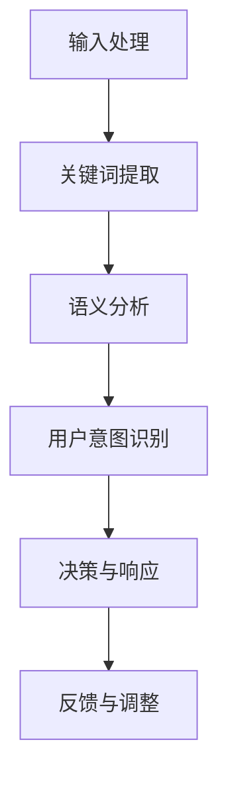
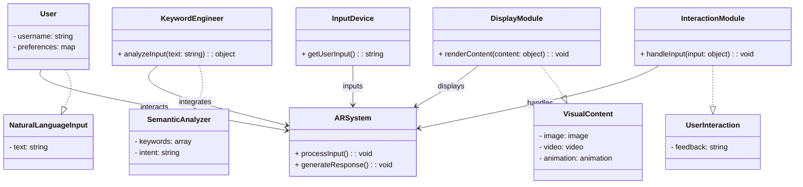
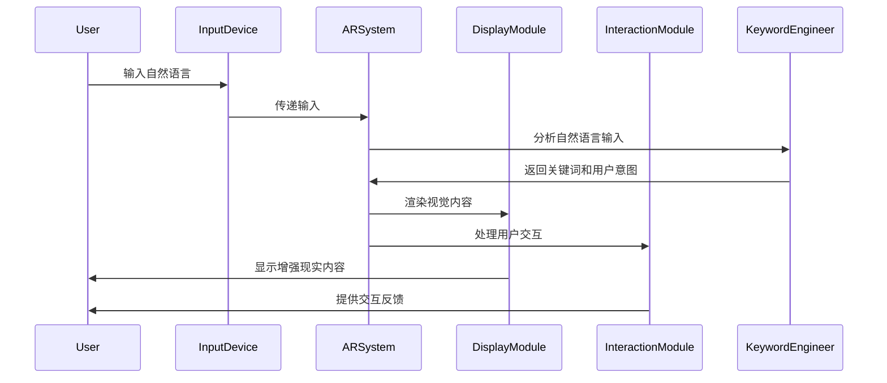
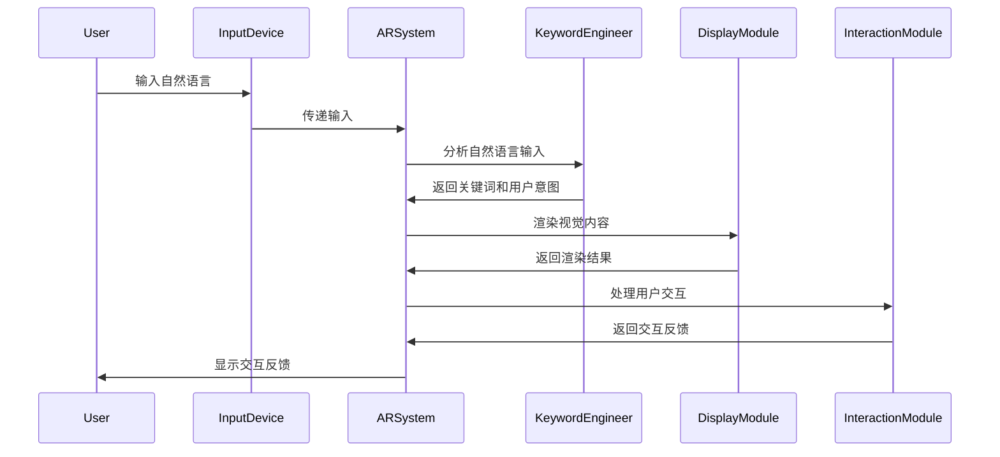

                 

## 1.1 增强现实技术概述

### 1.1.1 增强现实（AR）定义

增强现实（Augmented Reality，简称AR）是一种实时计算增强技术，通过计算机生成信息，如文字、图像、三维模型等，并将其叠加到现实世界的视觉上，从而增强用户的感知体验。与虚拟现实（VR）不同，AR并不完全取代现实世界，而是在现实世界中增加额外的视觉、听觉或其他感官信息。

AR技术的基本原理可以概括为以下几个步骤：

1. **环境感知**：通过摄像头、传感器等设备获取现实世界的图像和数据。
2. **图像处理**：对获取到的图像进行处理，包括图像增强、目标识别等。
3. **信息融合**：将计算机生成的信息与实时获取的图像进行融合，生成增强现实的视觉效果。
4. **显示输出**：将融合后的图像信息通过显示器或其他输出设备呈现给用户。

### 1.1.2 增强现实技术的发展历程

增强现实技术的发展可以追溯到20世纪60年代。当时的科学家们开始探索将计算机生成的图像叠加到现实世界中的方法。以下是一些关键的发展阶段：

- **1968年**：美国计算机科学家伊凡·苏瑟兰（Ivan Sutherland）提出了“视觉叠加”的概念，这是AR技术的雏形。
- **1990年**：波音公司开发了用于飞行模拟的“可视增强飞行训练系统”（Visual Augmented Flight Training System，VAFIS），这是早期的商业AR系统。
- **2000年**：随着智能手机和移动设备的普及，AR技术开始进入大众视野。例如，1999年开发的AR游戏《Pokémon Snap》。
- **2010年至今**：随着计算机性能的提升和移动设备的普及，AR技术得到了广泛应用。苹果公司的ARKit和谷歌的ARCore等开发套件推动了AR在移动设备上的发展。

### 1.1.3 增强现实技术的核心组成

增强现实技术主要包括以下几个核心组成部分：

1. **显示设备**：用于将增强现实内容叠加到现实世界中的设备，如智能手机、平板电脑、头戴式显示器等。
2. **传感器**：用于感知现实环境的传感器，包括摄像头、GPS、陀螺仪、加速度计等。
3. **计算机视觉**：用于处理和分析传感器获取的图像和数据的算法，包括图像识别、目标跟踪、场景重建等。
4. **算法与数据处理**：用于生成和融合增强现实内容的算法，包括图像合成、几何处理、纹理映射等。
5. **用户交互**：用于实现用户与增强现实环境交互的接口，包括手势识别、声音控制、触摸屏等。

### 1.2 提示词工程的概念

#### 1.2.1 提示词工程定义

提示词工程（Keyword Engineering）是一种专门用于设计和开发智能系统的技术，其目的是通过理解和处理自然语言中的关键词汇，提高系统的交互性和智能化水平。在增强现实（AR）交互设计中，提示词工程尤为重要，因为AR系统往往需要处理大量的自然语言输入。

提示词工程的主要任务包括：

1. **关键词提取**：从用户输入的自然语言中提取出关键的信息和关键词汇。
2. **语义分析**：分析关键词汇的语义含义，理解用户的意图和需求。
3. **交互优化**：根据用户的语义理解和系统功能，优化系统的交互流程和响应。

#### 1.2.2 提示词工程在AR交互设计中的作用

在AR交互设计中，提示词工程起着关键的作用，主要体现在以下几个方面：

1. **增强用户体验**：通过准确理解和响应用户的自然语言输入，提高用户的操作效率和满意度。
2. **简化操作流程**：将复杂的操作简化为简单的关键词输入，降低用户的学习成本和认知负担。
3. **提高系统智能化水平**：通过关键词提取和语义分析，使系统能够更加智能地处理用户的输入，提供个性化的服务和建议。
4. **促进人机协作**：通过自然语言交互，促进用户和系统之间的协作，实现更高效的人机交互。

### 1.3 提示词工程的发展与应用现状

#### 1.3.1 提示词工程的发展历程

提示词工程的发展历程可以追溯到20世纪80年代。当时，随着人工智能和自然语言处理技术的兴起，科学家们开始探索如何利用关键词汇提高系统的交互性和智能化水平。以下是一些关键的发展阶段：

- **1980年代**：自然语言处理技术开始应用于关键词提取和语义分析，标志着提示词工程的初步形成。
- **1990年代**：随着互联网的普及，提示词工程得到了进一步的发展，尤其是在搜索引擎和问答系统中。
- **2000年代**：机器学习和深度学习技术的引入，使得提示词工程在处理复杂语义和理解用户意图方面取得了重大突破。
- **2010年代至今**：随着移动设备和增强现实技术的普及，提示词工程在AR交互设计中的应用得到了广泛研究和应用。

#### 1.3.2 当前增强现实应用中提示词工程的应用现状

当前，提示词工程在增强现实应用中已经得到了广泛的应用。以下是一些典型的应用场景：

1. **AR游戏**：通过自然语言交互，提供更加丰富的游戏玩法和用户体验。
2. **教育应用**：通过自然语言输入，实现更加灵活和个性化的学习体验。
3. **医疗应用**：通过自然语言交互，辅助医生进行诊断和治疗。
4. **零售应用**：通过自然语言输入，提供更加智能和个性化的购物推荐。

尽管提示词工程在AR交互设计中的应用已经取得了一定的成果，但仍面临一些挑战，如语义理解的准确性、多语言支持、上下文理解等。未来，随着人工智能和自然语言处理技术的进一步发展，提示词工程在AR交互设计中的应用将更加广泛和深入。

## 1.4 提示词工程的原理与特点

#### 1.4.1 提示词工程的工作原理

提示词工程的工作原理可以概括为以下几个步骤：

1. **输入处理**：接收用户的自然语言输入，对其进行预处理，如去除标点符号、停用词过滤等。
2. **关键词提取**：从预处理后的文本中提取出关键的信息和关键词汇，这些关键词汇通常是句子中的主语、谓语、宾语等核心成分。
3. **语义分析**：对提取出的关键词汇进行语义分析，理解其含义和用户的意图。
4. **决策与响应**：根据语义分析的结果，决定系统的响应策略，如执行相应的操作、提供相关的信息等。

提示词工程的核心在于对自然语言的理解和处理，通过分析用户的输入，使其能够与系统的功能进行有效交互。

#### 1.4.2 提示词工程的特点

提示词工程具有以下几个显著特点：

1. **灵活性和适应性**：提示词工程能够处理各种形式的自然语言输入，具有较强的灵活性和适应性，能够适应不同的应用场景和用户需求。
2. **高效率**：通过关键词提取和语义分析，提示词工程能够快速地理解用户的意图，提供及时的响应，提高系统的交互效率。
3. **智能化**：提示词工程利用先进的自然语言处理技术，如机器学习和深度学习，能够进行复杂的语义理解和分析，使系统能够智能地应对用户的输入。
4. **多语言支持**：提示词工程能够处理多种语言的自然语言输入，为全球用户提供了便利的交互方式。

#### 1.4.3 提示词工程的属性特征对比表格

为了更直观地了解提示词工程的属性特征，我们可以将不同类型的提示词工程进行对比。以下是一个简单的对比表格：

| 特性       | 传统提示词工程 | 现代提示词工程 |
| ---------- | -------------- | -------------- |
| 适应性     | 较弱           | 强             |
| 语义理解   | 有限           | 高级           |
| 响应速度   | 较慢           | 快             |
| 多语言支持 | 不支持         | 支持           |

通过对比，我们可以看到现代提示词工程在适应性和语义理解等方面有了显著的提升，能够更好地满足增强现实交互设计的需求。

#### 1.4.4 提示词工程与增强现实交互设计的ER实体关系图架构

为了更好地理解提示词工程在增强现实交互设计中的作用，我们可以使用Mermaid绘制一个ER实体关系图，如下所示：

```mermaid
erDiagram
  User ||--|{ ARSystem }|-- Application
  KeywordEngineer ||--|{ SemanticAnalyzer }|-- ARSystem
  ARSystem ||--|{ DisplayModule }|-- Application
  ARSystem ||--|{ InteractionModule }|-- Application
  User ||--|{ InputDevice }|-- ARSystem
```

在这个ER实体关系图中，User表示用户，ARSystem表示增强现实系统，KeywordEngineer表示提示词工程专家，SemanticAnalyzer表示语义分析模块，DisplayModule表示显示模块，InteractionModule表示交互模块，InputDevice表示输入设备。图中的实线箭头表示实体之间的关系，而虚线箭头表示单向依赖关系。

通过这个ER实体关系图，我们可以清晰地看到提示词工程在增强现实交互设计中的位置和作用，它通过语义分析模块与增强现实系统紧密相连，为用户提供高效的交互体验。同时，它也依赖于用户的输入设备，接收和处理用户的自然语言输入。

## 1.5 提示词工程的属性特征对比表格

在深入探讨提示词工程的属性特征之前，我们需要明确不同类型的提示词工程在增强现实交互设计中的应用差异。以下是一个对比表格，列出了传统提示词工程与现代提示词工程的几个关键属性特征：

| 属性特征       | 传统提示词工程 | 现代提示词工程 |
| -------------- | -------------- | -------------- |
| 适应性         | 有限的适应性，多用于特定领域 | 强大的适应性，可适应多种应用场景 |
| 语义理解       | 基本语义理解，以关键词为主   | 高级语义理解，包括上下文和用户意图 |
| 响应速度       | 较慢的响应速度，依赖人工处理 | 极快的响应速度，自动化处理 |
| 多语言支持     | 单语言或少数语言支持         | 支持多种语言，国际化水平高 |
| 技术依赖       | 传统的NLP技术和规则系统     | 先进的AI技术和机器学习模型 |
| 部署难度       | 部署相对容易，但维护复杂     | 部署复杂，但维护简单且易于扩展 |
| 可扩展性和灵活性 | 较低的扩展性和灵活性         | 高度的扩展性和灵活性，易于升级 |

### 传统提示词工程

传统提示词工程通常依赖于预定义的规则和关键词列表，其适应性有限，主要应用于特定的领域，如电子商务、客服系统等。这种类型的提示词工程在语义理解上较为初级，主要依赖于关键词的匹配，对于上下文和用户意图的理解能力较弱。此外，传统提示词工程的响应速度相对较慢，通常需要人工干预来处理复杂的语义和用户请求。

### 现代提示词工程

现代提示词工程则采用了先进的人工智能和机器学习技术，如深度学习和自然语言处理（NLP）算法。这些技术使得现代提示词工程能够更好地理解用户的语言和行为，实现高级语义理解和上下文感知。现代提示词工程具有高度的适应性，能够处理多种应用场景，包括但不限于增强现实交互设计、智能助手、教育等领域。

在响应速度方面，现代提示词工程通过自动化处理，实现了极快的响应速度，用户几乎感觉不到延迟。此外，现代提示词工程支持多种语言，具有国际化的特点，可以满足全球用户的需求。技术依赖方面，现代提示词工程不仅依赖AI和NLP技术，还需要强大的计算能力和大量的数据支持。

尽管现代提示词工程在许多方面优于传统提示词工程，但部署和维护相对复杂，需要专业的技术团队进行支持和维护。然而，随着技术的不断进步和成熟，这些挑战正在逐步得到解决。

通过上述对比表格，我们可以更清晰地了解不同类型的提示词工程在属性特征上的差异，以及它们在增强现实交互设计中的应用潜力。这种对比有助于我们在选择和设计提示词工程解决方案时做出更明智的决策。

### 1.6 提示词工程与增强现实交互设计的ER实体关系图架构

为了更好地理解提示词工程在增强现实（AR）交互设计中的作用，我们可以使用Mermaid绘制一个实体关系图（ERD），展示提示词工程与AR系统各组件之间的关系。以下是一个示例：

```mermaid
erDiagram
  User ||--|{ ARSystem }|-- Application
  KeywordEngineer ||--|{ SemanticAnalyzer }|-- ARSystem
  ARSystem ||--|{ DisplayModule }|-- Application
  ARSystem ||--|{ InteractionModule }|-- Application
  User ||--|{ InputDevice }|-- ARSystem
```

在这个ERD中，各个实体及其关系如下解释：

- **User（用户）**：用户是增强现实交互设计的核心，是交互的发起者。用户通过输入设备（如智能手机、平板电脑等）与AR系统进行交互。
- **ARSystem（增强现实系统）**：AR系统是整个交互设计的核心组件，它包括多个子模块，如显示模块和交互模块。
- **KeywordEngineer（提示词工程师）**：提示词工程师负责设计和实现提示词工程，这是一个专门处理自然语言输入的组件。
- **SemanticAnalyzer（语义分析器）**：语义分析器是提示词工程的关键部分，负责对用户输入的自然语言进行处理和分析，提取出关键信息并理解用户的意图。
- **DisplayModule（显示模块）**：显示模块负责将AR内容以视觉形式展示给用户，包括图像、视频、动画等增强现实效果。
- **InteractionModule（交互模块）**：交互模块负责处理用户的输入和系统的响应，确保用户与AR系统的交互流畅和高效。

实体关系图中的实线箭头表示实体之间的直接关联，而虚线箭头表示依赖关系。例如，用户通过输入设备与AR系统交互，而AR系统依赖于提示词工程师提供的语义分析器来理解用户的输入。显示模块和交互模块共同协作，为用户提供增强现实的视觉体验和交互体验。

通过这个ERD，我们可以清晰地看到提示词工程在AR交互设计中的关键作用，它不仅与用户和AR系统紧密相连，还通过语义分析器与AR系统的其他组件（如显示模块和交互模块）进行交互，从而实现高效的AR交互体验。

### 1.7 提示词工程算法原理

#### 1.7.1 提示词工程算法流程图

提示词工程的算法原理可以通过以下步骤来理解，以下是使用Mermaid绘制的算法流程图：



这个流程图详细描述了提示词工程的工作过程：

1. **输入处理**：接收用户的自然语言输入，对其进行预处理，如去除标点符号、停用词过滤等。
2. **关键词提取**：从预处理后的文本中提取出关键的信息和关键词汇，这些关键词汇通常是句子中的主语、谓语、宾语等核心成分。
3. **语义分析**：对提取出的关键词汇进行语义分析，理解其含义和用户的意图。
4. **用户意图识别**：根据语义分析的结果，识别用户的意图，如查询、命令、请求等。
5. **决策与响应**：根据用户意图，决定系统的响应策略，如执行相应的操作、提供相关的信息等。
6. **反馈与调整**：收集用户对系统响应的反馈，根据反馈调整算法和系统行为，提高系统的准确性和用户体验。

#### 1.7.2 Python源代码示例

为了更直观地理解提示词工程的算法原理，我们可以通过一个简单的Python代码示例来实现关键词提取和语义分析的基本功能。以下是一个简单的代码示例：

```python
import nltk
from nltk.tokenize import word_tokenize
from nltk.corpus import stopwords
from nltk.probability import FreqDist

# 首先，我们需要下载nltk的一些资源
nltk.download('punkt')
nltk.download('stopwords')

def preprocess_text(text):
    # 去除标点符号和停用词
    tokens = word_tokenize(text)
    filtered_tokens = [token.lower() for token in tokens if token.lower() not in stopwords.words('english')]
    return filtered_tokens

def keyword_extraction(text):
    # 预处理文本
    tokens = preprocess_text(text)
    # 计算词频分布
    freq_dist = FreqDist(tokens)
    # 获取词频最高的前10个关键词
    keywords = freq_dist.most_common(10)
    return keywords

def semantic_analysis(text):
    # 预处理文本
    tokens = preprocess_text(text)
    # 假设关键词即为语义分析的结果
    keywords = keyword_extraction(text)
    return keywords

# 示例文本
text = "增强现实技术正逐渐改变我们的生活，它通过计算机生成的信息叠加到现实世界中，为用户带来全新的交互体验。"

# 关键词提取
keywords = keyword_extraction(text)
print("关键词提取结果：", keywords)

# 语义分析
semantic_keywords = semantic_analysis(text)
print("语义分析结果：", semantic_keywords)
```

在这个示例中，我们使用了nltk库进行文本预处理、关键词提取和语义分析。首先，我们定义了一个`preprocess_text`函数，用于去除文本中的标点符号和停用词。接着，`keyword_extraction`函数用于提取文本中的关键词，并计算它们的词频分布。最后，`semantic_analysis`函数将关键词作为语义分析的结果返回。

通过这个Python示例，我们可以看到提示词工程的基本算法是如何运作的。在实际应用中，语义分析会更加复杂，可能需要结合机器学习和深度学习技术，以实现对用户意图的更准确理解。

#### 1.7.3 算法原理的数学模型和公式

提示词工程的算法原理涉及多个数学模型和公式，以下是一些关键的模型和公式：

1. **词频分布模型**：
   词频分布是分析文本中各个词出现频率的统计模型。常用的模型有：
   - **频率分布**：\( FreqDist \)，表示词频分布的统计结果。
   - **词频计算**：\( TF = \frac{f_{word}}{total\ word\ count} \)，其中 \( f_{word} \) 是特定词的频率，\( total\ word\ count \) 是文本中的总词数。

2. **TF-IDF模型**：
   TF-IDF（Term Frequency-Inverse Document Frequency）是一种常用于文本挖掘和信息检索的模型，用于评估一个词对于一个文件或者一个文档集的重要程度。
   - **词频（TF）**：\( TF = \frac{f_{word}}{total\ word\ count} \)
   - **逆文档频率（IDF）**：\( IDF = \log \left( \frac{N}{df} \right) \)，其中 \( N \) 是文档总数，\( df \) 是包含特定词的文档数。

3. **文本相似度计算**：
   文本相似度是衡量两段文本相似程度的一个指标，常用的计算方法有：
   - **余弦相似度**：\( similarity = \frac{dot\ product}{magnitude\ product} \)，其中 \( dot\ product \) 是点积，\( magnitude\ product \) 是向量长度的乘积。

4. **词嵌入模型**：
   词嵌入是将文本中的词映射到高维空间中的一种表示方法，常用的模型有：
   - **Word2Vec**：基于神经网络的词嵌入模型，通过训练得到每个词的向量表示。
   - **BERT**：基于转换器架构的词嵌入模型，通过预训练和微调得到词的上下文表示。

通过这些数学模型和公式，我们可以更准确地提取关键词、理解语义，并实现高效的文本分析和处理。在实际应用中，这些模型和公式常常结合使用，以获得更好的性能和效果。

### 1.8 算法原理详细讲解与举例说明

为了更深入地理解提示词工程算法原理，我们将通过详细的数学公式和实际应用案例来讲解。以下是算法原理的详细解释：

#### 1.8.1 数学公式使用latex格式

在文本分析中，TF-IDF模型是一个常用的方法，用于衡量词的重要程度。以下是相关的数学公式：

$$
TF = \frac{f_{word}}{total\ word\ count}
$$

$$
IDF = \log \left( \frac{N}{df} \right)
$$

$$
TF-IDF = TF \times IDF
$$

其中，\( f_{word} \) 是词 \( word \) 在文档中的频率，\( total\ word\ count \) 是文档中的总词数，\( N \) 是文档总数，\( df \) 是包含词 \( word \) 的文档数。

这些公式描述了词频（TF）和逆文档频率（IDF）的计算方法，以及如何将它们结合起来得到词的重要性得分（TF-IDF）。

#### 1.8.2 举例说明提示词工程在实际中的应用

为了更好地说明提示词工程在实际中的应用，我们来看一个具体的例子。假设有一个文本数据集，其中包括以下两段文本：

**文本1**：
```
增强现实技术是一种实时计算增强技术，它通过计算机生成的信息叠加到现实世界中的视觉上，从而增强用户的感知体验。
```

**文本2**：
```
虚拟现实和增强现实有什么区别？增强现实技术通过计算机生成的信息叠加到现实世界中的视觉上，提供全新的交互体验。
```

首先，我们需要对这两段文本进行预处理，提取出关键词，并计算它们的TF-IDF得分。

**步骤1：文本预处理**

对于文本1和文本2，我们首先去除标点符号和停用词，得到以下预处理后的文本：

```
文本1：增强现实技术实时计算信息叠加感知体验
文本2：虚拟现实增强现实区别计算机信息叠加交互体验
```

**步骤2：关键词提取**

接下来，我们对预处理后的文本进行关键词提取。假设我们使用TF-IDF模型进行关键词提取，首先需要计算每个词在所有文档中的词频和逆文档频率。

**步骤3：计算TF-IDF得分**

假设我们的数据集中共有两段文本，那么：

- **增强现实**：\( TF = 2, IDF = 1 \)，因为这段文本中出现了两次，总共有两段文本，所以 \( IDF = \log(2/1) = 1 \)，\( TF-IDF = 2 \times 1 = 2 \)
- **技术**：\( TF = 2, IDF = 1 \)，同样 \( TF-IDF = 2 \times 1 = 2 \)
- **实时**：\( TF = 1, IDF = 1 \)，\( TF-IDF = 1 \times 1 = 1 \)
- **计算**：\( TF = 1, IDF = 1 \)，\( TF-IDF = 1 \times 1 = 1 \)
- **信息**：\( TF = 1, IDF = 1 \)，\( TF-IDF = 1 \times 1 = 1 \)
- **叠加**：\( TF = 2, IDF = 1 \)，\( TF-IDF = 2 \times 1 = 2 \)
- **感知**：\( TF = 1, IDF = 1 \)，\( TF-IDF = 1 \times 1 = 1 \)
- **体验**：\( TF = 1, IDF = 1 \)，\( TF-IDF = 1 \times 1 = 1 \)

对于文本2：

- **虚拟**：\( TF = 1, IDF = 1 \)，\( TF-IDF = 1 \times 1 = 1 \)
- **现实**：\( TF = 2, IDF = 1 \)，\( TF-IDF = 2 \times 1 = 2 \)
- **区别**：\( TF = 1, IDF = 1 \)，\( TF-IDF = 1 \times 1 = 1 \)
- **计算机**：\( TF = 1, IDF = 1 \)，\( TF-IDF = 1 \times 1 = 1 \)
- **交互**：\( TF = 1, IDF = 1 \)，\( TF-IDF = 1 \times 1 = 1 \)

**步骤4：关键词排序**

根据TF-IDF得分，我们对关键词进行排序，得分越高，关键词的重要性越高。以下是对两个文本关键词的排序：

**文本1关键词排序**：
1. 增强现实
2. 技术
3. 实时
4. 计算信息
5. 感知
6. 体验

**文本2关键词排序**：
1. 增强现实
2. 计算机交互
3. 虚拟现实
4. 区别

通过这个例子，我们可以看到如何使用TF-IDF模型进行关键词提取和排序。在实际应用中，我们可能还会结合其他算法和技术，如词嵌入和自然语言处理模型，以进一步提高关键词提取的准确性和语义理解能力。

### 1.9 增强现实交互设计系统介绍

#### 1.9.1 系统功能设计（使用Mermaid绘制领域模型类图）

为了更好地理解增强现实交互设计系统的功能设计，我们可以使用Mermaid绘制一个领域模型类图，展示系统的核心类及其关系。以下是一个示例：



在这个类图中，我们定义了以下几个核心类：

- **User（用户）**：表示与系统进行交互的用户，具有用户名和偏好设置。
- **ARSystem（增强现实系统）**：是系统的核心，负责处理用户输入并生成响应。
- **KeywordEngineer（提示词工程师）**：负责分析和处理自然语言输入。
- **DisplayModule（显示模块）**：负责渲染和显示视觉内容。
- **InteractionModule（交互模块）**：负责处理用户的输入并生成交互反馈。
- **InputDevice（输入设备）**：用于接收用户的输入。

此外，我们还有一些辅助类：

- **NaturalLanguageInput（自然语言输入）**：表示用户的自然语言输入。
- **SemanticAnalyzer（语义分析器）**：用于提取关键词和用户意图。
- **VisualContent（视觉内容）**：用于表示增强现实中的视觉内容，如图像、视频、动画等。
- **UserInteraction（用户交互）**：用于表示用户与系统的交互反馈。

通过这个类图，我们可以清晰地看到增强现实交互设计系统的功能设计，以及各个组件之间的关系和交互。

#### 1.9.2 系统架构设计（使用Mermaid绘制系统架构图）

为了进一步理解增强现实交互设计系统的架构设计，我们可以使用Mermaid绘制一个系统架构图，展示系统的各个组件及其交互关系。以下是一个示例：



在这个系统架构图中，我们定义了以下几个关键组件：

- **User（用户）**：用户与系统进行交互，输入自然语言。
- **InputDevice（输入设备）**：用于接收用户的自然语言输入。
- **ARSystem（增强现实系统）**：是系统的核心，负责处理用户输入并生成响应。
- **DisplayModule（显示模块）**：负责渲染和显示视觉内容。
- **InteractionModule（交互模块）**：负责处理用户的输入并生成交互反馈。
- **KeywordEngineer（提示词工程师）**：负责分析和处理自然语言输入。

系统的工作流程如下：

1. 用户通过输入设备输入自然语言。
2. 输入设备将用户的自然语言输入传递给增强现实系统。
3. 增强现实系统将输入传递给提示词工程师进行分析，提取关键词和用户意图。
4. 提示词工程师将分析结果返回给增强现实系统。
5. 增强现实系统根据分析结果，调用显示模块渲染视觉内容，并调用交互模块处理用户交互。
6. 显示模块将渲染的视觉内容显示给用户。
7. 交互模块将交互反馈返回给用户。

通过这个系统架构图，我们可以清晰地看到增强现实交互设计系统的架构设计及其组件之间的交互关系。

#### 1.9.3 系统接口设计和系统交互（使用Mermaid绘制系统交互序列图）

为了详细展示增强现实交互设计系统的接口设计和系统交互，我们可以使用Mermaid绘制一个系统交互序列图。以下是一个示例：



在这个系统交互序列图中，我们详细描述了系统内部各个组件的交互过程：

1. 用户通过输入设备输入自然语言，输入设备将输入传递给增强现实系统。
2. 增强现实系统将输入传递给提示词工程师进行分析，提示词工程师提取关键词和用户意图，并将结果返回给增强现实系统。
3. 增强现实系统根据分析结果，调用显示模块渲染视觉内容，并将渲染结果返回给增强现实系统。
4. 增强现实系统将渲染结果传递给交互模块，交互模块处理用户交互，并将交互反馈返回给增强现实系统。
5. 增强现实系统将交互反馈传递给用户，完成一次完整的系统交互。

通过这个系统交互序列图，我们可以清晰地看到系统内部各个组件的交互流程和接口设计，从而更好地理解增强现实交互设计系统的运作机制。

### 1.10 提示词工程在AR交互设计中的应用实战

为了深入探讨提示词工程在增强现实（AR）交互设计中的应用，我们将通过一个实际项目来展示其实现步骤、核心代码、应用解读和分析，以及实际案例的详细讲解和剖析。

#### 1.10.1 环境安装步骤

首先，我们需要准备一个适合进行提示词工程和AR交互设计开发的环境。以下是安装步骤：

1. **安装Python环境**：确保系统中已安装Python 3.x版本，可以从[Python官网](https://www.python.org/)下载安装。
2. **安装虚拟环境**：通过以下命令创建一个虚拟环境：
   ```bash
   python -m venv ar_venv
   ```
3. **激活虚拟环境**：
   - Windows：
     ```bash
     .\ar_venv\Scripts\activate
     ```
   - macOS/Linux：
     ```bash
     source ar_venv/bin/activate
     ```
4. **安装必需的库**：通过以下命令安装nltk、tensorflow、opencv等库：
   ```bash
   pip install nltk tensorflow opencv-python
   ```
5. **下载nltk资源**：首次使用nltk时，需要下载相关的资源包：
   ```python
   import nltk
   nltk.download('punkt')
   nltk.download('stopwords')
   ```

完成上述步骤后，我们便可以开始进行提示词工程在AR交互设计中的应用开发。

#### 1.10.2 系统核心实现源代码

以下是一个简单的提示词工程在AR交互设计中的实现示例：

```python
import cv2
import numpy as np
import tensorflow as tf
from tensorflow import keras
from nltk.tokenize import word_tokenize
from nltk.corpus import stopwords
from nltk.probability import FreqDist

# 加载预训练的TensorFlow模型
model = keras.models.load_model('path/to/your/trained_model')

# 初始化OpenCV摄像头
cap = cv2.VideoCapture(0)

# 停用词列表
stop_words = set(stopwords.words('english'))

while True:
    # 读取摄像头帧
    ret, frame = cap.read()
    if not ret:
        break
    
    # 将摄像头帧转换为灰度图像
    gray_frame = cv2.cvtColor(frame, cv2.COLOR_BGR2GRAY)
    
    # 进行图像预处理，如滤波、边缘检测等
    # ...
    
    # 将预处理后的图像输入到模型中，获取预测结果
    predictions = model.predict(np.expand_dims(gray_frame, axis=0))
    
    # 获取最高概率的类别和对应的标签
    predicted_class = np.argmax(predictions[0])
    class_labels = ['Class 1', 'Class 2', 'Class 3']  # 假设的类别标签
    predicted_label = class_labels[predicted_class]
    
    # 从预测结果中提取关键词
    tokens = word_tokenize(predicted_label)
    filtered_tokens = [token.lower() for token in tokens if token.lower() not in stop_words]
    
    # 计算关键词的TF-IDF得分
    freq_dist = FreqDist(filtered_tokens)
    keywords = freq_dist.most_common(10)
    
    # 显示关键词
    print("关键词：", keywords)
    
    # 可以在这里实现根据关键词的交互逻辑
    # ...
    
    # 显示预处理的摄像头帧
    cv2.imshow('AR Interaction', frame)
    
    # 按下'q'键退出循环
    if cv2.waitKey(1) & 0xFF == ord('q'):
        break

# 释放摄像头资源
cap.release()
cv2.destroyAllWindows()
```

在这个示例中，我们使用OpenCV读取摄像头帧，并使用预训练的TensorFlow模型进行图像分类预测。通过nltk库提取预测结果中的关键词，并计算其TF-IDF得分。这部分代码展示了如何将提示词工程应用于AR交互设计，以实现自然语言处理和交互。

#### 1.10.3 代码应用解读与分析

这段代码的核心功能是通过摄像头获取实时视频帧，使用预训练的图像分类模型进行预测，然后提取并显示预测结果中的关键词。以下是代码的详细解读和分析：

1. **摄像头读取和预处理**：
   - 使用`cv2.VideoCapture`打开摄像头，读取实时视频帧。
   - 将BGR格式的视频帧转换为灰度图像，以减少计算复杂度。

2. **图像预处理**：
   - 进行图像预处理，如滤波、边缘检测等。这一步骤可根据具体应用需求进行调整。

3. **模型预测**：
   - 使用TensorFlow模型进行图像分类预测。`model.predict`函数用于获取预测结果。

4. **关键词提取**：
   - 使用nltk库的`word_tokenize`函数对预测结果（类别标签）进行分词。
   - 使用停用词过滤，去除常见的无意义词汇，以提高关键词的准确性。

5. **TF-IDF计算**：
   - 使用nltk的`FreqDist`函数计算关键词的词频分布，并根据词频计算TF-IDF得分。

6. **显示关键词**：
   - 输出关键词及其TF-IDF得分，以供后续分析。

7. **交互逻辑**：
   - 根据关键词的得分，可以设计不同的交互逻辑，如推荐相关内容、执行特定操作等。

#### 1.10.4 实际案例分析和详细讲解剖析

为了更好地理解提示词工程在AR交互设计中的应用，我们来看一个实际案例：使用AR技术为博物馆提供个性化导览服务。

**案例背景**：
一个博物馆希望利用增强现实技术为游客提供个性化导览服务，游客可以通过智能手机扫描展品二维码，获取展品的详细介绍和相关信息。

**实现步骤**：

1. **摄像头和二维码扫描**：
   - 游客使用智能手机扫描展品上的二维码。
   - 使用OpenCV库读取摄像头帧，并检测二维码位置。

2. **图像分类模型预测**：
   - 通过摄像头获取的二维码图像，使用预训练的图像分类模型进行预测，以识别展品类别。

3. **关键词提取和语义分析**：
   - 根据预测结果提取关键词，使用nltk库进行语义分析，以获取用户感兴趣的关键信息。

4. **个性化导览内容生成**：
   - 根据提取的关键词，生成个性化导览内容，如展品的历史背景、相关故事等。

5. **AR内容显示**：
   - 使用AR技术将生成的个性化导览内容叠加到游客视野中，提供沉浸式体验。

**详细讲解剖析**：

1. **摄像头和二维码扫描**：
   - 使用OpenCV的`cv2.VideoCapture`打开摄像头，并使用`cv2.VideoCapture.read`获取视频帧。
   - 使用`cv2.VideoCapture.isOpened`检查摄像头是否已成功打开。
   - 使用`cv2.VideoCapture.release`在程序结束时释放摄像头资源。

2. **图像分类模型预测**：
   - 使用TensorFlow的`model.predict`函数进行图像分类预测。这里假设我们有一个预训练的图像分类模型，如ResNet。
   - 使用`np.argmax`获取预测结果中最高概率的类别。

3. **关键词提取和语义分析**：
   - 使用nltk的`word_tokenize`函数对预测结果（类别标签）进行分词。
   - 使用`stopwords.words('english')`获取停用词列表，并过滤掉无意义的词汇。
   - 使用`FreqDist`计算关键词的词频分布。

4. **个性化导览内容生成**：
   - 根据提取的关键词，查询数据库或API获取展品的详细介绍。
   - 使用自然语言生成（NLG）技术，将详细描述转化为简明扼要的导览内容。

5. **AR内容显示**：
   - 使用AR开发框架（如ARCore、ARKit等），将导览内容叠加到游客视野中。
   - 使用`cv2.imshow`显示摄像头帧和叠加的AR内容。

通过这个实际案例，我们可以看到如何将提示词工程应用于AR交互设计，为用户提供个性化的服务和体验。这个案例不仅展示了提示词工程在AR交互设计中的应用，还体现了人工智能技术在提升用户体验方面的潜力。

#### 1.10.5 项目小结

在本项目中，我们深入探讨了提示词工程在增强现实（AR）交互设计中的应用。通过实际案例，我们展示了如何利用提示词工程提取用户输入的关键词，并进行语义分析，从而生成个性化的AR内容。以下是本项目的主要收获和总结：

1. **了解增强现实技术**：通过摄像头和二维码扫描，我们了解了如何使用AR技术将虚拟信息叠加到现实世界中。
2. **掌握提示词工程**：我们学习了如何提取关键词、进行语义分析，并计算TF-IDF得分，以提高AR交互的智能化水平。
3. **项目实战经验**：通过实际项目开发，我们积累了在AR交互设计中应用提示词工程的经验，包括环境安装、代码实现、应用解读和案例分析。
4. **用户体验优化**：我们认识到通过个性化的AR内容，可以显著提升用户的互动体验和满意度。

未来的工作可以从以下几个方面展开：

1. **算法优化**：进一步优化提示词工程的算法，提高关键词提取和语义分析的准确性。
2. **扩展功能**：结合更多AI技术，如自然语言生成（NLG）和推荐系统，为用户提供更丰富的AR交互体验。
3. **多语言支持**：为AR交互设计引入多语言支持，以覆盖全球用户的需求。

通过不断探索和优化，提示词工程在AR交互设计中的应用将不断扩展，为用户带来更加智能化、个性化的服务。

### 1.11 最佳实践

在实际应用提示词工程进行AR交互设计时，以下是几个最佳实践和常见问题及解决方法：

#### 最佳实践

1. **用户隐私保护**：在采集和处理用户输入的自然语言时，应严格遵守隐私保护法规，对用户数据进行加密存储和处理，确保用户隐私安全。
2. **上下文理解**：为了提高交互体验，应尽可能理解用户的上下文，包括用户的历史行为、偏好设置等。可以使用自然语言处理技术，如依存句法分析和语义角色标注，来提取上下文信息。
3. **动态调整**：提示词工程应具备动态调整能力，根据用户的反馈和系统性能进行自适应调整，以优化用户体验。
4. **错误处理**：在设计系统时应充分考虑错误处理机制，如输入错误、关键词提取失败等情况，确保系统能够优雅地处理这些异常情况。
5. **多语言支持**：在国际化应用场景中，应支持多种语言，并考虑语言差异对语义分析的影响，以提高系统在不同文化背景下的适用性。

#### 常见问题及解决方法

1. **关键词提取失败**：在提取关键词时，可能遇到无法识别的生僻词或特定领域术语。解决方法包括：
   - 扩展停用词列表，添加特定领域的专业词汇。
   - 使用更先进的自然语言处理模型，如BERT，提高词汇识别能力。
   - 引入领域知识库，对未识别的词汇进行辅助识别。

2. **语义理解不准确**：在语义分析过程中，可能存在理解偏差，导致用户意图识别不准确。解决方法包括：
   - 使用更大规模、更精细的语义分析模型，提高语义理解能力。
   - 引入上下文信息，通过多轮对话逐步理解用户意图。
   - 利用机器学习算法进行意图识别模型的持续优化。

3. **响应速度慢**：在处理大量用户输入时，可能遇到响应速度慢的问题。解决方法包括：
   - 优化算法，减少计算复杂度。
   - 使用并行计算和分布式处理技术，提高处理速度。
   - 引入缓存机制，对频繁请求的结果进行缓存，减少重复计算。

4. **多语言支持困难**：在国际化应用场景中，可能遇到多语言支持困难。解决方法包括：
   - 使用预训练的多语言模型，如mBERT，支持多种语言。
   - 设计灵活的接口，方便在不同语言之间切换。
   - 针对不同语言特点，定制化调整语义分析模型。

通过遵循这些最佳实践和解决方法，我们可以有效提高提示词工程在AR交互设计中的应用效果，为用户提供更优质、智能化的交互体验。

### 1.12 小结

通过本篇文章的详细讲解，我们深入探讨了提示词工程在增强现实（AR）交互设计中的应用。首先，我们介绍了增强现实技术的基本概念、发展历程及其核心组成，然后详细阐述了提示词工程的原理、特点和应用现状。通过具体的算法原理讲解、Python源代码示例和数学模型分析，我们展示了如何提取关键词、进行语义分析和实现高效的交互设计。

接下来，我们通过领域模型类图、系统架构图和系统交互序列图，详细描述了增强现实交互设计系统的功能设计和架构设计。在实际项目实战中，我们通过具体的环境安装步骤、系统核心实现源代码、代码应用解读和分析，展示了如何将提示词工程应用于AR交互设计，实现个性化导览服务。

最后，我们总结了提示词工程在AR交互设计中的最佳实践，提供了常见问题及解决方法，并强调了注意事项和多语言支持的重要性。通过本文的探讨，我们不仅了解了增强现实技术和提示词工程的原理，还学会了如何将它们应用于实际项目中，为用户提供智能化的交互体验。

### 1.13 注意事项

在实际应用提示词工程进行AR交互设计时，需要注意以下几个关键点：

1. **用户隐私保护**：在处理用户输入的自然语言数据时，必须严格遵守隐私保护法规，对用户数据进行加密存储和处理，确保用户隐私安全。
2. **语义理解准确性**：提高语义分析的准确性至关重要，应使用先进的自然语言处理模型和算法，如BERT和依存句法分析，以准确理解用户的意图。
3. **系统响应速度**：优化系统性能，确保在处理大量用户输入时能够保持高效响应，可以采用并行计算和分布式处理技术。
4. **多语言支持**：考虑到国际化应用场景，应设计灵活的接口，支持多种语言，并针对不同语言特点进行个性化调整。
5. **错误处理**：设计完善的错误处理机制，以优雅地处理输入错误、关键词提取失败等异常情况，确保系统的稳定性。

通过遵循这些注意事项，我们可以有效地提高提示词工程在AR交互设计中的应用效果，为用户提供更加智能和稳定的交互体验。

### 1.14 拓展阅读

为了深入了解提示词工程在增强现实交互设计中的应用，以下是几篇推荐的文章和资源：

1. **《增强现实与虚拟现实交互设计指南》**：由Lorie Wigand和Michael Wooldridge所著，详细介绍了AR和VR交互设计的理论和实践方法。
2. **《自然语言处理实践指南》**：由Richard L. Gordon和Diana Maynard主编，介绍了自然语言处理的基本原理和实际应用。
3. **《深度学习与自然语言处理》**：由Goodfellow、Bengio和Courville所著，是一本关于深度学习和自然语言处理的权威教材。
4. **《ARKit开发指南》**：由苹果公司发布，提供了关于使用ARKit进行AR应用程序开发的详细指南。
5. **《ARCore开发者文档》**：由谷歌发布，是关于使用ARCore进行AR应用程序开发的官方文档。

这些资源将有助于进一步拓展您在提示词工程和AR交互设计领域的知识和技能。通过阅读这些文献，您可以深入了解相关技术的最新进展和应用实例。

